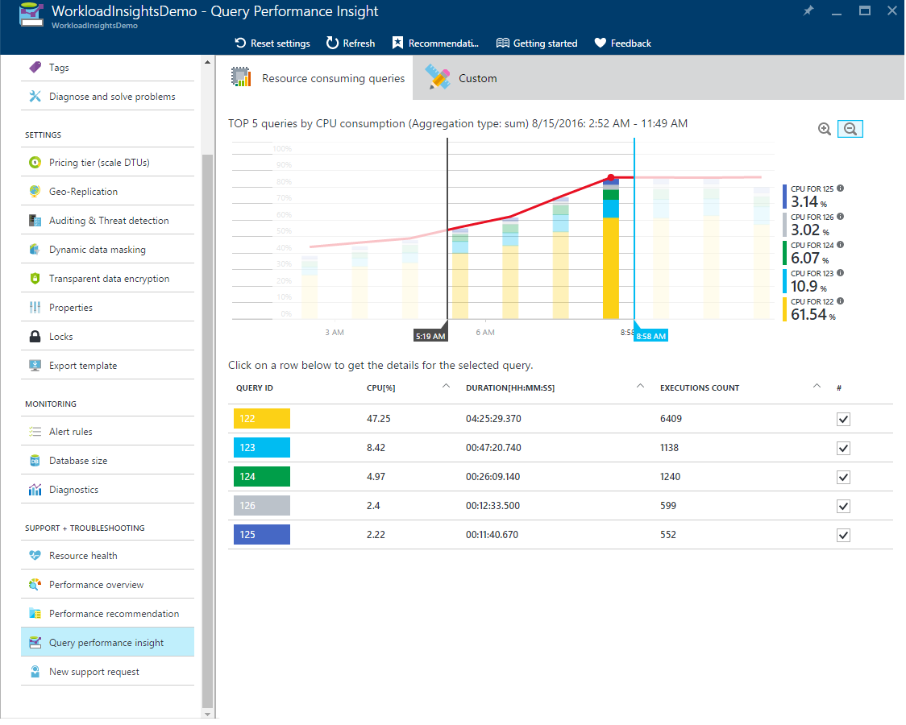
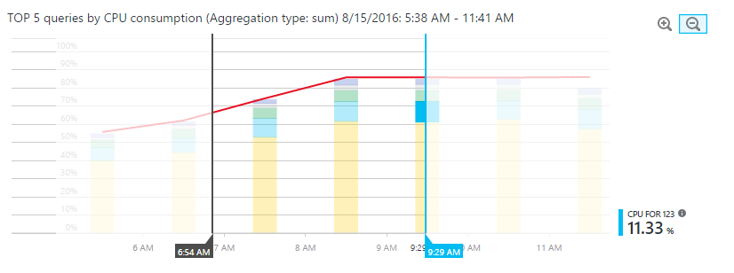
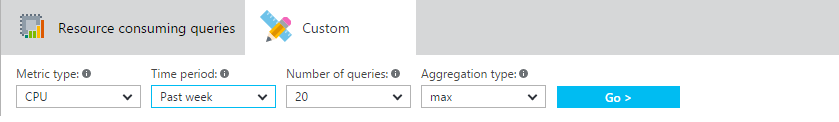
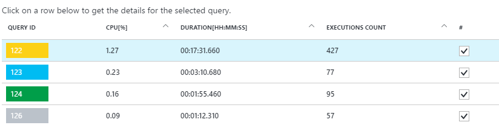

<properties 
   pageTitle="SQL Azure-Datenbank Abfrage Leistung Einblick" 
   description="Abfrage-Systemleistung identifiziert die meisten CPU-kompatiblen Abfragen für eine SQL Azure-Datenbank." 
   services="sql-database" 
   documentationCenter="" 
   authors="stevestein" 
   manager="jhubbard" 
   editor="monicar"/>

<tags
   ms.service="sql-database"
   ms.devlang="na"
   ms.topic="article"
   ms.tgt_pltfrm="na"
   ms.workload="data-management" 
   ms.date="08/09/2016"
   ms.author="sstein"/>

# SQL Azure-Datenbank Abfrage Leistung Einblick

Verwalten und optimieren die Leistung von relationalen Datenbanken ist eine Herausforderung, die wesentlichen und eine Uhrzeit Investition erforderlich ist. Abfrage Leistung Einblicke können Sie weniger Zeit Problembehandlung Datenbank Leistung Folgendes bereitgestellt:

- Tieferer Einblick in Ihre Datenbanken Ressourcenverbrauch (DTU). 
- Der erste Abfragen nach CPU-/ Dauer/Ausführung zählen, die potenziell zum Verbessern der Leistung optimiert werden können.
- Die Möglichkeit, Drilldown in die Details einer Abfrage, anzeigen, Text und Verlauf der Ressource Auslastung. 
- Leistung optimieren von Anmerkungen, die von [SQL Azure-Datenbank Advisor](sql-database-advisor.md) ausgeführte Aktionen anzeigen  

## Erforderliche Komponenten

- Die Leistung Einblick Abfrage ist nur mit Azure SQL-Datenbank V12 verfügbar.
- Abfrage Leistung Einblicke erfordert, dass die [Abfrage Store](https://msdn.microsoft.com/library/dn817826.aspx) in Ihrer Datenbank aktiv ist. Wenn die Abfrage Store nicht ausgeführt wird, fordert im Portal auf aktivieren.

 
## Berechtigungen

Die folgenden [Steuerung des Benutzerzugriffs rollenbasierte](../active-directory/role-based-access-control-configure.md) Berechtigungen sind erforderlich, die Leistung Einblick Abfrage verwenden: 

- **Reader**, **Besitzer**, **Mitwirkender**, **SQL DB Mitwirkender**oder **SQL Server-Teilnehmer** Berechtigungen sind erforderlich, zum Anzeigen des oberen Ressourcen in Anspruch nehmen Abfragen und Diagramme. 
- **Besitzer**, **Mitwirkender**, **SQL DB Mitwirkender**oder **SQL Server-Teilnehmer** Berechtigungen sind erforderlich, um Abfragetext anzuzeigen.

## Verwenden einen Einblick Abfrage-Leistung

Die Leistung Einblick Abfrage ist einfach zu verwenden:

- Öffnen Sie [Azure-Portal](https://portal.azure.com/) zu, und suchen Sie die Datenbank, die Sie untersuchen möchten. 
  - Wählen Sie auf der linken Bildschirmseite Menü unter Support und Problembehandlung "Abfrage Leistung Einblicke".
- Überprüfen Sie die Liste der erste Ressource Verarbeitung Abfragen auf der ersten Registerkarte.
- Wählen Sie eine einzelne Abfrage, um die Details anzuzeigen.
- Öffnen Sie [SQL Azure-Datenbank Advisor](sql-database-advisor.md) , und überprüfen Sie, ob alle Empfehlungen zur Verfügung stehen.
- Verwenden Sie die Schieberegler oder vergrößern Sie Symbole zum Ändern der beobachteten Intervall.

    

> [AZURE.NOTE] Einige Stunden von Daten nach dem Abfrage-Speicher für SQL-Datenbank, in der Abfrage Leistung Einblicke erfasst werden muss. Wenn die Datenbank keine Aktivität wird oder Abfrage Store während eines bestimmten Zeitraums nicht aktiv war, werden die Diagramme leer sein, wenn dieser Zeitraum anzeigen. Sie können zu einem beliebigen Zeitpunkt Abfrage speichern aktivieren, wenn er nicht ausgeführt wird.   

## Überprüfen Sie die obersten CPU Verarbeitung von Abfragen

Im [Portal](http://portal.azure.com) führen Sie folgende Schritte aus:

1. Navigieren Sie zu einer SQL-Datenbank und auf **Alle Einstellungen** > **Support + Problembehandlung** > **die Leistung Einblick Abfrage**. 

    ![Abfrage-Leistung einen Einblick][1]

    Öffnen der Abfragenansicht verwendete und die erste CPU-Abfragen in Anspruch nehmen aufgeführt sind.

1. Klicken Sie auf diese Option, um das Diagramm Details. Die oberste Zeile zeigt insgesamt DTU % für die Datenbank, während die Balken CPU% von den ausgewählten Abfragen während der ausgewählten Intervall verbraucht anzeigen (z. B., wenn der **letzten Woche** ausgewählt ist jeder Balken steht für einen Tag).

    ![erste Abfragen][2]

    Untersten Raster stellt aggregierten Informationen für die Abfragen sichtbaren.

  - Abfrage-ID – Eindeutiger Bezeichner der Abfrage in der Datenbank.
  - CPU pro Abfrage während sichtbare Intervall (je nach Aggregatfunktion).
  - Dauer pro Abfrage (je nach Aggregatfunktion).
  - Die Gesamtzahl der Ausführungen für eine bestimmte Abfrage.

    Aktivieren Sie oder deaktivieren Sie einzelne Abfragen zum ein- oder auszuschließen aus dem Diagramm mit Kontrollkästchen.

1. Wenn Ihre Daten veralten, klicken Sie auf die Schaltfläche **Aktualisieren** .
1. Mit Schieberegler können und Schaltflächen zum Ändern des Intervalls für Beobachtung und Untersuchen von Spitzen vergrößern:  
1. Wenn Sie eine andere Ansicht möchten, können Sie optional Registerkarte **Benutzerdefiniert** auswählen und festlegen:
  
  - Metrisch (CPU, Dauer, Ausführungsanzahl)
  - Zeitintervall (letzte 24 Stunden, letzte Woche, letzten Monat). 
  - Anzahl der Abfragen.
  - Aggregatfunktion.

    

## Anzeigen von Abfragedetails zu einzelnen

Abfragedetails anzeigen zu können:

1. Klicken Sie auf eine beliebige Abfrage in der Liste der erste Abfragen.

    

1. Die Detailansicht wird geöffnet und die Anzahl der Abfragen CPU-Verbrauch/Dauer/Ausführung über einen Zeitraum aufgeschlüsselt ist.
1. Klicken Sie auf diese Option, um das Diagramm Details.
  - Top-Diagramm zeigt die Linie mit generelle Datenbank DTU %, und die leisten werden CPU% verbraucht, indem Sie die ausgewählte Abfrage.
  - Im zweiten Diagramm zeigt Gesamtdauer, indem Sie die ausgewählte Abfrage.
  - Diagramm unten zeigt die Gesamtzahl der Ausführungen durch die ausgewählte Abfrage.
    
    ![Abfragedetails][3]

1. Optional, verwenden Sie die Schieberegler, Zoomen Sie Schaltflächen zum, oder klicken Sie auf **Einstellungen** anpassen, wie die Abfragedaten angezeigt werden, oder wählen Sie einen anderen Zeitraum.

## Überprüfen Sie die verwendete Abfragen pro Dauer

In der letzten Aktualisierung der Abfrage Leistung Einblicke werden soll, wir eingeführt werden zwei neue Kennzahlen, die Sie potenzielle Engstellen helfen können: Dauer und Ausführung zählen. 

Langer Abfragen haben die größte potenzieller für Ressourcen verlängern sperren, die andere Benutzer blockieren und Skalierbarkeit einschränken. Darüber sind hinaus die besten Kandidaten für eine Optimierung. 

Um zeitintensive Abfragen zu ermitteln:

1. Öffnen Sie die Registerkarte **Benutzerdefiniert** in die Leistung Einblick Abfrage für ausgewählte Datenbank
1. Ändern der **Dauer** werden Kennzahlen
1. Wählen Sie die Anzahl von Abfragen und Beobachtung Intervall
1. Wählen Sie die Aggregation (Funktion)
  - **Summe** addiert alle Ausführung der Abfrage während der gesamten Beobachtung Intervall.
  - **Max** findet Abfragen die Ausführung dauert gesamte Beobachtung Intervall maximale wurde.
  - **Mittelwert** findet alle Abfrage Ausführungen Mittelwert Ausführung Anzeigedauer, und blenden Sie Sie im oberen Bereich aus diesen Mittelwerten. 

    ![Abfragedauer][4]

## Überprüfen Sie die verwendete Abfragen pro Ausführung zählen

Hohe Anzahl der Ausführungen möglicherweise nicht Datenbank selbst beeinflussen und Ressourcenverwendung kann nicht genügend ab, doch insgesamt Anwendung möglicherweise langsam.

In einigen Fällen sehr hoch Ausführung zählen möglicherweise dazu führen, dass der vergrößern Schleifen Netzwerk. Schleifen wirken sich erheblich auf die Leistung aus. Sie sind unterliegen Netzwerkwartezeit und untergeordneten Serverwartezeit. 

Beispielsweise Zugriff auf viele Daten basierende Websites stark der Datenbank für jeden Benutzer Anforderung. Während der Verbindung Verbindungspooling hilft, die höhere Netzwerkverkehr und Belastung auf dem Datenbankserver die Leistung beeinträchtigen kann.  Allgemeine Ratschläge besteht darin, den Schleifen auf eine absolute Minimum beibehalten.

Wenn Sie häufig identifizieren die ausgeführt ("Ausführliche") Abfragen Abfragen aus:

1. Öffnen Sie die Registerkarte **Benutzerdefiniert** in die Leistung Einblick Abfrage für ausgewählte Datenbank
1. Ändern der Kennzahlen **Ausführung zählen** sein
1. Wählen Sie die Anzahl von Abfragen und Beobachtung Intervall

    ![Anzahl der abfrageausführung][5]

## Grundlegendes zu Leistung Videogeräten Anmerkungen 

Sie möglicherweise beim Untersuchen der Arbeitsbelastung im Abfrage-Leistung einen Einblick, Symbole mit vertikale Linie auf das Diagramm fest. 

Diese Symbole sind Anmerkungen; Sie repräsentieren Leistung Auswirkungen von [SQL Azure-Datenbank Advisor](sql-database-advisor.md)ausgeführte Aktionen. Durch hovering Anmerkungen erhalten Sie grundlegenden Informationen zu der Aktion aus:

![Abfrage Anmerkungen][6]

Wenn Sie mehr wissen oder Advisor Empfehlungen anwenden möchten, klicken auf das Symbol. Aktion Details wird geöffnet. Ist eine aktive Empfehlungen können Sie es direkt unterwegs Befehl anwenden.

![Anmerkung Abfragedetails][7]

### Mehrere Anmerkungen. ###

Es ist möglich, dass aufgrund Zoomfaktor, Anmerkungen, die sich dicht nebeneinander sind in einer reduziert erhalten werden. Dies wird durch spezielle Symbol dargestellt werden, indem Sie darauf Öffnen neuer Blade Stelle, an der Liste der Anmerkungen gruppiert werden angezeigt werden.
Abgleichen von Abfragen und Leistung optimieren von Aktionen kann dazu beitragen um Ihrer Arbeitsbelastung besser zu verstehen. 

##  Optimieren der Abfrage Store Konfigurations für die Leistung Einblick Abfrage

Während der Verwendung von Abfrage Leistung Einblick können Sie die folgenden Abfrage Store Nachrichten auftreten:

- "Store Abfrage nicht ordnungsgemäß für diese Datenbank konfiguriert ist. Hier klicken Sie, um weitere Informationen."
- "Store Abfrage nicht ordnungsgemäß für diese Datenbank konfiguriert ist. Klicken Sie hier zum Ändern der Einstellungen." 

Diese Nachrichten werden in der Regel beim Abfrage Store nicht neue Daten sammeln kann. 

Ersten Fall passiert Abfrage Store befindet sich im schreibgeschützten Zustand und Parameter optimal festgelegt sind. Sie können dies beheben, indem Sie vergrößern von Abfrage speichern aktivieren oder deaktivieren die Abfrage speichern.

![Qds-Schaltfläche][8]

Zweite Fall passiert Store Abfrage ist deaktiviert oder Parameter werden nicht optimal festgelegt.  Ändern Sie die Richtlinie für Aufbewahrung und erfassen und Abfrage speichern aktivieren, durch Ausführen der folgenden Befehle als auch direkt im Portal:

![Qds-Schaltfläche][9]

### Empfohlene Aufbewahrung und erfassen Richtlinie

Es gibt zwei Arten von Aufbewahrungsrichtlinien aus:

- Größe basierend – Wenn legen Sie auf automatisch diese Daten automatisch, wenn Sie in der Nähe maximale Größe erreicht ist bereinigen wird.
- Time - standardmäßig basiert, die wir es auf 30 Tage festgelegt wird, d. h., ob Abfrage Store Speicherplatz ausgeführt werden kann, wird es Abfrageinformationen, die älter als 30 Tage löschen,

Erfassen von Richtlinie auf festgelegt werden:

- **Alle** – alle Abfragen aufgezeichnet.
- **Automatische** – seltene Abfragen und Abfragen mit nicht signifikant Kompilierung und Ausführung Dauer werden ignoriert. Schwellenwerte für die Dauer der Ausführung zählen, Kompilierung und Runtime werden intern bestimmt. Dies ist die Standardoption.
- **Keine** – Abfrage Store beendet die Aufzeichnung neuer Abfragen, jedoch Laufzeit Stats für bereits erfasste Abfragen weiterhin erfasst wurden.
    
Es empfiehlt sich, alle Richtlinien zum automatischen und Säubern Richtlinie 30 Tage festlegen:

    ALTER DATABASE [YourDB] 
    SET QUERY_STORE (SIZE_BASED_CLEANUP_MODE = AUTO);
        
    ALTER DATABASE [YourDB] 
    SET QUERY_STORE (CLEANUP_POLICY = (STALE_QUERY_THRESHOLD_DAYS = 30));
    
    ALTER DATABASE [YourDB] 
    SET QUERY_STORE (QUERY_CAPTURE_MODE = AUTO);

Vergrößern Sie die Abfrage speichern. Dies konnte durch Herstellen einer Verbindung mit einer Datenbank sowie zum nach Abfrage ausgeben ausgeführt werden:

    ALTER DATABASE [YourDB]
    SET QUERY_STORE (MAX_STORAGE_SIZE_MB = 1024);

Diese Einstellungen anwenden stellen schließlich die Abfrage Store sammeln neue Abfragen, aber wenn Sie nicht warten möchten Abfrage Store deaktivieren können. 
> [AZURE.NOTE] Ausführen der folgenden Abfrage werden alle aktuellen Informationen im Abfrage-Speicher gelöscht. 

    ALTER DATABASE [YourDB] SET QUERY_STORE CLEAR;

## Zusammenfassung

Die Leistung Einblick Abfrage hilft Ihnen zu verstehen, den Einfluss der Ihrer Abfrage Arbeitsbelastung und ihrer Datenbank Ressourcenverbrauch Beziehung. Mit diesem Feature werden Sie erfahren Sie mehr über die oberen Verarbeitung von Abfragen und einfach zu identifizieren diejenigen zu beheben, bevor sie ein Problem werden.

## Nächste Schritte

Zusätzliche Informationen zum Verbessern der Leistung der SQL-Datenbank klicken Sie auf [Empfehlungen](sql-database-advisor.md) für die **Abfrage Leistung Einblicke** Blade.

<!--Image references-->
[1]: ./media/sql-database-query-performance/tile.png
[2]: ./media/sql-database-query-performance/top-queries.png
[3]: ./media/sql-database-query-performance/query-details.png
[4]: ./media/sql-database-query-performance/top-duration.png
[5]: ./media/sql-database-query-performance/top-execution.png
[6]: ./media/sql-database-query-performance/annotation.png
[7]: ./media/sql-database-query-performance/annotation-details.png
[8]: ./media/sql-database-query-performance/qds-off.png
[9]: ./media/sql-database-query-performance/qds-button.png

