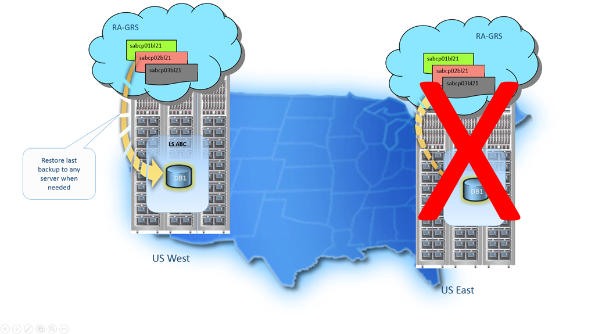

<properties
   pageTitle="Geschäftskontinuität Cloud – Wiederherstellen einer gelöschte Datenbank - SQL-Datenbank | Microsoft Azure"
   description="Lernen Sie Point-in-Time wiederherstellen, mit dem Sie die Anwendung einer SQL Azure-Datenbank zu einem vorherigen Punkt in (bis zu 35 Tage) zurückzusetzen kann."
   services="sql-database"
   documentationCenter=""
   authors="stevestein"
   manager="jhubbard"
   editor="monicar"/>

<tags
   ms.service="sql-database"
   ms.devlang="NA"
   ms.topic="article"
   ms.tgt_pltfrm="NA"
   ms.workload="NA"
   ms.date="08/01/2016"
   ms.author="sstein"/>

# Wiederherstellen einer automatische Datenbanksicherungskopien mit Azure SQL-Datenbank

SQL-Datenbank bietet drei Optionen für die Datenbank Wiederherstellung [SQL-Datenbank Sicherungskopien automatisierte](sql-database-automated-backups.md)verwenden. Sie können eine Datenbank aus den Dienst initiiert Sicherungskopien wiederherstellen, während der [Aufbewahrungszeitraum](sql-database-service-tiers.md) an:

- Eine neue Datenbank auf dem gleichen logischen Server bis zu einem bestimmten Zeitpunkt innerhalb der Aufbewahrungszeitraum wiederhergestellt werden soll. 
- Eine Datenbank auf dem gleichen logischen Server der Löschvorgang Zeit für eine gelöschte Datenbank wiederhergestellt werden soll.
- Eine neue Datenbank auf einem beliebigen logischen Server in jeder Region auf die letzten täglichen Sicherungskopien in Geo repliziert Blob-Speicher (RAS-GRS) wiederhergestellt werden soll.

Sie können auch eine [SQL-Datenbank automatische Sicherungskopien](sql-database-automated-backups.md) verwenden, einer [Datenbank zu kopieren](sql-database-copy.md) auf alle logischen Server in jeder Region erstellen, die mit der aktuellen SQL-Datenbank überführen konsistent ist. Sie können Datenbank kopieren und [in ein BACPAC exportieren](sql-database-export.md) verwenden, eine konsistente Kopie einer Datenbank zur Archivierung jenseits der Aufbewahrungszeitraum archivieren oder eine Kopie der Datenbank auf einem lokalen übertragen oder Azure-virtuellen Computer Instanz von SQL Server.

## Zeitpunkt der Wiederherstellung

Die Wiederherstellungszeit zum Wiederherstellen einer Datenbank mithilfe von automatisierten Datenbanksicherungskopien wird anhand einer Anzahl von Faktoren beeinflusst: 
 - Die Größe der Datenbank
 - Die Leistungsstufe der Datenbank
 - Die Anzahl der Transaktionsprotokolle verbindet
 - Die Menge der Aktivitäten, die wiedergegeben werden, um dem Punkt wiederherstellen wiederherstellen
 - Die Bandbreite in ein anderes Region ist die Wiederherstellung 
 - Die Anzahl der gleichzeitigen wiederherstellen anfordert, die in den Zielbereich verarbeitet werden. 
 
 Für eine Datenbank sehr großen oder aktiven kann die Wiederherstellung mehrere Stunden dauern. Ist es längerer Ausfall in einem Bereich, ist es möglich, dass großen Anzahl von Geo-wiederherstellen Anforderungen, die von anderen Regionen verarbeitet werden. Wenn es eine große Anzahl von Anfragen gibt mehr dies möglicherweise Wiederherstellungszeit für Datenbanken in diesem Bereich. Die meisten der Datenbank stellt innerhalb von 12 Stunden abgeschlossen.

 Es gibt keine integrierte Funktionen zum Wiederherstellen gruppenweise gehen Sie wie folgt vor. Die [Azure SQL-Datenbank: vollständige Server Wiederherstellung](https://gallery.technet.microsoft.com/Azure-SQL-Database-Full-82941666) Skript ist ein Beispiel für eine Möglichkeit, diese Aufgabe durchzuführen.

> [AZURE.IMPORTANT] Zum Wiederherstellen automatisierte Sicherungskopien verwenden, müssen Sie ein Mitglied der Teilnehmerrolle für SQL Server in das Abonnement oder Abonnementbesitzer sein. Sie können die mithilfe des PowerShell oder die REST-API Azure Portals wiederherstellen. Sie können keine Transact-SQL verwenden. 

## Point-In-Time wiederherstellen

Point-In-Time wiederherstellen, können Sie eine vorhandene Datenbank als eine neue Datenbank zu einem früheren Zeitpunkt auf dem gleichen logischen Server mit [SQL-Datenbank Sicherungskopien automatisierte](sql-database-automated-backups.md)wiederherstellen. Die vorhandene Datenbank kann nicht überschrieben werden. Sie können mithilfe der [Azure-Portal](sql-database-point-in-time-restore-portal.md), [PowerShell](sql-database-point-in-time-restore-powershell.md) oder die [REST-API](https://msdn.microsoft.com/library/azure/mt163685.aspx)Zeitpunkt in einem früheren Zustand wiederherstellen.

> [AZURE.SELECTOR]
- [Point-In-Time wiederherstellen: Azure-portal](sql-database-point-in-time-restore-portal.md)
- [Point-In-Time wiederherstellen: PowerShell](sql-database-point-in-time-restore-powershell.md)

Die Datenbank auf einem beliebigen Leistungsstufe oder elastisch wiederhergestellt werden kann Pool. Müssen Sie sicherstellen, dass Sie ausreichend DTU Kontingent auf dem logischen Server oder flexible Pool haben. Orientieren Sie, die die Wiederherstellung erstellt eine neue Datenbank und die das Dienstalter Ebene und Leistung der wiederhergestellten Datenbank kann im aktuellen Zustand der Datenbank live abweichen. Sobald Sie fertig sind, ist die wiederhergestellte Datenbank eine normale vollständigen Zugriff auf online-Datenbank zu den normalen Preisen basierend auf deren Ebene und Leistung Dienstalter belastet aus. Sie nicht anfallen bis zum Abschluss der Datenbank wiederherstellen.

Sie wiederherstellen eine Datenbank im Allgemeinen eine Earler Punkt für die Wiederherstellung. Dabei können Sie die wiederhergestellte Datenbank als Ersatz für die ursprüngliche Datenbank behandeln oder ihre Verwendung zum Abrufen von Daten aus, und klicken Sie dann die ursprüngliche Datenbank zu aktualisieren. 

- ***Database-Ersatz:*** Wenn die wiederhergestellte Datenbank, die als Ersatz für die ursprüngliche Datenbank vorgesehen ist, überprüfen Sie die Leistungsstufe und/oder Service Ebene geeignet sind und die Datenbank bei Bedarf skalieren. Benennen Sie die ursprüngliche Datenbank und lassen Sie dann der wiederhergestellten Datenbank den ursprünglichen Namen mithilfe des Befehls ALTER DATABASE in T-SQL. 
- ***Daten Wiederherstellung:*** Wenn Sie, zum Abrufen von Daten aus der wiederhergestellten Datenbank beabsichtigen zu einem Benutzer oder einer Anwendung Fehler zu beheben, müssen Sie separat zu schreiben, und führen Sie jeden Daten Wiederherstellung Skripts Sie Daten aus der wiederhergestellten Datenbank in die ursprüngliche Datenbank zu extrahieren müssen. Obwohl bei der Wiederherstellung einen langen Zeit in Anspruch nehmen kann, werden die Datenbank wiederherstellen in der Liste der Datenbank in der gesamten angezeigt. Wenn Sie die Datenbank während der Wiederherstellung löschen, wird es den Vorgang abzubrechen und Sie werden nicht in Rechnung gestellt für die Datenbank, die die Wiederherstellung nicht abgeschlossen werden konnte. 

Ausführliche Informationen zur Verwendung von Point-in-Time wiederherstellen aus Benutzer und Anwendungsfehler wiederherstellen, finden Sie unter [Point-in-Time wiederherstellen](sql-database-recovery-using-backups.md#point-in-time-restore)

## Wiederherstellen von gelöschten Datenbank

Wiederherstellen von gelöschten Datenbank können Sie zum Wiederherstellen einer gelöschten Datenbank auf die Löschung Zeit für eine gelöschte Datenbank auf dem gleichen logischen Server mit [SQL-Datenbank Sicherungskopien automatisierte](sql-database-automated-backups.md). 

> [AZURE.IMPORTANT] Wenn Sie eine Instanz des Servers Azure SQL-Datenbank löschen, werden alle zugehörigen Datenbanken werden ebenfalls gelöscht und nicht wiederhergestellt werden. Es gibt keine Unterstützung für Wiederherstellen eines gelöschten Servers zu diesem Zeitpunkt aus.

Sie können die gleichen oder einen neuen Datenbanknamen für die wiederhergestellte Datenbank verwenden. Sie können mithilfe der [Azure-Portal](sql-database-restore-deleted-database-portal.md), [PowerShell](sql-database-restore-deleted-database-powershell.md) oder der [REST (CreateMode = wiederherstellen)](https://msdn.microsoft.com/library/azure/mt163685.aspx). 

> [AZURE.SELECTOR]
- [Datenbank Wiederherstellen gelöschter: Azure-Portal](sql-database-restore-deleted-database-portal.md)
- [Datenbank Wiederherstellen gelöschter: PowerShell](sql-database-restore-deleted-database-powershell.md)

## Geo-wiederherstellen

Geo-wiederherstellen können Sie eine SQL-Datenbank auf einem Server in einer beliebigen Azure Region aus der letzten Geo repliziert [automatisierte tägliche Sicherung](sql-database-automated-backups.md)wiederherstellen. Geo-wiederherstellen Geo redundante Sicherung als Quelle verwendet und kann verwendet werden, um eine Datenbank wiederherzustellen, selbst wenn die Datenbank oder Datacenter aufgrund einer Ausfall nicht möglich ist. Können die [Azure-Portal](sql-database-geo-restore-portal.md) [PowerShell](sql-database-geo-restore-powershell.md)oder der [REST (CreateMode = Wiederherstellung)](https://msdn.microsoft.com/library/azure/mt163685.aspx) 

> [AZURE.SELECTOR]
- [Geo-wiederherstellen: Azure-portal](sql-database-geo-restore-portal.md)
- [Geo-wiederherstellen: PowerShell](sql-database-geo-restore-powershell.md)

Geo-Wiederherstellen ist die Standardoption für die Wiederherstellungsdatei aus, wenn die Datenbank aufgrund von ein Vorfall in der Region nicht verfügbar ist, in dem die Datenbank gehostet wird. Wenn eine umfangreiche Vorfall in einer Region Ergebnisse Ihrer Datenbank-Anwendung nicht mehr verfügbar ist, können Geo-wiederherstellen Sie eine Datenbank auf einem Server in eine andere Region aus der letzten Sicherung wiederherstellen. Alle Sicherungskopien Geo repliziert werden und kann eine Verzögerung zwischen, wenn die Sicherung durchgeführt und in der Azure Geo repliziert ist Blob in einem anderen Bereich. Diese Verzögerung kann bis zu einer Stunde nach einem Ausfall können bestehen von 1 Stunde von Datenverlust, d. h., RPO von bis zu 1 Stunde sein. Die nachstehende Abbildung zeigt Wiederherstellen der Datenbank, die aus der letzten tägliche Sicherung.

Ausführliche Informationen zur Verwendung von Geo-wiederherstellen zum Wiederherstellen nach einem Ausfall finden Sie unter [nach einem Ausfall wiederherstellen](sql-database-disaster-recovery.md)

> [AZURE.IMPORTANT] Während der Geo-Wiederherstellen mit allen Ebenen der Dienst verfügbar ist, ist es der grundlegendsten der Disaster Wiederherstellung Lösungen in SQL-Datenbank mit der längsten RPO und Schätzung Wiederherstellung Zeit (Einfügen). Für grundlegende Datenbanken und maximale Größe von 2 GB Geo-Wiederherstellen bietet eine geeignete DR-Lösung mit einer Einfügen von 12 Stunden. Bei größeren Standard oder Premium Datenbanken, wenn Sie erheblich schnellere Wiederherstellung wünschen sind oder wenn Sie um die Wahrscheinlichkeit von Datenverlusten zu verringern, erwägen Sie aktiven Geo-Replikation. Aktive Geo-Replikation bietet einen viel niedriger RPO und einfügen, wie es nur erfordert ein Failover zu einem sekundären kontinuierlich repliziert initiiert. Weitere Informationen finden Sie unter [Aktive Geo-Replikation](sql-database-geo-replication-overview.md).

## Programmgesteuert Durchführung Wiederherstellung mithilfe von automatisierte Sicherungskopien

Wie in Addiition Azure-Portal oben beschrieben kann programmgesteuert mithilfe von Azure PowerShell und die REST-API Datenbank Wiederherstellung ausgeführt werden. Die Tabellen unten beschreiben den Satz von Befehlen zur Verfügung.

### PowerShell

|Cmdlet|Beschreibung|
|------|-----------|
|[Get-AzureRmSqlDatabase](https://msdn.microsoft.com/en-us/library/azure/mt603648.aspx)|Ruft eine oder mehrere Datenbanken ab.|
|[Get-AzureRMSqlDeletedDatabaseBackup](https://msdn.microsoft.com/en-us/library/azure/mt693387.aspx)|Ruft eine gelöschte Datenbank, die Sie wiederherstellen können.|
|[Get-AzureRmSqlDatabaseGeoBackup](https://msdn.microsoft.com/library/azure/mt693388.aspx)|Ruft eine Geo redundante Sicherung einer Datenbank ab.|
|[Wiederherstellen-AzureRmSqlDatabase](https://msdn.microsoft.com/library/azure/mt693390.aspx)|Stellt eine SQL-Datenbank.|
||||

### REST-API

|API|Beschreibung|
|---|-----------|
|[REST (CreateMode = Wiederherstellung)](https://msdn.microsoft.com/library/azure/mt163685.aspx)|Stellt eine Datenbank wieder her|
|[Get erstellen oder Aktualisieren der Status der Datenbank](https://msdn.microsoft.com/library/azure/mt643934.aspx)|Gibt den Status während einer Wiederherstellung|
||||

## Zusammenfassung

Automatische Sicherungskopien Schützen Ihrer Datenbanken Benutzer- und Anwendungsfehler, unbeabsichtigtes Datenbank löschen und längerer Ausfall. Diese Null-Kosten NULL-Admin-Lösung ist für alle SQL-Datenbanken verfügbar. 

## Nächste Schritte

- Eine Übersicht über Business-Continuity und Szenarien finden Sie unter [Übersicht über die Business continuity](sql-database-business-continuity.md)
- Weitere Informationen zu Azure SQL-Datenbank automatische Sicherungskopien finden Sie unter [SQL-Datenbank automatische Sicherungskopien](sql-database-automated-backups.md)
- Weitere Informationen zu schneller Wiederherstellungsoptionen finden Sie unter [Aktiv-Geo-Replikation](sql-database-geo-replication-overview.md)  
- Weitere Informationen zum Verwenden automatische Sicherungskopien für Archivierung, finden Sie unter [Datenbank kopieren](sql-database-copy.md)
