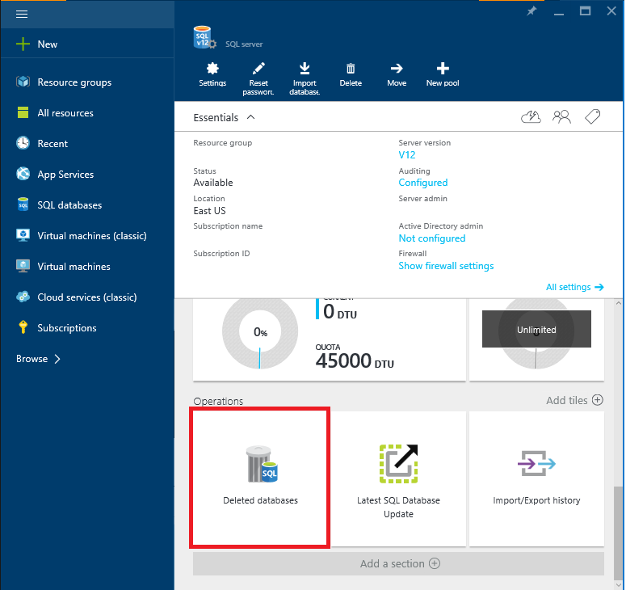

<properties
    pageTitle="Wiederherstellen einer gelöschte SQL Azure-Datenbank (Azure Portal) | Microsoft Azure"
    description="Wiederherstellen einer gelöschten Azure SQL-Datenbank (Azure Portal)."
    services="sql-database"
    documentationCenter=""
    authors="stevestein"
    manager="jhubbard"
    editor=""/>

<tags
    ms.service="sql-database"
    ms.devlang="NA"
    ms.date="10/12/2016"
    ms.author="sstein"
    ms.workload="NA"
    ms.topic="article"
    ms.tgt_pltfrm="NA"/>

# Wiederherstellen einer gelöschten SQL Azure-Datenbank mithilfe der Azure-Portal

> [AZURE.SELECTOR]
- [(Übersicht)](sql-database-recovery-using-backups.md)
- [**Wiederherstellen gelöschter DB: Portal**](sql-database-restore-deleted-database-portal.md)
- [Wiederherstellen gelöschter DB: PowerShell](sql-database-restore-deleted-database-powershell.md)

## Wählen Sie die Datenbank wiederherstellen 

Um eine gelöschte Datenbank im Azure-Portal wiederherzustellen:

1.  Klicken Sie im [Azure-Portal](https://portal.azure.com)auf **Weitere Dienste** > **SQL Server**.
3.  Wählen Sie den Server, der die Datenbank enthalten, die Sie wiederherstellen möchten.
4.  Führen Sie einen Bildlauf nach unten bis zum Abschnitt mit **Vorgängen** von Ihrem Server-Blade, und wählen Sie **Gelöschte Datenbanken**: 
5.  Wählen Sie die Datenbank, die Sie wiederherstellen möchten.
6.  Geben Sie einen Datenbanknamen, und klicken Sie auf **OK**:

    

## Nächste Schritte

- Eine Übersicht über Business-Continuity und Szenarien finden Sie unter [Übersicht über die Business continuity](sql-database-business-continuity.md)
- Weitere Informationen zu Azure SQL-Datenbank automatische Sicherungskopien finden Sie unter [SQL-Datenbank automatische Sicherungskopien](sql-database-automated-backups.md)
- Weitere Informationen zum automatische Sicherungskopien für Wiederherstellung verwenden, finden Sie unter [Wiederherstellen einer Datenbank aus den Dienst initiiert Sicherungskopien](sql-database-recovery-using-backups.md)
- Weitere Informationen zu schneller Wiederherstellungsoptionen finden Sie unter [Aktiv-Geo-Replikation](sql-database-geo-replication-overview.md)  
- Weitere Informationen zum Verwenden automatische Sicherungskopien für Archivierung, finden Sie unter [Datenbank kopieren](sql-database-copy.md)
