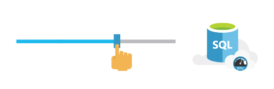

<properties
   pageTitle="SQL Azure-Datenbank Skalen im laufenden Betrieb"
   description="Erfahren Sie, wie SQL-Datenbank im laufenden Betrieb skaliert"
   keywords=""
   services="sql-database"
   documentationCenter=""
   authors="CarlRabeler"
   manager="jhubbard"
   editor=""/>

<tags
   ms.service="sql-database"
   ms.devlang="NA"
   ms.topic="article"
   ms.tgt_pltfrm="NA"
   ms.workload="data-management"
   ms.date="10/13/2016"
   ms.author="carlrab"/>

# Azure SQL-Datenbank Skalen im laufenden Betrieb

## Wenn die app aus einer kleinen Anzahl von Kunden für fast jede Person wächst, können Azure SQL-Datenbank im laufenden Betrieb mit minimalen app Ausfallzeiten skalieren.

Einer der Vorteile von Microsoft Azure SQL-Datenbank ausgeführt wird Leistung nach oben oder nach unten, und im laufenden Betrieb schnelle Anpassung zum Ändern von Arbeitsbelastung Bedarf skalieren können. SQL-Datenbank bietet eine Vielfalt von Leistung Ebenen zu den Erfordernissen der Anwendung. Und jede Ebene garantiert der Systemleistung, damit Ihre app-Benutzer eine vorhersehbar Leistung Erfahrung haben.

## Wenn Ihre app ein Nacht Erfolg ist
SQL-Datenbank erleichtert mit dem Maßstab bei einer kurzfristig. Wenn Ihre app ein Nacht Erfolg wird, ist es also nur einem Klick die neuen Leistung Bedürfnissen gerecht werden kann. Darüber hinaus mit minimaler Ausfallzeit, brauchen Sie sich Ihre app einen Treffer aufzeichnen, gegebener Zeit skalieren kümmern oder nach unten.

[Lesen Sie die Dokumentation](http://go.microsoft.com/fwlink/?LinkID=787569)

## Innerhalb des Budgets  

Sie sollten wenn Sie versuchen, eine app erstellen überlegen Letztes ist wie viele Ihrer Datenbank müssen Sie Kosten. Deshalb SQL-Datenbank hat einen Plan Bezahlung was – Sie brauchen. Mit den Optionen für Basic, Standard und Premium Leistung können Sie entscheiden, welche Option für die Leistung des Budgets ausgedrückt werden kann. Und wenn Ihre app frei nimmt, können Sie Skalieren von am jederzeit.

[Lesen Sie die Dokumentation](http://go.microsoft.com/fwlink/?LinkID=787570)

## Die schnellste Leistung erhalten

SQL-Datenbank enthält innovative in-Memory-Technologie zum äußerst schnelle Transaktionen ausführen und in Echtzeit analytical Abfragen zur gleichen Zeit ausführen. Integrierte Berater Hilfe Entwickler in-Memory-Tabellen, Indizes, migrieren oder Verfahren zu speichern. Daher können Endbenutzer bis zu 30 x schnellerer Verarbeitung von Transaktionen und 100 x schneller abfrageverarbeitung erzielen.  

[Lesen Sie die Dokumentation](http://go.microsoft.com/fwlink/?LinkID=787580)

Wechseln Sie zur Homepage finden Sie unter Was sonst SQL-Datenbank zu bieten hat.
[Schauen sie sich diese](https://azure.microsoft.com/services/sql-database/) 

## Nächste Schritte

Erhalten einer [kostenlosen Azure-Abonnement](https://azure.microsoft.com/get-started/) und [Erstellen Ihrer ersten Azure SQL-Datenbank](sql-database-get-started.md).

## Zusätzliche Ressourcen

Untersuchen Sie die [Funktionen von SQL-Datenbank](https://azure.microsoft.com/services/sql-database/).
 
Lesen Sie die [Technische Übersicht der SQL-Datenbank](sql-database-technical-overview.md).
