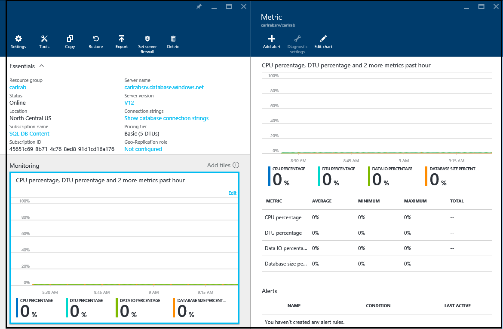

<properties
    pageTitle="Überwachen der Leistung der Datenbank in Azure SQL-Datenbank | Microsoft Azure"
    description="Lernen Sie die Optionen für Ihre Datenbank mit Azure Tools und dynamische Management Ansichten für die Überwachung aus."
    keywords="Datenbank, die Cloud-Datenbank-Performance überwachen"
    services="sql-database"
    documentationCenter=""
    authors="CarlRabeler"
    manager="jhubbard"
    editor=""/>

<tags
    ms.service="sql-database"
    ms.devlang="na"
    ms.topic="get-started-article"
    ms.tgt_pltfrm="na"
    ms.workload="data-management"
    ms.date="09/27/2016"
    ms.author="carlrab"/>

# Überwachen der Leistung der Datenbank in Azure SQL-Datenbank
Überwachen der Leistung einer SQL-Datenbank in Azure beginnt mit: Überwachung der Ressource Auslastung im Verhältnis zur Datenbank Leistung ausgewählt haben. Überwachung können Sie feststellen, ob Ihre Datenbank übermäßige Kapazität weist oder Probleme ist, da Ressourcen überlastet sind, und klicken Sie dann entscheiden, ob diese Zeit, um die Leistungsstufe und [Dienstebene](sql-database-service-tiers.md) Ihrer Datenbank anzupassen. Sie können Ihre Datenbank mithilfe des grafischer Tools in der [Azure-Portal](https://portal.azure.com) oder Verwenden von SQL [Management dynamische Ansichten](https://msdn.microsoft.com/library/ms188754.aspx)überwachen.

## Überwachen von Datenbanken, die über das Azure-portal

Im [Portal Azure](https://portal.azure.com/)können Sie eine einzelne Datenbank Auslastung, indem Sie die Datenbank, und durch Klicken auf das Diagramm **Überwachung** überwachen. Dadurch wird ein **Metrisch** -Fenster, das Sie ändern können, indem Sie auf die Schaltfläche **Diagramm bearbeiten** . Fügen Sie die folgende Metrik hinzu:

- Prozentsatz der CPU
- DTU Prozentsatz
- Daten EA-Prozentsatz
- Datenbank Tabellengröße in Prozent

Nachdem Sie diese Metrik hinzugefügt haben, können Sie weiterhin diese im Diagramm **Überwachung** mit im Fenster **Metrisch** Weitere Details anzeigen. Alle vier Kriterien anzeigen des Prozentsatzes durchschnittliche Auslastung relativ zu den **DTU** der Datenbank. Finden Sie im Artikel [Dienst Ebenen](sql-database-service-tiers.md) Details DTUs aus.

Sie können auch auf die Performance-Werte Benachrichtigungen konfigurieren. Klicken Sie auf die Schaltfläche **Hinzufügen Benachrichtigung** im Fenster **Metrik** . Führen Sie den Assistenten zum Konfigurieren der Warnung aus. Sie haben die Option Benachrichtigung, wenn die Metrik einen bestimmten Schwellenwert überschreitet oder die Metrik unter einen bestimmten Schwellenwert fällt.

Wenn Sie die Arbeitsbelastung auf Ihre Datenbank vergrößert erwarten, können Sie beispielsweise eine e-Mail-Benachrichtigung zu konfigurieren, wenn die Datenbank 80 % auf Performance-Werte erreicht auswählen. Hiermit können Sie als frühe Warnung um zu ermitteln, wenn Sie möglicherweise höhere Leistung professionell wechseln.

Performance-Werte können auch Ihnen helfen festzustellen, wenn Sie Leistung Tieferstufen downgrade können. Nehmen Sie an eine Datenbank Standard S2 verwenden und alle Leistungswerte zeigen an, dass die Datenbank im Durchschnitt nicht mehr als 10 % zu einem beliebigen Zeitpunkt verwendet wird. Ist zu rechnen, dass die Datenbank in Standard S1 gut funktionieren. Bedenken Sie jedoch auf Auslastung, die kurzzeitigen Anstieg oder schwanken, bevor Sie bei der Entscheidung, Tieferstufen Leistung zu verschieben.

## Verwenden von DMVs Monitor-Datenbanken

Die gleicher Metrik, die im Portal verfügbar gemacht werden, sind auch über Systemansichten verfügbar: [sys.resource_stats](https://msdn.microsoft.com/library/dn269979.aspx) in der logischen **master** -Datenbank von Server und [sys.dm_db_resource_stats](https://msdn.microsoft.com/library/dn800981.aspx) in der Datenbank. Verwenden Sie **sys.resource_stats** , wenn Sie weniger detaillierte Daten über einen längeren Zeitraum überwachen müssen. Wenn Sie eine genauere Daten innerhalb eines Zeitrahmens kleinere überwachen müssen, verwenden Sie **sys.dm_db_resource_stats** . Weitere Informationen finden Sie unter [Leitfaden zur Leistung der Azure SQL-Datenbank](sql-database-performance-guidance.md#monitoring-resource-use-with-sysresourcestats).

>[AZURE.NOTE] **Sys.dm_db_resource_stats** gibt ein leeres Resultset bei Verwendung im Web und Business Edition-Datenbanken, die deaktiviert werden.

Für flexible Datenbank Pools können Sie einzelne Datenbanken im Pool mit den in diesem Abschnitt beschriebenen Verfahren überwachen. Aber Sie können auch den Ressourcenpool als Ganzes überwachen. Weitere Informationen finden Sie unter [Überwachen und Verwalten eines Ressourcenpool flexible Datenbank](sql-database-elastic-pool-manage-portal.md).
