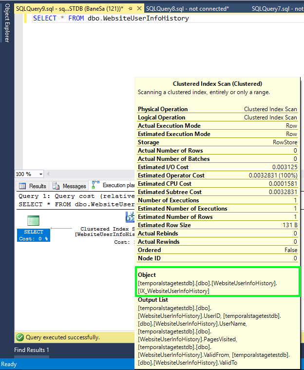

<properties
   pageTitle="Verwalten von zurückliegenden Daten in Tabellen zeitliche mit Aufbewahrungsrichtlinie | Microsoft Azure"
   description="Erfahren Sie, wie mit zeitliche Aufbewahrungsrichtlinie zurückliegende Daten Ihrer Kontrolle beibehalten."
   services="sql-database"
   documentationCenter=""
   authors="bonova"
   manager="drasumic"
   editor=""/>

<tags
   ms.service="sql-database"
   ms.devlang="NA"
   ms.topic="article"
   ms.tgt_pltfrm="NA"
   ms.workload="sql-database"
   ms.date="10/12/2016"
   ms.author="bonova"/>

#<a name="manage-historical-data-in-temporal-tables-with-retention-policy"></a>Verwalten von zurückliegenden Daten in Tabellen zeitliche mit Aufbewahrungsrichtlinie

Zeitliche Tabellen möglicherweise Datenbankgröße von mehreren regulären Tabellen erhöhen, insbesondere dann, wenn Sie für einen längeren Zeitraum zurückliegende Daten beibehalten. Wenn Sie also Aufbewahrungsrichtlinie für zurückliegende Daten ein wichtiger Aspekt der Planung und Verwaltung des Lebenszyklus von jeder zeitliche Tabelle. Zeitliche Tabellen in Azure SQL-Datenbank im Zusammenhang mit Aufbewahrungsrichtlinien einfach zu verwendendes Verfahren, die Ihnen diese Aufgabe erleichtert.

Zeitliche Verlauf beibehalten werden kann Ebene des einzelne Tabelle konfiguriert werden, wodurch Benutzer erstellen flexible Rückblick Richtlinien. Anwenden einer Aufbewahrungsrichtlinie zeitliche ist einfach: Es erfordert nur einen Parameter während der Erstellung oder Schema Ändern von Tabelle festgelegt werden.

Nachdem Sie die Aufbewahrungsrichtlinie definieren, beginnt Azure SQL-Datenbank regelmäßig wird überprüft, ob es gibt zurückliegende Zeilen, die für die automatische Daten zum Aufräumen berechtigt sind. Übereinstimmende Zeilen Identifikationen und deren entfernen aus der Verlaufstabelle auftreten, transparent, in den Hintergrundaufgabe, die geplant und vom System ausgeführt wird. Alter Bedingung für die Tabellenzeilen Verlauf ist basierend auf der Spalte darstellt Ende einer Periode SYSTEM_TIME aktiviert. Tabellenzeilen zum Aufräumen berechtigt, wenn Aufbewahrungszeitraum, beispielsweise sechs Monate festgelegt ist, die folgende Bedingung erfüllen:

````
ValidTo < DATEADD (MONTH, -6, SYSUTCDATETIME())
````

Im obigen Beispiel davon ausgegangen, dass das Ende des Zeitraums SYSTEM_TIME **ValidTo** Spalte entspricht.

##<a name="how-to-configure-retention-policy"></a>So konfigurieren Sie die Aufbewahrungsrichtlinie?

Bevor Sie die Aufbewahrungsrichtlinie für eine zeitliche Tabelle konfigurieren, überprüfen Sie zuerst, ob zeitliche zurückliegenden Aufbewahrung aktiviert *Ebene der Datenbank*ist.

````
SELECT is_temporal_history_retention_enabled, name
FROM sys.databases
````

Kennzeichnung für die Datenbank **Is_temporal_history_retention_enabled** standardmäßig auf festgelegt ist, aber Benutzer können mit ALTER DATABASE-Anweisung ändern. Es ist auch nach dem [Zeitpunkt wiederherstellen](sql-database-point-in-time-restore-portal.md) Vorgang auf OFF festgelegt. Klicken Sie zum Aktivieren der zeitlichen Verlauf Aufbewahrung Aufräumen für die Datenbank führen Sie die folgende Anweisung aus:

````
ALTER DATABASE <myDB>
SET TEMPORAL_HISTORY_RETENTION  ON
````

> [AZURE.IMPORTANT] Sie können Aufbewahrungsrichtlinien für zeitliche Tabellen konfigurieren, selbst wenn **Is_temporal_history_retention_enabled** deaktiviert ist, aber automatische Aufräumen veralteter Zeilen in diesem Fall nicht ausgelöst werden wird.


Aufbewahrungsrichtlinie wird beim Erstellen der Tabelle konfiguriert, indem Sie für den Parameter HISTORY_RETENTION_PERIOD Wert angeben:

````
CREATE TABLE dbo.WebsiteUserInfo
(  
    [UserID] int NOT NULL PRIMARY KEY CLUSTERED
  , [UserName] nvarchar(100) NOT NULL
  , [PagesVisited] int NOT NULL
  , [ValidFrom] datetime2 (0) GENERATED ALWAYS AS ROW START
  , [ValidTo] datetime2 (0) GENERATED ALWAYS AS ROW END
  , PERIOD FOR SYSTEM_TIME (ValidFrom, ValidTo)
 )  
 WITH
 (
     SYSTEM_VERSIONING = ON
     (
        HISTORY_TABLE = dbo.WebsiteUserInfoHistory,
        HISTORY_RETENTION_PERIOD = 6 MONTHS
     )
 );
````

Azure SQL-Datenbank ermöglicht es Ihnen, Aufbewahrungszeitraum mit anderen Zeiteinheiten angeben: Tagen, Wochen, Monate und Jahre. Wenn HISTORY_RETENTION_PERIOD ausgelassen wird, wird davon ausgegangen, dass unbegrenzte Aufbewahrungsrichtlinien. Sie können auch explizit unbegrenzte Schlüsselwort verwenden.

In einigen Szenarien Sie Aufbewahrung nach der Erstellung von Tabellen konfigurieren möchten, oder zum Ändern zuvor konfigurierten Wert. Verwenden Sie in diesem Fall ALTER TABLE-Anweisung ein:

````
ALTER TABLE dbo.WebsiteUserInfo
SET (SYSTEM_VERSIONING = ON (HISTORY_RETENTION_PERIOD = 9 MONTHS));
````

> [AZURE.IMPORTANT]  Festlegen von SYSTEM_VERSIONING Off Aufbewahrung Periode Wert *wird nicht beibehalten* . Festlegen von SYSTEM_VERSIONING auf ohne HISTORY_RETENTION_PERIOD explizit Ergebnisse in der unbegrenzte Aufbewahrungszeitraum angegeben.

Um den aktuellen Status der Aufbewahrungsrichtlinie zu überprüfen, verwenden Sie die folgende Abfrage, die zeitliche Aufbewahrungsrichtlinien-Aktivierung Kennzeichnung mit Aufbewahrungsrichtlinien Perioden für einzelne Tabellen Ebene der Datenbank verknüpft:

````
SELECT DB.is_temporal_history_retention_enabled,
SCHEMA_NAME(T1.schema_id) AS TemporalTableSchema,
T1.name as TemporalTableName,  SCHEMA_NAME(T2.schema_id) AS HistoryTableSchema,
T2.name as HistoryTableName,T1.history_retention_period,
T1.history_retention_period_unit_desc
FROM sys.tables T1  
OUTER APPLY (select is_temporal_history_retention_enabled from sys.databases
where name = DB_NAME()) AS DB
LEFT JOIN sys.tables T2   
ON T1.history_table_id = T2.object_id WHERE T1.temporal_type = 2
````


##<a name="how-sql-database-deletes-aged-rows"></a>SQL-Datenbank wie löscht Rückblick Zeilen?

Der Vorgang zum Aufräumen hängt das Layout für den Index der Verlaufstabelle aus. Es ist wichtig, beachten Sie die *einzige Verlaufstabellen mit einem gruppierten Index (B-Struktur oder Columnstore) begrenzten Aufbewahrungsrichtlinie konfiguriert haben, können*. Eine Hintergrundaufgabe wird erstellt, um die Aufräumen veralteter Daten für alle zeitliche Tabellen mit begrenzten Aufbewahrungszeitraum ausführen.
Aufräumen Logik für den Rowstore (B-Struktur) gruppierten Index löscht veralteter Zeile in kleineren Segmenten (bis zu 10 KB) Druck auf das Protokoll und e/a-Subsystem minimieren. Obwohl Aufräumen Logik erforderlichen B-Struktur Index Reihenfolge von Löschvorgängen für die Zeilen, die älter nutzt als Aufbewahrungszeitraum fest garantiert werden kann. Daher *keine Abhängigkeit von der Reihenfolge Aufräumen in Ihrer Anwendung nicht berücksichtigt*.

Der Vorgang zum Aufräumen für die gruppierten Columnstore entfernt ganze [Zeilengruppen](https://msdn.microsoft.com/library/gg492088.aspx) gleichzeitig (in der Regel enthalten 1 Millionen von Zeilen jeder), welche ist sinnvoll, insbesondere dann, wenn zurückliegende Daten in einem hohen Tempo generiert werden.


Hervorragende Daten Komprimierung und effiziente Aufbewahrungsrichtlinien zum Aufräumen ist gruppierte Columnstore Index perfekte Lösung für Szenarien, wenn Ihre Arbeitsbelastung schnell hoher zurückliegenden Datenmenge generiert. Diese Muster ist stark [Transaktionen Verarbeitung Auslastung zeitliche Tabellen verwenden, die Sie](https://msdn.microsoft.com/library/mt631669.aspx) für Änderungsprotokoll und Überwachung, Trendanalyse oder IoT Daten Aufnahme der Regel.

##<a name="index-considerations"></a>Index Aspekte

Der Vorgang zum Aufräumen von Tabellen mit gruppierten Index Rowstore erfordert Index zunächst die Spalte, die das Ende des Zeitraums SYSTEM_TIME entspricht. Wenn Index vorhanden, die nicht vorhanden ist, können Sie begrenzten Aufbewahrungszeitraum konfigurieren nicht:

*Msg 13765, Ebene 16, Status 1 <br> </br> auf System Versionsnummern zeitliche Tabelle 'temporalstagetestdb.dbo.WebsiteUserInfo' Fehler beim begrenzten Aufbewahrungszeitraum festlegen, da der Verlaufstabelle 'temporalstagetestdb.dbo.WebsiteUserInfoHistory' keine erforderlichen gruppierten Index enthält. Erwägen Sie das Erstellen eines gruppierten Columnstore oder B-Struktur Index ausgehend von der Spalte, die Ende des SYSTEM_TIME entspricht Periode, klicken Sie auf die Historientabelle.*

Es ist wichtig, beachten Sie, dass die Unterhaltungsverlauf Standardtabelle Azure SQL-Datenbank bereits erstellte Index gruppierte weist die for Aufbewahrungsrichtlinie kompatibel ist. Wenn Sie versuchen, diesen Index für eine Tabelle mit begrenzten Aufbewahrungszeitraum entfernen, schlägt fehl mit dem folgenden Fehler:

*Msg 13766, Ebene 16, Status 1 <br> </br> den gruppierten Index 'WebsiteUserInfoHistory.IX_WebsiteUserInfoHistory' kann nicht gelöscht werden, da es für automatische Aufräumen von veralteten Daten verwendet wird. Erwägen Sie HISTORY_RETENTION_PERIOD auf unbegrenzte in der entsprechenden System Versionsnummern zeitliche Tabelle festlegen, wenn Sie diesen Index gelöscht werden müssen.*

Aufräumen auf den gruppierten Columnstore Index funktioniert optimal auf, wenn in der aufsteigender Reihenfolge (sortiert nach dem Ende der Spalte "Periode"), die was immer der Fall ist, wenn der Verlaufstabelle ausschließlich durch das Verfahren SYSTEM_VERSIONIOING ausgefüllt wird, zurückliegende Zeilen eingefügt werden. Wenn Zeilen in der Historientabelle nicht nach Ende der Spalte "Periode" sortiert werden (das der Fall sein kann, wenn Sie vorhandene zurückliegende Daten migriert), sollten Sie gruppierte Columnstore Index auf B-Struktur Rowstore Index erneut erstellen, die ordnungsgemäß sortiert ist eine optimale Leistung zu erzielen.

Vermeiden Sie das Neuerstellen gruppierte Columnstore Index in der Verlaufstabelle mit der begrenzten Aufbewahrungszeitraum, da es in der Zeile gruppiert, die durch den Vorgang System-Versioning auferlegt Sortierung ändern kann. Wenn Sie gruppierte Columnstore Index in der Verlaufstabelle neu zu erstellen müssen, nicht, neu auf kompatiblen B-Struktur Index archivieren Sortierung in der notwendigen für normale Daten zum Aufräumen Rowgroups zu erstellen. Wenn Sie mit vorhandenen Verlaufstabelle zeitliche Tabelle erstellen, die Spaltenindex ohne Daten garantiert Reihenfolge gruppierte hat, muss der gleiche Ansatz ausgeführt werden:

````
/*Create B-tree ordered by the end of period column*/
CREATE CLUSTERED INDEX IX_WebsiteUserInfoHistory ON WebsiteUserInfoHistory (ValidTo)
WITH (DROP_EXISTING = ON);
GO
/*Re-create clustered columnstore index*/
CREATE CLUSTERED COLUMNSTORE INDEX IX_WebsiteUserInfoHistory ON WebsiteUserInfoHistory
WITH (DROP_EXISTING = ON);
````

Wenn für die Verlaufstabelle mit den gruppierten Columnstore Index begrenzten Aufbewahrungszeitraum konfiguriert ist, können nicht Sie zusätzliche nicht gruppierten B-Baum-Indizes für die Tabelle erstellen:

````
CREATE NONCLUSTERED INDEX IX_WebHistNCI ON WebsiteUserInfoHistory ([UserName])
````

Der Versuch, über Anweisung auszuführen tritt der folgende Fehler auf:

*Msg 13772, Ebene 16, Status 1 <br> </br> kann nicht gruppierten Index erstellt eine Verlaufstabelle zeitlichen 'WebsiteUserInfoHistory', da es begrenzten Aufbewahrungszeitraum und gruppierte Columnstore Index definiert wurde.*

##<a name="querying-tables-with-retention-policy"></a>Abfragen in Tabellen mit Aufbewahrungsrichtlinie

Alle Abfragen für die Tabelle zeitliche herausfiltern automatisch zurückliegenden Ergebniszeilen begrenzten Aufbewahrungsrichtlinie, nicht vorhersehbar und inkonsistente Ergebnisse zu vermeiden, da durch den Vorgang zum Aufräumen *an einer beliebigen Stelle in der Zeit und in zufällige Reihenfolge*veraltete Zeilen gelöscht werden können.

Die folgende Abbildung zeigt den Abfrageplan für eine einfache Abfrage:

````
SELECT * FROM dbo.WebsiteUserInfo FROM SYSTEM_TIME ALL;
````

Abfrage-Plan enthält zusätzlichen Filter für bestimmte Produkte an das Ende der Spalte "Periode" (ValidTo) in den Operator "Gruppierte Index Scan" auf die Historientabelle (hervorgehoben). In diesem Beispiel wird vorausgesetzt, 1 Monat Aufbewahrungszeitraum WebsiteUserInfo Tabelle festgelegt wurde.


Wenn Sie direkt Verlaufstabelle Abfragen, werden Ihnen Zeilen angezeigt, die älter als angegebenen Aufbewahrung Periode, aber ohne Garantie für Abfrageergebnisse wiederholt. Die folgende Abbildung zeigt die Abfrageausführungsplan für die Abfrage in der Verlaufstabelle ohne zusätzliche Filter angewendet:



Überlassen Sie Ihre Geschäftslogik Verlaufstabelle jenseits Aufbewahrungszeitraum lesen, wie Sie möglicherweise inkonsistente oder unerwartete Ergebnisse erhalten. Es wird empfohlen, zeitliche Abfragen zum Analysieren von Daten in Tabellen zeitliche mit für SYSTEM_TIME-Klausel zu verwenden.

##<a name="point-in-time-restore-considerations"></a>Zeigen Sie in der Zeit wiederherstellen Aspekte

Wenn Sie neue Datenbank, indem Sie [bis zu einem bestimmten Zeitpunkt vorhandene Datenbank wiederherstellen erstellen](sql-database-point-in-time-restore-portal.md), muss es zeitliche Aufbewahrung Ebene der Datenbank deaktiviert. (**Is_temporal_history_retention_enabled** Kennzeichnung auf OFF gesetzt). Diese Funktionalität ermöglicht Ihnen, überprüfen Sie alle zurückliegende Zeilen bei der Wiederherstellung, ohne zu sorgen, dass veraltete Zeilen entfernt werden, bevor diese Abfrage geklickt haben. Sie können ihn zu *untersuchenden zurückliegende Daten jenseits konfigurierten Aufbewahrungszeitraum*verwenden.

Angenommen Sie, eine zeitliche Tabelle einen Monat Beibehaltung des angegebenen Zeitraums enthält. Wenn die Datenbank in Premium-Service-Ebene erstellt wurde, möchten Sie zum Erstellen von Datenbankkopie mit dem Datenbankstatus von zur 35 Tagen wieder in der Vergangenheit sein. Dadurch effektiv können Sie zum Analysieren von zurückliegenden Zeilen, die bis zu 65 Tage sind, indem Sie die Historientabelle direkt Abfragen.

Wenn Sie die zeitliche Aufbewahrung aufräumen aktivieren möchten, führen Sie die folgende Transact-SQL-Anweisung nach dem Punkt in Time-Wiederherstellung:

````
ALTER DATABASE <myDB>
SET TEMPORAL_HISTORY_RETENTION  ON
````

##<a name="next-steps"></a>Nächste Schritte

Zeitliche Tabellen in Clientanwendungen Auschecken erfahren Sie, wie Sie [Erste Schritte mit zeitliche Tabellen in Azure SQL-Datenbank](sql-database-temporal-tables.md).

Besuchen Sie Channel 9, um eine [reale Kunden zeitliche Implementierung Erfahrungsbericht](https://channel9.msdn.com/Blogs/jsturtevant/Azure-SQL-Temporal-Tables-with-RockStep-Solutions) hören und schauen Sie sich eine [live-zeitliche Präsentation](https://channel9.msdn.com/Shows/Data-Exposed/Temporal-in-SQL-Server-2016)aus.

Ausführliche Informationen zu zeitliche Tabellen überprüfen Sie [MSDN-Dokumentation](https://msdn.microsoft.com/library/dn935015.aspx).
