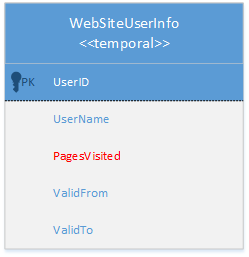
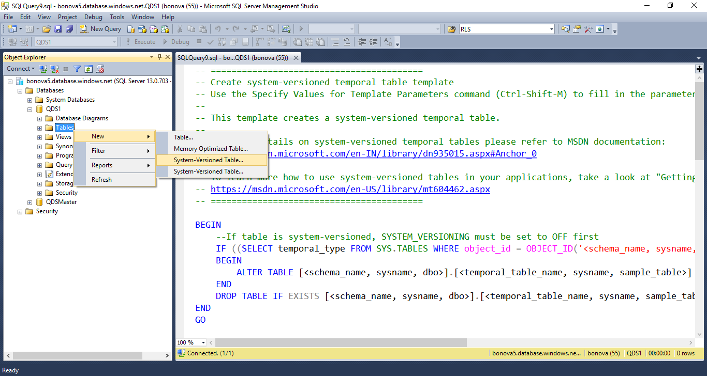
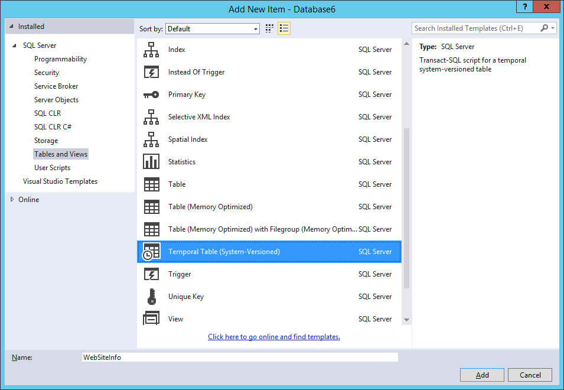
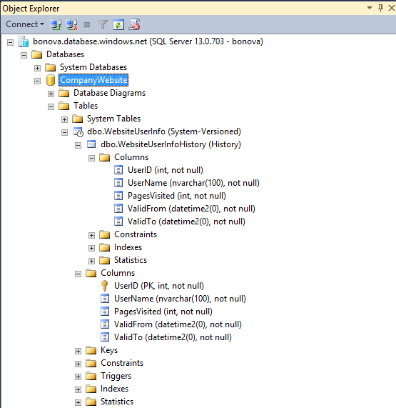
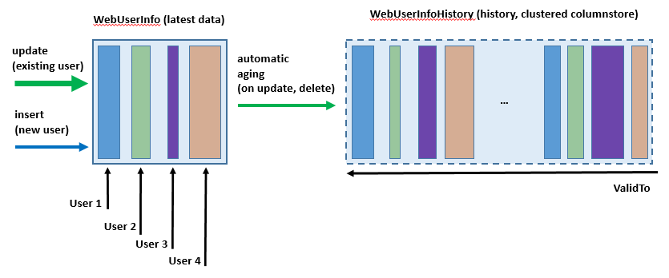
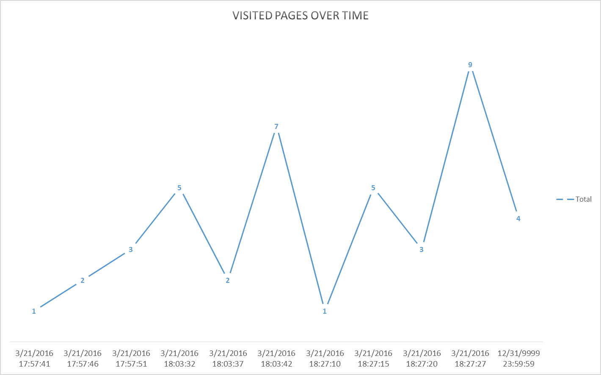

<properties
   pageTitle="Erste Schritte mit zeitliche Tabellen in SQL Azure-Datenbank | Microsoft Azure"
   description="Informationen Sie zum ersten Schritten mit zeitliche Tabellen in Azure SQL-Datenbank."
   services="sql-database"
   documentationCenter=""
   authors="CarlRabeler"
   manager="jhubbard"
   editor=""/>

<tags
   ms.service="sql-database"
   ms.devlang="NA"
   ms.topic="article"
   ms.tgt_pltfrm="NA"
   ms.workload="sql-database"
   ms.date="08/29/2016"
   ms.author="carlrab"/>

#<a name="getting-started-with-temporal-tables-in-azure-sql-database"></a>Erste Schritte mit zeitliche Tabellen in SQL Azure-Datenbank

Zeitliche Tabellen sind ein neues Feature für Programmierbarkeit Azure SQL-Datenbank, die Sie zum Nachverfolgen und Analysieren des vollständigen Verlaufs von Änderungen in den Daten, ohne die Notwendigkeit der benutzerdefinierten Codierung ermöglicht. Zeitliche Tabellen einhalten Daten, die eng mit Uhrzeit Kontext, sodass die gespeicherte Fakten interpretiert werden können als gültig nur bestimmte Periode. Diese Eigenschaft zeitliche Tabellen ermöglicht effiziente zeitbasierte Analyse und beim Abrufen Einsichten aus Daten Weiterentwicklung.

##<a name="temporal-scenario"></a>Zeitliche Szenario

Dieser Artikel beschreibt die Schritte zum zeitliche Tabellen in einem Anwendungsszenario nutzen können. Nehmen Sie an, dass auf einer neuen Website, die von Grund auf entwickelt wird, oder klicken Sie auf eine vorhandene Website, die Sie mit der Benutzer Aktivität Analytics erweitern möchten Benutzeraktivitäten verfolgt werden soll. In diesem Beispiel vereinfachte wird davon ausgegangen, dass die Anzahl der besuchten Webseiten während einer bestimmten Zeitspanne ein Indikator ist, der erfasst und in der Website-Datenbank, die auf SQL Azure-Datenbank gehostet wird überwacht werden muss. Das Ziel der zurückliegenden Analyse der Benutzeraktivitäten ist abzurufenden Eingaben Umgestaltung Website und optimal für die Besucher bereitstellen.

Die datenbankmodellvorlage für dieses Szenario ist sehr einfach – Benutzer Aktivität Metrik wird mit einem einzigen ganzzahligen Feld, **PageVisited**, dargestellt und sowie grundlegende Informationen im Benutzerprofil erfasst. Darüber hinaus würde zeitbasierte Analyse, Sie behalten eine Reihe von Zeilen, die für jeden Benutzer, wobei jede Zeile die Anzahl der Seiten, die ein bestimmter Benutzer innerhalb einer bestimmten Zeitspanne besucht darstellt.



Glücklicherweise müssen Sie keine leistungsgesteuert in Ihrer app verwalten diese zu setzen. Mit zeitliche Tabellen erfolgt dieser automatisch zugewiesen Sie während der Website entwerfen und mehr Zeit auf die Datenanalyse selbst vereinfacht vollständige Flexibilität -. Sie müssen lediglich wird sichergestellt, dass die Tabelle **WebSiteInfo** konfiguriert ist, als [zeitliche System Versionsnummern](https://msdn.microsoft.com/library/dn935015.aspx#Anchor_0). Die genauen Schritte zum zeitliche Tabellen in diesem Szenario verwendet wurden, werden nachstehend beschrieben.

##<a name="step-1-configure-tables-as-temporal"></a>Schritt 1: Konfigurieren von Tabellen als zeitliche

Je nachdem, ob Sie starten Entwicklung von neuen oder vorhandenen Anwendung Upgrade werden Sie zeitliche Tabellen erstellen oder vorhandene Formulare durch Hinzufügen von Attributen zeitliche zu ändern. Im allgemeinen Fall Ihrem Szenario eine Mischung aus beiden Optionen sind möglich. Führen Sie diese Aktion mit [SQL Server Management Studio](https://msdn.microsoft.com/library/mt238290.aspx) (SSMS), [SQL Server Data Tools](https://msdn.microsoft.com/library/mt204009.aspx) (SSDT) oder ein anderes Transact-SQL-Entwicklung-Programm.


> [AZURE.IMPORTANT] Es wird empfohlen, dass Sie immer die neueste Version von Management Studio verwenden, um mit Microsoft Azure und SQL-Datenbank-Updates synchronisiert werden. [Aktualisieren von SQL Server Management Studio](https://msdn.microsoft.com/library/mt238290.aspx).


###<a name="create-new-table"></a>Neue Tabelle erstellen

Verwenden Sie Kontextmenüelement "Neue System Versionsnummern Tabelle" in SSMS Objekt-Explorer zum Öffnen des Abfrage-Editors mit einem zeitliche Tabelle Vorlage Skript, und verwenden Sie "Geben Sie Werte für Vorlagenparameter" (STRG + UMSCHALT + M) zum Füllen der Vorlage ein:



In SSDT ignoriert "zeitliche (System Versionsnummern)" Tabellenvorlage, wenn Sie das Projekt neue Elemente hinzufügen. Die Tabellen-Designer zu öffnen, und aktivieren Sie einfach das Tabellenlayout angeben:



Sie können auch eine zeitliche Erstellen einer Tabelle durch die Transact-SQL-Anweisungen direkt angeben, wie im folgenden Beispiel dargestellt. Beachten Sie, dass die obligatorische Elemente jeder zeitliche Tabelle sind die Periode Definition und der SYSTEM_VERSIONING-Klausel mit einem Verweis auf eine andere Benutzertabelle, in die zurückliegenden Zeilenversionen gespeichert wird:

````
CREATE TABLE WebsiteUserInfo 
(  
    [UserID] int NOT NULL PRIMARY KEY CLUSTERED 
  , [UserName] nvarchar(100) NOT NULL
  , [PagesVisited] int NOT NULL 
  , [ValidFrom] datetime2 (0) GENERATED ALWAYS AS ROW START
  , [ValidTo] datetime2 (0) GENERATED ALWAYS AS ROW END
  , PERIOD FOR SYSTEM_TIME (ValidFrom, ValidTo)
 )  
 WITH (SYSTEM_VERSIONING = ON (HISTORY_TABLE = dbo.WebsiteUserInfoHistory));
````

Wenn Sie System Versionsnummern zeitliche Tabelle erstellen, wird der zugehörige Verlaufstabelle mit der Standardkonfiguration automatisch erstellt. Im Verlauf Standardtabelle enthält einen gruppierten B-Struktur Index für die Perioden Spalten (Beenden, starten) mit aktivierter Seite Komprimierung. Diese Konfiguration ist optimal für die meisten Szenarien, die in der zeitliche Tabellen, insbesondere für die [Überwachung von Daten](https://msdn.microsoft.com/library/mt631669.aspx#Anchor_0)verwendet werden. 

In diesem Fall möchten wir über mehr Daten Verlauf und für größere Datenmengen, zeitbasierte Trendanalyse ausführen, damit die Option Speicher für die Historientabelle eines gruppierten Columnstore Index ist. Eine gruppierte Columnstore bietet sehr gute Komprimierung und Leistung für analytical Abfragen. Zeitliche Tabellen bieten Ihnen die Flexibilität, Indizes auf die aktuellen und zeitlichen Tabellen vollständig unabhängig voneinander zu konfigurieren. 

**Hinweis**: Columnstore Indizes stehen nur in der Premium-Service-Ebene.

Das folgende Skript zeigt, wie Standardindex auf Verlaufstabelle in den gruppierten Columnstore geändert werden kann:

````
CREATE CLUSTERED COLUMNSTORE INDEX IX_WebsiteUserInfoHistory
ON dbo.WebsiteUserInfoHistory
WITH (DROP_EXISTING = ON); 
````

Zeitliche Tabellen werden im Objekt-Explorer mit dem Symbol für bestimmte leichter identifizieren dargestellt, während der Verlaufstabelle als untergeordneter Knoten angezeigt wird.



###<a name="alter-existing-table-to-temporal"></a>Ändern der vorhandenen Tabelle, um zeitliche

Lassen Sie uns hervorgehen, das alternative Szenario, in dem die Tabelle WebsiteUserInfo bereits vorhanden, jedoch nicht in einer Liste der Änderungen beibehalten entwickelt wurde. In diesem Fall können Sie die vorhandene Tabelle zeitliche, vorgesehen ist, wie im folgenden Beispiel gezeigt einfach erweitern:

````
ALTER TABLE WebsiteUserInfo 
ADD 
    ValidFrom datetime2 (0) GENERATED ALWAYS AS ROW START HIDDEN  
        constraint DF_ValidFrom DEFAULT DATEADD(SECOND, -1, SYSUTCDATETIME())
    , ValidTo datetime2 (0)  GENERATED ALWAYS AS ROW END HIDDEN   
        constraint DF_ValidTo DEFAULT '9999.12.31 23:59:59.99'
    , PERIOD FOR SYSTEM_TIME (ValidFrom, ValidTo); 

ALTER TABLE WebsiteUserInfo  
SET (SYSTEM_VERSIONING = ON (HISTORY_TABLE = dbo.WebsiteUserInfoHistory));
GO

CREATE CLUSTERED COLUMNSTORE INDEX IX_WebsiteUserInfoHistory
ON dbo.WebsiteUserInfoHistory
WITH (DROP_EXISTING = ON); 
````

##<a name="step-2-run-your-workload-regularly"></a>Schritt 2: Führen Sie die Arbeitsbelastung regelmäßig

Der wichtigste Vorteil zeitliche Tabellen ist, dass Sie nicht ändern oder Anpassen Ihrer Website in keiner Weise ändern Verlauf ausführen müssen. Nach dem Erstellen beibehalten zeitliche Tabellen transparent Vorversionen Zeile jedes Mal, wenn Sie Änderungen für Ihre Daten auszuführen. 

Zur Nutzung von automatischen Änderungsprotokoll für dieses bestimmte Szenario wir aktualisieren Sie einfach Spalte **PagesVisited** jedes Mal, wenn der Benutzer durch Sitzung auf der Website endet:

````
UPDATE WebsiteUserInfo  SET [PagesVisited] = 5 
WHERE [UserID] = 1;
````

Es ist wichtig, beachten Sie, dass die Aktualisierungsabfrage nicht die genaue Uhrzeit wissen auftrat der tatsächliche Vorgang noch wie zurückliegende Daten zur späteren Analyse beibehalten werden muss. Beide Aspekte werden von den SQL Azure-Datenbank automatisch behandelt. Das folgende Diagramm veranschaulicht, wie Daten, die bei jeder Aktualisierung generiert werden.



##<a name="step-3-perform-historical-data-analysis"></a>Schritt 3: Führen Sie zurückliegenden Datenanalyse aus

Wenn zeitliche System-versionsverwaltung aktiviert ist, ist zurückliegenden Datenanalyse jetzt nur eine Abfrage, die von Ihnen weg. In diesem Artikel werden wir einige Beispiele für erläutern die Adresse häufige Analyse Szenarien – erfahren Sie alle Details, durchsuchen die verschiedenen Optionen, die mit der [Für SYSTEM_TIME](https://msdn.microsoft.com/library/dn935015.aspx#Anchor_3) -Klausel eingeführt werden.

Um den Top 10-Benutzer, die durch die Anzahl der besuchten Webseiten zum Zeitpunkt vor einer Stunde bestellten sehen zu können, führen Sie diese Abfrage:

````
DECLARE @hourAgo datetime2 = DATEADD(HOUR, -1, SYSUTCDATETIME());
SELECT TOP 10 * FROM dbo.WebsiteUserInfo FOR SYSTEM_TIME AS OF @hourAgo
ORDER BY PagesVisited DESC
````

Sie können diese Abfrage zum Analysieren von der Website-besuchen angezeigt, der einen Tag zurück, eines Monats vor einfach ändern oder an einer beliebigen Stelle in der Vergangenheit werden soll.

Verwenden Sie das folgende Beispiel aus, um grundlegende statistische Analysen für den vorherigen Tag auszuführen:

````
DECLARE @twoDaysAgo datetime2 = DATEADD(DAY, -2, SYSUTCDATETIME());
DECLARE @aDayAgo datetime2 = DATEADD(DAY, -1, SYSUTCDATETIME());

SELECT UserID, SUM (PagesVisited) as TotalVisitedPages, AVG (PagesVisited) as AverageVisitedPages,
MAX (PagesVisited) AS MaxVisitedPages, MIN (PagesVisited) AS MinVisitedPages,
STDEV (PagesVisited) as StDevViistedPages
FROM dbo.WebsiteUserInfo 
FOR SYSTEM_TIME BETWEEN @twoDaysAgo AND @aDayAgo
GROUP BY UserId
````

Verwenden Sie zum Suchen eines bestimmten Benutzers, Aktivitäten in einen Zeitraum, der IN enthaltenen-Klausel:

````
DECLARE @hourAgo datetime2 = DATEADD(HOUR, -1, SYSUTCDATETIME());
DECLARE @twoHoursAgo datetime2 = DATEADD(HOUR, -2, SYSUTCDATETIME());
SELECT * FROM dbo.WebsiteUserInfo 
FOR SYSTEM_TIME CONTAINED IN (@twoHoursAgo, @hourAgo)
WHERE [UserID] = 1;
````

Grafik Visualisierung ist besonders praktisch für zeitliche Abfragen, wie Sie gesammelt in eine intuitive Weise sehr einfach anzeigen können:



##<a name="evolving-table-schema"></a>Tabellenschema Weiterentwicklung

Normalerweise müssen Sie das Schema der zeitliche ändern, während Sie die app-Entwicklung ausführen. Für das wird führen Sie einfach die reguläre ALTER TABLE Anweisungen und Azure SQL-Datenbank ordnungsgemäß ändert sich in der Verlaufstabelle auf Objektebene überschrieben werden. Das folgende Skript zeigt, wie Sie zusätzliche Attribut für die Überwachung hinzufügen können:

````
/*Add new column for tracking source IP address*/
ALTER TABLE dbo.WebsiteUserInfo 
ADD  [IPAddress] varchar(128) NOT NULL CONSTRAINT DF_Address DEFAULT 'N/A';
````

Sie können auf ähnliche Weise Spaltendefinition ändern, während Ihrer Arbeitsbelastung aktiv ist:

````
/*Increase the length of name column*/
ALTER TABLE dbo.WebsiteUserInfo 
    ALTER COLUMN  UserName nvarchar(256) NOT NULL;
````

Schließlich können Sie eine Spalte entfernen, die Sie nicht mehr benötigen.

````
/*Drop unnecessary column */
ALTER TABLE dbo.WebsiteUserInfo 
    DROP COLUMN TemporaryColumn; 
````
    
Verwenden Sie die neuesten [SSDT](https://msdn.microsoft.com/library/mt204009.aspx) Alternativ zeitliche Tabellenschema zu ändern, während Sie in der Datenbank (Onlinemodus) oder als Teil des Datenbankprojekts (offline-Modus) verbunden sind.

##<a name="controlling-retention-of-historical-data"></a>Steuern der Archivierung des zurückliegende Daten

Mit System Versionsnummern zeitliche Tabellen kann der Verlaufstabelle die Datenbankgröße von mehreren Tabellen reguläre erhöhen. Eine große und zunehmend Verlaufstabelle kann ein Problem werden beide aufgrund von Kosten für die reine Speicherung sowie zur Einführung einer Leistung zu zeitliche Abfragen steuern. Daher ist die Entwicklung einer Datenaufbewahrungsrichtlinie für die Verwaltung von Daten in der Verlaufstabelle ein wichtiger Aspekt der Planung und Verwaltung des Lebenszyklus von jeder zeitliche Tabelle. Mit SQL Azure-Datenbank haben Sie die folgenden Vorgehensweisen für die Verwaltung von zurückliegenden Daten in der Tabelle zeitliche aus:

- [Tabellenpartitionierung](https://msdn.microsoft.com/library/mt637341.aspx#Anchor_2)
- [Benutzerdefinierte Aufräumen-Skript](https://msdn.microsoft.com/library/mt637341.aspx#Anchor_3)

##<a name="next-steps"></a>Nächste Schritte

Ausführliche Informationen zeitliche Tabellen schauen Sie sich [MSDN-Dokumentation](https://msdn.microsoft.com/library/dn935015.aspx).
Besuchen Sie Channel 9, um eine [reale Kunden zeitliche Implementierung Erfahrungsbericht](https://channel9.msdn.com/Blogs/jsturtevant/Azure-SQL-Temporal-Tables-with-RockStep-Solutions) hören und schauen Sie sich eine [live zeitliche Demo](https://channel9.msdn.com/Shows/Data-Exposed/Temporal-in-SQL-Server-2016)aus.
