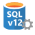

<properties
    pageTitle="Neuigkeiten in SQL-Datenbank V12 | Microsoft Azure"
    description="Beschreibt, warum Business-Systemen, die Azure SQL-Datenbank in der Cloud verwenden, Dienstleistung durch ein Upgrade auf Version V12 jetzt."
    services="sql-database"
    documentationCenter=""
    authors="MightyPen"
    manager="jhubbard"
    editor=""/>

<tags
    ms.service="sql-database"
    ms.workload="data-management"
    ms.tgt_pltfrm="na"
    ms.devlang="na"
    ms.topic="article"
    ms.date="08/15/2016"
    ms.author="genemi"/>

# Was ist neu in der SQL-Datenbank V12

In diesem Thema werden, die die neue V12-Version von SQL Azure-Datenbank über Version V11 bietet viele Vorteile.

Hinzufügen von Features zur V12 weiterhin. Daher empfehlen wir Ihnen, besuchen Sie unsere Webseite Dienstupdates für Azure und seine Filter zu verwenden:

- In der [SQL-Datenbank-Dienst](https://azure.microsoft.com/updates/?service=sql-database)gefiltert.
- Gefiltert nach allgemeinen Verfügbarkeit [(GA) Ankündigungen](http://azure.microsoft.com/updates/?service=sql-database&update-type=general-availability) für SQL-Datenbank-Features.

Die neueste Informationen zu den Grenzwerten von Ressourcen für SQL-Datenbank wird am beschrieben: [Grenzwerte für SQL Azure-Datenbank Ressource](sql-database-resource-limits.md).

## Höhere Anwendungskompatibilität mit SQL Server

Ein wichtiges Ziel für SQL-Datenbank V12 wurde die Kompatibilität mit Microsoft SQL Server 2014 zu verbessern und um die Kompatibilität zu gewährleisten, wenn neuere Versionen von SQL Server veröffentlicht werden. Zwischen anderen Bereichen erreicht V12 Unstimmigkeit mit SQL Server im wichtigen Bereich der Programmierbarkeit. Beispiel:

- [Integrierte JSON-Unterstützung](https://msdn.microsoft.com/library/dn921897.aspx)

- [Fensterfunktionen](http://msdn.microsoft.com/library/ms189798.aspx)mit [über](http://msdn.microsoft.com/library/ms189461.aspx)

- [XML-Indizes](http://msdn.microsoft.com/library/bb934097.aspx) und [selektiven XML-Indizes](http://msdn.microsoft.com/library/jj670104.aspx)

- [Nachverfolgen von Änderungen](http://msdn.microsoft.com/library/bb933875.aspx)

- [WÄHLEN SIE... IN](http://msdn.microsoft.com/library/ms188029.aspx)

- [Voll-Textsuche](http://msdn.microsoft.com/library/ms142571.aspx)

- [ALTER ausgelegte Konfiguration für die Datenbank (Transact-SQL)](http://msdn.microsoft.com/library/mt629158.aspx)

Finden Sie [hier](sql-database-transact-sql-information.md) für das kleine Gruppe von Features in SQL-Datenbank noch nicht unterstützt.

### Kompatibilität Ebene 130

> [AZURE.IMPORTANT] Ab **Juni 2016**, haben deren Kompatibilität Ebene bei 130, starten Sie die Microsoft SQL Server 2016 GA entspricht *neu* erstellten Datenbanken auf Azure SQL-Datenbank V12
> 
> Sie können `ALTER DATABASE YourDatabase SET COMPATIBILITY_LEVEL = 120` Falls gewünscht.
> 
> Datenbanken vor Juni 2016 erstellt haben keine deren Kompatibilität Ebene durch diese Änderung der standardmäßigen geändert. Noch die Ebene einer Datenbank von aktualisieren und dann auf V12 aus V11 geändert wird.

Eine Erläuterung der, wie Sie Ihre wichtigsten Abfragen zwischen den neuesten im Vergleich zu vorherigen Kompatibilität Ebene vergleichen können finden Sie unter:

- [Verbesserte Abfrageleistung mit Kompatibilität Ebene 130 in SQL Azure-Datenbank](sql-database-compatibility-level-query-performance-130.md)

## Weitere Premium Performance und neue Leistungsmerkmale

V12 erhöht die Datenbank Transaktion Einheiten (DTUs), die alle Premium Leistung Ebenen durch 25 % Mehrkosten zugeordnet. Leistungsgewinne für noch stärkere können mit neuen Features wie erreicht werden:

- Unterstützung für im Speicher [Columnstore Indizes](http://msdn.microsoft.com/library/gg492153.aspx).
- Der [Tabellenpartitionierung von Zeilen](http://msdn.microsoft.com/library/ms187802.aspx) mit der verknüpften [Tabelle ABSCHNEIDEN](http://msdn.microsoft.com/library/ms177570.aspx)verbesserten.
- Die Verfügbarkeit von dynamischen Management Ansichten [(DMVs)](http://msdn.microsoft.com/library/ms188754.aspx) , um zu überwachen und Optimieren der Leistung.

### Zuverlässigen Leistung

Wenn Ihr Clientprogramm mit SQL-Datenbank V12 verbunden ist, während Ihr Client für eine Azure-virtuellen Computern virtueller (Computer) ausgeführt wird, müssen Sie die folgenden Ports Bereiche des virtuellen Computers öffnen:

- 11000-11999
- 14000-14999

Klicken Sie auf [hier](sql-database-develop-direct-route-ports-adonet-v12.md) Weitere Informationen zu den Ports für SQL-Datenbank V12. Die Ports werden von den verbesserte Performance in SQL-Datenbank V12 benötigt.

## Bessere Unterstützung für Cloud SaaS Lieferanten

Nur in V12 freigegeben wir die neue Standard Leistungsstufe S3 und die öffentlichen Vorschau des [Pools flexible Datenbank](sql-database-elastic-pool.md)ein. Flexible Datenbank Pools eine Lösung Cloud SaaS Lieferanten ausgelegt ist.  Mit flexible Datenbank Pools können Sie folgende Aktionen ausführen:

- Freigeben von DTUs zwischen Datenbanken zu Verwaltungskosten für große Anzahl von Datenbanken.
- Führen Sie [flexible Datenbankaufträge](sql-database-elastic-jobs-overview.md) , um bei Datenbanken verwalten.

## Verbesserte Sicherheit

Sicherheit ist eine hohe Priorität für jede Person, die ihr Unternehmen in der Cloud ausgeführt wird. Die neuesten Sicherheitsfeatures in V12 freigegeben umfassen:

- [Sicherheit auf Benutzerebene Zeile](http://msdn.microsoft.com/library/dn765131.aspx) (RLS)
- [Dynamic Data Masking](sql-database-dynamic-data-masking-get-started.md)
- [Eigenständige Datenbanken](http://msdn.microsoft.com/library/ff929188.aspx)
- [Anwendungsrollen](http://msdn.microsoft.com/library/ms190998.aspx) verwaltet mit erteilen, verweigern, widerrufen
- [Transparent Data-Verschlüsselung](http://msdn.microsoft.com/library/0bf7e8ff-1416-4923-9c4c-49341e208c62.aspx) (TDE)
- [Herstellen einer Verbindung mit SQL-Datenbank mithilfe von Azure-Active Directory-Authentifizierung](sql-database-aad-authentication.md)
 - SQL-Datenbank unterstützt jetzt Azure-Active Directory-Authentifizierung, ein Verfahren der Herstellen einer Verbindung mit SQL-Datenbank mithilfe von Identitäten in Azure Active Directory (Azure AD). Mit Azure-Active Directory-Authentifizierung können Sie die Identitäten der Datenbankbenutzer und anderen Microsoft-Diensten an einem zentralen Ort zentral verwalten.
- [Immer verschlüsselt.](https://msdn.microsoft.com/library/mt163865.aspx) (in der Vorschau) macht Verschlüsselung für Applikationen transparent und ermöglicht es Clients, vertrauliche Daten in Clientanwendungen verschlüsseln, ohne die Freigabe der Schlüssel für die Verschlüsselung mit SQL-Datenbank.

## Geschäftskontinuität erhöht, wenn Wiederherstellung erforderlich ist

V12 bietet verbesserte Wiederherstellung Punkt Ziele (RPOs) und das Eineinhalbfache geschätzte Wiederherstellung (ERTs):

| Business Continuity-feature | Frühere version | V12 |
| :-- | :-- | :-- |
| Geo-wiederherstellen | • RPO < 24 Stunden. • Einfügen < 12 Stunden. | • RPO < 1 Stunde. • Einfügen < 12 Stunden. |
| Aktive Geo-Replikation | • RPO < 5 Minuten. • Einfügen < 1 Stunde. | • RPO < 5 Sekunden. • Einfügen < 30 Sekunden. |

Weitere Informationen finden Sie unter [Geschäftskontinuität SQL-Datenbank](sql-database-business-continuity.md) .

## Weitere Gründe, warum jetzt aktualisieren

Es gibt viele gute Gründe, warum Kunden jetzt auf Azure SQL-Datenbank V12 aus V11 aktualisieren sollten:

- SQL-Datenbank V12 verfügt über eine lange Liste der Features, die über die Features von V11.
- Wir weiterhin V12 neue Features hinzufügen, jedoch keine neuen Features werden V11 hinzugefügt.
- Die meisten neuen Features werden auf SQL-Datenbank V12 freigegeben, bevor sie für Microsoft SQL Server veröffentlicht werden.

## Sind Sie bereits V12 verwenden?

Eine einfache Möglichkeit, um festzustellen, ob Sie eine Datenbank oder einen logischen Server auf eine frühere Version des Diensts SQL-Datenbank ausgeführt haben, ist wie folgt:

1. Wechseln Sie zum [Azure-Portal](https://portal.azure.com/)an.
2. Klicken Sie auf **Durchsuchen**.
3. Klicken Sie auf **SQL Server**.
4. Das Symbol neben der Server oder die Datenbank Antwort die:
 -  **V12 logischen Server**
 -  **frühere Version logischen Server**

Ein anderes Verfahren zum Ermitteln der Version ist zum Ausführen der `SELECT @@version;` -Anweisung in der Datenbank, und zeigen Sie die Ergebnisse, die ähnliche:

- **12**.0.2000.10 &nbsp; *(Version V12)*
- **11**.0.9228.18 &nbsp; *(Version V11)*

Eine Datenbank V12 kann nur auf einen logischen V12-Server gehostet werden. Und ein Server V12 kann nur V12 Datenbanken hosten.

Wenn Sie noch nicht auf V12 ausgeführt werden, können Sie Ihre logischen Server gemäß die Anweisungen in [Upgrade auf SQL-Datenbank V12 direkte](sql-database-v12-plan-prepare-upgrade.md)aktualisieren.

## Allgemeine Verfügbarkeit Regionen

- Nach dem 31 Juli 2015 hatten alle Regionen zu allgemeinen Verfügbarkeit (GA) höher gestuft wurden.
- V12 wurde im Dezember 2014, jedoch nur bei den Status der Vorschau zur Verfügung.

[Zusätzliche Nutzungsbedingungen für die Microsoft Azure-Vorschau](https://azure.microsoft.com/support/legal/preview-supplemental-terms/).
