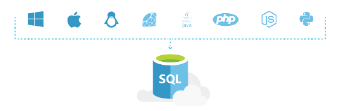

<properties
   pageTitle="SQL Azure-Datenbank funktioniert in Ihrer Umgebung"
   description="Erfahren Sie, wie SQL-Datenbank hilft, sichert und Loss"
   keywords=""
   services="sql-database"
   documentationCenter=""
   authors="CarlRabeler"
   manager="jhubbard"
   editor=""/>

<tags
   ms.service="sql-database"
   ms.devlang="NA"
   ms.topic="article"
   ms.tgt_pltfrm="NA"
   ms.workload="data-management"
   ms.date="10/13/2016"
   ms.author="carlrab"/>

# SQL Azure-Datenbank funktioniert in Ihrer Umgebung

## Verbinden Sie mit bereits kennen

Das letzte, was, das Sie tun möchten, ist etwas neu lernen, wie einfach herstellen von Verbindungen mit einer Datenbank. Azure SQL-Datenbank erleichtert die mit einer Vielzahl von Sprachen und Plattformen aus, die Sie für die Arbeit mit es gewohnt sind.

Wenn Sie eine Datenbank auswählen, müssen Sie dürfen nicht in einer neuen Plattform verschieben, oder eine neue Sprache erlernen. SQL-Datenbank weist Codebeispielen behilflich, helfen, wo Sie sich befinden.  

[Erfahren Sie mehr über die Entwicklung von SQL-Datenbank](sql-database-develop-overview.md) 

## Die richtigen Tools für Ihre Arbeit

Sie müssen nicht erfahren Sie, einen umfassender neuen Satz von Tools zur Seite Erste Schritte mit SQL-Datenbank. Sie können open Source-Tools, wie [Cheetah](https://github.com/wunderlist/cheetah), [Sql-Cli](https://www.npmjs.com/package/sql-cli), [Code im Vergleich](https://code.visualstudio.com/)nutzen. Darüber hinaus funktioniert Azure SQL-Datenbank mit Microsoft-Tools, wie [Visual Studio](https://www.visualstudio.com/visual-studio-homepage-vs.aspx) und [SQL Server Management Studio](https://msdn.microsoft.com/library/ms174173.aspx).  Sie können auch die Azure-Verwaltungsportal PowerShell verwenden und REST-APIs helfen Ihnen bei zusätzlichen Produktivität zu erhalten.

## Schneller Einstieg

Die richtigen Anwers auf Ihre Fragen SQL-Datenbank werden nie zu weit mit Lernprogramme zum Erstellen Ihrer ersten SQL-Datenbank, Problembehandlung Abfragen und Schnellstart Codebeispielen.

[Weitere Informationen zu SQL-Datenbank](sql-database-technical-overview.md)

## Nächste Schritte

Erhalten einer [kostenlosen Azure-Abonnement](https://azure.microsoft.com/get-started/) und [Erstellen Ihrer ersten Azure SQL-Datenbank](sql-database-get-started.md).

## Zusätzliche Ressourcen

* Untersuchen Sie die [Funktionen von SQL-Datenbank](https://azure.microsoft.com/services/sql-database/).
* Lesen Sie die [Technische Übersicht der SQL-Datenbank](sql-database-technical-overview.md).
* [Übersicht über die Entwicklung von SQL-Datenbank](sql-database-develop-overview.md)
