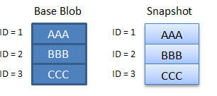
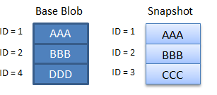

<properties
    pageTitle="Erstellen Sie eine schreibgeschützte Momentaufnahme eines Blob | Microsoft Azure"
    description="Informationen Sie zum Erstellen einer Momentaufnahme eines Blob BLOB-Daten zu einem angegebenen Zeitpunkt sichern. Verstehen Sie, wie Momentaufnahmen in Rechnung gestellt werden und deren Verwendung um zu minimieren Kapazitätsgebühren."
    services="storage"
    documentationCenter=""
    authors="tamram"
    manager="carmonm"
    editor="tysonn"/>

<tags
    ms.service="storage"
    ms.workload="storage"
    ms.tgt_pltfrm="na"
    ms.devlang="na"
    ms.topic="article"
    ms.date="10/18/2016"
    ms.author="tamram"/>

# Erstellen Sie ein Blob snapshot

## (Übersicht)

Eine Momentaufnahme ist eine schreibgeschützte Version eines Blob, der zu einem bestimmten Zeitpunkt durchgeführt wird. Momentaufnahmen sind nützlich für Blobs sichern. Nachdem Sie eine Momentaufnahme erstellt haben, können Sie lesen, kopieren oder löschen, aber nicht ändern.

Eine Momentaufnahme der Blob entspricht der Basis Blob, mit dem Unterschied, dass das Blob-URI weist einen **DateTime** -Wert angefügt, um die Blob-URI, um den Zeitpunkt anzugeben, an dem die Momentaufnahme erstellt wurde. Beträgt beispielsweise, wenn eine Seite URI BLOB- `http://storagesample.core.blob.windows.net/mydrives/myvhd`, den URI dem ähnelt Snapshot `http://storagesample.core.blob.windows.net/mydrives/myvhd?snapshot=2011-03-09T01:42:34.9360000Z`. 

> [AZURE.NOTE] Alle Momentaufnahmen Freigeben der Basis Blob-URI. Nur Unterschied zwischen der Basis Blob und den Snapshot ist der angefügten **DateTime** -Wert.

Ein Blob kann eine beliebige Anzahl von Momentaufnahmen konvertiert haben. Momentaufnahmen bleiben erhalten, bis sie explizit gelöscht werden. Eine Momentaufnahme kann nicht auf deren Basis Blob Überleben. Sie können die Momentaufnahmen der Basis Blob zum Nachverfolgen Ihrer aktuellen Momentaufnahmen zugeordnet auflisten.

Beim Erstellen einer Momentaufnahme eines Blob werden die-BLOB-Systemeigenschaften auf den Snapshot mit den gleichen Werten kopiert. Die Basis Blob-Metadaten wird auch mit der Momentaufnahme kopiert, es sei denn, Sie separate Metadaten für den Snapshot angeben, nach der Erstellung.

Die Basis Blob zugeordnet Leases wirken sich nicht auf den Snapshot aus. Eine verleasen auf eine Momentaufnahme kann nicht abgerufen werden.

## Erstellen Sie eine Momentaufnahme

Im folgenden Code wird gezeigt, wie eine Momentaufnahme in .NET zu erstellen. In diesem Beispiel gibt separate Metadaten für den Snapshot erstellt wird.

    private static async Task CreateBlockBlobSnapshot(CloudBlobContainer container)
    {
        // Create a new block blob in the container.
        CloudBlockBlob baseBlob = container.GetBlockBlobReference("sample-base-blob.txt");

        // Add blob metadata.
        baseBlob.Metadata.Add("ApproxBlobCreatedDate", DateTime.UtcNow.ToString());

        try
        {
            // Upload the blob to create it, with its metadata.
            await baseBlob.UploadTextAsync(string.Format("Base blob: {0}", baseBlob.Uri.ToString()));

            // Sleep 5 seconds.
            System.Threading.Thread.Sleep(5000);

            // Create a snapshot of the base blob.
            // Specify metadata at the time that the snapshot is created to specify unique metadata for the snapshot.
            // If no metadata is specified when the snapshot is created, the base blob's metadata is copied to the snapshot.
            Dictionary<string, string> metadata = new Dictionary<string, string>();
            metadata.Add("ApproxSnapshotCreatedDate", DateTime.UtcNow.ToString());
            await baseBlob.CreateSnapshotAsync(metadata, null, null, null);
        }
        catch (StorageException e)
        {
            Console.WriteLine(e.Message);
            Console.ReadLine();
            throw;
        }
    }
 

## Kopieren von Momentaufnahmen

Von Kopiervorgängen im Zusammenhang mit Blobs und Momentaufnahmen anwendbare Regeln

- Sie können eine Momentaufnahme über deren Basis Blob kopieren. Durch Heraufstufen eine Momentaufnahme an die Position des Basis Blob, können Sie eine frühere Version eines Blob wiederherstellen. Die Momentaufnahme bleibt, aber der Basis Blob wird mit einer beschreibbare Kopie der Snapshot überschrieben.

- Sie können eine Momentaufnahme in einer Ziel Blob mit einem anderen Namen kopieren. Das resultierende Ziel Blob ist eine beschreibbare Blob und nicht um eine Momentaufnahme.

- Wenn ein Quelle Blob kopiert wird, werden alle Momentaufnahmen der Quelle Blob nicht an das Ziel kopiert. Wenn ein Ziel Blob mit einer Kopie überschrieben wird, bleiben alle Momentaufnahmen der ursprünglichen Ziel Blob zugeordnet erhalten.

- Wenn Sie eine Momentaufnahme der blockieren Blob erstellen, wird der Blob des zugesicherte Blockliste auch auf den Snapshot kopiert. Alle blockiert werden nicht kopiert.

## Geben Sie eine Access-Bedingung

Sie können eine Access-Bedingung angeben, damit der Snapshot erstellt wird, nur, wenn eine Bedingung erfüllt ist. Wenn Sie eine Access-Bedingung angeben möchten, verwenden Sie die **AccessCondition** -Eigenschaft. Wenn die angegebene Bedingung nicht erfüllt ist, der Snapshot wird nicht erstellt, und der Blob-Dienst gibt Statuscode HTTPStatusCode.PreconditionFailed.

## Löschen von Momentaufnahmen

Einen Blob mit Momentaufnahmen kann nicht gelöscht werden, es sei denn, die Momentaufnahmen ebenfalls gelöscht. Sie können eine Momentaufnahme einzeln löschen oder angeben, dass alle Momentaufnahmen gelöscht werden, wenn das Quelle Blob gelöscht wird. Wenn Sie versuchen, einen Blob löschen, der noch Momentaufnahmen enthält, tritt ein Fehler auf.

Im folgenden Code wird gezeigt, wie ein Blob und der Momentaufnahmen in .NET löschen, in dem `blockBlob` eine Variablen vom Typ **CloudBlockBlob**ist:

    await blockBlob.DeleteIfExistsAsync(DeleteSnapshotsOption.IncludeSnapshots, null, null, null);

## Momentaufnahmen mit Azure Premium-Speicher

Verwenden von Momentaufnahmen mit Premium Speicher folgen dieser Regeln:

- Die maximale Anzahl von Momentaufnahmen pro Seitenblob in einem Premium Speicherkonto ist 100. Wenn dieser Grenzwert überschritten wird, gibt der Blob Snapshot Vorgang mit dem Fehlercode 409 (**SnapshotCountExceeded**) aus.

- Sie können eine Momentaufnahme der Seitenblob in einem Premium Speicherkonto alle 10 Minuten dauern. Wenn diese Rate überschritten wird, gibt der Blob Snapshot Vorgang mit dem Fehlercode 409 (**SnaphotOperationRateExceeded**) aus.

- Sie können keine Blob erhalten, wenn Sie eine Momentaufnahme der Seitenblob in einem Premium Speicherkonto lesen aufrufen. Abrufen von Blob für eine Momentaufnahme in einem Premium Speicherkonto Aufrufen gibt 400 (**InvalidOperation**) mit dem Fehlercode. Sie jedoch können Blob-Eigenschaften erhalten und erste Blob-Metadaten für eine Momentaufnahme in einem Premium Speicherkonto aufrufen.

- Um eine Momentaufnahme lesen möchten, können Sie den Vorgang kopieren Blob um eine Momentaufnahme in einer anderen Seitenblob in das Konto zu kopieren. Das Ziel-Blob für den Kopiervorgang müssen keine vorhandenen Momentaufnahmen. Wenn das Ziel Blob Momentaufnahmen ausgestattet ist, gibt der Vorgang kopieren Blob Fehlercode 409 (**SnapshotsPresent**).

## Kehren Sie zu einer Momentaufnahme den absoluten URI zurück

In diesem C#-Code-Beispiel erstellt eine Momentaufnahme und schreibt den absoluten URI für die gewohnten Standort befinden.

    //Create the blob service client object.
    const string ConnectionString = "DefaultEndpointsProtocol=https;AccountName=account-name;AccountKey=account-key";

    CloudStorageAccount storageAccount = CloudStorageAccount.Parse(ConnectionString);
    CloudBlobClient blobClient = storageAccount.CreateCloudBlobClient();

    //Get a reference to a container.
    CloudBlobContainer container = blobClient.GetContainerReference("sample-container");
    container.CreateIfNotExists();

    //Get a reference to a blob.
    CloudBlockBlob blob = container.GetBlockBlobReference("sampleblob.txt");
    blob.UploadText("This is a blob.");

    //Create a snapshot of the blob and write out its primary URI.
    CloudBlockBlob blobSnapshot = blob.CreateSnapshot();
    Console.WriteLine(blobSnapshot.SnapshotQualifiedStorageUri.PrimaryUri);

## Verstehen Sie, wie Momentaufnahmen Gebühren fällig

Erstellen einer Momentaufnahme, also eine schreibgeschützte Kopie eines Blob kann zusätzliche Speicher Gebühren bei Ihrem Konto dazu führen. Beim Entwurf einer Anwendung, ist es wichtig, sich bewusst sein, wie diese Gebühren fällig möglicherweise, damit Sie unnötige Kosten minimieren können.

### Wichtige Aspekte der Abrechnung

Die folgende Liste enthält wichtige Punkte beachten Sie beim Erstellen einer Momentaufnahme.

- Speicherkonto budgetgerecht Gebühren für eindeutige Blöcke oder Seiten, ob sie in der Blob oder in der Momentaufnahme sind. Ihr Konto entstehen keine zusätzliche Gebühren für Momentaufnahmen eines Blob zugeordnet ist, bis Sie das Blob aktualisieren, auf dem basieren. Nachdem Sie das base Blob aktualisiert habe, weicht es von der Momentaufnahmen. In diesem Fall unterliegen Sie für die eindeutigen Blöcke oder Seiten in jeder Blob oder eine Momentaufnahme.

- Wenn Sie einen Textblock innerhalb eines Zeitraums Blob ersetzen, werden als eindeutige Block später Blocks in Rechnung gestellt. Dies gilt auch, wenn des Zeitraums dieselbe blockieren-ID und die gleichen Daten hat, wie er in der Momentaufnahme verfügt. Nachdem des Zeitraums zugesichert wurde erneut, es weicht von Gegenstück in eine Momentaufnahme, und Sie dessen Daten berechnet werden. Gleiches gilt für eine Seite in einer Seitenblob, der mit identischen Daten aktualisiert wird.

- Ersetzen eines BLOBs blockieren, indem Sie die Methode **UploadFile**, **UploadText**, **UploadStream**oder **UploadByteArray** werden alle Blöcke im Blob ersetzt. Wenn Sie eine Momentaufnahme dieser Blob zugeordnet haben, alle Blöcke Basis Blob und Momentaufnahme jetzt abweichen, und Ihnen werden für alle Blöcke in beiden Blobs berechnet werden. Dies gilt auch, wenn die Daten in der Basis Blob und die Momentaufnahme identisch bleiben.

- Der Azure Blob-Dienst verfügt nicht über eine Möglichkeit um festzustellen, ob zwei Blöcke identische Daten enthalten. Jeder Block, die hochgeladen und zugesichert wird als eindeutig behandelt, auch wenn sie dieselben Daten und die gleiche TextBlock-ID hat Da Gebühren für eindeutige Blöcke fällig, ist es wichtig zu berücksichtigen ist, die einen Blob, das eine Momentaufnahme ergibt zusätzliche eindeutige Blöcke und zusätzliche Gebühren aktualisieren.

> [AZURE.NOTE] Bewährte Methoden geben vor, dass Sie sorgfältig, vermeiden Sie zusätzliche Gebühren Momentaufnahmen verwalten. Es empfiehlt sich, dass Sie auf folgende Weise Momentaufnahmen verwalten:

> - Löschen und Neuerstellen von Momentaufnahmen zugeordnet ein Blob bei jeder Aktualisierung das Blob, selbst wenn Sie mit identischen Daten aktualisiert werden, es sei denn, Entwurf der Anwendung erfordert, dass Sie Momentaufnahmen verwalten. Durch Löschen und die-BLOB-Momentaufnahmen neu zu erstellen, können Sie sicherstellen, dass die Blob und Momentaufnahmen nicht abweichen.

> - Wenn Sie für ein Blob Momentaufnahmen verwalten, vermeiden Sie zum Aktualisieren des BLOBs **UploadFile**, **UploadText**, **UploadStream**oder **UploadByteArray** aufrufen. Diese Methoden ersetzen alle Blöcke im Blob, damit Ihre Basis Blob und Momentaufnahmen erheblich abweichen. Aktualisieren Sie stattdessen die geringste Anzahl Anzahl Blöcke mithilfe der Methoden **PutBlock** und **PutBlockList** ein.

### Snapshot Abrechnung Szenarien

Die folgenden Szenarien veranschaulicht, wie Gebühren für ein Blob blockieren und der Momentaufnahmen fällig.

In Szenario 1 wurde das base Blob nicht aktualisiert, nachdem die Momentaufnahme erstellt wurde, sodass nur für eindeutige Blöcke 1, 2 und 3 Gebühren angefallen sind.

In Szenario 2 das base Blob wurde aktualisiert, aber die Momentaufnahme weist nicht. Block 3 aktualisiert wurde, und obwohl sie dieselben Daten und dieselbe ID enthält, es ist nicht gleich 3 in der Momentaufnahme blockieren. Daher wird das Konto für vier Blöcke berechnet.

In Szenario 3 das base Blob wurde aktualisiert, aber die Momentaufnahme weist nicht. Block 3 durch Blockieren 4 im Basis Blob ersetzt wurde, aber der Snapshot spiegelt weiterhin blockieren 3. Daher wird das Konto für vier Blöcke berechnet.

Szenario 4 das base Blob vollständig aktualisiert wurde und enthält keine der ursprünglichen Blöcke. Daher wird das Konto für alle acht eindeutige Blöcke belastet. Dieses Szenario kann auftreten, wenn Sie eine Update-Methode, z. B. **UploadFile**, **UploadText**, **UploadFromStream**oder **UploadByteArray**, verwenden, da diese Methoden des Inhalts eines Blob alle ersetzen.

## Nächste Schritte

Finden Sie weitere Beispiele für die Verwendung von Blob-Speicher [Codebeispielen Azure](https://azure.microsoft.com/documentation/samples/?service=storage&term=blob)aus. Sie können eine Stichprobe Anwendung herunterladen und auszuführen, oder Durchsuchen Sie den Code auf GitHub. 
