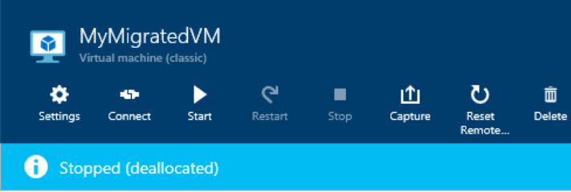

<properties
    pageTitle="Behandeln von Problemen mit Azure-Speicherkonten, Container oder virtuelle Festplatten in einer klassischen Bereitstellung löschen | Microsoft Azure"
    description="Behandeln von Problemen mit Azure-Speicherkonten, Container oder virtuelle Festplatten in einer klassischen Bereitstellung löschen"
    services="storage"
    documentationCenter=""
    authors="genlin"
    manager="felixwu"
    editor="tysonn"
    tags="storage"/>

<tags
    ms.service="storage"
    ms.workload="na"
    ms.tgt_pltfrm="na"
    ms.devlang="na"
    ms.topic="article"
    ms.date="10/18/2016"
    ms.author="genli"/>

# Behandeln von Problemen mit Azure-Speicherkonten, Container oder virtuelle Festplatten in einer klassischen Bereitstellung löschen

[AZURE.INCLUDE [storage-selector-cannot-delete-storage-account-container-vhd](../../includes/storage-selector-cannot-delete-storage-account-container-vhd.md)]

Wenn Sie versuchen, den Azure-Speicher Firmen-, Container oder virtuelle Festplatte in der [Azure-Portal](https://portal.azure.com/) oder im [Azure klassischen Portal](https://manage.windowsazure.com/)löschen möglicherweise werden Fehler ausgegeben. Durch den folgenden Umständen können die Probleme verursacht werden:

-   Wenn Sie einen virtuellen Computer löschen, werden die Datenträger und virtuelle Festplatte nicht automatisch gelöscht. Möglicherweise, die den Grund für Fehler beim Löschen von Speicher-Konto ein. Wir nicht die Festplatte zu löschen, damit Sie den Datenträger zum Bereitstellen von einem anderen virtuellen Computer verwenden können.

-   Es gibt immer noch eine verleasen auf einem Datenträger oder der Blob, das der Datenträger zugeordnet ist.

Wenn Ihre Azure Problem nicht in diesem Artikel behandelt wird, besuchen Sie die Azure-Foren auf [MSDN und den Stapelüberlauf](https://azure.microsoft.com/support/forums/)ein. Sie können das Problem auf diese Foren oder zu Posten @AzureSupport auf Twitter. Darüber hinaus können Sie eine Supportanfrage Azure-Datei, indem Sie auf der Website [Azure unterstützen](https://azure.microsoft.com/support/options/) **Unterstützung** auswählen.

## Symptome

Im folgende Abschnitt listet häufig auftretender Fehler, die Sie möglicherweise erhalten, wenn Sie versuchen, den Azure-Speicherkonten, Container oder virtuelle Festplatten zu löschen.

### Szenario 1: Eine Speicherkonto kann nicht gelöscht

Wenn Sie mit dem Speicherkonto im [Azure-Portal](https://portal.azure.com/) oder [Azure klassischen Portal](https://manage.windowsazure.com/) , und wählen Sie **Löschen**navigieren, wird möglicherweise Sie die folgende Fehlermeldung angezeigt:

*Speicher-Konto StorageAccountName enthält virtueller Computer Bilder. Stellen Sie sicher, dass diese Bilder virtueller Computer vor dem Löschen von diesem Speicherkontos entfernt werden.*

Dieser Fehler wird möglicherweise auch angezeigt:

**Klicken Sie auf der Azure-Portal**:

*Fehler beim Speicherkonto < virtueller Computer-Speicher-Kontonamen > löschen. Speicherkonto < virtueller Computer-Speicher-Kontonamen > kann nicht gelöscht: ' Speicher-Konto < virtueller Computer-Speicher-Kontonamen > verfügt, einige aktive Bild(er) und/oder Datenträger. Sicherzustellen, dass diese Bild(er) und/oder Datenträger vor dem Löschen von diesem Speicherkontos entfernt werden. ".*

**Klassische auf Azure-Portal**:

*Speicher-Konto < virtueller Computer-Speicher-Kontonamen > enthält einige aktive Bild(er) und/oder Datenträger, z. B. Xxxxxxxxx-Xxxxxxxxx-O-209490240936090599. Vergewissern Sie sich diese Bild(er) und/oder Datenträger vor dem Löschen von diesem Speicherkontos entfernt werden.*

Oder

**Klicken Sie auf der Azure-Portal**:

*Speicherkonto < virtueller Computer-Speicher-Kontonamen > weist 1 Container(s) der aktiven Abbildung und/oder Datenträger Elemente verfügen. Sicherzustellen, dass diese Elemente aus dem Bild Repository entfernt werden, vor dem Löschen von diesem Speicherkontos*.

**Klassische auf Azure-Portal**:

*Fehler beim Speicher übermitteln Konto < virtueller Computer-Speicher-Kontonamen > weist 1 Container(s) der aktiven Abbildung und/oder Datenträger Elemente verfügen. Stellen Sie sicher, dass diese Elemente aus dem Repository Bild vor dem Löschen von diesem Speicherkontos entfernt werden. Wenn Sie versuchen, eine Speicher-Konto zu löschen und noch aktiv Datenträger zugeordnet vorhanden sind, sehen Sie eine Meldung angezeigt, es gibt aktive Datenträger, die gelöscht werden müssen*.

### Szenario 2: Entfernen eines Containers können nicht genutzt werden

Wenn Sie versuchen, den Speichercontainer löschen, wird möglicherweise den folgenden Fehler angezeigt:

*Fehler beim Löschen von Speichercontainer <container name>. Fehler: "für den Container ist aktuell eine verleasen und keine verleasen-ID in der Besprechungsanfrage angegeben wurde*.

### Szenario 3: Kann nicht zum Löschen einer virtuellen Festplatte

Nachdem Sie ein virtuellen Computers löschen, und versuchen Sie dann die Blobs für die zugeordneten virtuelle Festplatten zu löschen, können Sie die folgende Meldung angezeigt:

*Fehler beim Löschen von Blob ' Pfad/XXXXXX-XXXXXX-os-1447379084699.vhd'. Fehler: "auf das Blob wird aktuell eine verleasen und keine verleasen-ID in der Besprechungsanfrage angegeben wurde.*

## Lösung
Führen Sie die folgende Methode, um die am häufigsten auftretenden Probleme zu beheben:

### Schritt 1: Löschen Sie OS Datenträger, die den Löschvorgang der Speicher-Konto, Container oder virtuelle Festplatte verhindern

1. Wechseln Sie zu der [Azure klassischen Portal](https://manage.windowsazure.com/).
2. Wählen Sie **virtuellen Computern** > **Festplatten**.

    

3. Suchen Sie die Datenträger, die stehen im Zusammenhang mit Speicher Firmen-, Container oder virtuelle Festplatte, die Sie löschen möchten. Wenn Sie die Position des Datenträgers aktivieren, finden Sie die zugehörige Speicher Firmen-, Container oder virtuelle Festplatte.

    

4. Bestätigen Sie, dass keine virtuellen Computer, klicken Sie auf das Feld **angefügter** der Datenträger aufgeführt ist, und klicken Sie dann löschen Sie die Datenträger.

    > [AZURE.NOTE] Wenn ein Datenträger eines virtuellen Computers zugeordnet ist, werden Sie nicht löschen können. Datenträger werden asynchrone eines gelöschten virtuellen Computers getrennt. Es kann einige Minuten nach dem Löschen des virtuellen Computer für dieses Feld zum Deaktivieren von dauern.

### Schritt 2: Löschen Sie alle virtuellen Computer Grafiken, die Löschung des Speicher-Konto oder Container verhindern

1. Wechseln Sie zu der [Azure klassischen Portal](https://manage.windowsazure.com/).
2. Wählen Sie **virtuellen Computern** > **Bilder**, und löschen Sie die Bilder, die im Speicher-Konto, Container oder virtuelle Festplatte zugeordnet sind.

    Versuchen Sie anschließend, die Speicher-Konto, Container oder virtuelle Festplatte erneut zu löschen.

> [AZURE.WARNING] Achten Sie darauf, dass Sie nichts sichern, die Sie speichern, bevor Sie das Konto löschen möchten. Es ist nicht möglich, zum Wiederherstellen eines gelöschten Speicher-Kontos oder zum Abrufen von Inhalten, die sie vor dem Löschen enthalten. Dies gilt auch für alle Ressourcen WAHR in das Konto: Nachdem Sie eine virtuelle Festplatte, Blob, Tabelle, Warteschlange oder Datei löschen, wird es dauerhaft gelöscht. Stellen Sie sicher, dass die Ressource nicht verwendet wird.

## Informationen zu den Status beendet (freigegeben)

Virtuellen Computern, die in der klassischen Bereitstellungsmodell erstellt wurden und wurden, die beibehalten, können den Status **beendet (freigegeben)** auf den [Azure-Portal](https://portal.azure.com/) oder [Azure klassischen Portal](https://manage.windowsazure.com/)sind.

**Azure klassischen Portal**:

**Azure-Portal**:

Status "Angehalten (freigegeben)" die Computerressourcen frei, wie z. B. CPU, Arbeitsspeicher und Netzwerk. Der Datenträger verbleiben jedoch weiterhin, damit Sie schnell den virtuellen Computer bei Bedarf neu erstellen können. Auf virtuellen Festplatten, der von Azure-Speicher unterstützt werden, werden diese Datenträger erstellt. Das Speicherkonto weist diese virtuelle Festplatten und die Datenträger Leases auf diese virtuelle Festplatten haben.

## Nächste Schritte

- [Löschen eines Kontos Speicher](storage-create-storage-account.md#delete-a-storage-account)
- [So unterbrechen Sie die gesperrte verleasen Blob-Speicher in Microsoft Azure (PowerShell)](https://gallery.technet.microsoft.com/scriptcenter/How-to-break-the-locked-c2cd6492)
