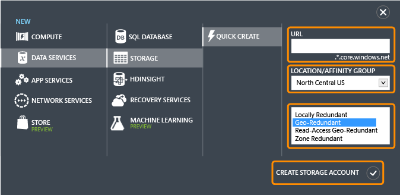
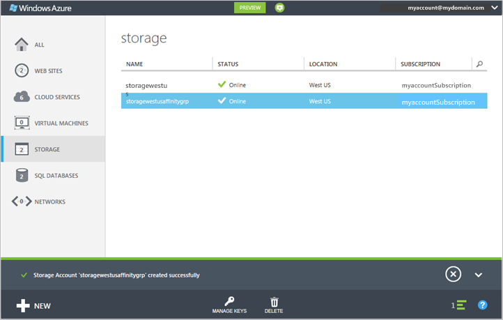
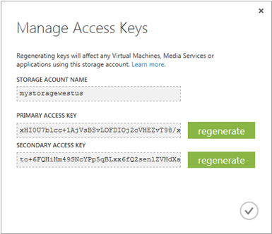

<properties
    pageTitle="So erstellen, verwalten oder löschen ein Speicherkonto im klassischen Azure-Portal | Microsoft Azure"
    description="Erstellen einer neuen Speicher Firma, verwalten Sie Ihr Konto Zugriffstasten oder löschen Sie ein Speicherkonto Azure-Portal. Informationen Sie zu Standard- und Premium Speicherkonten."
    services="storage"
    documentationCenter=""
    authors="robinsh"
    manager="carmonm"
    editor="tysonn"/>

<tags
    ms.service="storage"
    ms.workload="storage"
    ms.tgt_pltfrm="na"
    ms.devlang="na"
    ms.topic="get-started-article"
    ms.date="07/26/2016"
    ms.author="robinsh"/>

# Informationen über Konten Azure-Speicher

[AZURE.INCLUDE [storage-selector-portal-create-storage-account](../../includes/storage-selector-portal-create-storage-account.md)]
 
[AZURE.INCLUDE [storage-try-azure-tools](../../includes/storage-try-azure-tools.md)]

## (Übersicht)

Ein Konto Azure-Speicher erhalten Sie Zugriff auf die Dienste Azure Blob, Warteschlange, Tabelle und Datei Azure-Speicher. Ihr Speicherkonto stellt den eindeutigen Namespace für Ihre Datenobjekte Azure-Speicher. Standardmäßig ist die Daten in Ihr Konto nur für Sie der Kontobesitzer verfügbar.

Es gibt zwei Arten von Speicherkonten aus:

- Ein standard Speicherkonto umfasst Blob, Tabelle, Warteschlange und Datei speichern.
- Ein Premium Speicherkonto unterstützt derzeit nur Azure-virtuellen Computern Datenträger aus. Finden Sie unter [Premium Speicher: leistungsstarke Storage für Azure-virtuellen Computern Auslastung](storage-premium-storage.md) für ein detaillierter Überblick Premium-Speicher.

## Speicher Konto Abrechnung

Sie sind für Azure speichernutzung anhand Ihres Speicherkontos Abrechnung. Kosten für die Speicherung basieren auf vier Faktoren: Speicherkapazität, Replikation Farbschema, Speichertransaktionen und Daten Ausgang.

- Speicherkapazität verweist, wie viel der Zuteilung Ihrer Speicher-Konto Sie sich zum Speichern von Daten verwenden. Die Kosten einfach zum Speichern von Daten wird bestimmt, wie viele Daten die gespeichert werden und wie diese repliziert wird.
- Replikation bestimmt, wie viele Kopien Ihrer Daten auf einmal und in welchen Positionen verwaltet werden.
- Transaktionen verweisen, um alle lesen und Schreiben von Vorgängen in Azure-Speicher.
- Daten Ausgang bezieht sich auf Daten aus einer Azure Ihrer Region übertragen. Wenn die Daten in Ihr Speicherkonto erfolgt durch eine Anwendung, die nicht in der gleichen Region, ausgeführt wird, ob die Anwendung einen Clouddienst oder eine andere Art von Anwendung ist, werden Ihnen für die Daten Ausgang berechnet. (Für Azure Services, können Sie die erforderlichen Schritte zum Gruppieren von Daten und der Dienstleistungen im gleichen Daten Centers zu verringern oder beseitigen Daten Ausgang Gebühren.)  

Die Seite [Azure Speicher Preise](https://azure.microsoft.com/pricing/details/storage) bietet detaillierte Preisinformationen für Speicherkapazität, Replikation und Transaktionen. Detailseite [Daten Übertragung Preise](https://azure.microsoft.com/pricing/details/data-transfers/) bietet detaillierte Preisinformationen für Daten Ausgang.

Details zu Speicher Konto Kapazität und Leistung Ziele finden Sie unter [Leistung und Skalierbarkeit der Azure-Speicher](storage-scalability-targets.md).

> [AZURE.NOTE] Beim Erstellen einer Azure-virtuellen Computern ist ein Speicherkonto für Sie erstellt automatisch in den Speicherort der Bereitstellung, wenn Sie nicht bereits ein Speicherkonto in diesem Speicherort verfügen. So ist es nicht erforderlich, vor dem Erstellen eines Kontos Speicherplatz für Ihre virtuellen Computern Datenträger gehen Sie folgendermaßen vor. Der Kontonamen Speicher basiert auf den Namen des virtuellen Computers. Finden Sie weitere Details der [Azure-virtuellen Computern Dokumentation](https://azure.microsoft.com/documentation/services/virtual-machines/) .

## Erstellen Sie ein Speicherkonto

1. Melden Sie sich bei der [Azure klassischen Portal](https://manage.windowsazure.com).

2. Klicken Sie auf der Taskleiste am unteren Rand der Seite auf **neu** . Wählen Sie **Data Services** | **Speicher**, und klicken Sie dann auf der **Symbolleiste erstellen**.

    

3. Geben Sie im Feld **URL**einen Namen für Ihr Speicherkonto aus.

    > [AZURE.NOTE] Speicher Kontonamen müssen zwischen 3 und 24 Zeichen lang sein und darf Zahlen und nur Kleinbuchstaben enthalten.
    >  
    > Ihren Kontonamen Speicher muss innerhalb Azure eindeutig sein. Das klassische Azure-Portal wird angegeben, wenn der Speicher Kontoname, die Sie auswählen bereits geöffnet ist.

    Finden Sie unter [Speicher Konto Endpunkte](#storage-account-endpoints) unter Details wie der Kontonamen Speicher behoben werden Ihre Objekte in Azure-Speicher verwendet wird.

4. Wählen Sie in der **Gruppe Position/Zugehörigkeit**einen Speicherort für Ihre Speicherkonto, das in der Nähe Sie oder Ihre Kunden ist ein. Wenn Sie Daten in Ihr Speicherkonto aus einem anderen Azure Dienst, beispielsweise eine Azure-virtuellen Computern oder Cloud-Dienst, erfolgt möchten Sie möglicherweise wählen Sie eine Gruppe für die Zugehörigkeit aus der Liste, um Ihr Speicherkonto in derselben Data Center mit anderen Diensten Azure zu gruppieren, die Sie verwenden, um die Leistung und die Kosten.

    Beachten Sie, dass eine Gruppe für die Zugehörigkeit ausgewählt werden muss, wenn Ihr Speicherkonto erstellt wird. Sie können nicht zu einer Gruppe Zugehörigkeit ein vorhandenes Konto wechseln. Weitere Informationen zu Gruppen die finden Sie unter [Service gemeinsame Stelle mit einer Gruppe Zugehörigkeit](#service-co-location-with-an-affinity-group) unten.

    >[AZURE.IMPORTANT] Um zu bestimmen, welche Speicherorte für Ihr Abonnement verfügbar sind, können Sie die [Liste alle Ressourcenanbieter](https://msdn.microsoft.com/library/azure/dn790524.aspx) Operation aufrufen. In der Liste der Anbieter von PowerShell [Get-AzureLocation](https://msdn.microsoft.com/library/azure/dn757693.aspx)anrufen. .NET verwenden Sie die [Liste](https://msdn.microsoft.com/library/azure/microsoft.azure.management.resources.provideroperationsextensions.list.aspx) -Methode der Klasse ProviderOperationsExtensions.
    >
    >Darüber hinaus finden Sie unter [Azure Regionen](https://azure.microsoft.com/regions/#services) , auf welche Dienste zur Verfügung, in welcher Region stehen weitere Informationen zu erhalten.

5. Wenn Sie mehr als ein Azure-Abonnement verfügen, wird das Feld **Abonnement** angezeigt. **Abonnement**Geben Sie das Azure-Abonnement, dem Sie mit das Speicherkonto verwenden möchten.

6. Wählen Sie den gewünschten Grad der Replikation für Ihr Speicherkonto, bei der **Replikation**ist. Die Replikationsoption empfohlene ist Geo redundante Replikation, die maximale Zuverlässigkeit für Ihre Daten bereitstellt. Weitere Informationen zu Replikationsoptionen Azure-Speicher finden Sie unter [Replikation Azure-Speicher](storage-redundancy.md).

6. Klicken Sie auf **Speicher-Konto erstellen**.

    Es kann einige Minuten, um Ihr Speicherkonto erstellen dauern. Um den Status zu überprüfen, können Sie die Benachrichtigungen am unteren Rand des klassischen Azure-Portals überwachen. Nachdem das Speicherkonto erstellt wurde, wird Ihr neues Speicherkonto hat **Online** Status und ist einsatzbereit.

### Speicher Konto Endpunkte

Jedes Objekt, das Sie in Azure-Speicher speichern verfügt über eine eindeutige URL-Adresse. Den Namen des Kontos Speicher bildet die Unterdomäne die Adresse. Die Kombination von Unterdomäne und Domäne Namen, die für jeden Dienst spezifisch ist, bildet einen *Endpunkt* für Ihr Speicherkonto.

Angenommen, wenn Ihr Speicherkonto *Mystorageaccount*benannt wird, sind die Standardendpunkte für Ihr Speicherkonto:

- BLOB-Dienst: http://*Mystorageaccount*. blob.core.windows.net

- Tabelle Dienst: http://*Mystorageaccount*. table.core.windows.net

- Warteschlange Dienst: http://*Mystorageaccount*. queue.core.windows.net

- Datei Dienst: http://*Mystorageaccount*. file.core.windows.net

Sie können die Endpunkte für Ihr Konto Speicherplatz auf dem Dashboard Speicher in der [Klassischen Azure-Portal](https://manage.windowsazure.com) sehen, nachdem das Konto erstellt wurde.

Die URL für den Zugriff auf ein Objekt in einem Speicherkonto wird durch die Position des Objekts in die Speicher-Konto an den Endpunkt anfügen erstellt. Beispielsweise möglicherweise eine Blob-Adresse dieses Format: http://*Mystorageaccount*.blob.core.windows.net/*Mycontainer*/*Myblob*.

Sie können auch einen benutzerdefinierten Domänennamen zur Verwendung mit Ihrem Speicherkonto konfigurieren. Details finden Sie unter [Konfigurieren einer benutzerdefinierten Domänennamen für Ihre Blob-Speicher-Endpunkt](storage-custom-domain-name.md) .

### Gemeinsame Speicherort mit einer Gruppe Zugehörigkeit

Eine *Gruppe Zugehörigkeit* ist eine geografischen Gruppierung Ihrer Azure Dienste und virtuellen Computern mit Ihrem Konto Azure-Speicher. Eine Gruppe für die Zugehörigkeit können Dienstleistung verbessern, in der Mitte der gleichen Daten oder in der Nähe der Benutzer Zielgruppe Computer Auslastung lokalisiert. Wenn Sie Daten in einem Speicherkonto aus einem anderen Dienst zugegriffen werden kann, das Bestandteil derselben Gruppe Zugehörigkeit ist auch keine Gebühren für Ausgang fallen.

> [AZURE.NOTE]  Zum Erstellen einer Gruppe für die Zugehörigkeit öffnen Sie <b>für</b> den Bereich des im [Klassischen Azure-Portal](https://manage.windowsazure.com)zu, klicken Sie auf <b>Gruppen</b>, und klicken Sie dann auf entweder <b>eine Zugehörigkeit Gruppe hinzufügen</b> oder auf die Schaltfläche <b>Hinzufügen</b> . Sie können auch erstellen und Verwalten von Gruppen die mithilfe der Azure Service Management-API. Weitere Informationen finden Sie unter <a href="http://msdn.microsoft.com/library/azure/ee460798.aspx">Gruppen die Vorgänge</a> .

## Zeigen Sie an, kopieren Sie und neu generieren Sie Speicher-Tastenkombinationen

Wenn Sie ein Speicherkonto erstellen, generiert Azure zwei 512-Bit-Speicher-Tastenkombinationen, die für die Authentifizierung verwendet werden, wenn das Speicherkonto zugegriffen werden kann. Azure ermöglicht können, indem Sie zwei Speicher-Tastenkombinationen, die Tasten mit ohne Unterbrechung Ihrer Speicherdienst oder Zugriff auf diesen Dienst neu zu generieren.

> [AZURE.NOTE] Es empfiehlt sich, dass Sie keinen die Zugriffstasten Speicher mit einer anderen Person freigeben. Um Zugriff für Speicherressourcen zuzulassen, ohne dass der Zugriffstasten, können Sie eine *freigegebene Access-Signatur*verwenden. Eine Signatur freigegebenen Access bietet Zugriff auf eine Ressource in Ihr Konto für ein Intervall, das Sie definieren und mit den Berechtigungen, die Sie angeben. Weitere Informationen finden Sie unter [Verwenden von freigegebenen Access Signaturen (SAS)](storage-dotnet-shared-access-signature-part-1.md) .

Verwenden Sie in der [Klassischen Azure-Portal](https://manage.windowsazure.com) **Schlüssel verwalten** auf dem Dashboard oder auf der Seite **Speicher** anzeigen, kopieren und neu generieren der Speicher Tastenkombinationen, die Zugriff auf die Dienste Blob, Tabelle und Warteschlange verwendet werden.

### Kopieren einer Zugriffstaste Speicher  

**Verwalten von Tasten** können Sie eine Zugriffstaste Speicher zur Verwendung in einer Verbindungszeichenfolge kopieren. Die Verbindungszeichenfolge erfordert den Kontonamen für den Speicher und einen Schlüssel für Authentifizierung verwendet. Informationen zum Konfigurieren der Verbindungszeichenfolgen Azure-Speicherservices zugreifen kann finden Sie unter [Konfigurieren von Azure Speicher Verbindungszeichenfolgen](storage-configure-connection-string.md).

1. Im [Klassischen Azure-Portal](https://manage.windowsazure.com)klicken Sie auf **Speicher**, und klicken Sie dann auf den Namen des Kontos Speicherplatz auf das Dashboard zu öffnen.

2. Klicken Sie auf **Schlüssel verwalten**.

    **Verwalten von Zugriffstasten** wird geöffnet.

    

3. Wenn eine Zugriffstaste Speicher kopieren möchten, markieren Sie den Key Text ein. Und klicken Sie dann mit der rechten Maustaste, und klicken Sie auf **Kopieren**.

### Neu generieren Speicher-Tastenkombinationen
Es empfiehlt sich, dass Sie bei Ihrem Speicherkonto regelmäßig zum Schützen Ihrer Speicher-Verbindungen die Zugriffstasten ändern. Sodass Sie Verbindungen mit dem Speicherkonto verwalten können, mithilfe einer Access-Taste gedrückt, während Sie die anderen Zugriffstaste neu generieren, werden zwei Tastenkombinationen zugewiesen.

> [AZURE.WARNING] Erneutes Generieren der Zugriffstasten beeinflussen Dienste in Azure als auch eigene Anwendungen, die das Speicherkonto abhängig sind. Alle Clients, die Zugriffstaste zu verwenden, um das Speicherkonto zuzugreifen müssen aktualisiert werden, um den neuen Product Key zu verwenden.

**Media-Dienste** – Wenn Sie Media-Dienste verfügen, die Ihr Speicherkonto abhängig sind, müssen Sie erneut synchronisieren die Tastenkombinationen mit Ihrem Dienst Medien, nachdem Sie die Tasten erneut generieren.

**Applikationen** – Wenn Sie Webanwendungen oder Cloud Services, in denen Storage-Konto verwendet haben, Verbindungen verloren, wenn Sie Tasten, erneut generieren, wenn Sie Ihre Schlüssel einsatzbereit. 

**Speicher Explorern** – Wenn Sie alle [Speicher Explorer Applications](storage-explorers.md)verwenden, wahrscheinlich müssen Sie den Speicherschlüssel verwendet, die von diesen Anwendungen zu aktualisieren.

So sieht das Verfahren zum Drehen der Zugriffstasten Speicher aus:

1. Aktualisieren Sie die Verbindungszeichenfolgen in Ihrer Anwendungscode auf die sekundäre Zugriffstaste des Speicherkontos verweisen.

2. Die primäre Zugriffstaste für Ihr Speicherkonto neu zu generieren. Klicken Sie in der [Klassischen Azure-Portal](https://manage.windowsazure.com)aus dem Dashboard oder auf der Seite **Konfigurieren** auf **Schlüssel verwalten**. Klicken Sie unter primäre Zugriffstaste auf **neu zu generieren** , und klicken Sie dann auf **Ja,** um zu bestätigen, dass Sie einen neuen Product Key generieren möchten.

3. Aktualisieren der Verbindungszeichenfolgen im Code in Bezug auf die neue primäre Zugriffstaste an.

4. Sekundäre Zugriffstaste neu zu generieren.

## Löschen eines Kontos Speicher

Verwenden Sie zum Entfernen eines Kontos Speicher, das Sie nicht länger verwenden auf dem Dashboard oder der Seite **Konfigurieren** **Löschen** . **Löschen** löscht das gesamte Speicherkonto, einschließlich aller der Blobs, Tabellen und Warteschlangen in das Konto.

> [AZURE.WARNING] Es ist nicht möglich, zum Wiederherstellen eines gelöschten Speicher-Kontos oder zum Abrufen von Inhalten, die sie vor dem Löschen enthalten. Achten Sie darauf, dass Sie nichts sichern, die Sie speichern, bevor Sie das Konto löschen möchten. Dies gilt auch für alle Ressourcen WAHR in das Konto – Nachdem Sie Blob, Tabellen, Warteschlange oder Datei löschen, wird es dauerhaft gelöscht.
>
> Wenn Ihr Speicherkonto virtuelle Festplatte Dateien für eine Azure-virtuellen Computern enthält, müssen Sie löschen alle Bilder und Datenträger, die diese virtuelle Festplatte Dateien verwenden, bevor Sie das Speicherkonto löschen können. Zunächst beenden Sie des virtuellen Computers aus, wenn er ausgeführt wird, und löschen Sie ihn. Wenn Datenträger löschen möchten, navigieren Sie zu der Registerkarte **Datenträger** , und löschen Sie alle Datenträger vorhanden. Um Bilder zu löschen, navigieren Sie zur Registerkarte **Bilder** , und löschen Sie alle Bilder, die in dem Konto gespeichert sind.

1. Klicken Sie in der [Klassischen Azure-Portal](https://manage.windowsazure.com)auf **Speicher**.

2. Klicken Sie auf eine beliebige Stelle im Speicher Kontoeintrag außer den Namen, und klicken Sie dann auf **Löschen**.

     – Oder –

    Klicken Sie auf den Namen des Kontos Speicherplatz auf das Dashboard zu öffnen, und klicken Sie dann auf **Löschen**.

3. Klicken Sie auf **Ja** , um zu bestätigen, dass das Speicherkonto gelöscht werden soll.

## Nächste Schritte

- Um weitere Informationen zur Azure-Speicher finden Sie in der [Dokumentation Azure-Speicher](https://azure.microsoft.com/documentation/services/storage/).
- Besuchen Sie den [Teamblog Azure-Speicher](http://blogs.msdn.com/b/windowsazurestorage/).
- [Übertragen von Daten mit den AzCopy Befehlszeilenprogramms](storage-use-azcopy.md)
