<properties
    pageTitle="Erste Schritte mit Azure Dateispeicher auf Windows | Microsoft Azure"
    description="Speichern von Daten in der Cloud mit Azure-Dateispeicher und Bereitstellen Ihrer Cloud Dateifreigabe aus einer Azure-virtuellen Computern (virtueller Computer) oder aus einer lokalen Anwendung Windows ausgeführt."
    services="storage"
    documentationCenter=".net"
    authors="mine-msft"
    manager="aungoo"
    editor="tysonn" />

<tags ms.service="storage"
    ms.workload="storage"
    ms.tgt_pltfrm="na"
    ms.devlang="dotnet"
    ms.topic="hero-article"
    ms.date="10/18/2016"
    ms.author="minet" />

# Erste Schritte mit auf Windows Azure-Datei-Speicher

[AZURE.INCLUDE [storage-selector-file-include](../../includes/storage-selector-file-include.md)]
 
[AZURE.INCLUDE [storage-try-azure-tools-files](../../includes/storage-try-azure-tools-files.md)]

[AZURE.INCLUDE [storage-file-overview-include](../../includes/storage-file-overview-include.md)]

Informationen zum Verwenden von Dateispeicher mit Linux finden Sie unter [So Azure Dateispeicher mit Linux verwenden](storage-how-to-use-files-linux.md).

Informationen zu Skalierbarkeit und Leistung Zielen Datei Speicher finden Sie unter [Leistung und Skalierbarkeit der Azure-Speicher](storage-scalability-targets.md#scalability-targets-for-blobs-queues-tables-and-files).

[AZURE.INCLUDE [storage-dotnet-client-library-version-include](../../includes/storage-dotnet-client-library-version-include.md)]

[AZURE.INCLUDE [storage-file-concepts-include](../../includes/storage-file-concepts-include.md)]

## Video: Verwenden von mit Windows Azure-Dateispeicher

Hier ist ein Video, das zum Erstellen und verwenden auf Windows Azure-Dateifreigaben veranschaulicht.

> [AZURE.VIDEO azure-file-storage-with-windows]

## Informationen zu diesem Lernprogramm

Erste Schritte Lernprogramm veranschaulicht die Grundlagen der Verwendung von Microsoft Azure Dateispeicher. In diesem Lernprogramm werden folgende Themen erläutert:

- Verwenden Sie Azure-Portal oder PowerShell, erstellen eine neue Azure Dateifreigabe, ein Verzeichnis hinzufügen, Hochladen einer lokalen Datei auf freigeben, und die Dateien im Verzeichnis aufgelistet.
- Stellen Sie die Dateifreigabe bereit, wie Sie eine SMB-Freigabe bereitstellen möchten.
- Verwenden Sie Azure-Speicher Client-Bibliothek für .NET Zugriff auf die Dateifreigabe aus einer lokalen Anwendung. Erstellen Sie eine Console-Anwendung, und führen Sie diese Aktionen für die Dateifreigabe:
    - Schreiben Sie den Inhalt einer Datei in die Freigabe zum Console-Fenster.
    - Festlegen des Kontingents (maximale Größe) für die Dateifreigabe.
    - Erstellen einer freigegebenen Access Signatur für eine Datei mit einer freigegebenen Zugriffsrichtlinie für die Freigabe definiert.
    - Kopieren einer Datei in einer anderen Datei in der gleichen Speicherkonto an.
    - Kopieren einer Datei in ein Blob in demselben Speicherkonto an.
- Verwenden von Azure-Speicher Kennzahlen zur Behandlung dieses Problems

Dateispeicher wird nun für alle Speicherkonten unterstützt, sodass entweder ein vorhandenes Speicherkonto können, oder Sie können ein neues Speicherkonto erstellen. Informationen zum Erstellen eines neuen Kontos von Speicher finden Sie unter [So erstellen Sie ein Speicherkonto](storage-create-storage-account.md#create-a-storage-account) .

## Verwenden Sie zum Verwalten von einer Dateifreigabe Azure-Portal

Der [Azure-Portal](https://portal.azure.com) stellt eine Benutzeroberfläche für Kunden Dateifreigaben verwalten. Im Portal können Sie folgende Aktionen ausführen:

- Erstellen Sie Ihre Dateifreigabe
- Hochladen und Herunterladen von Dateien an und von der Dateifreigabe
- Überwachen der tatsächlichen Verwendung der einzelnen Dateifreigabe
- Anpassen der Größe Kontingents freigeben
- Abrufen der `net use` Befehl zu verwenden, um die Dateifreigabe aus einem Windows-Client bereitzustellen.

### Erstellen einer Dateifreigabe

1. Melden Sie sich Azure-Portal an.

2. Klicken Sie im Navigationsmenü auf **Speicher Firmen** oder **(klassische) Speicher-Konten**.

    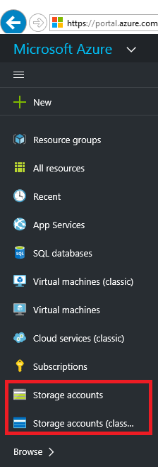

3. Wählen Sie Ihr Speicherkonto aus.

    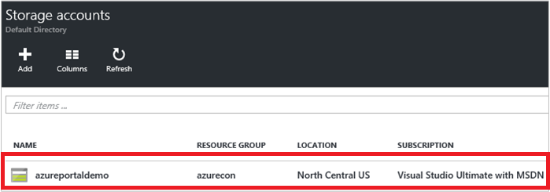

4. Wählen Sie "Dateien" Dienst.

    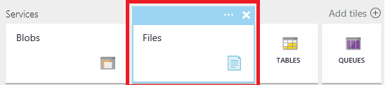

5. Klicken Sie auf "Dateifreigaben", und folgen Sie den Link, um das Erstellen Ihrer ersten Dateifreigabe.

    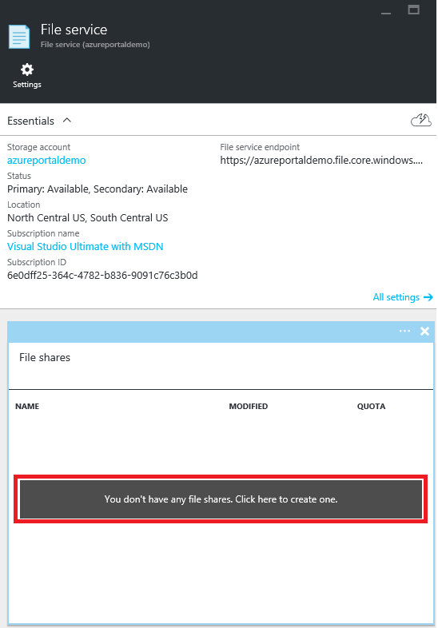

6. Füllen Sie die Dateifreigabe Namen und die Größe der Datei freigeben (bis zu 5120 GB) So erstellen Ihrer ersten Dateifreigabe. Sobald die Dateifreigabe erstellt wurde, können Sie es aus einem beliebigen Dateisystem bereitstellen, die SMB 2.1 oder SMB 3.0 unterstützt.

    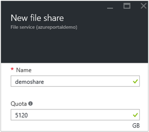

### Hochladen und Herunterladen von Dateien

1. Wählen Sie eine Datei freigeben Ihrer bereits erstellten aus.

    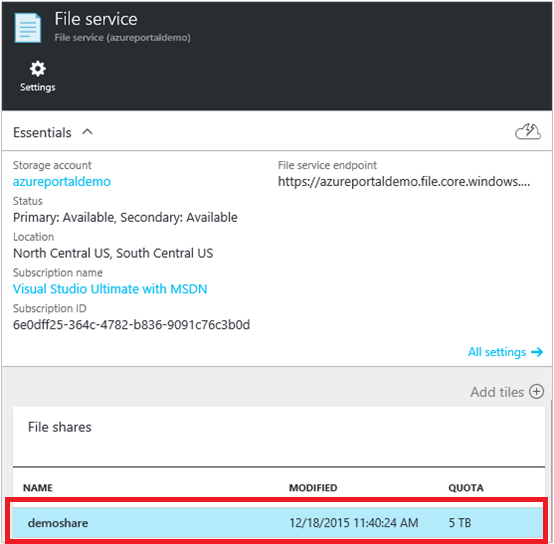

2. Klicken Sie auf **Hochladen** , um die Benutzeroberfläche zum Hochladen von Dateien zu öffnen.

    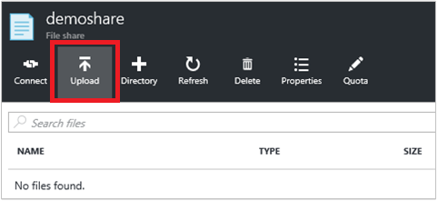

3. Klicken Sie mit der rechten Maustaste auf eine Datei, und wählen sie in der lokalen herunterladen **herunterladen** .

    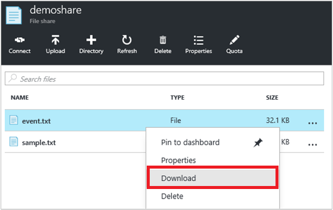

### Verwalten von Dateifreigabe

1. Klicken Sie auf **Kontingent** zum Ändern der Größe der Dateifreigabe (bis zu 5120 GB).

    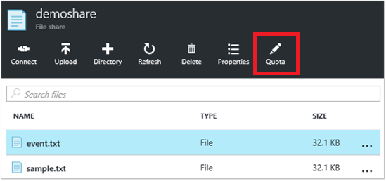

2. Klicken Sie auf **Verbinden** , um die Befehlszeile für die Dateifreigabe von Windows bereitstellen zu erhalten.

    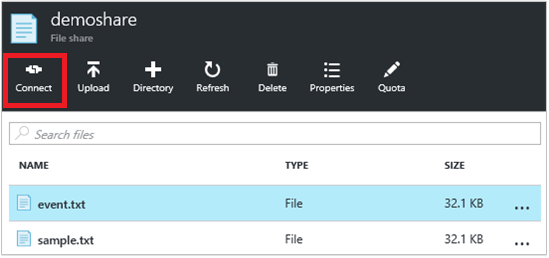

    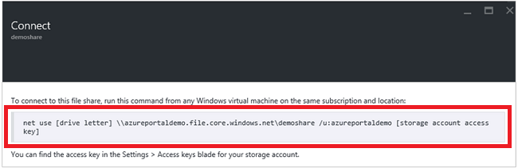

    >[AZURE.TIP] Speicher Konto Tastenkombination für die Bereitstellung finden Sie klicken Sie auf **Einstellungen** Ihres Kontos Speicher, und klicken Sie dann auf **Zugriffstasten**.

    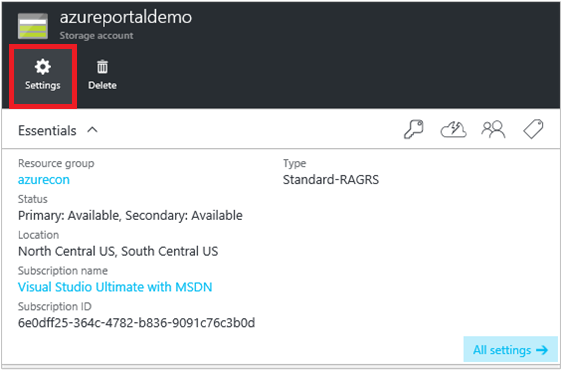

    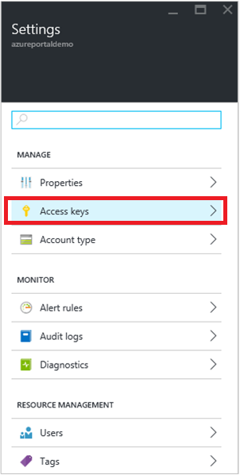

## Verwenden von PowerShell zum Verwalten von einer Dateifreigabe

Alternativ können Sie Azure PowerShell erstellen und Verwalten von Dateifreigaben.

### Installieren Sie die PowerShell-Cmdlets für Azure-Speicher

Zum Vorbereiten der PowerShell verwenden, herunterladen Sie und installieren Sie der Azure-PowerShell-Cmdlets. Informationen Sie [zum Installieren und Konfigurieren von Azure PowerShell](../powershell-install-configure.md) für die Installation Punkt und Installation Anweisungen.

> [AZURE.NOTE] Es wird empfohlen, dass Sie herunterladen und installieren oder aktualisieren Sie auf die neueste Azure PowerShell-Modul.

Öffnen Sie ein Azure PowerShell-Fenster auf **Start** und dann mit der Eingabe **Windows PowerShell**aus. Im Fenster PowerShell lädt das Azure Powershell-Modul für Sie.

### Erstellen Sie einen Kontext für Ihr Speicherkonto und Schlüssel

Erstellen Sie jetzt im Speicher Konto Kontext aus. Im Kontext kapselt die Speicher Konto Name und Konto-Taste. Anweisungen zum Kopieren von Ihren kontoschlüssel aus dem [Azure-Portal](https://portal.azure.com)finden Sie unter [anzeigen und kopieren Speicher Schlüssel zuzugreifen](storage-create-storage-account.md#view-and-copy-storage-access-keys).

Ersetzen Sie `storage-account-name` und `storage-account-key` mit Ihren Kontonamen Speicher und die Taste im folgenden Beispiel.

    # create a context for account and key
    $ctx=New-AzureStorageContext storage-account-name storage-account-key

### Erstellen Sie eine neue Dateifreigabe

Erstellen Sie als Nächstes im freigegebenen Ordner, mit dem Namen `logs`.

    # create a new share
    $s = New-AzureStorageShare logs -Context $ctx

Sie verfügen nun über eine Datei im Datei-Speicherplatz freigeben. Als Nächstes fügen wir ein Verzeichnis und eine Datei.

> [AZURE.IMPORTANT] Der Name Ihrer Datei Freigabe muss Kleinbuchstaben sein. Ausführliche Informationen zur Benennung von Dateifreigaben und Dateien finden Sie unter [Naming und verweisen auf Freigaben, Verzeichnisse durchsuchen, Dateien und Metadaten](https://msdn.microsoft.com/library/azure/dn167011.aspx).

### Erstellen Sie ein Verzeichnis in die Dateifreigabe

Als Nächstes erstellen Sie ein Verzeichnis freigeben. Im folgenden Beispiel Verzeichnis heißt `CustomLogs`.

    # create a directory in the share
    New-AzureStorageDirectory -Share $s -Path CustomLogs

### Hochladen einer lokalen Datei auf Verzeichnis

Jetzt Hochladen einer lokalen Datei zu dem Verzeichnis ein. Im folgende Beispiel wird eine Datei aus hochgeladen `C:\temp\Log1.txt`. Bearbeiten Sie den Dateipfad, sodass es auf eine gültige Datei auf dem lokalen Computer zeigt.

    # upload a local file to the new directory
    Set-AzureStorageFileContent -Share $s -Source C:\temp\Log1.txt -Path CustomLogs

### Listet die Dateien im Verzeichnis

Wenn Sie die Datei im Verzeichnis angezeigt wird, können Sie alle Dateien des betreffenden Verzeichnisses auflisten. Dieser Befehl gibt Dateien und Unterverzeichnisse (falls vorhanden) im Verzeichnis CustomLogs.

    # list files in the new directory
    Get-AzureStorageFile -Share $s -Path CustomLogs | Get-AzureStorageFile

Get-AzureStorageFile gibt eine Liste der Dateien und Verzeichnisse für jeden Directory-Objekt in weitergegeben wird. "Get-AzureStorageFile-$s freigeben" eine Liste der Dateien und Verzeichnisse im Stammverzeichnis zurückgegeben. Um eine Liste der Dateien in einem Unterverzeichnis erhalten möchten, müssen Sie das Unterverzeichnis an Get-AzureStorageFile übergeben. Das war, was dies bedeutet – im erste Teil des Befehls auf die Pipe gibt eine Directory-Instanz des Unterverzeichnisses CustomLogs. Klicken Sie dann ist, die in der Get-AzureStorageFile, übergeben, die die Dateien und Verzeichnisse in CustomLogs zurückgibt.

### Kopieren Sie die Dateien

Beginnend mit Azure PowerShell-Version 0.9.7, können Sie eine Datei an eine andere Datei, eine Datei zu einer Blob oder ein Blob in eine Datei kopieren. Im folgenden wir wird veranschaulicht, wie diese Kopiervorgänge mithilfe der PowerShell-Cmdlets auszuführen.

    # copy a file to the new directory
    Start-AzureStorageFileCopy -SrcShareName srcshare -SrcFilePath srcdir/hello.txt -DestShareName destshare -DestFilePath destdir/hellocopy.txt -Context $srcCtx -DestContext $destCtx

    # copy a blob to a file directory
    Start-AzureStorageFileCopy -SrcContainerName srcctn -SrcBlobName hello2.txt -DestShareName hello -DestFilePath hellodir/hello2copy.txt -DestContext $ctx -Context $ctx

## Laden Sie die Dateifreigabe

Durch die Unterstützung für SMB 3.0 unterstützt Dateispeicher jetzt Verschlüsselung und beständigen Ziehpunkten von SMB 3.0 Clients aus. Unterstützung für Verschlüsselung bedeutet, dass SMB 3.0-Clients eine Dateifreigabe von überall und bereitstellen können einschließlich aus:

- Ein Azure-virtuellen Computern in der gleichen Region (ebenfalls von SMB 2.1 unterstützt)
- Ein Azure-virtuellen Computern in einer anderen Region (nur SMB 3.0)
- Eine lokale-Clientanwendung (nur SMB 3.0)

Beim Zugriff eines Clients Dateispeicher, hängt die verwendete SMB Version der SMB Version vom Betriebssystem unterstützt. In der nachfolgenden Tabelle enthält eine Zusammenfassung der Unterstützung für Windows-Clients. Lizenzinformationen finden Sie diesen Blog detaillierte Informationen zur [SMB Versionen](http://blogs.technet.com/b/josebda/archive/2013/10/02/windows-server-2012-r2-which-version-of-the-smb-protocol-smb-1-0-smb-2-0-smb-2-1-smb-3-0-or-smb-3-02-you-are-using.aspx).

| Windows-Client         | SMB Version unterstützt |
|:-----------------------|:----------------------|
| Windows 7              | SMB 2.1               |
| Windows Server 2008 R2 | SMB 2.1               |
| Windows 8              | SMB 3.0               |
| WindowsServer 2012    | SMB 3.0               |
| Windows Server 2012 R2 | SMB 3.0               |
| Windows-10             | SMB 3.0               |

### Laden Sie die Dateifreigabe aus einer Azure-virtuellen Computern unter Windows

Um zu veranschaulichen, wie eine Azure Dateifreigabe bereitstellen, können wir nun eine Azure-virtuellen Computern unter Windows und Remote, um die Freigabe bereitstellen zu erstellen.

1. Erstellen Sie zuerst eine neue Azure-virtuellen Computern anhand der Anweisungen in [einem Windows-Computer im Portal Azure-erstellen](../virtual-machines/virtual-machines-windows-hero-tutorial.md).
2. Weiter, Remote in des virtuellen Computers anhand der Anweisungen in [Melden Sie sich auf einem Windows-Computer mithilfe der Azure-Portal](../virtual-machines/virtual-machines-windows-connect-logon.md).
3. Öffnen Sie ein PowerShell-Fenster des virtuellen Computers.

### Behalten Sie Ihre Anmeldeinformationen ein Konto Speicher des virtuellen Computers

Vor der Bereitstellung auf die Dateifreigabe, beibehalten werden Sie zuerst Ihre Anmeldeinformationen des virtuellen Computers Speicher ein Konto aus. In diesem Schritt können Windows automatisch auf die Dateifreigabe erneut verbunden, wenn der virtuelle Computer neu gestartet wird. Behalten Sie Ihre Kontoanmeldeinformationen ein Ausführen der `cmdkey` Befehl aus dem Fenster PowerShell des virtuellen Computers. Ersetzen Sie `<storage-account-name>` durch den Namen Ihres Kontos Speicher und `<storage-account-key>` mit Ihren kontoschlüssel Speicher.

    cmdkey /add:<storage-account-name>.file.core.windows.net /user:<storage-account-name> /pass:<storage-account-key>

Windows wird beim Neustart des virtuellen Computers zu Ihrem Dateifreigabe wiederherzustellen. Überprüfen, ob die Freigabe durch Ausführen wiederhergestellt wurde weist die `net use` Befehl ein PowerShell-Fenster.

Beachten Sie, dass nur in den Kontext, in denen Anmeldeinformationen beibehalten werden `cmdkey` ausgeführt wird. Wenn Sie eine Anwendung, die als Dienst ausgeführt wird entwickeln, müssen Sie Ihre Anmeldeinformationen in diesem Zusammenhang auch beibehalten werden.

### Laden Sie die Dateifreigabe mit den dauerhaften Anmeldeinformationen

Nachdem Sie eine Verbindung mit dem virtuellen Computer haben, können Sie Ausführen der `net use` Befehl zum Freigeben der Datei mithilfe der folgenden Syntax bereitstellen. Ersetzen Sie `<storage-account-name>` durch den Namen Ihres Kontos Speicher und `<share-name>` mit dem Namen der Datei Speicherplatz freigeben.

    net use <drive-letter>: \\<storage-account-name>.file.core.windows.net\<share-name>

    example :
    net use z: \\samples.file.core.windows.net\logs

Da Sie Ihre Anmeldeinformationen ein Konto Speicher im vorherigen Schritt beibehalten, müssen Sie nicht angeben, mit der `net use` Befehl. Wenn Sie Ihre Anmeldeinformationen nicht bereits beibehalten haben, nehmen sie dann wie Parameter, die an der `net use` Befehl, wie im folgenden Beispiel dargestellt.

    net use <drive-letter>: \\<storage-account-name>.file.core.windows.net\<share-name> /u:<storage-account-name> <storage-account-key>

    example :
    net use z: \\samples.file.core.windows.net\logs /u:samples <storage-account-key>

Sie können jetzt mit den Dateispeicher Teilen des virtuellen Computers arbeiten, wie Sie mit einem beliebigen anderen Laufwerk ein. Sie können standard-Datei auch Befehle über die Befehlszeile oder Anzeigen der bereitgestellten Freigabe und deren Inhalt von Datei-Explorer. Sie können auch Code innerhalb des virtuellen Computers ausführen, die die Dateifreigabe verwenden standard Windows Datei e/a-APIs, wie etwa die von der [System.IO Namespaces](http://msdn.microsoft.com/library/gg145019.aspx) in .NET Framework bereitgestellten greift auf.

Sie können auch die Dateifreigabe aus einer Rolle in einer Azure-Cloud-Dienst durch Remote in die Rolle ausführen bereitstellen.

### Laden Sie die Dateifreigabe aus einer lokalen Client unter Windows

Um die Dateifreigabe aus einem lokalen Client bereitzustellen, müssen Sie zuerst folgende Schritte durchführen:

- Installieren Sie eine Version von Windows die SMB 3.0 unterstützt. Windows wird SMB 3.0 Verschlüsselung zur sicheren Datenübertragung zwischen Ihrem lokalen Client und Azure Dateifreigabe in der Cloud nutzen.
- Öffnen Sie Zugriff auf das Internet für Port 445 (TCP ausgehend) in Ihrem lokalen Netzwerk, wie das SMB-Protokoll erforderlich ist.

> [AZURE.NOTE] Einige Internetdienstanbieter möglicherweise Port 445, sperren, sodass Sie möglicherweise mit Ihren Dienstanbieter überprüfen müssen.

## Entwickeln mit Speicherung von Dateien

Zum Schreiben von Code, die Dateispeicher ruft können Sie die Speicher-Client-Bibliotheken für .NET und Java oder die Azure Storage REST-API verwenden. Das Beispiel in diesem Abschnitt wird veranschaulicht, wie für die Arbeit mit einer Dateifreigabe, mithilfe der [Azure-Speicher-Client-Bibliothek für .NET](https://msdn.microsoft.com/library/mt347887.aspx) aus einer einfachen Console-Anwendung auf dem Desktop ausgeführt wird.

### Die Console-Anwendung erstellen und die Assembly zu erhalten

So erstellen Sie eine neue in Visual Studio, und installieren das NuGet-Paket mit der Azure-Speicher Client-Bibliothek:

1. Wählen Sie in Visual Studio **Datei > Neues Projekt**, und wählen Sie dann **Windows > Console Application** aus der Liste der Visual C#-Vorlagen.
2. Geben Sie einen Namen für die Console-Anwendung, und klicken Sie dann auf **OK**.
3. Nachdem Sie Ihr Projekt erstellt wurde, mit der rechten Maustaste im Projekts im Solution Explorer, und wählen Sie **NuGet-Pakete verwalten**. Onlinesuche nach "WindowsAzure.Storage", und klicken Sie auf **Installieren** , um die Azure-Speicher Client-Bibliothek für .NET Package und Abhängigkeiten installieren.

Die Codebeispielen in diesem Artikel verwenden auch der [Bibliothek von Microsoft Azure-Konfigurations-Manager](https://msdn.microsoft.com/library/azure/mt634646.aspx) , um die Verbindungszeichenfolge Speicher aus einer App in der Visual abzurufen. Mit Azure-Konfigurations-Manager können Sie die Verbindungszeichenfolge zur Laufzeit unabhängig davon, ob die Anwendung in Microsoft Azure oder aus einer Desktop, Mobil oder Web-Anwendung ausgeführt wird abrufen.

Installieren Sie das Paket Azure-Konfigurations-Manager, mit der rechten Maustaste im Projekts im Solution Explorer, und wählen Sie **NuGet-Pakete verwalten**. Onlinesuche nach "ConfigurationManager", und klicken Sie auf **Installieren** , um das Paket zu installieren.

Verwenden von Azure-Konfigurations-Manager ist optional. Sie können auch eine API wie die .NET Framework [ConfigurationManager-Klasse](https://msdn.microsoft.com/library/system.configuration.configurationmanager.aspx)verwenden.

### Speichern Sie Ihre Anmeldeinformationen ein Konto Speicher auf der App

Speichern Sie anschließend Ihre Anmeldeinformationen in App Ihres Projekts. Bearbeiten der App aus, sodass sie ähnlich wie im folgenden Beispiel wird ersetzen `myaccount` mit Ihren speicherkontonamen für ein, und `mykey` mit Ihren kontoschlüssel Speicher.

    <?xml version="1.0" encoding="utf-8" ?>
    <configuration>
        <startup>
            <supportedRuntime version="v4.0" sku=".NETFramework,Version=v4.5" />
        </startup>
        <appSettings>
            <add key="StorageConnectionString" value="DefaultEndpointsProtocol=https;AccountName=myaccount;AccountKey=StorageAccountKeyEndingIn==" />
        </appSettings>
    </configuration>

> [AZURE.NOTE] Datei speichern unterstützt die neueste Version von Azure Speicheremulator nicht. Die Verbindungszeichenfolge muss ein Konto Azure-Speicher in der Cloud für die Arbeit mit Dateispeicher adressieren.

### Fügen Sie Namespacedeklarationen

Öffnen der `program.cs` aus Lösung Explorer-Datei, und fügen Sie die folgenden Namespacedeklarationen an den Anfang der Datei.

    using Microsoft.Azure; // Namespace for Azure Configuration Manager
    using Microsoft.WindowsAzure.Storage; // Namespace for Storage Client Library
    using Microsoft.WindowsAzure.Storage.Blob; // Namespace for Blob storage
    using Microsoft.WindowsAzure.Storage.File; // Namespace for File storage

[AZURE.INCLUDE [storage-cloud-configuration-manager-include](../../includes/storage-cloud-configuration-manager-include.md)]

### Programmgesteuert Zugriff auf die Dateifreigabe

Fügen Sie den folgenden Code ein, um die `Main()` Methode (nach den oben aufgeführten Code) zum Abrufen der Verbindungszeichenfolge. Dieser Code Ruft einen Verweis auf die Datei, die wir zuvor erstellt haben und deren Inhalt im Fenster Konsole ausgegeben.

    // Create a CloudFileClient object for credentialed access to File storage.
    CloudFileClient fileClient = storageAccount.CreateCloudFileClient();

    // Get a reference to the file share we created previously.
    CloudFileShare share = fileClient.GetShareReference("logs");

    // Ensure that the share exists.
    if (share.Exists())
    {
        // Get a reference to the root directory for the share.
        CloudFileDirectory rootDir = share.GetRootDirectoryReference();

        // Get a reference to the directory we created previously.
        CloudFileDirectory sampleDir = rootDir.GetDirectoryReference("CustomLogs");

        // Ensure that the directory exists.
        if (sampleDir.Exists())
        {
            // Get a reference to the file we created previously.
            CloudFile file = sampleDir.GetFileReference("Log1.txt");

            // Ensure that the file exists.
            if (file.Exists())
            {
                // Write the contents of the file to the console window.
                Console.WriteLine(file.DownloadTextAsync().Result);
            }
        }
    }

Führen Sie die Console-Anwendung, um die Ausgabe anzuzeigen.

### Legen Sie die maximale Größe für eine Dateifreigabe

Ab der Version 5.x der Azure-Speicher Client-Bibliothek, legen Sie das Kontingent (oder die maximale Größe) für eine Dateifreigabe in Gigabyte festlegen. Sie können auch überprüfen, um anzuzeigen, wie viele Daten aktuell für die Freigabe gespeichert ist.

Das Kontingent für eine Freigabe festgelegt ist, können Sie die Gesamtgröße der Dateien, die für die Freigabe gespeichert werden. Überschreitet die Gesamtgröße der Dateien in der Freigabe das Kontingent für die Freigabe festlegen, klicken Sie dann werden Clients nicht erhöhen Sie die Größe der vorhandenen Dateien oder Erstellen neuer Dateien, es sei denn, diese Dateien leer sind.

Das folgende Beispiel zeigt, wie die aktuelle Verwendung für eine Freigabe gesucht und wie das Kontingent für die Freigabe festgelegt.

    // Parse the connection string for the storage account.
    CloudStorageAccount storageAccount = CloudStorageAccount.Parse(
        Microsoft.Azure.CloudConfigurationManager.GetSetting("StorageConnectionString"));

    // Create a CloudFileClient object for credentialed access to File storage.
    CloudFileClient fileClient = storageAccount.CreateCloudFileClient();

    // Get a reference to the file share we created previously.
    CloudFileShare share = fileClient.GetShareReference("logs");

    // Ensure that the share exists.
    if (share.Exists())
    {
        // Check current usage stats for the share.
        // Note that the ShareStats object is part of the protocol layer for the File service.
        Microsoft.WindowsAzure.Storage.File.Protocol.ShareStats stats = share.GetStats();
        Console.WriteLine("Current share usage: {0} GB", stats.Usage.ToString());

        // Specify the maximum size of the share, in GB.
        // This line sets the quota to be 10 GB greater than the current usage of the share.
        share.Properties.Quota = 10 + stats.Usage;
        share.SetProperties();

        // Now check the quota for the share. Call FetchAttributes() to populate the share's properties.
        share.FetchAttributes();
        Console.WriteLine("Current share quota: {0} GB", share.Properties.Quota);
    }

### Generieren einer freigegebenen Access-Signatur für eine Datei oder eine Dateifreigabe

Beginnend mit der Version 5.x der Azure-Speicher Clientbibliothek, Sie können eine freigegebene Access Signatur (SAS) für eine Dateifreigabe oder für eine bestimmte Datei generieren. Sie können auch eine freigegebenen Zugriffsrichtlinie auf einer Dateifreigabe zum Verwalten von freigegebenen Access Signaturen erstellen. Erstellen einer freigegebenen Zugriffsrichtlinie wird empfohlen, wie es bietet eine Möglichkeit, die SAS widerrufen, wenn es beeinträchtigt werden sollte.

Im folgende Beispiel eine freigegebenen Zugriffsrichtlinie auf einer Freigabe erstellt, und anschließend die Richtlinie verwendet, um die Einschränkungen für eine SAS in einer Datei in die Freigabe bereitstellen.

    // Parse the connection string for the storage account.
    CloudStorageAccount storageAccount = CloudStorageAccount.Parse(
        Microsoft.Azure.CloudConfigurationManager.GetSetting("StorageConnectionString"));

    // Create a CloudFileClient object for credentialed access to File storage.
    CloudFileClient fileClient = storageAccount.CreateCloudFileClient();

    // Get a reference to the file share we created previously.
    CloudFileShare share = fileClient.GetShareReference("logs");

    // Ensure that the share exists.
    if (share.Exists())
    {
        string policyName = "sampleSharePolicy" + DateTime.UtcNow.Ticks;

        // Create a new shared access policy and define its constraints.
        SharedAccessFilePolicy sharedPolicy = new SharedAccessFilePolicy()
            {
                SharedAccessExpiryTime = DateTime.UtcNow.AddHours(24),
                Permissions = SharedAccessFilePermissions.Read | SharedAccessFilePermissions.Write
            };

        // Get existing permissions for the share.
        FileSharePermissions permissions = share.GetPermissions();

        // Add the shared access policy to the share's policies. Note that each policy must have a unique name.
        permissions.SharedAccessPolicies.Add(policyName, sharedPolicy);
        share.SetPermissions(permissions);

        // Generate a SAS for a file in the share and associate this access policy with it.
        CloudFileDirectory rootDir = share.GetRootDirectoryReference();
        CloudFileDirectory sampleDir = rootDir.GetDirectoryReference("CustomLogs");
        CloudFile file = sampleDir.GetFileReference("Log1.txt");
        string sasToken = file.GetSharedAccessSignature(null, policyName);
        Uri fileSasUri = new Uri(file.StorageUri.PrimaryUri.ToString() + sasToken);

        // Create a new CloudFile object from the SAS, and write some text to the file.
        CloudFile fileSas = new CloudFile(fileSasUri);
        fileSas.UploadText("This write operation is authenticated via SAS.");
        Console.WriteLine(fileSas.DownloadText());
    }

Weitere Informationen zum Erstellen und Verwenden von freigegebenen Access Signaturen finden Sie unter [Verwenden von freigegebenen Access Signaturen (SAS)](storage-dotnet-shared-access-signature-part-1.md) und [Erstellen und Verwenden eines SAS mit Blob-Speicher](storage-dotnet-shared-access-signature-part-2.md).

### Kopieren Sie die Dateien

Beginnend mit der Version 5.x der Azure-Speicher Clientbibliothek, können Sie eine Datei in einer anderen Datei, eine Datei zu einer Blob oder ein Blob in eine Datei kopieren. In den nächsten Abschnitten führen wir für diese Kopie programmgesteuert Operationen wie vor.

Sie können auch AzCopy verwenden, um eine Datei in ein anderes kopieren oder einen Blob in eine Datei oder umgekehrt kopieren. Finden Sie unter [Übertragen von Daten mit AzCopy Befehlszeilenprogramm](storage-use-azcopy.md).

> [AZURE.NOTE] Wenn Sie einen Blob in einer Datei oder einer Datei in ein Blob kopieren, müssen Sie eine Signatur freigegebenen Access (SAS) verwenden, mit das Quellobjekt authentifiziert, auch wenn Sie innerhalb der gleichen Speicherkonto kopieren.

**Kopieren einer Datei in einer anderen Datei**

Im folgende Beispiel kopiert eine Datei mit einer anderen Datei in der gleichen Freigabe ein. Da dieser Kopiervorgang zwischen Dateien in demselben Speicherkonto kopiert, können Sie die Authentifizierung anhand vorinstallierter Schlüssel für den Kopiervorgang verwenden.

    // Parse the connection string for the storage account.
    CloudStorageAccount storageAccount = CloudStorageAccount.Parse(
        Microsoft.Azure.CloudConfigurationManager.GetSetting("StorageConnectionString"));

    // Create a CloudFileClient object for credentialed access to File storage.
    CloudFileClient fileClient = storageAccount.CreateCloudFileClient();

    // Get a reference to the file share we created previously.
    CloudFileShare share = fileClient.GetShareReference("logs");

    // Ensure that the share exists.
    if (share.Exists())
    {
        // Get a reference to the root directory for the share.
        CloudFileDirectory rootDir = share.GetRootDirectoryReference();

        // Get a reference to the directory we created previously.
        CloudFileDirectory sampleDir = rootDir.GetDirectoryReference("CustomLogs");

        // Ensure that the directory exists.
        if (sampleDir.Exists())
        {
            // Get a reference to the file we created previously.
            CloudFile sourceFile = sampleDir.GetFileReference("Log1.txt");

            // Ensure that the source file exists.
            if (sourceFile.Exists())
            {
                // Get a reference to the destination file.
                CloudFile destFile = sampleDir.GetFileReference("Log1Copy.txt");

                // Start the copy operation.
                destFile.StartCopy(sourceFile);

                // Write the contents of the destination file to the console window.
                Console.WriteLine(destFile.DownloadText());
            }
        }
    }

**Kopieren einer Datei in ein blob**

Im folgende Beispiel erstellt eine Datei und kopiert sie in ein Blob innerhalb der gleichen Speicherkonto. Im Beispiel erstellt ein SAS für die Quelldatei, die der Dienst zum Authentifizieren des Zugriffs auf die Quelldatei während der Kopiervorgang verwendet.

    // Parse the connection string for the storage account.
    CloudStorageAccount storageAccount = CloudStorageAccount.Parse(
        Microsoft.Azure.CloudConfigurationManager.GetSetting("StorageConnectionString"));

    // Create a CloudFileClient object for credentialed access to File storage.
    CloudFileClient fileClient = storageAccount.CreateCloudFileClient();

    // Create a new file share, if it does not already exist.
    CloudFileShare share = fileClient.GetShareReference("sample-share");
    share.CreateIfNotExists();

    // Create a new file in the root directory.
    CloudFile sourceFile = share.GetRootDirectoryReference().GetFileReference("sample-file.txt");
    sourceFile.UploadText("A sample file in the root directory.");

    // Get a reference to the blob to which the file will be copied.
    CloudBlobClient blobClient = storageAccount.CreateCloudBlobClient();
    CloudBlobContainer container = blobClient.GetContainerReference("sample-container");
    container.CreateIfNotExists();
    CloudBlockBlob destBlob = container.GetBlockBlobReference("sample-blob.txt");

    // Create a SAS for the file that's valid for 24 hours.
    // Note that when you are copying a file to a blob, or a blob to a file, you must use a SAS
    // to authenticate access to the source object, even if you are copying within the same
    // storage account.
    string fileSas = sourceFile.GetSharedAccessSignature(new SharedAccessFilePolicy()
    {
        // Only read permissions are required for the source file.
        Permissions = SharedAccessFilePermissions.Read,
        SharedAccessExpiryTime = DateTime.UtcNow.AddHours(24)
    });

    // Construct the URI to the source file, including the SAS token.
    Uri fileSasUri = new Uri(sourceFile.StorageUri.PrimaryUri.ToString() + fileSas);

    // Copy the file to the blob.
    destBlob.StartCopy(fileSasUri);

    // Write the contents of the file to the console window.
    Console.WriteLine("Source file contents: {0}", sourceFile.DownloadText());
    Console.WriteLine("Destination blob contents: {0}", destBlob.DownloadText());

Sie können einen Blob auf die gleiche Weise wie in eine Datei kopieren. Wenn das Quellobjekt ein Blob ist, klicken Sie dann erstellen Sie eine SAS zum Authentifizieren des Zugriffs auf die Blob während der Kopiervorgang.

## Behandlung von Problemen mit Kennzahlen Dateispeicher

Azure-Speicher Analytics unterstützt jetzt Kennzahlen zum Speichern von Daten aus. Kennzahlen Daten können Anfragen verfolgen und diagnostizieren Sie Probleme bei.

Sie können Kriterien zum Speichern von Daten aus dem [Azure-Portal](https://portal.azure.com)aktivieren. Durch den Vorgang festlegen Dateieigenschaften Dienst über die REST-API oder eine der zugehörigen analoge aufrufen, in der Speicher-Client-Bibliothek können Sie Kennzahlen auch programmgesteuert aktivieren.

Im folgenden Code wird gezeigt, wie mithilfe der Speicher-Client-Bibliothek für .NET Kennzahlen zum Speichern von Daten aktiviert.

Zuerst fügen Sie den folgenden `using` Anweisungen in der Datei program.cs zusätzlich zu diesen Sie über hinzugefügt:

    using Microsoft.WindowsAzure.Storage.File.Protocol;
    using Microsoft.WindowsAzure.Storage.Shared.Protocol;

Beachten Sie, dass Warteschlange, Tabelle und Blob-Speicher verwenden Sie den freigegebenen `ServiceProperties` Geben Sie in der `Microsoft.WindowsAzure.Storage.Shared.Protocol` Namespace, Dateispeicher verwendet einen eigenen Typ, der `FileServiceProperties` Geben Sie in der `Microsoft.WindowsAzure.Storage.File.Protocol` Namespace. Beide Namespaces muss Code, jedoch für den folgenden Code kompilieren verwiesen werden.

    // Parse your storage connection string from your application's configuration file.
    CloudStorageAccount storageAccount = CloudStorageAccount.Parse(
            Microsoft.Azure.CloudConfigurationManager.GetSetting("StorageConnectionString"));
    // Create the File service client.
    CloudFileClient fileClient = storageAccount.CreateCloudFileClient();

    // Set metrics properties for File service.
    // Note that the File service currently uses its own service properties type,
    // available in the Microsoft.WindowsAzure.Storage.File.Protocol namespace.
    fileClient.SetServiceProperties(new FileServiceProperties()
    {
        // Set hour metrics
        HourMetrics = new MetricsProperties()
        {
            MetricsLevel = MetricsLevel.ServiceAndApi,
            RetentionDays = 14,
            Version = "1.0"
        },
        // Set minute metrics
        MinuteMetrics = new MetricsProperties()
        {
            MetricsLevel = MetricsLevel.ServiceAndApi,
            RetentionDays = 7,
            Version = "1.0"
        }
    });

    // Read the metrics properties we just set.
    FileServiceProperties serviceProperties = fileClient.GetServiceProperties();
    Console.WriteLine("Hour metrics:");
    Console.WriteLine(serviceProperties.HourMetrics.MetricsLevel);
    Console.WriteLine(serviceProperties.HourMetrics.RetentionDays);
    Console.WriteLine(serviceProperties.HourMetrics.Version);
    Console.WriteLine();
    Console.WriteLine("Minute metrics:");
    Console.WriteLine(serviceProperties.MinuteMetrics.MetricsLevel);
    Console.WriteLine(serviceProperties.MinuteMetrics.RetentionDays);
    Console.WriteLine(serviceProperties.MinuteMetrics.Version);

Darüber hinaus können Sie für End-to-End-Leitfaden für die Problembehandlung zum [Azure Dateien Problembehandlung Artikel](storage-troubleshoot-file-connection-problems.md) verweisen. 

## Datei Speicher häufig gestellte Fragen

1. **Werden Active Directory-basierte Authentifizierung wird von Dateispeicher unterstützt?**

    Wir derzeit AD-basierten Authentifizierung oder ACLs nicht unterstützt, aber habe es in die Liste der Features Serviceanfragen. Jetzt sind die Tasten Azure Storage-Konto verwendet, um Authentifizierung für die Dateifreigabe bereitzustellen. Wir führen Sie zur Umgehung dieses Problems mithilfe von freigegebenen Access Signaturen (SAS) über die REST-API oder die Clientbibliotheken bieten. Sie können mit SAS Token mit bestimmten Berechtigungen generieren, die über ein angegebenes Zeitintervall gültig sind. Beispielsweise können Sie ein Token mit schreibgeschützten Zugriff auf eine bestimmte Datei generieren. Jede Person, die dieses Token besitzt, während sie gültig ist hat schreibgeschützten Zugriff auf die Datei ein.

    SAS wird nur über die REST-API oder Clientbibliotheken unterstützt. Wenn Sie die Dateifreigabe über das Protokoll SMB bereitstellen, können Sie Zugriff auf deren Inhalt übertragen einer SAS nutzen.

2. **Sind Azure Dateifreigaben sichtbar öffentlich über das Internet oder sind jedoch nur aus Azure erreichbar?**

    Solange Port 445 (TCP ausgehend) geöffnet ist, und Ihren Kunden das SMB 3.0-Protokoll (*z.*B. Windows 8 oder Windows Server 2012) unterstützt, Ihre Dateifreigabe über das Internet verfügbar ist.  

3. **Netzwerkverkehr den zwischen einer Azure-virtuellen Computern und einer Datei freigeben zählen als externe Bandbreite, der die das Abonnement belastet?**

    Wenn die Dateifreigabe und virtuellen Computern in unterschiedlichen Regionen sind, werden der Datenverkehr dazwischen als externe Bandbreite in Rechnung gestellt.

4. **Wenn Netzwerkverkehr zwischen einem virtuellen Computern und eine Dateifreigabe im selben Bereich ist, ist es kostenlos?**

    Ja. Es ist kostenlos, der Datenverkehr in derselben Region ist.

5. **Ist aus lokalen virtuellen Computern versorgen Azure Dateispeicher Azure ExpressRoute abhängig?**

    Nein. Wenn Sie nicht über ExpressRoute verfügen, können Sie lokale weiterhin die Dateifreigabe zugreifen, solange Sie Port 445 (TCP ausgehend) für den Zugriff auf das Internet geöffnet haben. Allerdings können Sie ExpressRoute mit Dateispeicher bei Bedarf verwenden.

6. **Ist "Zeugendateifreigabe" für einen Failovercluster einen der Fälle verwenden für den Dateispeicher Azure?**

    Dies wird derzeit nicht unterstützt.

7. **Speichern von Daten ist nur über die LRS oder GRS sofort, rechts repliziert?**  

    Wir RAS-GRS unterstützt werden soll, aber es gibt keine Zeitachse noch freigeben.

8. **Wann kann ich vorhandene Speicherkonten für Dateispeicher Azure verwenden?**

    Azure Dateispeicher ist nun für alle Speicherkonten aktiviert.

9. **Wird eine Umbenennung auch die REST-API werden hinzugefügt?**

    Umbenennen wird in unseren REST-API noch nicht unterstützt.

10. **Können Sie Freigaben, also eine Freigabe unter eine Freigabe geschachtelt haben?**

    Nein. Die Dateifreigabe ist der virtuelle Treiber, den Sie bereitstellen können, an, sodass geschachtelte Freigaben nicht unterstützt werden.

11. **Ist es möglich, um anzugeben, schreibgeschützt oder nur Schreiben von Berechtigungen für Ordner in der Freigabe?**

    Verfügen Sie nicht über diese Stufe der Kontrolle über die Berechtigungen, wenn Sie die Dateifreigabe über SMB bereitstellen. Allerdings können Sie dies erreichen durch Erstellen einer freigegebenen Access-Signatur (SAS) über die REST-API oder Client-Bibliotheken.  

12. **Meine Leistung war langsam, bei dem Versuch, Dateien in in Dateispeicher Entzippen Sie ihn. Was tun kann ich?**

    Zum Übertragen von großen Anzahl von Dateien in Dateispeicher empfehlen wir die Verwendung von AzCopy, Azure Powershell (Windows) oder die Azure CLI (Linux/Unix), wie diese Tools für die Übertragung Netzwerk optimiert wurde.

13. **Patch veröffentlicht, um langsame Leistung Problem mit Azure-Dateien zu beheben**

    Das Windows-Team hat kürzlich einen Patch, um eine langsam Problem zu beheben, wenn Sie der Kunden aus Windows 8.1 oder Windows Server 2012 R2 greift Azure Dateien Speicher auf veröffentlicht. Weitere Informationen überprüfen Sie Sie die zugeordnete KB-Artikel [langsam beim Zugriff auf Dateien Azure-Speicher von Windows 8.1 oder Server 2012 R2](https://support.microsoft.com/en-us/kb/3114025).

14. **Verwenden von Azure Dateispeicher mit IBM MQ**

    IBM stellt ein Dokument um IBM MQ Kunden begleiten beim Konfigurieren von Azure Dateispeicher mit ihrer Dienste zur Verfügung. Weitere Informationen überprüfen Sie, [wie Sie Setup IBM MQ Multi-Instanz Warteschlangenmanager mit Microsoft Azure File Service](https://github.com/ibm-messaging/mq-azure/wiki/How-to-setup-IBM-MQ-Multi-instance-queue-manager-with-Microsoft-Azure-File-Service).

15. **Wie behebe ich Fehler Dateispeicher Azure?**

    Sie können für End-to-End-Leitfaden für die Problembehandlung auf [Azure Dateien Problembehandlung Artikel](storage-troubleshoot-file-connection-problems.md) verweisen.               
    
## Nächste Schritte

Finden Sie unter folgenden Links, um weitere Informationen zu Azure Dateispeicher.

### Konzeptionelle Artikeln und videos

- [Azure Dateien Speicher: eine frictionless Cloud SMB Dateisystem für Windows und Linux](https://azure.microsoft.com/documentation/videos/azurecon-2015-azure-files-storage-a-frictionless-cloud-smb-file-system-for-windows-and-linux/)
- [Verwenden von Azure Dateispeicher mit Linux](storage-how-to-use-files-linux.md)

### Unterstützung für Dateispeicher Tools

- [Verwenden von Azure PowerShell mit Azure-Speicher](storage-powershell-guide-full.md)
- [Verwenden von AzCopy mit Microsoft Azure-Speicher](storage-use-azcopy.md)
- [Verwenden die Azure CLI mit Azure-Speicher](storage-azure-cli.md#create-and-manage-file-shares)

### Bezug

- [Speicher-Client-Bibliothek für .NET Verweis](https://msdn.microsoft.com/library/azure/dn261237.aspx)
- [Datei Service-REST-API-Referenz](http://msdn.microsoft.com/library/azure/dn167006.aspx)

### Von Blogbeiträgen

- [Azure Dateispeicher ist jetzt in der Regel verfügbar](https://azure.microsoft.com/blog/azure-file-storage-now-generally-available/)
- [Innere Azure Dateispeicher](https://azure.microsoft.com/blog/inside-azure-file-storage/)
- [Einführung in Microsoft Azure File Service](http://blogs.msdn.com/b/windowsazurestorage/archive/2014/05/12/introducing-microsoft-azure-file-service.aspx)
- [Beibehalten von Verbindungen mit Microsoft Azure-Dateien](http://blogs.msdn.com/b/windowsazurestorage/archive/2014/05/27/persisting-connections-to-microsoft-azure-files.aspx)
