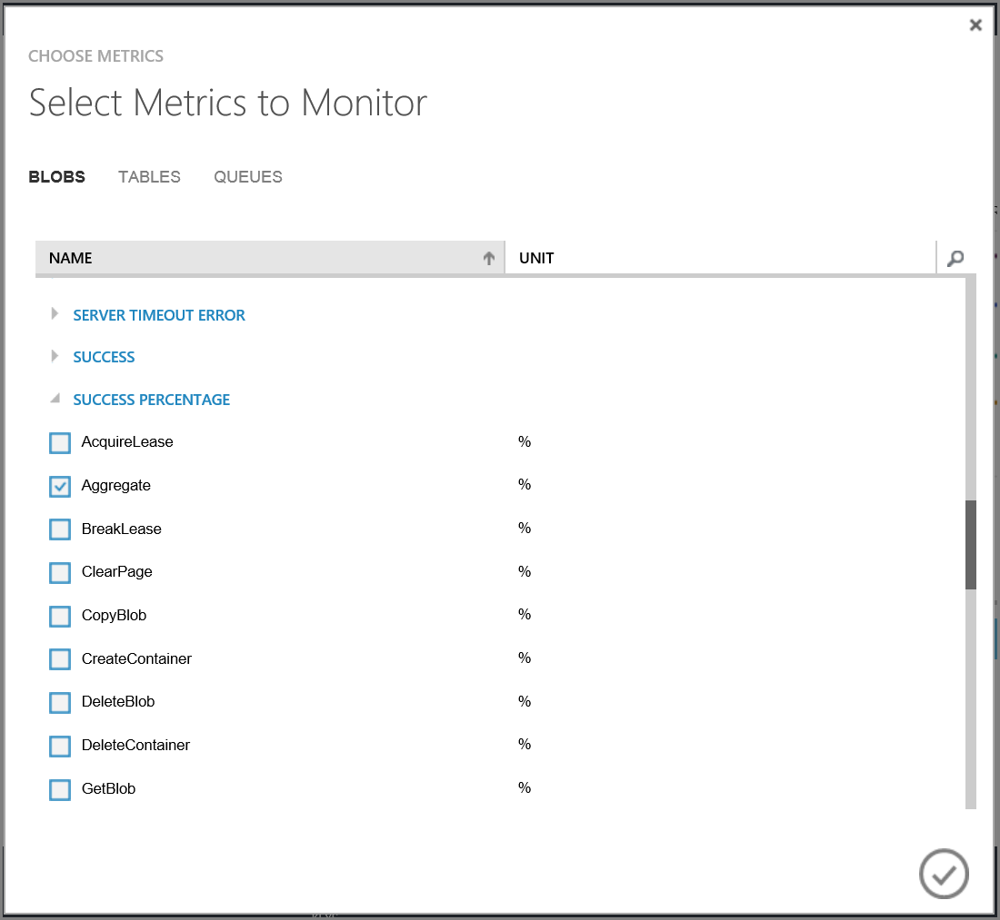

<properties 
    pageTitle="End-to-End-Behandlung von Problemen mit Azure-Speicher Kennzahlen und Protokollierung, AzCopy und Nachricht Analyzer | Microsoft Azure" 
    description="Ein Lernprogramm zur End-to-End-Behandlung von Problemen mit Azure-Speicher Analytics, AzCopy und Microsoft Nachricht Analyzer" 
    services="storage" 
    documentationCenter="dotnet" 
    authors="robinsh" 
    manager="carmonm"/>

<tags 
    ms.service="storage" 
    ms.workload="storage" 
    ms.tgt_pltfrm="na" 
    ms.devlang="dotnet" 
    ms.topic="article" 
    ms.date="08/03/2016" 
    ms.author="robinsh"/>

# <a name="end-to-end-troubleshooting-using-azure-storage-metrics-and-logging-azcopy-and-message-analyzer"></a>End-to-End-Problembehandlung mit Azure-Speicher Kennzahlen und Protokollierung, AzCopy und Nachricht Analyzer 

[AZURE.INCLUDE [storage-selector-portal-e2e-troubleshooting](../../includes/storage-selector-portal-e2e-troubleshooting.md)]

## <a name="overview"></a>(Übersicht)

Bei der Diagnose und Problembehandlung ist eine Key Qualifikation für den Aufbau und unterstützt Clientanwendungen mit Microsoft Azure-Speicher. Die verteilte Natur der Anwendung Azure möglicherweise Diagnose und Problembehebung von Fehlern und Leistungsprobleme komplexer als in herkömmlichen Umgebungen Ursachen möglich.

In diesem Lernprogramm erfahren wir, wie zum Identifizieren von bestimmter Fehler, die möglicherweise Einfluss auf die Leistung und Problembehandlung bei diesen Fehlern von End-to-End-Clients von Microsoft und Azure-Speicher bereitgestellten Tools zur Optimierung der Clientanwendung verwenden. 

In diesem Lernprogramm bietet eine praktische Untersuchung der ein zur Problembehandlung End-to-End-Szenario. Eine genaue konzeptionelle Anleitung zur Problembehandlung von Applications Azure-Speicher finden Sie unter [überwachen, diagnostizieren und Behandeln von Problemen mit Microsoft Azure-Speicher](storage-monitoring-diagnosing-troubleshooting.md). 

## <a name="tools-for-troubleshooting-azure-storage-applications"></a>Tools für die Behandlung von Applications Azure-Speicher

Mit Microsoft Azure-Speicher Clientanwendungen zur Problembehandlung, können Sie eine Kombination von Tools verwenden, um festzustellen, wenn ein Problem aufgetreten ist und was die Ursache des Problems möglicherweise. Diese Tools umfassen:

- **Analytics Azure-Speicher**. [Azure-Speicher Analytics](http://msdn.microsoft.com/library/azure/hh343270.aspx) bietet Kennzahlen und Protokollierung für Azure-Speicher.
    - **Kennzahlen Speicher** verfolgt Transaktion Metrik und Kapazität Kennzahlen für Ihr Speicherkonto. Verwenden von Kriterien, können Sie ermitteln, wie eine Anwendung nach einer Vielzahl von anderen Measures ausführt. Weitere Informationen zu den vorstehend beschriebenen Kennzahlen von Speicher Analytics nachverfolgt finden Sie unter [Speicher Analytics Kennzahlen Tabellenschema](http://msdn.microsoft.com/library/azure/hh343264.aspx) . 

    - **Protokollierung Speicher** protokolliert jede Anforderung mit den Diensten Azure-Speicher mit einem serverseitigen Protokoll. Das Protokoll verfolgt Detaildaten für jede Anforderung, einschließlich der Operation ausgeführt wird und der Status des Vorgangs und Wartezeit Informationen an. Weitere Informationen über die Anfrage und Antwort Daten, die in die Protokolle, indem Speicher Analytics geschrieben ist finden Sie unter [Speicherformat Analytics-Protokoll](http://msdn.microsoft.com/library/azure/hh343259.aspx) .

> [AZURE.NOTE] Speicherkonten mit einem Replikationstyp Zone redundante Speicher (ZRS) haben keine der Kennzahlen oder Protokollierung Videofunktionen zu diesem Zeitpunkt aktiviert. 

- **Azure klassischen Portal**. Sie können für Ihr Speicherkonto in der [Klassischen Azure-Portal](https://manage.windowsazure.com)Metrik und Protokollierung konfigurieren. Sie können auch Diagramme, die zeigen, wie eine Anwendung über einen Zeitraum ausführt, anzeigen und Konfigurieren von Benachrichtigungen, um Sie zu benachrichtigen, wenn Ihre Anwendung Umbruch als erwartet für eine angegebene Metrik durchführt. 
    
    Informationen zum Konfigurieren der Überwachung in der klassischen Azure-Portal finden Sie unter [Monitor ein Speicherkonto Azure-Portal](storage-monitor-storage-account.md) .

- **AzCopy**. Serverprotokolle für Azure-Speicher werden als Blobs, gespeichert, daher Sie AzCopy verwenden können, um die Blobs Log in einem lokalen Verzeichnis für die Analyse mit Microsoft Nachricht Analyzer zu kopieren. Weitere Informationen zu AzCopy finden Sie unter [Übertragen von Daten mit den AzCopy Befehlszeilenprogramm](storage-use-azcopy.md) .

- **Microsoft-Nachricht Analyzer**. Nachricht Analyzer ist ein Tool, verbraucht Protokolldateien und zeigt Log-Daten in einem visuellen Format, das einfach zu filtern, suchen und Gruppieren von Daten Log in hilfreiche Sätze, die Sie verwenden können ermöglicht, um Fehler und Leistungsprobleme zu analysieren. Weitere Informationen zu Nachricht Analyzer finden Sie unter [Microsoft Message Analyzer Betrieb Guide](http://technet.microsoft.com/library/jj649776.aspx) .

## <a name="about-the-sample-scenario"></a>Informationen zu dem Szenario Stichprobe

In diesem Lernprogramm wird ein Szenario untersucht, in dem Azure-Speicher Metrik eine niedrige prozentuale Erfolg Abschlag (Disagio) eine Anwendung zeigt an, die Anrufe Azure-Speicher. Die niedrig prozentuale Erfolg Zins Metrik (Siehe als **PercentSuccess** im klassischen Azure-Portal und in den Tabellen Kennzahlen) verfolgt Vorgänge, die erfolgreich, jedoch, einen HTTP-Statuscode, der größer als 299 zurückgeben. Diese Vorgänge werden in den Protokolldateien serverseitigen Speicher mit dem Transaktionsstatus **ClientOtherErrors**aufgezeichnet. Weitere Details zu der niedrig prozentuale Erfolg Metrik finden Sie unter [Kennzahlen anzeigen niedrig PercentSuccess oder Analytics Protokolleinträge Operationen mit Transaktionsstatus ClientOtherErrors aufweisen](storage-monitoring-diagnosing-troubleshooting.md#metrics-show-low-percent-success).

Azure Speichervorgänge möglicherweise HTTP Statuscodes als Teil ihrer normalen Funktionalität größer als 299 zurückzukehren. Aber dieser Fehler in einigen Fällen darauf hinzuweisen, dass Sie Ihre Clientanwendung zum Verbessern der Leistung optimieren können. 

In diesem Szenario werden wir erwägen Sie einen Satz niedriger prozentuale Erfolg nichts weniger als 100 % sein. Sie können jedoch eine andere metrische Ebene gemäß Ihren Anforderungen auswählen. Es empfiehlt sich, dass während des Testens der Anwendung, eine geplante Fehlertoleranz für Ihre wichtigsten Kennzahlen hergestellt werden. Angenommen, Sie möglicherweise ermittelt haben, basierend auf Tests, dass Ihre Anwendung sollten eine einheitliche prozentuale Erfolg Zinsfuß 85 % oder 90 %. Wenn Ihre Daten Metrik, dass zeigt die Anwendung ist eine Abweichung, von diese Zahl und dann können Sie ermitteln, die Ursache der erhöhen. 

In diesem Szenario Stichprobe Sobald wir eingerichtet haben, wird die prozentuale Erfolg Zins Metrik weniger als 100 %, untersuchen wir die Protokolle, um den Fehler zu finden, die den Kriterien entsprechen, und verwenden, um zu ermitteln, was die untere prozentuale Erfolgsrate verursacht. Speziell bei Fehlern im Bereich 400 wir werden. Wir werden dann genauer 404 (nicht gefunden) Fehler untersuchen.

### <a name="some-causes-of-400-range-errors"></a>Einige Ursachen für Fehler 400-Bereich

Die folgenden Beispiele zeigt eine Unternehmenstypen einige Fehler 400-Bereich für Abfragen Azure BLOB-Speicher und die möglichen Ursachen. Eine der folgenden Fehler sowie Fehler in der 300 Bereichs- und den Bereich 500 können auf eine niedrige prozentuale Erfolgsrate mitwirken. 

Beachten Sie, dass die folgenden Listen alles andere als abgeschlossen sind. Weitere Informationen zu allgemeinen Azure-Speicher Fehlern und Informationen zu Fehlern, die für jeden der Speicherdienste finden Sie unter [Status und Fehlercodes](http://msdn.microsoft.com/library/azure/dd179382.aspx) .

**Beispiele für Status-Code 404 (nicht gefunden)**

Tritt auf, wenn ein gelesen Vorgang mit einem Container oder Blob fehlschlägt, da das Blob oder Container nicht gefunden wird.

- Tritt auf, wenn Sie einen Container oder Blob von einem anderen Client, bevor Sie diese Anforderung gelöscht wurden. 
- Tritt auf, wenn Sie einen Videoanruf API, der den Container oder Blob erstellt verwenden, nach dem Überprüfen, ob es vorhanden ist. Die APIs CreateIfNotExists anrufen Kopf zuerst zu prüfen, ob das Vorhandensein des Containers oder Blob; Wenn es nicht vorhanden ist, einen 404-Fehler wird zurückgegeben, und klicken Sie dann ein zweiter sich Anruf Schreibvorgangs den Container oder Blob erfolgt.

**Status Fehlercode 409 (Konflikt) Beispiele**

- Tritt auf, wenn Sie eine API erstellen verwenden Sie zum Erstellen einer neuen Container oder die Blob, ohne das Vorhandensein zuerst überprüfen und einen Container oder Blob mit diesem Namen bereits vorhanden ist. 
- Tritt auf, wenn der Container gelöscht wird und Sie versuchen, einen neuen Container mit demselben Namen erstellen, bevor der Löschvorgang abgeschlossen ist.
- Tritt auf, wenn Sie eine verleasen auf einem Container oder Blob angeben und eine präsentieren verleasen bereits vorhanden ist.
 
**Statuscode 412 (Fehler bei Vorbedingung) Beispiele**

- Tritt auf, wenn Sie nicht die von einer bedingten Kopfzeile angegebene Bedingung erfüllt ist.
- Tritt auf, wenn die angegebene verleasen-ID, die ID verleasen, klicken Sie auf den Container oder Blob nicht übereinstimmen.

## <a name="generate-log-files-for-analysis"></a>Generieren von Protokolldateien für die Analyse

In diesem Lernprogramm verwenden wir Nachricht Analyzer für die Arbeit mit drei verschiedene Typen von Protokolldateien, obwohl Sie wählen können, arbeiten Sie mit einer der folgenden:

- **Server-Protokolldateien**, die beim Aktivieren der Protokollierung Azure-Speicher erstellt wird. Das Serverprotokoll enthält Daten zu jedem Vorgang anhand einer der Dienste Azure-Speicher - Blob, Warteschlange, Tabelle und Datei bezeichnet. Server-Protokoll gibt an, welche Operation aufgerufen wurde und welchen Statuscode zurückgegebenen sowie andere Details der Anforderung und Antwort wurde.
- **.NET Clientlog**, die beim Aktivieren der clientseitige Protokollierung von innerhalb der Anwendung .NET erstellt wird. Das Client-Protokoll enthält ausführliche Informationen, wie der Client die Anforderung vorbereitet und empfängt und verarbeitet die Antwort an. 
- **Http-Netzwerk Spur Log**, die Daten auf HTTP-/HTTPS-Anforderung und Antwort Daten, einschließlich für Vorgänge Azure-Speicher gesammelt werden. In diesem Lernprogramm werden wir das Netzwerkspur über Nachricht Analyzer generieren.

### <a name="configure-server-side-logging-and-metrics"></a>Serverseitige Protokollierung und Kennzahlen konfigurieren

Zuerst müssen wir Azure-Speicher Protokollierung und Kennzahlen, konfigurieren, damit wir von der Clientanwendung zum Analysieren von Daten haben. Sie können Protokollierung und Kennzahlen auf verschiedene Arten – über die [Klassischen Azure-Portal](https://manage.windowsazure.com)konfigurieren, indem Sie mithilfe der PowerShell oder programmgesteuert. Weitere Informationen zum Konfigurieren der Protokollierung und Kriterien finden Sie unter [Aktivieren Speicher Kennzahlen und Kennzahlen Daten anzeigen](http://msdn.microsoft.com/library/azure/dn782843.aspx) und [Aktivieren der Protokollierung Speicherplatz und den Zugriff auf Daten](http://msdn.microsoft.com/library/azure/dn782840.aspx) .

**Über das klassische Azure-Portal**

Folgen Sie den Anweisungen am [Monitor ein Speicherkonto im Portal Azure](storage-monitor-storage-account.md), Protokollierung und Kennzahlen für Ihr Speicherkonto im Portal verwenden um zu konfigurieren.

> [AZURE.NOTE] Es ist nicht möglich, die Minute Kennzahlen über das klassische Azure-Portal. Wir empfehlen jedoch Sie sie für die Zwecke dieses Lernprogramms und Untersuchung von Leistungsproblemen mit Ihrer Anwendung festlegen. Sie können die Minute Kennzahlen mithilfe der PowerShell siehe unten oder programmgesteuert oder über das klassische Azure-Portal festlegen.
>
> Beachten Sie, dass das klassische Azure-Portal Minute Kennzahlen, nur stündlich Kennzahlen anzeigen können. 

**Über PowerShell**

Um mit PowerShell für Azure anzufangen, finden Sie unter [Installieren und Konfigurieren von Azure PowerShell](../powershell-install-configure.md).

1. Verwenden Sie das Cmdlet [AzureAccount hinzufügen](http://msdn.microsoft.com/library/azure/dn722528.aspx) , um Ihr Benutzerkonto Azure im PowerShell hinzuzufügen:

    ```
    Add-AzureAccount
    ```

2. Geben Sie im Fenster **Melden Sie sich bei Microsoft Azure** die e-Mail-Adresse und Ihr Kennwort ein, der mit Ihrem Konto verbunden ist. Azure authentifiziert speichert Anmeldeinformationen für die, und klicken Sie dann das Fenster wird geschlossen.
3. Festlegen des Standardkontos für den Speicher mit dem Speicherkonto, das Sie für das Lernprogramm arbeiten, indem Sie diese Befehle in der PowerShell-Fenster ausführen:

    ```
    $SubscriptionName = 'Your subscription name'
    $StorageAccountName = 'yourstorageaccount' 
    Set-AzureSubscription -CurrentStorageAccountName $StorageAccountName -SubscriptionName $SubscriptionName 
    ```

4. Aktivieren der Protokollierung von Speicherplatz für den Blob-Dienst: 
 
    ```
    Set-AzureStorageServiceLoggingProperty -ServiceType Blob -LoggingOperations Read,Write,Delete -PassThru -RetentionDays 7 -Version 1.0 
    ```
5. Aktivieren Sie Speicher Kennzahlen für den Blob-Service **- MetricsType** festlegen, um sicherzustellen `Minute`:

    ```
    Set-AzureStorageServiceMetricsProperty -ServiceType Blob -MetricsType Minute -MetricsLevel ServiceAndApi -PassThru -RetentionDays 7 -Version 1.0 
    ```

### <a name="configure-net-client-side-logging"></a>Konfigurieren von .NET clientseitige Protokollierung

Aktivieren Sie zum Konfigurieren clientseitige Protokollierung für eine Anwendung .NET .NET Diagnose in Konfigurationsdatei der Anwendung (web.config oder app.config) ein. Details finden Sie unter [clientseitige Protokollierung mit der .NET Speicher-Client-Bibliothek](http://msdn.microsoft.com/library/azure/dn782839.aspx) und [clientseitige Protokollierung mit Microsoft Azure Speicher SDK für Java](http://msdn.microsoft.com/library/azure/dn782844.aspx) .

Das Protokoll clientseitig enthält ausführliche Informationen, wie der Client die Anforderung vorbereitet und empfängt und verarbeitet die Antwort an.

Die Speicher-Client-Bibliothek speichert clientseitige Log-Daten in die Konfigurationsdatei der Anwendung (web.config oder app.config) angegebenen Position. 

### <a name="collect-a-network-trace"></a>Sammeln Sie eine Netzwerkspur

Nachricht Analyzer können Sie eine HTTP-/HTTPS-Netzwerkspur sammeln während die Clientanwendung ausgeführt wird. Nachricht Analyzer verwendet [Fiddler](http://www.telerik.com/fiddler) Back-End. Bevor Sie das Netzwerkspur erfassen, empfehlen wir, Fiddler zum Aufzeichnen von unverschlüsselten HTTPS-Verkehr zu konfigurieren:

1. Installieren Sie [Fiddler](http://www.telerik.com/download/fiddler).
2. Starten Sie Fiddler.
2. Klicken Sie auf Extras **| Fiddler Optionen**.
3. Im Dialogfeld Optionen sicher, dass **HTTPS verbindet erfassen** und **HTTPS-Datenverkehr entschlüsseln** ausgewählt sind, wie unten dargestellt.


Das Lernprogramm sammeln speichern Sie eine Netzwerkspur zuerst in der Nachricht Analyzer, und erstellen Sie eine Sitzung Analyse zum Analysieren der Spur und die Protokolle. Zum Erfassen von einem Netzwerkspur in Nachricht Analyzer:

1. Wählen Sie in Nachricht Analyzer **Datei | Schnelle Spur | Entschlüsselt HTTPS**.
2. Der Spur wird sofort gestartet. Wählen Sie auf **Beenden** , um die Spur zu beenden, damit wir auf Spur Speicherdatenverkehr nur konfigurieren können.
3. Wählen Sie **Bearbeiten** aus, um die Tracingsitzung bearbeiten.
4. Wählen Sie den Link **Konfigurieren** rechts neben den **Microsoft-Pef-WebProxy** ETW-Anbieter.
5. Klicken Sie auf der Registerkarte **Anbieter** , klicken Sie im Dialogfeld **Erweiterte Einstellungen** .
6. Geben Sie im Feld **Hostname Filter** Speicher Endpunkte, durch Leerzeichen getrennt ein. Beispielsweise können Sie Ihrer Endpunkte wie folgt angeben. Ändern der `storagesample` auf den Namen Ihres Kontos Speicher:
    
    ``` 
    storagesample.blob.core.windows.net storagesample.queue.core.windows.net storagesample.table.core.windows.net 
    ```

7. Schließen Sie das Dialogfeld, und klicken Sie auf **neu starten** , um Sammeln der Spur mit dem Hostname Filter an Ort, beginnen, sodass nur Azure-Speicher Netzwerkverkehr in der Spur enthalten ist.

>[AZURE.NOTE] Nachdem Sie Ihr Netzwerkspur Sammeln abgeschlossen haben, wird dringend empfohlen, dass Sie die Einstellungen zurückgesetzt, die Sie möglicherweise in Fiddler zu entschlüsseln HTTPS-Datenverkehr geändert haben. Deaktivieren Sie im Dialogfeld Fiddler Optionen die Kontrollkästchen **HTTPS verbindet erfassen** und **HTTPS-Datenverkehr entschlüsseln** ein.

Finden Sie unter [Verwenden der Spur Netzwerkfeatures](http://technet.microsoft.com/library/jj674819.aspx) auf Technet Weitere Details.

## <a name="review-metrics-data-in-the-azure-classic-portal"></a>Überprüfen von Kennzahlen Daten in der klassischen Azure-Portal

Nachdem Sie eine Anwendung für einen Zeitraum ausgeführt wurde, können Sie die Diagramme Kennzahlen überprüfen, die angezeigt werden, in der klassischen Azure-Portal zu sehen, wie der Dienst durchgeführt hat. Zuerst fügen wir die Metrik **Erfolg Prozentsatz** auf der Seite Überwachung:

1. Navigieren Sie zu dem Dashboard für Ihr Speicherkonto in der [Klassischen Azure-Portal](https://manage.windowsazure.com), und wählen Sie dann **Monitor** zum Anzeigen der Seite überwachen.
2. Klicken Sie auf **Kennzahlen hinzufügen** , um das Dialogfeld **Kennzahlen auswählen** anzuzeigen.
3. Führen Sie einen Bildlauf nach unten bis zum Suchen der Gruppe **Erfolg Prozentsatz** erweitern Sie ihn, wählen Sie dann **aggregieren**, wie in der folgenden Abbildung gezeigt. Diese Metrik aggregiert Erfolg prozentuale Daten aus alle Blob-Vorgänge an.



In der klassischen Azure-Portal wird jetzt **Erfolg Prozentsatz** in die Überwachung Diagramm angezeigt, zusammen mit anderen Metrik Sie möglicherweise wurden hinzugefügt (bis zu sechs kann angezeigt werden auf dem Diagramm auf einmal). In der folgenden Abbildung sehen Sie, dass die prozentuale Erfolgsrate etwas weniger als 100 %, die dem Szenario, das wir weiter untersuchen wird ist ist durch die Protokolle in der Nachricht Analyzer analysieren:


Ausführliche Informationen zum Hinzufügen von Kriterien zu der Seite Überwachung finden Sie unter [wie: Hinzufügen von Kennzahlen zur Tabelle Kennzahlen](storage-monitor-storage-account.md#how-to-add-metrics-to-the-metrics-table).

> [AZURE.NOTE] Einige Zeit dauern für Ihre Daten Kennzahlen im klassischen Azure-Portal angezeigt werden, nachdem Sie Speicher Kennzahlen aktivieren. Dies liegt daran stündliche Kennzahlen für die vorherige Stunde in der klassischen Azure-Portal nicht angezeigt werden, bis die aktuelle Stunde abgelaufen ist. Darüber hinaus werden Minute Kennzahlen im klassischen Azure-Portal nicht angezeigt. Daher müssen je nachdem, wann Sie Kennzahlen aktivieren, kann es Kennzahlen Daten finden Sie unter bis zu zwei Stunden dauern.

## <a name="use-azcopy-to-copy-server-logs-to-a-local-directory"></a>Verwenden von AzCopy zum Serverprotokolle in einem lokalen Verzeichnis kopieren

Azure-Speicher schreibt Server-Protokolldateien Daten zu Blobs, während Kennzahlen in Tabellen geschrieben werden. Log Blobs stehen in der bekannten `$logs` Container für Ihr Speicherkonto. Log Blobs sind hierarchisch nach Jahr, Monat, Tag und Stunde, mit dem Namen, damit Sie den Zeitbereich leicht finden können, die Sie ermitteln möchten. Angenommen, in der `storagesample` Konto den Container für das Protokoll Blobs für 01/02/2015 aus 8 oder 9 Uhr, ist `https://storagesample.blob.core.windows.net/$logs/blob/2015/01/08/0800`. Die einzelnen Blobs in diesem Container sind benannte sequenziell, beginnend mit `000000.log`.

Das Befehlszeile AzCopy-Tool können diese serverseitigen-Protokolldateien an einem Speicherort Ihrer Wahl auf Ihrem lokalen Computer herunterladen. Beispielsweise können mit dem folgenden Befehl die Protokolldateien für Vorgänge Blob herunterladen, die in den Ordner auf 2 Januar 2015 stattgefunden `C:\Temp\Logs\Server`; Ersetzen Sie `<storageaccountname>` durch den Namen Ihres Kontos Speicher und `<storageaccountkey>` mit Ihrem Konto Zugriffstaste:

    AzCopy.exe /Source:http://<storageaccountname>.blob.core.windows.net/$logs /Dest:C:\Temp\Logs\Server /Pattern:"blob/2015/01/02" /SourceKey:<storageaccountkey> /S /V

AzCopy ist zum Download auf der Seite [Azure Downloads](https://azure.microsoft.com/downloads/) zur Verfügung. Details zur Verwendung von AzCopy finden Sie unter [Übertragen von Daten mit den AzCopy Befehlszeilenprogramm](storage-use-azcopy.md).

Weitere Informationen zu herunterladen serverseitige Protokolle finden Sie unter [herunterladen Speicher Protokollierung Log Daten](http://msdn.microsoft.com/library/azure/dn782840.aspx#DownloadingStorageLogginglogdata). 

## <a name="use-microsoft-message-analyzer-to-analyze-log-data"></a>Verwenden Sie Microsoft Nachricht Analyse Log Datenanalyse

Microsoft Nachricht Analyzer ist ein Tool zum Erfassen, anzeigen und Analysieren von messaging Datenverkehr, Ereignisse und andere System oder eine Anwendung Nachrichten in zur Problembehandlung und Diagnose Szenarien Protokoll. Nachricht Analyzer ermöglicht es Ihnen, laden, aggregieren und Analysieren von Daten aus Protokoll auch und Spur-Dateien gespeichert. Weitere Informationen zu Nachricht Analyzer finden Sie unter [Microsoft Message Analyzer Betrieb Guide](http://technet.microsoft.com/library/jj649776.aspx).

Nachricht Analyzer enthält Posten für Azure-Speicher, mit deren Hilfe Sie Netzwerk-Protokolle, Client und Server zu analysieren. In diesem Abschnitt besprechen wir Verwendung dieser Tools des jeweiligen Problems niedrig prozentuale Erfolg in den Protokollen Speicher.

### <a name="download-and-install-message-analyzer-and-the-azure-storage-assets"></a>Herunterladen Sie und installieren Sie der Nachricht Analyzer und der Azure-Speicher-Ressourcen

1. Herunterladen Sie [Nachricht Analyzer](http://www.microsoft.com/download/details.aspx?id=44226) vom Microsoft Download Center, und führen Sie das Installationsprogramm aus.
2. Nachricht Analyzer zu starten.
3. Wählen Sie im Menü **Extras** **Objekt-Manager**aus. Klicken Sie im Dialogfeld **Objekt-Manager** wählen Sie **Downloads**und dann auf **Azure-Speicher**zu filtern. Posten der Azure-Speicher, sehen, wie in der folgenden Abbildung gezeigt.
4. Klicken Sie auf **Alle angezeigten Elemente synchronisieren** , um den Azure-Speicher-Ressourcen zu installieren. Die verfügbaren Ressourcen zählen:
    - **Azure-Speicher Farbe Regeln:** Azure Speicher Farbe Regeln können Sie spezielle Filter definieren, mit denen Farbe, Schriftarten und Text Hervorheben von Nachrichten, die bestimmte Informationen in einer Spur enthalten.
    - **Azure-Speicher Diagramme:** Azure Speicher Diagramme sind vordefinierte Diagramme, die Server-Protokolldateien Daten von Aktienkursen. Beachten Sie, dass um Diagramme Azure-Speicher zu diesem Zeitpunkt zu verwenden, Sie in das Raster Analyse nur das Server-Protokoll laden möglicherweise.
    - **Azure-Speicher Parser:** Die Parser Azure-Speicher Analysieren der Azure-Speicher Client und Server HTTP-Protokolle akzeptieren, um sie im Raster Analyse anzuzeigen.
    - **Azure-Speicher Filter:** Azure Speicher Filter sind vordefinierte Kriterien, die Sie zum Abfragen von Daten in das Raster Analyse verwenden können.
    - **Azure-Speicher Ansichtslayouts:** Azure Speicher Ansichtslayouts sind vordefinierte Spaltenlayouts und Gruppierungen im Raster Analyse.
4. Starten Sie Nachricht Analyzer neu, nachdem Sie die Anlagen installiert haben.


> [AZURE.NOTE] Installieren Sie alle Anlagen Azure-Speicher für die Zwecke dieses Lernprogramms angezeigt.

### <a name="import-your-log-files-into-message-analyzer"></a>Importieren Sie die Protokolldateien in Nachricht Analyzer

Sie können alle Ihre gespeicherten Protokolldateien (serverseitigen, clientseitige und Netzwerk) in eine einzelne Sitzung im Microsoft Nachricht Analyzer für die Analyse importieren.

1. Im Menü **Datei** in Microsoft Nachricht Analyzer klicken Sie auf **Neue Sitzung**, und klicken Sie dann auf **Leere Sitzung**. Geben Sie im Dialogfeld **Neue Sitzung** einen Namen für die Analyse-Sitzung ein. Klicken Sie im Bereich **Sitzungsdetails** klicken Sie auf die Schaltfläche **Dateien** . 
1. Zum Laden von Nachricht Analyzer generierten Netzwerk Spur Daten klicken Sie auf **Dateien hinzufügen**, navigieren Sie zu dem Speicherort, in dem Sie die Datei .matp aus Ihrer Web Tracingsitzung gespeichert haben, wählen Sie die Datei .matp, und klicken Sie auf **Öffnen**. 
1. Um die serverseitige Log-Daten zu laden, klicken Sie auf **Dateien hinzufügen**, navigieren Sie zu dem Speicherort, wo Sie Ihre serverseitigen Protokolle heruntergeladen haben, wählen Sie die Protokolldateien für den Zeitraum, die, den Sie analysieren möchten, und klicken Sie auf **Öffnen**. Legen Sie dann im Bereich **Sitzungsdetails** der **Text bei der Konfiguration** Dropdown für jede Protokolldatei serverseitigen **AzureStorageLog** , um sicherzustellen, dass die Protokolldatei von Microsoft Nachricht Analyzer ordnungsgemäß analysiert werden kann.
1. Um die clientseitige Log-Daten zu laden, klicken Sie auf **Dateien hinzufügen**, navigieren Sie zu dem Speicherort, an dem Sie Ihre clientseitigen Protokollen gespeichert, wählen Sie die Protokolldateien, die Sie analysieren möchten, und klicken Sie auf **Öffnen**. Legen Sie dann im Bereich **Sitzungsdetails** der **Text bei der Konfiguration** Dropdown für jede Protokolldatei clientseitige **AzureStorageClientDotNetV4** , um sicherzustellen, dass die Protokolldatei von Microsoft Nachricht Analyzer ordnungsgemäß analysiert werden kann.
1. Klicken Sie auf **Start** , klicken Sie im Dialogfeld **Neue Sitzung** laden und Analysieren der Daten. Die Log Daten werden im Raster Analyse Analyzer Nachricht angezeigt.

Die nachstehende Abbildung zeigt eine Beispiel-Sitzung mit Server, Client und Netzwerk Spur Protokolldateien konfiguriert.


Beachten Sie, dass die Nachricht Analyzer Protokolldateien in den Arbeitsspeicher lädt. Wenn Sie eine große Datenmenge Log haben, werden Sie filter verwenden, um die optimale Leistung bei Analyzer Nachricht erhalten möchten.

Zuerst bestimmen Sie den Zeitrahmen, den Sie überprüfen möchten, und halten Sie diese Zeitrahmens kleinstmöglichen. In vielen Fällen werden Sie einen Zeitraum Minuten oder Stunden höchstens überprüfen möchten. Importieren Sie den kleinsten Satz von Protokollen, die Ihren Anforderungen entsprechen können.

Wenn Sie noch eine große Datenmenge Log haben, möglicherweise dann werden soll eine Sitzung Filter zum Filtern die Log-Daten, bevor Sie es laden. Wählen Sie im Feld **Sitzung Filter** die **Bibliothek** Schaltfläche Wählen Sie einen vordefinierten Filter; Beispielsweise wählen Sie **globale Zeit Filter I** aus der Azure-Speicher Filter auf Filter in einem Zeitintervall. Sie können bearbeiten die Filterkriterien, um anzugeben, das Start- und Enddatum Timestamp für das Intervall, die, das angezeigt werden sollen. Sie können auch auf einen bestimmten Statuscode filtern. Beispielsweise können Sie auswählen, wo finde ich der Statuscode 404, nur Protokolleinträge zu laden.

Weitere Informationen zum Importieren von Daten in Microsoft Nachricht Analyzer finden Sie unter [Abrufen von Nachrichtendaten](http://technet.microsoft.com/library/dn772437.aspx) auf TechNet.

### <a name="use-the-client-request-id-to-correlate-log-file-data"></a>Verwenden Sie die Kunden-ID, um Daten zu koordinieren

Der Azure-Speicher Client-Bibliothek generiert automatisch eine eindeutige Client-Anforderung-ID für jede Anforderung aus. Dieser Wert bezieht sich auf das Client-Protokoll, das Server-Protokoll und der Netzwerkspur, sodass Sie es verwenden, um Daten über alle drei Protokolle innerhalb der Nachricht Analyzer zu koordinieren. Finden Sie unter [Client Anforderung-ID](storage-monitoring-diagnosing-troubleshooting.md#client-request-id) für Weitere Informationen über die Clientanforderung-ID an.

In den folgenden Abschnitten wird beschrieben, wie Layout vorkonfiguriertes und benutzerdefinierte Ansichten um zu zu koordinieren und Gruppieren von Daten auf Grundlage der Anfrage Client-ID

### <a name="select-a-view-layout-to-display-in-the-analysis-grid"></a>Auswählen eines Layouts Ansicht im Raster Analyse angezeigt werden.

Speicher-Ressourcen für Nachricht Analyzer gehören Azure-Speicher Ansichtslayouts, Ansichten vorab konfiguriert werden, die Sie zum Anzeigen von Daten mit hilfreich zum Gruppieren und Spalten für die verschiedenen Szenarios verwenden können. Sie können auch benutzerdefinierte Ansichtslayouts erstellen und diese zur Wiederverwendung speichern. 

Die nachstehende Abbildung zeigt, klicken Sie im Menü **Ansichtslayout** , indem Sie im Menüband Symbolleiste **Ansichtslayout** auswählen. Die Ansichtslayouts für Azure-Speicher sind unter dem Knoten **Azure-Speicher** im Menü gruppiert. Sie können nach suchen `Azure Storage` in das Suchfeld zum Filtern von Azure Speichermenge anzeigen nur Layouts. Sie können auch den Stern neben einem Ansichtslayout, machen es, und blenden sie die am oberen Rand des Menüs auswählen.


Wählen Sie zunächst **gruppiert nach ClientRequestID und Modul**. Diese Ansicht Layout Gruppen melden Sie sich Daten aus allen drei Protokolle zuerst nach Client Anforderung-ID und dann nach Protokolldatei Quelle (oder **Module** in Nachricht Analyzer). Mit dieser Ansicht können Sie Drilldowns in einer bestimmten Client-ID Anfrage und finden Sie unter Daten aus allen drei Protokolldateien für diese Clientanforderung-ID an.

Das Bild unten zeigt dieses Layoutansicht der Log-Beispieldaten, mit einer Teilmenge der angezeigten Spalten angewendet. Sie können sehen, dass für eine Anforderung bestimmten Client-ID, im Raster Analyse Daten aus der Client-Protokoll, Server-Protokolldateien und Netzwerkspur angezeigt werden.


>[AZURE.NOTE] Verschiedene Protokolldateien haben andere Spalten, wenn Sie Daten aus mehreren Protokolldateien im Raster Analyse angezeigt werden, einige Spalten keine Daten für eine bestimmte Zeile enthalten möglicherweise. Angenommen, in der Abbildung oben anzeigen Client Log Zeilen nicht Daten für den **Zeitstempel**, **TimeElapsed**, **Quelle**und **Ziel** Spalten, da diese Spalten sind nicht im Client-Protokoll vorhanden, jedoch in der Netzwerkspur vorhanden. Klicken Sie auf ähnliche Weise die **Timestamp** -Spalte zeigt Timestampdaten aus dem Serverprotokoll, jedoch für die Spalten **TimeElapsed**, **Quelle**und **Ziel** , die nicht Bestandteil der Server-Protokoll werden keine Daten angezeigt. 

Zusätzlich zur Verwendung der Layouts Azure-Speicher anzeigen, können Sie auch definieren und speichern eigene Layouts anzeigen. Sie können wählen Sie aus anderen gewünschten Felder zum Gruppieren von Daten und als Teil Ihrer benutzerdefiniertes Layout sowie die Gruppierung zu speichern. 

### <a name="apply-color-rules-to-the-analysis-grid"></a>Anwenden von Farbe Regeln auf das Analysis-Raster

Speicher-Ressourcen gehören auch Farbe Regeln, die bieten, dass eine visuelle bedeutet, dass die verschiedene Fehlertypen im Raster Analyse zu identifizieren. Vordefinierten Farbe gelten die Regeln HTTP-Fehler, damit sie nur für den Server-Protokolldateien und Netzwerk Spur angezeigt werden.

Wählen Sie zum Anwenden von Farbe Regeln **Farbe-Regeln** im Menüband Symbolleiste ein. Sehen Sie die Farbe Regeln Azure-Speicher, klicken Sie im Menü ein. Wählen Sie das Lernprogramm **Clientfehler (StatusCode zwischen 400 und 499)**, wie in der folgenden Abbildung gezeigt.


Zusätzlich zur Verwendung der Azure-Speicher Farbe, können Sie auch definieren und speichern Ihre eigenen Farbe Regeln.

### <a name="group-and-filter-log-data-to-find-400-range-errors"></a>Gruppieren und Filtern melden Sie sich mit dem Daten zum Suchen von Fehlern bei der 400-Bereich

Als Nächstes wir gruppieren und Filtern der Daten Log, um alle Fehler im Bereich 400 zu finden.

1. Suchen Sie nach der Spalte **StatusCode** im Raster Analyse, mit der rechten Maustaste in der Spaltenüberschrift, und wählen Sie die **Gruppe**.
2. Nächste, Gruppe **ClientRequestId** Spalte. Sehen Sie, dass die Daten im Raster Analyse jetzt nach Statuscode und Client Anforderung ID organisiert ist
1. Zeigen Sie Ansichtsfilter Toolfenster an, wenn es nicht bereits angezeigt wird. Wählen Sie im Menüband Symbolleiste **Tool Windows**, dann **Ansichtsfilter**aus.
2. Zum Filtern der Log-Daten, um nur 400-Bereich Fehler anzuzeigen, fügen Sie die folgenden Filterkriterien **Ansichtsfilter** Fenster hinzu, und klicken Sie auf **Übernehmen**:

        (AzureStorageLog.StatusCode >= 400 && AzureStorageLog.StatusCode <=499) || (HTTP.StatusCode >= 400 && HTTP.StatusCode <= 499)

Die nachstehende Abbildung zeigt die Ergebnisse dieser gruppieren und filtern. Erweitern im Feld **ClientRequestID** unterhalb der Gruppierung für Statuscode 409, zeigt beispielsweise eine Operation, die diesen Statuscode geführt haben.


Nach dem Anwenden dieser Filter, sehen Sie sich, dass die Zeilen aus dem Client-Protokoll ausgeschlossen werden, wie des Clients Log nicht enthält eine Spalte **StatusCode** . Zunächst wir werden auf dem Server, und Netzwerk Spur Protokolle 404-Fehlern suchen, und wir werden dann zum Client Protokoll der Clientvorgänge untersuchen, die darauf geführt haben zurückkehren.

>[AZURE.NOTE] Sie können **StatusCode** Spalte gefiltert und weiterhin anzeigen von Daten aus allen drei Protokolle, einschließlich der Clientlog, wenn Sie einen Ausdruck zum Filter, die Protokolleinträge enthält hinzufügen, in dem der Statuscode null ist. Erstellen von diesem Filter-Ausdruck verwenden:
>
> <code>&#42;StatusCode >= 400 or !&#42;StatusCode</code> 
>
> Dieser Filter zurückgegeben, alle Zeilen aus dem Client Log und nur die Zeilen aus dem Server-Protokolldateien und HTTP-Protokoll ist der Statuscode größer als 400. Wenn Sie es auf dem Layout der Ansicht gruppiert nach Client Anforderung-ID und das Modul anwenden, können Sie suchen oder einen Bildlauf durch die Protokolleinträge Schriftarten finden, wo alle drei Protokolle dargestellt werden.   

### <a name="filter-log-data-to-find-404-errors"></a>Filtern von Daten zum Ermitteln von Fehlern vom Typ 404 log

Speicher-Ressourcen enthalten vordefinierte Filter, mit denen Sie Log Daten so finden Sie den Fehler oder Trends für gesuchte einschränken. Als Nächstes wenden wir zwei vordefinierte Filter: eine, die den Server und Netzwerk Spur Protokolle 404 Fehler Filter, und eine, die Filtern von Daten auf einen angegebenen Zeitraum.

1. Zeigen Sie Ansichtsfilter Toolfenster an, wenn es nicht bereits angezeigt wird. Wählen Sie im Menüband Symbolleiste **Tool Windows**, dann **Ansichtsfilter**aus.
2. Klicken Sie im Fenster Ansichtsfilter **Bibliothek**, und suchen Sie auf `Azure Storage` filtert den Azure-Speicher finden. Wählen Sie den Filter für **404 (nicht gefunden) Nachrichten in allen Protokollen**.
3. Anzuzeigen Sie klicken Sie im Menü **Bibliothek** erneut, und wählen Sie den **Globalen Zeitfilter**.
4. Bearbeiten Sie die Zeitstempel werden auf den Filter, um den Bereich, den Sie anzeigen möchten. Dadurch wird das Einschränken des Datenbereichs zu analysieren.
5. Der Filters sollte ähnlich wie im folgenden Beispiel wird angezeigt. Klicken Sie auf **Übernehmen** , um die Analyse Raster den Filter anzuwenden.

        ((AzureStorageLog.StatusCode == 404 || HTTP.StatusCode == 404)) And 
        (#Timestamp >= 2014-10-20T16:36:38 and #Timestamp <= 2014-10-20T16:36:39)


### <a name="analyze-your-log-data"></a>Analysieren von Daten protokollieren

Jetzt, da Sie die Daten gefiltert und gruppiert haben, können Sie die Details der einzelnen Anfragen anzeigen, die 404-Fehlern generiert. In dem Layout der aktuellen Ansicht werden die Daten durch Client Anforderung-ID, dann nach Protokollquelle gruppiert. Da wir Besprechungsanfragen filtern möchten, in denen das Feld StatusCode 404 enthält, sehen wir nur die Server und Netzwerk Spur Daten nicht Client protokollierten Daten.

Die nachstehende Abbildung zeigt die Anforderung einer bestimmten Stelle, an der ein Vorgangs Blob Abrufen einer 404 zurückgegeben, da das Blob nicht vorhanden ist. Beachten Sie, dass einige Spalten aus der Standardansicht entfernt wurden, um die relevanten Daten angezeigt werden.


Als Nächstes werden wir diese Client-ID anfordern Client Log Daten, welche Aktionen finden Sie unter der Client aufzeichnen wurde, wenn der Fehler aufgetreten, analysieren. Sie können eine neue Analyse Raster Ansicht für diese Sitzung zum Anzeigen der Client Log-Daten, die in einer zweiten Registerkarte öffnet anzeigen:

1. Zunächst wird kopieren Sie den Wert im Feld **ClientRequestId** in die Zwischenablage. Dies ist möglich, indem Sie entweder Zeile markieren, finden im Feld **ClientRequestId** , mit der rechten Maustaste auf den Datenwert und **Kopieren 'ClientRequestId'**auswählen. 
1. Klicken Sie im Menüband Symbolleiste wählen Sie **Neue Viewer**aus, und wählen Sie dann **Analysis-Raster** , um eine neue Registerkarte öffnen. Die neue Registerkarte zeigt alle Daten in die Protokolldateien, ohne gruppieren, filtern oder Farbe Regeln. 
2. Klicken Sie im Menüband Symbolleiste wählen Sie **Ansichtslayout**aus, und wählen Sie dann **Alle .NET Client Spalten** unter dem Abschnitt **Azure-Speicher** . Dieses Ansichtslayout zeigt Daten aus dem Client Log als auch die Protokolle der Server und Netzwerk Spur. Standardmäßig wird in der Spalte **MessageNumber** sortiert.
3. Als Nächstes suchen Sie im Client-Protokoll für die Anfrage Client-ID Klicken Sie im Menüband Symbolleiste wählen Sie **Nachrichten suchen**, und geben Sie einen benutzerdefinierten Filter auf die Client-ID in das Feld **Suchen nach** . Verwenden Sie folgende Syntax für den Filter, eigene Client Anforderung-ID angeben:

        *ClientRequestId == "398bac41-7725-484b-8a69-2a9e48fc669a"

Nachricht Analyzer sucht und wählt den ersten Log-Eintrag den Suchkriterien entspricht, in dem die Anfrage Client-ID In der Clientlog sind mehrere Einträge für jede Anforderung Client-ID, damit Sie sie auf das Feld **ClientRequestId** sie überhaupt finden Sie unter erleichtern gruppieren möchten. Die nachstehende Abbildung zeigt alle Nachrichten im Client-Protokoll für die angegebene Client Anforderung-ID an. 


Verwenden die Daten in der Ansichtslayouts in diese beiden Registerkarten angezeigt, können Sie die Anforderungsdaten, um festzustellen, was den Fehler verursacht hat möglicherweise analysieren. Sie können auch Anfragen anzeigen, die diesen Termin, um festzustellen, ob ein vorherigen Ereignis zu den Fehler 404 geführt haben möglicherweise sind. Beispielsweise können Sie diese Anforderung Client-ID, um festzustellen, ob das Blob gelöscht worden sein, oder wenn Fehler aufgrund der Clientanwendung Aufrufen eines CreateIfNotExists-API in einem Container oder Blob vor Client Protokolleinträge überprüfen. Im Client-Protokoll finden Sie im Feld **Beschreibung** die-BLOB-Adresse; in den Server und Netzwerk Spur Protokolle werden diese Informationen im Feld **Zusammenfassung** angezeigt.

Nachdem Sie die Adresse des Blob, die den Fehler 404 zurückgegeben kennen, können Sie weiteren untersuchen. Wenn Sie die Protokolleinträge für andere Vorgänge für das gleiche Blob zugeordneten Nachrichten suchen, können Sie überprüfen, ob der Client zuvor die Entität gelöscht. 

## <a name="analyze-other-types-of-storage-errors"></a>Analysieren von anderen Arten von Speicherfehlern

Jetzt, da Sie mit der Verwendung von Nachricht Analyzer zum Analysieren Ihrer Daten Log vertraut sind, können Sie andere Arten von Fehlern bei der Ansicht analysieren Layouts, Farbe Regeln, und suchen und Filter. Die folgenden Tabellen listet einige Probleme, die auftreten können, und der Filterkriterien, die Sie verwenden können, um sie zu finden. Weitere Informationen bauen Filter und der Nachricht Analyzer Sprache Filtern finden Sie unter [Filtern von Daten der Nachricht](http://technet.microsoft.com/library/jj819365.aspx).

|    Untersuchen...                                                                                               |    Verwenden Sie die Filter-Ausdruck...                                                                                                                                                                                                                                        |    Ausdruck gilt Log (Client, Server, Netzwerk, alle)    |
|------------------------------------------------------------------------------------------------------------------|------------------------------------------------------------------------------------------------------------------------------------------------------------------------------------------------------------------------------------------------------------------|------------------------------------------------------------------|
|    Unerwarteten Verzögerungen bei der Nachrichtenübermittlung auf eine Warteschlange                                                              |    AzureStorageClientDotNetV4.Description enthält "Erneuter Fehler bei Vorgang"                                                                                                                                                                                |    Client                                                        |
|    HTTP-erhöhen in PercentThrottlingError                                                                       |    HTTP. Response.StatusCode == 500 & #124; & #124; HTTP. Response.StatusCode == 503                                                                                                                                                                                          |    Netzwerk                                                       |
|    In PercentTimeoutError vergrößern                                                                               |    HTTP. Response.StatusCode == 500                                                                                                                                                                                                                             |    Netzwerk                                                       |
|    Vergrößern Sie in PercentTimeoutError (alle)                                                                         |    * StatusCode == 500                                                                                                                                                                                                                                          |    Alle                                                           |
|    In PercentNetworkError vergrößern                                                                               |    AzureStorageClientDotNetV4.EventLogEntry.Level < 2                                                                                                                                                                                                          |    Client                                                        |
|    HTTP 403 (Verboten) Nachrichten                                                                                 |    HTTP. Response.StatusCode == 403                                                                                                                                                                                                                             |    Netzwerk                                                       |
|    HTTP 404 (nicht gefunden) Nachrichten                                                                                 |    HTTP. Response.StatusCode == 404                                                                                                                                                                                                                             |    Netzwerk                                                       |
|    404 (alle)                                                                                                     |    * StatusCode 404 ==                                                                                                                                                                                                                                          |    Alle                                                           |
|    Access-Signatur (SAS) Autorisierung Problem freigegeben                                                             |    AzureStorageLog.RequestStatus == "SASAuthorizationError"                                                                                                                                                                                                     |    Netzwerk                                                       |
|    HTTP 409 (Konflikt) Nachrichten                                                                                  |    HTTP. Response.StatusCode == 409                                                                                                                                                                                                                             |    Netzwerk                                                       |
|    409 (alle)                                                                                                     |    * StatusCode == 409                                                                                                                                                                                                                                          |    Alle                                                           |
|    Niedrig PercentSuccess oder Analytics Protokolleinträge haben Vorgänge mit Transaktionsstatus der ClientOtherErrors    |    AzureStorageLog.RequestStatus == "ClientOtherError"                                                                                                                                                                                                         |    Server                                                        |
|    Warnung Nagle                                                                                               |    ((AzureStorageLog.EndToEndLatencyMS-AzureStorageLog.ServerLatencyMS) > (AzureStorageLog.ServerLatencyMS * 1,5)) und (AzureStorageLog.RequestPacketSize < 1460) und (AzureStorageLog.EndToEndLatencyMS - AzureStorageLog.ServerLatencyMS > = 200)        |    Server                                                        |
|    Zeitbereich in Server- und Protokolle                                                                    |    #Zeitstempel > = 2014-10-20T16:36:38 und #Timestamp < = 2014-10-20T16:36:39                                                                                                                                                                                     |    Server, Netzwerk                                               |
|    Zeitbereich in Serverprotokolle                                                                                |    AzureStorageLog.Timestamp > = 2014-10-20T16:36:38 und AzureStorageLog.Timestamp < = 2014-10-20T16:36:39                                                                                                                                                     |    Server                                                        |


## <a name="next-steps"></a>Nächste Schritte

Weitere Informationen zur Problembehandlung End-to-End-Szenarien in Azure-Speicher finden Sie unter folgenden Ressourcen:

- [Überwachen, diagnose und Problembehandlung bei Microsoft Azure-Speicher](storage-monitoring-diagnosing-troubleshooting.md)
- [Speicher Analytics](http://msdn.microsoft.com/library/azure/hh343270.aspx)
- [Überwachen von einem Speicherkonto Azure-Portal](storage-monitor-storage-account.md)
- [Übertragen von Daten mit dem Befehlszeilendienstprogramm AzCopy](storage-use-azcopy.md)
- [Microsoft-Nachricht Analyzer Betrieb Leitfaden](http://technet.microsoft.com/library/jj649776.aspx)
 
 
