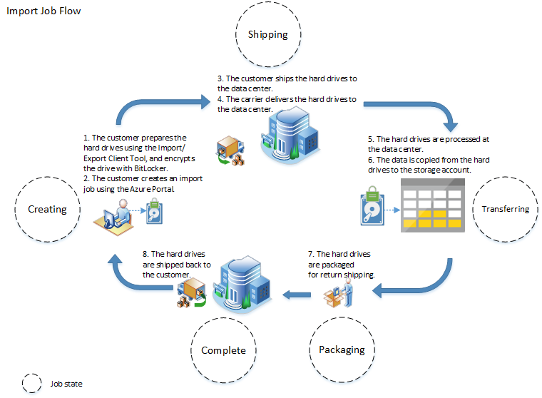
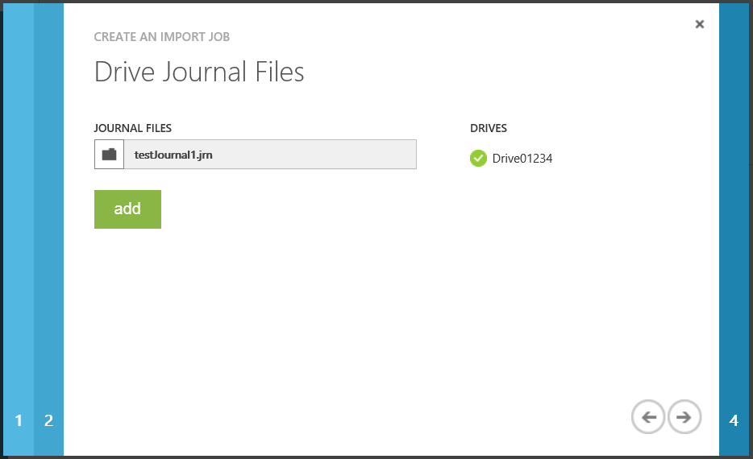
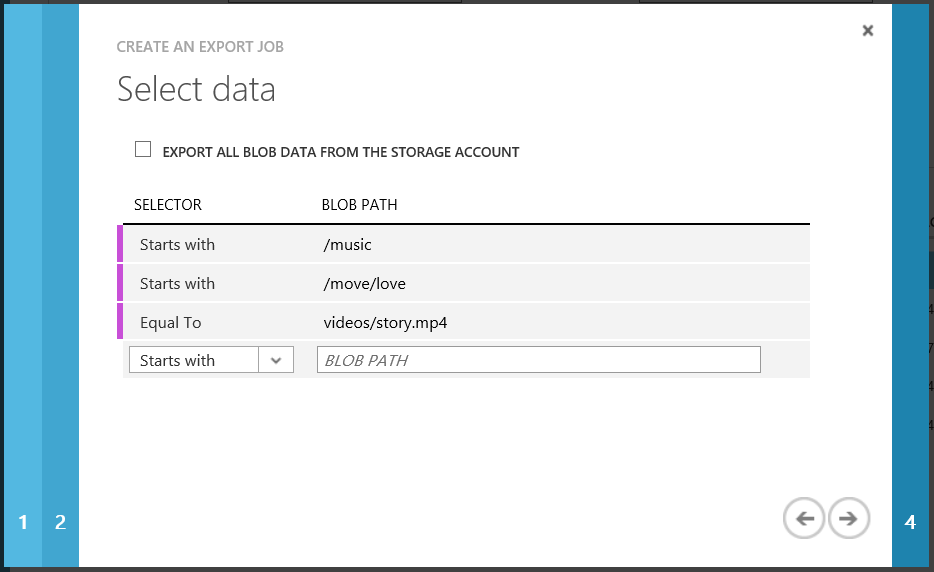

<properties
    pageTitle="Importieren/Exportieren übertragen von Daten auf Blob-Speicher mit | Microsoft Azure"
    description="Informationen Sie zum Erstellen von importieren und Exportieren von Aufträgen im Portal klassischen Azure BLOB-Speicher Datenübertragung."
    authors="renashahmsft"
    manager="aungoo"
    editor="tysonn"
    services="storage"
    documentationCenter=""/>

<tags
    ms.service="storage"
    ms.workload="storage"
    ms.tgt_pltfrm="na"
    ms.devlang="na"
    ms.topic="article"
    ms.date="10/18/2016"
    ms.author="renash"/>

# Verwenden Sie der Import/Export-Dienst in Microsoft Azure Blob-Speicher Datenübertragung

## (Übersicht)

Azure Import/Export-Dienst können Sie große Datenmengen auf Azure Blob-Speicher sicher übertragen werden soll, indem Sie Liefer-Festplatten auf einer Azure Data Center. Sie können auch diesen Dienst verwenden, zum Übertragen von Daten aus Azure Blob-Speicher auf Festplatten und zu Ihrer Website lokalen versenden. Dieser Dienst eignet sich in Situationen, in dem Sie mehrere TB an Daten in den oder aus Azure übertragen möchten, jedoch Uploads / Download über das Netzwerk nicht möglich, aufgrund eingeschränkter Bandbreite oder hohe Netzwerkkosten ist.

Der Dienst erfordert, dass Festplatten Bit Schließfach für die Sicherheit Ihrer Daten verschlüsselt werden soll. Der Dienst unterstützt klassischen Speicherkonten in allen Bereichen von öffentlichen Azure. Liefern Ihnen Festplatten auf einen der unterstützten Speicherorte weiter unten in diesem Artikel angegeben.

In diesem Artikel erfahren Sie mehr über den Azure Import/Export-Dienst und Laufwerke für das Kopieren von Daten an und von Azure Blob-Speicher verschicken.

> [AZURE.IMPORTANT] Erstellen und Verwalten von importieren, und Exportieren von Projekten für klassische Speicher mithilfe des Portals Classic oder den [Import/Export-Dienst REST-APIs](http://go.microsoft.com/fwlink/?LinkID=329099). Ressourcenmanager Speicherkonten werden zurzeit nicht unterstützt.

## Wann sollte ich den Azure Import/Export-Dienst werden verwendet?

Sie können in Betracht Azure Import/Export-Dienst beim Hochladen oder Herunterladen von Daten über das Netzwerk zu langsam ist oder zusätzliche Bandbreite erste Kosten hoch ist.

Sie können diesen Dienst in Szenarien wie verwenden:

- Migrieren von Daten in der Cloud: Wechseln Sie große Datenmengen zur Azure schnell und effektiv Kosten.
- Content-Verteilung: Senden von Daten schnell an Ihre Kunden-Websites.
- Sicherung: Optimieren Sie Sicherungskopien Ihrer Daten lokal in Azure Blob-Speicher gespeichert.
- Wiederherstellung von Daten: Wiederherstellen Blob-Speicher gehörende Kehrmatrix große Datenmengen, bis es auf Ihrem lokalen Speicherort übermittelt.

## Erforderliche Komponenten

In diesem Abschnitt haben wir die erforderlichen Komponenten zum Verwenden dieses Diensts erforderlich aufgeführt. Bitte überprüfen sie sorgfältig vor der Lieferung Ihren Laufwerken zu reduzieren.

### Speicher-Konto

Sie müssen ein vorhandenes Azure-Abonnement und einen oder mehrere **klassischen** Speicherkonten den Import/Export-Dienst verwenden können. Jeder Auftrag kann zum Übertragen von Daten in den oder aus nur eine klassische Speicher-Konto verwendet werden. Kurzum, kann keiner einzelnen Import/Export-Position über mehrere Speicherkonten hinweg umfassen. Informationen zum Erstellen eines neuen Kontos mit Speicher finden Sie unter [So erstellen Sie ein Konto Speicher](storage-create-storage-account.md#create-a-storage-account).

### BLOB-Typen

Azure Import/Export-Dienst können Sie um Daten in Blobs **Blockieren** oder **Seitenblobs** zu kopieren. Umgekehrt können Sie nur **Blockieren** Blobs, **Seitenblobs** oder **Anfügen** Blobs aus Azure-Speicher mit diesen Dienst exportieren.

### Position

Um den Vorgang zu importieren oder Exportieren von Blob-Speicher zu beginnen, erstellen Sie zuerst ein Projekt aus. Ein Auftrag kann einer Position importieren oder eine Position exportieren sein:

- Erstellen Sie ein Importvorgang, wenn Sie Daten, die Sie Ihren lokalen zu Blobs in Ihr Konto Azure-Speicher übertragen möchten.
- Erstellen Sie ein Projekt exportieren, wenn Sie derzeit als Blobs in Ihr Speicherkonto auf Festplatten, die Sie geliefert werden gespeicherte Daten übertragen möchten.

Beim Erstellen eines Auftrags benachrichtigt Sie, dass Sie eine oder mehrere Festplatten auf einer Azure Data Center Liefer-werden, werden dem Import/Export-Dienst.

- Zu einem Importvorgang geliefert Sie Festplatten, die Ihre Daten enthalten.
- Für eine Aufgabe, Exportieren werden Sie leere Festplatten ausliefern werden.
- Sie können bis zu 10 Festplatten pro Projekt liefern.

Sie können Erstellen einer Import- oder über die [klassischen Portal](https://manage.windowsazure.com/) oder die [Azure Speicher Import/Export-REST-API](http://go.microsoft.com/fwlink/?LinkID=329099)Auftrag exportieren.

### Client-tool

Der erste Schritt beim Erstellen eines Auftrags **Importieren** ist So bereiten Sie die Festplatte, die geliefert wird für den Import vor. Um die Festplatte vorbereiten zu können, müssen Sie verbinden Sie es mit einem lokalen Server und Ausführen des Azure Import/Export-Client-Tools auf dem lokalen Server. Dieses Clienttool erleichtert, kopieren die Daten in das Laufwerk, die Daten auf dem Laufwerk mit BitLocker verschlüsselt und Generieren von Dateien der Journal.

Die Erfassung Dateien speichern grundlegenden Informationen zu Ihrer Arbeit und das Laufwerk, wie z. B. Laufwerk fortlaufende Zahl und Kontonamen Speicher. Diese Journaldatei wird nicht auf das Laufwerk gespeichert. Es wird während der Erstellung von importieren Auftrag verwendet. Details zur Erstellung von Auftrag werden Schritt für Schritt weiter unten in diesem Artikel bereitgestellt.

Das Clienttool ist nur mit 64-Bit-Windows-Betriebssystem kompatibel. Finden Sie im Abschnitt [: das Betriebssystem von](#operating-system) bestimmter BS-Versionen unterstützt.

Laden Sie die neueste Version des [Azure Import/Export Clienttool](http://go.microsoft.com/fwlink/?LinkID=301900&clcid=0x409)an. Weitere Details zur Verwendung des Import/Export-Tools Azure finden Sie unter den [Azure Import/Export-Tool Bezug](http://go.microsoft.com/fwlink/?LinkId=329032).

### Festplatten

3,5-Zoll SATA II/III internen Festplatten zur Verwendung mit dem Import/Export-Dienst unterstützt. Festplatten können bis zu 10TB.
Für Aufträge importieren wird nur das erste Datenvolume auf dem Laufwerk verarbeitet werden. Die Lautstärke Daten muss mit NTFS formatiert werden.
Beim Kopieren von Daten auf die Festplatte können Sie es direkt mithilfe eines Verbinders SATA anfügen, oder fügen Sie ihn extern mit einer externen SATA II/III USB-Netzwerkadapter. Es wird empfohlen, verwenden eine der folgenden externen USB-SATA-II/III an:

- Anker 68UPSATAA - 02 Business Unit
- Anker 68UPSHHDS-Business Unit
- Startech SATADOCK22UE
- Sharkoon QuickPort XT HC

Wenn Sie über einen Konverter die haben oben nicht aufgelistet ist, können Sie versuchen, Ausführen des Azure Import/Export-Tools verwenden Ihres Konverters das Laufwerk vorbereiten und angezeigt, wenn sie vor dem Kauf eines Konverters unterstützten funktioniert.

> [AZURE.IMPORTANT] Externe Festplatten, die im Zusammenhang mit einer integrierten USB-Netzwerkadapter werden von diesem Dienst nicht unterstützt. Darüber hinaus kann der Datenträger innerhalb der Groß-/Kleinschreibung von einer externen Festplatte verwendet werden. Senden Sie uns bitte nicht externe Festplatten.

### Verschlüsselung

Die Daten auf der Festplatte müssen mit Laufwerk Wenn BitLocker verschlüsselt werden. Dadurch werden die Daten geschützt, während die Übertragung.

Für Aufträge importieren gibt es zwei Möglichkeiten, um die Verschlüsselung ausführen. Die erste Möglichkeit besteht darin, verwenden den / Verschlüsseln der Parameter beim Ausführen des Clienttools während Laufwerk Vorbereitung. Die zweite Möglichkeit besteht darin Wenn BitLocker manuell auf das Laufwerk aktivieren und des Verschlüsselungsschlüssels in der Zeile Client-Tool Befehl während Laufwerk Vorbereitung angeben.

Für Projekte exportieren Verschlüsseln der Dienst nach dem Kopieren von Daten auf der Laufwerke das Laufwerk mit BitLocker vor der Lieferung es für Sie. Der Schlüssel wird Sie über das Portal klassischen bereitgestellt werden.  

### Betriebssystem

Sie können eine der folgenden 64-Bit-Betriebssysteme verwenden, um die Festplatte mithilfe der Import/Export-Tool Azure vor der Lieferung des Laufwerks in Azure vorzubereiten:

Windows 7 Enterprise, Windows 7 Ultimate, Windows 8 Pro, Enterprise für Windows 8, Windows 8.1 Pro, Windows 8.1 Enterprise, Windows 101, Windows Server 2008 R2, Windows Server 2012, Windows Server 2012 R2. Alle folgenden Betriebssysteme unterstützen der BitLocker.

> [AZURE.IMPORTANT] 1 Wenn Sie auf Ihrer Festplatte vorbereiten einen 10 Windows-Computer verwenden, wenden Sie sich bitte herunterladen Sie die neueste Version des Import/Export-Tools Azure.

### Speicherorte

Der Azure Import/Export-Dienst unterstützt Kopieren von Daten an und von alle öffentlichen Azure-Speicher-Konten. Sie können Festplatten auf einen der folgenden Speicherorte liefern. Wenn Ihre Speicherkonto an einem öffentlichen Azure Speicherort, die hier nicht angegeben wird handelt, wird eine alternative Versand Position bereitgestellt werden, wenn Sie den Auftrag über die klassischen Portal oder im Import/Export-REST-API erstellen.

Unterstützte Versand Speicherorte:

- Ostasiatische US

- Westen US

- Ostasiatische USA 2

- USA – zentral

- Nord-zentralen US

- Süd zentralen US

- North Europa

- Westen Europa

- Ostasien

- Oder Asien

- Australien OST

- Australien oder

- Japan "Westen"

- Japan OST

- Zentrale Indien

### Versand

**Versand Laufwerke Data Center:**

Beim Erstellen eines Auftrags importieren oder exportieren erhalten Sie eine Versandadresse einer der unterstützten Speicherorte aus Ihren Laufwerken zu reduzieren verschicken eingegeben werden. Die Adresse zur Verfügung gestellt, hängt von den Speicherort Ihres Kontos Speicher, aber es möglicherweise nicht identisch mit Ihrem Konto-Speicherort.

Fluglinien FedEx, DHL, USV oder der US-Post Service können Sie Ihren Laufwerken zu reduzieren, an die Adresse versenden.

**Versand Laufwerke aus dem Data Center:**

Beim Erstellen eines Auftrags importieren oder exportieren, müssen Sie angeben, eine Absenderadresse für Microsoft verwendet, bei der Laufwerke zu liefernden wieder, nachdem Sie Ihr Projekt abgeschlossen ist. Stellen Sie sicher, dass Sie eine gültige Absenderadresse zur Vermeidung von verspätungen in Verarbeitung bereitstellen.

Sie müssen außerdem einen gültigen FedEx oder DHL Carrier bereitstellen Kontonummer von Microsoft für Versands der Laufwerke wieder verwendet werden. Eine Kontonummer FedEx ist für den Versand Laufwerke wieder von der USA und Europe Positionen erforderlich. Eine Kontonummer DHL ist für den Versand Laufwerke wieder von Asien und Australien Positionen erforderlich. Sie können eine [FedEx](http://www.fedex.com/us/oadr/) (für USA und Europe) oder [DHL](http://www.dhl.com/) (Asien und Australien) Carrier Konto erstellen, wenn Sie nicht vorhanden ist. Wenn Sie bereits eine Kontonummer Carrier haben, stellen Sie sicher, dass sie zulässig ist.

In den Versand Ihrer Pakete, müssen Sie die Begriffe bei [Microsoft Azure Service Ausdrücke](https://azure.microsoft.com/support/legal/services-terms/)befolgen.

> [AZURE.IMPORTANT] Bitte beachten Sie, dass das physische Medium, die Sie versenden möglicherweise internationale Rahmen cross müssen. Sie können dafür sorgen, dass Ihre physische Medien und die Daten importiert und/oder das anwendbare Recht exportiert. Wenden Sie vor der Lieferung der physischen Medien, Ihre Berater, um sicherzustellen, dass Ihre Medien und die Daten in die Mitte identifizierten Daten rechtlich versendet werden können. Dadurch wird sichergestellt, dass er Microsoft zeitgerecht erreicht. Beispielsweise benötigt ein Paket, die internationale Rahmen cross wird eine kommerzielle Rechnung mit dem Paket (außer wenn kreuzt Rahmen innerhalb der Europäischen Union) beizufügen. Sie könnten gefülltes Kopie der Website Carrier kommerzielle Rechnung drucken. Beispiel für kommerzielle Rechnung sind [DHL kommerzielle Rechnung] (http://invoice-template.com/wp-content/uploads/dhl-commercial-invoice-template.pdf) oder [FedEx kommerzielle Rechnung](http://images.fedex.com/downloads/shared/shipdocuments/blankforms/commercialinvoice.pdf). Stellen Sie sicher, dass Microsoft nicht als Ausführer angegeben wurde.

## Wie funktioniert der Azure Import/Export-Dienst?

Sie können Daten zwischen Ihrem lokalen Standort und Azure Blob-Speicher mithilfe des Azure Import/Export-Diensts durch das Erstellen von Aufträgen und Liefer-Festplatten auf einer Azure Data Center übertragen. Jede von Ihnen gelieferten Festplattenlaufwerk ist ein einzelnes Projekt zugeordnet. Jeder Auftrag ist mit einem einzelnen Speicherkonto verknüpft. Überprüfen Sie im [Abschnitt erforderlichen Komponenten](#pre-requisites) sorgfältig, um Informationen zu den Besonderheiten von diesem Dienst wie unterstützt Blob Typen, Datenträger, Speicherorte und Versand an.

In diesem Abschnitt wird auf hoher Ebene erläutert die Schritte zum Importieren und Exportieren von Aufträgen. Klicken Sie im [Abschnitt Schnellstart](#quick-start)später bieten wir eine schrittweise Anleitung zum Erstellen einer importieren und Exportieren von Position.

### Innerhalb eines Auftrags importieren

Auf hoher Ebene umfasst eine Position importieren die folgenden Schritte aus:

- Ermitteln Sie die Daten importiert werden sollen und die Anzahl der Laufwerke, die Sie benötigen.
- Identifizieren Sie die Ziel-Blobs für Ihre Daten im Blob-Speicher.
- Verwenden der Azure Import/Export-Tool zum Kopieren von Daten in eine oder mehrere Festplatten und diese mit BitLocker verschlüsselt.  
- Erstellen eines Auftrags importieren in Ihrem Ziel klassischen Speicherkonto über die klassischen Portal oder im Import/Export-REST-API an. Wenn das Portal klassischen verwenden, wird hochladen Sie die Laufwerk Journal-Dateien.
- Stellen Sie die Absenderadresse und Carrier Kontonummer für Versands der Laufwerke vorlesen verwendet werden soll.
- Versenden Sie den Festplatten den Versand Adresse, die während der Erstellung der Position erhalten.
- Aktualisieren Sie die Übermittlung nachverfolgen Zahl in den Import Job-Details, und senden Sie den Importvorgang.
- Laufwerke empfangen und in der Mitte der Azure-Daten verarbeitet werden.
- Laufwerke werden mit Ihrem Konto Carrier, um die Absenderadresse in den Importvorgang bereitgestellten geliefert.

    

### Innerhalb eines Auftrags exportieren

Auf hoher Ebene umfasst eine Position exportieren die folgenden Schritte aus:

- Ermitteln Sie die zu exportierenden Daten und die Anzahl der Laufwerke, die Sie benötigen.
- Identifizieren Sie die Quelle Blobs oder Container Pfade der Daten im BLOB-Speicher.
- Erstellen eines Auftrags exportieren in Ihrem über die klassischen Portal oder im Import/Export-REST-API Quelle Speicher-Konto an.
- Geben Sie an Quelle Blobs Container Pfade Ihrer Daten in den Auftrag exportieren.
- Stellen Sie die Absenderadresse und Carrier Kontonummer für für Versands der Laufwerke vorlesen verwendet werden.
- Versenden Sie den Festplatten den Versand Adresse, die während der Erstellung der Position erhalten.
- Aktualisieren der Übermittlung Anzahl in die Details des Exportvorgangs Auftrag nachverfolgen, und senden Sie den Auftrag exportieren.
- Die Laufwerke empfangen und in der Mitte der Azure-Daten verarbeitet werden.
- Die Laufwerke werden mit BitLocker verschlüsselt; die Schlüssel sind verfügbar über die klassischen Portal.  
- Die Laufwerke werden mit Ihrem Konto Carrier, um die Absenderadresse in den Importvorgang bereitgestellten geliefert.

    

### Anzeigen Ihrer Position status

Können Sie den Status des Importvorgangs nachverfolgen oder Aufträge aus dem Portal klassischen exportieren. Navigieren Sie zu Ihrem Speicherkonto im Portal klassischen, und klicken Sie auf die Registerkarte **Importieren/Exportieren** . Klicken Sie auf der Seite wird eine Liste der Aufträge angezeigt. Sie können die Liste auf Projektstatus, Auftragsname, Position Typ oder laufender Nummer filtern.

Sie sehen eine der folgenden Auftrag Status je nachdem, wo die Festplatte im Prozess ist.

| Projektstatus   | Beschreibung                                                                                                                                                                                                                                                                                                                                                                        |
|:-------------|:-----------------------------------------------------------------------------------------------------------------------------------------------------------------------------------------------------------------------------------------------------------------------------------------------------------------------------------------------------------------------------------|
| Erstellen     | Ihre Aufgabe erstellt wurde, aber Ihre Lieferdaten noch nicht bereitgestellt.                                                                                                                                                                                                                                                                                                |
| Versand     | Ihre Aufgabe erstellt wurde, und Sie Ihrer Lieferdaten gewährt. **Hinweis**: Wenn das Laufwerk, auf das Azure Data Center übermittelt wird, kann der Status weiterhin "Versand" für einige Zeit anzeigen. Nachdem der Dienst gestartet wird, kopieren die Daten, ändert sich der Status in "Übertragen". Wenn Sie weitere spezifische Status Ihres Laufwerks anzeigen möchten, können Sie die REST-API importieren/exportieren. |
| Übertragen von | Die Daten von der Festplatte (zu einem Importvorgang) übertragenen ist oder die Festplatte (für eine Auftrag exportieren).                                                                                                                                                                                                                                                                 |
| Verpacken    | Die Übermittlung der Daten abgeschlossen ist, und die Festplatte ist für den Versand vorlesen vorbereitet wird.                                                                                                                                                                                                                                                                             |
| Führen Sie die     | Die Festplatte wurde vorlesen geliefert.                                                                                                                                                                                                                                                                                                                                      |

### Zeit zu Projekten Prozess

Die Zeitdauer benötigt wird, um eine Position importieren/exportieren abhängig von verschiedenen Faktoren wie z. B. Zeit für den Versand, Prozess beruflichen Position Typ, Typ und Größe der kopierte Daten und die Größe der Datenträger bereitgestellt. Der Import/Export-Dienst hat keiner Vereinbarung zum SERVICELEVEL. Die REST-API können Sie den Auftrag genauer überwachen. Es gibt Prozent abgeschlossen Parameter in der Liste Aufträge Vorgang, der Angabe der Kopiervorgang verleiht. Dient zum erreichen Sie an uns, wenn Sie eine Schätzung zum Abschließen einer Uhrzeit kritische importieren/exportieren Auftrags benötigen.

### Preise

**Gebühr für Laufwerk**

Es ist eine Gebühr für jedes Laufwerk verarbeitet als Teil der Import Laufwerk oder Auftrag exportieren. Finden Sie die Details auf die [Azure Import/Export-Preise](https://azure.microsoft.com/pricing/details/storage-import-export/)ein.

**Liefern von Kosten**

Wenn Sie Laufwerke zu Azure liefern, bezahlen Sie die Versandkosten, um den Versand Carrier. Wenn Microsoft Ihnen die Laufwerke zurückgibt, wird die Versandkosten mit dem Konto Carrier belastet, die Sie zum Zeitpunkt der Erstellung der Position zur Verfügung gestellt.

**Transaktionskosten**

Es gibt keine Transaktionskosten beim Importieren von Daten in Blob-Speicher. Die standard-Ausgang Gebühren werden aus dem Blob-Speicher Daten exportiert werden. Weitere Informationen zu Transaktionskosten, finden Sie unter [Datenübertragung Preise.](https://azure.microsoft.com/pricing/details/data-transfers/)

## Schnellstart

In diesem Abschnitt bieten wir eine schrittweise Anleitung zum Erstellen einer importieren und eine Position exportieren. Stellen Sie sicher, dass Sie alle [erforderlichen Komponenten](#pre-requisites) der entsprechen, bevor Sie fortschreiten.

## So erstellen Sie ein Projekt importieren?

Erstellen eines Auftrags importieren, um Daten zu Ihrem Konto Azure-Speicher von Festplatten kopieren Liefer-ein oder mehrere Laufwerke, die Daten in die Mitte des angegebenen Daten enthält. Der Importvorgang übermittelt Details Festplatten Daten kopiert werden, adressieren Speicher-Konto und Versandinformationen zum Dienst Azure importieren/exportieren. Erstellen eines Auftrags importieren umfasst drei Schritte. Bereiten Sie zunächst Ihren Laufwerken zu reduzieren, die mit dem Tool für Azure Import/Export-Client. Zweites, übermitteln Sie mit dem Portal klassischen einen Auftrag für den Import aus. Dritte liefern Sie die Laufwerke an die Adresse des Versand zur Verfügung gestellt, während der Erstellung der Position und aktualisieren Sie die Versandinformationen in Ihrem Auftragsdetails zu.   

> [AZURE.IMPORTANT] Sie können nur einen Auftrag pro Storage-Konto senden. Jede von Ihnen gelieferten Laufwerk kann zu einem Speicherkonto importiert werden. Beispielsweise angenommen, dass Sie die Daten in zwei Speicherkonten zu importieren möchten. Sie müssen separate Festplatten für jedes Storage-Konto verwenden und erstellen separate Projekte pro Storage-Konto.

### Bereiten Sie Ihrer Laufwerke vor

Der erste Schritt beim Importieren von Daten mithilfe des Azure Import/Export-Diensts ist auf Ihren Laufwerken zu reduzieren, die mit dem Tool für Azure Import/Export-Client vorbereiten. Gehen Sie folgendermaßen vor, um Ihren Laufwerken zu reduzieren vorbereiten.

1.  Identifizieren Sie die Daten importiert werden sollen. Hierfür kann es sich um Verzeichnisse und eigenständigen Dateien auf dem lokalen Server oder einer Netzwerkfreigabe sein.  

2.  Ermitteln der Anzahl der Laufwerke, die Sie je nach Gesamtgröße der Daten benötigen. Beschaffen Sie die erforderliche Anzahl von 3,5 Zoll SATA II/III Festplatten.

3.  Identifizieren Sie die Ziel-Speicher-Konto, Container, virtuelle Verzeichnisse und Blobs.

4.  Ermitteln der Verzeichnisse und/oder den eigenständigen Dateien, die auf jeder Festplatte kopiert werden.

5.  Verwenden Sie das [Azure Import/Export-Tool](http://go.microsoft.com/fwlink/?LinkID=301900&clcid=0x409) , um die Daten in eine oder mehrere Festplatten zu kopieren.

    - Das Azure Import/Export-Tool erstellt Sitzungen kopieren, um die Daten aus der Quelle in der Festplatten zu kopieren. In einer Sitzung einzelnes Dokument können Sie das Tool ein einzelnes Verzeichnis sowie die zugehörigen Unterverzeichnisse oder eine einzelne Datei kopieren.

    - Sie möglicherweise mehrere Kopie Sitzungen benötigen, wenn die Quelldaten viele Verzeichnisse umfasst.

    - Jede Festplatte, die Sie vorbereiten müssen Sie mindestens eine Kopie Sitzung.

6.  Sie können angeben, die / verschlüsseln Parameter Bitlocker-Verschlüsselung auf der Festplatte zu aktivieren. Alternativ konnte Sie auch manuell auf der Festplatte Wenn BitLocker aktivieren, und geben Sie die Taste während der Ausführung des Tools.

7.  Der Import/Export-Tool Azure generiert eine Laufwerk Journal-Datei für jedes Laufwerk an, wie es erstellt wurde. Die Laufwerk Journal-Datei wird auf Ihrem lokalen Computer, die sich nicht auf das Laufwerk selbst gespeichert. Sie werden die Journal-Datei hochladen, wenn Sie den Importvorgang erstellen. Eine Laufwerk Journal-Datei enthält die Laufwerk-ID und die Taste BitLocker sowie weitere Informationen über das Laufwerk.
**Wichtig**: jede Festplatte Sie vorbereiten führt zu Fehlern in einer Journaldatei. Wenn Sie den Importvorgang mit dem Portal klassischen erstellen, müssen Sie alle Journaldateien im der Laufwerke hochladen, die dieser Importvorgang gehören. Laufwerke ohne Journal, die Dateien nicht verarbeitet werden.

8.  Ändern Sie die Daten auf den Festplatten oder die Journal-Datei nicht nach Abschluss der Datenträger Vorbereitung.

Nachfolgend finden Sie die Befehle und Beispiele für das Festplattenlaufwerk mit Azure Import/Export Clienttool vorbereiten.

Azure Import/Export-Client-Tool PrepImport Befehl für die erste Kopie Sitzung, um ein Verzeichnis zu kopieren:

    WAImportExport PrepImport /sk:<StorageAccountKey> /csas:<ContainerSas> /t: <TargetDriveLetter> [/format] [/silentmode] [/encrypt] [/bk:<BitLockerKey>] [/logdir:<LogDirectory>] /j:<JournalFile> /id:<SessionId> /srcdir:<SourceDirectory> /dstdir:<DestinationBlobVirtualDirectory> [/Disposition:<Disposition>] [/BlobType:<BlockBlob|PageBlob>] [/PropertyFile:<PropertyFile>] [/MetadataFile:<MetadataFile>]

**Beispiel:**

Im folgenden Beispiel werden alle Dateien kopiert werden und sub-Verzeichnisse von H:\Video nach dem Festplattenlaufwerk auf x bereitgestellt. Die Daten werden mit dem Ziel Speicherkonto angegeben, über die Speicher kontoschlüssel als auch in den Speichercontainer aufgerufen Video importiert. Wenn der Speichercontainer nicht vorhanden ist, wird er erstellt. Dieser Befehl auch formatieren und das Ziel Festplattenlaufwerk verschlüsseln.

    WAImportExport.exe PrepImport /j:FirstDrive.jrn /id:Video1 /logdir:c:\logs /sk:storageaccountkey /t:x /format /encrypt /srcdir:H:\Video1 /dstdir:video/ /MetadataFile:c:\WAImportExport\SampleMetadata.txt

Azure Import/Export-Client-Tool PrepImport Befehl zum Sitzungen nachfolgende kopieren, um ein Verzeichnis zu kopieren:

    WAImportExport PrepImport /j:<JournalFile> /id:<SessionId> /srcdir:<SourceDirectory> /dstdir:<DestinationBlobVirtualDirectory> [/Disposition:<Disposition>] [/BlobType:<BlockBlob|PageBlob>] [/PropertyFile:<PropertyFile>] [/MetadataFile:<MetadataFile>]

Geben Sie für nachfolgende kopieren Sitzungen auf dem gleichen Festplattenlaufwerk die gleichen Journal Dateinamen an, und geben Sie, eine neue Sitzung; Es ist nicht erforderlich, das Taste und Zielwebsites Laufwerk Speicher Konto erneut bereitzustellen noch zum Formatieren oder das Laufwerk verschlüsseln ein. In diesem Beispiel werden wir den H:\Photo Ordner und die zugehörigen Unterverzeichnisse auf demselben Ziellaufwerk, in den Speichercontainer Namen Foto kopieren.

    WAImportExport.exe PrepImport /j:FirstDrive.jrn /id:Photo /srcdir:H:\Photo /dstdir:photo/ /MetadataFile:c:\WAImportExport\SampleMetadata.txt

Das Azure Import/Export Clienttool PrepImport Befehl für die erste Kopie Sitzung zum Kopieren einer Datei:

    WAImportExport PrepImport /sk:<StorageAccountKey> /csas:<ContainerSas> /t: <TargetDriveLetter> [/format] [/silentmode] [/encrypt] [/bk:<BitLockerKey>] [/logdir:<LogDirectory>] /j:<JournalFile> /id:<SessionId> /srcfile:<SourceFile> /dstblob:<DestinationBlobPath> [/Disposition:<Disposition>] [/BlobType:<BlockBlob|PageBlob>] [/PropertyFile:<PropertyFile>] [/MetadataFile:<MetadataFile>]

Das Azure Import/Export Clienttool PrepImport Befehl zum Kopieren der nachfolgenden Sitzungen zum Kopieren einer Datei:

    WAImportExport PrepImport /j:<JournalFile> /id:<SessionId> /srcfile:<SourceFile> /dstblob:<DestinationBlobPath> [/Disposition:<Disposition>] [/BlobType:<BlockBlob|PageBlob>] [/PropertyFile:<PropertyFile>] [/MetadataFile:<MetadataFile>]

**Denken Sie daran**: Standardmäßig werden die Daten als blockieren Blobs importiert werden. Sie können den /BlobType Parameter verwenden, zum Importieren von Daten als ein Seitenblobs. Wenn Sie virtuelle Festplatte Dateien importieren möchten, die eine Azure-virtuellen Computers als Datenträger bereitgestellt wird, müssen Sie sie beispielsweise als Seitenblobs importieren. Wenn Sie unsicher sind, welche Blob geben verwenden, können Sie angeben, /blobType:auto, und wir helfen Ihnen bei den richtigen Typ. In diesem Fall alle virtuelle Festplatte und Vhdx Dateien als Seitenblobs importiert werden, und der Rest wird als blockieren Blobs importiert werden.

Finden Sie weitere Details zur Verwendung des Azure Import/Export Clienttools in [Vorbereiten Festplatten für den Import](https://msdn.microsoft.com/library/dn529089.aspx)aus.

Darüber hinaus finden Sie in den [Beispielworkflow zum Vorbereiten Festplatten zu einem Importvorgang](https://msdn.microsoft.com/library/dn529097.aspx) ausführlichere schrittweise Anweisungen.  

### Erstellen Sie den Auftrag importieren

1.  Nachdem Sie die Festplatte vorbereitet haben, navigieren Sie zu Ihrem Speicherkonto in der [klassischen Portal](https://manage.windowsazure.com) und zeigen Sie das Dashboard an. Klicken Sie unter Daten eine **Schnelle Übersicht**klicken Sie auf **Erstellen eines Auftrags importieren**. Überprüfen Sie die Schritte aus, und wählen Sie das Kontrollkästchen, um anzugeben, dass Sie die Festplatte vorbereitet haben und die Laufwerk Journaldatei verfügbar ist.

2.  Geben Sie in Schritt 1 Kontaktinformationen für der Verantwortliche für diesen Importvorgang und eine gültige Absenderadresse ein. Wenn Sie ausführliche Protokolldaten für den Importvorgang speichern möchten, aktivieren Sie die Option zum **Speichern der ausführlichen Log in meinem 'Waimportexport' Blob-Container**.

3.  Klicken Sie unter Schritt2 hochladen Sie Laufwerk Journaldateien, die Sie während der Laufwerk Vorbereitung Schritt für Ihren Kunden. Sie müssen eine Datei für jedes Laufwerk hochladen, die Sie vorbereitet haben.

    

4.  Geben Sie in Schritt 3 einen beschreibenden Namen für den Importvorgang. Beachten Sie, dass der eingegebene Name möglicherweise nur Kleinbuchstaben, Zahlen, Bindestriche enthalten und Unterstriche, muss mit einem Buchstaben beginnen und darf keine Leerzeichen enthalten. Verwenden Sie den Namen, den Sie festlegen, dass Ihre Projekte zu verfolgen, während Sie sich befinden, wird ausgeführt und nach Abschluss.

    Wählen Sie anschließend Ihre Daten Center Region in der Liste aus. Die Data Center Region wird angegeben, den Datacenter und die Adresse, der Ihrem Paket versandt werden muss. Finden Sie unter den häufig gestellten Fragen unter Weitere Informationen.

5.  Wählen Sie in Schritt 4 angegeben wird Ihre Absenderadresse Carrier aus der Liste aus, und geben Sie Ihre Kontonummer Carrier. Microsoft wird dieses Konto verwenden, die Laufwerke vorlesen verschicken, nachdem Ihr Projekt importieren abgeschlossen ist.

    Wenn Sie Ihre laufender Nummer haben, wählen Sie Ihre Übermittlung Carrier aus der Liste aus, und geben Sie Ihre laufender Nummer.

    Wenn Sie kein laufender Nummer noch haben, wählen Sie **bietet ich meine Versand Informationen für dieses Projekt importieren, nachdem ich meine Verpacken geliefert haben**, führen Sie dann den Importvorgang.

6. Wenn Sie Ihre laufender Nummer eingeben möchten, nachdem Sie Ihr Paket, zurück zu der Seite **Import/Export** für Ihr Speicherkonto im Portal klassischen versandt haben die wählen Sie Ihre Position in der Liste aus, und wählen Sie **Liefer-Informationen**. Navigieren Sie mithilfe des Assistenten aus, und geben Sie Ihre laufender Nummer in Schritt2.

    Wenn die laufender Nummer innerhalb von 2 Wochen erstellen den Auftrag nicht aktualisiert wird, wird das Projekt ablaufen.

    Ist die Position im Zustand erstellen, Versand oder übertragen, können Sie auch Ihre Kontonummer Carrier in Schritt2 des Assistenten aktualisieren. Sobald die Position in der Verpackung Zustand ist, kann nicht Ihre Carrier Kontonummer für dieses Projekt aktualisiert werden.

7. Sie können Ihre Position auf dem Portal Dashboard überwachen. Finden Sie unter Was jeder Job-Status im vorherigen Abschnitt aufrufen, indem Sie [den Status Ihrer Position](#viewing-your-job-status)bedeutet.

## So erstellen Sie ein Projekt exportieren?

Erstellen Sie ein Projekt exportieren, um dem Import/Export-Dienst darauf hinzuweisen, dass Sie eine oder mehrere leere Laufwerke Data Center ausgeliefert werden, sodass die Daten aus Ihrem Speicherkonto in der und der Laufwerke exportiert werden können, dann an Sie geliefert.

### Bereiten Sie Ihrer Laufwerke vor

Folgenden Pre überprüft werden zum Vorbereiten Ihrer Laufwerke für ein Projekt exportieren empfohlen:

1. Überprüfen Sie die Anzahl der Datenträger, die mit der Azure Import/Export-Tool PreviewExport Befehl erforderlich. Weitere Informationen finden Sie unter [Vorschau Drive Verwendung für ein Projekt exportieren](https://msdn.microsoft.com/library/azure/dn722414.aspx). Sie können Laufwerk Verwendung Anzeigen einer Vorschau für die Blobs, die Sie ausgewählt haben, je nach Größe der Laufwerke, die Sie verwenden möchten.

2. Überprüfen Sie, dass Sie auf die Festplatte schreibgeschützt können, die für das Projekt exportieren geliefert werden sollen.

### Erstellen des Exportvorgangs

1.  Erstellen eines Auftrags für den Export, navigieren Sie zu Ihrem Speicherkonto im [Portal klassischen](https://manage.windowsazure.com), und zeigen Sie das Dashboard. Klicken Sie unter Daten eine **Schnelle Übersicht**klicken Sie auf **Erstellen eines Auftrags exportieren** , und führen Sie die Schritte des Assistenten aus.

2.  Geben Sie in Schritt2 Kontaktdaten für der Verantwortliche für dieses Projekt exportieren aus. Wenn Sie ausführliche Protokolldaten für das Projekt exportieren speichern möchten, aktivieren Sie die Option zum **Speichern der ausführlichen Log in meinem Blob-Container 'Waimportexport'**.

3.  Geben Sie in Schritt 3 Welche BLOB-Daten, die Sie von Ihrem Speicherkonto zur leeren Laufwerk oder Laufwerke exportieren möchten. Sie können auch alle BLOB-Daten in das Speicherkonto exportieren, oder Sie können angeben, welche blobs oder Sätze von Blobs zu exportieren.

    Um ein Blob zu exportierenden angeben möchten, verwenden Sie die Auswahl **Gleich** , und geben Sie den relativen Pfad zu dem Blob, beginnend mit dem Containernamen. Verwenden Sie *$root* , um den Container Root anzugeben.

    Um alle Blobs beginnend mit dem Präfix angeben möchten, verwenden Sie die Auswahl **Beginnt mit** aus, und geben Sie das Präfix, beginnend mit einem Schrägstrich "/". Das Präfix kann das Präfix von den Containername, den Namen der vollständigen Container oder den Namen des vollständigen Container, gefolgt von dem Präfix des Namens Blob sein.

    Die folgende Tabelle zeigt Beispiele für gültige Blob-Pfade:

    Ansichtsauswahl|BLOB-Pfad|Beschreibung
    ---|---|---
    Beginnt mit:|/|Exportiert alle Blobs im Speicherkonto
    Beginnt mit:|/$root /|Exportiert alle Blobs im Stammcontainer
    Beginnt mit:|/Book|Exportiert alle Blobs in jedem Container, die mit dem Präfix **Adressbuch** beginnt
    Beginnt mit:|/Music/|Exportiert alle Blobs im Container **Musik**
    Beginnt mit:|/ Musik/love|Exportiert alle Blobs im Container **Musik** , die mit Präfix **gerne** beginnen
    Gleich|$root/logo.bmp|Exporte BLOB- **logo.bmp** im Stammcontainer
    Gleich|Videos/Story.mp4|Exporte BLOB- **story.mp4** im Container **videos**

    Sie müssen die Blob-Pfade in gültige Formate zur Vermeidung von Fehlern bei der Bearbeitung angeben, wie in diesem Screenshot dargestellt.

    

4.  Geben Sie in Schritt 4 angegeben wird einen beschreibenden Namen für das Projekt exportieren. Der eingegebene Name enthalten möglicherweise nur Kleinbuchstaben, Zahlen, Bindestriche und Unterstriche, muss mit einem Buchstaben beginnen und darf keine Leerzeichen enthalten.

    Die Data Center Region wird das Data Center anzugeben, das Ihrem Paket versandt werden muss. Finden Sie unter den häufig gestellten Fragen unter Weitere Informationen.

5.  Klicken Sie in Schritt 5 Wählen Sie Ihre Absenderadresse Carrier aus der Liste aus, und geben Sie Ihre Kontonummer Carrier. Mithilfe dieses Kontos wird Microsoft Ihren Laufwerken zu reduzieren vorlesen liefern, nachdem Ihr Projekt Export abgeschlossen ist.

    Wenn Sie Ihre laufender Nummer haben, wählen Sie Ihre Übermittlung Carrier aus der Liste aus, und geben Sie Ihre laufender Nummer.

    Wenn Sie kein laufender Nummer noch haben, wählen Sie **bietet ich meine Versand Informationen für dieses Projekt exportieren, nachdem ich meine Verpacken geliefert haben**, führen Sie dann den Exportvorgang zu.

6. Wenn Sie Ihre laufender Nummer eingeben möchten, nachdem Sie Ihr Paket, zurück zu der Seite **Import/Export** für Ihr Speicherkonto im Portal klassischen versandt haben die wählen Sie Ihre Position in der Liste aus, und wählen Sie **Liefer-Informationen**. Navigieren Sie mithilfe des Assistenten aus, und geben Sie Ihre laufender Nummer in Schritt2.

    Wenn die laufender Nummer innerhalb von 2 Wochen erstellen den Auftrag nicht aktualisiert wird, wird das Projekt ablaufen.

    Ist die Position im Zustand erstellen, Versand oder übertragen, können Sie auch Ihre Kontonummer Carrier in Schritt2 des Assistenten aktualisieren. Sobald die Position in der Verpackung Zustand ist, kann nicht Ihre Carrier Kontonummer für dieses Projekt aktualisiert werden.

    > [AZURE.NOTE] Ist das Blob zu exportierenden zum Zeitpunkt des Kopierens auf der Festplatte verwendet, Azure Import/Export-Dienst eine Momentaufnahme der Blob und kopieren die Momentaufnahme.

7.  Sie können Ihre Position auf dem Dashboard im Portal klassischen überwachen. Finden Sie unter Was jeder Job-Status im vorherigen Abschnitt bedeutet aktivieren "Anzeigen Ihrer Position Status".

8.  Nachdem Sie die Laufwerke mit Ihren exportierten Daten erhalten, können Sie anzeigen und kopieren die BitLocker-Schlüssel vom Dienst für die Festplatte generiert. Navigieren Sie zu Ihrem Speicherkonto im Portal klassischen, und klicken Sie auf die Registerkarte importieren/exportieren. Wählen Sie Ihre Arbeit exportieren aus der Liste aus, und klicken Sie auf die Schaltfläche Ansicht Keys. Die Tasten BitLocker angezeigt werden, wie unten dargestellt:

    

Bitte bis unten im Abschnitt häufig gestellte Fragen zu wechseln, wie es am häufigsten gestellten Fragen, die in diesem Zusammenhang auftreten behandelt, wenn Sie diesen Dienst verwenden.

## Häufig gestellte Fragen ##

**Wie lange dauert es meine Daten kopieren, nachdem Sie die Laufwerken das Data Center erreicht?**

Die Dauer der zu kopierenden ist je nach können auf verschiedene Faktoren wie Auftragstyp, Typ und Größe der Daten im Kopiervorgang, die Größe der Datenträger bereitgestellt, und die vorhandenen Arbeitsbelastung. Es kann von ein paar Tage zu zwei Wochen, abhängig von folgenden Faktoren variieren. Daher ist es schwierig, eine allgemeine Schätzung bereitzustellen. Der Dienst versucht, Ihre Arbeit optimieren, indem Sie mehrere Laufwerke nach Möglichkeit parallel kopieren. Wenn Sie einen Mal kritische importieren/exportieren Auftrag haben, andere erreichen Sie uns für eine Schätzung.

**Wann sollte ich Azure Import/Export-Dienst werden verwendet?**
Eine sollten Sie, wenn Uploads / Download über Netzwerk mit Azure Import-/Export ungefähr wie schätzen mehr als sieben Tage dauert. Sie können berechnen, wie lange mithilfe von online-Rechner oder durch [herunterladen](https://github.com/Azure-Samples/storage-dotnet-import-export-job-management/archive/master.zip) befindet sich in unseren Azure importieren exportieren REST-API Stichprobe in Azure Beispiele Repository bei [Daten übertragen Geschwindigkeit Rechner](https://github.com/Azure-Samples/storage-dotnet-import-export-job-management/blob/master/DataTransferSpeedCalculator.html)dauert. Dies ist keine exakte Berechnung aber nur eine ungefähre Angabe.

**Kann ich mit einem Ressourcenmanager Speicherkonto Azure Import/Export-Dienst verwenden?**

Sie können keine Nein, Daten zu oder von einem Ressourcenmanager Speicherkonto direkt mithilfe des Diensts für Azure importieren/exportieren kopieren. Der Dienst unterstützt nur klassische Speicherkonten. Ressourcenmanager Speicher Kundensupport wird in Kürze bereitgestellt werden. Sie können als Alternative Importieren von Daten in einem klassischen Speicherkonto und bei Ihrem mit [AzCopy](storage-use-azcopy.md) oder CopyBlob Ressourcenmanager Speicherkonto zu migrieren.

**Kann ich mithilfe des Azure Import/Export-Diensts Azure-Dateien werden kopiert?**

Nein, unterstützt der Azure Import/Export-Dienst nur blockieren Blobs und Seitenblobs. Alle anderen einschließlich Azure-Dateien, Tabellen und Warteschlangen Speichertypen werden nicht unterstützt.

**Ist der Azure Import/Export-Dienst für CSP-Abonnements verfügbar?**

Der Dienst Azure Import/Export-unterstützt Abonnements CSP Nein, nicht. Die Unterstützung wird in der Zukunft hinzugefügt werden.

**Kann ich den Laufwerk Vorbereitung Schritt zu einem Importvorgang überspringen oder können eine Laufwerk ohne kopieren vorbereiten?**

Müssen Sie alle Laufwerk, das Sie versenden, zum Importieren von Daten möchten mit dem Tool für Azure Import/Export-Client vorbereiten. Sie müssen das Clienttool verwenden, um Daten in das Laufwerk zu kopieren.

**Muss ich alle Datenträger Vorbereitung führen Sie beim Erstellen eines Auftrags exportieren?**

Keine jedoch einige Pre überprüft werden empfohlen. Überprüfen Sie die Anzahl der Datenträger, die mit der Azure Import/Export-Tool PreviewExport Befehl erforderlich. Weitere Informationen finden Sie unter [Vorschau Drive Verwendung für ein Projekt exportieren](https://msdn.microsoft.com/library/azure/dn722414.aspx). Sie können Laufwerk Verwendung Anzeigen einer Vorschau für die Blobs, die Sie ausgewählt haben, je nach Größe der Laufwerke, die Sie verwenden möchten. Überprüfen Sie auch, dass Sie lesen und Schreiben auf die Festplatte, die für das Projekt exportieren geliefert werden können.

**Was passiert, wenn ich eine Festplatte davon in Kenntnis versehentlich an den unterstützten senden?**

Das Azure Data Center gibt das Laufwerk, das nicht entsprechen an den unterstützten Ihnen zurück. Wenn nur einige der Laufwerke in das Paket die Support-Anforderungen erfüllt, diese Laufwerke verarbeitet werden, und die Laufwerke, die nicht die Anforderungen entsprechen an Sie zurückgegeben werden.

**Kann ich mein Auftrag stornieren?**

Sie können einen Auftrag abbrechen, wenn deren Status Liefer- oder wird erstellen.

**Wie lange kann ich den Status der abgeschlossenen Aufträge klassischen Portal anzeigen?**

Sie können den Status für abgeschlossene Projekte innerhalb von 90 Tagen anzeigen. Abgeschlossene Aufträge werden nach 90 Tagen gelöscht.

**Was tun kann ich, wenn ich möchte importieren oder Exportieren von mehr als 10 Laufwerke?**

Eine importieren oder exportieren Auftrag kann nur 10 Laufwerke in einem einzigen Auftrag für den Import/Export-Dienst verweisen. Wenn Sie mehr als 10 Laufwerke liefern möchten, können Sie mehrere Aufträge erstellen. Laufwerke, die mit dem gleichen Auftrag verknüpft sind, müssen im gleichen Paket zusammen ausgeliefert werden.

**Kann ich ein USB-SATA Netzwerkadapter verwenden, der nicht in der Liste empfohlene?**

Wenn Sie über einen Konverter die haben oben nicht aufgelistet ist, können Sie versuchen, Ausführen des Azure Import/Export-Tools verwenden Ihres Konverters das Laufwerk vorbereiten und angezeigt, wenn sie vor dem Kauf eines Konverters unterstützten funktioniert.

**Werden der Dienst die Laufwerke vor der Rückgabe formatiert?**

Nein. Alle Laufwerke, die mit BitLocker verschlüsselt sind.

**Kann ich Laufwerke für Projekte Importieren/Exportieren von Microsoft erwerben?**

Nein. Sie müssen zum Versenden Ihrer eigenen Laufwerke für beide importieren und Exportieren von Aufträge.

**Nachdem Sie der Importvorgang abgeschlossen ist, wird meine Daten aussehen im Speicherkonto wie? Werden meine Directory-Hierarchie werden beibehalten?**

Bei der Vorbereitung einer Festplatte zu einem Importvorgang, wird das Ziel durch die /dstdir angegeben: Parameter. Dies ist die Zielcontainer im Speicherkonto an, dem Daten aus der Festplatte kopiert werden. In diesem Zielcontainer virtuelle Verzeichnisse für Ordner von der Festplatte und Blobs für Dateien erstellt werden.

**Weist das Laufwerk auf Dateien, die bereits in meinem Speicherkonto vorhanden sind, wird der Dienst vorhandenen Blobs in meinem Speicherkonto überschreiben?**

Wenn das Laufwerk vorbereiten, können Sie angeben, ob die Zieldateien überschrieben werden sollen, oder unter Verwendung des Parameters ignorierte /Disposition aufgerufen: < umbenennen | kein Überschreiben | überschreiben >. Standardmäßig wird Dienst benennen Sie die neuen Dateien anstatt vorhandenen Blobs zu überschreiben.

**Ist das Azure Import/Export Clienttool mit 32-Bit-Betriebssystemen kompatibel?**
Nein. Das Clienttool ist nur mit 64-Bit-Windows-Betriebssysteme kompatibel. Lizenzinformationen finden Sie im Abschnitt Betriebssysteme in die [erforderlichen Komponenten](#pre-requisites) für eine vollständige Liste der unterstützten OS-Versionen.

**Sollte ich nicht auf dem Festplattenlaufwerk Meine Verpacken enthalten?**

Bitte verschicken Sie nur Ihre Festplatten. Nehmen Sie Elemente wie Netzteilkabel oder USB-Kabel nicht.

**Habe ich meine Laufwerke mit FedEx oder DHL verschicken?**

Sie können Laufwerke Data Center verwenden alle bekannten Carrier wie FedEx, DHL, USV oder US-Post Service liefern. Für den Versand die Laufwerke wieder in das Data Center, müssen Sie jedoch eine FedEx Kontonummer in den USA und EU oder eine DHL Kontonummer in Asien und Australien Regionen bereitstellen.

**Gibt es Einschränkungen mit Liefer-Mein Laufwerk International?**

Bitte beachten Sie, dass das physische Medium, die Sie versenden möglicherweise internationale Rahmen cross müssen. Sie können dafür sorgen, dass Ihre physische Medien und die Daten importiert und/oder das anwendbare Recht exportiert. Wenden Sie vor der Lieferung der physischen Medien, Ihre Berater, um sicherzustellen, dass Ihre Medien und die Daten in die Mitte identifizierten Daten rechtlich versendet werden können. Dadurch wird sichergestellt, dass er Microsoft zeitgerecht erreicht.

**Wenn Sie ein Projekt erstellen, ist die Adresse einem Speicherort, der von meinem Konto Speicherort unterscheidet. Was tun kann ich?**

Alternative Versand Speicherorte werden einige Speicherorte-Konto zugeordnet. Zuvor können verfügbaren Speicherorte aus Versand auch vorübergehend Alternative Speicherorte zugeordnet werden. Prüfen Sie immer die Versand Adresse zur Verfügung gestellt, während der Erstellung der Position vor der Lieferung Ihren Laufwerken zu reduzieren.

**Warum wird mein Status Position in der klassischen Portal sagen Sie "Versand" bei die Website Carrier Meine Verpacken zeigt wurde übermittelt?**

Der Status im Portal klassischen von Versand zu übertragen Wenn das Laufwerk Verarbeitung Starts geändert wird. Wenn die Festplatte die Funktion erreicht hat, jedoch noch nicht begonnen Verarbeitung, wird Ihr Auftragsstatus als Lieferung angezeigt.

**Bei meinem Laufwerk zu liefernden, fordert der Carrier für die Data Center Kontaktname und Telefonnummer ein. Was sollte ich bereit?**

Die Telefonnummer, werden Sie während der Erstellung der Position bereitgestellt. Wenn Sie den Namen ein Kontakts benötigen, wenden Sie sich an uns unter waimportexport@microsoft.com und wir werden Ihnen diese Informationen.

**Kann ich Azure Import/Export-Dienst verwenden, um PST-Postfächer und SharePoint-Daten in Office 365 zu kopieren?**

Lizenzinformationen finden Sie [Import PST-Dateien oder SharePoint-Daten zu Office 365](https://technet.microsoft.com/library/ms.o365.cc.ingestionhelp.aspx).

**Kann ich mithilfe von Azure Import/Export-Dienst Meine Sicherungskopien offline zum Dienst Sicherung Azure kopieren?**

Näheres [Offline Sicherung Workflow in Azure sichern](../backup/backup-azure-backup-import-export.md).

## Siehe auch:

- [Einrichten des Azure Import/Export Clienttools](https://msdn.microsoft.com/library/dn529112.aspx)

- [Übertragen von Daten mit dem Befehlszeilendienstprogramm AzCopy](storage-use-azcopy.md)

- [Beispiel für Azure importieren exportieren REST-API](https://azure.microsoft.com/documentation/samples/storage-dotnet-import-export-job-management/)
