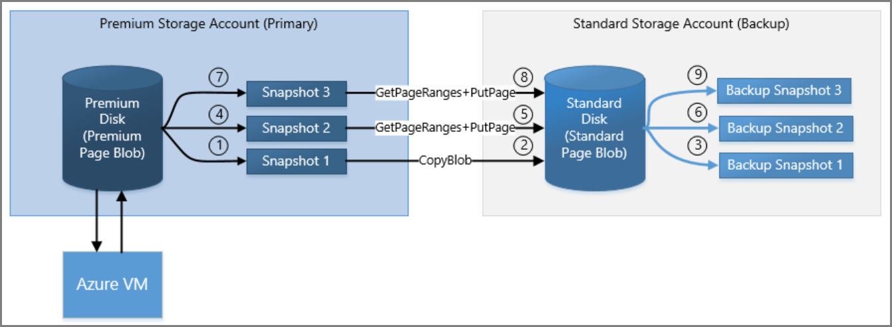
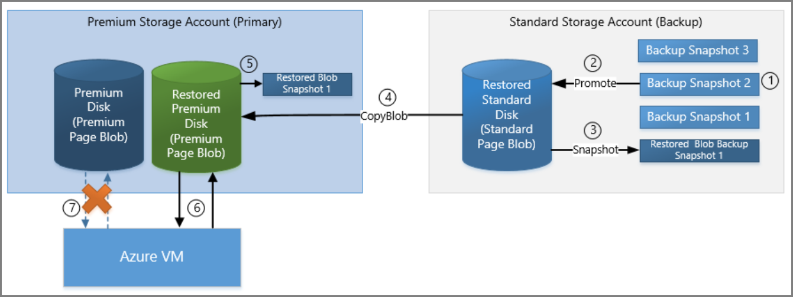

<properties
    pageTitle="Verwenden Sie für die Sicherung und Wiederherstellung der Azure-virtuellen Computern inkrementelle Momentaufnahmen | Microsoft Azure"
    description="Erstellen Sie eine benutzerdefinierte Lösung für die Sicherung und Wiederherstellung Ihrer Azure-virtuellen Computern Festplatten inkrementelle Momentaufnahmen verwenden."
    services="storage"
    documentationCenter="na"
    authors="aungoo-msft"
    manager="tadb"
    editor="tysonn"/>

<tags
    ms.service="storage"
    ms.workload="storage"
    ms.tgt_pltfrm="na"
    ms.devlang="na"
    ms.topic="article"
    ms.date="10/18/2016"
    ms.author="aungoo"/>

# Sichern von Azure-virtuellen Computern Datenträger mit inkrementell Momentaufnahmen

## (Übersicht)

Azure-Speicher bietet die Möglichkeit zum Aufzeichnen von Momentaufnahmen der Blobs. Momentaufnahmen der Blob-Zustand zu diesem Zeitpunkt aufgezeichnet. In diesem Artikel wird erläutert, ein Szenario der wie verwalten Sie Sicherungskopien der virtuellen Computern Datenträger Momentaufnahmen verwenden können. Wenn Sie nicht Azure Sicherung und Wiederherstellung-Dienst verwenden möchten, und eine benutzerdefinierte Sicherung Strategie für Ihre virtuellen Computern Datenträger erstellen möchten, können Sie dieses Verfahren verwenden.

Azure-virtuellen Computern Datenträger werden als Seitenblobs in Azure Storage gespeichert. Da wir Sicherung Strategie für virtuellen Computern Datenträger in diesem Artikel sprechen werden wir Momentaufnahmen im Kontext Seitenblobs beziehen. Weitere Informationen zu Momentaufnahmen finden Sie [eine Momentaufnahme der ein Blob erstellen](https://msdn.microsoft.com/library/azure/hh488361.aspx).

## Was ist eine Momentaufnahme?

Ein Blob Snapshot ist eine schreibgeschützte Version eines Blob, der zu einem bestimmten Zeitpunkt erfasst werden. Nachdem eine Momentaufnahme erstellt wurde, können sie lesen, kopiert, oder gelöscht, jedoch nicht geändert werden. Momentaufnahmen bieten eine Möglichkeit, ein Blob sichern, wie er bei einem Zeitpunkt angezeigt wird. Bis REST Version 2015-04-05 hatten Sie die Möglichkeit, vollständige Momentaufnahmen zu kopieren. Mit den REST Version 2015-07-08 und höher, Sie können auch inkrementelle Momentaufnahmen kopieren.

## Vollständige Momentaufnahme kopieren

Momentaufnahmen können als Blob Sicherungskopien des Basis Blob beibehalten an ein anderes Speicherkonto kopiert werden. Sie können auch eine Momentaufnahme über deren Basis Blob, kopieren, also beispielsweise das Blob auf eine frühere Version wiederherstellen. Wenn Sie eine Momentaufnahme aus einem Speicherkonto in ein anderes kopiert wird, wird es den gleichen Speicherplatz wie die Basis Seitenblob beanspruchen. Daher kopieren gesamte Momentaufnahmen von einem Speicherkonto in ein anderes langsam und viel Speicherplatz auf dem Ziel-Speicher-Konto werden auch nutzen.

>[AZURE.NOTE] Wenn Sie das base Blob an ein anderes Ziel kopieren, werden die Momentaufnahmen des Blob nicht zusammen mit dem kopiert. Auf ähnliche Weise, wenn Sie mit einer Kopie einen Basis Blob überschreiben, Momentaufnahmen der Basis Blob zugeordnet sind hiervon nicht betroffen und unter Name der Basis Blob intakt bleiben.

### Sichern von Momentaufnahmen mit Datenträger

Als Sicherung Strategie für Ihre virtuellen Computern Datenträger können Sie periodisch Momentaufnahmen des Blob Datenträger oder eine Seite, und kopieren Sie sie an ein anderes Speicherkonto mithilfe von Tools wie [Kopieren Blob](https://msdn.microsoft.com/library/azure/dd894037.aspx) -Vorgang oder [AzCopy](storage-use-azcopy.md). Sie können eine Momentaufnahme in einer Ziel Seitenblob mit einem anderen Namen kopieren. Das resultierende Ziel Seitenblob ist ein Seitenblob beschreibbare und keine Momentaufnahme. In diesem Artikel wird Schritte, um Sicherungskopien der Datenträger virtueller Computer, die mithilfe von Momentaufnahmen beschrieben.

### Mithilfe von Momentaufnahmen Datenträger wiederherstellen

Wenn Wiederherstellen Ihrer Festplatte auf eine unveränderliche Vorgängerversion in einem die Sicherung Momentaufnahmen erfasst werden soll, können Sie eine Momentaufnahme über die Basis Seitenblob kopieren. Nachdem der Snapshot zur Basis Seite heraufgestufte ist BLOB-, bleibt die Momentaufnahme, aber die Quelle wird mit einer Kopie, die sowohl lesen und schreiben kann überschrieben. Schritte zum Wiederherstellen einer früheren Version des Datenträgers aus zugehörige Snapshot wird später in diesem Artikel beschrieben.

### Implementieren der vollständigen Momentaufnahme kopieren

Sie können eine Momentaufnahme der vollständige Kopie implementieren, indem Sie wie folgt vorgehen,

-   Zunächst eine Momentaufnahme der Basis Blob mithilfe des Vorgangs [Blob Snapshot](https://msdn.microsoft.com/library/azure/ee691971.aspx) .
-   Kopieren Sie dann den Snapshot mit einem Ziel-Speicher-Konto mithilfe von [Kopieren Blob](https://msdn.microsoft.com/library/azure/dd894037.aspx)ein.
-   Wiederholen Sie diesen Vorgang, um von der Basis Blob Sicherungskopien beibehalten.

## Inkrementell Momentaufnahme kopieren

Das neue Feature in [GetPageRanges](https://msdn.microsoft.com/library/azure/ee691973.aspx) API bietet eine bessere Möglichkeit, um die Momentaufnahmen von Seitenblobs oder Datenträger zu sichern. Die API gibt die Liste der Änderungen zwischen der Basis Blob als auch die Momentaufnahmen. Dies reduziert die Menge des Speicherplatzes für die Sicherungsdatei Konto verwendet. Die API unterstützt Seitenblobs Premium Speicher als auch auf Standard-Speicher. Mit dieser API können Sie jetzt schnellere und effizientere Sicherung Lösungen für Azure-virtuellen Computern erstellen. Dies wird mit der restlichen Version 2015-07-08 verfügbar und höher sein.

Inkrementell Momentaufnahme kopieren können Sie von einem Speicherkonto in ein anderes den Unterschied zwischen kopieren,

-   Basis Blob und deren Momentaufnahme oder
-   Alle zwei Momentaufnahmen der Basis blob

Sofern die folgenden Bedingungen erfüllt sind,

- Das Blob wurde Jan-1-2016 oder höher erstellt.
- Das Blob wurde nicht mit [PutPage](https://msdn.microsoft.com/library/azure/ee691975.aspx) oder [Kopieren Blob](https://msdn.microsoft.com/library/azure/dd894037.aspx) zwischen zwei Momentaufnahmen überschrieben.

**Hinweis**: Diese Funktion steht für Premium und Standard Azure Seitenblobs.

Wenn Ihnen eine benutzerdefinierte Sicherung Strategie, die Verwendung von Momentaufnahmen, kopieren die Momentaufnahmen von einem Speicherkonto in ein anderes kann sehr langsam sein und viel Speicherplatz belegt. Kopieren den gesamten Snapshot mit einem Speicherkonto Sicherung, können Sie den Unterschied zwischen aufeinander folgenden Momentaufnahmen zu einer Seite Sicherung Blob schreiben. Auf diese Weise wird die Zeit, kopieren und Speicherplatz zum Speichern von Sicherungskopien deutlich reduziert werden.

### Implementierung inkrementell Momentaufnahme kopieren

Sie können inkrementell Momentaufnahme kopieren implementieren, indem Sie wie folgt vorgehen,

-   Eine Momentaufnahme der Basis Blob [Snapshot Blob](https://msdn.microsoft.com/library/azure/ee691971.aspx)verwenden.
-   Kopieren Sie den Snapshot in Ziel Sicherung Speicherkonto mithilfe von [Kopieren Blob](https://msdn.microsoft.com/library/azure/dd894037.aspx). Dies wird auf der Seite Sicherung Blob sein. Eine Momentaufnahme der dieser Seite Sicherung Blob und zusätzliche Konto speichern.
-   Die Basis Blob Snapshot Blob mit einem anderen Momentaufnahme.
-   Abrufen des Unterschieds zwischen den ersten und zweiten Momentaufnahmen der Basis Blob [GetPageRanges](https://msdn.microsoft.com/library/azure/ee691973.aspx)verwenden. Verwenden Sie den neuen Parameter **Prevsnapshot** DateTime-Wert der Momentaufnahme angeben des Unterschieds mit erhalten soll. Wenn dieser Parameter vorhanden ist, werden die restlichen Antwort nur die Seiten enthalten, die zwischen Zielmomentaufnahme und vorherigen Momentaufnahme einschließlich löschen Seiten geändert wurden.
-   Verwenden Sie [PutPage](https://msdn.microsoft.com/library/azure/ee691975.aspx) , um diese Änderungen auf der Seite Sicherung Blob angewendet.
-   Schließlich eine Momentaufnahme der Seite Sicherung Blob, und speichern Sie es in die Sicherung Speicher-Konto.

Im nächsten Abschnitt wird ausführlicher erläutert, wie Sie Sicherungskopien der Datenträger über inkrementell Momentaufnahme kopieren verwalten können

## Szenario

In diesem Abschnitt wird ein Szenario beschrieben, die eine benutzerdefinierte Sicherung Strategie für virtuellen Computern Datenträger Momentaufnahmen verwenden müssen.

Erwägen Sie einen DS-Serie Azure-virtuellen eine Premium Speicher P30 Festplatte angeschlossen. Der P30 Datenträger *Mypremiumdisk* aufgerufen wird in einem Premium Speicherkonto namens *Mypremiumaccount*gespeichert. Ein standard Speicherkonto *Mybackupstdaccount* wird zum Speichern der Sicherung von *Mypremiumdisk*verwendet werden. Wir möchten eine Momentaufnahme der *Mypremiumdisk* alle 12 Stunden beibehalten.

Weitere Informationen zum Erstellen von Speicher-Konto und Datenträger, finden Sie [Informationen zum Azure-Speicherkonten](storage-create-storage-account.md).

Weitere Informationen zur Azure-virtuellen Computern sichern, finden Sie unter [Planen Azure virtueller Computer Sicherungskopien](../backup/backup-azure-vms-introduction.md).

## Schritte zum Sicherungen einen Datenträger mithilfe von inkrementell Momentaufnahmen verwalten

Die nachfolgend beschriebenen Schritte werden Momentaufnahmen der *Mypremiumdisk* und verwalten die Sicherungskopien in *Mybackupstdaccount*. Die Sicherung werden einer Standardseite Blob *Mybackupstdpageblob*bezeichnet. Das Seite Sicherung Blob wider immer denselben Zustand wie dem letzten Snapshot der *Mypremiumdisk*.

1.  Erstellen Sie zuerst das Seite Sicherung Blob für Ihren Premium Speicher Datenträger aus. Führen Sie dies möchten, eine Momentaufnahme der *Mypremiumdisk* Namen *mypremiumdisk_ss1*.
2.  Kopieren Sie diesen Snapshot in Mybackupstdaccount als Seitenblob *Mybackupstdpageblob*bezeichnet.
3.  Eine Momentaufnahme der *Mybackupstdpageblob* aufgerufen *mybackupstdpageblob_ss1*, [Blob Snapshot](https://msdn.microsoft.com/library/azure/ee691971.aspx) verwenden und in *Mybackupstdaccount*speichern.
4.  Zeitfensters erstellen Sie eine weitere Momentaufnahme der *Mypremiumdisk*, Angenommen Sie *mypremiumdisk_ss2*und in *Mypremiumaccount*speichern.
5.  Abrufen der inkrementellen Änderungen zwischen den zwei Momentaufnahmen, *mypremiumdisk_ss2* und *mypremiumdisk_ss1*, verwenden [GetPageRanges](https://msdn.microsoft.com/library/azure/ee691973.aspx) auf *mypremiumdisk_ss2* mit **Prevsnapshot** -Parameter auf den Zeitstempel der *mypremiumdisk_ss1*festgelegt. Schreiben Sie auf der Seite Sicherung Blob *Mybackupstdpageblob* in *Mybackupstdaccount*ändert. Wenn in der ändert gelöschten Bereiche vorhanden sind, müssen sie von der Seite Sicherung Blob gelöscht werden. Verwenden Sie [PutPage](https://msdn.microsoft.com/library/azure/ee691975.aspx) , um inkrementell Änderungen auf der Seite Sicherung Blob schreiben.
6.  Eine Momentaufnahme der Seite Sicherung Blob *Mybackupstdpageblob*, *mybackupstdpageblob_ss2*bezeichnet. Löschen der vorherigen Momentaufnahme *mypremiumdisk_ss1* von Premium Speicher-Konto an.
7.  Wiederholen Sie die Schritte 4 bis 6, jede zusätzliche Fenster. Auf diese Weise können Sie Sicherungen *Mypremiumdisk* in einem Konto standardmäßigen Speicher verwalten.

## Schritte zum Wiederherstellen eines Datenträgers von Momentaufnahmen

Die nachfolgend beschriebenen Schritte werden Premium Datenträger, *Mypremiumdisk* eine frühere Momentaufnahme der Sicherungsdatei Speicher Konto *Mybackupstdaccount*wiederherstellen.

1.  Identifizieren Sie den Punkt in Mal, wenn Sie den Datenträger Premium zum wiederherstellen möchten. Angenommen, das Snapshot *mybackupstdpageblob_ss2*, ist das in der Sicherungsdatei Speicher Konto *Mybackupstdaccount*gespeichert ist.
2.  Stufen Sie die Momentaufnahme *mybackupstdpageblob_ss2* in Mybackupstdaccount als neue Seite für die Sicherung Basis Blob- *Mybackupstdpageblobrestored*.
3.  Eine Momentaufnahme der dieser Seite des wiederhergestellten Sicherung Blob, *mybackupstdpageblobrestored_ss1*aufgerufen.
4.  Kopieren Sie die Seite wiederhergestellten Blob *Mybackupstdpageblobrestored* aus *Mybackupstdaccount* in *Mypremiumaccount* als neue Premium Datenträger *Mypremiumdiskrestored*ein.
5.  Eine Momentaufnahme der *Mypremiumdiskrestored*, *mypremiumdiskrestored_ss1* zukünftigen inkrementell Sicherungskopien bezeichnet.
6.  Punkt DS Serie virtueller Computer auf die wiederhergestellte *Mypremiumdiskrestored* Datenträger und trennen die alte *Mypremiumdisk* aus dem virtuellen Computer.
7.  Beginnen Sie die Sicherung im vorherigen Abschnitt für den wiederhergestellten Datenträger *Mypremiumdiskrestored*, verwenden die *Mybackupstdpageblobrestored* als die Seite Sicherung Blob beschrieben.

## Nächste Schritte

Weitere Informationen zum Erstellen von Momentaufnahmen eines Blob und Planen Ihrer Sicherung virtueller Computer-Infrastruktur mit den nachstehenden Links.

- [Erstellen eine Momentaufnahme der ein Blob](https://msdn.microsoft.com/library/azure/hh488361.aspx)
- [Planen Sie Ihrer Sicherung virtueller Computer-Infrastruktur](../backup/backup-azure-vms-introduction.md)
