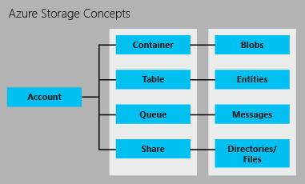

<properties
    pageTitle="Einführung in Speicher | Microsoft Azure"
    description="Eine Übersicht über Azure-Speicher von Microsoft online-Daten von Speicher in der Cloud. Erfahren Sie, wie die beste verfügbare Cloud-Speicher-Lösung in Ihrer Anwendung verwenden."
    services="storage"
    documentationCenter=""
    authors="tamram"
    manager="carmonm"
    editor="tysonn"/>

<tags
    ms.service="storage"
    ms.workload="storage"
    ms.tgt_pltfrm="na"
    ms.devlang="na"
    ms.topic="get-started-article"
    ms.date="10/25/2016"
    ms.author="tamram"/>

# Einführung in Microsoft Azure-Speicher

## (Übersicht)

Azure-Speicher ist die Cloud-Speicher-Lösung für moderne, die auf die Zuverlässigkeit, Verfügbarkeit und Skalierbarkeit auf die Bedürfnisse seiner Kunden aufsetzen. Lesen Sie diesen Artikel, Entwickler, IT-Experten und geschäftliche Entscheidung können Entscheidungsträger zu erfahren:

- Was Azure-Speicher ist und wie Sie nutzen, in der Cloud, mobile und Server-desktopanwendungen nutzen können
- Welche Arten von Daten mit den Diensten Azure Storage gespeichert werden können: BLOB-Daten (Objekt), NoSQL Tabellendaten, Warteschlangennachrichten und Dateifreigaben.
- Wie wird Zugriff auf Ihre Daten im Speicher Azure verwaltet.
- Wie Ihre Daten Azure-Speicher erfolgt über Redundanz- und Replikationsoptionen dauerhaften
- Wechseln Sie als Nächstes zum Erstellen Ihrer ersten Azure-Speicher-Anwendungs, wo

Einstieg und die Verwendung mit Azure-Speicher schnell können, finden Sie unter [Erste Schritte mit Azure-Speicher in fünf Minuten](storage-getting-started-guide.md).

Klicken Sie auf Extras, Bibliotheken und anderen Ressourcen für die Arbeit mit Azure-Speicher Details finden Sie unten aufgeführten [Nächsten Schritten fort](#next-steps) .

## Was ist der Azure-Speicher?

Cloud-computing ermöglicht neue Szenarien für Applikationen mit Anforderung der skalierbare, robuste und hoch verfügbaren Speicherplatz für ihre Daten – warum Microsoft Azure-Speicher entwickelt genau das erfolgt. Zusätzlich lässt sich für Entwickler umfangreiche Clientanwendungen zur Unterstützung von neuer Szenarien erstellen, bietet Azure-Speicher die Speicher als Grundlage auch für Azure-Computer, ein weiterer Beweis für Stabilität.

Azure-Speicher ist hochgradig skalierbar, daher Sie speichern können und Verfahren zum Hunderte TB Daten zur Unterstützung der Szenarien big Data wissenschaftlichen, finanzielle Analyse und Medien Applikationen erforderlich. Oder Sie können die geringe Mengen von Daten, die für eine Website für kleine Unternehmen erforderlich speichern. Wo liegen Ihren Anforderungen, Zahlen Sie nur für die Daten, die Sie gespeichert ist. Azure-Speicher derzeit Dutzende Billionen eindeutige Kunden-Objekte speichert und Millionen von Abfragen pro Sekunde Durchschnitt behandelt.

Azure-Speicher ist flexible, daher können Sie Entwerfen von Applications für ein großes Publikum, globale und diese Applikationen Bedarf skalieren - sowohl in Bezug auf die Menge der gespeicherten Daten und die Anzahl der Anfragen davor vorgenommen. Sie Zahlen nur für was Sie verwenden, und nur, wenn Sie dazu verwendet wird.

Azure-Speicher verwendet eine automatische Partitionierung System, die automatisch laden-Daten basierend auf den Datenverkehr Salden. Dies bedeutet, dass Azure-Speicher als die Belastung Ihrer Anwendung vergrößern, automatisch die geeigneten Ressourcen, um sie erfüllen reserviert.

Azure-Speicher zugegriffen werden aus an einer beliebigen Stelle in der Welt, von einem beliebigen Typ der Anwendung, ob es in der Cloud, auf dem Desktop, klicken Sie auf einem lokalen Server oder auf einem Mobilgerät ausgeführt wird oder einem Tablet-PC-Gerät. Sie können Azure-Speicher in mobilen Szenarien verwenden, wo die Anwendung speichert eine Teilmenge der Daten auf dem Gerät, und es mit einem vollständigen Satz von Daten in der Cloud gespeichert wird.

Azure-Speicher unterstützt Clients, die eine Reihe von Betriebssystemen (einschließlich Windows und Linux) und einer Vielzahl von Sprachen (einschließlich .NET, Java, Node.js, Python, Ruby, PHP und C++ und mobile programming Sprachen) für die bequeme Entwicklung verwenden. Azure-Speicher stellt Datenressourcen über einfache REST-APIs, die an alle senden und Empfangen von Daten über das HTTP-/HTTPS-Client zur Verfügung stehen auch zur Verfügung.

Azure Premium-Speicher bietet leistungsfähige und niedrig Wartezeiten Datenträger Unterstützung für e/a-stark Auslastung auf Azure virtuellen Computern ausgeführt. Mit Azure Premium Speicher können Sie mehrere permanente Daten Datenträger eines virtuellen Computers Anfügen und konfigurieren Sie sie, um die Leistung zu erfüllen. Jeder Datenträger Daten wird durch einen Datenträger SSD in Azure Premium Speicher für optimale Leistung von e/a-unterstützt. Finden Sie unter [Premium Speicher: leistungsstarke Storage für Azure-virtuellen Computern Auslastung](storage-premium-storage.md) für weitere Details.

## Einführung in die Dienste Azure-Speicher

Azure-Speicher bietet die folgenden vier Dienste: BLOB-Speicher, Tabellenspeicher, Warteschlange-Speicher und Dateispeicher.

- BLOB-Speicher speichert Daten unstrukturierten Objekts. Ein Blob kann jede Art von Text oder binäre Daten, beispielsweise ein Dokument, Media-Datei oder das Anwendungsinstallationsprogramm sein. BLOB-Speicher wird auch als Objektspeicher bezeichnet.
- Tabellenspeicher speichert strukturierten Datasets. Tabellenspeicher ist ein NoSQL Key-Attribut Datenspeicher, schnelle Entwicklung und schnellen Zugriff auf große Datenmengen ermöglicht.
- Warteschlangenspeicher bietet zuverlässigen messaging für Workflow Verarbeitung und für die Kommunikation zwischen Komponenten des Cloud-Dienste.
- Dateispeicher bietet freigegebene Speicher für legacy Applikationen mit dem standardmäßigen SMB-Protokoll. Azure-virtuellen Computern und Cloud Services können Daten über die Anwendungskomponenten über bereitgestellten Freigaben freizugeben und zu lokalen Applikationen Dateidaten in einer Freigabe über den Datei-Dienst REST-API zugreifen können.

Ein Konto Azure-Speicher ist eine sichere, die Sie auf Dienste in Azure-Speicher zugreifen können. Ihr Speicherkonto stellt den eindeutigen Namespace für Ihre Speicherressourcen. Die nachstehende Abbildung zeigt die Beziehungen zwischen den Azure-Speicher-Ressourcen in einem Speicherkonto an:

[AZURE.INCLUDE [storage-account-types-include](../../includes/storage-account-types-include.md)]

[AZURE.INCLUDE [storage-versions-include](../../includes/storage-versions-include.md)]

## BLOB-Speicher

Für Benutzer mit großen Mengen von unstrukturierten Objektdaten in der Cloud gespeichert bietet Blob-Speicher eine kostengünstigere und skalierbare Lösung. Blob-Speicher können, um wie Inhalte zu speichern:

- Dokumente
- Für soziale Netzwerke Daten wie Fotos, Videos, Musik und blogs
- Sicherungskopien von Dateien, Datenbanken, Computern und Geräten
- Bilder und Texte für Webanwendungen
- Von Konfigurationsdaten für Applikationen cloud
- Große Daten wie Protokolle und andere große Datensätze

Jeder Blob sind in einem Container. Container stellen auch eine effiziente Möglichkeit, Gruppen von Objekten Sicherheitsrichtlinien zuweisen. Ein Speicherkonto kann beliebig viele Container enthalten, und ein Containers kann beliebig viele Blobs, bis zu 500 TB Kapazität Limit Speicher-Konto enthalten.  

BLOB-Speicher bietet drei Arten von Blobs, blockieren Blobs, Anfügen Blobs und Seitenblobs (Datenträger).

- Blockieren Blobs sind für das streaming und Speichern von Objekten Cloud optimiert und sind eine gute Wahl zum Speichern von Dokumenten, Mediendateien, Sicherungskopien usw..
- Anfügen von Blobs blockieren Blobs ähneln, jedoch sind optimiert für Vorgänge anfügen. Ein Blob anfügen kann nur durch Hinzufügen eines neuen Blocks am Ende aktualisiert werden. Anfügen von Blobs sind eine gute Wahl für Szenarien wie Protokollierung, in denen neue Daten nur an das Ende der Blob geschrieben werden müssen.
- Seitenblobs sind für die Darstellung von IaaS Datenträger optimiert und unterstützende zufällige schreibt und kann bis zu 1 TB groß sein. Ein Azure-virtuellen Computernetzwerk angefügt IaaS Datenträger eine virtuelle Festplatte als Seitenblob gespeichert ist.

Für sehr großen Datasets Netzwerk Einschränkungen hochladen oder Herunterladen von Daten zu Blob-Speicher über das Kabel unrealistischen wo zu nutzen, können Sie eine Festplatte an Microsoft zu importieren oder Exportieren von Daten direkt aus der Data Center weitergeben. Lesen Sie [verwenden den Microsoft Azure Import/Export-Dienst zur Datenübertragung BLOB-Speicher](storage-import-export-service.md).

## Tabellenspeicher

Moderne Applikationen verlangen häufig Datenspeicher mit breiter skalierbar und Flexibilität als früherer Versionen von Software erforderlich. Tabellenspeicher bietet hoch verfügbare und hochgradig skalierbar Speicher, damit eine Anwendung automatisch skaliert werden kann, um den Benutzer bei Bedarf entsprechen. Tabellenspeicher ist Microsoft NoSQL Key-Attribut Store – es hat einen schemaless Entwurf, wodurch es herkömmlichen relationalen Datenbanken abweicht. Mit einer schemaless Datenspeicher ganz einfach Daten als den Anforderungen Ihrer Anwendung Evolve anzupassen. Tabellenspeicher ist einfach zu verwenden, sodass Entwickler Applikationen schnell erstellen können. Zugriff auf Daten ist schneller und kostengünstiger für alle Arten von Applications.  Tabellenspeicher ist in der Regel in Kosten erheblich niedriger als herkömmliche SQL für ähnliche Datenmengen.

Tabellenspeicher ist ein Key-Attribut Store, was bedeutet, dass jeder Wert in einer Tabelle mit einer eingegebenen Eigenschaftsname gespeichert ist. Der Name der Eigenschaft kann zum Filtern und Angeben von Kriterien für die Auswahl verwendet werden. Eine Auflistung von Eigenschaften und deren Werte bestehen aus einer Entität. Da Table Storage schemaless ist, in der gleichen Tabelle zwei Personen können verschiedene Sammlungen von Eigenschaften enthalten, und diese Eigenschaften können verschiedene Typen sein.

Table Storage können zum Speichern von flexible Datasets, z. B. Benutzerdaten für Webanwendungen, Adressbücher, Geräteinformationen und eine andere Art von Metadaten, die der Dienst erforderlich sind.  Sie können eine beliebige Anzahl von Elementen in einer Tabelle speichern, und ein Speicherkonto möglicherweise eine beliebige Anzahl von Tabellen nach Zeitphasen bis zum Limit Kapazität Speicher-Konto enthalten.

Entwickler können wie Blobs und Warteschlangen, verwalten und access-Tabelle mit standard REST Speicher Protokolle, jedoch Tabellenspeicher auch eine Teilmenge der das OData-Protokoll unterstützt Vereinfachung erweiterte Abfragen von Funktionen und Aktivieren von sowohl JSON und AtomPub (XML-basierten) Formate.

Für heutige internetbasierten Applikationen bieten NoSQL-Datenbanken wie Tabellenspeicher eine beliebte Alternative zum herkömmlichen relationalen Datenbanken.

## Warteschlangenspeicher

Beim Entwerfen für die Skalierung Applications aus, sind Anwendungskomponenten häufig abgekoppelt, damit diese unabhängig voneinander zu skalieren können. Warteschlangenspeicher bietet eine zuverlässige messaging-Lösung für die asynchrone Kommunikation zwischen Komponenten einer Anwendung, ob sie in der Cloud, auf dem Desktop, klicken Sie auf einem lokalen Server oder auf einem mobilen Gerät ausgeführt werden. Warteschlangenspeicher unterstützt auch asynchrone Aufgaben verwalten und Prozess-Workflows erstellen.

Ein Speicherkonto kann beliebig viele Warteschlangen enthalten. Eine Warteschlange kann beliebig viele Nachrichten nach Zeitphasen bis zum Limit Kapazität Speicher-Konto enthalten. Einzelne Nachrichten möglicherweise bis zu 64 KB sein.

## Speichern von Daten

Azure Dateispeicher bietet cloudbasierten SMB Dateifreigaben, sodass legacy Applikationen migriert werden können, die auf Dateifreigaben, um Azure schnell und ohne teure schreibt aufsetzen. Mit dem Azure-Dateispeicher können Applications in Azure-virtuellen Computern oder Cloud Services ausgeführt in der Cloud, eine Dateifreigabe bereitstellen, ebenso wie eine desktop-Anwendung stellt eine typische SMB-Freigabe bereit. Eine beliebige Anzahl der Anwendungskomponenten kann dann bereitstellen und gleichzeitig Zugriff auf die Dateifreigabe-Speicher.

Da eine Dateifreigabe-Speicher einer standard SMB Dateifreigabe ist, können in Azure ausgeführt Applications Daten in die Freigabe über das Dateisystem I/O APIs zugreifen. Entwickler können daher ihrer vorhandenen Code und Fähigkeiten zu vorhandene Applikationen migrieren nutzen. IT-Experten können PowerShell-Cmdlets zum Erstellen, bereitstellen und Verwalten von Speicher Dateifreigaben als Teil der Verwaltung von Applications Azure verwenden.

Wie die anderen Azure-Speicherdienste macht Dateispeicher ein REST-API für den Zugriff auf Daten in einer freigeben. Lokal Applikationen können die Dateispeicher REST-API Zugriff auf Daten in einer Dateifreigabe aufrufen. Auf diese Weise kann einem vom Unternehmen manchen älteren Programmen zu Azure migrieren und andere Personen im Unternehmen ausführen auswählen. Beachten Sie, dass eine Dateifreigabe bereitstellen nur möglich für Applikationen in Azure ausgeführt wird. eine lokale Anwendung kann nur die Dateifreigabe über die REST-API zugreifen.

Verteilte Applikationen können auch Dateispeicher zum Speichern und Freigeben von Daten nützliche Anwendung und Entwicklung und Test-Tools verwenden. Angenommen, eine Anwendung möglicherweise Konfigurationsdateien speichern und diagnostische Daten wie Protokolle, Kennzahlen und Absturz sichert in einer Datei Speicherplatz freigeben, damit sie mit mehreren virtuellen Computern oder Rollen verfügbar sind. Entwickler und Administratoren können Dienstprogramme, die sie benötigen, erstellen oder verwalten die Anwendung in einer Dateifreigabe für den Speicher, die alle Komponenten zur Verfügung steht gespeichert und nicht installieren sie auf jeder virtuellen Computern oder eine Instanz der Rolle.

## Zugriff auf Blob, Tabelle, Warteschlange und Dateiressourcen

Standardmäßig kann nur der Speicher Kontobesitzer Ressourcen im Speicherkonto zugreifen. Für die Sicherheit Ihrer Daten muss jeder Anforderung für Ressourcen in Ihr Konto authentifiziert werden. Authentifizierung basiert auf ein Modell Schlüssel freigegeben. BLOBs können auch für die Unterstützung von anonyme Authentifizierung konfiguriert werden.

Ihr Speicherkonto wird zwei private Tastenkombinationen bei der Erstellung zugewiesen, die für die Authentifizierung verwendet werden. Gibt es zwei Tasten: Damit ist sichergestellt, dass eine Anwendung verfügbar bleiben, wenn Sie die Tasten regelmäßig als Sicherheit Key-Verwaltung üblich neu generieren.

Wenn Sie benötigen, wie Benutzer dürfen gesteuert Zugriff auf Ihre Speicherressourcen und dann können Sie eine Signatur gemeinsamen Zugriff erstellen. Eine Signatur freigegebenen Access (SAS) ist ein Token, das auf einer URL angehängt werden kann, die delegierten Zugriff auf eine Speicherressource ermöglicht. Jede Person, die das Token verfügt, kann die Ressource zugreifen, die sie auf mit den Berechtigungen, die es gibt an, die zeigt, für den Zeitraum dieser It gültig ist. Ab Version 2015-04-05 Azure-Speicher unterstützt zwei Arten von freigegebenen Access Signaturen: service SAS und SAS zu berücksichtigen.

Der Dienst SAS delegiert Zugriff auf eine Ressource in nur einem der Speicherdienste: der Dienst Blob, Warteschlange, Tabelle oder Datei.

Ein Konto SAS delegiert Zugriff auf Ressourcen in einem oder mehreren der Speicherdienste. Sie können Zugriff auf Servicelevel Vorgänge delegieren, die nicht mit einem Dienst SAS verfügbar sind. Sie können auch Zugriffsrechte für Stellvertretung zum Lesen, schreiben und Löschvorgängen auf Blob-Container, Tabellen, Warteschlangen und Dateifreigaben, die mit einem Dienst SAS nicht zulässig sind.

Schließlich können Sie angeben, dass ein Container und deren Blobs oder ein bestimmtes BLOB-öffentlich zugänglicher sind. Wenn Sie angeben, dass ein Container oder Blob öffentlich ist, kann jeder anonym gelesen werden. Es ist keine Authentifizierung erforderlich.  Öffentliche Container und Blobs sind nützlich für die Bereitstellung von Ressourcen wie Medien und Dokumente, die auf Websites gehostet werden.  Zum Netzwerkwartezeit für eine globale Zielgruppe zu verringern, können Sie von Websites mit dem Azure CDN verwendete Blob-Daten zwischenspeichern.

Weitere Informationen zum gemeinsamen Zugriff Signaturen finden Sie unter [Verwenden von freigegebenen Access Signaturen (SAS)](storage-dotnet-shared-access-signature-part-1.md) . Weitere Informationen zum sicheren Zugriff auf Ihr Speicherkonto finden Sie unter [Verwalten anonyme Lesezugriff Containern und Blobs](storage-manage-access-to-resources.md) und [Authentifizierung für den Azure-Speicher-Dienste](https://msdn.microsoft.com/library/azure/dd179428.aspx) .

## Replikation für Zuverlässigkeit und hohe Verfügbarkeit

Die Daten in Ihrem Microsoft Azure-Speicher-Konto ist immer repliziert, um Zuverlässigkeit und hohe Verfügbarkeit sicherzustellen. Replikation wird in der Mitte der gleichen Daten oder zu einem zweiten Data Center, je nachdem, welche Replikationsoption wählen Sie Ihre Daten kopiert. Die Replikation sind Ihre Daten geschützt und behält Anwendung nach-oben-Zeit im Falle einer vorübergehenden Hardware-Fehlern. Wenn Ihre Daten auf einem zweiten Data Center repliziert werden, schützen, die auch über die Daten vor einem schwerwiegenden Fehler in der gewohnten Standort befinden.

Die Replikation stellt sicher, dass Ihr Speicherkonto [Servicelevel Vertrag SERVICELEVEL für Speicher](https://azure.microsoft.com/support/legal/sla/storage/) auch unter Fehlern entspricht. Lesen Sie der Vereinbarung zum SERVICELEVEL Informationen zum Azure-Speicher für Zuverlässigkeit und Verfügbarkeit garantiert. 

Wenn Sie ein Speicherkonto erstellen, können Sie eine der folgenden Optionen für die Replikation auswählen:  

- **Lokal redundante Speicher (LRS).** Lokal redundante Speicherung unterhält drei Kopien Ihrer Daten. LRS wird dreimal in einem einzelnen Data Center im Bereich mit einem einzelnen repliziert. LRS Datenschutz Ihrer normalen Hardware-Fehler, jedoch nicht von der Fehler von einem einzelnen Data Center.  

    Mit einem Rabatt wird LRS angeboten. Für maximale Zuverlässigkeit empfehlen wir, dass Sie Geo redundante Speicher, die nachfolgend beschriebenen verwenden.

- **Zone redundante Speicher (ZRS).** Zone redundante Speicherung unterhält drei Kopien Ihrer Daten. ZRS wird dreimal über zwei oder drei Fertigungsanlagen, in einem einzigen Bereich oder über zwei Bereiche repliziert höhere Zuverlässigkeit als LRS bereitstellen. ZRS stellt sicher, dass Ihre Daten in einem einzigen Bereich dauerhaften.  

    ZRS bietet eine höhere Zuverlässigkeit als LRS; für maximale Zuverlässigkeit empfehlen wir jedoch die Verwendung von Geo redundante Speicher, die nachfolgend beschriebenen.  

    > [AZURE.NOTE] ZRS ist nur für blockieren Blobs derzeit verfügbar und steht nur für Versionen 2014-02-14 und höher unterstützt.
    >
    > Sobald Sie Ihr Speicherkonto erstellt und ZRS ausgewählt haben, können nicht konvertiert es in einen anderen Typ von Replikation verwenden oder umgekehrt.

- **Geo redundante Speicher (GRS)**. GRS unterhält sechs Kopien Ihrer Daten. Mit GRS Ihre Daten werden dreimal innerhalb der primären Region repliziert und dreimal werden auch in einer sekundären Region Hunderte von Meilen von der primären Region, Bereitstellen von der höchsten Ebene Zuverlässigkeit repliziert. Bei einem Fehler bei der primären Region erfolgt Azure-Speicher ein Failover auf der Sekundärachse Region. GRS wird sichergestellt, dass die Daten in zwei getrennten Regionen dauerhaften ist.

    Informationen zu primären und sekundären Kombinationen nach Region finden Sie unter [Azure Regionen](https://azure.microsoft.com/regions/).

- **Lesezugriff Geo redundante Speicher (RAS-GRS)**. Lesezugriff Geo redundante Speicher repliziert Ihrer Daten in einer sekundären geographischen Standort und stellt auch Lesezugriff auf Ihre Daten in der zweiten Standort. Lesezugriff Geo redundante Speicher können Sie Ihre Daten zugreifen, entweder zur primären oder sekundären Standort, den Fall, dass ein Speicherort nicht mehr verfügbar ist. Lesezugriff Geo redundante Speicher ist die Standardoption für Ihr Speicherkonto standardmäßig beim Erstellen. 

    > [AZURE.IMPORTANT] Sie können ändern, wie Ihre Daten repliziert werden, nachdem Ihr Speicherkonto erstellt wurde, es sei denn, Sie beim Erstellen des Kontos ZRS angegeben haben. Beachten Sie aber, dass Sie eine zusätzliche einmalige Datenübertragung Kosten, wenn Sie von LRS in GRS oder RAS-GRS wechseln anfallen können.

Weitere Details zu den Optionen für die Replikation finden Sie unter [Replikation Azure-Speicher](storage-redundancy.md) .

Preisinformationen für Speicher-Kontoreplikation, finden Sie unter [Azure Speicher Preise](https://azure.microsoft.com/pricing/details/storage/). Auf welche Dienste in jeder Region verfügbar sind weitere Informationen finden Sie unter [Azure Regionen](https://azure.microsoft.com/regions/#services) .

Architektur Details Zuverlässigkeit mit Azure-Speicher finden Sie unter [SOSP Papier - Azure-Speicher: A hochgradig verfügbar Cloud-Speicherdienst mit starken Konsistenz](http://blogs.msdn.com/b/windowsazurestorage/archive/2011/11/20/windows-azure-storage-a-highly-available-cloud-storage-service-with-strong-consistency.aspx).

## Übertragen von Daten an und von Azure-Speicher

Das Befehlszeilendienstprogramm AzCopy können BLOB-Datei und Tabellendaten in Ihr Speicherkonto oder mehreren Speicherkonten kopieren. Weitere Informationen finden Sie unter [Übertragen von Daten mit den AzCopy Befehlszeilenprogramm](storage-use-azcopy.md) .

AzCopy ist auf der [Azure-Daten Bewegung Bibliothek](https://www.nuget.org/packages/Microsoft.Azure.Storage.DataMovement/)aufgebaut der derzeit in der Vorschau verfügbar ist.

Der Azure Import/Export-Dienst bietet eine Möglichkeit zum BLOB-Daten in importieren oder Exportieren von BLOB-Daten aus Ihrem Speicherkonto über einem Festplattenlaufwerk Azure Data Center gesendet. Weitere Informationen zu den Import/Export-Dienst finden Sie unter [Verwenden der Microsoft Azure Import/Export-Dienst Daten in Blob-Speicher übertragen werden](storage-import-export-service.md).

## Preise

[AZURE.INCLUDE [storage-account-billing-include](../../includes/storage-account-billing-include.md)]

## Speicher-APIs, Bibliotheken und Tools

Durch eine andere Sprache, die HTTP-/HTTPS-Anfragen vorgenommen werden können, kann Azure Speicherressourcen zugegriffen werden. Darüber hinaus bietet Azure-Speicher programming Bibliotheken für verschiedene gängige Sprachen. Diese Bibliotheken vereinfachen viele Aspekte der Arbeit mit Azure-Speicher durch Behandeln von Details, z. B. synchrones und asynchrones aufrufen, Vorgänge, Verwaltung von Ausnahmen, automatische Wiederholungsversuche, Betrieb Verhalten usw. Batchverarbeitung. Bibliotheken sind für die folgenden Sprachen und Plattformen, für andere Personen in der Verkaufspipeline derzeit verfügbar:

### Datendienste Azure-Speicher

- [Storage Services REST-API](http://msdn.microsoft.com/library/azure/dd179355.aspx)
- [Speicher-Client-Bibliothek für .NET, Windows Phone und Windows-Runtime](https://www.nuget.org/packages/WindowsAzure.Storage/)
- [Speicher-Client-Bibliothek für C++](https://github.com/Azure/azure-storage-cpp)
- [Client-Bibliothek für Java/Android-Speicher](/develop/java/)
- [Client-Bibliothek für Node.js Speicher](http://dl.windowsazure.com/nodestoragedocs/index.html)
- [Speicher-Client-Bibliothek für PHP](/develop/php/)
- [Client-Bibliothek für Ruby Speicher](/develop/ruby/)
- [Client-Bibliothek für Python Speicher](/develop/python/)
- [Speicher-Cmdlets für PowerShell 1.0](https://msdn.microsoft.com/library/azure/mt269418.aspx)

### Azure-Speicher Management Services

- [Speicher Ressource Anbieter REST-API-Referenz](https://msdn.microsoft.com/library/azure/mt163683.aspx)
- [Speicher Anbieter Client Ressourcenbibliothek für .NET](https://msdn.microsoft.com/library/azure/mt131037.aspx)
- [Speicher Ressource Anbieter-Cmdlets für PowerShell 1.0](https://msdn.microsoft.com/library/azure/mt607151.aspx)
- [Speicher Service Management REST-API (klassisch)](https://msdn.microsoft.com/library/azure/ee460790.aspx)

### Azure-Speicher Bewegung Datendienste

- [Speicher Import/Export-Dienst REST-API](https://msdn.microsoft.com/library/azure/dn529096.aspx)
- [Speicher Daten Bewegung Clientbibliothek für .NET](https://www.nuget.org/packages/Microsoft.Azure.Storage.DataMovement/)

### Tools und Dienstprogramme

- [Azure-Speicher-Explorer](http://go.microsoft.com/fwlink/?LinkID=822673&clcid=0x409)
- [Clienttools Azure-Speicher](storage-explorers.md)
- [Azure SDKs und Tools](https://azure.microsoft.com/tools/)
- [Azure Speicheremulator](http://www.microsoft.com/download/details.aspx?id=43709)
- [Azure PowerShell](../powershell-install-configure.md)
- [Befehlszeile AzCopy-Programm](http://aka.ms/downloadazcopy)

## Nächste Schritte

Untersuchen Sie diese Ressourcen, um weitere Informationen zur Azure-Speicher:

### Dokumentation

- [Dokumentation Azure-Speicher](https://azure.microsoft.com/documentation/services/storage/)

### Für Administratoren

- [Verwenden von Azure PowerShell mit Azure-Speicher](storage-powershell-guide-full.md)
- [Verwenden von Azure CLI mit Azure-Speicher](storage-azure-cli.md)

### Für .NET Entwickler

- [Erste Schritte mit Azure Blob-Speicher mit .NET](storage-dotnet-how-to-use-blobs.md)
- [Erste Schritte mit Azure Tabellenspeicher mit .NET](storage-dotnet-how-to-use-tables.md)
- [Erste Schritte mit Azure Warteschlange-Speicher mit .NET](storage-dotnet-how-to-use-queues.md)
- [Erste Schritte mit auf Windows Azure-Datei-Speicher](storage-dotnet-how-to-use-files.md)

### Für Entwickler Java/Android

- [So verwenden Sie BLOB-Speicher von Java](storage-java-how-to-use-blob-storage.md)
- [Zum Verwenden von Java Tabellenspeicher](storage-java-how-to-use-table-storage.md)
- [So verwenden Sie Warteschlange-Speicher von Java](storage-java-how-to-use-queue-storage.md)
- [So verwenden Sie Dateispeicher von Java](storage-java-how-to-use-file-storage.md)

### Für Entwickler Node.js

- [So verwenden Sie BLOB-Speicher von Node.js](storage-nodejs-how-to-use-blob-storage.md)
- [Zum Verwenden von Node.js Tabellenspeicher](storage-nodejs-how-to-use-table-storage.md)
- [So Warteschlange-Speicher von Node.js verwenden](storage-nodejs-how-to-use-queues.md)

### Für Entwickler von PHP

- [So verwenden Sie BLOB-Speicher von PHP](storage-php-how-to-use-blobs.md)
- [Zum Verwenden von PHP Tabellenspeicher](storage-php-how-to-use-table-storage.md)
- [So verwenden Sie Warteschlange-Speicher von PHP](storage-php-how-to-use-queues.md)

### Für Entwickler Ruby

- [Zum Verwenden von Ruby Blob-Speicher](storage-ruby-how-to-use-blob-storage.md)
- [Zum Verwenden von Ruby Tabellenspeicher](storage-ruby-how-to-use-table-storage.md)
- [Wie Warteschlange-Speicher von Ruby verwendet.](storage-ruby-how-to-use-queue-storage.md)

### Für Entwickler Python

- [So verwenden Sie BLOB-Speicher von Python](storage-python-how-to-use-blob-storage.md)
- [So verwenden Sie Tabellenspeicher aus Python](storage-python-how-to-use-table-storage.md)
- [So Warteschlange-Speicher von Python verwenden](storage-python-how-to-use-queue-storage.md)
- [So verwenden Sie Dateispeicher aus Python](storage-python-how-to-use-file-storage.md)
