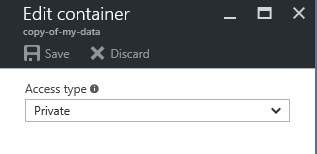

<properties
    pageTitle="Verwalten von anonymen Lesezugriff auf Container und Blobs | Microsoft Azure"
    description="Erfahren Sie, wie Container und Blobs anonymer Zugriff zur Verfügung stellen und wie Sie diese programmgesteuert zugreifen."
    services="storage"
    documentationCenter=""
    authors="tamram"
    manager="carmonm"
    editor="tysonn"/>

<tags
    ms.service="storage"
    ms.workload="storage"
    ms.tgt_pltfrm="na"
    ms.devlang="na"
    ms.topic="article"
    ms.date="10/18/2016"
    ms.author="tamram"/>

# Verwalten von anonymen Lesezugriff auf Container und blobs

## (Übersicht)

Standardmäßig kann nur der Besitzer des Speicherkontos Speicherressourcen innerhalb dieses Konto zugreifen. Für BLOB-Speicher können Sie Berechtigungen eines Containers, um zuzulassen, dass anonyme Lesezugriff auf den Container und deren Blobs, festlegen, dass Sie Zugriff auf diese Ressourcen gewähren können, ohne die Freigabe von Ihren kontoschlüssel.

Anonymer Zugriff empfiehlt sich für Szenarien, die bestimmte Blobs immer für anonyme Lesezugriff verfügbar sein soll. Für genauer gesteuert können Sie eine Signatur gemeinsamen Zugriff erstellen, die womit Sie über ein angegebenes Zeitintervall und Zugriffsrechte für Stellvertretung beschränkt, die andere Berechtigungen verwenden können. Weitere Informationen zum Erstellen von freigegebenen Access-Signaturen finden Sie unter [Verwenden von freigegebenen Access Signaturen (SAS)](storage-dotnet-shared-access-signature-part-1.md).

## Erteilen von Berechtigungen anonyme Benutzer, Container und blobs

Standardmäßig können nur von der Besitzer des Speicherkontos eines Containers und alle Blobs darin zugegriffen werden. Anonyme Benutzer Leseberechtigungen für einen Container und deren Blobs zu verleihen, können Sie die Container Berechtigungen zum Zulassen öffentlichen Zugriffs festlegen. Anonyme Benutzer können Blobs innerhalb eines Containers öffentlich zugängliche ohne Authentifizierung der Anforderung gelesen.

Container bieten die folgenden Optionen für die Verwaltung von Container zugreifen:

- **Vollständige öffentlichen Lesezugriff:** Container und Blob-Daten können über anonyme Anforderung gelesen werden. Clients können Blobs innerhalb des Containers über anonyme Anforderung auflisten, aber Sie können nicht aufgelistet werden Container innerhalb des Speicherkontos.

- **Öffentlichen Lesezugriff für Blobs nur:** BLOB-Daten in diesem Container können über anonyme Anforderung gelesen werden, aber Daten Container sind nicht verfügbar. Clients können nicht innerhalb des Containers über anonyme Anforderung Blobs aufgelistet werden.

- **Keine öffentliche Lesezugriff:** Container und Blob-Daten können vom Kontobesitzer nur gelesen werden.

Sie können auf folgende Weise Container Berechtigungen festlegen:

- Aus dem [Azure-Portal](https://portal.azure.com).
- Programmgesteuert durch die Verwendung der Speicher-Client-Bibliothek oder die REST-API.
- Mithilfe der PowerShell. Weitere Informationen zum Festlegen von Berechtigungen für Container aus Azure PowerShell, finden Sie unter [Verwenden von Azure PowerShell mit Azure-Speicher](storage-powershell-guide-full.md#how-to-manage-azure-blobs).

### Festlegen von Berechtigungen für Container vom Azure-Portal

Wenn vom [Azure-Portal](https://portal.azure.com)Container Berechtigungen festlegen möchten, gehen Sie folgendermaßen vor:

1. Navigieren Sie zu dem Dashboard für Ihr Speicherkonto.
2. Wählen Sie den Containernamen aus der Liste aus. Durch Klicken auf den Namen macht der Blobs im ausgewählten container
3. Wählen Sie auf der Symbolleiste **Zugriffsrichtlinie** .
4. Wählen Sie im Feld **Dateityp Access** Ihrer gewünschten Berechtigungsstufe wie im folgenden Screenshot dargestellt.

    

### Festlegen von Berechtigungen für Container programmgesteuert mit .NET

Zum Festlegen von Berechtigungen für einen Container mithilfe der .NET Client-Bibliothek abgerufen Sie werden vorhandenen Berechtigungen des Containers zuerst durch **GetPermissions** -Methode aufrufen. Legen Sie die **PublicAccess** -Eigenschaft für das **BlobContainerPermissions** -Objekt, das von der **GetPermissions** -Methode zurückgegeben wird. Rufen Sie abschließend die **SetPermissions** -Methode mit den aktualisierten Berechtigungen aus.

Im folgenden Beispiel wird die Berechtigungen des Containers auf vollständigen öffentlichen Lesezugriff. Um Berechtigungen für die Verwendung legen öffentlichen Lesezugriff für Blobs nur die Eigenschaft **PublicAccess** auf **BlobContainerPublicAccessType.Blob**. Wenn Sie alle Berechtigungen für anonyme Benutzer entfernen möchten, legen Sie die Eigenschaft auf **BlobContainerPublicAccessType.Off**aus.

    public static void SetPublicContainerPermissions(CloudBlobContainer container)
    {
        BlobContainerPermissions permissions = container.GetPermissions();
        permissions.PublicAccess = BlobContainerPublicAccessType.Container;
        container.SetPermissions(permissions);
    }

## Zugreifen Sie auf anonym Container und blobs

Ein Client, der Container und Blobs greift auf anonym kann Konstruktoren verwenden, die keine Anmeldeinformationen erforderlich sind. Den folgenden Beispielen wird die verschiedener Verwendungsmöglichkeiten von Blob-Dienstressourcen anonym verweisen.

### Erstellen eines anonymen Client-Objekts

Sie können ein neues Service-Client-Objekt für den anonymen Zugriff durch die Bereitstellung des Blob-Endpunkts für das Konto erstellen. Jedoch müssen Sie den Namen eines Containers in diesem Konto kennen, die für den anonymen Zugriff zur Verfügung.

    public static void CreateAnonymousBlobClient()
    {
        // Create the client object using the Blob service endpoint.
        CloudBlobClient blobClient = new CloudBlobClient(new Uri(@"https://storagesample.blob.core.windows.net"));

        // Get a reference to a container that's available for anonymous access.
        CloudBlobContainer container = blobClient.GetContainerReference("sample-container");

        // Read the container's properties. Note this is only possible when the container supports full public read access.
        container.FetchAttributes();
        Console.WriteLine(container.Properties.LastModified);
        Console.WriteLine(container.Properties.ETag);
    }

### Bezug auf anonym eines Containers

Wenn Sie die URL zu einem Container, die anonym verfügbar ist verfügen, können Sie es direkt auf den Container verweisen verwenden.

    public static void ListBlobsAnonymously()
    {
        // Get a reference to a container that's available for anonymous access.
        CloudBlobContainer container = new CloudBlobContainer(new Uri(@"https://storagesample.blob.core.windows.net/sample-container"));

        // List blobs in the container.
        foreach (IListBlobItem blobItem in container.ListBlobs())
        {
            Console.WriteLine(blobItem.Uri);
        }
    }

### Bezug auf einen Blob anonym

Wenn Sie die URL in ein Blob, die für den anonymen Zugriff verfügbar ist verfügen, können Sie das Blob direkt mithilfe dieser URL verweisen:

    public static void DownloadBlobAnonymously()
    {
        CloudBlockBlob blob = new CloudBlockBlob(new Uri(@"https://storagesample.blob.core.windows.net/sample-container/logfile.txt"));
        blob.DownloadToFile(@"C:\Temp\logfile.txt", System.IO.FileMode.Create);
    }

## Features für anonyme Benutzer verfügbar

Die folgende Tabelle zeigt, welche Vorgänge durch anonyme Benutzer aufgerufen werden können, wenn eines Containers ACL zulassen öffentlichen Zugriffs festgelegt ist.

| REST Vorgang                                         | Berechtigung mit vollständigen öffentlichen Lesezugriff | Berechtigung mit öffentlichen Lesezugriff für Blobs nur |
|--------------------------------------------------------|-----------------------------------------|---------------------------------------------------|
| Listencontainer                                        | Nur Besitzer                              | Nur Besitzer                                        |
| Container erstellen                                       | Nur Besitzer                              | Nur Besitzer                                        |
| Containereigenschaften abrufen                               | Alle                                     | Nur Besitzer                                        |
| Abrufen von Metadaten für Container                                 | Alle                                     | Nur Besitzer                                        |
| Container-Metadaten                                 | Nur Besitzer                              | Nur Besitzer                                        |
| Container ACL abrufen                                      | Nur Besitzer                              | Nur Besitzer                                        |
| Festlegen der Container ACL                                      | Nur Besitzer                              | Nur Besitzer                                        |
| Container löschen                                       | Nur Besitzer                              | Nur Besitzer                                        |
| Liste Blobs                                             | Alle                                     | Nur Besitzer                                        |
| Setzen Sie Blob                                               | Nur Besitzer                              | Nur Besitzer                                        |
| Abrufen von Blob                                               | Alle                                     | Alle                                               |
| Abrufen von Blob-Eigenschaften                                    | Alle                                     | Alle                                               |
| Festlegen von Blob-Eigenschaften                                    | Nur Besitzer                              | Nur Besitzer                                        |
| Abrufen von Blob-Metadaten                                      | Alle                                     | Alle                                               |
| Blob-Metadaten                                      | Nur Besitzer                              | Nur Besitzer                                        |
| Setzen Sie blockieren                                              | Nur Besitzer                              | Nur Besitzer                                        |
| Abrufen von Blockliste (Zugesicherter Blöcke)                 | Alle                                     | Alle                                               |
| Abrufen von Blockliste (ausschließlich Blöcke oder alle Blöcke) | Nur Besitzer                              | Nur Besitzer                                        |
| Setzen Sie Blockliste                                         | Nur Besitzer                              | Nur Besitzer                                        |
| Blob löschen                                            | Nur Besitzer                              | Nur Besitzer                                        |
| Kopieren von Blob                                              | Nur Besitzer                              | Nur Besitzer                                        |
| Blob Snapshot                                          | Nur Besitzer                              | Nur Besitzer                                        |
| Verleasen Blob                                             | Nur Besitzer                              | Nur Besitzer                                        |
| Setzen Sie die Seite                                               | Nur Besitzer                              | Nur Besitzer                                        |
| Erste Seite Bereiche                                        | Alle                                     | Alle                                                  |
| Anfügen von Blob                                            | Nur Besitzer                              | Nur Besitzer                                                  |

## Siehe auch

- [Authentifizierung für die Dienste Azure-Speicher](https://msdn.microsoft.com/library/azure/dd179428.aspx)
- [Verwenden von freigegebenen Access Signaturen (SAS)](storage-dotnet-shared-access-signature-part-1.md)
- [Delegieren des Zugriffs mit einer freigegebenen Access-Signatur](https://msdn.microsoft.com/library/azure/ee395415.aspx)
