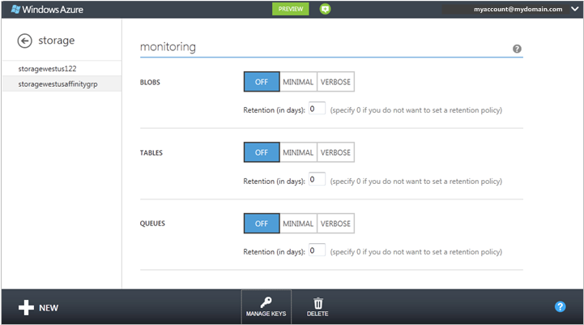
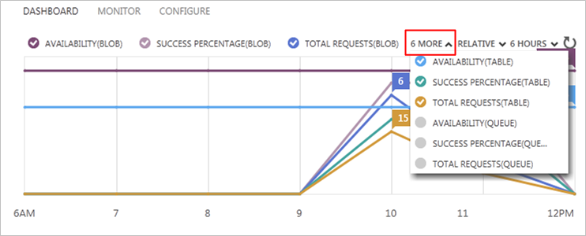
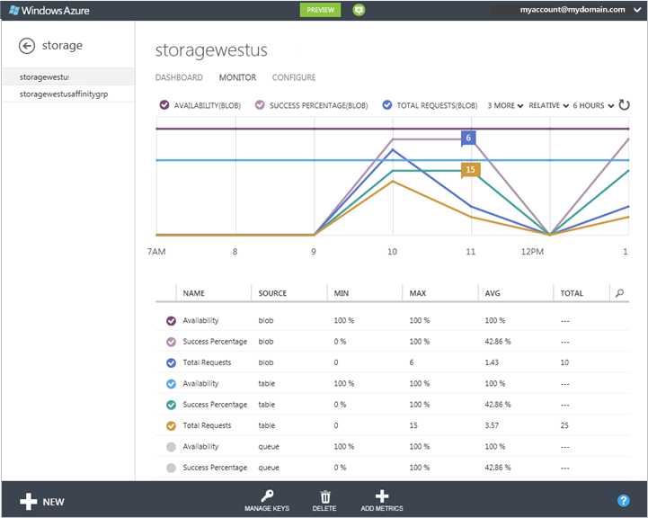
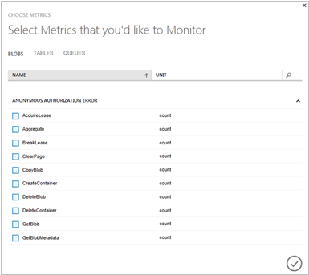
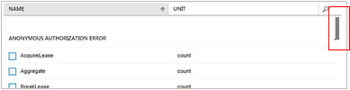
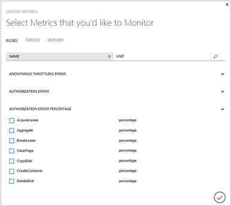
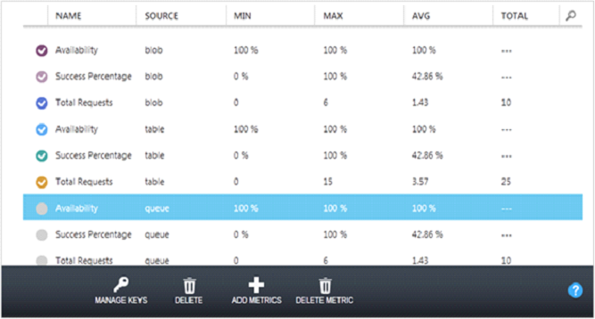
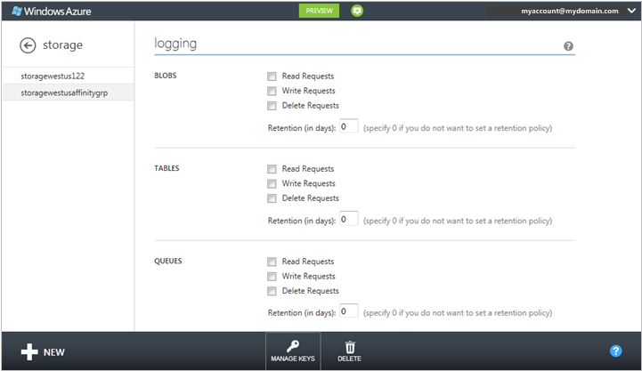

<properties
    pageTitle="Wie Sie ein Speicherkonto überwachen | Microsoft Azure"
    description="Erfahren Sie, wie ein Speicherkonto in Azure mithilfe der Azure-Portal zu überwachen."
    services="storage"
    documentationCenter=""
    authors="robinsh"
    manager="carmonm"
    editor="tysonn"/>

<tags
    ms.service="storage"
    ms.workload="storage"
    ms.tgt_pltfrm="na"
    ms.devlang="na"
    ms.topic="article"
    ms.date="08/03/2016"
    ms.author="robinsh"/>

# Überwachen von einem Speicherkonto Azure-Portal

## (Übersicht)

Sie können Ihr Speicherkonto aus dem [Azure-Portal](https://portal.azure.com)überwachen. Wenn Sie Ihr Speicherkonto für die Überwachung über das Portal konfigurieren, verwendet Azure-Speicher [Speicher Analytics](http://msdn.microsoft.com/library/azure/hh343270.aspx) Kennzahlen für Ihr Konto nachverfolgen und dann wieder anmelden Anforderungsdaten ein.

> [AZURE.NOTE]Mehrkosten stehen im Zusammenhang mit der [Azure-Portal](https://portal.azure.com)Überwachung Daten untersuchen. Weitere Informationen finden Sie unter <a href="http://msdn.microsoft.com/library/azure/hh360997.aspx">Speicher Analytics und Abrechnung</a>.  

> Azure Dateispeicher aktuell Speicher Analytics Metrik unterstützt, aber unterstützt noch keine Protokollierung. Sie können Kennzahlen zur Azure Dateispeicher über das [Azure-Portal](https://portal.azure.com)aktivieren.

> Speicherkonten mit einem Replikationstyp Zone redundante Speicher (ZRS) haben keine der Kennzahlen oder Protokollierung Videofunktionen zu diesem Zeitpunkt aktiviert. 

> Ein detailliertes Handbuch mit Speicher Analytics und andere Tools zu identifizieren, diagnostizieren und Azure-Speicher-bezogene Probleme zu beheben finden Sie unter [überwachen, diagnostizieren und Behandeln von Problemen mit Microsoft Azure-Speicher](storage-monitoring-diagnosing-troubleshooting.md).

## So: Konfigurieren der Überwachung für ein Speicherkonto

1. Im [Portal Azure](https://portal.azure.com)- **Speicher**klicken Sie auf, und klicken Sie dann auf den Namen des Speicher-Kontos auf das Dashboard zu öffnen.

2. Klicken Sie auf **Konfigurieren**, und führen Sie einen Bildlauf nach unten bis der **Überwachung** Einstellungen für die Blob, Tabelle und Warteschlangendienste.

    

3. **Überwachung**legen Sie die Ebene für die Überwachung und die Daten Aufbewahrungsrichtlinie für jeden Dienst:

    -  Um die Überwachung Ebene festlegen möchten, wählen Sie eine der folgenden Aktionen aus:

      **Minimale** - sammelt Kennzahlen wie eingehende/Ausgang, Verfügbarkeit, Wartezeit und Erfolg Prozentsätze für die Blob, Tabelle und Warteschlange Services zusammengefasst werden.

      **Ausführlich** - sammelt zusätzlich zu den minimalen Kennzahlen demselben Satz von Kennzahlen für jeden Speichervorgang in die Azure Service-API. Ausführliche Kennzahlen aktivieren näher Analyse von Problemen, die während der Anwendungsvorgänge auftreten.

      **Off** - deaktiviert Überwachung. Vorhandene Daten für die Überwachung wird bis zum Ende der Aufbewahrungszeitraum beibehalten.

- Um die Aufbewahrungsrichtlinie Daten in **Aufbewahrung (in Tagen)**festlegen möchten, geben Sie die Anzahl der Tage von Daten von 1 bis 365 Tage beibehalten. Wenn Sie keine Aufbewahrungsrichtlinie festlegen möchten, geben Sie 0 (null). Ist keine Aufbewahrungsrichtlinie, ist es auf die überwachen Daten gelöscht. Es empfiehlt sich, Festlegen einer Aufbewahrungsrichtlinie basierend auf wie lange soll Speicher Analytics-Daten für Ihr Konto beibehalten, damit vom Gerät kostenlos oder verwendete Analytics-Daten gelöscht werden können.

4. Wenn Sie die Konfiguration die Überwachung fertig sind, klicken Sie auf **Speichern**.

Starten Sie die Überwachung von Daten auf dem Dashboard und die Seite **Monitor** nach einer Stunde angezeigt.

Bis Sie die Überwachung für Speicher-Konto konfigurieren, keine überwachen Daten gesammelt ist, und die Metrik Diagramme auf dem Dashboard und **Monitor** Seite leer sind.

Nachdem Sie die Überwachung Ebenen und Aufbewahrungsrichtlinien festgelegt haben, können Sie auswählen, welche die verfügbaren Metrik im [Portal Azure](https://portal.azure.com)überwachen und welche Kriterien in Diagrammen Kennzahlen gezeichnet. Eine Standardgruppe von Kriterien, wird jede Überwachung Ebene angezeigt. **Hinzufügen von Kennzahlen** können Sie hinzufügen oder Entfernen von Kriterien in der Liste Kennzahlen.

Kennzahlen werden in dem Speicherkonto in vier Tabellen mit dem Namen $MetricsTransactionsBlob, $MetricsTransactionsTable, $MetricsTransactionsQueue und $MetricsCapacityBlob gespeichert. Weitere Informationen finden Sie unter [Informationen zum Speicher Analytics Kennzahlen](http://msdn.microsoft.com/library/azure/hh343258.aspx).

## So: Anpassen des Dashboards für die Überwachung

Auf dem Dashboard können Sie bis zu sechs Kennzahlen gezeichnet im Diagramm Kennzahlen aus neun verfügbaren Kennzahlen auswählen. Für jeden Dienst (Blob, Tabelle und Warteschlange) werden die Verfügbarkeit, Erfolg Prozentsatz und Anfragen insgesamt Metrik zur Verfügung. Der Metrik, die auf dem Dashboard sind gleich zum Überwachen der minimalen oder zu lang.

1. Im [Portal Azure](https://portal.azure.com)- **Speicher**klicken Sie auf, und klicken Sie dann auf den Namen des Kontos Speicherplatz auf das Dashboard zu öffnen.

2. Führen Sie zum Ändern der Kriterien, die in einem Diagramm gezeichnet werden eine der folgenden Aktionen aus:

    - Um eine neue Metrik zu dem Diagramm hinzufügen möchten, klicken Sie auf das Kontrollkästchen farbigen neben der metrischen Kopfzeile in der Tabelle unter dem Diagramm.

    - Deaktivieren Sie zum Ausblenden einer Metrik, die auf dem Diagramm gezeichnet wird der farbige das Kontrollkästchen neben der metrischen Kopfzeile ein.

        

3. Standardmäßig werden im Diagramm Datentrends, nur den aktuellen Wert der einzelnen Metrisch (die Option **relativ** am oberen Rand des Diagramms) anzeigen. Wählen Sie zum Anzeigen einer y-Achse, damit Sie, Absolute Werte sehen können **absolut**.

4. Wählen Sie zum Ändern des Zeitraums Diagramm zeigt die Kennzahlen, 6 Stunden, 24 Stunden oder sieben Tage am oberen Rand des Diagramms.

## So: Anpassen der Seite "Monitor"

Klicken Sie auf der Seite **Überwachen** können Sie für Ihr Speicherkonto sämtlicher Kennzahlen anzeigen.

- Wenn Ihr Speicherkonto minimale Überwachung so konfiguriert ist enthält, werden aus dem Blob, der Tabelle und der Warteschlange Services Kennzahlen wie eingehende/Ausgang, Verfügbarkeit, Wartezeit und Erfolg Prozentsätze aggregiert.

- Wenn Ihr Speicherkonto ausführliche Überwachung so konfiguriert ist enthält, sind die Metrik einer feiner Auflösung von einzelne Speichervorgänge sowie die Aggregate Servicelevel verfügbar.

Gehen Sie folgendermaßen vor, um auszuwählen, denen Storage metrische anzeigen in die Kennzahlen Diagramme und die Tabelle, die Sie auf der Seite **Monitor** angezeigt werden. Diese Einstellungen wirken sich nicht auf die Auflistung, Aggregation und Speicherung von Daten in das Speicherkonto für die Überwachung aus.

## So: Hinzufügen von Kennzahlen zur Tabelle Kennzahlen

1. Im [Portal Azure](https://portal.azure.com)- **Speicher**klicken Sie auf, und klicken Sie dann auf den Namen des Kontos Speicherplatz auf das Dashboard zu öffnen.

2. Klicken Sie auf **Überwachen**.

    Die Seite **Monitor** wird geöffnet. Standardmäßig zeigt die Tabelle Kennzahlen einen Teil der Kriterien, die für die Überwachung verfügbar sind. Die Abbildung zeigt die Monitor Standardanzeige für ein Speicherkonto mit ausführlichen Überwachung für alle drei Dienste konfiguriert. Verwenden Sie **Kennzahlen hinzufügen** die Kennzahlen auswählen, die Sie aus alle verfügbaren Kriterien überwachen möchten.

    

    > [AZURE.NOTE] Erwägen Sie Kosten, wenn Sie die Kennzahlen auswählen. Es gibt Transaktion und Ausgang Kosten im Zusammenhang mit Überwachung zeigt aktualisieren. Weitere Informationen finden Sie unter [Speicher Analytics und Abrechnung](http://msdn.microsoft.com/library/azure/hh360997.aspx).

3. Klicken Sie auf **Kriterien hinzufügen**.

    Die Zusammenfassung der Kennzahlen, die in die minimale Überwachung verfügbar sind, werden am oberen Rand der Liste. Wenn das Kontrollkästchen aktiviert ist, wird die Metrik in der Liste Kennzahlen angezeigt.

    

4. Zeigen Sie auf der rechten Seite des Dialogfelds eine Bildlaufleiste angezeigt werden, die Sie zum Anzeigen zusätzliche Eigenschaften eines Bildlaufs ziehen können.

    

5. Klicken Sie auf den Pfeil nach unten, nach einer Metrik, um eine Liste der Vorgänge, die die Metrik zum Einschließen ausgelegte ist zu erweitern. Wählen Sie die einzelnen Vorgänge, die Sie in der Tabelle Kennzahlen im [Portal Azure](https://portal.azure.com)anzeigen möchten.

    In der folgenden Abbildung wurde die Autorisierung FEHLERPROZENTSATZ Metrik erweitert.

    

6. Nachdem Sie für alle Dienste Kennzahlen auswählen, klicken Sie auf OK (Häkchen), um die Konfiguration der Überwachung zu aktualisieren. Die ausgewählten Metrik werden die Kennzahlen Tabelle hinzugefügt.

7. Um eine Metrik aus der Tabelle zu löschen, klicken Sie auf die Metrik, um ihn auszuwählen, und klicken Sie dann auf **Löschen Metrik**.

    

## So: Anpassen der Kennzahlen Diagramms auf der Seite Monitor

1. Wählen Sie auf der Seite **Monitor** für den Speicherkonto in der Tabelle Kennzahlen bis zu 6 Kennzahlen im Kennzahlen Diagramm gezeichnet. Klicken Sie zum Auswählen einer Metrik auf das Kontrollkästchen auf der linken Seite. Wenn eine Metrik aus dem Diagramm entfernen möchten, deaktivieren Sie das Kontrollkästchen.

2. Um das Diagramm zwischen Verhältnis zwischen dem Wert (Endwert nur angezeigt) und Absolute Werte (y-Achse angezeigt) zu wechseln, wählen Sie **Relative** oder **Absolute** am oberen Rand des Diagramms ein.

3.  Zum Ändern die Uhrzeit Bereich der Kennzahlen Diagramm zeigt, auswählen **von 6 Stunden**, **24 Stunden**oder **7 Tage** am oberen Rand des Diagramms.

## So: Konfigurieren der Protokollierung

Für jede der Speicherdienste mit Ihrem Speicherkonto (Blob, Tabelle und Warteschlange) zur Verfügung Sie können Diagnose Protokolle für Anfragen lesen, Schreiben Anfragen und/oder Anfragen löschen speichern und können die Datenaufbewahrungsrichtlinie für jeden der Dienste festlegen.

1. Im [Portal Azure](https://portal.azure.com)- **Speicher**klicken Sie auf, und klicken Sie dann auf den Namen des Kontos Speicherplatz auf das Dashboard zu öffnen.

2. Klicken Sie auf **Konfigurieren**, und verwenden Sie den Pfeil nach unten auf der Tastatur, um führen Sie einen Bildlauf nach unten bis zum **Protokollierung**.

    

3. Konfigurieren Sie für jeden Dienst (Blob, Tabelle und Warteschlange) die folgenden Schritte aus:

    - Die Typen der Anforderung zum melden: gelesen Besprechungsanfragen, Schreiben von Besprechungsanfragen und Besprechungsanfragen löschen.

    - Die Anzahl der Tage, die protokollierten Daten zu behalten. Geben Sie 0 (null) ist, wenn Sie keine Aufbewahrungsrichtlinie festlegen möchten. Wenn Sie eine Aufbewahrungsrichtlinie nicht festlegen, ist es auf die Protokolle gelöscht.

4. Klicken Sie auf **Speichern**.

Die Protokolle der Diagnose werden in einem Blob-Container mit dem Namen $logs in Ihr Konto Storage gespeichert. Informationen zum Zugreifen auf den Container $logs finden Sie unter [Informationen zum Speicher Analytics Protokollierung](http://msdn.microsoft.com/library/azure/hh343262.aspx).
