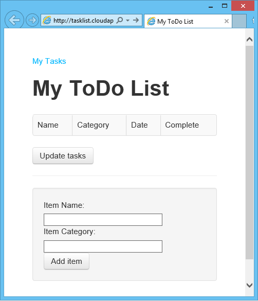
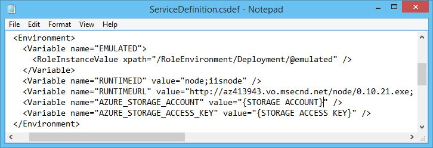

<properties 
    pageTitle="Web app mit Tabellenspeicher (Node.js) | Microsoft Azure" 
    description="Ein Lernprogramm, bei dem der Web-App mit Express-Lernprogramm erstellt durch Hinzufügen von Azure Storage Services und Azure-Modul." 
    services="cloud-services, storage" 
    documentationCenter="nodejs" 
    authors="tamram" 
    manager="carmonm" 
    editor="tysonn"/>

<tags 
    ms.service="storage" 
    ms.workload="storage" 
    ms.tgt_pltfrm="na" 
    ms.devlang="nodejs" 
    ms.topic="article" 
    ms.date="10/18/2016" 
    ms.author="robmcm"/>

# Node.js Webanwendung mit Speicher

## (Übersicht)

In diesem Lernprogramm erweitern Sie die Anwendung, die mit Microsoft Azure-Client-Bibliotheken für Node.js für die Arbeit mit Daten Management Services im [Node.js Webanwendung mit Express] -Lernprogramm erstellt wird. Erweitern Sie die Anwendung eine Aufgabenliste webbasierten Anwendung zu erstellen, die auf Azure bereitgestellt werden kann. Die Aufgabenliste ermöglicht Benutzern zum Abrufen von Aufgaben und Hinzufügen von neuen Vorgängen Aufgaben als erledigt markieren.

Der Vorgang Elemente werden in Azure Storage gespeichert. Azure-Speicher bietet es sich um unstrukturierten Datenspeicher, die Fehlertoleranz und hochgradig verfügbar ist. Azure-Speicher enthält mehrere Datenstrukturen, wo Sie können speichern und Access-Daten, und Sie können die Speicherdienste aus der APIs für Node.js oder über REST-APIs im Azure SDK enthalten nutzen. Weitere Informationen finden Sie unter [Speichern und den Zugriff auf Daten in Azure].

In diesem Lernprogramm wird davon ausgegangen, dass Sie die [Web-Anwendung Node.js] und [Node.js mit Express][Node.js Webanwendung mithilfe von Express] Lernprogramme durchgeführt wurden.

Lernen Sie Folgendes:

-   Zum Arbeiten mit der Vorlage Jade-engine
-   Zum Arbeiten mit Azure Datenmanagement services

Ein Screenshot der fertigen Anwendung lautet wie folgt:

## Festlegen von Anmeldeinformationen Speicher in Web.Config

Azure-Speicher zugreifen zu können, müssen Sie Speicherplatz Anmeldeinformationen übergeben. Dazu nutzen Sie web.config Anwendung Settings.
Diese Einstellungen werden übergeben als Umgebungsvariablen auf Knoten, die dann vom Azure SDK gelesen werden.

> [AZURE.NOTE] Speicher Anmeldeinformationen werden nur verwendet, wenn die Anwendung in Azure bereitgestellt wird. Wenn im Emulator ausgeführt wird, wird die Anwendung Speicheremulator verwenden.

Führen Sie die folgenden Schritte aus, um die Anmeldeinformationen des Kontos abrufen und an den Einstellungen web.config hinzuzufügen:

1.  Wenn sie noch nicht ist öffnen, Sie zunächst die Azure PowerShell über **das Startmenü** **Alle Programme, Azure**erweitern, mit der rechten Maustaste **Azure PowerShell**, und wählen Sie dann auf **Als Administrator ausführen**.

2.  Wechseln Sie zu dem Ordner mit der Anwendung. C:\\Knoten\\Aufgabenliste\\WebRole1.

3.  Geben Sie das folgende Cmdlet aus, um die Kontoinformationen Speicher ermitteln, aus dem Fenster Azure Powershell:

        PS C:\node\tasklist\WebRole1> Get-AzureStorageAccounts

    Dadurch wird die Liste Speicherkonten und Konto Tasten verknüpft ist, mit dem gehosteten Dienst abgerufen.

    > [AZURE.NOTE] Da das Azure SDK Speicher-Konto erstellt wird, wenn Sie einen Dienst bereitstellen, sollte Speicher-Konto bereits vorhanden sein, aus der Bereitstellung der Anwendung in den vorherigen Führungslinien.

4.  Öffnen Sie die **ServiceDefinition.csdef** -Datei, die mit der umgebungseinstellungen, die verwendet werden, wenn die Anwendung in Azure bereitgestellt wird:

        PS C:\node\tasklist> notepad ServiceDefinition.csdef

5.  Fügen Sie den folgenden Block unter **Umgebung** Element, ersetzen {SPEICHERKONTO} und {Speicher ZUGRIFFSTASTE} mit dem Kontonamen und dem Primärschlüssel für den Speicherkonto, die, das Sie für die Bereitstellung verwenden möchten:

        <Variable name="AZURE_STORAGE_ACCOUNT" value="{STORAGE ACCOUNT}" />
        <Variable name="AZURE_STORAGE_ACCESS_KEY" value="{STORAGE ACCESS KEY}" />

    

6.  Speichern Sie die Datei, und schließen Sie Editor.

### Installieren Sie zusätzliche Module

2. Verwenden Sie den folgenden Befehl zum Installieren der [Azure], [Knoten Uuid], [Nconf] und [asynchrone] Module lokal sowie zum einen Eintrag für sie zu der Datei **package.json** zu speichern:

        PS C:\node\tasklist\WebRole1> npm install azure-storage node-uuid async nconf --save

    Die Ausgabe dieses Befehls sollte ähnlich wie die folgende angezeigt:

        node-uuid@1.4.1 node_modules\node-uuid

        nconf@0.6.9 node_modules\nconf
        ├── ini@1.1.0
        ├── async@0.2.9
        └── optimist@0.6.0 (wordwrap@0.0.2, minimist@0.0.8)

        azure-storage@0.1.0 node_modules\azure-storage
        ├── extend@1.2.1
        ├── xmlbuilder@0.4.3
        ├── mime@1.2.11
        ├── underscore@1.4.4
        ├── validator@3.1.0
        ├── node-uuid@1.4.1
        ├── xml2js@0.2.7 (sax@0.5.2)
        └── request@2.27.0 (json-stringify-safe@5.0.0, tunnel-agent@0.3.0, aws-sign@0.3.0, forever-agent@0.5.2, qs@0.6.6, oauth-sign@0.3.0, cookie-jar@0.3.0, hawk@1.0.0, form-data@0.1.3, http-signature@0.10.0)

##Mithilfe des Diensts für die Tabelle in eine Anwendung Knoten

Erweitern Sie in diesem Abschnitt wird die grundlegende Anwendung erstellte Befehls **express** durch Hinzufügen einer **task.js** -Datei, die das Modell für Ihre Vorgänge enthält. Außerdem ändern die vorhandenen **app.js** und Erstellen einer neuen **tasklist.js** -Datei, die das Modell verwendet.

### Erstellen Sie das Modell

1. Erstellen Sie im Verzeichnis **WebRole1** ein neues Verzeichnis **Modelle**.

2. Erstellen Sie eine neue Datei namens **task.js**im Verzeichnis **Modelle** . Diese Datei enthält das Modell für die Aufgaben, die von der Anwendung erstellt.

3. Fügen Sie am Anfang der Datei **task.js** , erforderliche Bibliotheken verweisen folgenden Code ein:

        var azure = require('azure-storage');
        var uuid = require('node-uuid');
        var entityGen = azure.TableUtilities.entityGenerator;

4. Fügen Sie als Nächstes Code zum Definieren und das Aufgabenobjekt exportieren. Dieses Objekt ist für das Herstellen einer Verbindung mit der Tabelle verantwortlich ist.

        module.exports = Task;

        function Task(storageClient, tableName, partitionKey) {
          this.storageClient = storageClient;
          this.tableName = tableName;
          this.partitionKey = partitionKey;
          this.storageClient.createTableIfNotExists(tableName, function tableCreated(error) {
            if(error) {
              throw error;
            }
          });
        };

5. Fügen Sie den folgenden Code ein, um zusätzliche Methoden für das Objekt Aufgabe definieren die Interaktionen mit den Daten in der Tabelle zu ermöglichen:

        Task.prototype = {
          find: function(query, callback) {
            self = this;
            self.storageClient.queryEntities(query, function entitiesQueried(error, result) {
              if(error) {
                callback(error);
              } else {
                callback(null, result.entries);
              }
            });
          },

          addItem: function(item, callback) {
            self = this;
            // use entityGenerator to set types
            // NOTE: RowKey must be a string type, even though
            // it contains a GUID in this example.
            var itemDescriptor = {
              PartitionKey: entityGen.String(self.partitionKey),
              RowKey: entityGen.String(uuid()),
              name: entityGen.String(item.name),
              category: entityGen.String(item.category),
              completed: entityGen.Boolean(false)
            };

            self.storageClient.insertEntity(self.tableName, itemDescriptor, function entityInserted(error) {
              if(error){  
                callback(error);
              }
              callback(null);
            });
          },

          updateItem: function(rKey, callback) {
            self = this;
            self.storageClient.retrieveEntity(self.tableName, self.partitionKey, rKey, function entityQueried(error, entity) {
              if(error) {
                callback(error);
              }
              entity.completed._ = true;
              self.storageClient.updateEntity(self.tableName, entity, function entityUpdated(error) {
                if(error) {
                  callback(error);
                }
                callback(null);
              });
            });
          }
        }

6. Speichern Sie und schließen Sie die Datei **task.js** .

### Erstellen des Controllers

1. Erstellen Sie im Verzeichnis **WebRole1/weitergeleitet** eine neue Datei namens **tasklist.js** , und öffnen Sie sie in einem Text-Editor.

2. Fügen Sie den folgenden Code zu **tasklist.js**. Dies lädt die Azure und asynchrone Module, die von **tasklist.js**verwendet werden. Hierdurch wird auch die **Aufgabenliste** -Funktion, die eine Instanz des **Task** -Objekts übergeben wird, die zuvor von uns definiert definiert:

        var azure = require('azure-storage');
        var async = require('async');

        module.exports = TaskList;

        function TaskList(task) {
          this.task = task;
        }

2. Vervollständigen Sie die Datei **tasklist.js** durch die Methoden zur **ShowTasks**, **AddTask**und **CompleteTasks**hinzufügen:

        TaskList.prototype = {
          showTasks: function(req, res) {
            self = this;
            var query = azure.TableQuery()
              .where('completed eq ?', false);
            self.task.find(query, function itemsFound(error, items) {
              res.render('index',{title: 'My ToDo List ', tasks: items});
            });
          },

          addTask: function(req,res) {
            var self = this      
            var item = req.body.item;
            self.task.addItem(item, function itemAdded(error) {
              if(error) {
                throw error;
              }
              res.redirect('/');
            });
          },

          completeTask: function(req,res) {
            var self = this;
            var completedTasks = Object.keys(req.body);
            async.forEach(completedTasks, function taskIterator(completedTask, callback) {
              self.task.updateItem(completedTask, function itemsUpdated(error) {
                if(error){
                  callback(error);
                } else {
                  callback(null);
                }
              });
            }, function goHome(error){
              if(error) {
                throw error;
              } else {
               res.redirect('/');
              }
            });
          }
        }

3. Speichern Sie die Datei **tasklist.js** .

### Ändern der app.js

1. Öffnen Sie im Verzeichnis **WebRole1** die **app.js** -Datei in einem Text-Editor ein. 

2. Fügen Sie am Anfang der Datei, um Azure-Modul laden, und legen Sie den Tabelle Name und Partition Schlüssel Folgendes ein:

        var azure = require('azure-storage');
        var tableName = 'tasks';
        var partitionKey = 'hometasks';

3. In der Datei app.js führen Sie einen Bildlauf nach unten bis, wo Sie die folgende Zeile sehen:

        app.use('/', routes);
        app.use('/users', users);

    Ersetzen Sie die oben genannten Zeilen mit den folgenden Code ein. Dadurch wird eine Instanz der <strong>Aufgabe</strong> mit einer Verbindung mit Ihrem Speicherkonto Initialisierung. Dies wird in der <strong>Aufgabenliste</strong>, übergeben, den sie, zur Kommunikation mit dem Dienst Tabelle verwenden möchten:

        var TaskList = require('./routes/tasklist');
        var Task = require('./models/task');
        var task = new Task(azure.createTableService(), tableName, partitionKey);
        var taskList = new TaskList(task);

        app.get('/', taskList.showTasks.bind(taskList));
        app.post('/addtask', taskList.addTask.bind(taskList));
        app.post('/completetask', taskList.completeTask.bind(taskList));
    
4. Speichern Sie die Datei **app.js** .

### Ändern der Indexansicht

1. Wechseln Sie in den **Ansichten** Verzeichnis, und öffnen Sie die Datei **index.jade** in einem Text-Editor.

2. Ersetzen Sie den Inhalt der Datei **index.jade** durch den folgenden Code ein. Dadurch wird die Ansicht zum Anzeigen von vorhandene Vorgänge als auch einem Formular zum Hinzufügen von neuer Vorgängen und vorhandene zu markieren, als abgeschlossen definiert.

        extends layout

        block content
          h1= title
          br
        
          form(action="/completetask", method="post")
            table.table.table-striped.table-bordered
              tr
                td Name
                td Category
                td Date
                td Complete
              if tasks != []
                tr
                  td 
              else
                each task in tasks
                  tr
                    td #{task.name._}
                    td #{task.category._}
                    - var day   = task.Timestamp._.getDate();
                    - var month = task.Timestamp._.getMonth() + 1;
                    - var year  = task.Timestamp._.getFullYear();
                    td #{month + "/" + day + "/" + year}
                    td
                      input(type="checkbox", name="#{task.RowKey._}", value="#{!task.completed._}", checked=task.completed._)
            button.btn(type="submit") Update tasks
          hr
          form.well(action="/addtask", method="post")
            label Item Name: 
            input(name="item[name]", type="textbox")
            label Item Category: 
            input(name="item[category]", type="textbox")
            br
            button.btn(type="submit") Add item

3. Speichern Sie und schließen Sie die Datei **index.jade** .

### Ändern des globalen Layouts

Die Datei **layout.jade** im Verzeichnis **Ansichten** wird als globale Vorlage für andere Dateien **.jade** verwendet. In diesem Schritt ändern Sie darauf, um verwenden [Twitter-Bootstrap](https://github.com/twbs/bootstrap), welche ist ein Toolkit, die eine übersichtliche aussehende Website entwerfen erleichtert.

1. Herunterladen Sie und extrahieren Sie die Dateien für [Twitter-Bootstrap](http://getbootstrap.com/). Kopieren Sie die Datei **bootstrap.min.css** aus der **bootstrap\\Verteiler\\Css** Ordner, um die **öffentlichen\\Stylesheets** Verzeichnis von Ihrer Aufgabenliste Anwendung.

2. Im Ordner " **Ansichten** " Öffnen Sie die **layout.jade** im Texteditor, und Ersetzen Sie den Inhalt mit den folgenden:

        doctype html
        html
          head
            title= title
            link(rel='stylesheet', href='/stylesheets/bootstrap.min.css')
            link(rel='stylesheet', href='/stylesheets/style.css')
          body.app
            nav.navbar.navbar-default
              div.navbar-header
                a.navbar-brand(href='/') My Tasks
            block content

3. Speichern Sie die Datei **layout.jade** .

### Ausführen der Anwendung im Emulator

Verwenden Sie den folgenden Befehl zum Starten der Anwendung im Emulator aus.

    PS C:\node\tasklist\WebRole1> start-azureemulator -launch

Im Browser wird geöffnet und zeigt die folgende Seite:

Verwenden Sie das Formular Elemente hinzufügen oder entfernen Sie vorhandene Elemente, indem Sie sie als erledigt markieren.

## Veröffentlichen Sie die Anwendung in Azure

Rufen Sie in der Windows PowerShell-Fenster das folgende Cmdlet aus, um Ihre verwalteter Service zum Azure erneut bereitzustellen.

    PS C:\node\tasklist\WebRole1> Publish-AzureServiceProject -name myuniquename -location datacentername -launch

Ersetzen Sie **Myuniquename** durch einen eindeutigen Namen für diese Anwendung. Ersetzen Sie **Datacentername** durch den Namen der einer Azure Data Center, z. B. **Westen US**ein.

Nach Abschluss die Bereitstellung sollte eine Antwort ähnlich wie die folgende angezeigt:

    PS C:\node\tasklist> publish-azureserviceproject -servicename tasklist -location "West US"
    WARNING: Publishing tasklist to Microsoft Azure. This may take several minutes...
    WARNING: 2:18:42 PM - Preparing runtime deployment for service 'tasklist'
    WARNING: 2:18:42 PM - Verifying storage account 'tasklist'...
    WARNING: 2:18:43 PM - Preparing deployment for tasklist with Subscription ID: 65a1016d-0f67-45d2-b838-b8f373d6d52e...
    WARNING: 2:19:01 PM - Connecting...
    WARNING: 2:19:02 PM - Uploading Package to storage service larrystore...
    WARNING: 2:19:40 PM - Upgrading...
    WARNING: 2:22:48 PM - Created Deployment ID: b7134ab29b1249ff84ada2bd157f296a.
    WARNING: 2:22:48 PM - Initializing...
    WARNING: 2:22:49 PM - Instance WebRole1_IN_0 of role WebRole1 is ready.
    WARNING: 2:22:50 PM - Created Website URL: http://tasklist.cloudapp.net/.

Wie zuvor, da Sie angegeben haben die **-Schnellstartleiste** Option, die im Browser wird geöffnet und zeigt eine Anwendung in Azure ausgeführt wird, wenn die Veröffentlichung abgeschlossen ist.

## Beenden und Löschen von Ihrer Anwendung

Nach der Bereitstellung Ihrer Anwendungs, empfiehlt es sich um es zu deaktivieren, damit Sie Kosten vermeiden oder erstellen und Bereitstellen von anderen Anwendungen innerhalb des kostenlosen Testversion Zeitraums können.

Azure Rechnung web Rolleninstanzen pro Stunde Server Zeit verbraucht.
Serverzeit ist verbraucht, nach der Bereitstellung Ihrer Anwendungs, selbst wenn die Instanzen nicht ausgeführt werden und beendet werden.

Die folgenden Schritte gezeigt, wie beenden und löschen die Anwendung.

1.  Beenden Sie in der Windows PowerShell-Fenster die Service-Bereitstellung erstellt, die im vorherigen Abschnitt mit das folgende Cmdlet aus:

        PS C:\node\tasklist\WebRole1> Stop-AzureService

    Beenden des Diensts möglicherweise einige Minuten dauern. Wenn der Dienst angehalten wird, erhalten Sie eine Nachricht, die angibt, dass es beendet wurde.

3.  Um den Dienst zu löschen, rufen Sie das folgende Cmdlet aus:

        PS C:\node\tasklist\WebRole1> Remove-AzureService contosotasklist

    Wenn Sie dazu aufgefordert werden, geben Sie **Y** ein, um den Dienst zu löschen.

    Löschen den Dienst möglicherweise einige Minuten dauern. Nach der Dienst gelöscht wurde, erhalten Sie eine Nachricht, die angibt, dass der Dienst gelöscht wurde.

  [Node.js Webanwendung Express verwenden]: http://azure.microsoft.com/develop/nodejs/tutorials/web-app-with-express/
  [Speichern von und den Zugriff auf Daten in Azure]: http://msdn.microsoft.com/library/azure/gg433040.aspx
  [Node.js Webanwendung]: http://azure.microsoft.com/develop/nodejs/tutorials/getting-started/
 
 
