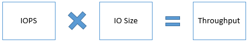
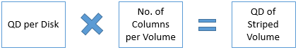
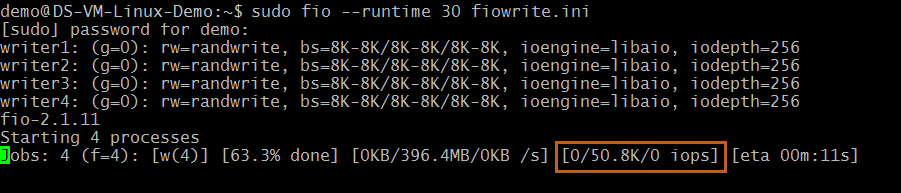

<properties
    pageTitle="Azure Premium Speicher: Entwerfen für Performance | Microsoft Azure"
    description="Entwerfen Sie leistungsfähige Applikationen Azure Premium Speicher verwenden. Premium-Speicher bietet leistungsfähige und niedrig Wartezeiten Datenträger Unterstützung für I/O-Auslastung Auslastung auf Azure virtuellen Computern ausgeführt."
    services="storage"
    documentationCenter="na"
    authors="aungoo-msft"
    manager="tadb"
    editor="tysonn" />

<tags
    ms.service="storage"
    ms.workload="storage"
    ms.tgt_pltfrm="na"
    ms.devlang="na"
    ms.topic="article"
    ms.date="10/18/2016"
    ms.author="aungoo"/>

# <a name="azure-premium-storage-design-for-high-performance"></a>Azure Premium Speicher: Entwurf für eine hohe Leistung

## <a name="overview"></a>(Übersicht)  
Dieser Artikel enthält Richtlinien zum Erstellen von hohe Leistung Azure Premium Speicher verwenden. Sie können die Anweisungen in diesem Dokument mit best Practices Leistung von der Anwendung verwendeten Technologien anwendbar kombiniert bereitgestellt. Um die Richtlinien zu veranschaulichen, haben wir auf SQL Server Premium Speicher beispielhaft im gesamten Dokument verwendet.

Während wir Leistung Szenarien für den Speicher Layer in diesem Artikel zu beheben, müssen Sie die Anwendungsebene zu optimieren. Wenn Sie eine SharePoint-Farm Azure Premium Speichermenge hosten, können Sie beispielsweise die SQL Server-Beispiele aus diesem Artikel verwenden, auf den Datenbankserver optimieren. Darüber hinaus Optimieren der SharePoint-Farm Webserver und Anwendungsserver, um die meisten Leistung zu erzielen.

In diesem Artikel werden häufige gestellte Fragen zum Optimieren der Anwendung Leistung Azure Premium Speicher folgen Beantwortung,

-   Wie kann ich die Leistung Ihrer Anwendung messen?  
-   Warum werden die erwarteten hohe Leistung nicht angezeigt?  
-   Welche Faktoren beeinflussen die Leistung Ihrer Anwendung Premium Speichermenge?  
-   Wie wirken sich diese Faktoren auf die Leistung der Anwendung Premium Speichermenge aus?  
-   Wie können Sie für IOPS, Bandbreite und Wartezeit optimieren?  

Wir haben diesen Richtlinien speziell für Premium Speicher angegeben, weil Auslastung auf Premium Storage ausgeführt hochgradig sensible Leistung sind. Wir haben Beispiele gegebenenfalls bereitgestellt. Sie können einige der folgenden Richtlinien auf IaaS virtuellen Computern mit Standard-Datenträger ausgeführt Applications anwenden.

Sich daher, zuerst, wenn Sie mit Premium Speicher nicht vertraut sind lesen Sie zuerst die [Premium Speicher: leistungsstarke Storage für Azure-virtuellen Computern Auslastung](storage-premium-storage.md) Artikel und [Azure Premium Speicher Skalierbarkeit und Leistung](storage-scalability-targets.md#premium-storage-accounts).

## <a name="application-performance-indicators"></a>Anwendung Performance Indicators  
Wir bewerten, ob eine Anwendung ausführt, auch oder nicht mit Leistung, wie Indikatoren, wie schnell verarbeitet Anwendung fordern Sie ein, wie viele Daten eine Anwendung pro Anforderung verarbeitet wird, wie viele anfordert, warten, bis er erhalten Sie Reaktionen nach dem Einreichen ihrer Anfrage ein Benutzer muss, eine Anwendung Verarbeitung in einen bestimmten Zeitraum, wie lange darstellt. Die technische Begriffe für diese Performance Indicators sind IOPS, Durchsatz oder Bandbreite und Wartezeit.

In diesem Abschnitt werden die allgemeinen Performance Indicators im Kontext Premium Speicher behandelt. Im folgenden Abschnitt, Sammlung von Anwendung Anforderungen, erfahren Sie, wie Sie diese Performance Indicators für eine Anwendung messen. Weiter unten in der Anwendung Leistung optimieren lernen Sie Faktoren diese Performance Indicators und Empfehlungen, um diese zu optimieren.

## <a name="iops"></a>IOPS  
IOPS hat die Nummer der Anfragen, die die Anwendung auf dem Datenträger zum Speichern in eine Sekunde senden ist. Ein Vorgang/Ausgang gelesen werden konnte oder schreiben, sequenziell oder Zufallszahl. Bereit wie eine Website online-Einzelhandel müssen viele gleichzeitige Benutzeranfragen sofort zu verarbeiten. Die benutzeranforderungen sind einfügen und Aktualisieren von Datenbanktransaktionen, die die Anwendung schnell verarbeiten müssen. Daher erfordern bereit IOPS sehr hoch. Solche Applikationen behandeln Millionen von kleinen und zufällige e/a-Anfragen. Wenn Sie eine solche Anwendung haben, müssen Sie die Anwendungsinfrastruktur für IOPS optimiert entwerfen. Höhere *Leistung optimieren der Anwendung*im Abschnitt Diskutieren wir ausführlich alle Faktoren, die Sie berücksichtigen müssen, um hohe IOPS erhalten.

Wenn Sie einen Premium Speicher Datenträger Ihren hoher Maßstab virtueller Computer, Azure Vorschriften für Sie eine gesicherte Anzahl von IOPS gemäß der Spezifikation Datenträger installieren. Beispielsweise stellt ein Datenträger P30 5000 IOPS bereit. Jede hoher Maßstab virtueller Speicher sind auch bestimmte IOPS maximal, die es bewältigen kann. Angenommen, hat eines Standard GS5 virtuellen Computers 80.000 IOPS zu beschränken.

## <a name="throughput"></a>Durchsatz  
Durchsatz oder Bandbreite ist die Menge der Daten, die eine Anwendung auf dem Datenträger zum Speichern in einem angegebenen Intervall sendet. Wenn die Anwendung Eingabe-/Ausgabe-Vorgänge mit großen EA Einheit Maßen arbeitet, ist es hohen Durchsatz erforderlich. Datawarehouse Applikationen meist stark Scan-Vorgänge aus, die Zugriff auf große Teile der Daten nacheinander und häufig Massenvorgänge ausführen. Kurzum, erfordern solche Applikationen höheren Durchsatz. Wenn Sie eine solche Anwendung haben, müssen Sie seine Infrastruktur für Durchsatz optimiert entwerfen. Im nächsten Abschnitt besprechen wir ausführlich die Faktoren, die Sie optimieren müssen, um dies zu erreichen.

Wenn Sie einen Premium Speicher Datenträger in eine hohe Skalierung virtueller Computer, Azure Vorschriften Durchsatz gemäß dieser Spezifikation Datenträger installieren. Beispielsweise stellt ein Datenträger P30 200 MB pro zweiten Datenträger Durchsatz bereit. Jede hoher Skalierung virtueller Speicher hat auch als bestimmte Durchsatzgrenze, die es bewältigen kann. Standard GS5 virtueller Computer hat beispielsweise einen maximalen Durchsatz von 2.000 MB pro Sekunde.

Es wird eine Beziehung zwischen Durchsatz und IOPS wie in der folgenden Formel dargestellt.



Daher ist es wichtig, um die optimalen Durchsatz und IOPS Werte zu ermitteln, die der Anwendung benötigt. Wenn Sie versuchen, eine optimieren, erhält die andere auch betroffen. In einem späteren Abschnitt, der *Leistung der Anwendung optimieren*besprechen wir weitere Details zu IOPS und Durchsatz optimieren.

## <a name="latency"></a>Wartezeit  
Wartezeit ist die Zeit, eine Anwendung auf eine einzelne Anforderung erhalten, senden Sie ihn an die Datenträger zum Speichern und Senden der Antwort an den Client. Dies ist eine wichtige Angabe für die Leistung einer Anwendung sowie IOPS und Durchsatz. Die Wartezeit eines Datenträgers Speicher Premium ist die Zeit, die benötigt wird, um die Informationen für eine Anforderung abrufen und übermitteln Sie ihn an Ihrer Anwendung wieder an. Premium-Speicher bietet konsistente niedrige Wartezeiten. Wenn Sie eine schreibgeschützte Host Zwischenspeichern auf Premium-Datenträger aktivieren, können Sie viele unteren gelesen Wartezeit erhalten. Zwischenspeichern auf der Festplatte erörtert ausführlicher höher Abschnitt zur *Optimierung der Leistung der Anwendung*.

Wenn Sie zu Ihrer Anwendung abzurufenden höhere IOPS und Durchsatz optimieren, wirkt sich die Wartezeit der Anwendung. Nach der Optimierung der Leistung der Anwendung, ausgewertet werden immer die Wartezeit der Anwendung Wartezeit unerwartetes Verhalten zu vermeiden.

## <a name="gather-application-performance-requirements"></a>Sammeln der Anwendung Leistung Anforderungen  
Der erste Schritt beim Entwerfen hohe Leistung von Applications Azure Premium Speicher ausgeführt wird, die Leistung Anforderungen Ihrer Anwendung zu verstehen. Nachdem Sie die Leistung Anforderungen sammeln, können Sie die Anwendung, um die am häufigsten optimale Leistung zu erzielen optimieren.

Im vorherigen Abschnitt wurde die allgemeine Performance Indicators IOPS, Durchsatz und Wartezeit erklärt. Sie müssen ermitteln, welche der folgenden Leistungsindikatoren an Ihrer Anwendung die gewünschten Benutzerfunktionalität vorführen wichtig sind. Beispielsweise ist hohe IOPS besonders wichtig, zum Verarbeiten von Millionen von Transaktionen in eine Sekunde bereit. Während die hoher Durchsatz für Data Warehouse Applikationen Verarbeitung große Datenmengen in eine Sekunde wichtig ist. Extrem niedriger Wartezeit ist entscheidend für in Echtzeit Applikationen wie live Video streaming Websites.

Messen Sie als Nächstes die Anforderungen der maximalen Leistung der Anwendung in der Audiodatei aus. Verwenden Sie die Stichprobe Checkliste unter als ein Start. Aufzeichnen der maximalen Leistung Anforderungen in normalen, Höchstwert und Arbeitszeiten Arbeitsbelastung Perioden an. Durch die Ermittlung Anforderungen für alle Auslastung Ebenen, werden Sie feststellen, die allgemeine Leistung Anforderung der Anwendung. Beispielsweise werden die normale Arbeitsbelastung einer e-Commerce-Website die Transaktionen, die sie in den meisten Tagen ein Jahr dient. Die Arbeitsbelastung Höchstwert der Website werden die Transaktionen, die sie während der Feiertage oder besondere Verkauf Ereignisse dient. Die Arbeitsbelastung Höchstwert ist in der Regel erfahrene für eine begrenzte, aber mindestens zwei Mal seine normalen Betrieb Skalierung die Anwendung, benötigen. Erfahren Sie, die 50 %-Quantil, 90 %-Quantil und 99 Quantil Anforderungen. Auf diese Weise können herausgefiltert werden alle Ausreißern in die Leistung Anforderungen, und Sie können Ihrer Arbeit Schwerpunkte auf optimieren für die richtigen Werte.

**Anwendung Leistung Anforderungscheckliste**

| **Leistung Anforderungen** | **50 %-Quantil** | **90 %-Quantil** | **99 Quantil** |
|---|---|---|---|
| Max. Transaktionen pro Sekunde | | | |
| % Gelesen Vorgänge            | | | |
| % Schreibvorgänge           | | | |
| Zufallszahl Vorgänge %          | | | |
| Sequenzielle Vorgänge %      | | | |
| Größe der EA-Anforderung              | | | |
| Durchschnittsdurchsatz           | | | |
| Max. Durchsatz              | | | |
| Min. Wartezeit                 | | | |
| Durchschnittliche Wartezeit              | | | |
| Max. CPU                     | | | |
| Durchschnittliche CPU                  | | | |
| Max. Arbeitsspeicher                  | | | |
| Durchschnittliche Arbeitsspeicher               | | | |
| Tiefe der Warteschlange                  | | | |

>**Wichtiger Hinweis:**  
>Sie sollten die Skalierung diese Zahlen basierend auf erwarteten zukünftiges Wachstum Ihrer Anwendung. Es ist eine gute Idee, Planen für geometrischen voraus, da es möglicherweise schwieriger konnte die Infrastruktur zum Verbessern der Leistung später ändern.

Wenn Sie eine vorhandene Anwendung haben und in Premium Speicher verschieben möchten, erstellen Sie zuerst die Checkliste über die vorhandene Anwendung. Klicken Sie dann erstellen Sie eine Prototypen Ihrer Anwendung Premium Speichermenge und Entwerfen Sie die Anwendung basierend auf Richtlinien *Optimieren der Anwendung Leistung* in einem späteren Abschnitt dieses Dokuments beschrieben. Im nächste Abschnitt werden die Tools, die Sie verwenden können, um die Leistung Maße sammeln.

Erstellen einer Checkliste für die Prototypen Ihrer vorhandenen Anwendung ähnelt. Mithilfe der Tools Benchmarking können Sie simulieren die Auslastung und Leistung in der Anwendung Prototypen messen. [Benchmarking](#benchmarking) Weitere Informationen finden Sie im Abschnitt. Wie folgt, damit Sie ermitteln können, ob Premium Speicher können entsprechen, oder Ihren Anforderungen der Anwendung Leistung überschreiten. Dann können Sie die gleichen Richtlinien für die Herstellung Anwendung implementieren.

### <a name="counters-to-measure-application-performance-requirements"></a>Indikatoren messen Anwendung Leistung Anforderungen  
Die beste Methode zum Messen der Leistung Anforderungen der Anwendung, ist die Verwendung von Protokollen Tools vom Betriebssystem des Servers bereitgestellt. Sie können PerfMon für Windows und Iostat für Linux verwenden. Diese Tools erfassen Indikatoren jedes Measure Erläuterung im Abschnitt oben entspricht. Sie müssen die Werte dieser Indikatoren erfassen, wenn eine Anwendung seinen Normal, Höchstwert und Arbeitszeiten Auslastung ausgeführt wird.

Die Leistungsindikatoren stehen für Prozessor, Arbeitsspeicher und jedes logische Datenträger und physischen Festplattenspeicher Ihres Servers. Wenn Sie Premium-Datenträger mit eines virtuellen Computers verwenden, die Festplatte Indikatoren für jeden Premium Speicher Datenträger sind und logischen Datenträger Indikatoren für jedes Volume auf dem Datenträger zum Speichern der Premium erstellt werden. Sie müssen die Werte für die Datenträger erfassen, die Ihrer Anwendung Arbeitsbelastung hosten. Ist eine 1: 1-Zuordnung zwischen logische und physische Datenträger, können Sie auf der Festplatte Indikatoren verweisen; Andernfalls finden Sie die logischen Datenträger Indikatoren. Unter Linux generiert der Befehl Iostat ein CPU-als auch Datenträger Auslastung Berichts. Der Datenträgerauslastungsbericht stellt Statistiken pro physische Gerät oder Partition bereit. Wenn Sie einen Datenbankserver mit seiner Daten- und Protokolldateien auf separaten Festplatten haben, erfassen Sie diese Daten für beide Datenträger aus. Indikatoren für Datenträger, Prozessor und Arbeitsspeicher wird unter Tabelle beschrieben:

| Indikator | Beschreibung | PerfMon | Iostat |
|---|---|---|---|
| **IOPS oder Transaktionen pro Sekunde** | Anzahl der e/a-Anfragen den Datenträger pro Sekunde ausgestellt. | Datenträger/s <br> Datenträger schreibt/s | TPS <br> R/s <br> w/s |
| **Datenträgerlese- und schreibt** | % des lesen und Schreiben von Vorgängen auf dem Datenträger ausgeführt. | Lesen Zeit (%) <br> Schreibzeit (%) | R/s <br> w/s |
| **Durchsatz** | Datenmenge gelesen oder auf den Datenträger pro Sekunde geschrieben. | Datenträger Bytes gelesen/s <br> Bytes geschrieben/s | kB_read/s <br> kB_wrtn/s |
| **Wartezeit** | Die Gesamtzeit die Anforderung EA-Datenträger durchführen. | Durchschnittliche Datenträger sec/gelesen <br> Durchschnittliche sec/schreiben | die Antwort des Mitglieds <br> svctm |
| **EA-Größe** | Die Größe der e/a fordert Probleme auf dem Datenträger zum Speichern. | Durchschnittliche Bytes/gelesen <br> Durchschnittliche Bytes/schreiben | Avgrq-sz |
| **Tiefe der Warteschlange** | Anzahl der ausstehenden e/a-Anfragen warten Formular lesen oder auf den Datenträger geschrieben werden. | Aktuelle Warteschlange | Avgqu-sz |
| **Max. Arbeitsspeicher** | Erforderliche Anwendung reibungslos Speichermenge | % Zugesicherte verwendete Bytes verwendet | Verwenden von vmstat |
| **Max. CPU** | Betrag CPU-Anwendung reibungslos erforderlich | Zeit (%) Prozessor | % util |

Erfahren Sie mehr über [Iostat](http://linuxcommand.org/man_pages/iostat1.html) und [PerfMon](https://msdn.microsoft.com/library/aa645516.aspx).


## <a name="optimizing-application-performance"></a>Optimieren der Leistung der Anwendung  
Hauptfenster Faktoren für Leistung einer Anwendung auf Premium Storage ausgeführt werden Art von e/a-Anfragen, virtueller Speicher, Datenträgergröße, Anzahl der Datenträger, Datenträger zwischengespeichert, Multithreading und Tiefe der Warteschlange. Sie können einige dieser Faktoren über vom System bereitgestellten Regler steuern. Die meisten Applikationen können Ihnen nicht die eine Option, die EA Größe und Tiefe Warteschlange direkt zu ändern. Wenn Sie SQL Server verwenden, können nicht Sie beispielsweise die EA Größe und Warteschlange Tiefe auswählen. SQL Server wählt die optimale EA Größe und Warteschlange Tiefenwerte mit die meisten Leistung zu erzielen. Es ist wichtig, die Effekte der beiden Typen von Faktoren für die Leistung Ihrer Anwendung zu verstehen, damit Sie die geeignete Ressourcen Leistung Anforderungen bereitstellen können.

Finden Sie in diesem Abschnitt in der Anwendung Anforderungscheckliste, die Sie erstellt haben, um wie viel Sie müssen die Leistung Ihrer Anwendung zu optimieren. Anhand dieses werden Sie feststellen, welche Faktoren aus diesem Abschnitt müssen Sie die zu optimieren. Führen Sie benchmarking Tools auf Setup Ihrer Anwendung, um die Auswirkungen eines jeden Faktor auf die Leistung Ihrer Anwendung zu erleben. Finden Sie im Abschnitt [Benchmarking](#Benchmarking) am Ende dieses Artikels schrittweise Anleitung zum gemeinsamen benchmarking Tools für Windows und Linux virtuellen Computern ausgeführt.

### <a name="optimizing-iops-throughput-and-latency-at-a-glance"></a>Optimieren von IOPS, Durchsatz und Wartezeit auf einen Blick  
In der nachfolgenden Tabelle wird erörtert, alle Leistungsfaktoren und die Schritte zum IOPS, Durchsatz und Wartezeit zu optimieren. Die Abschnitte, folgen diesem Zusammenfassung werden beschreiben Faktor ist viel mehr Tiefe.

| | **IOPS** | **Durchsatz** | **Wartezeit** |
|---|---|---|---|
| **Beispielszenario** | Enterprise-OLTP-Anwendung mit Anforderung der Transaktionen, die pro Sekunde sehr hohe.                                                                                                                                 | Enterprise Datawarehousing-Anwendung Verarbeitung großer Datenmengen. | Klicken Sie in Echtzeit Applikationen mit Chat Antworten auf Besprechungsanfragen für Benutzer, wie online-Spiele Anforderung. |
| Leistungsfaktoren  | | | |
| **EA-Größe** | Geringerer EA-Größe ergibt höhere IOPS.                                                                                                                                                                           | Größere EA-Größe ergibt höheren Durchsatz. | |
| **Virtueller Speicher** | Verwenden einer virtueller Speicher, die größer als Ihrer Anwendung Anforderung IOPS bietet. Finden Sie unter virtueller Computer Größen und deren IOPS Grenzwerte hier. | Verwenden Sie eine virtueller Speicher mit Ihrer Anwendung Anforderung größer Durchsatzgrenze ein. Finden Sie unter virtueller Computer Größen und deren Durchsatz Grenzwerte hier. | Verwenden einer virtueller Speicher, dass Angebote Ihrer Anwendung Anforderung größer Grenzwerte skalieren. Finden Sie unter virtueller Computer Größen und so ihre Grenzen. |
| **Größe des Datenträger** | Verwenden Sie eine Größe, die größer als Ihrer Anwendung Anforderung IOPS bietet. Finden Sie unter Datenträgergrößen und deren IOPS Grenzwerte hier. | Verwenden Sie eine Größe mit Ihrer Anwendung Anforderung größer Durchsatzgrenze ein. Finden Sie unter Datenträgergrößen und deren Durchsatz Grenzwerte hier. | Verwenden Sie eine Größe für die Angebote Ihrer Anwendung Anforderung größer Grenzwerte skalieren. Finden Sie unter Datenträgergrößen und so ihre Grenzen. |
| **Virtueller Computer und Maßstab Speichergrenze** | IOPS Beschränkung der Größe virtueller Computer ausgewählt sollten größer als Summe IOPS von Premium-Datenträger beigefügt gesteuert. | Durchsatzgrenze der Größe virtueller Computer ausgewählt sollte Gesamtdurchsatz von Premium-Datenträger beigefügt gesteuert überschreiten. | Maßstab Beschränkungen der gewählten Größe virtueller Computer müssen größer als total Maßstab Beschränkungen der Datenträger zum Speichern von angefügten Premium sein. |
| **Zwischenspeichern auf der Festplatte** | Aktivieren Sie schreibgeschützt Cache auf Premium-Datenträger mit gelesen beanspruchen Vorgänge um höhere gelesen IOPS erhalten. | | Aktivieren Sie schreibgeschützt Cache auf Premium-Datenträger mit bereit beanspruchen Vorgänge sehr niedrig gelesen Wartezeiten abgerufen. |
| **Festplattenstriping** | Verwenden Sie mehrere Datenträger, und verteilen sie zusammen, um eine kombinierte höhere IOPS und Durchsatz Grenze zu erhalten. Beachten Sie, dass die kombinierte Beschränkung pro virtueller Computer größer als die kombinierten Grenzwerte der angefügten Premium Datenträger sein soll. | |
| **Streifengröße** | Geringerer Streifengröße für zufällige kleine EA Muster gesehen bereit. Verwenden Sie z. B. Streifengröße von 64KB für SQL Server OLTP-Anwendung. | Größere Streifengröße für sequenzielle großen EA Muster in Data Warehouse Clientanwendungen angezeigt. Verwenden Sie z. B. 256KB Streifengröße für SQL Server Data Warehouse-Anwendung. | |
| **Multithreading** | Verwenden Sie multithreading, die höheren Anzahl der Anfragen zu Premium-Speicher ablegen, die zu einer höheren IOPS und Durchsatz führen. Legen Sie beispielsweise auf SQL Server einen hohen MAXDOP Wert weitere CPUs mit SQL Server zugewiesen werden. | |
| **Tiefe der Warteschlange** | Größere Tiefe der Warteschlange ergibt höhere IOPS. | Größere Tiefe der Warteschlange ergibt höheren Durchsatz. | Kleiner Warteschlangentiefe ergibt untere Wartezeiten. |

## <a name="nature-of-io-requests"></a>Art der EA-Anfragen  
Eine Anforderung EA handelt es sich um eine Einheit für ein-/Ausgabe-Vorgänge, die eine Anwendung ausführen werden. Die Art des EA-Anfragen, zufällige oder sequenzielle kennzeichnen, hilft Lese- oder Schreibzugriff, klein oder groß, wobei die Leistung Anforderungen Ihrer Anwendung zu bestimmen Ihnen. Es ist sehr wichtig, um die Art der EA-Anfragen, um die richtigen Entscheidungen treffen, beim Entwerfen der Anwendungsinfrastruktur besser zu verstehen.

EA-Größe ist eine weitere wichtige Faktoren. Die EA ist die Größe der Anfrage Vorgang/Ausgang von Ihrer Anwendung erstellt. Die Größe des EA wirkt sich deutlich auf die Leistung besonders auf die IOPS und Bandbreite, die die Anwendung zu erreichen kann. Die folgende Formel veranschaulicht die Beziehung zwischen IOPS, EA Größe und Bandbreite/Durchsatz.  
    

Einige Programme können Sie deren Größe EA zu ändern, während einige Applikationen nicht der Fall ist. Angenommen, SQL Server bestimmt die optimale EA-Größe selbst und bietet keine Benutzer über alle Regler, um ihn zu ändern. Oracle bietet andererseits, einen Parameter namens [DB\_blockieren\_Größe](https://docs.oracle.com/cd/B19306_01/server.102/b14211/iodesign.htm#i28815) verwenden, die Sie konfigurieren können die Größe der e/a-Anforderung der Datenbank.

Wenn Sie eine Anwendung verwenden, die nicht zum Ändern der Größe EA zulässt, verwenden Sie die Richtlinien zur Optimierung der Leistung KPI, die zutreffenden an Ihrer Anwendung wird in diesem Artikel. Beispielsweise

-   Eine OLTP-Anwendung generiert Millionen von kleinen und zufällige e/a-Anfragen. Um diese EA-Anfragen behandeln, müssen Sie Ihrer Anwendungsinfrastruktur abzurufenden höhere IOPS entwerfen.  
-   Eine Data Warehouse-Anwendung generiert große und sequenzielle e/a-Anfragen. Um diese EA-Anfragen behandeln, müssen Sie höhere Bandbreite oder Durchsatz Abrufen Ihrer Anwendungsinfrastruktur entwerfen.

Wenn Sie eine Anwendung Sie die EA-Größe ändern können verwenden, verwenden Sie diese Faustregel für die EA-Größe sowie andere Leistungsrichtlinien für die,

-   Geringerer Größe EA höhere IOPS abgerufen. Beispiel für eine Anwendung OLTP 8 KB.  
-   Größere EA-Größe höheren Bandbreite/Durchsatz zu erhalten. Beispielsweise 1024 KB für eine Datawarehouse-Anwendung.

Hier ein Beispiel auf, wie Sie die IOPS und Durchsatz/Bandbreite für eine Anwendung berechnen. Betrachten Sie eine Anwendung, die mit einem P30 Datenträger aus. Das Maximum, IOPS und Durchsatz/Bandbreite einen Datenträger P30 erreichen können, ist 5000 IOPS und 200 MB pro Sekunde Hilfethemas. Nun ist, wenn die Anwendung die maximale IOPS vom P30 Datenträger erfordert, und eine kleinere EA-Größe wie 8 KB verwenden, die resultierende Bandbreite abgerufen werden kann 40 MB pro Sekunde. Wenn die Anwendung die maximale Durchsatz/Bandbreite von P30 Datenträger erfordert, und verwenden Sie eine größere EA-Größe wie 1024 KB, das sich daraus ergebende IOPS werden jedoch kleiner, 200 IOPS. Daher Optimieren der EA-Größe so, dass sie beide Ihrer Anwendung IOPS und Durchsatz/Bandbreite Anforderung entspricht. In der nachfolgenden Tabelle werden die verschiedenen EA Größen und deren entsprechenden IOPS und Durchsatz für einen Datenträger P30 zusammengefasst.

| **Anforderung der Anwendung** | **E/a-Größe** | **IOPS** | **Durchsatz/Bandbreite** |
|-----------------------------|--------------|----------|--------------------------|
| Max IOPS                    | 8 KB         | 5.000    | 40 MB pro Sekunde         |
| Max Durchsatz              | 1024 KB      | 200      | 200 MB pro Sekunde        |
| Max Throughput + hoher IOPS  | 64 KB        | 3.200    | 200 MB pro Sekunde        |
| Max IOPS + hohen Durchsatz  | 32 KB        | 5.000    | 160 MB pro Sekunde        |

Verwenden Sie IOPS und höher als der Maximalwert eines einzelnen Premium Speicher Datenträgers Bandbreite, um mehrere Premium Datenträger zusammen verteilt. Beispielsweise Streifen zwei P30 Datenträger eine kombinierte IOPS von 10.000 IOPS oder eine kombinierte Durchsatz von 400 MB pro Sekunde abrufen. Wie im nächsten Abschnitt erläutert wird, müssen Sie ein virtueller Speicher, das die kombinierten unterstützt verwenden IOPS und Durchsatz des Datenträgers.

>**Hinweis:**  
>Wenn Sie erhöhen entweder IOPS oder Durchsatz auch von anderen erhöht, stellen Sie sicher, dass Sie nicht Durchsatz oder IOPS Beschränkungen der Festplatte oder virtuellen Computer erreichen beim entweder zu erhöhen.

Um die Effekte EA-Größe auf die Leistung der Anwendung erleben, können Sie auf dem virtuellen Computer und den Datenträger benchmarking Tools ausführen. Erstellen Sie mehrerer Test ausgeführt, und verwenden Sie andere EA-Größe für jede ausführen, um den Einfluss anzuzeigen. Im Abschnitt [Benchmarking](#Benchmarking) am Ende dieses Artikels Weitere Informationen hierzu finden Sie unter.

## <a name="high-scale-vm-sizes"></a>Hohe Maßstab virtueller Computer Größen  
Beim Starten eine Anwendung entwerfen, ist eines der ersten Dinge zu tun ist, auswählen ein virtuellen Computers zum Hosten der Anwendung. Premium-Speicher im Lieferumfang von Größen hoher Maßstab virtueller Computer, die mit Anforderung der höheren berechnen Power und eine hohe e/a-Leistung von lokalen Datenträger Applikationen ausgeführt werden können. Diese virtuellen Computern bieten schnellere Prozessoren, ein höheres Arbeitsspeicher-to-Core Verhältnis und einer Solid-State Drive (SSD) für die lokale Festplatte. Beispiele für hohe unterstützende Premium Speicher skalieren virtuellen Computern sind die Reihe DS, DSv2 und GS virtuellen Computern an.

Hohe Maßstab virtuellen Computern sind in verschiedenen Größen mit unterschiedlich viele CPU-Kerne, Speicher, Betriebssystem und Größe temporärer Speicherplatz verfügbar. Jeder virtueller Speicher, weist ebenfalls maximale Anzahl der Datenträger, die an den virtuellen Computer angefügt werden kann. Daher der ausgewählten virtueller Speicher wirkt sich wie viel Verarbeitung, Arbeitsspeicher, und Speicherkapazität steht für eine Anwendung. Er wirkt sich auch auf die berechnen und Speicher Kosten. Beispielsweise sind unten die Angaben der Größe in eine Reihe von DS, DSv2 Reihe und eine Reihe GS größten virtuellen Computer:

| Virtueller Speicher | CPUs | Arbeitsspeicher | Virtueller Computer Datenträgergrößen | Max. Daten Datenträger | Cachegröße | IOPS | Bandbreite Cache EA-Grenzwerte |
|---|---|---|---|---|---|---|---|
| Standard_DS14 | 16 | 112 GB | OS = 1023 GB <br> Lokale SSD = 224 GB | 32 | 576 GB | 50.000 IOPS <br> 512 MB pro Sekunde | 4.000 IOPS und 33 MB pro Sekunde |
| Standard_GS5 | 32 | 448 GB | OS = 1023 GB <br> Lokale SSD = 896 GB | 64 | 4224 GB | 80.000 IOPS <br> 2.000 MB pro Sekunde | 5.000 IOPS und 50 MB pro Sekunde |

Um eine vollständige Liste aller verfügbaren Azure-virtuellen Computer Größen anzeigen zu können, finden Sie in [Windows virtueller Computer Größen](../virtual-machines/virtual-machines-windows-sizes.md) oder [Linux virtueller Computer Schriftgrade](../virtual-machines/virtual-machines-linux-sizes.md). Wählen Sie die Größe virtueller Computer, die entsprechen und an der gewünschten Anwendung Leistung skaliert werden kann. Darüber hinaus berücksichtigen Sie folgen wichtige Aspekte beim virtuellen Computer Größen auswählen.


*Maßstab Beschränkungen*  
Die maximalen Beschränkungen der IOPS pro virtueller Computer und dem Datenträger sind verschiedene und unabhängig voneinander. Stellen Sie sicher, dass die Anwendung IOPS im Rahmen der den virtuellen Computer als auch die Premium Datenträger beigefügt gesteuert wird. Andernfalls wird Anwendung begrenzungsebene abgestimmten.

Als Beispiel nehmen Sie an, dass die Anforderung einer Anwendung maximal zulässigen 4.000 IOPS ist. Um dies zu erreichen, bereitgestellt einen Datenträger P30 einer DS1 virtuellen Computers. Der Datenträger P30 kann bis zu 5.000 IOPS vorführen. Die DS1 virtueller Computer ist jedoch auf 3.200 IOPS beschränkt. Daher die Leistung der Anwendung wird von der Beschränkung virtueller Computer 3.200 IOPS eingeschränkt werden und Leistung beeinträchtigt werden. Um dieses Problem zu vermeiden, wählen Sie eine virtuellen Computer und dem Datenträger Größe, die beide wird erfüllen Anwendung aus.

*Kosten des Vorgangs*  
In vielen Fällen ist es möglich, dass die Gesamtkosten der Operation mit Premium Speicher als Standard-Speicher mit niedriger ist.

Betrachten Sie beispielsweise eine Anwendung mit Anforderung der 16.000 IOPS aus. Um diese Leistung zu erzielen, benötigen Sie einen Standard\_D14 Azure-Neuerung, kann eine maximale IOPS von 16.000 mit 32 standardmäßigen Speicher 1 TB Laufwerke zu. Jeder 1TB standardmäßigen Speicher Festplatte kann bis zu 500 IOPS erzielen. Die geschätzte Kosten von diesem virtuellen Computer pro Monat werden $1,570. Die monatliche Kosten für 32-standard Datenträger werden $1,638. Die geschätzte monatliche Gesamtkosten werden $3,208.

Jedoch, wenn Sie die gleiche Anwendung Premium Speichermenge gehostet, geringerer Größe virtueller Computer benötigen Sie und weniger Premium-Datenträger, wodurch die Gesamtkosten. Ein Standard\_DS13 virtuellen Computer können die 16.000 IOPS Anforderung mit vier P30 Datenträger entsprechen. Den DS13 virtuellen Computer verfügt über eine maximale IOPS von 25,600 und auf jedem Datenträger P30 weist eine maximale IOPS 5.000. Diese Konfiguration kann insgesamt 5.000 x 4 = 20.000 erzielen IOPS. Die geschätzte Kosten von diesem virtuellen Computer pro Monat werden $1,003. Die monatliche Kosten für vier P30 Premium Datenträger werden $544.34. Die geschätzte monatliche Gesamtkosten werden $1,544.

In der nachfolgenden Tabelle werden die Kosten Aufteilung dieses Szenario für Standard- und Premium-Speicher zusammengefasst.

| | **Standard** | **Premium** |
|---|---|---|
| **Kosten pro Monat in der virtuellen Computer** | $1,570.58 (standard\_D14)   | $1,003.66 (standard\_DS13) |
| **Kosten pro Monat in der Datenträger** | $1,638.40 (32 x 1 TB Datenträger) | $544.34 (4 x P30 Datenträger) |
| **Gesamtkosten pro Monat**  | $3,208.98 | $1,544.34 |

*Linux Distros*  

Bei Azure Premium Speicher erhalten Sie dieselbe Zugriffsebene Leistung für virtuellen Computern unter Windows und Linux. Unterstützt, wir sind viele Arten von Linux Distros und können Sie die vollständige Liste finden Sie [hier](../virtual-machines/virtual-machines-linux-endorsed-distros.md). Es ist wichtig, beachten Sie, dass andere Distros für unterschiedliche Arten von Auslastung besser geeignet sind. Sie werden Ihre Arbeitsbelastung ausgeführt wird, klicken Sie auf verschiedene Detailebenen Leistung je nach der Distro angezeigt. Testen Sie der Distros Linux mit der Anwendung, und wählen Sie das Schema, das am besten geeignet ist.


Wenn Linux mit Premium Speicher ausgeführt werden soll, aktivieren Sie die neuesten Updates zu erforderlichen Treibern zu hohe Leistung zu gewährleisten.

## <a name="premium-storage-disk-sizes"></a>Premium Speicher Datenträgergrößen  
Azure Premium-Speicher bietet drei Datenträgergrößen aktuell aus. Jeder Datenträgergröße sind maximal anderen Maßen für IOPS, Bandbreite und Speicher. Wählen Sie rechts Premium Speicher Datenträger Größe je nach den Erfordernissen der Anwendung und den hohen Maßstab virtueller Speicher aus. Die nachfolgenden Tabelle wird aufgezeigt, die Größen der drei Datenträger und deren Funktionen.

| **Datenträgertyp**       | **P10**           | **P20**           | **P30**           |
|---------------------|-------------------|-------------------|-------------------|
| Größe des Datenträger           | 128 giB           | 512 giB           | 1024 giB (1 TB)   |
| IOPS pro Datenträger       | 500               | 2300              | 5000              |
| Durchsatz pro Datenträger | 100 MB pro Sekunde | 150 MB pro Sekunde | 200 MB pro Sekunde |

Wie viele Datenträger, die Sie auswählen, auf dem Datenträger abhängt, die ausgewählte Größe. Sie können einer einzelnen P30 oder mehrere P10 mehrerer Festplatten Ihrer Anwendung Anforderung entsprechen. Berücksichtigen Sie Konto Aspekte, die unten aufgeführten, wenn Sie die Auswahl vornehmen.

*Maßstab Grenzwerte (IOPS und Durchsatz)*  
Die IOPS und Durchsatz Begrenzung für jede Größe für den Premium ist anders und unabhängig von der virtuellen Computer Maßstab Grenzwerte. Stellen Sie sicher, dass die total IOPS und Durchsatz aus den Festplatten innerhalb von Grenzen der Skalierung der ausgewählten virtuellen Computer Größe.

Wenn beispielsweise eine Anwendung Anforderung bis zu 250 MB/s Durchsatz und mit einem einzigen P30 Datenträger eines DS4 virtuellen Computers verwenden. Den DS4 virtuellen Computer können bis zu 256 MB/s Durchsatz verleihen. Ein einzelner P30 Datenträger hat jedoch maximal 200 MB/s Durchsatz. Die Anwendung wird daher bei 200 MB/s aufgrund von Beschränkung der Datenträger eingeschränkt werden. Um diese Beschränkung zu umgehen, Bereitstellung mehrere Datenlaufwerke auf dem virtuellen Computer an.

>**Hinweis:**  
>Liest vom Cache bereitgestellt werden nicht in den Datenträger IOPS und Durchsatz, daher nicht unterliegt Speichergrenze enthalten. Cache verfügt über seine eigenen IOPS und Durchsatz Grenzwert pro virtueller Computer.
>
>Beispielsweise werden zunächst Ihre Lese- und schreibt 60MB/s und 40MB/s Hilfethemas. Im Laufe der Zeit der Cache von warms und mehr und mehr des lautet aus dem Cache fungiert. Dann können Sie höhere schreiben Durchsatz vom Datenträger erhalten.

*Anzahl der Datenträger*  
Ermitteln der Anzahl der Datenträger, die Sie mit der Bewertung der Anwendung Anforderungen benötigen. Jeder virtueller Speicher sind maximal auch die Anzahl der Datenträger, die an den virtuellen Computer angefügt werden kann. Normalerweise ist dies zweimal die Anzahl der Kerne. Stellen Sie sicher, dass die virtueller Speicher ausgewählt haben, die Anzahl der Datenträger erforderlich unterstützen.

Beachten Sie, dass der Datenträger Premium höhere Leistung Funktionen im Vergleich zu Standard-Datenträger haben. Daher, wenn Sie die Anwendung von Azure Neuerung mithilfe der standardmäßigen Speicher zu Premium Speicher migrieren, müssen Sie weniger Premium Festplatten die gleiche oder eine höhere Leistung für eine Anwendung erzielen höchstwahrscheinlich.

## <a name="disk-caching"></a>Zwischenspeichern auf der Festplatte  
Hohe Maßstab virtuellen Computern, die Azure Premium Speicher nutzen haben mit mehreren Ebene Zwischenspeichern-Technologie BlobCache. BlobCache verwendet eine Kombination der virtuellen Computern RAM und lokale SSD zum Zwischenspeichern. Dieser Cache steht für die Premium beständigen Datenträger und die virtuellen Computer lokalen Festplatten. Standardmäßig wird diese Einstellung Cache schreibgeschützt für OS Datenträger und schreibgeschützt für Daten Datenträger Premium Speichermenge gehostet festgelegt. Mit Datenträger Zwischenspeichern auf die Premium-Datenträger aktiviert, kann die hohe Skalierung virtuellen Computern extrem hohe Leistung erzielen, die die zugrunde liegenden Datenträger Leistung überschreiten.

>[AZURE.WARNING] Ändern die Einstellung Cache eines Azure-Datenträgers trennt und verbindet wieder auf den Zieldatenträger. Es ist der Datenträger Betriebssystem der virtuellen Computer neu gestartet wurde. Beenden Sie alle Anwendungen/Dienste, die von diesem Unterbrechung vor dem Ändern der Datenträger-Cache-Einstellung betroffen werden könnten.

Weitere Informationen zur Funktionsweise von BlobCache benutzerfreundlicheren zur [Azure Premium Speicher](https://azure.microsoft.com/blog/azure-premium-storage-now-generally-available-2/) Blogbeitrag veröffentlichen.

Es ist wichtig, auf dem richtigen Satz von Datenträger Cache aktivieren. Gibt an, ob Sie sollte Zwischenspeichern auf der Festplatte auf einem Datenträger Premium aktivieren oder nicht, hängt die Arbeitsbelastung Muster dieser Datenträger behandelt. In der nachfolgenden Tabelle zeigt den Standardwert Einstellungen des Caches für Datenträger OS und Daten.

| **Datenträgertyp** | **Standardeinstellung Cache** |
|---|---|
| OS Datenträger | Lesen/Schreiben |
| Daten Datenträger | Keine |

Es folgen die empfohlenen Datenträger Einstellungen des Caches für Daten Datenträger,

| **Einstellung Zwischenspeichern Datenträger** | **Empfehlungen darüber, wann diese Einstellung verwenden** |
|---|---|
| Keine | Konfigurieren Sie Host-Cache als keine für nur-schreiben überladene Datenträger aus. |
| Schreibgeschützt | Konfigurieren von Host-Cache für schreibgeschützte und Lese-und Schreibzugriff Datenträger als schreibgeschützt. |
| Lesen/Schreiben | Konfigurieren von Host-Cache als Lesen/Schreiben nur, wenn eine Anwendung ordnungsgemäß Speichern von zwischengespeicherten Daten auf beständigen Laufwerken behandelt bei Bedarf. |

*Schreibgeschützt*  
Zwischenspeichern Premium Speicher Daten Datenträger schreibgeschützt konfiguriert wurde, können Sie niedrigen gelesen Wartezeit erzielen und sehr hoch gelesen IOPS und Durchsatz für eine Anwendung erhalten. Dies ist Fälligkeitsdatum zwei Gründe,

1.  Liest aus dem Cache, also den virtuellen Computer Speicher und die lokale SSD ausgeführt, sind viel schneller als liest vom Datenträger Daten, die die Azure Blob-Speicher aktiviert ist.  
2.  Premium Speicher werden die served aus dem Cache, in Richtung der Datenträger IOPS und Durchsatz liest nicht gezählt. Daher ist eine Anwendung höhere total IOPS und Durchsatz zu erreichen.

*Lesen/Schreiben*  
Standardmäßig haben die OS Datenträger lesen/schreiben Zwischenspeichern aktiviert. Wir haben kürzlich Unterstützung für Lesen/Schreiben Zwischenspeichern von Daten sowie Festplatten hinzugefügt. Wenn Sie lesen/schreiben Zwischenspeichern verwenden, müssen Sie eine gemischte Möglichkeit zum Schreiben von Daten aus dem Cache in beständigen Datenträger verfügen. SQL Server übernimmt beispielsweise zwischengespeicherte Daten auf die Speicherung Laufwerke auf einem eigenen schreiben. Lesen/Schreiben Cache für eine Anwendung, die nicht beibehalten die benötigten Daten verarbeitet verwenden kann zu Datenverlust, führen, wenn Sie der virtuellen Computer stürzt ab.

Beispielsweise können Sie diesen Richtlinien mit SQL Server auf Premium Storage ausgeführt werden, indem Sie wie folgt vorgehen, anwenden

1.  Konfigurieren von "Schreibgeschützt" Cache auf Premium-Datenträger Hostinganbieter Datendateien.  
    ein.  Die Fast liest aus dem Cache unteren, dass der SQL Server-Abfrage-Zeitraum seit Datenseiten aus dem Cache viel schneller abgerufen werden mit direkt aus den Daten Datenträger verglichen werden.  
    b.  Erstellen von liest aus dem Cache, bedeutet, dass es sich bei zusätzlichen Durchsatz stellt Datenträger mit Daten zur Verfügung. SQL Server kann mithilfe dieser zusätzlichen Durchsatz in Richtung Abrufen weiterer Datenseiten und andere Vorgänge wie Sicherung und Wiederherstellung, Stapel lädt, und erstellt Index erneut.  
2.  Konfigurieren von "Keine" auf die Protokolldateien Hostinganbieter Premium-Datenträger Zwischenspeichern.  
    ein.  Protokolldateien haben hauptsächlich schreiben überladene Vorgänge an. Deshalb führen Sie nicht aus dem Cache schreibgeschützt profitieren.

## <a name="disk-striping"></a>Festplattenstriping  
Wenn eine hohe Skala, die mit mehreren Premium beständigen Datenträger virtueller Computer angeschlossen ist, können die Datenträger zusammen verteilt werden, um deren IOPs, Bandbreite und Speicherkapazität aggregieren.

Klicken Sie auf Windows können Sie Speicher Leerzeichen in Streifen Datenträger zusammen verwenden. Sie müssen eine Spalte für jeden Datenträger in einem Pool konfigurieren. Andernfalls kann die allgemeine Leistung von aufgeteilten Lautstärke niedriger als erwartet aufgrund ungleiche Verteilung der Verkehr über die Laufwerke sein.

Wichtig: Verwenden Server-Manager UI, können Sie die Gesamtzahl der Spalten auf 8 für ein aufgeteilten Volume festlegen. Wenn mehr als 8 Datenträger anfügen möchten, verwenden Sie PowerShell, um die Lautstärke zu erstellen. Mithilfe der PowerShell, können Sie die Anzahl der Spalten gleich der Anzahl der Datenträger festlegen. Wenn beispielsweise 16 Datenträger vorhanden sind, in einer einzelnen Streifen; Geben Sie in den Parameter *NumberOfColumns* des *Neu VirtualDisk* PowerShell-Cmdlets 16 Spalten ein.


Verwenden Sie unter Linux die MDADM-Programm, mit Streifen Datenträger nicht trennen. Auf Striping Datenträger auf Linux detaillierten Schritte finden Sie unter [Konfigurieren von Microsoft Software-RAID auf Linux](../virtual-machines/virtual-machines-linux-configure-raid.md).


*Streifengröße*  
Eine wichtige Konfiguration in Festplattenstriping wird die Streifengröße. Streifengröße oder Größe Zeitraums ist der kleinste Datenblock, die Anwendung auf einem aufgeteilten Volume adressiert. Die Streifengröße, die Sie konfigurieren, hängt von der Art der Anwendung und deren Anforderung Muster ab. Wenn Sie die Streifengröße der falschen auswählen, kann es zu EA fehlerhafte Ausrichtung, führen, was zu beeinträchtigt die Leistung der Anwendung führt.

Beispielsweise ist eine EA-Anforderung Ihrer Anwendung erzeugten größer als die Größe des Streifen, schreibt das Speichersystem es über Streifen Einheit hinweg auf mehr als einen Datenträger. Wenn Sie auf diese Daten zugegriffen werden soll, müssen diese Zielwertsuche über mehrere Streifen Einheiten, um die Anforderung abzuschließen. Der kumulierte Effekt solches Verhalten kann zu einem erheblichen Leistungsabfall führen. Andererseits, möglicherweise ist die Größe der Anforderung EA kleiner als Streifengröße und ist es in Form von Stichproben, die EA-Anfragen auf demselben Datenträger einen Engpass verursachen und schließlich beeinträchtigt die Leistung EA addieren.


Je nach Typ der Arbeitsbelastung Ihrer Anwendung wird ausgeführt, und wählen Sie eine geeignete Streifengröße. Verwenden Sie für kleine EA-Anfragen Zufallszahl geringerer Streifengröße ein. Während die Besprechungsanfragen für große sequenzielle EA einen größeren Streifen verwenden. Informieren Sie sich die Streifen Größe Empfehlungen für die Anwendung, dass Sie auf Premium Speicher ausführen möchten. Konfigurieren Sie für SQL Server Streifengröße 64KB für OLTP Auslastung und 256KB für Datawarehousing Auslastung Daten ein. Finden Sie unter [Leistung bewährte Methoden für SQL Server auf Azure-virtuellen Computern](../virtual-machines/virtual-machines-windows-sql-performance.md#disks-and-performance-considerations) Weitere.


>**Hinweis:**  
>Sie können bis zu 32 Premium-Datenträger auf einer Serie DS virtueller Computer und 64 Premium-Datenträger auf einer Reihe GS virtueller Computer zusammen versehen.

## <a name="multi-threading"></a>Multi-Thread  
Azure dient dazu Premium Speicher Plattform parallele sein. Daher wird eine Anwendung multi-threaded wesentlich höheren Leistung als eine Anwendung Single threaded erreicht. Eine Multi-threaded Anwendung teilt Sie ihre Aufgaben mehrere threadübergreifend und Effizienz seiner Ausführung erhöht, indem Sie die virtuellen Computer und dem Datenträger Ressourcen auf das Maximum.

Wenn die Anwendung auf einer einzelnen Core virtueller Verwendung der zwei Computer ausgeführt wird, kann die CPU zwischen den beiden Threads Effizienz erzielen wechseln. Während ein Thread auf einem Datenträger EA zum Abschließen wartet kann die CPU mit dem anderen Thread wechseln. Auf diese Weise können zwei Threads erreichen mehr als ein einzelner Thread würden. Wenn der virtuellen Computer mehrere Core ist, verringert es weiteren laufenden Zeit, da jede Core Aufgaben parallel ausgeführt werden kann.

Sie können möglicherweise nicht ändern Anwendung einsatzbereite einzelnen implementiert Thread oder Multi-Thread. SQL Server beträgt beispielsweise Multi-CPU- und Multi-Core verarbeiten kann. SQL Server jedoch beschließt, unter welchen Umständen sie eine oder mehrere Thread zum Verarbeiten von einer Abfrage nutzen wird. Sie können Abfragen auszuführen und Erstellen von Indizes mit Multi-Thread. SQL Server wird für eine Abfrage, bei der Teilnahme an großen Tabellen und Sortieren von Daten vor dem Benutzer zurückgeben, mehrere Threads genutzt. Jedoch kann kein Benutzers steuern, ob SQL Server eine Abfrage, die mit einem einzelnen Thread oder mehreren Threads ausgeführt wird.

Konfiguration von Einstellungen, die Sie ändern können, um diese beeinflussen Multi-Thread oder parallele vorhanden sind Verarbeitung einer Anwendung. Bei SQL Server ist es beispielsweise die maximale Grad der Parallelität Konfiguration. Diese Einstellung aufgerufen MAXDOP, können Sie die maximale Anzahl der Prozessoren konfigurieren, die SQL Server verwenden können, wenn parallele Verarbeitung. Sie können für einzelne Abfragen oder Index Vorgänge MAXDOP konfigurieren. Dies ist nützlich, wenn Sie Ressourcen des Computers für eine Leistung kritische Anwendung verteilen möchten.

Angenommen Sie, dass die Anwendung mit SQL Server ausgeführt wird, eine umfangreiche Abfrage und einen Index Vorgang zur gleichen Zeit. Lassen Sie uns wird davon ausgegangen Sie, dass Sie den Vorgang des Index weitere leistungsfähige im Vergleich zu den großen Abfrageentwurfsbereich werden möchten. In diesem Fall können Sie MAXDOP Wert des Indexvorgangs höher als der Wert MAXDOP für die Abfrage festlegen. Auf diese Weise kann SQL Server weitere Prozessoranzahl, die sie für den Indexvorgang im Vergleich zu der Anzahl der Prozessoren, die sie in den großen Abfrageentwurfsbereich widmen kann nutzen kann. Denken Sie daran, Sie keine Kontrolle über die Anzahl der Threads, die SQL Server für jeden Vorgang verwendet wird. Sie können steuern, die maximale Anzahl der Prozessoren wird dedizierter für Multi-Thread.

Weitere Informationen zu den [Grad der Parallelität](https://technet.microsoft.com/library/ms188611.aspx) in SQL Server. Informieren Sie sich diese Einstellungen, die beeinflussen Multi-Thread in Ihrer Anwendung und deren Konfigurationen, um die Leistung zu optimieren.

## <a name="queue-depth"></a>Tiefe der Warteschlange  
Die Tiefe der Warteschlange oder Warteschlange-Länge oder Größe der Warteschlange ist die Anzahl der ausstehenden e/a-Anfragen im System. Der Wert der Warteschlangentiefe bestimmt, wie viele EA-Vorgängen Ihrer Anwendung auszurichten kann, die den Datenträger verarbeitet. Er wirkt sich auf alle die drei Anwendung Performance Indicators, die in diesem Artikel Körperbehinderte, IOPS, Durchsatz und Wartezeit besprochen aus.

Multi-Thread sind und Tiefe Warteschlange sich eng aufeinander bezogene. Wert für die Warteschlangentiefe zeigt an, wie viel Multi-Thread kann erreicht werden, indem Sie die Anwendung. Wenn die Warteschlangentiefe groß ist, Anwendung kann weitere Vorgänge ausführen gleichzeitig, also mehr Multi-Thread. Ist der Tiefe der Warteschlange klein, obwohl Anwendung multi-threaded ist, kann es nicht genügend Besprechungsanfragen für die gleichzeitige Ausführung aufgestellt sind.

In der Regel aus dem Sortiment Applications können Sie nicht zum Ändern der Tiefe der Warteschlange, da ist falsch kann es mehr Schaden als nutzen festlegen. Applications werden den richtigen Wert Warteschlange Tiefe erhalten eine optimale Leistung festlegen. Es ist jedoch wichtig, dieses Konzept zu verstehen, damit Sie Leistungsprobleme mit Ihrer Anwendung beheben können. Sie können auch die Auswirkungen der Warteschlangentiefe beobachten, durch benchmarking Tools auf Ihrem System ausgeführt.

Einige Programme bieten Einstellungen, um die Warteschlangentiefe beeinflussen. Angenommen, die MAXDOP (maximale Grad der Parallelität) Einstellung im vorherigen Abschnitt Erläuterung von SQL Server. MAXDOP ist eine Möglichkeit, die Tiefe der Warteschlange beeinflussen und Multi-Thread, obwohl sie den Wert für die Warteschlangentiefe von SQL Server nicht direkt geändert wird.

*Hohe Warteschlangentiefe*  
Eine hohe Warteschlangentiefe ausgerichtet weitere Vorgänge auf dem Datenträger aus. Der Datenträger ist die nächste Anforderung in der Warteschlange im Voraus bekannt. Der Datenträger kann daher Vorgänge im Voraus planen und eine optimale nacheinander zu verarbeiten. Da die Anwendung auf dem Datenträger mehr Anfragen sendet, kann der Datenträger weitere parallele IOs verarbeiten. Schließlich wird die Anwendung höhere IOPS erzielen sein. Da der Anwendung mehr Anfragen verarbeitet wird, wird auch der Gesamtdurchsatz der Anwendung erhöht.

In der Regel eine Anwendung erzielen Sie maximalen Durchsatz mit 8-16 + ausstehenden IOs pro angeschlossenen Datenträger. Ist eine Tiefe Warteschlange eine, Anwendung ist nicht genügend IOs drücken Sie nach dem System, und es weniger Menge in einem bestimmten Zeitraum verarbeitet. Kurzum, weniger Durchsatz.

Beispielsweise werden in SQL Server, Festlegen des Werts MAXDOP für eine Abfrage auf "4" SQL Server, dass sie bis zu vier Kerne verwenden können, um die Abfrage auszuführen. SQL Server wird ermitteln bewährte Warteschlange Tiefenwert und die Anzahl der Kerne für die Ausführung der Abfrage.

*Optimale Warteschlangentiefe*  
Sehr hoch Warteschlange Tiefenwert hat aber auch Nachteile. Wenn Warteschlange Tiefenwert zu hoch ist, wird die Anwendung versuchen Sie, sehr hoch IOPS versorgen. Es sei denn, Anwendung beständigen Datenträger mit ausreichend bereitgestellte IOPS verfügt, kann dies Anwendung Wartezeiten negativ auswirken. Folgende Formel veranschaulicht die Beziehung zwischen IOPS, Wartezeit und Tiefe der Warteschlange.  
    

Jeder Wert, der hoch, sondern optimalen Wert, der genügend IOPS für die Anwendung ohne Auswirkungen Wartezeiten vorführen kann, sollten Sie nicht Tiefe Warteschlange konfigurieren. Angenommen, die Anwendung Wartezeit 1 Millisekunden sein muss, der Tiefe der Warteschlange 5.000 IOPS erzielen erforderlich ist, %QD = 5000 x 0,001 = 5.

*Warteschlangentiefe für aufgeteilten Volume*  
Verwalten Sie für einen aufgeteilten Datenträger eine Warteschlangentiefe hoch genug so, dass jeder Datenträger eine Höchstwert Warteschlangentiefe einzeln verfügt. Angenommen, Sie verfügen über eine Anwendung, die die Warteschlangentiefe 2 legt und in der Streifen 4 Festplatten vorhanden sind. Die zwei EA-Anfragen werden auf zwei Datenträger geleitet und zwei Datenträger verbleibende werden im Leerlauf. Daher konfigurieren Sie Tiefe der Warteschlange so, dass alle Datenträger beschäftigt werden können. Formel wird gezeigt, wie die Warteschlangentiefe der aufgeteilte Datenträger zu ermitteln.  
    

## <a name="throttling"></a>Begrenzungsebene  
Azure Premium Speicher Vorschriften eine angegebene Anzahl von IOPS und Durchsatz je nach virtuellen Computer Größen und Datenträgergrößen ausgewählt haben. Jedes Mal, wenn die Anwendung versucht, drive IOPS oder Durchsatz über diese Grenzwerte für was virtuellen Computers oder der Datenträger bewältigen kann, werden Sie von Premium Speicher einschränken. Dies zeigt das Formular mit geringerer Leistung in Ihrer Anwendung. Dies kann bedeuten höhere Wartezeit, Durchsatz verringern oder zu verringern IOPS. Wenn Premium Speicher keine Beschränkung, fehlschlagen Ihrer Anwendung vollständig überschritten, was deren Ressourcen in der Lage zu erreichen sind. Ja, um Leistungsprobleme aufgrund von begrenzungsebene zu vermeiden, immer Bereitstellungsressourcen Sie ausreichend für eine Anwendung. Berücksichtigen Sie was besprochen virtueller Computer Größen und Datenträger Größen Abschnitte oben. Benchmarks ist die beste Methode zum herausfinden, welche Ressourcen zum Hosten der Anwendung benötigen werden.

## <a name="benchmarking"></a>Benchmarks  
Benchmarks versteht verschiedene Auslastung auf Ihrer Anwendung simulieren und messen die Leistung der Anwendung für jede Arbeitsbelastung. Verwenden die in einem Abschnitt weiter oben beschriebenen Schritte, haben Sie die Anwendung Leistung Anforderungen gesammelt. Durch Ausführen von benchmarking Tools auf den virtuellen Computern, die sich die Anwendung befindet, können Sie die Leistungsstufe ermitteln, die eine Anwendung mit Premium Speicher erreicht werden kann. In diesem Abschnitt stellen wir Beispiele Benchmarks eines Standard DS14 virtuellen Computers mit Azure Premium Datenträger bereitgestellt.

Wir haben allgemeine benchmarking Tools Iometer und FIO, jeweils für Windows und Linux verwendet. Diese Tools mehrere Threads simulieren einer Herstellung wie Arbeitsbelastung erzeugen, und die Systemleistung. Mithilfe der Tools können Sie auch Parameter wie Größe und Warteschlange Tiefe blockieren konfigurieren normalerweise für eine Anwendung kann nicht geändert werden. Dies können Sie flexibler zum Steuern der maximalen Leistung auf eine hohe Skala virtueller Computer nach der Bereitstellung mit Premium Festplatten für unterschiedliche Arten von Auslastung. Weitere Informationen finden Sie Informationen zu jeder Benchmarktool [Iometer](http://www.iometer.org/) und [FIO](http://freecode.com/projects/fio).

Um die folgenden Beispiele zu folgen, Erstellen eines Standard DS14 virtuellen Computers und 11 Premium-Datenträger an den virtuellen Computer. 11 Datenträger 10 Festplatten mit Host als "Keine" Zwischenspeichern konfigurieren und diese in ein Volumen aufgerufen NoCacheWrites aufzuteilen. Konfigurieren Sie Host als "Schreibgeschützt" auf der verbleibenden Festplatte Zwischenspeichern und erstellen Sie einen Datenträger "CacheReads" diese Datenträger bezeichnet. Verwenden diese einrichten, werden Sie kann die maximale Lese- und Schreibberechtigungen Leistung eines Standard DS14 virtuellen Computers zu sehen sein. Weitere Informationen zum Erstellen eines DS14 virtuellen Computers mit Premium Datenträger wechseln Sie zu [Erstellen und Premium Speicher-Konto für einen Datenträger virtuellen Computern](storage-premium-storage.md#create-and-use-a-premium-storage-account-for-a-virtual-machine-data-disk).

*Aufwärmphase Cache*  
Die Festplatte mit schreibgeschützten Host Zwischenspeichern wird als der Grenzwert Festplatten höhere IOPS gewähren können. Wenn diese maximale Lese-Performance aus dem Cache Host erhalten möchten, müssen zuerst Sie den Cache mit diesem Datenträger aussichtsreich. Dadurch wird sichergestellt, welche Benchmarktool auf "CacheReads" Lautstärke Laufwerk wird, gelesen IOs tatsächlich Cache und nicht auf dem Datenträger direkt Treffer. Cachetreffer Ergebnis in zusätzliche IOPS aus dem einzelnen Cache aktiviert Datenträger.

>**Wichtig:**  
>Sie müssen den Cache Aufwärmen, vor dem Ausführen Benchmarks, von jedem virtuellen Computer neu gestartet wird.

#### <a name="iometer"></a>Iometer   
[Laden Sie das Tool Iometer](http://sourceforge.net/projects/iometer/files/iometer-stable/2006-07-27/iometer-2006.07.27.win32.i386-setup.exe/download) , des virtuellen Computers.

*Testdatei*  
Iometer verwendet eine Testdatei, die auf dem Datenträger gespeichert ist, auf dem Sie den benchmarking Test ausgeführt werden. Es Laufwerke liest und schreibt diese Test-Datei auf den Datenträger messen IOPS und Durchsatz. Iometer erstellt diese Testdatei aus, wenn Sie keinen angegeben haben. Erstellen einer 200GB Test-Datei namens "iobw.tst" auf der "CacheReads" und NoCacheWrites die Datenmengen.

*Access-Spezifikationen*  
Die Spezifikationen anfordern EA-Größe % Lese, % zufällige/sequenziell sind mit der Registerkarte "Access-Spezifikationen" in konfiguriert Iometer. Erstellen Sie eine Access-Spezifikation für jede der nachfolgend beschriebenen Szenarien aus. Erstellen Sie die Access-Spezifikationen, und nennen Sie "Speichern" mit dem entsprechenden wie – RandomWrites\_8K, RandomReads\_8K. Wählen Sie der entsprechenden Spezifikation aus, wenn das Testszenario ausgeführt.

Beispiel für Access-Spezifikationen für maximale schreiben IOPS Szenario sieht folgendermaßen aus,  
    

*Maximale IOPS Testspezifikationen*  
Um die maximale IOPs zeigen, verwenden Sie geringerer Anforderungsgröße aus. Verwenden Sie die Größe der Anforderung 8K und Erstellen von Spezifikationen für zufällige schreibt und liest.

| Access-Spezifikation | Größe der Anforderung | Zufallszahl % | Lesen % |
|----------------------|--------------|----------|--------|
| RandomWrites\_8K     | 8K           | 100      | 0      |
| RandomReads\_8K      | 8K           | 100      | 100    |

*Maximale Durchsatz Testspezifikationen*  
Verwenden Sie zum maximalen Durchsatz veranschaulichen, größere Größe der Anforderung aus. Verwenden Sie die Größe der Anforderung 64K und Erstellen von Spezifikationen für zufällige schreibt und liest.

| Access-Spezifikation | Größe der Anforderung | Zufallszahl % | Lesen % |
|----------------------|--------------|----------|--------|
| RandomWrites\_64K    | 64K          | 100      | 0      |
| RandomReads\_64K     | 64K          | 100      | 100    |

*Ausführen des Tests Iometer*  
Führen Sie die folgenden Schritte zur Cache aussichtsreich

1.  Erstellen Sie zwei Access-Spezifikationen mit Werten abgebildet,

  	| Namen              | Größe der Anforderung | Zufallszahl % | Lesen % |
  	|-------------------|--------------|----------|--------|
  	| RandomWrites\_1MB | 1MB          | 100      | 0      |
  	| RandomReads\_1MB  | 1MB          | 100      | 100    |

2.  Führen Sie den Iometer-Test für die Initialisierung Cachedatenträger mit den folgenden Parametern. Verwenden Sie für das Ziel-Volume und eine Warteschlangentiefe 128 drei Arbeitsthreads ein. Legen Sie die "Laufzeit" Dauer der Prüfung auf 2hrs auf der Registerkarte "Setup testen" ein.

  	| Szenario              | Ziel-Volume | Namen              | Dauer |
  	|-----------------------|---------------|-------------------|----------|
  	| Initialisierung Cachedatenträger | "CacheReads"    | RandomWrites\_1MB | 2hrs     |

3.  Führen Sie den Iometer-Test für die Erwärmung Cachedatenträger mit den folgenden Parametern. Verwenden Sie für das Ziel-Volume und eine Warteschlangentiefe 128 drei Arbeitsthreads ein. Legen Sie die "Laufzeit" Dauer der Prüfung auf 2hrs auf der Registerkarte "Setup testen" ein.

  	| Szenario           | Ziel-Volume | Namen             | Dauer |
  	|--------------------|---------------|------------------|----------|
  	| Cachedatenträger war | "CacheReads"    | RandomReads\_1MB | 2hrs     |

Nach dem Cachedatenträger aufgewärmt ist, fahren Sie mit den unten aufgeführten Testszenarien. Verwenden Sie zum Ausführen der Tests Iometer mindestens drei Arbeitsthreads für **jedes** Zielvolume ein. Wählen Sie für jeden Worker-Thread das Ziel-Volume, festlegen Sie Tiefe der Warteschlange, und wählen Sie eine der gespeicherten Testspezifikationen, wie in der folgenden Tabelle gezeigt werden soll, um das entsprechende Testszenario ausführen. Die Tabelle enthält auch erwarteten Ergebnisse für IOPS und Durchsatz, wenn diese Tests ausgeführt. In allen Szenarien wird eine kleine EA-Größe von 8 KB und eine hohe Warteschlangentiefe 128 verwendet.

| Testszenario      | Ziel-Volume | Namen              | Ergebnis       |
|--------------------|---------------|-------------------|--------------|
| Max. Finden Sie hier IOPS     | "CacheReads"    | RandomWrites\_8K  | 50.000 IOPS  |
| Max. Schreiben Sie IOPS    | NoCacheWrites | RandomReads\_8K   | 64.000 IOPS  |
| Max. Kombinierte IOPS | "CacheReads"    | RandomWrites\_8K  | 100.000 IOPS |
|                    | NoCacheWrites | RandomReads\_8K   |              |
| Max. Lesen Sie MB/sec   | "CacheReads"    | RandomWrites\_64K | 524 MB/sec   |
| Max. Schreiben Sie MB/sec  | NoCacheWrites | RandomReads\_64K  | 524 MB/sec   |
| Kombinierte MB/sec    | "CacheReads"    | RandomWrites\_64K | 1000 MB/sec  |
|                    | NoCacheWrites | RandomReads\_64K  |              |

Nachstehend sind, dass Screenshots des der Iometer Ergebnisse für kombinierte IOPS und Durchsatz Szenarien testen.

*Kombinierte Lese- und schreibt maximale IOPS*  


*Kombinierte Lese- und schreibt maximalen Durchsatz*  


### <a name="fio"></a>FIO  
FIO ist eine beliebte Tool Benchmark-Speicher auf die Linux virtuellen Computern an. Es hat die Flexibilität, wählen Sie unterschiedliche EA Größen sequenzielle oder zufällige Lese- und schreibt. Es erzeugt Arbeitsthreads oder Prozesse zur Ausführung der angegebenen e/a-Vorgänge. Sie können die Art der e/a-Vorgänge angeben, die jeder Worker-Thread Job-Dateien mit ausgeführt werden muss. Wir erstellt eine Position-Datei pro Szenario in den folgenden Beispielen dargestellt. Sie können die Angaben in diesen Auftragsdateien zum Analysieren von verschiedenen Auslastung auf Premium Storage ausgeführt ändern. In den Beispielen verwenden wir die eines Standard DS 14 virtuellen Computers aus, die unter **Ubuntu**. Verwenden Sie das gleiche Layout am Anfang des [Benchmarking Abschnitt](#Benchmarking) beschrieben und aussichtsreich Cache, bevor die Benchmarktests ausgeführt.

Bevor Sie beginnen, [FIO herunterladen](https://github.com/axboe/fio) und installieren es auf dem virtuellen Computer.

Führen Sie den folgenden Befehl für Ubuntu,

        apt-get install fio

Wir werden vier Arbeitsthreads für Vorgänge steuernde und vier Arbeitsthreads für steuernde gelesen Vorgänge auf dem Datenträger verwenden. Die schreiben Kollegen werden den Datenverkehr auf dem Datenträger "Nocache" steuernde werden die 10 Datenträger mit Cache "Keine" festgelegt wurde. Die Kollegen gelesen werden den Datenverkehr auf dem Datenträger "Readcache" steuernde werden die 1 Datenträger Cache, die auf "Schreibgeschützt" festgelegt wurde.

*Maximale schreiben IOPS*  
Erstellen Sie die Position-Datei mit folgenden Spezifikationen können maximale schreiben IOPS zu gelangen. Nennen Sie es "fiowrite.ini".

```
[global]
size=30g
direct=1
iodepth=256
ioengine=libaio
bs=8k

[writer1]
rw=randwrite
directory=/mnt/nocache
[writer2]
rw=randwrite
directory=/mnt/nocache
[writer3]
rw=randwrite
directory=/mnt/nocache
[writer4]
rw=randwrite
directory=/mnt/nocache
```

Beachten Sie die wichtigsten Punkte folgen, die in Übereinstimmung mit der Entwurfsrichtlinien in den vorherigen Abschnitten sind. Diese Spezifikationen sind für die maximale IOPS drive unverzichtbar,  
-   Eine hohe Warteschlangentiefe von 256.  
-   Eine kleine Größe von 8KB.  
-   Mehrere Threads Durchführung zufällige schreibt.

Führen Sie zum Deaktivieren der FIO-Test: 30 Sekunden Starten eines den folgenden Befehl aus  

    sudo fio --runtime 30 fiowrite.ini

Während der Test ausgeführt wird, werden Sie möglicherweise finden Sie unter die Anzahl der IOPS schreiben den virtuellen Computer und Premium Datenträger sind vorführen. Wie im folgenden Beispiel gezeigt wird, ist die DS14 virtueller Computer seine maximale schreiben IOPS maximal 50.000 IOPS vorführen.  
    

*Maximale gelesen IOPS*  
Erstellen Sie die Position-Datei mit folgenden Spezifikationen abzurufenden maximale gelesen IOPS. Nennen Sie es "fioread.ini".

```
[global]
size=30g
direct=1
iodepth=256
ioengine=libaio
bs=8k

[reader1]
rw=randread
directory=/mnt/readcache
[reader2]
rw=randread
directory=/mnt/readcache
[reader3]
rw=randread
directory=/mnt/readcache
[reader4]
rw=randread
directory=/mnt/readcache
```

Beachten Sie die wichtigsten Punkte folgen, die in Übereinstimmung mit der Entwurfsrichtlinien in den vorherigen Abschnitten sind. Diese Spezifikationen sind für die maximale IOPS drive unverzichtbar,

-   Eine hohe Warteschlangentiefe von 256.  
-   Eine kleine Größe von 8KB.  
-   Mehrere Threads Durchführung zufällige schreibt.

Führen Sie zum Deaktivieren der FIO-Test: 30 Sekunden Starten eines den folgenden Befehl aus

    sudo fio --runtime 30 fioread.ini

Während der Test ausgeführt wird, werden Sie möglicherweise finden Sie unter die Anzahl der gelesenen IOPS des virtuellen Computer und Premium Datenträger sind vorführen. Wie im folgenden Beispiel gezeigt wird, ist die DS14 virtueller Computer mehr als 64.000 gelesen IOPS vorführen. Dies ist eine Kombination der Datenträger und die Leistung Cache.  
    

*Maximale Lese- und Schreibberechtigungen IOPS*  
Erstellen Sie die Position-Datei mit folgenden Spezifikationen maximal abzurufenden kombiniert lesen und Schreiben IOPS. Nennen Sie es "fioreadwrite.ini".

```
[global]
size=30g
direct=1
iodepth=128
ioengine=libaio
bs=4k

[reader1]
rw=randread
directory=/mnt/readcache
[reader2]
rw=randread
directory=/mnt/readcache
[reader3]
rw=randread
directory=/mnt/readcache
[reader4]
rw=randread
directory=/mnt/readcache

[writer1]
rw=randwrite
directory=/mnt/nocache
rate_iops=12500
[writer2]
rw=randwrite
directory=/mnt/nocache
rate_iops=12500
[writer3]
rw=randwrite
directory=/mnt/nocache
rate_iops=12500
[writer4]
rw=randwrite
directory=/mnt/nocache
rate_iops=12500
```

Beachten Sie die wichtigsten Punkte folgen, die in Übereinstimmung mit der Entwurfsrichtlinien in den vorherigen Abschnitten sind. Diese Spezifikationen sind für die maximale IOPS drive unverzichtbar,

-   Eine hohe Warteschlangentiefe 128.  
-   Eine kleine Größe von 4KB.  
-   Mehrere Threads Durchführung zufällige lesen und schreiben.

Führen Sie zum Deaktivieren der FIO-Test: 30 Sekunden Starten eines den folgenden Befehl aus

    sudo fio --runtime 30 fioreadwrite.ini

Während der Test ausgeführt wird, finden Sie unter die Anzahl der kombinierte lesen und Schreiben IOPS den virtuellen Computer können und Premium Datenträger sind vorführen. Wie im folgenden Beispiel gezeigt wird, ist die DS14 virtueller Computer mehr als 100.000 kombinierte lesen und Schreiben IOPS vorführen. Dies ist eine Kombination der Datenträger und die Leistung Cache.  
    

*Maximum kombiniert Durchsatz*  
Um den maximalen Nutzen kombiniert lesen und Schreiben Durchsatz, verwenden einen größeren blockieren und Tiefe großen Warteschlange mit mehreren Threads Durchführung Lese- und schreibt. Sie können eine Größe Zeitraums 64 KB sein und Tiefe der Warteschlange 128 verwenden.

## <a name="next-steps"></a>Nächste Schritte  

Weitere Informationen zu Azure Premium Speicher:

- [Premium Speicher: Leistungsstarke Storage für Auslastung Azure-virtuellen Computern](storage-premium-storage.md)  

Lesen Sie für SQL Server-Benutzer Artikel über bewährte Methoden für die Leistung für SQL Server aus:

- [Leistung bewährte Methoden für SQLServer in Azure-virtuellen Computern](../virtual-machines/virtual-machines-windows-sql-performance.md)
- [Azure Premium-Speicher bietet höchste Leistung für SQL Server auf virtuellen Azure-Computer](http://blogs.technet.com/b/dataplatforminsider/archive/2015/04/23/azure-premium-storage-provides-highest-performance-for-sql-server-in-azure-vm.aspx) 
