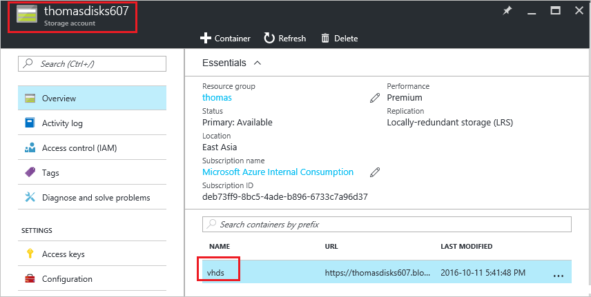
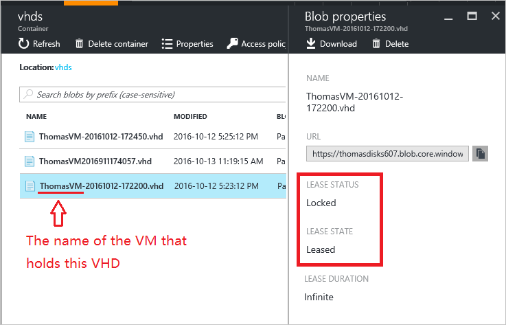

<properties
    pageTitle="Problembehandlung bei Synchronisierungsfehlern, wenn Sie in einer Bereitstellung Ressourcenmanager Azure-Speicherkonten, Container oder virtuelle Festplatten löschen | Microsoft Azure"
    description="Problembehandlung bei Synchronisierungsfehlern, wenn Sie in einer Bereitstellung Ressourcenmanager Azure-Speicherkonten, Container oder virtuelle Festplatten löschen."
    services="storage"
    documentationCenter=""
    authors="genlin"
    manager="felixwu"
    editor="na"
    tags="storage"/>

<tags
    ms.service="storage"
    ms.workload="na"
    ms.tgt_pltfrm="na"
    ms.devlang="na"
    ms.topic="article"
    ms.date="10/17/2016"
    ms.author="genli"/>

# Problembehandlung bei Synchronisierungsfehlern, wenn Sie in einer Bereitstellung Ressourcenmanager Azure-Speicherkonten, Container oder virtuelle Festplatten löschen.

[AZURE.INCLUDE [storage-selector-cannot-delete-storage-account-container-vhd](../../includes/storage-selector-cannot-delete-storage-account-container-vhd.md)]

Wenn Sie versuchen, Azure-Speicher Firmen-, Container oder virtuelle Festplatte (virtuelle Festplatte) im [Portal Azure](https://portal.azure.com)löschen möglicherweise werden Fehler ausgegeben. Dieser Artikel bietet Hinweise zur Problembehandlung zum Beheben des Problems in einer Ressourcenmanager Azure-Bereitstellung.

Wenn Sie in diesem Artikel Ihr Problem Azure nicht zu beheben, besuchen Sie die Azure Foren auf [MSDN und Stapel überlaufen](https://azure.microsoft.com/support/forums/). Sie können Ihr Problem in diesen Foren oder zu Posten @AzureSupport auf Twitter. Darüber hinaus können Sie eine Supportanfrage Azure-Datei, indem Sie auf der Website [Azure unterstützen](https://azure.microsoft.com/support/options/) **Unterstützung** auswählen.

## Symptome

### Szenario 1

Wenn Sie versuchen, eine virtuelle Festplatte in einem Speicherkonto in einer Bereitstellung Ressourcenmanager löschen, erhalten Sie folgende Fehlermeldung angezeigt:

**Fehler beim Löschen von Blob 'vhds/BlobName.vhd'. Fehler: Es gibt es zurzeit eine verleasen auf das Blob und keine verleasen-ID in der Besprechungsanfrage angegeben wurde.**

Dieses Problem kann auftreten, da ein virtuellen Computers (virtueller Computer) eine verleasen die virtuelle Festplatte wurde, die Sie löschen möchten.

### Szenario 2

Wenn Sie versuchen, einen Container in einem Speicherkonto in einer Bereitstellung Ressourcenmanager löschen, erhalten Sie folgende Fehlermeldung angezeigt:

**Fehler beim Löschen von 'virtuelle Festplatten Speicher Container' Fehler: Es gibt es zurzeit eine verleasen für den Container und keine verleasen-ID in der Besprechungsanfrage angegeben wurde.**

Dieses Problem kann auftreten, da der Container eine virtuelle Festplatte verfügt, die in den Zustand verleasen gesperrt ist.

### Szenario 3

Wenn Sie versuchen, ein Speicherkonto in einer Bereitstellung Ressourcenmanager löschen, erhalten Sie folgende Fehlermeldung angezeigt:

**Fehler beim Löschen von Speicherkonto 'StorageAccountName'. Fehler: Das Speicherkonto kann aufgrund zugehörigen Elemente in Gebrauch gelöscht werden.**

Dieses Problem kann auftreten, da das Speicherkonto eine virtuellen enthält, im verleasen Zustand ist.

## Lösung

Um diese Probleme zu beheben, müssen Sie die virtuelle Festplatte, die den Fehler verursacht und den zugehörigen virtuellen Computer identifizieren. Klicken Sie dann Trennen der virtuellen Festplatte aus dem virtuellen Computer (für Daten Datenträger) oder löschen Sie den virtuellen Computer, die die virtuelle Festplatte (für OS Datenträger) verwendet wird. Dies entfernt die verleasen von der virtuellen Festplatte und ermöglicht es gelöscht werden soll.

### Schritt 1: Identifizieren des Problems virtuelle Festplatte und den zugehörigen virtuellen Computer

1. Melden Sie sich mit dem [Azure-Portal](https://portal.azure.com)aus.
2. Wählen Sie im Menü **Hub** **alle Ressourcen**aus. Wechseln Sie zu der Speicherkonto, das Sie löschen möchten, und wählen Sie dann **Blobs** > **virtuellen Festplatten**.

    

3. Überprüfen Sie die Eigenschaften für jede virtuelle Festplatte im Container. Suchen Sie die virtuelle Festplatte, die sich im **Leased** Zustand befindet. Klicken Sie dann bestimmen, welche die virtuellen Computer verwendet die virtuelle Festplatte. In der Regel können Sie festlegen, welche virtuellen Computer die virtuelle Festplatte enthält, indem Sie die Namen der virtuellen Festplatte:

    - OS Datenträger in der Regel führen Sie diese Benennungskonvention: VMNameYYYYMMDDHHMMSS.vhd
    - Datenträger mit Daten in der Regel führen Sie diese Benennungskonvention: VMName-JJJJMMTT-HHMMSS.vhd

    

### Schritt 2: Entfernen der verleasen von der virtuellen Festplatte

So löschen Sie den virtuellen Computer, die die virtuelle Festplatte (für OS Datenträger) verwendet wird

1.  Melden Sie sich mit dem [Azure-Portal](https://portal.azure.com)aus.
2.  Wählen Sie im Menü **Hub** **virtuellen Computern**aus.
3.  Wählen Sie den virtuellen Computer, der eine verleasen auf die virtuelle Festplatte enthält.
4.  Stellen Sie sicher, dass nichts des virtuellen Computers aktiv verwendet wird und dass Sie die virtuellen Computern nicht mehr benötigen.
5.  Am oberen Rand der **virtuellen Computer Details** Blade wählen Sie **Löschen**aus, und klicken Sie dann auf **Ja,** um zu bestätigen.
6.  Der virtuellen Computer sollten gelöscht werden, aber die virtuelle Festplatte beibehalten werden soll. Die virtuelle Festplatte sollte jedoch nicht mehr einer verleasen daran haben. Für die verleasen freigegeben werden einige Minuten dauern. Um zu überprüfen, dass die verleasen freigegeben wird, wechseln Sie zu **alle Ressourcen** > **Speicher Kontonamen** > **Blobs** > **virtuellen Festplatten**. Klicken Sie im **Blob-Eigenschaften** sollten **Verleasen Status** den Wert **setzen**.

Die virtuelle Festplatte aus dem virtuellen Computer zu trennen, die sie (für Daten Datenträger) verwendet wird:

1.  Melden Sie sich mit dem [Azure-Portal](https://portal.azure.com)aus.
2.  Wählen Sie im Menü **Hub** **virtuellen Computern**aus.
3.  Wählen Sie den virtuellen Computer, der eine verleasen auf die virtuelle Festplatte enthält.
4.  Wählen Sie auf dem **virtuellen Computer Details** -Blade **Datenträger** aus.
5.  Wählen Sie den Datenträger Daten, der eine verleasen auf die virtuelle Festplatte enthält. Können Sie bestimmen, welche die virtuelle Festplatte angeschlossen ist, in der Datenträger, indem Sie die URL der virtuellen Festplatte aktivieren.
6.  Ermitteln Sie mit Sicherheit, dass nichts den Datenträger Daten aktiv verwendet wird.
7.  Klicken Sie auf das **Laufwerk – Details** Blade **Trennen** .
8.  Die Festplatte sollte jetzt aus dem virtuellen Computer getrennt werden und die virtuelle Festplatte sollte nicht mehr einer verleasen daran haben. Für die verleasen freigegeben werden einige Minuten dauern. Um zu überprüfen, dass die verleasen freigegeben wurde, wechseln Sie zu **alle Ressourcen** > **Speicher Kontonamen** > **Blobs** > **virtuellen Festplatten**. Klicken Sie im **Blob-Eigenschaften** sollten **Verleasen Status** den Wert **setzen**.

## Was ist eine verleasen?

Eine verleasen ist eine Sperre, die zum Steuern des Zugriffs auf eine Blob (beispielsweise eine virtuelle Festplatte) verwendet werden kann. Wenn ein Blob gehalten wird, können nur der Besitzer des der verleasen Blob zugreifen. Eine verleasen ist wichtig, aus den folgenden Gründen:

-   Es wird verhindert, dass Beschädigung der Daten, wenn mehrere Besitzer auf den gleichen Teil der Blob gleichzeitig schreiben.
-   Es wird verhindert, dass das Blob gelöscht wird, wenn etwas aktiv (z. B. eines virtuellen Computers) verwendet.
-   Es wird verhindert, dass das Speicherkonto gelöscht wird, wenn Sie etwas aktiv (z. B. eines virtuellen Computers) verwendet.

## Nächste Schritte

- [Löschen eines Kontos Speicher](storage-create-storage-account.md#delete-a-storage-account)
- [So unterbrechen Sie die gesperrte verleasen Blob-Speicher in Microsoft Azure (PowerShell)](https://gallery.technet.microsoft.com/scriptcenter/How-to-break-the-locked-c2cd6492)
