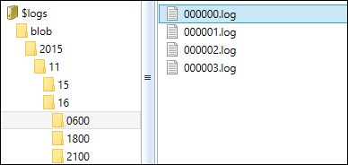
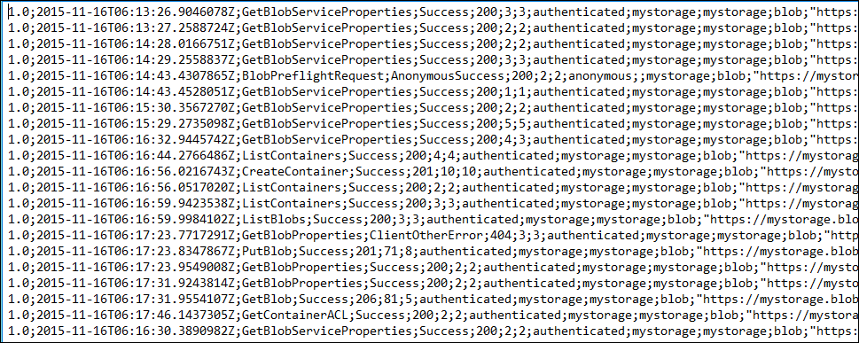
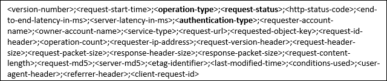

<properties
    pageTitle="Azure Speicher Sicherheit Leitfaden | Microsoft Azure"
    description="Details der viele Methoden zum Azure-Speicher, einschließlich aber nicht beschränkt auf RBAC, Speicher-Service-Verschlüsselung, clientseitige Verschlüsselung, SMB 3.0 und Azure Datenträger Verschlüsselung sichern."
    services="storage"
    documentationCenter=".net"
    authors="robinsh"
    manager="carmonm"
    editor="tysonn"/>

<tags
    ms.service="storage"
    ms.workload="storage"
    ms.tgt_pltfrm="na"
    ms.devlang="dotnet"
    ms.topic="article"
    ms.date="09/08/2016"
    ms.author="robinsh"/>

#Leitfaden für Sicherheit von Azure Speicher

##(Übersicht)

Azure-Speicher bietet eine umfassende Reihe von Sicherheitsfunktionen, die zusammen Entwickler sichere Applications erstellen können. Das Speicherkonto selbst kann mithilfe von Access Control rollenbasierte und Azure Active Directory gesichert werden. Daten können mit [Clientseitig Verschlüsselung](storage-client-side-encryption.md), HTTPS oder SMB 3.0 im Übergang zwischen einer Anwendung und Azure gesichert werden. Daten können mit festgelegt werden automatisch verschlüsselt werden, wenn in den Azure-Speicher geschrieben [Speicher Dienst Verschlüsselung (SSE)](storage-service-encryption.md). Betriebssystem und die Daten der von virtuellen Computern verwendete Datenträger können festgelegt werden, mit [Azure Datenträger Verschlüsselung](../security/azure-security-disk-encryption.md)verschlüsselt werden. Delegierter Zugriff auf die Datenobjekte in Azure-Speicher kann mithilfe von [Freigegebenen Access Signaturen](storage-dotnet-shared-access-signature-part-1.md)erteilt werden.

In diesem Artikel bietet einen Überblick über die einzelnen aufgeführten Sicherheitsfeatures, die mit Azure-Speicher verwendet werden kann. Links zu Artikeln, die Details für jedes Feature hierzu erhalten Sie einfach möglich erhalten werden weitere Untersuchung auf jedes Thema.

Hier sind die Themen, die in diesem Artikel behandelt werden:

-   [Sicherheit bei der Verwaltung Ebene](#management-plane-security) – Sichern von Ihrem Speicherkonto

    Die Ebene Management besteht aus den Ressourcen verwendet, um Ihr Speicherkonto verwalten. In diesem Abschnitt werden wir über das Modell zur Bereitstellung von Azure Ressourcenmanager und wie Sie rollenbasierte Access Control (RBAC) zu verwenden, um die Steuerung des Zugriffs auf Ihre Speicherkonten sprechen. Wir werden auch sprechen zur Verwaltung von Ihrem Speicher Konto Tasten und so müssen neu erstellt.

-   [Daten Plane Sicherheit](#data-plane-security) – Sichern des Zugriffs auf Ihre Daten

    In diesem Abschnitt betrachten wir gewähren des Zugriffs auf Objekte tatsächlichen Daten in Ihr Speicher-Konto, beispielsweise Blobs, Dateien, Queues und Tabellen mithilfe von freigegebenen Access Signaturen und Richtlinien gespeichert. Servicelevel SAS- und Konto Ebene SAS werden behandelt. Außerdem sehen wir zum Einschränken des Zugriffs auf eine bestimmte IP-Adresse (oder der IP-Adressen), können Sie das Protokoll HTTPS begrenzen und wie Sie eine freigegebene Access-Signatur widerrufen, ohne darauf zu warten, bis es abläuft.

-   [Bei der Übertragung Verschlüsselung](#encryption-in-transit)

    Dieser Abschnitt wird erläutert, wie Daten zu sichern, wenn Sie in den oder aus Azure-Speicher übertragen werden. Wir werden die empfohlenen Verwendung von HTTPS und die Verschlüsselung verwendeten SMB 3.0 für Dateifreigaben Azure sprechen. Wir dauert auch wollen clientseitige Verschlüsselung, wodurch Sie zum Verschlüsseln der Daten, bevor sie in einer Clientanwendung in Speicher übertragen werden, und die Daten zu entschlüsseln, nachdem sie nicht über ausreichend Speicher übertragen werden.

-   [Verschlüsselung statisch](#encryption-at-rest)

    Darüber sprechen Speicher Dienst Verschlüsselung (SSE), und wie Sie dies für ein Speicherkonto in Ihrem Blobs blockieren, Seitenblobs, resultierender aktivieren und Blobs automatisch verschlüsselt werden, wenn in den Azure-Speicher geschrieben anfügen können. Wir uns auch anschauen wie mit können Azure Datenträger Verschlüsselung und untersuchen die grundlegenden Unterschiede und Fällen der Datenträger Verschlüsselung im Vergleich zu SSE im Vergleich zu clientseitige Verschlüsselung. FIPS-Konformität für US-Regierung Computer werden kurz behandelt.

-   Verwenden [Speicher Analytics](#storage-analytics) um zu überwachender Access Azure-Speicher

    In diesem Abschnitt erläutert finden Sie Informationen in die Speicher Analytics Protokolle für eine Anforderung. Wir schauen Sie sich real Speicher Analytics Log Daten und Informationen, die zu erkennen, ob mit dem Speicher kontoschlüssel, mit einer Signatur Access freigegeben angefordert wird oder anonym, und gibt an, ob erfolgreich war oder nicht.

-   [Browserbasierte Clients mit CORS aktiviert werden](#Cross-Origin-Resource-Sharing-CORS)

    In diesem Abschnitt erörtert, wie Cross-Origin Ressource (CORS) freigeben können. Wir werden zwischengespeichert und Umgang mit den Funktionen der Azure-Speicher integriert CORS sprechen.

##Sicherheit bei der Verwaltung Ebene

Vorgänge, die im Speicherkonto selbst beeinflussen die Ebene Management besteht aus. Angenommen, können Sie erstellen und löschen Speicher-Konto, erhalten eine Liste der Speicherkonten in einem Abonnement, Speicher Konto Schlüssel abrufen, oder die Tasten Speicher Konto neu zu generieren.

Wenn Sie ein neues Speicherkonto erstellen, wählen Sie ein Modell zur Bereitstellung von Classic oder Ressourcenmanager aus. Klassische Modell zum Erstellen von Ressourcen in Azure ermöglicht nur nichts Zugriff auf das Abonnement, und klicken Sie im Gegenzug das Speicherkonto.

In diesem Handbuch Schwerpunkt Ressourcenmanager Modell also die empfohlenen Methoden zum Erstellen von Speicherkonten aus. Mit der Ressourcenmanager Speicherkonten statt Zugriff gewähren, um das gesamte Abonnement können Sie den Zugriff auf eine weitere begrenzten Ebene zur Verwaltungsebene mit rollenbasierte Access Control (RBAC) steuern.

###So sichern Sie Ihr Speicherkonto mit rollenbasierte Access Control (RBAC)

Sprechen wir über was RBAC ist und wie Sie es verwenden können. Jede Azure Abonnement umfasst eine Azure-Active Directory. Benutzer, Gruppen und Anwendungen aus dem Verzeichnis können gewährt Zugriff Ressourcen im Azure-Abonnement zu verwalten, die das Modell zur Bereitstellung von Ressourcenmanager verwenden. Dies wird als rollenbasierte Access Control (RBAC) bezeichnet. Zum Verwalten von in Access können Sie das [Azure-Portal](https://portal.azure.com/), die [CLI Azure-Tools](../xplat-cli-install.md), [PowerShell](../powershell-install-configure.md)oder die [REST-APIs von Azure Speicher Ressource Anbieter](https://msdn.microsoft.com/library/azure/mt163683.aspx)verwenden.

Setzen Sie mit dem Modell Ressourcenmanager Speicher-Konto in einer Ressource gruppieren und Steuerelement Zugriff zur Verwaltungsebene des Kontos Azure Active Directory mithilfe von bestimmter Speicher auf. Sie können beispielsweise bestimmten Benutzern gewähren, den Zugriff auf die Speicher Konto-Taste gedrückt, während andere Benutzer können Informationen über das Speicherkonto anzeigen, aber nicht die Tasten Speicher Konto zugreifen.

####Gewähren des Zugriffs

Indem Sie Benutzer, Gruppen und Anwendungen, im rechten Bereich die entsprechende RBAC-Rolle zuweisen, wird der Zugriff gewährt. Zum Gewähren des Zugriffs auf das gesamte Abonnement weisen Sie eine Rolle Ebene der Abonnements. Sie können den Zugriff auf alle Ressourcen in einer Ressourcengruppe von Erteilen von Berechtigungen für die Ressourcengruppe selbst erteilen. Sie können auch bestimmte Ressourcen, wie z. B. Speicherkonten bestimmte Rollen zuweisen.

Hier sind die wichtigsten Punkte, die benötigten Informationen zum Verwenden von RBAC Management-Verfahren ein Speicher Azure-Konto Zugriff auf ein:

-   Wenn Sie Access zuweisen, wird im Grunde eine Rolle zuweisen, mit dem Konto aus, das Sie Zugriff gewähren möchten. Sie können den Zugriff auf die Vorgänge zum Verwalten von diesem Speicherkontos verwendet, aber nicht auf die Datenobjekte in das Konto steuern. Sie können beispielsweise erteilen, über die Berechtigung zum Abrufen der Eigenschaften für das Speicherkonto ein (z. B. Redundanz), jedoch nicht in einen Container oder Daten innerhalb eines Containers innerhalb Blob-Speicher.

-   Für eine Person in das Speicherkonto Datenobjekte Zugriffsberechtigung für Sie über die Berechtigung zum Lesen Sie der Tasten Speicher-Konto gewähren, und der Benutzer können Sie diese Tasten auf die Blobs, Warteschlangen, Tabellen und Dateien zugreifen.

-   Rollen können eine Gruppe von Benutzern ein bestimmtes Benutzerkonto oder eine bestimmte Anwendung zugeordnet werden.

-   Jede Rolle verfügt über eine Liste von Aktionen und nicht Aktionen. Angenommen, die virtuellen Computern Teilnehmerrolle hat eine Aktion "ListKeys", mit der die Taste Konto Speicher gelesen werden. Der Mitwirkende hat "Nicht Aktionen" wie das Aktualisieren des Zugriffs für Benutzer in Active Directory.

-   Rollen für Speicher enthalten (jedoch nicht auf beschränkt) Folgendes:

    -   Besitzer – sie können alles, einschließlich des Zugriffs verwalten.

    -   Mitwirkender – sie können alle Aktionen für den Besitzer können zuweisen Access außer. Ein Benutzer mit dieser Rolle kann angezeigt und die Tasten Speicher Konto neu zu generieren. Mit den Schlüsseln Speicher-Konto können sie die Datenobjekte zugreifen.

    -   Reader –, können sie Informationen über das Speicherkonto, mit Ausnahme von vertraulichen Daten anzeigen. Beispielsweise, wenn Sie eine Person eine Rolle mit Leseberechtigungen für das Speicherkonto zuweisen, können sie die Eigenschaften des Speicherkontos anzeigen, aber nicht nehmen Sie Änderungen an den Eigenschaften oder die Tasten Speicher Konto anzeigen.

    -   Speicher Konto Mitwirkender – sie können das Speicherkonto verwalten – sie können des Abonnements des Ressourcen- und Ressourcen, gelesen und erstellen und Abonnement Ressource Gruppe Bereitstellungen verwalten. Sie können auch zugreifen, die Speicher Konto Tasten, bei denen wiederum bedeutet, dass sie die Ebene Daten zugreifen können.

    -   Access-Benutzeradministrator – können sie mit dem Speicherkonto zur Verwaltung des Benutzerzugriffs. Beispielsweise können Leser Zugriff auf einen bestimmten Benutzer gewährt werden.

    -   Sie können virtuellen Computern Mitwirkender – verwalten, virtuellen Computern, aber nicht das Speicherkonto, das sie verbunden sind. Diese Rolle kann die Tasten Speicher-Konto, Liste, was bedeutet, dass der Benutzer, den Sie diese Rolle zuweisen, die Ebene Daten aktualisieren kann.

        Damit ein Benutzer zum Erstellen eines virtuellen Computers haben sie die entsprechende virtuelle Festplatte-Datei in einem Speicherkonto erstellen können. Dazu müssen sie möglicherweise die kontoschlüssel Speicher abrufen und an die API, erstellen den virtuellen Computer zu übergeben. Daher müssen sie diese Berechtigung aufweisen, damit sie die Speicher Konto Tasten Liste können.

- Die Möglichkeit zum Definieren von benutzerdefinierter Rollen ist ein Feature, mit dem Sie eine Reihe von Aktionen aus einer Liste mit verfügbaren Aktionen verfassen, die für Ressourcen Azure ausgeführt werden können.

- Der Benutzer muss in Ihrem Azure Active Directory eingerichtet werden, bevor Sie ihnen eine Rolle zuweisen können.

- Sie können einen Bericht, wer erteilt/welche Art von Zugriff zu/von wem und auf welche Bereich mithilfe der PowerShell oder der CLI Azure widerrufen erstellen.

####Ressourcen

-   [Rollenbasierte Access-Azure-Active Directory-Steuerelements](../active-directory/role-based-access-control-configure.md)

    In diesem Artikel wird erläutert, die Access-Control Azure Active Directory rollenbasierte und deren Funktionsweise.

-   [RBAC: Integrierte Rollen](../active-directory/role-based-access-built-in-roles.md)

    In diesem Artikel werden alle integrierten Rollen in RBAC verfügbar.

-   [Grundlegendes zu Ressourcenmanager und klassischen Bereitstellung](../resource-manager-deployment-model.md)

    In diesem Artikel wird erläutert, die Bereitstellung Ressourcenmanager und klassischen Bereitstellungsmodelle und erläutert die Vorteile von den Gruppen Ressourcenmanager und Ressourcen

-   [Azure berechnen, Netzwerk- und Speicherdienstanbieter unter Azure Ressourcenmanager](../virtual-machines/virtual-machines-windows-compare-deployment-models.md)

    In diesem Artikel wird erläutert, wie die Azure zu berechnen, Netzwerk- und Speicherdienstanbieter unter Ressourcenmanager Modell.

-   [Verwalten von Access rollenbasierte Steuerelements in die REST-API](../active-directory/role-based-access-control-manage-access-rest.md)

    In diesem Artikel veranschaulicht, wie die REST-API RBAC verwalten.

-   [Azure-Speicher Ressource Anbieter REST-API-Referenz](https://msdn.microsoft.com/library/azure/mt163683.aspx)

    Dies ist der Bezug für die APIs, die Sie verwenden können, um Ihr Speicherkonto programmgesteuert zu verwalten.

-   [Entwicklers Leitfaden für autorisierende API Ressourcenmanager Azure](http://www.dushyantgill.com/blog/2015/05/23/developers-guide-to-auth-with-azure-resource-manager-api/)

    In diesem Artikel wird gezeigt, wie mithilfe der Ressourcenmanager APIs authentifiziert wird.

-   [Rollenbasierte Access-Steuerelement für Microsoft Azure aus Ignite](https://channel9.msdn.com/events/Ignite/2015/BRK2707)

    Dies ist ein Link zu einem Video auf Channel 9 aus der 2015 MS Ignite Konferenz. In dieser Sitzung Diskussion zu Verwaltungs- und reporting-Funktionen in Azure Zugriff auf Dateien und bewährte Verfahren für Sichern des Zugriffs auf Azure mit Azure Active Directory-Abonnements durchsuchen.

###Verwalten von Tasten Ihrer Speicher-Konto

Tasten für Speicher-Konto sind 512-Bit-Zeichenfolgen Azure, zusammen mit dem Kontonamen Speicher, die zum Zugreifen auf die Datenobjekte im des Kontos Storage gespeichert verwendet werden können, z. B. blobs Einheiten innerhalb einer Tabelle, Warteschlangennachrichten und Dateien auf einer Freigabe Azure-Dateien erstellt. Steuern des Zugriffs auf die Speicher Konto Schlüssel steuert den Zugriff auf die Ebene der Daten für dieses Speicherkonto aus.

Jedes Storage-Konto verfügt über zwei Tasten "Key 1" und "Wichtiger 2" im [Portal Azure](http://portal.azure.com/) und in der PowerShell-Cmdlets genannt. Diese können manuell mithilfe einer der verschiedener Methoden, einschließlich, aber keine Beschränkung der [Azure-Portal](https://portal.azure.com/), PowerShell, die CLI Azure verwenden oder programmgesteuert mithilfe der .NET Speicher-Client-Bibliothek oder die Azure Services REST-API wiederhergestellt werden.

Es gibt verschiedene Gründe, Ihre Speicher Konto Keys neu erstellen.

-   Möglicherweise müssen in regelmäßigen Abständen aus Sicherheitsgründen neu erstellt.

-   Sie möchten Ihre Speicher Konto Keys erneut generieren, wenn jemand verwaltete Anwendung Hacken und rufen Sie den Schlüssel, der hartcodierte wurde oder in einer Konfigurationsdatei gespeichert Gewähren von vollständigen Zugriff auf Ihr Speicherkonto.

-   Ein anderer Fall für das Generieren ist, wenn Ihr Team eine Speicher-Explorer-Anwendung, die im Speicher kontoschlüssel behält verwendet wird, und eine der Teammitglieder lässt. Die Anwendung würde funktionieren weiterhin, Gewähren von Zugriff auf Ihr Speicherkonto nachdem er nicht mehr vorhanden sind. Dies ist tatsächlich der wichtigste Grund, die, den Sie Konto Ebene freigegeben Access Signaturen erstellt – Sie können ein Konto Ebene SAS anstelle die Tastenkombinationen in einer Konfigurationsdatei speichern.

####Planen der Schlüssel

Sie möchten nicht nur den Schlüssel neu erstellen, ohne einige Planung abgegeben haben. Wenn Sie dies tun, konnte Sie alle Access dem Konto Speicher abgeschnitten die wichtigsten Unterbrechung führen kann. Dies ist, warum es zwei Tasten gibt. Sie sollten eine Schlüssel nacheinander neu erstellen.

Bevor Sie Ihre Schlüssel neu zu generieren, achten Sie darauf, dass Sie eine Liste der alle Anwendungen, die das Speicherkonto abhängig sind, sowie alle anderen Diensten in Azure verwendetem haben. Beispielsweise, wenn Sie Azure Media-Dienste, die Ihr Speicherkonto abhängig sind verwenden, müssen Sie erneut synchronisieren die Tastenkombinationen mit Ihrem Dienst Medien, nachdem Sie den Schlüssel neu erstellen. Wenn Sie alle Anwendungen wie Speicher-Explorer verwenden, müssen Sie die neuen Schlüssel für diese Programme auch angeben. Beachten Sie, dass, wenn Sie virtuelle Computer haben, deren virtuelle Festplatte Dateien in das Konto Storage gespeichert sind, diese nicht betroffen sind durch erneutes Generieren der Speicherschlüssel-Konto.

Sie können Ihre Keys Azure-Portal erneut generieren. Nachdem Tasten erneut generiert werden, können sie bis zu 10 Minuten für Speicher-Dienste synchronisiert werden übernehmen.

Wenn Sie bereit sind, hier den allgemeinen Vorgang mit detaillierten Informationen zu wie sollten Sie den Key ändern. In diesem Fall wird vorausgesetzt, dass Sie Schlüssel 1 derzeit und Sie alles, um die Taste 2 verwenden Sie stattdessen ändern möchten.

1.  Neu generieren Sie 2-Taste, um sicherzustellen, dass sie sicher ist. Dies ist der Azure-Portal möglich.

2.  In allen-Anwendung die Taste Storage gespeichert ist, ändern Sie die Taste Speicher Schlüssel 2 den neuen Wert verwendet. Testen Sie und veröffentlichen Sie die Anwendung.

3.  Nachdem alle Anwendungen und Dienste gesteigert werden und Schlüssel 1 erfolgreich ausgeführt wird, neu zu generieren. Dadurch wird sichergestellt, dass jemand, denen Sie nicht ausdrücklich den neuen Schlüssel erteilt haben, nicht mehr mit dem Speicherkonto zugreifen kann.

Wenn Sie derzeit Schlüssel 2 verwenden, können Sie verwenden das gleiche Verfahren, aber die Namen der Schlüssel reverse.

Sie können über ein paar Tage, migrieren, ändern jede Anwendung mit den neuen Schlüssel und ihn veröffentlichen. Nachdem alle fertig sind, sollte dann zurückgehen und erneut generieren die alte-Taste, damit es nicht mehr funktioniert.

Eine weitere Möglichkeit ist im Speicher kontoschlüssel in einer [Azure Schlüssel Tresor](https://azure.microsoft.com/services/key-vault/) als Geheimnis setzen und Ihre Programme von dort aus den Schlüssel abzurufen. Klicken Sie dann, wenn Sie die Taste neu zu generieren und aktualisieren die Tresor Azure-Taste, müssen die Applikationen nicht erneut bereitgestellt werden, da sie den neuen Schlüssel aus dem Azure-Taste Tresor automatisch abholen möchte. Beachten Sie, dass können Sie die Anwendung der Schlüssel jedes Mal, wenn Sie ihn benötigen gelesen haben, oder Sie können im Speicher zwischengespeichert werden und wenn schlägt fehl, wenn verwenden, rufen Sie den Schlüssel erneut aus dem Azure-Taste Tresor.

Mit Azure-Taste Tresor auch hinzugefügt eine andere Sicherheitsstufe für Ihre Speicherschlüssel. Wenn Sie diese Methode verwenden, werden Sie im Speicher Key hartcodierte nie in einer Konfigurationsdatei verfügen, die diese dazu führt natürlich erste Zugriff auf die Schlüssel ohne bestimmte Berechtigung entfernt.

Ein weiterer Vorteil der Verwendung von Azure-Taste Tresor ist, dass Sie auch den Zugriff auf Ihre Azure Active Directory mithilfe von Tasten steuern können. Dies bedeutet, dass Sie Zugriff auf wenigen Applikationen gewähren können, die die Tasten aus Azure-Taste Tresor abrufen, und wissen, dass andere Programme nicht auf die Tasten zugreifen, ohne diese Berechtigung erteilt speziell werden müssen.

Hinweis: Es wird empfohlen nur eine der Tasten gleichzeitig in allen Anwendungen verwenden. Wenn Sie die Taste 1 an einigen Stellen und Schlüssel 2 in andere verwenden, werden Sie nicht so drehen Sie Ihre Schlüssel ohne einige Verlust des Zugriffs Anwendung sein.

####Ressourcen

-   [Informationen über Konten Azure-Speicher](storage-create-storage-account.md#regenerate-storage-access-keys)

    In diesem Artikel bietet einen Überblick über Speicherkonten und anzeigen, kopieren oder erneutes Generieren Speicher Zugriffstasten erläutert.

-   [Azure-Speicher Ressource Anbieter REST-API-Referenz](https://msdn.microsoft.com/library/mt163683.aspx)

    Dieser Artikel enthält Links zu bestimmten Artikeln über die Speicher Konto Schlüssel abrufen und erneutes Generieren der Speicher Konto Schlüssel für ein Azure-Konto mithilfe der REST-API. Hinweis: Dies ist für Ressourcenmanager Speicherkonten.

-   [Vorgänge für Speicherkonten](https://msdn.microsoft.com/library/ee460790.aspx)

    In diesem Artikel, in der Speicher-Dienst-Manager REST API Reference enthält Links zu bestimmten Artikeln abrufen und erneutes Generieren der Speicher Konto Tasten die REST-API verwenden. Hinweis: Dies ist für die klassischen Speicher-Konten.

-   [Verabschieden Sie um Management wichtiger – Verwalten des Zugriffs auf Azure AD-Speicher Azure-Daten](http://www.dushyantgill.com/blog/2015/04/26/say-goodbye-to-key-management-manage-access-to-azure-storage-data-using-azure-ad/)

    Dieser Artikel beschreibt, wie Active Directory zum Steuern des Zugriffs auf Ihre Azure-Speicher Tasten in Azure-Taste Tresor verwendet wird. Es wird gezeigt, wie eine Position Azure Automatisierung verwenden Sie die Tasten stündlich neu erstellen.

##Daten Ebene Sicherheit

Daten Ebene Sicherheit bezieht sich auf die Methoden zum Sichern in Azure-Speicher – die Blobs, Warteschlangen, Tabellen und Dateien gespeicherten Datenobjekte verwendet. Gesehen wir Methoden, um die Daten und die Sicherheit während der Übertragung der Daten verschlüsseln haben, aber wie gehen Sie zum Zulassen des Zugriffs auf Objekte?

Es sind im Wesentlichen zwei Methoden zum Steuern des Zugriffs auf die Datenobjekte selbst. Die erste ist durch Steuern des Zugriffs auf die Speicher Konto Tasten und das zweite ist freigegeben Access Signaturen verwenden, den um Zugriff auf bestimmte Datenobjekte für einen bestimmten Zeitraum zu gewähren.

Eine Ausnahme zu beachten ist, dass Sie den können öffentlichen Zugriff auf Ihre Blobs durch Festlegen der Zugriffsebene für den Container, die Blobs entsprechend. Wenn Sie Zugriff für einen Container Blob oder Container festlegen, können öffentliche Lesezugriff für die Blobs in Container. Dies bedeutet, dass jede Person mit einer URL auf einen Blob im Container zeigen sie ohne mithilfe einer freigegebenen Access-Signatur oder die Tasten Speicher-Konto Probleme in einem Browser öffnen kann.

###Tasten für Speicher-Konto

Tasten für Speicher-Konto sind 512-Bit-Zeichenfolgen erstellte Azure, die zusammen mit dem Kontonamen Speicher, in dem Speicherkonto gespeicherten Datenobjekte Zugriff auf verwendet werden kann.

Sie können beispielsweise Blobs lesen, schreiben, Warteschlangen, Tabellen erstellen und Ändern von Dateien. Viele der folgenden Aktionen ausgeführt werden können, bis der Azure-Portal oder einen der vielen Speicher-Explorer-Programmen verwenden. Sie können auch auf Code, um die REST-API oder eine der Bibliotheken Client Speicher verwenden zum Ausführen dieser Vorgänge schreiben.

Wie im Abschnitt der [Sicherheit bei der Verwaltung Ebene](#management-plane-security)erläutert, kann Zugriff auf die Speicherschlüssel für ein klassischen Speicherkonto durch die vollständigen Zugriff auf das Abonnement Azure erteilt werden. Zugriff auf die Speicherschlüssel für ein Speicherkonto mithilfe des Modells Azure Ressourcenmanager kann durch rollenbasierte Access Control (RBAC) gesteuert werden.

###Wie Sie den Zugriff auf Objekte in Ihrem Konto mithilfe von freigegebenen Access Signaturen und Richtlinien für gespeicherte Access übertragen

Eine freigegebene Access-Signatur ist eine Zeichenfolge, ein Sicherheitstoken, die einen URI angefügt werden kann, mit dem Sie auf Speicherobjekte Zugriffsrechte für Stellvertretung, und geben die Einschränkungen wie die Berechtigungen und Datum/Uhrzeit-Bereich von Access enthält.

Sie können den Zugriff auf Blobs, Container, Warteschlangennachrichten, Dateien und Tabellen erteilen. Mit Tabellen können Sie tatsächlich über die Berechtigung zum Zugriff auf eine Reihe von Elementen in der Tabelle angeben der Partition und Zeile Key Bereiche, die Benutzer zugreifen können soll, erteilen. Beispielsweise, wenn Sie Daten mit Partitionsschlüssel der geografische Zustand gespeichert haben, konnten zwar einer Person Zugriff auf nur die Daten für Kalifornien.

Sie möglicherweise in ein weiteres Beispiel geben Sie einer Webanwendung ein SAS Token, die sie schreiben Einträge in einer Warteschlange ermöglicht und geben Sie einen Worker Rolle Anwendung ein SAS Token Nachrichten aus der Warteschlange abrufen und diese zu verarbeiten. Oder Sie können ein Kunde ein SAS Token können sie zum Hochladen von Bildern zu einem Container im BLOB-Speicher verwenden und erteilen der Berechtigung eine Web-Anwendung, lesen diesen Bildern erteilen. Klicken Sie in beiden Fällen ist es eine Trennung von Bereichen – jede Anwendung, den sie benötigen, um ihre Aufgabe ausführen Zugriff gewährt werden kann. Dies ist möglich, durch die Verwendung von Access Signaturen freigegeben.

####Warum verwenden Sie Access Signaturen freigegeben werden soll.

Warum ist es sinnvoll, eine SAS anstatt einfach, Ihren kontoschlüssel Speicher, also sehr viel einfacher verwenden? Ihren kontoschlüssel Speicher zugewiesen ist, wie die Tasten des Ihrer Kingdom Speicher freigeben. Es wird vollständigen Zugriff gewährt. Eine andere Person konnte Ihre Keys verwenden und ihre gesamte Musikbibliothek mit Ihrem Speicherkonto hochladen. Sie könnten Ersetzen von Dateien mit Versionen Virus infiziert, oder gestohlen werden Ihre Daten. Weitergeben von Unbeschränkter Zugriff auf Ihr Speicherkonto ist ein Element, das nicht leicht entnommen werden sollen.

Mit Access Signaturen freigegeben können Sie nur über die erforderlichen Berechtigungen für eine begrenzte Zeit einem Client geben. Angenommen, wenn jemand einen Blob bei Ihrem Konto hochgeladen wird, können Sie sie Schreibberechtigungen für nur genügend Zeit für die Blob (je nach Größe des Blob, natürlich) hochladen erteilen. Und wenn Sie Ihre Meinung ändern, können Sie widerrufen, die von Access.

Darüber hinaus können Sie angeben, dass Anfragen mit einem SAS auf eine bestimmte IP-Adresse oder IP-Adressenbereich außerhalb Azure beschränkt sind. Sie können auch erforderlich, dass Anfragen mit einer bestimmten-Protokoll (HTTPS oder HTTP/HTTPS) vorgenommen werden. Dies bedeutet, wenn Sie nur HTTPS-Datenverkehr zulassen möchten, Sie das erforderliche Protokoll nur auf HTTPS festlegen können und HTTP-Verkehr blockiert werden.

####Definition einer freigegebenen Access-Signatur

Eine freigegebene Access-Signatur ist eine Gruppe von Abfrageparameter an die URL, zeigen Sie auf die Ressource angehängt

die Informationen zum der Zugriff ermöglicht und die Zeitdauer für die der Zugriff zulässig ist. Hier ist ein Beispiel. Dieser URI bietet Lesezugriff in ein Blob fünf Minuten. Beachten Sie, dass SAS Parameter Abfrage muss URL-codierte, wie etwa % 3A für Doppelpunkt (:) oder 20 %, für ein Leerzeichen.

    http://mystorage.blob.core.windows.net/mycontainer/myblob.txt (URL to the blob)
    ?sv=2015-04-05 (storage service version)
    &st=2015-12-10T22%3A18%3A26Z (start time, in UTC time and URL encoded)
    &se=2015-12-10T22%3A23%3A26Z (end time, in UTC time and URL encoded)
    &sr=b (resource is a blob)
    &sp=r (read access)
    &sip=168.1.5.60-168.1.5.70 (requests can only come from this range of IP addresses)
    &spr=https (only allow HTTPS requests)
    &sig=Z%2FRHIX5Xcg0Mq2rqI3OlWTjEg2tYkboXr1P9ZUXDtkk%3D (signature used for the authentication of the SAS)

####Wie wird die Access-Signatur freigegeben von der Azure-Speicherdienst authentifiziert

Wenn der Speicherdienst die Anforderung empfängt, die Eingabewerte Abfrageparameter akzeptiert und erstellt eine Signatur mit demselben Verfahren, wie das Programm einen. Anschließend werden zwei Signaturen verglichen. Wenn sie einverstanden sind, kann die Speicherdienst aktivieren Sie dann die Speicher Service-Version, um sicherzustellen, dass er gültig ist, stellen Sie sicher, dass das aktuelle Datum und die Uhrzeit im angegebenen Fenster sind, stellen Sie sicher, dass der angeforderte Zugriff entspricht der Anforderung usw..

Beispielsweise mit unsere obigen URL ein, würde Wenn die URL in eine Datei anstelle eines Blob, zeigt wurde diese Anforderung auftreten, da es gibt an, dass die freigegebene Access-Signatur für eine Blob. Wenn der REST-Befehl aufgerufen wird einen Blob aktualisiert wurde, möchten sie auftreten, da die freigegebene Access Signatur gibt an, dass nur Lesezugriff zulässig ist.

####Typen von freigegebenen Access Signaturen

-   Eine Servicelevel SAS kann Zugriff auf bestimmte Ressourcen in einem Speicherkonto verwendet werden. Einige Beispiele für abrufen eine Liste der Blobs in einem Container, einen Blob herunterladen, Aktualisieren einer Entität in einer Tabelle, Hinzufügen von Nachrichten an eine Warteschlange oder Hochladen einer Datei auf einer Dateifreigabe.

-   Ein Konto Ebene SAS kann verwendet werden, um nichts zuzugreifen, die einem Servicelevel SAS für verwendet werden kann. Außerdem können sie Optionen aus, um Ressourcen gewähren, die mit einem Servicelevel SAS, wie etwa die Möglichkeit, Container, Tabellen, Warteschlangen und Dateifreigaben erstellen nicht zulässig sind. Sie können auch auf einmal Zugriff auf mehrere Dienste angeben. Angenommen, Sie einem Benutzer geben möglicherweise sowohl Blobs und Dateien in Ihrem Speicherkonto zugreifen können.

####Erstellen ein SAS-URI

1.  Sie können einen ad-hoc-URI bei Bedarf, definieren alle Abfrageparameter jedes Mal erstellen.

    Dies ist wirklich flexible, aber wenn Sie einen logischen Satz von Parametern, die ähnliche jedes Mal sind verfügen, mithilfe einer Zugriffsrichtlinie gespeichert grundsätzlich besser.

2.  Sie können eine gespeicherte Zugriffsrichtlinie für eine gesamte Container, Dateifreigabe, Tabelle oder Warteschlange erstellen. Dann können Sie dies als Grundlage für die SAS-URIs verwenden, die Sie erstellen. Berechtigungen, die basierend auf gespeicherte Access-Richtlinien können leicht aufgehoben werden. Sie können bis zu 5 Richtlinien, die in jeder Container, Warteschlange, Tabelle oder einer Dateifreigabe definiert haben.

    Wenn Sie viele Personen die Blobs in einem bestimmten Container gelesen haben abgelegt wurden, konnten Sie beispielsweise eine Zugriffsrichtlinie gespeichert erstellen, die besagt "Lesezugriff erteilen" und andere Einstellungen, die die gleiche jedes Mal werden sollen. Dann können Sie einen SAS URI Verwendung der Einstellungen für die Zugriffsrichtlinie gespeichert und Angeben von Datum und Uhrzeit der Ablauf erstellen. Der Vorteil besteht darin, dass Sie nicht alle die Abfrageparameter jedes Mal angeben müssen.

####Sperrung

Nehmen Sie an Ihrem SAS gefährdet, oder es aufgrund von corporate Security oder behördliche Compliance ändern möchten. Wie widerrufen Sie Zugriff auf eine Ressource mit dieser SAS? Das hängt davon ab, wie Sie den URI SAS erstellt haben.

Wenn Sie ad-hoc-URI verwenden, stehen Ihnen drei Optionen aus. SAS Token mit kurzen Ablaufrichtlinien Emission können und warten einfach die SAS abläuft. Sie können umbenennen oder löschen die Ressource (vorausgesetzt, dass das Token auf ein einziges Objekt ausgelegte wurde). Sie können die Tasten Speicher Konto ändern. Letzte Option eine große auswirken, je nachdem, wie viele Dienste, die das Speicherkonto verwenden und nicht wahrscheinlich etwas, die Sie ohne einige Planung tun möchten.

Bei Verwendung eines SAS abgeleitet Zugriffsrichtlinie für ein gespeichert, Sie können Access entfernen, indem Sie die gespeicherte Zugriffsrichtlinie widerrufen – können nur geändert, sodass es bereits abgelaufen ist, oder ganz entfernen. Dies wird sofort wirksam und macht jeder SAS erstellt die Zugriffsrichtlinie gespeichert. Aktualisieren oder Entfernen der Zugriffsrichtlinie gespeicherte möglicherweise Einfluss Personen den Zugriff auf bestimmte Container, Dateifreigabe, Tabelle oder Warteschlange über SAS, jedoch wenn die Clients geschrieben sind, damit sie eine neue SAS anfordern, wenn das alte Konto ungültig, wird dies funktioniert ordnungsgemäß.

Da mit einem SAS abgeleitet Zugriffsrichtlinie für ein gespeichert Sie ermöglicht, die SAS sofort zu widerrufen, ist es gespeicherte Access-Richtlinien nach Möglichkeit mit empfohlen.

####Ressourcen

Ausführlichere Informationen zur Verwendung von freigegebenen Access Signaturen und gespeicherte Access Richtlinien samt Beispielen finden Sie in den folgenden Artikeln:

-   Hierbei handelt es sich um den Artikeln verweisen.

    -   [Dienst SAS](https://msdn.microsoft.com/library/dn140256.aspx)

        Dieser Artikel enthält Beispiele für die Verwendung eines Servicelevel SAS mit Blobs, Warteschlangennachrichten, Tabelle Bereiche und Dateien.

    -   [Erstellen einen SAS-Dienst](https://msdn.microsoft.com/library/dn140255.aspx)

    -   [Erstellen ein Konto SAS](https://msdn.microsoft.com/library/mt584140.aspx)

-   Hierbei handelt es sich um Lernprogramme für die Verwendung der .NET Client-Bibliothek freigegebene Access Signaturen und gespeicherte Access-Richtlinien zu erstellen.

    -   [Verwenden von freigegebenen Access Signaturen (SAS)](storage-dotnet-shared-access-signature-part-1.md)

    -   [Freigegebene Signaturen für Access, Teil 2: Erstellen und Verwenden von einem SAS mit dem Blob-Dienst](storage-dotnet-shared-access-signature-part-2.md)

        Dieser Artikel enthält eine Erläuterung der SAS-Modell und Beispiele für freigegebene Access Signaturen und Empfehlungen für die bewährte Methode SA-verwenden. Ebenfalls beschrieben wird die Sperrung der Berechtigung erteilt.

-   Einschränken des Zugriffs nach IP-Adresse (IP-ACLs)

    -   [Was ist ein Endpunkt Access Control List (ACLs)?](../virtual-network/virtual-networks-acl.md)

    -   [Erstellen einen SAS-Dienst](https://msdn.microsoft.com/library/azure/dn140255.aspx)

        Hierbei handelt es sich um Artikel Bezug für Servicelevel SAS. Er enthält ein Beispiel für IP-ACLing.

    -   [Erstellen ein Konto SAS](https://msdn.microsoft.com/library/azure/mt584140.aspx)

        Hierbei handelt es sich um Artikel Bezug für Konto Ebene SAS. Er enthält ein Beispiel für IP-ACLing.

-   Authentifizierung

    -    [Authentifizierung für die Dienste Azure-Speicher](https://msdn.microsoft.com/library/azure/dd179428.aspx)

-   Erste Schritte abschließen Access-Signaturen freigegeben

    -   [Erste Schritte abschließen SAS](https://github.com/Azure-Samples/storage-dotnet-sas-getting-started)

##Bei der Übertragung Verschlüsselung

###Transport Ebene Verschlüsselung – mit HTTPS

Ein weiterer Schritt sollten Sie ausführen, um sicherzustellen, dass die Sicherheit Ihrer Daten Azure-Speicher ist so verschlüsseln Sie die Daten zwischen dem Client und Azure-Speicher. Wird die erste empfohlen, immer das [HTTPS](https://en.wikipedia.org/wiki/HTTPS) -Protokoll verwenden sicheren Kommunikation über das Internet öffentlichen sichergestellt.

Sie sollten immer HTTPS verwenden, wenn im Speicher Aufrufen der REST-APIs oder den Zugriff auf Objekte. **Access Signaturen freigegeben**, die den Zugriff auf Objekte Azure-Speicher übertragen verwendet werden können, enthalten sind, eine Option aus, um anzugeben, dass das HTTPS-Protokoll verwendet werden kann, bei Verwendung von Access Signaturen freigegeben, um sicherzustellen, dass jeder Senden von Verknüpfungen mit SAS Token das richtige Protokoll verwendet wird.

####Ressourcen

-   [Aktivieren Sie HTTPS für eine app in Azure App-Verwaltungsdienst](../app-service-web/web-sites-configure-ssl-certificate.md)

    In diesem Artikel wird gezeigt, wie Sie HTTPS für eine Azure Web App zu aktivieren.

###Verwenden von Verschlüsselung während der Weiterleitung mit Azure-Dateifreigaben

Azure Dateispeicher HTTPS unterstützt, wenn die REST-API verwenden, aber mehr als eine Dateifreigabe SMB gängige an einen virtuellen angefügt wird. SMB 2.1 unterstützt Verschlüsselung, sodass Verbindungen nur innerhalb derselben Region in Azure zulässig sind. Jedoch SMB 3.0 unterstützt die Verschlüsselung und mit Windows Server 2012 R2 verwendet werden kann, Windows 8, Windows 8.1 und Windows 10, gleicht Cross-Region zugreifen und sogar Zugriff auf dem Desktop.

Beachten Sie, dass während Azure Dateifreigaben mit Unix verwendet werden kann, der Linux SMB-Client noch Verschlüsselung, nicht unterstützt, sodass Zugriff nur einem Bereich für Azure zulässig ist. Verschlüsselung Unterstützung für Linux, die Roadmap von Linux Entwickler SMB Funktionalität verantwortlich ist. Wenn sie Verschlüsselung hinzufügen möchten, müssen Sie die gleiche Möglichkeit für den Zugriff auf eine Dateifreigabe Azure auf Linux, wie Sie in Windows ausführen.

####Ressourcen

-   [Verwenden von Azure Dateispeicher mit Linux](storage-how-to-use-files-linux.md)

    In diesem Artikel veranschaulicht, wie eine Dateifreigabe Azure unter Linux bereitstellen und Upload/Download von Dateien.

-   [Erste Schritte mit auf Windows Azure-Datei-Speicher](storage-dotnet-how-to-use-files.md)

    Dieser Artikel bietet einen Überblick der Azure-Dateifreigaben und zum Bereitstellen und verwenden sie mithilfe von PowerShell und .NET.

-   [Innere Azure Dateispeicher](https://azure.microsoft.com/blog/inside-azure-file-storage/)

    In diesem Artikel gibt die allgemeine Verfügbarkeit von Azure Dateispeicher bekannt und enthält technische Details zur Verschlüsselung SMB 3.0.

###Clientseitige Verschlüsselung verwenden, um Daten zu schützen, die Sie Speicher senden

Eine weitere Möglichkeit, die wird sichergestellt, dass Ihre Daten sicher sind, während der übertragenen zwischen einer Clientanwendung und Speicher ist die clientseitige Verschlüsselung. Die Daten werden verschlüsselt, bevor er in Azure-Speicher übertragen. Beim Abrufen der Daten aus Azure-Speicher, werden die Daten entschlüsselt, nachdem es auf dem Client eingeht. Obwohl die Daten über die Verbindung vertraut verschlüsselt sind, empfehlen wir, dass Sie auch HTTPS, verwenden, wie es Prüfung der Datenintegrität erstellt hat, in welche Hilfe Netzwerkfehler enthält, die Integrität der Daten zu verringern.

Clientseitige Verschlüsselung ist auch eine Methode für die Verschlüsselung Ihrer Daten statisch sind, die Daten in ihrer verschlüsselten Form gespeichert werden. Informationen hierzu finden Sie erfahren im Abschnitt ausführlicher auf [Verschlüsselung statisch](#encryption-at-rest)Sie.

##Verschlüsselung statisch

Es gibt drei Azure-Features, die Verschlüsselung bei Rest zu ermöglichen. Azure Datenträger Verschlüsselung wird verwendet, um die OS und Daten Datenträger in IaaS virtuellen Computern verschlüsseln. Die anderen zwei – clientseitige Verschlüsselung und SSE – sind beide verwendet, um Daten in Azure-Speicher verschlüsseln. Lassen Sie uns betrachten Sie jede dieser, und klicken Sie dann führen Sie einen Vergleich und finden Sie unter wann können Sie jeweils verwendet werden kann.

Während Sie clientseitige Verschlüsselung zum Verschlüsseln der Daten auf dem Weg (die auch in ihrer verschlüsselten Form in Storage gespeichert wird) verwenden können, möchten Sie vielleicht einfach HTTPS während der Übertragung verwenden, und einige Möglichkeit für die Daten automatisch verschlüsselt werden, wenn sie gespeichert werden. Es gibt zwei Möglichkeiten dies – Azure Datenträger Verschlüsselung und SSE aus. Eine wird verwendet, um die Daten auf OS und Daten der von virtuellen Computern verwendete Datenträger direkt verschlüsseln, und das andere wird verwendet, um in Azure BLOB-Speicher geschriebenen Daten verschlüsseln.

###Speicher-Service-Verschlüsselung (SSE)

SSE können Sie anfordern, dass der Speicherdienst Daten automatisch verschlüsselt, wenn es in Azure-Speicher geschrieben werden. Wenn Sie die Daten aus Azure-Speicher lesen, wird es von der Speicherdienst entschlüsselt werden, vor dem zurückgegeben wird. So können Sie sichern Sie Ihre Daten ohne Code ändern oder Hinzufügen von Code zu einem beliebigen Applications zu müssen.

Dies ist eine Einstellung für das gesamte Speicherkonto. Sie können aktivieren und Deaktivieren dieses Feature durch den Wert für die Einstellung ändern. Hierzu können Sie Azure-Portal, PowerShell, die CLI Azure, die Speicher Ressource Anbieter REST-API oder der .NET Speicher-Client-Bibliothek. SSE ist standardmäßig deaktiviert.

Der Schlüssel für die Verschlüsselung verwendet werden zu diesem Zeitpunkt von Microsoft verwaltet. Wir die Tasten ursprünglich generieren, und die Tasten als auch die reguläre Drehung im sicheren Speicher verwalten, wie durch eine interne Microsoft-Richtlinie definiert. Sie werden in der Zukunft erhalten die Möglichkeit zum Verwalten Ihrer eigenen Schlüssel für die Verschlüsselung, und geben Sie einen Migrationspfad von Microsoft verwaltete Tasten Tasten Kunden verwaltet.

Diese Funktion steht für Standard- und Premium Speicher-Konten mit dem Modell zur Bereitstellung von Ressourcenmanager erstellt. SSE gilt nur für Blobs, Seitenblobs, blockieren und Blobs anfügen. Andere Typen von Daten, einschließlich Tabellen, Warteschlangen und Dateien werden nicht verschlüsselt werden.

Daten werden nur verschlüsselt, wenn SSE aktiviert ist, und die Daten auf Blob-Speicher geschrieben werden. Aktivieren oder Deaktivieren von SSE wirkt sich nicht auf vorhandene Daten aus. Kurzum, wenn Sie diese Verschlüsselung aktivieren, wird es nicht kehren Sie und verschlüsseln die Daten, die bereits vorhanden ist. weder noch wird die Daten, die bereits vorhanden ist, wenn Sie SSE deaktivieren entschlüsseln.

Wenn Sie dieses Feature mit einem klassischen Speicher-Konto verwenden möchten, können Sie ein neues Ressourcenmanager Speicherkonto erstellen und AzCopy verwenden, um die Daten in das neue Konto zu kopieren. 

###Clientseitige Verschlüsselung

Clientseitige Verschlüsselung wird erwähnt, wenn die Verschlüsselung der Daten auf dem Weg besprochen. Dieses Feature können Sie Ihre Daten in einer Clientanwendung vor dem Senden über die Verbindung zum Azure-Speicher geschrieben werden können, und programmgesteuert Ihre Daten entschlüsseln nach abrufen aus Azure-Speicher programmgesteuert verschlüsseln.

Dies bietet Verschlüsselung während der Übertragung, sondern außerdem das Feature der Verschlüsselung statisch sind. Beachten Sie, dass zwar die Daten der Übertragung verschlüsselt ist, immer noch mit HTTPS sollten Nutzen der integrierten Datenintegrität überprüft, welche Hilfe Netzwerkfehler enthält, die Integrität der Daten zu verringern.

Ein Beispiel, in dem Sie dies verwenden eventuell, ist, wenn Sie eine Anwendung, die Blobs speichert und ruft Blobs haben und die Anwendung und die Daten so sicher wie möglich sein soll. In diesem Fall würden Sie clientseitige Verschlüsselung verwenden. Der Datenverkehr zwischen dem Client und Azure BLOB-Dienst enthält die verschlüsselte Ressource, und niemand Interpretation der Daten auf dem Weg und Rekonstruieren Sie es in Ihre private Blobs kann.

Clientseitige Verschlüsselung integriert die Java und .NET Speicher Clientbibliotheken, die wiederum Azure-Taste Tresor APIs, wodurch es für Sie implementieren ziemlich einfach zu verwenden. Die Vorgehensweise zum Verschlüsseln und Entschlüsseln der Daten werden mit den Umschlag Verfahren und speichert Metadaten der Verschlüsselung in jedem Speicherobjekt verwendet werden. Beispielsweise für Blobs, es gespeichert wird in den Metadaten Blob während für Warteschlangen, es fügt es auf jede Nachricht Warteschlange.

Für die Verschlüsselung selbst können Sie generieren und Verwalten Ihrer eigenen Schlüssel für die Verschlüsselung. Sie können auch die Tasten, die auf der Azure-Speicher Client-Bibliothek, oder Sie können die Azure-Taste Tresor generieren, die die Tasten haben. Können Sie Ihre Schlüssel für die Verschlüsselung in Ihrem lokalen Key Storage speichern, oder Sie können sie in einer Azure-Taste Tresor speichern. Azure-Taste Tresor können Sie den Zugriff auf die vertrauliche Informationen in Azure-Taste Tresor bestimmten Benutzern mit Azure Active Directory gewähren. Dies bedeutet, dass nicht nur jeder der Azure-Taste Tresor lesen und die Tasten, die Sie für die Verschlüsselung der clientseitige verwenden abrufen kann.

####Ressourcen

-   [Verschlüsseln Sie und Entschlüsseln Sie Blobs in Azure-Taste Tresor mit Microsoft Azure-Speicher](storage-encrypt-decrypt-blobs-key-vault.md)

    Dieser Artikel beschreibt, wie clientseitige Verschlüsselung mit Azure-Taste Tresor, einschließlich wie die KEK erstellen und speichern Sie es im Tresor mithilfe der PowerShell verwendet wird.

-   [Clientseitige Verschlüsselung und Azure Key Tresor für Microsoft Azure-Speicher](storage-client-side-encryption.md)

    In diesem Artikel bietet eine Erläuterung der clientseitige Verschlüsselung und stellt Beispiele für die Verwendung der Speicher-Client-Bibliothek zum Verschlüsseln und Entschlüsseln Ressourcen aus der vier Speicherdienste. Es spricht auch über Azure-Taste Tresor.

###Verwenden von Azure Datenträger Verschlüsselung zum Verschlüsseln der von Ihren virtuellen Computern verwendete Datenträger

Azure Datenträger Verschlüsselung ist ein neues Feature, das aktuell ist in der Vorschau an. Dieses Feature können Sie die OS Festplatten und die Daten Datenträger verwendet eine IaaS virtuellen Computers verschlüsseln. Für Windows werden die Laufwerke mit Industriestandard BitLocker-Verschlüsselung verschlüsselt. Für Linux werden die Datenträger mit der DM-Crypt Technologie verschlüsselt. Dies ist in Azure-Taste Tresor dürfen Sie steuern und Verwalten der Schlüssel für die Verschlüsselung der Datenträger integriert.

Die Lösung Azure Datenträger Verschlüsselung unterstützt die folgenden drei Kunden Verschlüsselung Szenarien:

-   Aktivieren Sie die Verschlüsselung auf neue IaaS virtuellen Computern Dokumentvorlagen Dateien für Kunden-verschlüsselte virtuelle Festplatte und Kunden bereitgestellten Verschlüsselung Tasten, die in Azure-Taste Tresor gespeichert sind.

-   Aktivieren Sie die Verschlüsselung auf neue IaaS virtuellen Computern aus dem Azure Marketplace erstellt.

-   Aktivieren Sie die Verschlüsselung auf vorhandene IaaS virtuellen Computern bereits in Azure ausgeführt.

>[AZURE.NOTE] Für Linux virtuellen Computern, die bereits in Azure ausgeführt, oder neue Linux virtuellen Computern Bilder in der Azure Marketplace erstellt wird die Verschlüsselung der Festplatte OS derzeit nicht unterstützt. Die Lautstärke OS für Linux virtuellen Computern Verschlüsselung wird nur für virtuellen Computern unterstützt, die lokale verschlüsselte wurden und Azure geladen. Diese Einschränkung gilt nur für den Datenträger OS; für eine Linux VM Datenbestände Verschlüsselung wird unterstützt.

Die Lösung unterstützt die folgenden für IaaS virtuellen Computern für public Preview-Version bei Microsoft Azure aktiviert:

-   Integration in Azure Key Tresor

-   Standard [A, D und G Serie IaaS virtuellen Computern](https://azure.microsoft.com/pricing/details/virtual-machines/)

-   Aktivieren Sie die Verschlüsselung auf IaaS virtuellen Computern erstellt [Ressourcenmanager Azure](../azure-resource-manager/resource-group-overview.md) -Modell

-   Alle Azure öffentlichen [Regionen](https://azure.microsoft.com/regions/)

Dieses Feature wird sichergestellt, dass alle Daten auf Ihrem virtuellen Computern Laufwerken statisch in Azure-Speicher verschlüsselt ist.

####Ressourcen

-   [Azure Datenträger Verschlüsselung für Windows und Linux IaaS virtuellen Computern](https://gallery.technet.microsoft.com/Azure-Disk-Encryption-for-a0018eb0)

    In diesem Artikel wird erläutert, die Preview-Version von Azure Datenträger Verschlüsselung und enthält einen Link, um das Whitepaper herunterzuladen.

###Vergleich von Azure Datenträger Verschlüsselung, SSE und clientseitige Verschlüsselung

####IaaS virtuelle Computer und ihre Dateien virtuelle Festplatte

Von IaaS virtuellen Computern verwendete Datenträger wird empfohlen, Azure Datenträger Verschlüsselung verwenden. Sie können aktivieren SSE so verschlüsseln Sie die virtuelle Festplatte Dateien, die verwendet werden, um diese Datenträger in Azure-Speicher zurück, aber es werden nur neu geschriebene Daten verschlüsselt. Dies bedeutet, wenn Sie ein virtuellen Computers erstellen, und aktivieren SSE klicken Sie dann auf das Speicherkonto, das die virtuelle Festplatte-Datei enthält, wird nur die Änderungen verschlüsselt nicht die Originaldatei virtuelle Festplatte.

Bei der Erstellung eines virtuellen Computers verwenden eines Bilds aus dem Azure Marketplace, Azure wird eine [flache Kopie](https://en.wikipedia.org/wiki/Object_copying) des Bilds zu Ihrem Speicherkonto Azure-Speicher ausgeführt, und es ist nicht verschlüsselt, auch wenn Sie SSE aktiviert haben. Nachdem sie den virtuellen Computer erstellt und gestartet wird, aktualisieren das Bild, beginnt SSE verschlüsseln die Daten. Aus diesem Grund empfiehlt es sich, verwenden Sie Azure Datenträger Verschlüsselung auf virtuellen Computern von Bildern in der Azure Marketplace erstellt, wenn Sie vollständig verschlüsselt werden sollen.

Wenn Sie einen virtuellen vor der Verschlüsselung in Azure aus lokalen übernommen wurden, werden Sie können die Verschlüsselung Tasten zum Azure-Taste Tresor hochladen und weiterhin verwenden die Verschlüsselung für diesen virtuellen Computer die Verwendung von lokalen wurden. Dieses Szenario verarbeitet ist Azure Datenträger Verschlüsselung aktiviert.

Wenn Sie nicht verschlüsselten virtuelle Festplatte, aus lokalen verfügen, können Sie es in der Galerie als ein benutzerdefiniertes Bild hochladen und Bereitstellen ein virtuellen Computers daraus. Wenn Sie dies Ressourcenmanager Vorlagen verwenden tun, können Sie es Azure Datenträger Verschlüsselung aktivieren, wenn sie den virtuellen Computer startet bitten.

Wenn Sie einen Datenträger hinzufügen und ihn des virtuellen Computers bereitstellen, können Sie auf dem Datenträger Daten Azure Datenträger Verschlüsselung aktivieren. Es werden die Daten Datenträger lokal zuerst verschlüsseln, und führen Sie dann der Dienst Management Layer wird ein verzögertes Schreiben gegen Speicher, damit der Speicherplatz Inhalt verschlüsselt ist.

####Clientseitige Verschlüsselung####

Clientseitige Verschlüsselung ist die sicherste Methode, Ihre Daten zu verschlüsseln, da sie es vor der Übertragung verschlüsselt und die Daten statisch sind verschlüsselt. Es ist jedoch erforderlich, dass Sie Ihre Anwendung mit Speicher, was Sie nicht tun möchten möglicherweise Code hinzufügen. In diesen Fällen können HTTPs für Ihre Daten bei der Übertragung und SSE Sie zum Verschlüsseln der Daten statisch sind.

Mit clientseitig Verschlüsselung können Sie die Tabelle Personen, Warteschlangennachrichten und Blobs verschlüsseln. Mit SSE können Sie nur Blobs verschlüsseln. Wenn Sie die Tabelle und Warteschlange Daten verschlüsselt werden benötigen, sollten Sie clientseitige Verschlüsselung verwenden.

Clientseitige Verschlüsselung wird vollständig durch die Anwendung verwaltet. Dies ist der sicherste Ansatz, erfordert jedoch Sie programmgesteuerten Änderungen an Ihrer Anwendung und Key Management-Prozesse werden sollen. Sie möchten dies verwenden, wenn Sie noch mehr Sicherheit während der Übertragung, und die gespeicherten Daten verschlüsselt werden sollen.

Clientseitige Verschlüsselung ist mehr Auslastung auf dem Client, und dies in Ihrer Pläne Skalierbarkeit berücksichtigen insbesondere dann, wenn Sie verschlüsseln und große Datenmengen übertragen werden müssen.

####Speicher-Service-Verschlüsselung (SSE)

SSE wird von Azure-Speicher verwaltet. Die Daten zum Azure-Speicher schreiben ist verschlüsselt, jedoch mithilfe von SSE bietet keine für die Sicherheit der Daten auf dem Weg. Es gibt keine Auswirkung auf die Leistung, wenn Sie dieses Feature verwenden.

Sie können nur blockieren Blobs verschlüsseln, Anfügen Blobs und Seite Blobs SSE verwenden. Wenn Sie Tabellendaten oder Warteschlangendaten verschlüsseln müssen, sollten Sie clientseitige Verschlüsselung in Betracht ziehen.

Wenn Sie ein Archiv oder Bibliothek virtuelle Festplatte Dateien, die Sie als Grundlage für das Erstellen von neuen virtuellen Computern verwenden, können Sie ein neues Speicherkonto erstellen, SSE aktivieren und Laden Sie die virtuelle Festplatte Dateien in diesem Konto. Diese virtuelle Festplatte Dateien werden von Azure-Speicher verschlüsselt werden.

Wenn Sie Azure Datenträger Verschlüsselung aktiviert ist, für den Datenträger in einen virtuellen Computer und SSE, halten die virtuelle Festplatte Dateien im Speicher-Konto aktiviert haben, funktioniert es einwandfrei; Es führt neu geschrieben Daten zweimal verschlüsselt werden.

##Speicher Analytics

###Verwenden zum Überwachen der Autorisierungstyp Speicher Analytics

Für jedes Speicherkonto können Sie Azure-Speicher Analytics Protokollierung ausführen und Kennzahlen Daten speichern aktivieren. Dies ist ein großartiges Tool zu verwenden, wenn Sie die Performance-Werte eines Kontos Speicher überprüfen möchten, oder müssen Sie ein Speicherkonto zu beseitigen, da Sie die Leistung Probleme auftreten.

Einen anderen Bestandteil der Daten, die Sie in den Speicher Analytics Protokollen finden Sie unter ist der Authentifizierungsmethode von einer anderen Person verwendet wird, wenn sie Speicher zugreifen. Beispielsweise können Sie mit Blob-Speicher sehen, wenn sie eine freigegebene Access-Signatur oder die Tasten Speicher-Konto verwendet oder das Blob zugegriffen öffentlichen wurde.

Dies kann es sehr nützlich, wenn Sie Zugriff auf Speicher eng Schutz sind sein. Beispielsweise können Sie im BLOB-Speicher legen Sie alle Container auf private und die Verwendung von eines SAS-Diensts im gesamten Ihrer Anwendung implementieren. Dann können Sie die Protokolle regelmäßig, um festzustellen, ob es sich bei Ihrer Blobs zugegriffen werden mithilfe der Speicher Konto Tasten, die was eine Verletzung der Sicherheit hinweisen kann, oder wenn die Blobs öffentlichen sind aber sein dürfen nicht überprüfen.

####Führen Sie die Protokolle aussehen?

Nachdem Sie die Kennzahlen Speicher Konto aktivieren und Protokollierung über das Portal Azure, Analytics-Daten beginnt um schnell zu sammeln. Die Protokollierung und Kennzahlen für jeden Dienst ist getrennt; die Protokollierung wird nur geschrieben, wenn Aktivitäten in diesem Speicherkonto vorhanden ist, während die Metrik protokolliert werden pro Minute, stündlich oder jeden Tag, je nachdem, wie Sie ihn konfigurieren.

Die Protokolle werden in blockieren Blobs in einem Container mit dem Namen $logs im Speicherkonto gespeichert. Dieser Container wird automatisch erstellt, wenn Speicher Analytics aktiviert ist. Nachdem diese Container erstellt wurde, nicht, obwohl Sie dessen Inhalt löschen können gelöscht werden.

Klicken Sie unter den Container $logs es ist ein Ordner für jeden Dienst und stehen dann Unterordner Jahr/Monat/Tag/Stunde. Klicken Sie unter Stunde werden die Protokolle einfach nummeriert. Dies ist die Verzeichnisstruktur aussehen:

Jeder Anfrage Azure-Speicher angemeldet ist. Hier ist eine Momentaufnahme einer Protokolldatei, die mit den ersten Paar Feldern ein.

Sie können sehen, dass Sie die Protokolle verwenden können, um jede Art von Anrufe mit einem Speicherkonto zu verfolgen.

####Was sind alle diese Felder für?

Es wird ein Artikel unten, die die Ressourcen aufgeführt enthält eine Liste der viele Felder in die Protokolle und wofür sie verwendet werden. Es folgt eine Liste der Felder in der Reihenfolge:

Wir interessiert die Einträge für getBlob- und wie sie authentifiziert werden, daher müssen wir suchen nach Einträgen mit Vorgang vom Typ "Get-Blob", und aktivieren Sie die Anfrage Status (4ten Spalte) und den Authentifizierungstyp (8ten Spalte).

In den ersten Zeilen in der vorstehenden Liste, beispielsweise der Anfrage-Status lautet "Erfolg" und den Authentifizierungstyp "authentifiziert". Dies bedeutet, dass die Anforderung mit dem Speicher kontoschlüssel überprüft wurde.

####Wie werden meine Blobs wird authentifiziert?

Wir haben drei Fälle, in denen wir interessiert sind.

1.  Das Blob ist öffentlich, und es erfolgt mithilfe einer URL ohne Signatur Zugriff freigegeben. In diesem Fall der Anfrage-Status lautet "AnonymousSuccess" und den Authentifizierungstyp ist "Anonym".

    1.0; 2015-11-17T02:01:29.0488963Z; GetBlob; **AnonymousSuccess**200; 124; 37; **anonyme**; Mystorage...

2.  Das Blob ist privat und mit einer freigegebenen Access-Signatur verwendet wurde. In diesem Fall der Anfrage-Status lautet "SASSuccess" und des Autorisierung-Typs "Sas".

    1.0; 2015-11-16T18:30:05.6556115Z; GetBlob; **SASSuccess**200; 416; 64; **Sas**; Mystorage...

3.  Das Blob ist privat, und die Taste Speicher wurde verwendet, um darauf zugreifen. In diesem Fall der Anfrage-Status lautet "**Erfolg**" und des Autorisierung-Typs "**authentifiziert**".

    1.0; 2015-11-16T18:32:24.3174537Z; GetBlob; **Erfolg**206; 59; 22; **authentifiziert**; Mystorage...

Sie können Microsoft Nachricht Analyzer zum Anzeigen und analysieren diese Protokolle verwenden. Er enthält Funktionen für Suchen und filtern. Angenommen, Sie möchten möglicherweise suchenden Instanzen von GetBlob ist die Verwendung, d. h. erwartungsgemäß, um sicherzustellen, dass jemand ist nicht den Zugriff auf Ihr Speicherkonto nicht ordnungsgemäß angezeigt.

####Ressourcen

-   [Speicher Analytics](storage-analytics.md)

    In diesem Artikel wird eine Übersicht über Speicher Analytics und wie Sie sie aktivieren.

-   [Log-Speicherformat Analytics](https://msdn.microsoft.com/library/azure/hh343259.aspx)

    In diesem Artikel veranschaulicht die Analytics Log-Speicherformat und darin details der verfügbaren Felder einschließlich Authentifizierungstyp, der festlegt, die Art der Authentifizierung für die Anforderung verwendet.

-   [Überwachen von einem Konto Speicher Azure-Portal](storage-monitor-storage-account.md)

    In diesem Artikel wird gezeigt, wie der Kriterien für die Überwachung und Protokollierung für Speicher-Konto konfigurieren.

-   [End-to-End-Problembehandlung mit Azure-Speicher Kennzahlen und Protokollierung, AzCopy und Nachricht Analyzer](storage-e2e-troubleshooting.md)

    In diesem Artikel zur Behandlung von Problemen mit der Speicher Analytics spricht und zeigt, wie Microsoft Nachricht Analyzer verwenden.

-   [Microsoft-Nachricht Analyzer Betrieb Leitfaden](https://technet.microsoft.com/library/jj649776.aspx)

    In diesem Artikel verweist der Bezug für den Microsoft-Nachricht Analyzer und enthält Links zu einer Lernprogramm, Schnellstart und Features Zusammenfassung.

##Cross-Origin Ressource freigeben (CORS)

###Domain-übergreifende Access von Ressourcen

Bei ein Webbrowser in einer Domäne Ausführen einer HTTP-Anforderung für eine Ressource aus einer anderen Domäne, ist dies eine Kreuz-Origin HTTP-Anforderung bezeichnet. Eine HTML-Seite aus "contoso.com" served wird beispielsweise eine Anforderung für eine JPEG-Datei auf fabrikam.blob.core.windows.net gehostet. Aus Gründen der Sicherheit einschränken Browsern Cross-Origin HTTP-Anfragen aus, wie etwa JavaScript-Skripts initiiert. Dies bedeutet, dass wenn einige JavaScript-Code auf einer Webseite auf "contoso.com" dieses Jpeg auf fabrikam.blob.core.windows.net anfordert, im Browser nicht die Anforderung zulässt.

Was müssen dies gebotenen Azure-Speicher? Tja, wenn die statische Objekte wie z. B. JSON oder XML-Datendateien gespeichert werden im BLOB-Speicher mit einem Speicherkonto Fabrikam aufgerufen, die Domäne für die Anlagen werden fabrikam.blob.core.windows.net und contoso.com der Anwendung werden nicht darauf zugreifen mithilfe von JavaScript, da die Domänen unterscheiden. Dies gilt auch, wenn Sie versuchen, eine der Azure-Speicherdienste – wie etwa Tabellenspeicher – Nummer zurück, die JSON-Daten von JavaScript-Client verarbeitet werden.

####Lösungsvorschläge

Eine Methode, um dieses Verhalten zu beheben, ist eine benutzerdefinierte Domäne wie "storage.contoso.com" fabrikam.blob.core.windows.net zuweisen. Das Problem ist, dass Sie eine Speicher-Konto nur die benutzerdefinierte Domäne zuweisen können. Was geschieht, wenn die Anlagen in mehrere Speicherkonten gespeichert werden?

Eine weitere Möglichkeit zur Lösung des Problems ist, dass die Webanwendung dienen als Proxy für den Speicher-Anrufe. Dies bedeutet, wenn beim Hochladen einer Datei in einen Blob-Speicher, die Webanwendung würde entweder lokal zu schreiben, und kopieren Sie sie auf Blob-Speicher oder möchten sie die gesamte Arbeitsspeicher gelesen und dann in Blob-Speicher zu schreiben. Alternativ können Sie eine dedizierte Webanwendung (beispielsweise eine Web-API) schreiben, die die Dateien lokal uploads und schreibt sie in Blob-Speicher. In beiden Fällen müssen Sie beim Bestimmen der Skalierbarkeit muss dieser Funktion zu berücksichtigen.

####Wie kann CORS?

Azure-Speicher können Sie CORS – Cross Origin gemeinsames Nutzen von Ressourcen aktivieren. Für jedes Speicherkonto können Sie Domänen angeben, die die Ressourcen in diesem Storage-Konto zugreifen können. Beispielsweise können wir in unserem Fall oben beschriebenen CORS auf das fabrikam.blob.core.windows.net Speicherkonto aktivieren und konfigurieren Sie ihn zum Zulassen des Zugriffs auf "contoso.com". Dann können die Web-Anwendung "contoso.com" direkt die Ressourcen in fabrikam.blob.core.windows.net zugreifen.

Eine ist zu beachten, dass CORS das Zugriff erlaubt, aber es bietet keine Authentifizierung, die für alle nicht öffentlich zugängliche Speicher Ressourcen erforderlich ist. Dies bedeutet, dass Sie nur Blobs zugreifen können, wenn sie öffentliche sind, oder Sie Signatur einer freigegebenen Access Sie die entsprechende Berechtigungen zugewiesen. Tabellen, Warteschlangen und Dateien haben keinen öffentlichen Zugriff und einem SAS erforderlich.

Standardmäßig ist CORS auf alle Dienste deaktiviert. Sie können mithilfe der REST-API oder der Speicher-Client-Bibliothek aufrufen, eine der Methoden zum Festlegen von Richtlinien für die CORS aktivieren. Wenn Sie dies tun, fügen Sie eine Regel CORS, also in XML aus. Hier ist ein Beispiel für eine CORS-Regel, die mit den Vorgang Festlegen von Eigenschaften für den Blob-Dienst für ein Speicherkonto festgelegt wurde. Sie können diesen Vorgang mithilfe der Speicher-Client-Bibliothek oder den REST-APIs für Azure-Speicher ausführen.

    <Cors>    
        <CorsRule>
            <AllowedOrigins>http://www.contoso.com, http://www.fabrikam.com</AllowedOrigins>
            <AllowedMethods>PUT,GET</AllowedMethods>
            <AllowedHeaders>x-ms-meta-data*,x-ms-meta-target*,x-ms-meta-abc</AllowedHeaders>
            <ExposedHeaders>x-ms-meta-*</ExposedHeaders>
            <MaxAgeInSeconds>200</MaxAgeInSeconds>
        </CorsRule>
    <Cors>

Hier ist, was bedeutet, dass jede Zeile:

-   **AllowedOrigins** Dies weist die nicht übereinstimmenden Domänen anfordern und Empfangen von Daten aus der Speicherdienst können. Das bedeutet, dass contoso.com und fabrikam.com Daten von Blob-Speicher für einen bestimmten Speicherkonto anfordern können. Sie können dies auch festlegen, um einen Platzhalter (\*) alle Domänen auf Anfragen zugreifen dürfen.

-   **AllowedMethods** Dies ist die Liste der Methoden (HTTP-Anforderung Verben), die verwendet werden können, wenn Sie die Anforderung vornehmen. In diesem Beispiel werden nur sich und GET zulässig. Sie können dies festlegen, um einen Platzhalter (\*) an, damit alle Methoden verwendet werden.

-   **AllowedHeaders** Hierbei handelt es sich um die Anfrage Überschriften, die die Domäne Origin angeben können, wenn Sie die Anforderung vornehmen. In diesem Beispiel werden alle X-ms-Metadaten angefangen Metadaten-Header, X-ms-Metatag-Ziel und X-ms-Metatag-Abc zulässig. Das Platzhalterzeichen (\*) gibt an, dass alle Kopfzeile Anfang mit dem angegebenen Präfix zulässig ist.

-   **ExposedHeaders** Dies weist, welche Antwort-Header vom Browser zu der Anfrage Herausgeber verfügbar gemacht werden sollen. In diesem Beispiel angefangen Header "X-ms - Metatag-" verfügbar gemacht werden.

-   **MaxAgeInSeconds** Dies ist die maximale Zeitspanne, ein Browser, die Preflight-Optionen Anforderung zwischengespeichert werden. (Weitere Informationen über die Preflight-Anforderung, überprüfen Sie im ersten nachfolgenden Artikel.)

####Ressourcen

Weitere Informationen zu CORS und wie Sie es aktivieren überprüfen Sie, diese Ressourcen.

-   [Gemeinsame Nutzung von (CORS) Unterstützung für die Dienste Azure-Speicher auf Azure.com Cross Origin Ressourcen](storage-cors-support.md)

    Dieser Artikel enthält eine Übersicht über CORS und wie die Regeln für die verschiedenen Speicherdienste festgelegt.

-   [Gemeinsame Nutzung von (CORS) Unterstützung für die Dienste Azure-Speicher auf MSDN Cross Origin Ressourcen](https://msdn.microsoft.com/library/azure/dn535601.aspx)

    Dies ist die Dokumentation zur für CORS Unterstützung für die Azure-Speicher-Dienste. Dies enthält Links zu Artikeln anwenden auf jede Speicherdienst und zeigt ein Beispiel und jedes Element in der Datei CORS erläutert.

-   [Microsoft Azure-Speicher: Einführung in CORS](http://blogs.msdn.com/b/windowsazurestorage/archive/2014/02/03/windows-azure-storage-introducing-cors.aspx)

    Dies ist eine Verknüpfung zu den anfänglichen Blog Artikel Ankündigung CORS ein- und zur gemeinsamen Nutzung.

##Häufig gestellte Fragen zur Azure-Speicher-Sicherheit

1.  **Wie kann ich die Integrität der Blobs überprüfen, die ich hinein- oder aus Azure-Speicher übertragen werden, wenn ich das HTTPS-Protokoll verwendet werden kann?**

    Wenn aus irgendeinem Grund, die Sie für die Verwendung von HTTP statt HTTPS und Sie müssen mit blockieren Blobs arbeiten, können Sie MD5 Auschecken helfen, die Integrität der übertragenen Blobs zu überprüfen. Dadurch wird mit Schutz von Netzwerk-/Transport Layer Fehler, aber nicht unbedingt mit temporären Angriffen.

    Wenn Sie HTTPS, können die Transportregel-Sicherheit auf Datensatzebene bereitstellt, und klicken Sie dann mit MD5 Auschecken redundant und unnötig ist.
    
    Informationen überprüfen Sie die [Azure Blob MD5 (Übersicht)](http://blogs.msdn.com/b/windowsazurestorage/archive/2011/02/18/windows-azure-blob-md5-overview.aspx).

2.  **Was ist der US-Regierung FIPS-Konformität?**

    Die Vereinigten Staaten FIPS Federal Information Processing Standard () definiert cryptographic Algorithmen, die für die Verwendung von Federal US Government Computersysteme zum Schutz der sensiblen Daten genehmigt. Aktivieren der FIPS weist Modus auf einem Windows-Server oder den Desktop des Betriebssystems, dass nur FIPS-überprüften cryptographic Algorithmen verwendet werden soll. Wenn eine Anwendung-kompatible Algorithmen verwendet, werden die Applikationen aufheben. : In .NET Framework-Versionen 4.5.2 oder höher, wechselt die Anwendung automatisch die Verschlüsselung Algorithmen um FIPS-kompatible Algorithmen verwenden, wenn der Computer im FIPS-Modus ist.

    Microsoft bleibt bis zu einzelnen Kunden entscheiden, ob Sie FIPS-Modus aktivieren. Wir glauben, dass es gibt keinen überzeugende Grund für Kunden, die keinen unterliegen gesetzlichen Vorschriften FIPS-Modus standardmäßig aktiviert.

    **Ressourcen**

-   [Warum sind wir nicht "FIPS-Modus" nicht mehr empfehlen](http://blogs.technet.com/b/secguide/archive/2014/04/07/why-we-re-not-recommending-fips-mode-anymore.aspx)

    In diesem Blog-Artikel bietet einen Überblick über die FIPS und erläutert, warum diese standardmäßig nicht FIPS-Modus aktivieren.

-   [FIPS 140 Überprüfung](https://technet.microsoft.com/library/cc750357.aspx)

    Dieser Artikel enthält Informationen zu den standardmäßigen FIPS für die US-US-Regierung wie Microsoft-Produkte und cryptographic Module einhalten.

-   ["System Verschlüsselung: Verwenden von FIPS kompatiblen Algorithmus für Verschlüsselung, hashing und Signatur" Sicherheit Einstellungen Effekte in Windows XP und höheren Versionen von Windows](https://support.microsoft.com/kb/811833)

    In diesem Artikel spricht über die Verwendung von FIPS-Modus in älteren Windows-Computern.
