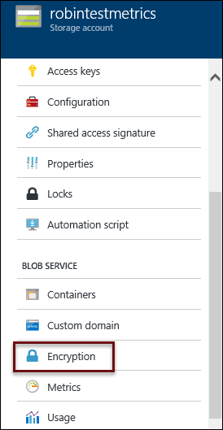
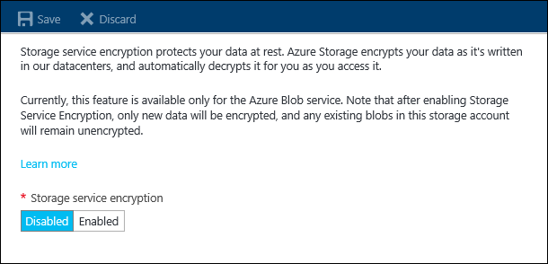

<properties
    pageTitle="Die Verschlüsselung der Azure-Speicher Service von Daten in der restlichen | Microsoft Azure"
    description="Verwenden Sie das Azure-Speicher Dienst Verschlüsselungsfeature, um Ihre Azure BLOB-Speicher auf der Dienstseite verschlüsseln, wenn Sie die Daten speichern, und beim Abrufen der Daten zu entschlüsseln."
    services="storage"
    documentationCenter=".net"
    authors="robinsh"
    manager="carmonm"
    editor="tysonn"/>

<tags
    ms.service="storage"
    ms.workload="storage"
    ms.tgt_pltfrm="na"
    ms.devlang="na"
    ms.topic="article"
    ms.date="09/16/2016"
    ms.author="robinsh"/>

# Service-Verschlüsselung von Daten in der restlichen Azure-Speicher

Azure Speicher Dienst Verschlüsselung (SSE) von Daten in der restlichen hilft Ihnen schützen und schützen Sie Daten, um Ihre Sicherheit in der Organisation und Compliance Zusagen entsprechen. Mit diesem Feature Azure-Speicher automatisch verschlüsselt Ihre Daten vor, um Speicher beibehalten und entschlüsselt vor abrufen. Die Verschlüsselung, entschlüsseln und Key-Verwaltung sind für die Benutzer völlig transparent.

Die folgenden Abschnitte enthalten, dass detaillierte Anleitung zum Verwenden Sie die Verschlüsselung für Speicher-Service-Features sowie die unterstützten Szenarien und Benutzer auftritt.

## (Übersicht)

Azure-Speicher bietet eine umfassende Reihe von Sicherheitsfunktionen, die zusammen Entwickler sichere Applications erstellen können. Daten können mit [Clientseitig Verschlüsselung](storage-client-side-encryption.md), HTTPs oder SMB 3.0 im Übergang zwischen einer Anwendung und Azure gesichert werden. Speicher-Service-Verschlüsselung bietet Verschlüsselung statisch, Behandlung Verschlüsselung, entschlüsseln und Key-Verwaltung vollständig Transparenz im. Alle Daten mit 256-Bit- [AES-Verschlüsselung](https://en.wikipedia.org/wiki/Advanced_Encryption_Standard), eine der verfügbaren sicherste Blockverschlüsselungsalgorithmen verschlüsselt.

SSE funktioniert durch Verschlüsselung der Daten, wenn in Azure-Speicher geschrieben und für blockieren Blobs, Seitenblobs verwendet werden kann und Blobs anfügen. Es funktioniert für Folgendes:

-   Allgemeine Speicher-Konten und Blob-Speicher-Konten
-   Standard und Premium-Speicher 
-   Alle Redundanz Ebenen (LRS, ZRS, GRS, RAS-GRS)
-   Azure Ressourcenmanager Speicher-Konten (aber nicht klassischen) 
-   Alle Bereiche

Zum Aktivieren oder deaktivieren Sie die Verschlüsselung der Speicher-Dienst für ein Speicherkonto, melden Sie sich bei der [Azure-Portal](https://azure.portal.com) , und wählen Sie ein Speicherkonto. Suchen Sie in den Einstellungen Blade Bereich Blob-Service wie in diesem Screenshot dargestellt, und klicken Sie auf Verschlüsselung.

Nachdem Sie die Einstellung für die Verschlüsselung geklickt haben, können Sie aktivieren oder Deaktivieren von Speicher-Service-Verschlüsselung.

##Szenarios für die Verschlüsselung

Bei einem Konto Speichergrenze können Speicher-Service-Verschlüsselung aktiviert sein. Die folgenden Kundenszenarien unterstützt:

-   Verschlüsselung blockieren Blobs, Blobs und Seitenblobs angefügt werden soll.

-   Verschlüsselung von archivierte virtuelle Festplatten und Vorlagen in Azure aus lokalen eingebracht.

-   Die Verschlüsselung der zugrunde liegenden OS und Daten Datenträger für IaaS virtuellen Computern, die mit Ihrem virtuellen Festplatten erstellt.

SSE weist die folgenden Einschränkungen:

-   Klassische Speicherkonten Verschlüsselung wird nicht unterstützt.

-   Klassische Speicher, die Konten in Ressourcenmanager Speicherkonten migriert Verschlüsselung wird nicht unterstützt.

-   Vorhandene Daten - SSE verschlüsselt nur neu erstellte Daten, nachdem die Verschlüsselung aktiviert ist. Wenn beispielsweise ein neues Ressourcenmanager Speicherkonto erstellen, aber keine Verschlüsselung aktivieren, und klicken Sie dann Blobs oder archivierte virtuelle Festplatten dem Konto Speicher hochladen, und aktivieren Sie dann SSE, werden diese Blobs nicht verschlüsselt werden, es sei denn, sie portiert oder kopiert werden.

-   Marketplace-Support - erstellt Verschlüsselung aktivieren von virtuellen Computern aus dem mit der [Azure-Portal](https://portal.azure.com), PowerShell und CLI Azure Marketplace. Das virtuelle Festplatte base Bild bleibt unverschlüsselter; jedoch werden alle schreibt fertig, nachdem Sie der virtuellen Computer erstellt wird, weist verschlüsselt.

-   Tabelle, Warteschlangen und Dateien Daten nicht verschlüsselt.

##Erste Schritte

###Schritt 1: [Erstellen eines neuen Kontos mit Speicher](storage-create-storage-account.md).

###Schritt 2: Aktivieren Sie Verschlüsselung.

Sie können mithilfe der [Azure-Portal](https://portal.azure.com)Verschlüsselung aktivieren.

> [AZURE.NOTE] Wenn Sie programmgesteuert aktivieren oder deaktivieren die Verschlüsselung Speicher Dienst ein Speicherkonto möchten, können Sie die [Azure Speicher Ressource Provider REST-API](https://msdn.microsoft.com/library/azure/mt163683.aspx), [Speicher Anbieter Client Ressourcenbibliothek für .NET](https://msdn.microsoft.com/library/azure/mt131037.aspx), [Azure PowerShell](../powershell-install-configure.md)oder der [CLI Azure](storage-azure-cli.md)verwenden.

###Schritt 3: Kopieren Sie Daten in Speicher-Konto

Wenn Sie SSE auf einem Speicherkonto aktivieren, und Sie dann zu diesem Speicherkonto Blobs schreiben, werden die Blobs verschlüsselt werden. Alle Blobs befindet sich bereits in diesem Storage-Konto werden nicht verschlüsselt werden, bis sie neu geschrieben werden. Sie können kopieren Sie die Daten aus einem Speicher-Konto in eine Datei mit SSE verschlüsselt, oder sogar SSE aktivieren, und kopieren Sie die Blobs aus einem Container in eine andere zu sicher, dass der vorherige Daten verschlüsselt sind. Sie können eine der folgenden Tools dazu verwenden.

#### Verwenden von AzCopy

AzCopy ist ein Windows-Befehlszeilenprogramm zum Kopieren von Daten an und von Microsoft Azure Blob, Datei, und Tabellenspeicher, verwenden einfache Befehle mit optimale Leistung entwickelt. Dies können Sie um Ihre Blobs von einem Speicherkonto in ein anderes zu kopieren, das SSE aktiviert hat. 

Weitere Informationen finden Sie auf [Daten mit AzCopy Befehlszeilenprogramms übertragen](storage-use-azcopy.md).

#### Verwenden die Speicher-Client-Bibliotheken

Sie können BLOB-Daten zu und von Blob-Speicher oder zwischen Speicherkonten mit unserer leistungsfähigen Satz von Speicher Client-Bibliotheken, einschließlich .NET, C++, Java, Android, Node.js, PHP, Python und Ruby kopieren.

Wenn Sie mehr erfahren möchten, besuchen Sie unsere [Erste Schritte mit Azure Blob-Speicher mit .NET](storage-dotnet-how-to-use-blobs.md).

#### Verwenden eines Speicher-Explorers

Speicher-Explorer können Sie Speicherkonten erstellen, hochladen und Herunterladen von Daten, zeigen Sie Inhalt von Blobs und Navigieren durch Verzeichnisse durchsuchen. Sie können eine der folgenden verwenden, Blobs bei Ihrem Speicherkonto mit aktivierter Verschlüsselung hochladen. Mit einigen Explorern Speicher können Sie auch kopieren Sie Daten aus vorhandenen Blob-Speicher in einen anderen Container in der Speicherkonto oder einem neuen Speicherkonto, das SSE aktiviert hat.

Weitere Informationen finden Sie auf [Azure-Speicher-Explorers](storage-explorers.md).

###Schritt 4: Abfrage den Status der verschlüsselten Daten

Eine aktualisierte Version der Bibliotheken Speicher Client wurde bereitgestellt, mit dem Sie den Status eines Objekts, um festzustellen, ob es oder nicht verschlüsselt ist abgefragt. Beispiele für werden in Kürze dieses Dokument hinzugefügt werden.

Sie können in der Zwischenzeit [Kontoeigenschaften abrufen](https://msdn.microsoft.com/library/azure/mt163553.aspx) , um Stellen Sie sicher, dass das Speicherkonto Verschlüsselung aktiviert ist, oder zeigen Sie die Kontoeigenschaften Speicher Azure-Portal aufrufen.

##Verschlüsselung und Entschlüsseln Workflow

Hier ist eine kurze Beschreibung des Workflows Verschlüsselung/entschlüsseln:

-   Der Kunde ermöglicht Verschlüsselung Speicher-Konto an.

-   Wenn der Kunde neue Daten (Blob setzen, blockieren setzen, Seite setzen usw.) in Blob-Speicher schreibt; Jeder schreiben ist verschlüsselt 256-Bit- [AES-Verschlüsselung](https://en.wikipedia.org/wiki/Advanced_Encryption_Standard), eine der verfügbaren sicherste Blockverschlüsselungsalgorithmen verwenden.

-   Wenn der Kunde muss Zugriff auf Daten (Blob erhalten usw.), sind die Daten vor der Rückgabe an den Benutzer automatisch entschlüsselt.

-   Wenn Verschlüsselung deaktiviert ist, neue schreibt nicht mehr verschlüsselt sind und vorhandene verschlüsselte Daten bleibt verschlüsselt, bis vom Benutzer portiert. Während die Verschlüsselung aktiviert ist, werden in Blob-Speicher schreibt verschlüsselt werden. Der Zustand des Daten ändert sich nicht mit dem Benutzer das Umschalten zwischen Aktivieren/Deaktivieren der Verschlüsselung für Speicher-Konto.

-   Alle Schlüssel für die Verschlüsselung werden gespeichert, verschlüsselt und von Microsoft verwaltet.

##Häufig gestellte Fragen zu Speicher-Service-Verschlüsselung für statische Daten

**F: Ich habe ein vorhandenes klassischen Speicherkonto. Kann ich daran SSE aktivieren?**

A: Nein, wird die SSE nur für Ressourcenmanager Speicherkonten unterstützt.

**F: wie kann ich Daten in meinem Speicherkonto klassischen verschlüsseln?**

A: Sie können ein neues Ressourcenmanager Speicherkonto erstellen und Kopieren von Daten mit [AzCopy](storage-use-azcopy.md) aus Ihrem vorhandenen klassischen Speicherkonto bei Ihrem Speicherkonto der neu erstellten Ressourcenmanager. 

Eine weitere Möglichkeit ist Ihr Speicherkonto klassischen bei einer Ressource verwalten Speicher-Konto zu migrieren. Weitere Informationen finden Sie unter [Plattform unterstützt der IaaS Ressourcen für die Migration von Classic an Ressourcen-Manager](https://azure.microsoft.com/blog/iaas-migration-classic-resource-manager/).

**F: Ich habe ein vorhandenes Ressourcenmanager Speicherkonto. Kann ich daran SSE aktivieren?**

A: Ja, aber nur neu geschrieben Blobs werden verschlüsselt werden. Es nicht zurückgehen und verschlüsseln die Daten, die bereits vorhanden ist. 

**F: Ich möchte die aktuellen Daten in ein vorhandenes Ressourcenmanager Speicherkonto verschlüsseln?**

A: Sie können SSE zu einem beliebigen Zeitpunkt in einem Ressourcenmanager Speicherkonto aktivieren. Blobs, die bereits vorhanden waren werden jedoch nicht verschlüsselt werden. Diese Blobs Verschlüsselung, können Sie auf einen anderen Namen oder einen anderen Container kopieren und dann unverschlüsselten Versionen entfernen.

**F: Ich verwende Premium Speicher; kann ich SSE werden verwendet?**

A: Ja, wird die SSE auf Standard Speicherplatz und Premium-Speicher unterstützt.

**F: Wenn ich eines neuen Kontos mit Speicher erstellen SSE aktivieren, und erstellen ein neues virtuellen Computers mit diesem Speicherkonto, bedeutet dies, dass meine virtueller Computer verschlüsselt ist?**

A: Ja. Solange sie erstellt werden, nachdem SSE aktiviert ist werden, alle Datenträger erstellt, mit dem das neue Speicherkonto verschlüsselt werden. Wenn Sie der virtuellen Computer mit Azure Markt erstellt wurde, bleibt das virtuelle Festplatte base Bild unverschlüsselter; jedoch werden alle schreibt fertig, nachdem Sie der virtuellen Computer erstellt wird, weist verschlüsselt.

**F: erstellen kann ich Speicherkonten mit SSE aktiviert mit Azure PowerShell und Azure CLI?**

A: Ja.

**F: wie viel mehr kostet Azure-Speicher Wenn SSE aktiviert ist?**

A: Es ist keine zusätzliche Kosten.

**F: Wer verwaltet die Schlüssel für die Verschlüsselung?**

A: die Tasten werden von Microsoft verwaltet.

**F: verwenden kann ich meinen eigenen Schlüssel für die Verschlüsselung?**

A: Wir sind weiterhin bemüht, Funktionen für Kunden, die eigene Schlüssel für die Verschlüsselung anzuzeigen.

**F: widerrufen kann ich Zugriff auf die Verschlüsselungsschlüssel?**

A: nicht zu diesem Zeitpunkt; die Tasten werden von Microsoft vollständig verwaltet werden.

**F: ist SSE standardmäßig aktiviert, wenn ich ein neues Speicherkonto erstellen?**

A: SSE ist standardmäßig nicht aktiviert. Azure-Portal können Sie es aktivieren. Sie können auch programmgesteuert dieses Feature mithilfe der Speicher Ressource Anbieter REST-API aktivieren.

**F: wie ist dies Laufwerk Azure-Verschlüsselung abweicht?**

A: dieses Feature wird verwendet, um die Daten in Azure Blob-Speicher verschlüsseln. Die Verschlüsselung Azure Festplatten wird verwendet, um die OS und Daten Festplatten in IaaS virtuellen Computern verschlüsseln. Weitere Informationen hierzu finden Sie auf unseren [Speicher Security Guide](storage-security-guide.md).

**F: Was passiert, wenn ich aktivieren SSE, und klicken Sie dann Navigieren in und Azure Datenträger Verschlüsselung auf dem Datenträger aktivieren?**

A: Dies funktioniert nahtlos. Die Daten werden von beiden Methoden verschlüsselt werden.

**F: Mein Speicherkonto eingerichtet wird Geo redundant repliziert werden. Wenn ich SSE aktivieren, werden ebenfalls Meine redundante Kopie verschlüsselt?**

A: Ja, alle Kopien des Speicherkontos verschlüsselt sind, und alle Redundanz Optionen – lokal redundante Speicher (LRS), Zone-redundante Speicher (ZRS), Geo-redundante Speicher (GRS) und Lesezugriff Geo-redundante Speicher (RAS-GRS) – werden unterstützt.

**F: Ich kann nicht auf Mein Speicherkonto Verschlüsselung aktivieren.**

A: ist es ein Ressourcenmanager Speicherkonto? Klassische Speicherkonten werden nicht unterstützt. 

**F: zulässig ist SSE nur in bestimmten Regionen?**

A: der SSE ist in allen Regionen verfügbar. 

**F: Wie nehme ich jemand Kontakt, wenn ich Feedback geben möchten oder haben Probleme?**

A: Wenden Sie sich an [ssediscussions@microsoft.com](mailto:ssediscussions@microsoft.com) nach Problemen im Zusammenhang mit Speicher-Service-Verschlüsselung.

##Nächste Schritte

Azure-Speicher bietet eine umfassende Reihe von Sicherheitsfunktionen, die zusammen Entwickler sichere Applications erstellen können. Weitere Informationen hierzu finden Sie auf der [Speicher Security Guide](storage-security-guide.md).
