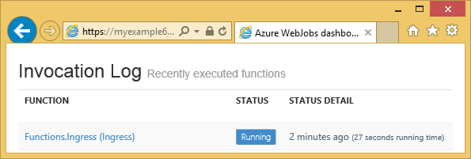

<properties
    pageTitle="Erste Schritte mit Azure-Speicher und Visual Studio verbunden Services (WebJob Projekte)"
    description="Erste Schritte mit Azure Table Storage in einem Projekt Azure WebJobs in Visual Studio nach dem Herstellen einer Verbindung mit einem Speicherkonto mithilfe von Visual Studio verbunden services"
    services="storage"
    documentationCenter=""
    authors="TomArcher"
    manager="douge"
    editor=""/>

<tags
    ms.service="storage"
    ms.workload="web"
    ms.tgt_pltfrm="vs-getting-started"
    ms.devlang="na"
    ms.topic="article"
    ms.date="07/18/2016"
    ms.author="tarcher"/>

# Erste Schritte mit Azure Speicher (Azure WebJob Projekte)

[AZURE.INCLUDE [storage-try-azure-tools-tables](../../includes/storage-try-azure-tools-tables.md)]

## (Übersicht)

Dieser Artikel enthält C#-Codebeispielen, die anzeigen zeigen, wie die Azure WebJobs SDK Version 1.x mit dem Azure Table Storage-Dienst. Die Codebeispielen verwenden Sie die [WebJobs SDK](../app-service-web/websites-dotnet-webjobs-sdk.md) Version 1.x.

Der Speicherdienst Azure Tabelle können Sie große Mengen von strukturierten Daten zu speichern. Der Dienst ist eine NoSQL Datenspeicher, in dem authentifizierten Anrufe von innerhalb und außerhalb der Azure Cloud akzeptiert. Azure Tabellen eignen sich zum Speichern von strukturierten, nicht relationalen Daten.  Weitere Informationen finden Sie unter [Erste Schritte mit Azure Tabellenspeicher .NET verwenden](storage-dotnet-how-to-use-tables.md#create-a-table) .

Einige Codeausschnitte zeigen des Attributs der **Tabelle** in Funktionen, die nicht mithilfe einer der Trigger Attribute manuell, d. h., aufgerufen werden verwendet.

## Zum Hinzufügen von Personen zu einer Tabelle

Wenn Personen zu einer Tabelle hinzufügen möchten, verwenden Sie das Attribut der **Tabelle** mit einer **ICollector<T> ** oder **IAsyncCollector<T> ** Parameter **T** angibt, wo das Schema der Personen, die Sie hinzufügen möchten. Der Attributkonstruktor hat einen Parameter, der mit dem Namen der Tabelle enthält.

Im folgenden Beispiel wird eine Tabelle mit dem Namen *eingehende* **Person** Personen hinzugefügt.

        [NoAutomaticTrigger]
        public static void IngressDemo(
            [Table("Ingress")] ICollector<Person> tableBinding)
        {
            for (int i = 0; i < 100000; i++)
            {
                tableBinding.Add(
                    new Person() {
                        PartitionKey = "Test",
                        RowKey = i.ToString(),
                        Name = "Name" }
                    );
            }
        }

In der Regel der Typ mit **ICollector** verwendeten **TableEntity** abgeleitet oder implementiert **ITableEntity**, aber nicht müssen. Eine der folgenden **Person** Klassen arbeiten mit den Code in die vorherige **eingehende** Methode angezeigt.

        public class Person : TableEntity
        {
            public string Name { get; set; }
        }

        public class Person
        {
            public string PartitionKey { get; set; }
            public string RowKey { get; set; }
            public string Name { get; set; }
        }

Wenn Sie direkt mit den Azure-Speicher-API arbeiten möchten, können Sie einen **CloudStorageAccount** -Parameter der Methode Signatur hinzufügen.

## Überwachung in Echtzeit

Da Daten eingehende Funktionen häufig große Datenmengen verarbeiten, enthält das WebJobs SDK Dashboard Überwachung Echtzeitdaten aus. Im **Aufrufen Log** -Abschnitt erfahren Sie, ob die Funktion noch ausgeführt wird.

Die Seite **Details aufrufen** Berichte der Funktion Fortschritt (Anzahl von Elementen, die geschrieben) während er ausgeführt wird, und Ihnen eine Verkaufschance gibt, um ihn abzubrechen.

Klicken Sie nach Abschluss die Funktion Berichte die Seite **Details aufrufen** die Anzahl der Zeilen geschrieben.

## Zum Lesen von mehreren Personen aus einer Tabelle

Wenn Sie eine Tabelle lesen möchten, verwenden Sie das Attribut der **Tabelle** mit einer **IQueryable<T> ** Parameter, in dem Typ **T** **TableEntity** abgeleitet oder **ITableEntity**implementiert.

Im folgenden Beispiel liest und alle Zeilen aus der Tabelle **eingehende** protokolliert:

        public static void ReadTable(
            [Table("Ingress")] IQueryable<Person> tableBinding,
            TextWriter logger)
        {
            var query = from p in tableBinding select p;
            foreach (Person person in query)
            {
                logger.WriteLine("PK:{0}, RK:{1}, Name:{2}",
                    person.PartitionKey, person.RowKey, person.Name);
            }
        }

### So lesen Sie eine einzelne Entität aus einer Tabelle

Es gibt eine **Tabelle** Attributkonstruktor mit zwei zusätzliche Parameter, mit denen Sie die Partitionsschlüssel und Zeilenschlüssel angeben, wenn Sie auf eine einzelne Tabellenentität binden möchten.

Im folgenden Beispiel liest Tabellenzeilen für eine **Person** Entität basierend auf Partition Schlüssel und Zeile Schlüsselwerte in einer Warteschlange-Nachricht empfangen:  

        public static void ReadTableEntity(
            [QueueTrigger("inputqueue")] Person personInQueue,
            [Table("persontable","{PartitionKey}", "{RowKey}")] Person personInTable,
            TextWriter logger)
        {
            if (personInTable == null)
            {
                logger.WriteLine("Person not found: PK:{0}, RK:{1}",
                        personInQueue.PartitionKey, personInQueue.RowKey);
            }
            else
            {
                logger.WriteLine("Person found: PK:{0}, RK:{1}, Name:{2}",
                        personInTable.PartitionKey, personInTable.RowKey, personInTable.Name);
            }
        }

In diesem Beispiel die **Person** -Klasse hat keinen **ITableEntity**implementieren.

## So verwenden Sie die .NET-API direkt für die Arbeit mit einer Tabelle

Sie können auch das Attribut der **Tabelle** mit einem Objekt **CloudTable** für größere Flexibilität bei der Arbeit mit einer Tabelle verwenden.

Im folgenden Beispiel wird verwendet ein Objekt **CloudTable** eine einzelne Entität in der Tabelle *eingehende* hinzuzufügen.

        public static void UseStorageAPI(
            [Table("Ingress")] CloudTable tableBinding,
            TextWriter logger)
        {
            var person = new Person()
                {
                    PartitionKey = "Test",
                    RowKey = "100",
                    Name = "Name"
                };
            TableOperation insertOperation = TableOperation.Insert(person);
            tableBinding.Execute(insertOperation);
        }

Weitere Informationen dazu, wie Sie das Objekt **CloudTable** verwenden finden Sie unter [Erste Schritte mit Azure Tabellenspeicher .NET verwenden](storage-dotnet-how-to-use-tables.md).

## Verwandte Themen durch Warteschlangen unterstützenden Artikel

Informationen zur Behandlung von Tabelle Verarbeitung ausgelöst, indem Sie eine Nachricht Warteschlange oder für WebJobs SDK Szenarien nicht spezifisch für die Verarbeitung von Tabelle, finden Sie unter [Erste Schritte, mit Azure Warteschlange-Speicher und Visual Studio verbundenen Services (WebJob Projekte)](vs-storage-webjobs-getting-started-queues.md).

## Nächste Schritte

In diesem Artikel hat Codebeispielen bereitgestellt, die veranschaulichen, allgemeine Szenarien für das Arbeiten mit Azure Tabellen zu behandeln. Weitere Informationen zum Verwenden von Azure WebJobs und das WebJobs SDK finden Sie unter [Azure WebJobs Dokumentationsressourcen](http://go.microsoft.com/fwlink/?linkid=390226).
