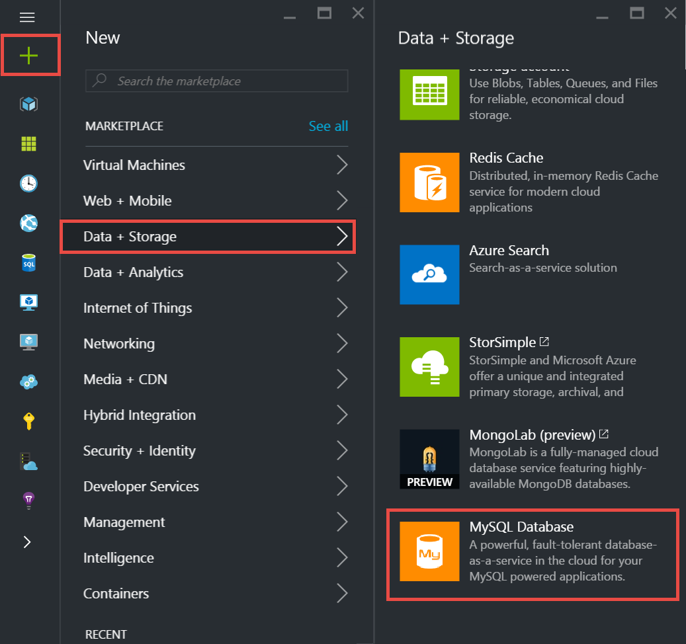
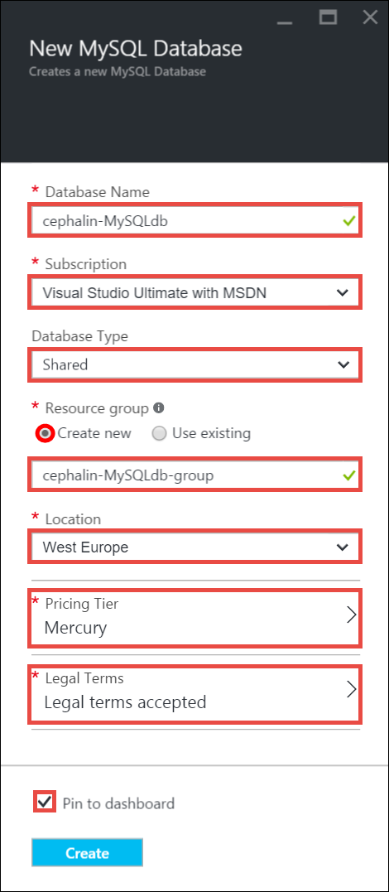
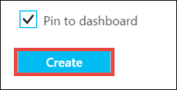
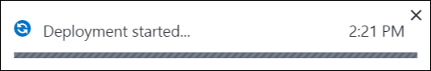
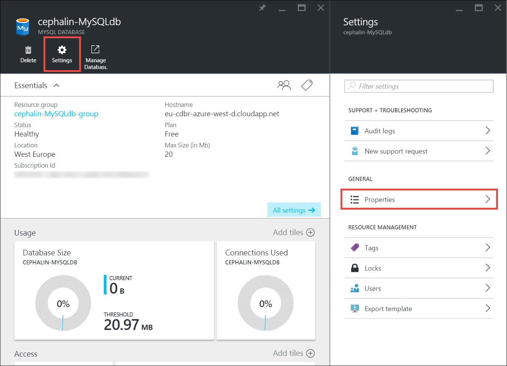
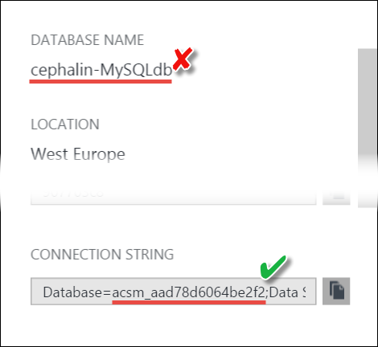
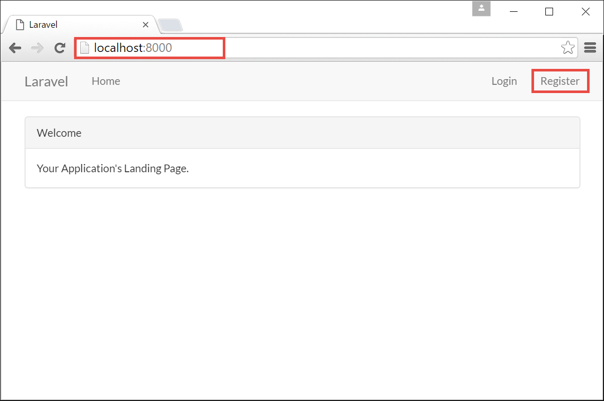
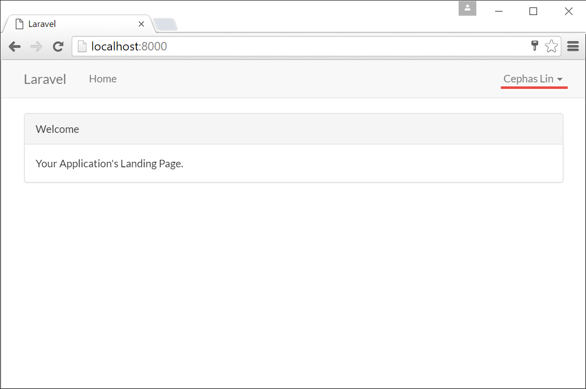
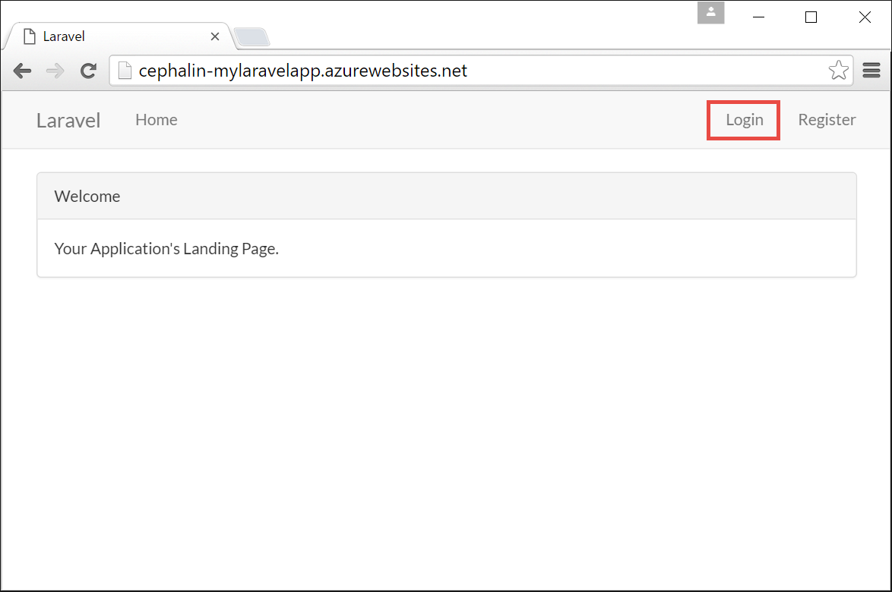
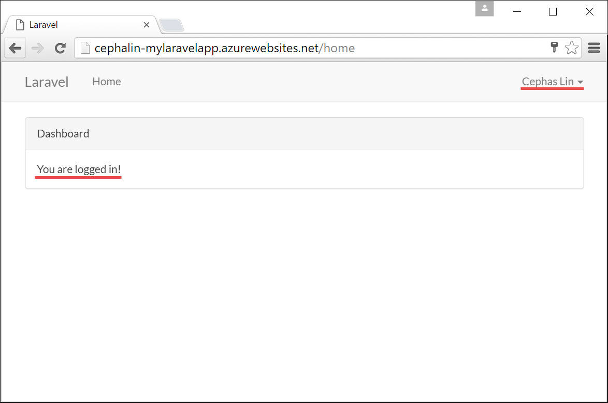

<properties
    pageTitle="Erstellen und Verbinden mit einer MySQL-Datenbank in Azure"
    description="Informationen Sie zum Verwenden des Azure-Portals zu eine MySQL-Datenbank erstellen und dann aus einer PHP Web app in Azure zu verbinden."
    documentationCenter="php"
    services="app-service\web"
    authors="cephalin"
    manager="wpickett"
    editor=""
    tags="mysql"/>

<tags
    ms.service="multiple"
    ms.workload="data-management"
    ms.tgt_pltfrm="na"
    ms.devlang="PHP"
    ms.topic="article"
    ms.date="08/11/2016"
    ms.author="robmcm;cephalin"/>

# Erstellen und Verbinden mit einer MySQL-Datenbank in Azure

In diesem Lernprogramm erfahren Sie zum Erstellen einer MySQL-Datenbank in das [Azure-Portal](https://portal.azure.com) (Anbieter ist [ClearDB](http://www.cleardb.com/)) und wie Sie von einer PHP Web app im [Azure App-Dienst](./app-service/app-service-value-prop-what-is.md)herstellen. 

> [AZURE.NOTE] Sie können auch eine MySQL-Datenbank als Teil einer [Vorlage für Store-app](./app-service-web/app-service-web-create-web-app-from-marketplace.md)erstellen.

## Erstellen einer MySQL-Datenbank Azure-Portal

Zum Erstellen einer MySQL-Datenbank im Azure-Portal führen Sie folgende Schritte aus:

1. Melden Sie sich mit dem [Azure-Portal](https://portal.azure.com)an.

2. Klicken Sie auf **neu**, wählen Sie im Menü links > **Daten + Speicher** > **MySQL-Datenbank**.

    

2. Konfigurieren Sie in das neue MySQL-Datenbank [Blade](azure-portal-overview.md), die neue MySQL-Datenbank wie folgt (*Blade*: eine Portalseite, der horizontal angezeigt wird):

    - **Datenbankname**: Geben Sie einen Namen eindeutig identifiable
    - **Abonnements**: Wählen Sie das Abonnement verwenden
    - **Datenbanktyp**: Wählen Sie **freigegeben** für LC- oder kostenlosen Ebenen oder **dedizierte** dedizierte Ressourcen abrufen. 
    - **Ressourcengruppe**: Hinzufügen die MySQL-Datenbank zu einer vorhandenen [Ressourcengruppe](../azure-resource-manager/resource-group-overview.md) oder auf eine neue platzieren. Ressourcen in derselben Gruppe können einfach zusammen verwaltet werden.
    - **Standort**: Wählen Sie eine Stelle in der Nähe Sie aus. Beim Hinzufügen einer vorhandenen Gruppe für Ressourcen, die Sie zum Speicherort der Ressourcengruppe gesperrt sind.
    - **Preise in**: Klicken Sie auf die **Preise in**, und wählen Sie dann eine der Optionen für Preisgestaltung (**Quecksilber** Ebene ist kostenlos), und klicken Sie dann auf **auswählen**. 
    - **Vertragsbedingungen**: Klicken Sie auf **Vertragsbedingungen**, prüfen Sie die Details erwerben und auf **erwerben**.
    - **PIN zum Dashboard**: Wählen Sie aus, wenn Sie es direkt aus dem Dashboard zugreifen möchten. Dies ist besonders hilfreich, wenn Sie nicht mit dem Portal Navigationsbereich noch nicht vertraut sind.
    
    Das folgende Bildschirmabbild ist nur ein Beispiel, wie Sie Ihre MySQL-Datenbank konfigurieren können.  
    

3. Wenn Sie damit fertig sind konfiguriert haben, klicken Sie auf **Erstellen**.

    

    Sie sehen eine Popupbenachrichtigung Vermietung, die Sie wissen, dass die Bereitstellung gestartet hat.

    

    Ein anderes erhalten Popupmenü Sie nach der Bereitstellung erfolgreich war. Im Portal wird auch der MySQL-Datenbank Blade automatisch geöffnet werden.

## Verbinden Sie mit Ihrer MySQL-Datenbank

Um die Verbindungsinformationen für die neue MySQL-Datenbank anzuzeigen, klicken Sie einfach in der Web-app Blade auf **Eigenschaften** .
    

Sie können nun die Verbindungsinformationen in eine beliebige Web app verwenden. Ein Beispiel, das zeigt, wie die Verbindungsinformationen in einer einfachen app von PHP verwendet steht [hier](https://github.com/WindowsAzure/azure-sdk-for-php-samples/tree/master/tasklist-mysql).

## Verbinden einer Laravel Web app (aus dem PHP erste Schritte Lernprogramm)

Nehmen Sie an, dass Sie das Lernprogramm [erstellen, konfigurieren und Bereitstellen einer PHP Web app in Azure](./app-service-web/app-service-web-php-get-started.md) soeben und haben Sie eine [Laravel](https://www.laravel.com/) Web-app in Azure ausgeführt. Sie können ganz einfach Datenbankfunktionen zu Ihrer Anwendung Laravel hinzufügen. Befolgen Sie die folgenden Schritte aus:

>[AZURE.NOTE] Den folgenden Schritten wird vorausgesetzt, dass Sie das Lernprogramm [erstellen, konfigurieren und Bereitstellen einer PHP Web app in Azure](./app-service-web/app-service-web-php-get-started.md)eingegeben haben.

1. Konfigurieren der app Laravel in Ihrer Umgebung lokale Entwicklung auf der MySQL-Datenbank verweisen. Öffnen Sie hierzu `.env` aus der Laravel-app im Stammverzeichnis, und konfigurieren Sie die MySQL-Datenbank-Optionen.

        DB_CONNECTION=mysql
        DB_HOST=<HOSTNAME_from_properties_blade>
        DB_PORT=<PORT_from_properties_blade>
        DB_DATABASE=<see_note_below>
        DB_USERNAME=<USERNAME_from_properties_blade>
        DB_PASSWORD=<PASSWORD_from_properties_blade>

    >[AZURE.NOTE] Der Name der MySQL-Datenbank möglicherweise das Blade **Eigenschaften** oder möglicherweise nicht in dem Feld **Datenbankname** dargestellt. Es empfiehlt sich, überprüfen Sie den Datenbank-Parameter in das Feld **VERBINDUNGSZEICHENFOLGE** . 
    >
    >

2. Die schnellste Möglichkeit, stellen Sie sicher, dass Sie MySQL jetzt zugreifen besteht darin, [Laravels Standard-Authentifizierung Gerüstbau](https://laravel.com/docs/5.2/authentication#authentication-quickstart)verwenden. Führen Sie folgende Befehle in die Befehlszeile Terminal aus Stammverzeichnis der Laravel-app:

         php artisan migrate
         php artisan make:auth

    Der erste Befehl erstellt die Tabellen in Azure basierend auf vordefinierten Migration in der `database/migrations` Directory und den zweiten Befehl scaffolds die grundlegende Ansichten und Arbeitspläne für Benutzer Registrierung und Authentifizierung.

3. Den Entwicklungsserver jetzt ausführen:

        php artisan serve

4. Klicken Sie im Browser navigieren Sie zu Http://localhost:8000 und registrieren Sie einen neuen Benutzer, wie dargestellt:

    

    Führen Sie die Registrierung Abfragen über die Benutzeroberfläche abgeschlossen. Sobald die Registrierung abgeschlossen ist, werden Sie angemeldet sein.
    
    

    Sie sind jetzt Ihre app anhand der MySQL-Datenbank in Azure entwickeln.

5. Nun müssen Sie nur repliziert Ihre `.env` Einstellungen Azure Web app. Führen Sie die folgenden Azure CLI-Befehle:

        azure site appsetting add DB_CONNECTION=mysql
        azure site appsetting add DB_HOST=<HOSTNAME_from_properties_blade>
        azure site appsetting add DB_PORT=<PORT_from_properties_blade>
        azure site appsetting add DB_DATABASE=<Database_param_from_CONNECTION_INFO_from_properties_blade>
        azure site appsetting add DB_USERNAME=<USERNAME_from_properties_blade>
        azure site appsetting add DB_PASSWORD=<PASSWORD_from_properties_blade>

    Erfahren Sie, wie dies in [Konfigurieren des Azure Web app](./app-service-web/app-service-web-php-get-started.md#configure)funktioniert.

6. Als Nächstes abzuschließen, und drücken Sie die lokale geänderte zuvor während der Ausführung in Azure `php artisan make:auth`.

        git add .
        git commit -m "scaffold auth views and routes"
        git push azure master

7. Navigieren Sie zu der Azure Web app.

        azure site browse

8. Melden Sie sich mit den Anmeldeinformationen, die Sie zuvor erstellt haben.

    

    Nachdem Sie angemeldet haben, sollte den Anzeige nach der Anmeldebildschirm angezeigt werden.
    
    

    Herzlichen Glückwunsch, PHP Web app in Azure ist jetzt den Zugriff auf Daten aus der MySQL-Datenbank. 

## Nächste Schritte

Weitere Informationen finden Sie im [Developer Center von PHP](/develop/php/).
