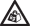

<properties
   pageTitle="Installieren Sie das Gerät StorSimple 8100 | Microsoft Azure"
   description="Beschreibt, wie entpacken, bereitstellen, oder Ihrem Gerät StorSimple 8100 Kabel, bevor Sie beim Bereitstellen und konfigurieren die Software."
   services="storsimple"
   documentationCenter="NA"
   authors="alkohli"
   manager="carmonm"
   editor="" />
<tags
   ms.service="storsimple"
   ms.devlang="NA"
   ms.topic="article"
   ms.tgt_pltfrm="NA"
   ms.workload="TBD"
   ms.date="08/17/2016"
   ms.author="alkohli" />

# Entpacken, Rackmontage, und das Kabel von Ihrem Geräts StorSimple 8100

## (Übersicht)

Ihre Microsoft Azure StorSimple 8100 ist eine einzelne Einheit rackmontierte Gerät. In diesem Lernprogramm wird erläutert, wie entpacken, Rackmontage und Kabel 8100 StorSimple Gerätehardware bevor Sie konfigurieren und das Gerät StorSimple bereitstellen.

## Ihr Gerät StorSimple 8100 Entpacken

Die folgenden Schritte bieten klare, detaillierte Anweisungen dazu, wie Sie das Speichergerät StorSimple 8100 entpacken. Dieses Gerät wird in ein einzelnes Feld geliefert.

### Bereiten Sie auf Ihrem Gerät Entpacken vor

Bevor Sie Ihr Gerät entpacken, überprüfen Sie die folgende Informationen ein.

 **Warnung!**

1. Stellen Sie sicher, dass Sie zwei Personen verfügbar haben, die Stärke der Einheit verwalten, wenn Sie es manuell verarbeiten. Eine vollständig konfigurierte Einheit kann bis zu 32 kg (70 Pfund) abzuwägen.
1. Platzieren Sie das Feld auf einer flachen, Ebene Oberfläche aus.

Als Nächstes führen Sie die folgenden Schritte aus, um Ihr Gerät entpacken.

#### Auf Ihrem Gerät Entpacken

1. Prüfen Sie im Feld und der Verpackung Schaum für Crushes, schneidet, Wasser Schäden oder eine beliebige andere sichtbare Beschädigung. Wenn das Feld oder Verpackung schwer beschädigt ist, führen Sie im Feld nicht geöffnet werden. Nehmen Sie [an den Microsoft-Support](storsimple-contact-microsoft-support.md) , um Ihnen dabei helfen festzustellen, ob das Gerät ordnungsgemäß funktioniert.

2. Entpacken Sie das Feld ein. Die folgende Abbildung zeigt die entpackte Ansicht Ihres Geräts StorSimple.

     

    **Das Speichergerät entpackt Ansicht**

     Beschriftung | Beschreibung
     ----- | -------------
     1     | Verpackung-Feld
     2     | Unten Schaum
     3     | Gerät
     4     | Oberen Schaumstoffrands
     5     | Zubehör-Feld

3. Nach dem Entpacken im Feld an, stellen Sie sicher, dass Sie haben:

   - 1 einzelne Einheit Gerät
   - 2 Kabel
   - 1 Übergang Ethernet-Kabel
   - 2 serielle Console-Kabel
   - 1 fortlaufende USB-Konverter für serielle Zugriff
   - 1 unbefugtem T10 Schraubendreher
   - 4 QSFP-zu-SFP + Netzwerkadapter für die Verwendung mit 10 GbE-Netzwerk-Schnittstellen
   - 1 Rackmontage Kit (2 Halteschienen mit Hardware bereitstellen)
   - Erste Schritte-Dokumentation

    Wenn Sie keine der oben aufgeführten Elemente erhalten haben [wenden Sie sich an Microsoft Support](storsimple-contact-microsoft-support.md).

Im nächsten Schritt wird auf Ihrem Gerät Rackmontage.

## Ihr Gerät StorSimple 8100 für Rackmontage

Folgen Sie den nächsten Schritten fort, um Ihre StorSimple 8100 Speichergerät in einem standardmäßigen 19-Zoll den Shapes für Gestelle mit Vorder- und Rückseite Beiträge zu installieren. Das Gerät StorSimple 8100 verfügt über eine einzelne primäre Einheit.

Die Installation umfasst mehrere Schritte, von die jede in den folgenden Verfahren erläutert wird.

> [AZURE.IMPORTANT]
StorSimple Geräte muss den Shapes für Gestelle für die ordnungsgemäße Funktion bereitgestellt.

### Vorbereiten der Website

Das Gerät muss in ein 19-Zoll Standardgestell installiert sein, die an der Vorder- und Rückseite Beiträge enthält. Gehen Sie folgendermaßen vor, So bereiten Sie den Shapes für Gestelle Installation.

#### So bereiten Sie den Shapes für Gestelle Installation die Website

1. Stellen Sie sicher, dass das Gerät sicher auf einer flachen, beständig und Ebene einbinden (oder eine ähnliche) hängen davon ab.

2. Stellen Sie sicher, dass die Website für einrichten möchten standard Netz-auf eine unabhängige Quelle oder eine den Shapes für Gestelle Stromverteilungseinheit (PDU) mit einer Stromversorgungssystem (USV) verfügt.

3. Sicherstellen Sie, dass diesem eine 2 HE Slot auf die Shapes für Gestelle verfügbar ist, in der Sie das Gerät bereitstellen möchten.

 **Warnung!**

Stellen Sie sicher, dass Sie zwei Personen verfügbar haben, die Stärke verwalten, wenn Sie die Geräte-Einrichtung manuell verarbeiten. Eine vollständig konfigurierte Einheit kann bis zu 32 kg (70 Pfund) abzuwägen.

### Den Shapes für Gestelle erforderliche Komponenten

Die Einheit 8100 ist für die Installation in einer Standardansicht 19-Zoll den Shapes für Gestelle mit CAB entwickelt:

- Minimale Tiefe 27.84 Zoll aus den Shapes für Gestelle Beitrag zum Bereitstellen.
- Maximale Stärke von 32 Kilogramm für das Gerät
- Maximalen zurück Druck von 5 Pascal (0,5 mm Wasser Monitor).

### Set zur Gestellmontage Rail enthalten

Eine Reihe von Montageschienen ist für die Verwendung mit 19 Zoll-Racks bereitgestellt. Die Schienen wurden getestet, um die Stärke der maximalen Einheit behandeln. Diese Installation von mehreren Anlagen ohne Verlust von Speicherplatz innerhalb der Shapes für Gestelle wird auch lässt.

#### So installieren Sie das Gerät auf die Schienen

2. Führen Sie diesen Schritt nur, wenn innere Schienen nicht auf Ihrem Gerät installiert werden. Normalerweise werden die inneren Schienen bei der Factory installiert. Wenn Schienen nicht installiert werden, installieren Sie die Folien-Rail links und rechts-Rail an den Seiten des Gehäuse an. Diese Anfügen mit sechs metrischen Schrauben auf jeder Seite. Zur Unterstützung Ausrichtung Rail Folien **LH – den Vordergrund** und **Root-Hub – Vorderseite**markiert sind, und das Ende, das nach hinten der Einheit angebracht wurde hat eine Variable Ende. 

    
    **Anfügen innere Rail Folien, die an den Rändern der Einheit**

       Beschriftung | Beschreibung
       ----- | -----------
       1     | M 3 x 4 Schaltfläche-Kopf Schrauben
       2     | Gehäuse Folien

3. Äußeren linken Rail und äußere rechte Rail Assemblys an den Shapes für Gestelle CAB vertikale Mitglieder anschließen. Die Klammern werden **LH**, **Root-Hub**und **dieser Seite nach oben** , um Sie schrittweise durch die richtige Ausrichtung markiert.

4. Suchen Sie die Stifte Rail bei der Vorder- und Rückseite der Rail Assembly aus. Erweitern Sie die Rail, um zwischen der Beiträge den Shapes für Gestelle anpassen und die Stifte in der Vorder- und Rückseite den Shapes für Gestelle Beitrag vertikale Mitglied Lücken einzufügen. Achten Sie darauf, dass die Schiene Ebene ist.

5. Verwenden Sie zwei der mitgelieferten Schrauben metrischen an, um die Schiene an den vertikalen Mitglieder sichern. Verwenden Sie eine Schrauben in den Vordergrund stellen und eine auf der Rückseite an.

6. Wiederholen Sie diese Schritte für die andere Schiene. 

     

    **Äußere Rail Assemblys Anfügen an den**

     Beschriftung | Beschreibung
     ----- | -----------
     1     | Effektive Schrauben
     2     | Den Shapes für Vorder-Gestelle Quadrat-Loch Beitrag Schrauben
     3     | Linke Rail front Speicherort Stifte
     4     | Effektive Schrauben
     5     | Linke Rail Rückseite Speicherort Stifte

### Das Gerät in der Shapes für Gestelle bereitstellen

Verwenden die Rackschienen, die gerade installiert wurden, führen Sie die folgenden Schritte aus, um das Gerät in der Shapes für Gestelle bereitzustellen.

#### Das Gerät bereitstellen.

1. Heben Sie die Einheit einen Assistenten und richten Sie es mit den Rackschienen.

2. Fügen Sie das Gerät sorgfältig in den Schienen, und klicken Sie dann schieben Sie das Gerät vollständig in die Shapes für Gestelle CAB. 

    

    **Das Gerät in der Shapes für Gestelle bereitstellen**

3. Entfernen Sie die Links und rechts vorne Flansch FESTSTELLTASTE durch Ziehen der FESTSTELLTASTE kostenlos. Die FESTSTELLTASTE Flansch ausrichten einfach auf die Flansche.

5. Sichern Sie die Einheit, in der Shapes für Gestelle nach der Installation von einer bereitgestellten Kreuzschlitzschraube durch jeden Flansch, nach links und rechts ein.

4. Installieren der FESTSTELLTASTE Flansch, indem Sie diese an seiner Position und Ausrichten von diesen Ort an. 

     

    **Installieren der FESTSTELLTASTE Flansch**

     Beschriftung | Beschreibung
     ----- | -----------
     1     | Anlage Verschlüssen Schrauben

Im nächsten Schritt wird auf Ihrem Gerät für Power, Netzwerk- und seriellen Zugriff Kabel.

## Ihr Gerät StorSimple 8100 Kabel

Die folgenden Verfahren erläutert, wie Sie Ihr Gerät StorSimple 8100 für Power, Netzwerk- und seriellen Verbindungen Kabel wird.

### Erforderliche Komponenten

Bevor Sie das Kabel des Geräts beginnen, müssen Sie:

- Ihre Speichergerät, vollständig entpackt und den Shapes für Gestelle bereitgestellt.

- 2 Power-Kabel, die Lieferumfang des Geräts

- Zugriff auf 2 Power Verteilung Einheiten (empfohlen).

- Netzwerkkabel

- Serielle Kabel bereitgestellt

- Serielle USB-Konverter mit den entsprechenden Treiber auf Ihrem PC installiert ist (falls erforderlich)

- 4 QSFP bereitgestellten-zu-SFP + Netzwerkadapter für die Verwendung mit 10 GbE-Netzwerk-Schnittstellen

- [Unterstützte Hardware für die 10 Switch-Netzwerk-Schnittstellen auf Ihrem Gerät StorSimple](storsimple-supported-hardware-for-10-gbe-network-interfaces.md)

### Power-Kabel

Ihr Gerät enthält redundant Power und Kühlmodule (PCMs). Sowohl PCMs installiert und bei einer Verbindung zu anderen Power Quellen hohen Verfügbarkeit sichergestellt werden muss.

Führen Sie die folgenden Schritte aus, um Ihr Gerät für Power Kabel an.

[AZURE.INCLUDE [storsimple-cable-8100-for-power](../../includes/storsimple-cable-8100-for-power.md)]

### Netzwerkkabel

Ihr Gerät ist eine aktiv-Standby-Konfiguration: angegebenen jederzeit eine Controller-Modul aktiv ist und alle Datenträger und das Netzwerk Vorgänge während der Controller-Modul Verarbeitung auf Standby. Ein Controller schlägt fehl, der standby Controller sofort aktiviert ist und alle Datenträger und Netzwerke Operationen weiterhin.

Um diese Failoversupport redundante Controller, müssen Sie Ihr Gerätenetzwerk Kabel wie in den folgenden Schritten beschrieben.

#### Mit Netzwerkverbindung-Kabel

1. Ihr Gerät verfügt über sechs Netzwerk-Schnittstellen jeder Controller: vier 1 Gbps, und zwei 10 Gbps Ethernet-ports. Identifizieren Sie die verschiedenen Datenports der Rückwandplatine von Ihrem Gerät.

    

    **Anzeigen von Datenports wieder des Geräts**

     Beschriftung   | Beschreibung
     ------- | -----------
     0,1,4,5 |  1 Switch Netzwerk-Schnittstellen
     2, 3     | 10 GbE-Netzwerk-Schnittstellen
     6       | Serielle ports

2. Das folgende Diagramm für Netzwerkkabel finden Sie unter. (Die minimalen Netzwerkkonfiguration wird von einer durchgezogenen blauen Linie angezeigt. Zusätzliche Konfiguration erforderlich, um hohe Verfügbarkeit und Leistung wird durch gepunktete Linien angezeigt.)

    

    **Netzwerk-Kabel für Ihr Gerät**

  	|Beschriftung | Beschreibung |
  	|----- | ----------- |
  	| A    | LAN mit Zugriff auf das Internet |
  	| B    | Controller 0 |
  	| C    | PCM 0 |
  	| D    | Controller 1 |
  	| E    | PCM 1 |
  	| F, G | Hosts |
  	| 0-5  | Netzwerk-Schnittstellen |

Wenn Sie das Gerät, Kabel die minimale Konfiguration erfordert:

- Mindestens zwei Netzwerk-Schnittstellen eine Verbindung mit jeder Controller mit eine cloudzugriff und eine für iSCSI. Die Daten 0 Port automatisch aktiviert und konfiguriert über die serielle Konsole des Geräts. Abgesehen von Daten 0 muss eine andere Datenport auch über das Azure klassischen Portal konfiguriert sein. In diesem Fall Verbinden der Daten 0 Port mit dem primären LAN (Netzwerk mit Zugriff auf das Internet). Die Daten-Ports können mit SAN/iSCSI LAN (VLAN) Segment des Netzwerks, je nach die gewünschte Rolle verbunden sein.

- Identische Schnittstellen auf jedem Controller verbunden mit dem gleichen Netzwerk, um die Verfügbarkeit sicherzustellen, wenn ein Controller ausgeführt wird. Wenn Sie Daten 0 und 3 von Daten für einen der Controller Verbindung auswählen, müssen Sie beispielsweise die entsprechenden Daten 0 und 3 von Daten auf dem anderen Controller zu verbinden.

Beachten Sie, um hohe Verfügbarkeit und Leistung:

- Wenn möglich, konfigurieren Sie ein Paar von Netzwerk-Benutzeroberfläche für cloudzugriff (1 Switch) und ein weiteres Paar für iSCSI (10 GbE empfohlen) auf jedem Controller.

- Wenn möglich, Netzwerk-Schnittstellen aus jeder Controller Herstellen einer Verbindung mit zwei verschiedenen wechselt zur Sicherstellung der Verfügbarkeit anhand eines Fehlers wechseln. Die Abbildung zeigt die zwei 10 GbE-Netzwerk-Schnittstellen, Daten 2 und 3 von Daten aus jeder Controller mit zwei verschiedenen Schalter verbunden.

Weitere Informationen finden Sie in der **Netzwerk-Schnittstellen** unter den [Anforderungen der hohen Verfügbarkeit für Ihr Gerät StorSimple](storsimple-system-requirements.md#high-availability-requirements-for-storsimple).

>[AZURE.NOTE] Wenn Sie Ihre 10 Switch-Netzwerk-Schnittstellen SFP + Transceiver mit sind, verwenden Sie die bereitgestellten QSFP-SFP + Netzwerkadapter. Weitere Informationen finden Sie auf [unterstützte Hardware für die 10 Switch-Netzwerk-Schnittstellen auf Ihrem Gerät StorSimple](storsimple-supported-hardware-for-10-gbe-network-interfaces.md).

### Serieller Anschluss Kabel

Führen Sie die folgenden Schritte aus, um Ihre serielle Anschluss Kabel an.

#### Kabel für serielle Verbindung

1. Ihr Gerät verfügt über einen seriellen Anschluss auf jedem Controller, die von einem Schraubenschlüsselsymbol angegeben ist. Schlagen Sie in der Abbildung im Abschnitt [Netzwerk Kabel](#network-cabling) , die seriellen Ports der Rückwandplatine Ihres Geräts gesucht werden soll.

2. Ermitteln des aktiven Controllers auf Ihrem Gerät Rückwandplatine an. Eine blinkende blaue LED zeigt an, dass der Controller aktiv ist.

3. Verwenden Sie die bereitgestellten seriellen Kabel (falls erforderlich, den USB-Seriell-Konverter für Ihr Notebook), und verbinden Sie Ihre Konsole oder Computer (mit Terminalemulation am Gerät) mit dem seriellen Anschluss von der aktiven Controller.

4. Installieren Sie die fortlaufende USB-Treiber (im Lieferumfang des Geräts) auf Ihrem Computer.

5. Richten Sie die serielle Verbindung wie folgt: 115.200 Baud, 8 Data Bits, 1 Stoppbit, keine Unstimmigkeit und strömungsregelung keine festlegen.

6. Stellen Sie sicher, dass die Verbindung durch Drücken der EINGABETASTE auf der Konsole arbeitet. Ein Menü mit seriellen Konsole sollte angezeigt werden.

>[AZURE.NOTE] **Standortunabhängiger**: Wenn Sie das Gerät in einem remote Datencenter oder in einem Chatroom Computer mit beschränkter Zugriff installiert ist, stellen Sie sicher, dass die seriellen Verbindungen mit beide Controller immer mit einer seriellen Konsole wechseln oder ähnliche Geräte verbunden sind. Dadurch wird Out-of-Band-Fernbedienung und Support-Prozesse Wenn Netzwerk Ausbluten oder unerwarteter Fehler vorhanden sind.

Ihr Gerät ist nun für Power, Netzwerkzugriff und serielle Konnektivität verbunden. Im nächsten Schritt wird zum Konfigurieren der Software und Ihrem Gerät bereitstellen.

## Nächste Schritte

Erfahren Sie, wie zum [Bereitstellen und Konfigurieren von Ihrem lokalen StorSimple Gerät](storsimple-deployment-walkthrough.md).
