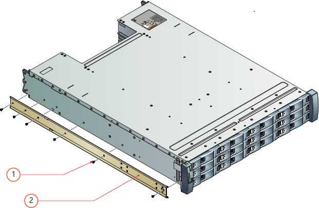
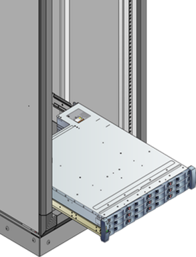

<properties
   pageTitle="Installieren Sie das Gerät StorSimple 8600 | Microsoft Azure"
   description="Beschreibt, wie entpacken, bereitstellen, oder Ihrem Gerät StorSimple 8600 Kabel, bevor Sie beim Bereitstellen und konfigurieren die Software."
   services="storsimple"
   documentationCenter="NA"
   authors="alkohli"
   manager="carmonm"
   editor="" />
<tags
   ms.service="storsimple"
   ms.devlang="NA"
   ms.topic="article"
   ms.tgt_pltfrm="NA"
   ms.workload="TBD"
   ms.date="10/24/2016"
   ms.author="alkohli" />

# Entpacken, Rackmontage, und das Kabel von Ihrem Geräts StorSimple 8600

## (Übersicht)
Ihre Microsoft Azure StorSimple 8600 ist ein Gerät mit zwei Einheit und besteht aus einer primären und eine Anlage EBOD. In diesem Lernprogramm wird erläutert, wie entpacken, Rackmontage und Kabel des StorSimple 8600 Gerätehardware Punkte, bevor Sie die StorSimple-Software konfigurieren.

## Ihr Gerät StorSimple 8600 Entpacken

Die folgenden Schritte bieten klare, detaillierte Anweisungen zum Entpacken Ihrer StorSimple 8600-Speichergeräts. Dieses Gerät wird in zwei Feldern, die eine für die primäre Einheit und einen anderen für die Anlage EBOD geliefert. Diese beiden Felder werden dann in ein einzelnes Feld platziert.

### Bereiten Sie auf Ihrem Gerät Entpacken vor

Bevor Sie Ihr Gerät entpacken, überprüfen Sie die folgende Informationen ein.

 **Warnung!**

1. Stellen Sie sicher, dass Sie zwei Personen verfügbar haben, die Stärke des Geräts verwaltet werden, wenn Sie es manuell verarbeiten. Eine vollständig konfigurierte Einheit kann bis zu 32 kg (70 Pfund) abzuwägen.
1. Platzieren Sie das Feld auf einer flachen, Ebene Oberfläche aus.

Als Nächstes führen Sie die folgenden Schritte aus, um Ihr Gerät entpacken.

#### Auf Ihrem Gerät Entpacken

1. Prüfen Sie im Feld und der Verpackung Schaum für Crushes, schneidet, Wasser Schäden oder eine beliebige andere sichtbare Beschädigung. Wenn das Feld oder Verpackung schwer beschädigt ist, führen Sie im Feld nicht geöffnet werden. Nehmen Sie [an den Microsoft-Support](storsimple-contact-microsoft-support.md) , um Ihnen dabei helfen festzustellen, ob das Gerät ordnungsgemäß funktioniert.

2. Öffnen Sie das äußere Feld, und nehmen Sie sich bitte die zwei Felder, Primär- und EBOD Anlagen entspricht. Sie können nun die Primär- und EBOD Anlagen entpacken. Die folgende Abbildung zeigt die entpackte Ansicht eines der Anlagen an.

    

    **Das Speichergerät entpackt Ansicht**

     Beschriftung | Beschreibung
     ----- | -------------
     1     | Verpackung-Feld
     2     | SAS-Kabel (in Zubehör und Kabel Taskleiste)
     3     | Unten Schaum
     4     | Gerät
     5     | Oberen Schaumstoffrands
     6     | Zubehör-Feld

3. Nach dem Entpacken der beiden Feldern, stellen Sie sicher, dass Sie haben:

  - 1 primäre Einheit (die primäre Einheit und EBOD Einheit sind in zwei separaten Feldern)
  - 1 EBOD Einheit
  - 4 Kabel, 2 in den einzelnen Knoten
  - 2 SAS-Kabel (für die Verbindung die primäre Einheit EBOD Einheit)
  - 1 Übergang Ethernet-Kabel
  - 2 serielle Console-Kabel
  - 1 fortlaufende USB-Konverter für serielle Zugriff
  - 4 QSFP-zu-SFP + Netzwerkadapter für die Verwendung mit 10 GbE-Netzwerk-Schnittstellen
  - 2 rack bereitstellen Kits (4 Halteschienen mit Hardware, die jeder 2 für die primäre Einheit und EBOD Einheit bereitstellen), in den einzelnen Knoten 1
  - Erste Schritte-Dokumentation

    Wenn Sie keine der oben aufgeführten Elemente erhalten haben [wenden Sie sich an Microsoft Support](storsimple-contact-microsoft-support.md).  

Im nächsten Schritt wird auf Ihrem Gerät Rackmontage.

## Ihr Gerät StorSimple 8600 für Rackmontage

Folgen Sie den nächsten Schritten fort, um Ihre StorSimple 8600 Speichergerät in einem standardmäßigen 19-Zoll den Shapes für Gestelle mit Vorder- und Rückseite Beiträge zu installieren. Dieses Gerät im Lieferumfang von zwei Anlagen: einer primären Einheit und eine Anlage EBOD. Diese beiden den Shapes für Gestelle bereitgestellt werden müssen.

Die Installation umfasst mehrere Schritte, von die jede in den folgenden Verfahren erläutert wird.

> [AZURE.IMPORTANT]
StorSimple Geräte muss den Shapes für Gestelle für die ordnungsgemäße Funktion bereitgestellt.

### Vorbereitung des Standorts

Die Anlagen müssen in ein 19-Zoll Standardgestell installiert sein, die an der Vorder- und Rückseite Beiträge enthält. Gehen Sie folgendermaßen vor, So bereiten Sie den Shapes für Gestelle Installation.

#### So bereiten Sie den Shapes für Gestelle Installation die Website

1. Stellen Sie sicher, dass die primären und EBOD Anlagen sicher auf einer flachen, beständig und Ebene Arbeitsfläche Verbleib (oder eine ähnliche).

2. Stellen Sie sicher, dass die Website für einrichten möchten standard Netz-auf eine unabhängige Quelle oder eine den Shapes für Gestelle Power Verteilung Unit (PDU) mit einer Stromversorgungssystem (USV) verfügt.

3. Sicherstellen Sie, dass diese eine 4 HE-Slot (2 X 2 HE) verfügbar ist, klicken Sie auf die Shapes für Gestelle ist in der Sie die Einheiten bereitstellen möchten.

 **Warnung!**

 Stellen Sie sicher, dass Sie zwei Personen verfügbar haben, die Stärke verwalten, wenn Sie die Geräte-Einrichtung manuell verarbeiten. Eine vollständig konfigurierte Einheit kann bis zu 32 kg (70 Pfund) abzuwägen.

### Den Shapes für Gestelle erforderliche Komponenten

Die Einheiten dienen zur Installation in einer Standardansicht 19-Zoll den Shapes für Gestelle Ablage mit:

- Minimale Tiefe des 27.84 Zoll aus den Shapes für Gestelle Beitrag zum Beitrag
- Maximale Stärke von 32 Kilogramm für das Gerät
- Maximalen zurück Druck von 5 Pascal (0,5 mm Wasser Monitor ";")

### Set zur Gestellmontage Rail enthalten

Eine Reihe von Montageschienen wird für die Verwendung mit 19 Zoll-Racks bereitgestellt werden. Die Schienen wurden getestet, um die Stärke der maximalen Einheit behandeln. Diese Installation von mehreren Anlagen ohne Verlust von Speicherplatz innerhalb der Shapes für Gestelle wird auch lässt. Installieren Sie zuerst die Anlage EBOD.

#### So installieren Sie EBOD Einheit auf den Schienen

2. Führen Sie diesen Schritt nur, wenn innere Schienen nicht auf Ihrem Gerät installiert werden. Normalerweise werden die inneren Schienen bei der Factory installiert. Wenn Schienen nicht installiert werden, installieren Sie die Folien-Rail links und rechts-Rail an den Seiten des Gehäuse an. Diese Anfügen mit sechs metrischen Schrauben auf jeder Seite. Zur Unterstützung Ausrichtung Rail Folien **LH – den Vordergrund** und **Root-Hub – Vorderseite**markiert sind, und das Ende, das nach hinten der Einheit angebracht wurde hat eine Variable Ende.

    

    **Anfügen von Rail Folien an den Seiten der Einheit**

    Beschriftung | Beschreibung
    ----- | -----------
    1     | M 3 x 4 Schaltfläche-Kopf Schrauben
    2     | Gehäuse Folien

3. Fügen Sie die Rail linken und rechten Rail Assemblys an den Shapes für Gestelle CAB vertikale Mitglieder. Die Klammern werden **LH**, **Root-Hub**und **dieser Seite nach oben** , um Sie über die richtige Ausrichtung begleiten markiert.

4. Suchen Sie die Stifte Rail bei der Vorder- und Rückseite der Rail Assembly aus. Erweitern Sie die Rail, um zwischen der Beiträge den Shapes für Gestelle anpassen und die Stifte in der Vorder- und Rückseite-den Shapes für Gestelle Beitrag vertikale Mitglied Lücken einzufügen. Achten Sie darauf, dass die Schiene Ebene ist.

5. Sichern Sie die Schiene an den vertikalen Mitglieder mithilfe von zwei der bereitgestellten metrischen Schrauben. Verwenden Sie eine Schrauben in den Vordergrund stellen und eine auf der Rückseite an.

6. Wiederholen Sie diese Schritte für die andere Schiene.

     

    **Rail Assemblys an den Anfügen**

     Beschriftung | Beschreibung
     ----- | -----------
     1     | Effektive Schrauben
     2     | Den Shapes für Vorder-Gestelle Quadrat-Loch Beitrag Schrauben
     3     | Vorder-Rail Speicherort Stifte links
     4     | Effektive Schrauben
     5     | Linken Rückseite Rail Speicherort Stifte

### Bereitstellen der EBOD Einheit in die Shapes für Gestelle

Verwenden die Rackschienen, die gerade installiert wurden, führen Sie die folgenden Schritte aus, um die Einheit EBOD in die Shapes für Gestelle bereitzustellen.

#### So stellen Sie die Anlage EBOD bereit

1. Heben Sie die Einheit einen Assistenten und richten Sie es mit den Rackschienen.

2. Fügen Sie die Anlage sorgfältig in den Schienen, und schieben Sie ihn dann vollständig in die Shapes für Gestelle CAB.

    

    **Die Einheit, in der Shapes für Gestelle bereitstellen**

3. Entfernen Sie die Links und rechts vorne Flansch FESTSTELLTASTE durch Ziehen der FESTSTELLTASTE kostenlos. Die FESTSTELLTASTE Flansch ausrichten einfach auf die Flansche.

4. Sichern Sie die Anlage in die Shapes für Gestelle an, indem Sie Installieren einer bereitgestellten Kreuzschlitzschraube durch jeden Flansch, nach links und rechts.

4. Installieren der FESTSTELLTASTE Flansch, indem Sie diese an seiner Position und diese Einrasten an.

     

    **Installieren der FESTSTELLTASTE Flansch**

     Beschriftung | Beschreibung
     ----- | -----------
     1     | Anlage Verschlüssen Schrauben

### Die primäre Einheit, in der Shapes für Gestelle bereitstellen

Nachdem Sie die Anlage EBOD bereitstellen abgeschlossen haben, müssen Sie die primäre Einheit die gleichen Schritte bereitstellen.

> [AZURE.NOTE]
>
> - Es ist möglich, ein paar leere Feldern in der Shapes für Gestelle zwischen die primäre Einheit und die Einheit EBOD haben.
> - Verwenden Sie das bereitgestellten 2m SAS-Kabel, um die primäre Einheit mit der Einheit EBOD verbinden.
> - Es gibt keine Einschränkungen für die relative Position der am Einheit, um die Einheit EBOD aus. Daher kann die primäre Einheit in den Slot oben und unten EBOD Einheit platziert werden – oder umgekehrt.

Im nächsten Schritt wird auf Ihrem Gerät für Power, Netzwerk- und seriellen Zugriff Kabel.

## Ihr Gerät StorSimple 8600 Kabel

Die folgenden Verfahren erläutert, wie Sie Ihr Gerät StorSimple 8600 für Power, Netzwerk- und seriellen Verbindungen Kabel wird.

### Erforderliche Komponenten

Bevor Sie mit Ihrem Gerät Kabel beginnen, müssen Sie:

- Das mit der primären Einheit und die Einheit EBOD vollständig entpackt
- 4 Kabel für Power (2 jeder bei der Primär- und EBOD Einheit) des Geräts Lieferumfang
- 2 SAS-Kabel mit dem Gerät Verbindung EBOD Einheit mit der primären Einheit angegeben
- Zugriff auf 2 Power Verteilung Einheiten (PDUs) (empfohlen)
- Netzwerkkabel
- Serielle Kabel bereitgestellt
- Fortlaufende USB-Konverter mit den entsprechenden Treiber auf Ihrem PC installiert ist (falls erforderlich)
- 4 QSFP bereitgestellten-zu-SFP + Netzwerkadapter für die Verwendung mit 10 GbE-Netzwerk-Schnittstellen
- [Unterstützte Hardware für die 10 Switch-Netzwerk-Schnittstellen auf Ihrem Gerät StorSimple](storsimple-supported-hardware-for-10-gbe-network-interfaces.md)

### SAS- und Power-Kabel

Ihr Gerät verfügt über eine primäre Einheit sowohl die Anlage EBOD. Setzt die Einheiten, die für serielle angefügt SCSI (SAS) Konnektivität und Power miteinander verbunden werden.

Wenn dieses Gerät zum ersten Mal einrichten, führen Sie die Schritte für die SAS-Kabel zuerst, und führen Sie die Schritte für das Kabel Power.

[AZURE.INCLUDE [storsimple-cable-8600-for-SAS](../../includes/storsimple-sas-cable-8600.md)]

[AZURE.INCLUDE [storsimple-cable-8600-for-power](../../includes/storsimple-cable-8600-for-power.md)]

### Netzwerkkabel

Das Gerät wird eine aktiv-Standby-Konfiguration: angegebenen jederzeit eine Controller-Modul aktiv ist und alle Datenträger und das Netzwerk Vorgänge während der Controller-Modul Verarbeitung auf Standby. Wenn ein Controller-Fehler auftritt, wird der standby Controller sofort aktiviert und weiterhin alle Datenträger und Netzwerke Vorgänge.

Um diese Failoversupport redundante Controller, müssen Sie Ihr Gerätenetzwerk Kabel wie in den folgenden Schritten dargestellt.

#### Mit Netzwerkverbindung-Kabel

1. Ihr Gerät verfügt über sechs Netzwerk-Schnittstellen jeder Controller: vier 1 Gbps und zwei 10 Gbps Ethernet-ports. Schlagen Sie in der folgenden Abbildung Datenports der Rückwandplatine Ihres Geräts identifizieren.

     

    **Sichern von Ihrem Gerät Anzeigen der Datenports**

     Beschriftung   | Beschreibung
     ------- | -----------
     0,1,4,5 |  1 Switch Netzwerk-Schnittstellen
     2, 3     | 10 GbE-Netzwerk-Schnittstellen
     6       | Serielle ports

1. Das folgende Diagramm für Netzwerkkabel finden Sie unter. (Die minimalen Netzwerkkonfiguration wird von einer durchgezogenen blauen Linie angezeigt. Um hohe Verfügbarkeit und Leistung wird zusätzliche Konfiguration erforderlich durch gepunktete Linien angezeigt.)

**Netzwerk-Kabel für Ihr Gerät**

Beschriftung | Beschreibung
----- | -----------
A    | LAN mit Zugriff auf das Internet
B    | Controller 0
C    | PCM 0
D    | Controller 1
E    | PCM 1
F    | EBOD Controller 0
G    | EBOD Controller 1
H, ICH  | Hosts (z. B. Dateiserver)
0-5  | Netzwerk-Schnittstellen
6    | Primäre Einheit
7    | EBOD Einheit

Wenn Sie das Gerät, Kabel die minimale Konfiguration erfordert:

- Mindestens zwei Netzwerk-Schnittstellen eine Verbindung mit jeder Controller mit eine cloudzugriff und eine für iSCSI. Die Daten 0 Port automatisch aktiviert und konfiguriert über die serielle Konsole des Geräts. Abgesehen von Daten 0 muss eine andere Datenport auch über das Azure klassischen Portal konfiguriert sein. In diesem Fall Verbinden der Daten 0 Port mit dem primären LAN (Netzwerk mit Zugriff auf das Internet). Die Daten-Ports können mit SAN/iSCSI LAN (VLAN) Segment des Netzwerks, je nach die gewünschte Rolle verbunden sein.

- Identische Schnittstellen auf jedem Controller verbunden mit dem gleichen Netzwerk, um die Verfügbarkeit sicherzustellen, wenn ein Controller ausgeführt wird. Wenn Sie Daten 0 und 3 von Daten für einen der Controller Verbindung auswählen, müssen Sie beispielsweise die entsprechenden Daten 0 und 3 von Daten auf dem anderen Controller zu verbinden.

Beachten Sie, um hohe Verfügbarkeit und Leistung:

- Wenn möglich, konfigurieren Sie ein Paar von Netzwerk-Benutzeroberfläche für cloudzugriff (1 Switch) und ein weiteres Paar für iSCSI (10 GbE empfohlen) auf jedem Controller.

- Wenn möglich, Netzwerk-Schnittstellen aus jeder Controller Herstellen einer Verbindung mit zwei verschiedenen wechselt zur Sicherstellung der Verfügbarkeit anhand eines Fehlers wechseln. Die Abbildung zeigt die zwei 10 GbE-Netzwerk-Schnittstellen, Daten 2 und 3 von Daten aus jeder Controller mit zwei verschiedenen Schalter verbunden. Weitere Informationen finden Sie in der **Netzwerk-Schnittstellen** unter den [Anforderungen der hohen Verfügbarkeit für Ihr Gerät StorSimple](storsimple-system-requirements.md#high-availability-requirements-for-storsimple).

>[AZURE.NOTE] Wenn Ihre 10 Switch-Netzwerk-Schnittstellen SFP + Transceiver mit, verwenden Sie die bereitgestellten QSFP-SFP + Netzwerkadapter. Weitere Informationen finden Sie auf [unterstützte Hardware für die 10 Switch-Netzwerk-Schnittstellen auf Ihrem Gerät StorSimple](storsimple-supported-hardware-for-10-gbe-network-interfaces.md).

### Serieller Anschluss Kabel

Führen Sie die folgenden Schritte aus, um Ihre serielle Anschluss Kabel an.

#### Kabel für serielle Verbindung

1. Ihr Gerät verfügt über einen seriellen Anschluss auf jedem Controller, die von einem Schraubenschlüsselsymbol angegeben ist. Um die serielle Ports zu suchen, finden Sie in der Abbildung, die Daten auf der Rückseite Ihres Geräts Ports anzeigt.

2. Ermitteln des aktiven Controllers auf Ihrem Gerät Rückwandplatine an. Eine blinkende blaue LED zeigt an, dass der Controller aktiv ist.

3. Verwenden Sie das bereitgestellte serielle Kabel (falls erforderlich, den USB-Seriell-Konverter für Ihr Notebook), und verbinden Sie Ihre Konsole oder Computer (mit Terminalemulation am Gerät) an den seriellen Anschluss von der aktiven Controller.

4. Installieren Sie die fortlaufende USB-Treiber (im Lieferumfang des Geräts) auf Ihrem Computer.

5. Richten Sie die serielle Verbindung wie folgt aus:
   - 115.200 baud
   - 8 Data bits
   - 1 Stoppbit
   - Keine Unstimmigkeit
   - Legen Sie auf **keine** strömungsregelung

6. Stellen Sie sicher, dass die Verbindung durch Drücken der EINGABETASTE auf der Konsole arbeitet. Ein Menü mit seriellen Konsole sollte angezeigt werden.

> [AZURE.NOTE] **Standortunabhängiger:** Wenn das Gerät in einem remote Datencenter oder in einem Chatroom Computer mit beschränkter Zugriff installiert ist, stellen Sie sicher, dass die seriellen Verbindungen mit beide Controller immer mit einer seriellen Konsole wechseln oder ähnliche Geräte verbunden sind. Dadurch wird Out-of-Band-Fernbedienung und Supportteam bei Network Unterbrechung oder unerwarteter Fehler.

Sie haben die Kabel von Ihrem Geräts für Power, Netzwerkzugriff und seriellen Verbindung abgeschlossen. Im nächsten Schritt wird so konfigurieren Sie die Software auf Ihrem Gerät.

## Nächste Schritte

Sie können nun zum [Bereitstellen und Konfigurieren von Ihrem lokalen StorSimple Gerät](storsimple-deployment-walkthrough-u2.md).
