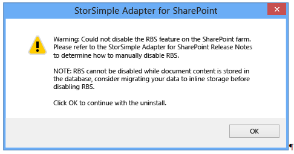

<properties 
   pageTitle="StorSimple Netzwerkadapter für SharePoint | Microsoft Azure"
   description="Beschreibt das Installieren und konfigurieren oder Entfernen der StorSimple Netzwerkadapter für SharePoint in einer SharePoint-Serverfarm."
   services="storsimple"
   documentationCenter="NA"
   authors="SharS"
   manager="carmonm"
   editor="" />
<tags 
   ms.service="storsimple"
   ms.devlang="NA"
   ms.topic="article"
   ms.tgt_pltfrm="NA"
   ms.workload="TBD"
   ms.date="07/11/2016"
   ms.author="v-sharos" />

# Installieren Sie und konfigurieren Sie der Netzwerkadapter StorSimple für SharePoint

## (Übersicht)

Die StorSimple-Grafikkarte für SharePoint ist eine Komponente, in dem Sie Microsoft Azure StorSimple flexible Speicher oder Datenschutz in SharePoint Server-Farmen angeben kann. Die Netzwerkadapter können große Objekt BLOB (Binary) Inhalte von Inhalten SQL Server-Datenbanken mit Microsoft Azure StorSimple Hybriden Cloud Speichergerät zu verschieben.

Die StorSimple-Grafikkarte für SharePoint fungiert als einen Anbieter Remote-BLOB-Speicher (RSP) und verwendet das Feature SQL Server Remote-BLOB-Speicher unstrukturierten SharePoint-Inhalte (in Form von BLOBs) speichern auf einem Dateiserver, die von einem Gerät StorSimple gesichert wird.

>[AZURE.NOTE] Die StorSimple-Grafikkarte für SharePoint unterstützt SharePoint Server 2010 Remote-Blob-Speicher (RSP). SharePoint Server 2010 externe BLOB-Speicher (EBS) werden nicht unterstützt.

- Wenn die StorSimple Netzwerkadapter für SharePoint herunterladen möchten, wechseln Sie zu [StorSimple Netzwerkadapter für SharePoint] [ 1] im Microsoft Download Center.

- Informationen zum Planen für RSP und RSP Einschränkungen, wechseln Sie zur [Entscheidung RSP in SharePoint 2013 verwenden] [ 2] oder [Planen für RSP-Code (SharePoint Server 2010)][3].

Im weiteren Verlauf dieser Übersicht beschreibt die Rolle von der StorSimple Netzwerkadapter kurz für SharePoint und SharePoint Kapazität und Leistung, denen Sie kennen sollten, bevor Sie installieren und der Netzwerkadapter konfigurieren Grenzen. Nachdem Sie diese Informationen überprüft haben, wechseln Sie zu [StorSimple Netzwerkadapter für SharePoint-Installation](#storsimple-adapter-for-sharepoint-installation) zum Einrichten der Netzwerkadapter zu beginnen.

### StorSimple Netzwerkadapter für SharePoint-Vorteile

In einer SharePoint-Website werden Inhalte als unstrukturierte BLOB-Daten in eine oder mehrere Inhaltsdatenbanken gespeichert. Standardmäßig werden diese Datenbanken auf Computern gehostet, die SQL Server ausführen und in der SharePoint-Serverfarm befinden. BLOBs können schnell in Größe, große Mengen von lokalen Speicher Verarbeitung zu erhöhen. Daher sollten Sie eine andere, weniger teure Speicher Lösung zu finden. SQL Server stellt eine Technologie namens Remote-Blob-Speicher (RSP-Code), die Sie BLOB-Inhalt im Dateisystem außerhalb der SQL Server-Datenbank speichern können. Mit RSP BLOBs können befinden, im Dateisystem auf dem Computer, auf dem SQL Server ausgeführt wird, oder können sie im Dateisystem auf einem anderen Servercomputer gespeichert werden.

RSP-Code erfordert, dass Sie einen RSP-Anbieter, wie die StorSimple-Grafikkarte für SharePoint, RSP in SharePoint aktivieren. Die StorSimple-Grafikkarte für SharePoint funktioniert mit RSP, so dass Sie die BLOBs auf einem Server vom Microsoft Azure StorSimple System gesichert zu verschieben. Microsoft Azure StorSimple speichert dann BLOB-Daten lokal oder in der Cloud, je nach Verwendung. BLOBs, die sehr aktiv sind (normalerweise Stufe 1 oder wichtiges Daten genannt) befinden lokal. Weniger aktive Daten und Archivierung Daten befinden sich in der Cloud. Nachdem Sie auf einer Inhaltsdatenbank RSP aktiviert haben, wird alle neuen BLOB-Inhalte in SharePoint erstellt auf dem Gerät StorSimple und nicht in der Inhaltsdatenbank gespeichert.

Die Microsoft Azure StorSimple Implementierung von RSP bietet folgende Vorteile:

- Durch BLOB-Inhalte an einem anderen Server verschieben können Sie die Abfrage laden, auf dem SQL Server, reduzieren, die SQL Server-Reaktionszeiten verbessert werden kann. 

- Azure StorSimple wird Beseitigung von Duplikaten sowie Komprimierung verwendet, um Daten zu verkleinern.

- Azure StorSimple bietet Schutz der Daten in der Form von lokalen und Cloud Momentaufnahmen. Auch wenn Sie die Datenbank selbst auf dem Gerät StorSimple platzieren, können Sie die Inhaltsdatenbank und BLOBs zusammen Absturz einheitlich sichern. (Verschieben die Inhaltsdatenbank am Gerät wird nur für das StorSimple 8000 Reihe Gerät unterstützt. Dieses Feature ist nicht für die Reihe 5000 oder 7000 unterstützt.)

- Azure StorSimple enthält Disaster Wiederherstellungsfeatures einschließlich Failover, Datei- und Volume Wiederherstellung (einschließlich Test Wiederherstellung) und Daten schnell wiederherstellen.

- Sie können Daten Wiederherstellungssoftware, wie z. B. Kroll Ontrack PowerControls, mit StorSimple Momentaufnahmen der BLOB-Daten für die von SharePoint-Inhalten auf Elementebene Wiederherstellung verwenden. (Diese Wiederherstellungssoftware ist eine separate Bestellung.)

- Die StorSimple-Grafikkarte für SharePoint angeschlossen ist in der SharePoint-Zentraladministration-Portal ermöglicht es Ihnen, Ihre gesamte SharePoint-Lösung von einer zentralen Stelle zu verwalten.

Verschieben von BLOB-Inhalten in das Dateisystem kann andere Kosten sparen und Vorteile bereitstellen. Beispielsweise RSP verwenden kann die Notwendigkeit teure Stufe 1-Speicher reduzieren und, da es die Inhaltsdatenbank verkleinert wird, können RSP Verringern der Anzahl der Datenbanken, die in der SharePoint-Serverfarm erforderlich. Andere Faktoren, wie z. B. Grenzwerte für die Größe und die Menge des Inhalts nicht RSP, kann jedoch auch beeinträchtigen Speicher Anforderungen. Weitere Informationen über die Kosten und Vorteile von RSP, finden Sie unter [Planen für RSP (SharePoint Foundation 2010)] [ 4] und [Entscheidung RSP in SharePoint 2013 verwenden][5].

### Grenzwerte für Kapazität und Leistung

Bevor Sie in RSP-Code in der SharePoint-Lösung Betracht, sollten Sie beachten der getesteten Leistung und Kapazität Grenzwerte von SharePoint Server 2010 und SharePoint Server 2013, und wie diese Grenzwerte auf zulässigen Leistung beziehen. Weitere Informationen finden Sie unter [Softwaregrenzen und-Einschränkungen für SharePoint 2013](https://technet.microsoft.com/library/cc262787.aspx).

Prüfen Sie Folgendes, bevor Sie RSP konfigurieren:

- Stellen Sie sicher, dass die Gesamtgröße des Inhalts (die Größe einer Inhaltsdatenbank) sowie die Größe des alle zugeordneten gelegten BLOBs nicht das von SharePoint unterstützt RSP Größenlimit überschreitet. Dieser Grenzwert ist 200 GB. 

    **Measure Inhaltsdatenbank und BLOB-Größe**

     1. Führen Sie diese Abfrage auf die zentrale Verwaltung WFE ein. Starten Sie die SharePoint-Verwaltungsshell, und geben Sie den folgenden Windows PowerShell-Befehl zum Abrufen der Größe des die Inhaltsdatenbanken:

        `Get-SPContentDatabase | Select-Object -ExpandProperty DiskSizeRequired`

         Dieses Schritts Ruft die Größe der Inhaltsdatenbank auf dem Datenträger.

     2. Führen Sie eine der folgenden SQL-Abfragen in SQL Management Studio auf das Feld SQL Server auf jede Inhaltsdatenbank, und fügen Sie das Ergebnis mit der Zahl ergebenden in Schritt 1.

        Geben Sie auf SharePoint 2013 Inhaltsdatenbanken:

        `SELECT SUM([Size]) FROM [ContentDatabaseName].[dbo].[DocStreams] WHERE [Content] IS NULL`

        Geben Sie auf SharePoint 2010-Inhaltsdatenbanken:

        `SELECT SUM([Size]) FROM [ContentDatabaseName].[dbo].[AllDocs] WHERE [Content] IS NULL`

        Dieser Schritt wird die Größe der BLOBs, die externalisiert wurde haben.

- Es empfiehlt sich, dass Sie alle BLOB und Datenbank Inhalte auf dem Gerät StorSimple lokal speichern. Das Gerät StorSimple ist ein Cluster mit zwei Knoten für eine hohe Verfügbarkeit. Platzieren den Inhaltsdatenbanken und BLOBs auf dem Gerät StorSimple bereitgestellt hohe Verfügbarkeit.

    Verwenden Sie herkömmliche Migration best Practices für SQLServer, um die Inhaltsdatenbank am StorSimple Gerät zu wechseln. Verschieben Sie die Datenbank nur, nachdem alle BLOB-Inhalt aus der Datenbank auf die Dateifreigabe über RSP verschoben wurde. Wenn Sie die Inhaltsdatenbank am Gerät StorSimple verschieben auswählen, wird empfohlen, dass Sie die Inhaltsdatenbank Speicherplatz auf dem Gerät als primäre Volume konfigurieren.

- In Microsoft Azure StorSimple, wenn gestufte Datenmengen verwenden gibt es Möglichkeit keine zum sichergestellt, dass der Inhalt lokal auf das Gerät wird nicht auf Microsoft Azure-Cloud-Speicher gestuft werden StorSimple gespeichert ist. Daher wird empfohlen, StorSimple lokal angehefteten Datenmengen in Verbindung mit SharePoint RBS verwenden. Dadurch wird sichergestellt, dass alle BLOB-Inhalte bleibt lokal auf dem Gerät StorSimple wird nicht in Microsoft Azure verschoben.

- Wenn Sie die Inhaltsdatenbanken nicht auf dem Gerät StorSimple speichern, verwenden Sie herkömmliche SQL Server hohen Verfügbarkeit bewährte Methoden, die RSP unterstützen. SQL Server Cluster RSP unterstützt, während der SQL Server-Spiegelung nicht unterstützt. 

>[AZURE.WARNING] Wenn Sie rsp nicht aktiviert haben, empfehlen wir nicht, die Inhaltsdatenbank am Gerät StorSimple verschieben. Dies ist eine Konfiguration nicht getestet.
 
## StorSimple Netzwerkadapter für SharePoint-installation

Vor der Installation von der StorSimple Netzwerkadapter für SharePoint müssen Sie das Gerät StorSimple konfigurieren und stellen Sie sicher, dass die SharePoint-Serverfarm und SQL Server-Instanziierung alle erforderlichen Komponenten entsprechen. In diesem Lernprogramm werden Konfiguration Anforderungen sowie Verfahren zum Installieren und aktualisieren die Netzwerkadapter StorSimple für SharePoint an. 

## Konfigurieren Sie erforderliche Komponenten

Bevor Sie die StorSimple Netzwerkadapter für SharePoint installieren können, stellen Sie sicher, dass die StorSimple Gerät, SharePoint Server-Farm und Instanziierung SQL Server die folgenden Vorkenntnisse entsprechen.

### Systemanforderungen

Die StorSimple-Grafikkarte für SharePoint arbeitet mit den folgenden Hard- und Software:

- Unterstütztes Betriebssystem – Windows Server 2012 R2, Windows Server 2012 oder Windows Server 2008 R2 SP1 

- Unterstützte SharePoint-Versionen – SharePoint Server 2010 oder SharePoint Server 2013

- Unterstützte SQL Server-Versionen – SQL Server 2008 Enterprise Edition, SQL Server 2008 R2 Enterprise Edition oder SQL Server 2012 Enterprise Edition

- Unterstützte StorSimple Geräte – StorSimple 8000-Serie, StorSimple 7000-er oder StorSimple 5000 Serie.

### Voraussetzungen für StorSimple Gerät-Konfiguration

Das Gerät StorSimple ist ein Block-Gerät und als solche erfordert eine Dateiserver, auf der die Daten gehostet werden können. Es empfiehlt sich, dass Sie einen eigenen Server anstelle eines vorhandenen Servers aus der SharePoint-Farm verwenden. Diesen Dateiserver muss in der gleichen LAN (LAN) als SQL Server-Computer, auf dem die Inhaltsdatenbanken befindet. 

>[AZURE.TIP] 
>
>- Wenn Sie die SharePoint-Farm für hohe Verfügbarkeit konfiguriert haben, sollten Sie auch den Dateiserver für eine hohe Verfügbarkeit bereitstellen.
>
>- Wenn Sie die Inhaltsdatenbank nicht auf dem Gerät StorSimple speichern, verwenden Sie herkömmliche hohen Verfügbarkeit bewährte Methoden, die RSP unterstützen. SQL Server Cluster RSP unterstützt, während der SQL Server-Spiegelung nicht unterstützt. 

Stellen Sie sicher, dass Ihr Gerät StorSimple richtig konfiguriert ist und geeignete Mengen zur Unterstützung von der SharePoint-bereitstellungs konfiguriert sind und von Ihrem Computer SQL Server zugegriffen werden. Wechseln Sie zum [Bereitstellen von Ihrem lokalen StorSimple Gerät](storsimple-deployment-walkthrough.md) , wenn Sie noch nicht bereitgestellt und Ihrem Gerät StorSimple konfiguriert haben. Beachten Sie die IP-Adresse des Geräts StorSimple. Sie benötigen diese während StorSimple Netzwerkadapter für SharePoint-Installation. 

Darüber hinaus stellen Sie sicher, dass die Lautstärke für BLOB-Externalization verwendet werden soll, die folgenden Anforderungen erfüllt:

- Die Lautstärke muss mit einer Größe der Zuordnungseinheiten 64 KB formatiert werden.

- Der Web-front-End (WFE) und Anwendungsserver müssen die Lautstärke über einen Pfad Universal Naming Convention (UNC) zugreifen können. 

- Die SharePoint-Serverfarm muss konfiguriert sein, um die Lautstärke zu schreiben.

>[AZURE.NOTE] Nachdem Sie installieren und der Netzwerkadapter konfigurieren, muss alle BLOB-Externalization durch das Gerät StorSimple wechseln (das Gerät wird die Datenmengen mit SQL Server präsentieren und verwalten Speicherebenen). Sie können keine andere Ziele für BLOB-Externalization verwenden.
 
Wenn Sie beabsichtigen, StorSimple Snapshot-Manager zum Aufzeichnen von Momentaufnahmen der Daten BLOB und Datenbank verwenden, müssen Sie unbedingt StorSimple Snapshot-Manager auf dem Datenbankserver installieren, sodass es den Autor SQL-Dienst verwenden, um Windows Volume Schatten Copy Service (VSS) implementieren. 

>[AZURE.IMPORTANT] StorSimple Snapshot-Manager unterstützt nicht das SharePoint VSS Autor und konsistente Anwendung Momentaufnahmen der SharePoint-Daten nicht möglich. In einem Szenario SharePoint bietet StorSimple Snapshot-Manager nur Absturz konsistent Sicherungskopien. 
 
## Voraussetzungen für SharePoint-Farm-Konfiguration

Stellen Sie sicher, dass Ihre SharePoint-Serverfarm richtig, wie folgt konfiguriert ist:

- Stellen Sie sicher, dass Ihre SharePoint-Serverfarm in einem ordnungsgemäßen Zustand ist, und prüfen Sie Folgendes: 

- Alle SharePoint WFE Anwendungsserver in der Farm registriert ausgeführt werden und können an gesendet werden, von dem Server, auf dem Sie die StorSimple Netzwerkadapter für SharePoint installiert werden soll.

- Der Zeitgeber für SharePoint-Dienst (SPTimerV3 oder SPTimerV4) ist auf jedem WFE-Server und Anwendungsserver ausgeführt.

- Haben Administratorberechtigungen, den SharePoint Zeitgeber-Dienst und den IIS-Anwendungspool unter dem Website der SharePoint-Zentraladministration ausgeführt wird. 

- Stellen Sie sicher, dass Internet Explorer erweiterte Sicherheitskontext (für IE) deaktiviert ist. Wie folgt vor, um IE deaktivieren möchten:

    1. Schließen Sie alle Instanzen von Internet Explorer.

    2. Starten Sie den Server-Manager.

    3. Klicken Sie im linken Bereich auf **Lokale Server**.

    4. Klicken Sie im rechten Bereich neben **IE erweiterte Konfiguration der Sicherheit** **auf**.

    5. Klicken Sie unter **Administratoren**klicken Sie auf **Deaktivieren**.

    6. Klicken Sie auf **OK**.

## Remote-Blob-Speicher (RSP) erforderliche Komponenten

Stellen Sie sicher, dass Sie eine unterstützte Version von SQL Server verwenden. Nur die folgenden Versionen sind unterstützte und RSP verwenden:

- SQL Server 2008 Enterprise Edition

- SQL Server 2008 R2 Enterprise Edition

- SQL Server 2012 Enterprise Edition

Klicken Sie auf nur diese Datenmengen, die das Gerät StorSimple SQL Server anzeigt, können bLOBs externalisiert werden. Es werden keine anderen Ziele für BLOB-Externalization unterstützt.

Wenn Sie alle erforderlichen Konfigurationsschritte abgeschlossen haben, wechseln Sie zum [Installieren der StorSimple Netzwerkadapter für SharePoint](#install-the-storsimple-adapter-for-sharepoint).

## Installieren Sie die Netzwerkadapter StorSimple für SharePoint

Verwenden Sie die folgenden Schritte aus, um die StorSimple Netzwerkadapter für SharePoint installieren. Wenn Sie die Software erneut installieren, finden Sie unter [Aktualisieren oder installieren Sie die Netzwerkadapter StorSimple für SharePoint](#upgrade-or-reinstall-the-storsimple-adapter-for-sharepoint). Die erforderliche Zeit für die Installation hängt die Gesamtzahl der SharePoint-Datenbanken in Ihrer SharePoint-Serverfarm aus.

[AZURE.INCLUDE [storsimple-install-sharepoint-adapter](../../includes/storsimple-install-sharepoint-adapter.md)]

## Konfigurieren von RSP-Code

Nach der Installation der StorSimple Netzwerkadapter für SharePoint konfigurieren Sie RSP, wie im folgenden beschrieben.

>[AZURE.TIP] Die StorSimple-Grafikkarte für SharePoint wird an der Seite SharePoint-Zentraladministration angeschlossen gleicht RSP-Code zu aktivieren oder zu deaktivieren, klicken Sie auf jede Inhaltsdatenbank in der SharePoint-Farm. Aktivieren oder Deaktivieren von RSP-Code auf der Inhaltsdatenbank verursacht jedoch IIS zurück, die, abhängig von Ihrer Farmkonfiguration kurzzeitig die Verfügbarkeit von SharePoint Web front-End (WFE) beeinträchtigen kann. (Faktoren wie die Verwendung von einer Front-End-Lastenausgleich, die aktuellen Server Arbeitsbelastung usw., können einschränken oder unterdrücken dieser Unterbrechung). Damit Benutzer aus einer Unterbrechung geschützt werden, wird empfohlen, Sie aktivieren oder Deaktivieren von RSP nur während einer geplanten Wartung-Fenster.

[AZURE.INCLUDE [storsimple-sharepoint-adapter-configure-rbs](../../includes/storsimple-sharepoint-adapter-configure-rbs.md)]
 

## Konfigurieren von Garbagecollection

Wenn Sie Objekte aus einer SharePoint-Website gelöscht haben, werden diese vom Volume Store rsp nicht automatisch gelöscht. Stattdessen eine asynchrone, Hintergrund Wartungsprogramm löscht-verwaiste BLOBs aus dem Dateispeicher. Systemadministratoren können regelmäßig Ausführen des Prozesses planen, oder sie können sie jederzeit im neu starten.

Dieses Wartungsprogramm (Microsoft.Data.SqlRemoteBlobs.Maintainer.exe) wird automatisch auf allen WFE SharePoint-Servern und Anwendungsserver installiert, wenn Sie RSP aktivieren. Die Anwendung installiert ist, an folgendem Speicherort: *Boot-Laufwerk*: \Programme\Microsoft SQL Remote-Blob-Speicher 10.50\Maintainer\

Informationen zum Konfigurieren und verwenden das Wartungsprogramm finden Sie unter [Verwalten von RSP in SharePoint Server 2013]Informationen[8].

>[AZURE.IMPORTANT] Das RSP Maintainer Programm ist viele Ressourcen beanspruchen. Sie sollten sie nur während Zeiten light Aktivität ausgeführt wird, klicken Sie auf der SharePoint-Farm planen.

### Verwaiste BLOBs sofort löschen

Wenn Sie verwaiste BLOBs sofort löschen müssen, können Sie die folgenden Anweisungen verwenden. Beachten Sie, dass diese Anweisungen sind ein Beispiel, wie dies in einer SharePoint 2013-Umgebung mit den folgenden Komponenten durchgeführt werden kann:

- Der Name der Inhaltsdatenbank ist WSS_Content.
- Name der SQL Server ist SHRPT13-SQL12\SHRPT13.
- Der Name der Web-Anwendung ist SharePoint – 80.

[AZURE.INCLUDE [storsimple-sharepoint-adapter-garbage-collection](../../includes/storsimple-sharepoint-adapter-garbage-collection.md)]

## Aktualisieren Sie oder erneut installieren Sie der StorSimple Netzwerkadapter für SharePoint

Gehen Sie folgendermaßen vor, aktualisieren Sie SharePoint Server und anschließend neu installieren StorSimple Netzwerkadapter für SharePoint, oder zum einfach upgrade der Netzwerkadapter in einer vorhandenen SharePoint-Serverfarm installieren. 

>[AZURE.IMPORTANT] Überprüfen Sie die folgende Informationen, bevor Sie versuchen, das upgrade Ihrer SharePoint-Software und/oder das Upgrade oder die StorSimple Netzwerkadapter für SharePoint installieren:
>
>- Alle Dateien, die in externen Speicher zuvor, über RSP verschoben wurden werden nicht verfügbar sein, bis die Neuinstallation abgeschlossen ist, und das Feature RSP wieder aktiviert ist. Führen Sie zum Benutzer Einfluss zu beschränken irgendeine Aktualisierung oder Neuinstallation während einer geplanten Wartungsfenster aus.
>
>- Die erforderliche Zeit für die Aktualisierung/Neuinstallation kann abhängig von der Gesamtzahl der SharePoint-Datenbanken in der SharePoint-Serverfarm abweichen.
>
>- Nachdem die Upgrade/Neuinstallation abgeschlossen ist, müssen Sie RSP-Code für die Inhaltsdatenbanken aktivieren. Weitere Informationen finden Sie unter [Konfigurieren von RSP](#configure-rbs) .
>
>- Wenn Sie RSP-Code für eine SharePoint-Farm, die eine sehr große Anzahl von Datenbanken (größer als 200) verfügt konfigurieren, kann die Seite **SharePoint-Zentraladministration** Timeout an. In diesem Fall aktualisieren Sie die Seite aus. Dies wirkt sich nicht auf den Konfigurationsprozess aus.

[AZURE.INCLUDE [storsimple-upgrade-sharepoint-adapter](../../includes/storsimple-upgrade-sharepoint-adapter.md)]
 
## StorSimple Netzwerkadapter für SharePoint freistellen

Die folgenden Schritte beschreiben, wie die BLOBs auf die SQL Server-Inhaltsdatenbanken in Rückwärtsrichtung und dann die StorSimple Netzwerkadapter für SharePoint deinstallieren. 

>[AZURE.IMPORTANT] Sie müssen in Rückwärtsrichtung die BLOBs auf die Inhaltsdatenbanken, bevor Sie die Netzwerkadapter-Software deinstallieren. 

### Vorbemerkung 

Sammeln Sie die folgende Informationen, bevor Sie die Daten wieder in die SQL Server-Inhaltsdatenbanken verschieben und die Deinstallation Netzwerkadapter zu beginnen:

- Die Namen aller Datenbanken für die RSP aktiviert ist
- Der Pfad UNC des konfigurierten BLOB-Speichers

### Verschieben Sie die BLOBs wieder auf die Inhaltsdatenbanken

Bevor Sie die StorSimple-Grafikkarte für SharePoint-Software deinstallieren, müssen Sie alle der BLOBs, die externalisiert wurden wieder auf die SQL Server-Inhaltsdatenbanken migrieren. Wenn Sie versuchen, die StorSimple Netzwerkadapter für SharePoint deinstallieren, bevor Sie die alle BLOBs wieder auf die Inhaltsdatenbanken verschieben, sehen Sie die folgende Warnung angezeigt.

 
####Um die BLOBs wieder in die Inhaltsdatenbanken verschieben 

1. Laden Sie die gelegten Objekte.

2. Öffnen Sie die Seite **SharePoint-Zentraladministration** , und navigieren Sie zu **Systemeinstellungen**. 

3. Klicken Sie unter **Azure StorSimple**klicken Sie auf **StorSimple Netzwerkadapter konfigurieren**.

4. Klicken Sie auf der Seite **StorSimple Netzwerkadapter konfigurieren** klicken Sie auf die Schaltfläche **Deaktivieren** unterhalb jeder Inhaltsdatenbanken, die Sie aus dem externen BLOB-Speicher entfernen möchten. 

5. Löschen Sie die Objekte von SharePoint, und Laden Sie sie erneut.

Alternativ können Sie das Microsoft` RBS Migrate()` enthaltenen SharePoint PowerShell-Cmdlet. Weitere Informationen finden Sie unter [Migrieren von Inhalten in oder aus RSP](https://technet.microsoft.com/library/ff628255.aspx).

Nachdem Sie die BLOBs wieder zur Inhaltsdatenbank verschieben möchten, wechseln Sie zum nächsten Schritt: [Deinstallieren Sie die Netzwerkadapter](#uninstall-the-adapter).

### Deinstallieren Sie die Netzwerkadapter

Nachdem Sie die BLOBs wieder auf die SQL Server-Inhaltsdatenbanken verschieben möchten, verwenden Sie eine der folgenden Optionen So deinstallieren Sie die Netzwerkadapter StorSimple für SharePoint.

#### Verwenden Sie das Installationsprogramm So deinstallieren Sie die Netzwerkadapter 

1. Verwenden Sie ein Konto mit Administratorrechten an der Front-End-(WFE) Webserver anmelden.
2. Doppelklicken Sie auf die StorSimple Netzwerkadapter für SharePoint-Installationsprogramm. Der Setup-Assistent wird gestartet.

    

3. Klicken Sie auf **Weiter**. Die folgende Seite angezeigt wird.

    

4. Klicken Sie auf **Entfernen** , um die Deinstallation auszuwählen. Die folgende Seite angezeigt wird.

    

5. Klicken Sie auf **Entfernen** , um den Löschvorgang zu bestätigen. Die folgende Seite wird angezeigt.

    

6. Wenn die Deinstallation abgeschlossen ist, wird die Seite Fertig stellen. Klicken Sie auf **Fertig stellen** , um den Setup-Assistenten zu schließen.

#### Verwenden Sie die Systemsteuerung So deinstallieren Sie die Netzwerkadapter 

1. Öffnen Sie die Systemsteuerung, und klicken Sie dann auf **Programme und Funktionen**.

2. Wählen Sie **StorSimple Netzwerkadapter für SharePoint**aus, und klicken Sie dann auf **Deinstallieren**. 

## Nächste Schritte

[Erfahren Sie mehr über StorSimple](storsimple-overview.md).

<!--Reference links-->
[1]: https://www.microsoft.com/download/details.aspx?id=44073
[2]: https://technet.microsoft.com/library/ff628583(v=office.15).aspx
[3]: https://technet.microsoft.com/library/ff628583(v=office.14).aspx
[4]: https://technet.microsoft.com/library/ff628569(v=office.14).aspx
[5]: https://technet.microsoft.com/library/ff628583(v=office.15).aspx
[8]: https://technet.microsoft.com/en-us/library/ff943565.aspx
