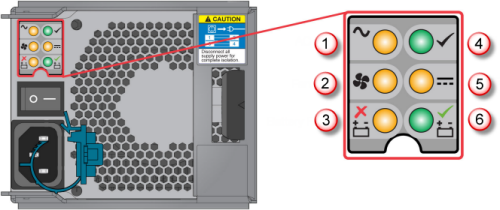
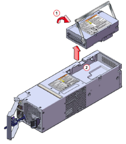

<properties 
   pageTitle="Ersetzen Sie den Akku auf einem Gerät StorSimple | Microsoft Azure"
   description="Beschreibt das Entfernen, ersetzen und das Modul Stützbatterie auf Ihrem Gerät StorSimple verwalten."
   services="storsimple"
   documentationCenter=""
   authors="alkohli"
   manager="carmonm"
   editor="" />
<tags 
   ms.service="storsimple"
   ms.devlang="NA"
   ms.topic="article"
   ms.tgt_pltfrm="NA"
   ms.workload="TBD"
   ms.date="08/17/2016"
   ms.author="alkohli" />

# Ersetzen Sie das Modul Stützbatterie auf Ihrem Gerät StorSimple

## (Übersicht)

Die primäre Einheit Power und Kühlung Modul (PCM) auf Ihrem Gerät Microsoft Azure StorSimple verfügt über eine zusätzliche Akku aus. Dieses Pack bietet Power, damit das Gerät StorSimple Daten gespeichert werden kann, wenn Verlust der IK Power mit der primären Einheit vorhanden ist. Dieser Akku ist als das *Modul Stützbatterie*bezeichnet. Das Modul Stützbatterie ist nur für die primäre Einheit in Ihrem StorSimple Gerät (die EBOD Anlage enthält kein Moduls Stützbatterie). 

In diesem Lernprogramm wird erläutert, wie Sie:

- Entfernen Sie das Modul Stützbatterie 
- Installieren Sie ein neues Stützbatterie-Modul
- Verwalten des Sicherungsbatterie-Moduls

>[AZURE.IMPORTANT] Überprüfen Sie vor dem Entfernen und Ersetzen eines Moduls Stützbatterie, die Sicherheitsinformationen in die [Einführung Austausch von StorSimple Hardware Komponenten](storsimple-hardware-component-replacement.md).

## Entfernen Sie das Modul Stützbatterie

Das Modul Stützbatterie für Ihr Gerät StorSimple ist eine Ort austauschbare Einheit. Bevor sie in der PCM installiert ist, sollte der Batteriemodul in seiner ursprünglichen Verpackung gespeichert werden. Führen Sie die folgenden Schritte aus, um die Stützbatterie zu entfernen.

#### So entfernen Sie das Sicherungsbatterie Modul

1. Wechseln Sie in der Azure klassischen-Portal zu **Geräte** > **Wartung** > **Hardware Status**. Klicken Sie unter **Freigegebene Komponenten**prüfen Sie den Status des Akkus aus.

2. Identifizieren Sie die PCM, in dem der Akku als fehlerhaft. Abbildung 1 zeigt die Rückseite des Geräts StorSimple.

    

    **Abbildung 1** Anzeigen von PCM- und Controller Module wieder des primären Geräts

  	|Beschriftung|Beschreibung|
  	|:----|:----------|
  	|1|PCM 0|
  	|2|PCM 1|
  	|3|Controller 0|
  	|4|Controller 1|

    Dargestellt durch die Zahl 3 in der Abbildung 2 sollten der Überwachung Indikator LED auf PCM 0, die entspricht zu **Akku Fehlerstrukturanalyse** leuchten.

    

    **Abbildung 2** Rückseite PCM mit Überwachung LED

  	|Beschriftung|Beschreibung|
  	|:---|:-----------|
  	|1|IK Power-Fehler|
  	|2|Lüfterausfall|
  	|3|Fehlerstrukturanalyse Akku|
  	|4|PCM OK|
  	|5|Ausfall der DC power|
  	|6|Akku fehlerfrei|

3. Um die PCM mit mit einer ausgefallenen zu entfernen, folgen Sie den Schritten [Entfernen einer PCM](storsimple-power-cooling-module-replacement.md#remove-a-pcm)aus.

4. Heben Sie mit der PCM entfernt und drehen Sie den Akku Modul Ziehpunkt oben, wie in der folgenden Abbildung zu sehen, und ziehen Sie ihn nach Zeitphasen bis zum Entfernen des Akkus.

    

    **Abbildung 3** Entfernen des Akkus aus der PCM

5. Platzieren Sie das Modul, in das Feld austauschbare Einheit verpacken.

6. Geben Sie das defekte an Microsoft für gemischte Wartung und Behandlung zurück.

## Installieren Sie ein neues Stützbatterie-Modul

Führen Sie die folgenden Schritte aus, um die Ersetzung Batteriemodul in der PCM in der primären Einheit Ihres Geräts StorSimple zu installieren.

#### So installieren Sie die Batteriemodul

1. Platzieren Sie das Modul Stützbatterie in der richtigen Ausrichtung in der PCM an.

2. Drücken Sie den Akku Modul Ziehpunkt ganz nach der Verbinder einzusetzen.

3. Ersetzen Sie die PCM in der primären Einheit anhand der Richtlinien in [einen Power und das Modul auf Ihrem Gerät StorSimple ersetzen](storsimple-power-cooling-module-replacement.md).

4. Nachdem die Ersetzung abgeschlossen ist, wechseln Sie zu **Geräte** > **Wartung** > **Hardware Status** in der klassischen Azure-Portal. Überprüfen des Status des Akkus, um sicherzustellen, dass die Installation erfolgreich war. Grüner Status zeigt an, dass die Batterie fehlerfrei ist.

## Verwalten des Sicherungsbatterie-Moduls

In Ihrem Gerät StorSimple stellt das Modul Stützbatterie Power an den Controller während eines Power Verlust Ereignisses. Es kann das StorSimple Gerät speichern wichtige Daten vor kontrolliert beendet. Mit zwei vollständig berechnete Batterien in die PCMs kann das System zwei aufeinander folgenden Verlust Ereignisse zu behandeln.

Im Portal Azure klassischen zeigt an der **Hardware Status** auf der Seite **zum Warten** , ob die Batterie vorliegt, oder das Ende des Lebenszyklus ist Annäherung an. Der Akkustatus wird durch **Batterie in PCM 0** oder **Akku in PCM 1** unter **Freigegebene Komponenten**angezeigt. Auf dieser Seite einen **HERUNTERGESTUFT** Status für die Begegnung mit Ende des Lebenszyklus angezeigt wird, und **fehlgeschlagen** für Ende des Lebenszyklus erreicht. 

>[AZURE.NOTE] Die Batterie kann **fehlgeschlagen** melden, wenn einfach in Rechnung gestellt werden muss.
 
Wenn der Status **HERUNTERGESTUFT** angezeigt wird, empfiehlt es sich um die folgende Vorgehensweise:

- Das System möglicherweise ausgefallen zuletzt verwendete Power Verlust oder die Batterien derzeit möglicherweise regelmäßigen gewartet. Sehen Sie sich das System für 12 Stunden, bevor Sie fortfahren.

    - Wenn im Zustand weiterhin **HERUNTERGESTUFT** nach 12 Stunden dauerhafte Verbindung zu IK Power mit dem Controller und PCMs ausgeführt wird, muss die Batterie ersetzt werden. Nehmen Sie [an den Microsoft-Support](storsimple-contact-microsoft-support.md) für ein Ersatz Stützbatterie Modul.

    - Wenn der Status OK nach 12 Stunden wird, der Akku funktioniert und sie nur eine Belastung Wartung benötigt.

- Wenn es kein zugeordneter Verlust der IK Power wurde und die PCM-aktiviert und IK Potenz verbunden ist, muss die Batterie ersetzt werden. [Microsoft-Support wenden](storsimple-contact-microsoft-support.md) , um ein Ersatz Stützbatterie Modul bestellen.

>[AZURE.IMPORTANT] Freigeben Sie, wird der Fehler beim Batterie gemäß nationalen und regionalen Vorschriften. 

## Nächste Schritte

Weitere Informationen zu den [Austausch von StorSimple Hardware Komponenten](storsimple-hardware-component-replacement.md).
