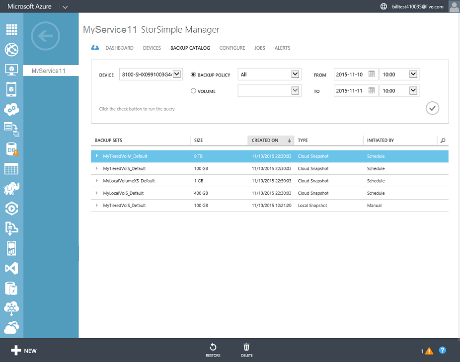
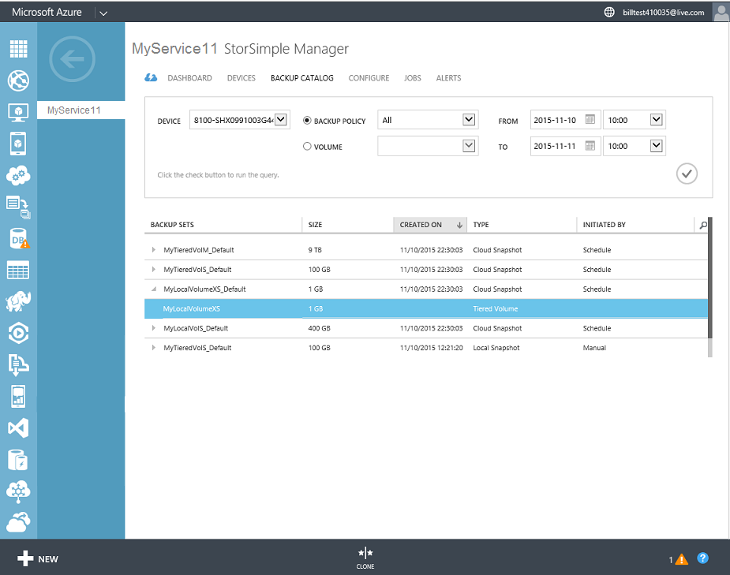
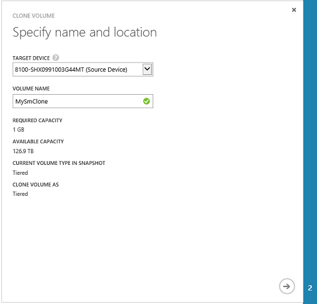
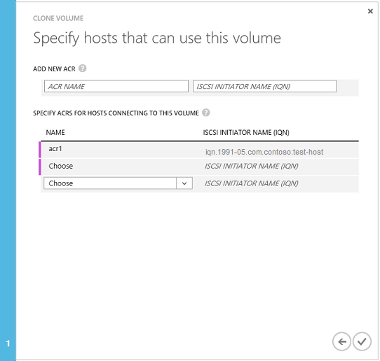

<properties
   pageTitle="Die Lautstärke StorSimple Klonen | Microsoft Azure"
   description="Die verschiedenen datenbeschriftungsreihe Typen und wann sie verwendet werden, und erläutert, wie Sie eine Sicherungskopie, legen Sie auf einem einzelnen Volume Klonen verwenden können."
   services="storsimple"
   documentationCenter="NA"
   authors="alkohli"
   manager="carmonm"
   editor="" />
<tags 
   ms.service="storsimple"
   ms.devlang="NA"
   ms.topic="article"
   ms.tgt_pltfrm="NA"
   ms.workload="TBD"
   ms.date="07/27/2016"
   ms.author="alkohli" />

# Verwenden Sie den Dienst StorSimple Manager, um ein Volume (Update 2) duplizieren

[AZURE.INCLUDE [storsimple-version-selector-clone-volume](../../includes/storsimple-version-selector-clone-volume.md)]

## (Übersicht)

Die Seite StorSimple Manager **Sicherungskatalog** zeigt die Sicherung Datensätze, die erstellt werden, wenn Sie manuelle oder automatisierte Sicherungskopien geöffnet werden. Sie können mithilfe dieser Seite können die Liste alle Sicherungskopien für eine Sicherung Richtlinie oder einen Datenträger, aktivieren oder Löschen von Sicherungskopien, oder verwenden eine Sicherungskopie, wiederherstellen oder einen Datenträger klonen.

  

In diesem Lernprogramm beschreibt, wie Sie eine Sicherungskopie auf einem einzelnen Volume Klonen festgelegt. Darüber hinaus den Unterschied zwischen *vorübergehende* und *permanent* klonen.

>[AZURE.NOTE] 
>
>Ein lokales angeheftete Volume wird als gestufte Volume klonen. Wenn Sie die duplizierte Lautstärke lokal fixiert werden benötigen, können Sie der datenbeschriftungsreihe auf einen Datenträger lokal angeheftete konvertieren, nach der datenbeschriftungsreihe Vorgang erfolgreich abgeschlossen ist. Informationen zum Konvertieren von einem gestufte Volume auf einen Datenträger lokal angeheftete wechseln Sie zu [Ändern der Lautstärke Typ](storsimple-manage-volumes-u2.md#change-the-volume-type).
>
>Wenn Sie versuchen, einen duplizierten Datenträger aus konvertieren tritt Abstufung auf lokal angehefteten unmittelbar nach Klonen (wenn es immer noch eine vorübergehende datenbeschriftungsreihe ist), die Konvertierung mit der folgenden Fehlermeldung ein:
>
>`Unable to modify the usage type for volume {0}. This can happen if the volume being modified is a transient clone and hasn’t been made permanent. Take a cloud snapshot of this volume and then retry the modify operation.` 
>
>Dieser Fehler wird empfangen, nur, wenn Sie an ein anderes Gerät klonen. Sie können erfolgreich konvertieren die Lautstärke lokal fixiert, wenn Sie zuerst die vorübergehende Klonen zu einer permanent datenbeschriftungsreihe konvertieren. Um die vorübergehende Klonen in einer permanent Klonen zu konvertieren, eine Momentaufnahme Cloud davon.

## Erstellen einer datenbeschriftungsreihe eines Datenträgers

Sie können eine datenbeschriftungsreihe auf dem gleichen Gerät, ein anderes Gerät oder sogar eines virtuellen Computers erstellen, mit einem lokalen oder Cloud Momentaufnahme.

#### Um einen Datenträger Klonen

1. Klicken Sie auf der Seite StorSimple-Manager auf der Registerkarte **Sicherungskatalog** aus, und wählen Sie eine Sicherungskopie.

2. Erweitern Sie die Sicherung festlegen, um die zugehörigen Datenträger anzuzeigen. Klicken Sie auf, und wählen Sie einen Datenträger aus der Sicherungsdatei.

      

3. Klicken Sie auf **Datenbeschriftungsreihe** , um das ausgewählte Volume Klonen zu beginnen.

4. Die Lautstärke Klonen-Assistenten unter **angeben Namen und einen Speicherort**:

  1. Benennen Sie ein Zielgerät ein. Dies ist die Position, wo das Klonen erstellt wird. Wählen Sie aus dem gleichen Gerät oder ein anderes Gerät angeben können. Wenn Sie eine andere Cloud-Dienstanbieter zugeordnet Volume auswählen (nicht Azure), in der Dropdownliste für das Gerät zeigt nur physische Geräte. Sie können keiner anderen Cloud-Dienstanbieter auf einem virtuellen Gerät zugeordnet Lautstärke klonen.

        >[AZURE.NOTE] Stellen Sie sicher, dass für die datenbeschriftungsreihe erforderliche Kapazität kleiner als die Kapazität, die auf dem Zielgerät verfügbar ist.

  2. Geben Sie einen eindeutigen Lautstärke Namen für Ihre klonen. Der Name muss zwischen 3 und 127 Zeichen enthalten. 
    
        >[AZURE.NOTE] Das Feld **Lautstärke Klonen als** werden **Tiered** aus, auch wenn Sie ein lokales angeheftete Volume klonen. Sie können diese Einstellung nicht ändern. jedoch, wenn Sie die duplizierte Lautstärke auch lokal fixiert werden benötigen, können Sie konvertieren der datenbeschriftungsreihe auf einen Datenträger lokal angeheftete nach dem erfolgreichen der Klonen erstellen. Informationen zum Konvertieren von einem gestufte Volume auf einen Datenträger lokal angeheftete wechseln Sie zu [Ändern der Lautstärke Typ](storsimple-manage-volumes-u2.md#change-the-volume-type).

         

  3. Klicken Sie auf das Pfeilsymbol  um zur nächsten Seite zu gelangen.

5. Klicken Sie unter **angeben Hosts, die diesem Handbuch verwenden können**:

  1. Geben Sie ein Access-Steuerelement-Eintrag (ACR) für die datenbeschriftungsreihe an. Sie können eine neue ACR hinzufügen oder wählen Sie aus der Liste aus.

         

  2. Klicken Sie auf das Symbol "Überprüfen" um den Vorgang abzuschließen.

6. Ein datenbeschriftungsreihe Auftrag wird eingeleitet, und Sie werden benachrichtigt, wenn die datenbeschriftungsreihe erfolgreich erstellt wurde. Klicken Sie auf die **Position der anzeigen** , um den Auftrag Klonen auf der Seite **Projekte** zu überwachen. Nach Abschluss der datenbeschriftungsreihe Auftrag werden die folgende Meldung angezeigt:

     

7. Nachdem Sie der Auftrag Klonen abgeschlossen ist:

  1. Wechseln Sie zur Seite **Geräte** , und wählen Sie die Registerkarte **Lautstärke Container** . 
  2. Wählen Sie den Lautstärke Container, der die Lautstärke der Datenquelle zugeordnet ist, das Sie kopiert. In die Liste der Datenträger sollte der datenbeschriftungsreihe angezeigt werden, die gerade erstellt wurde.

>[AZURE.NOTE] Für die Überwachung und Standardwert Sicherung werden automatisch auf einem Datenträger duplizierten deaktiviert.

Eine datenbeschriftungsreihe, die auf diese Weise erstellt wird ist eine vorübergehende klonen. Weitere Informationen zu Datentypen Klonen finden Sie unter [vorübergehende im Vergleich zu permanent Klonen](#transient-vs.-permanent-clones).

Diese datenbeschriftungsreihe ist jetzt eine normale Lautstärke, und alle Vorgänge, die auf einem Datenträger möglich ist, werden für die datenbeschriftungsreihe verfügbar. Sie müssen dieses Volume für Sicherungskopien konfigurieren.

## Vorübergehend im Vergleich zu permanent Klonen

Nur, wenn Sie auf ein anderes Gerät Klonen sind, werden vorübergehende Klonen erstellt. Sie können einen bestimmten Datenträger aus einer Sicherung, legen Sie auf ein anderes Gerät vom StorSimple-Manager verwalteten klonen. Die vorübergehende datenbeschriftungsreihe Verweise auf die Daten in der ursprünglichen Lautstärke haben und die Daten zum Lesen und Schreiben lokal auf dem Zielgerät verwenden. 

Nachdem Sie eine Momentaufnahme der Cloud für eine vorübergehende datenbeschriftungsreihe ausgeführt haben, wird der resultierende datenbeschriftungsreihe *permanent* werden. Während dieses Vorgangs wird eine Kopie der Daten in der Cloud erstellt, und die Zeit für diese Daten kopieren, wird durch die Größe der Daten und der Azure Wartezeiten (Dies ist eine Kopie der Azure-Azure-) bestimmt. Dieser Vorgang kann Tagen, Wochen dauern. Die vorübergehende Klonen wird eine permanente Klonen auf diese Weise und verfügt nicht über alle Verweise mit den Originaldaten Datenträger, denen von dupliziert wurde. 

## Szenarien für vorübergehende und permanent Klonen

Den folgenden Abschnitten werden Beispiel Situationen, in denen vorübergehende und permanente Klonen verwendet werden können.

### Auf Elementebene Wiederherstellung mit einer vorübergehenden Klonen

Sie müssen eine Microsoft PowerPoint-Präsentationsdatei eine Jahre wiederherstellen. Ihr IT-Administrator bezeichnet die bestimmte Sicherung aus diesem Zeitrahmen aus, und Filter klicken Sie dann auf die Lautstärke. Der Administrator klicken Sie dann die Lautstärke kopiert, sucht nach der Datei, die von Ihnen gesuchte und stellt Ihnen. In diesem Szenario ist eine vorübergehende datenbeschriftungsreihe verwendet. 
 
 **Video verfügbar**

Wenn Sie ein Video zur Verfügung, die veranschaulicht, wie Sie die datenbeschriftungsreihe verwenden und Features in StorSimple zum Wiederherstellen von gelöschter Dateien wiederherstellen, klicken Sie auf [hier](https://azure.microsoft.com/documentation/videos/storsimple-recover-deleted-files-with-storsimple/).

### In dieser Umgebung mit einer permanent datenbeschriftungsreihe testen

Sie müssen einen testen Fehler in dieser Umgebung zu überprüfen. Erstellen eines datenbeschriftungsreihe des Datenträgers in dieser Umgebung und dann eine Momentaufnahme Cloud dieser Klonen unabhängiges duplizierten Volume erstellen. In diesem Szenario wird eine permanente datenbeschriftungsreihe verwendet.  

## Nächste Schritte
- Erfahren Sie, wie [ein Volume StorSimple aus einer Sicherung wiederherstellen](storsimple-restore-from-backup-set-u2.md).

- Erfahren Sie, wie der Dienst StorSimple Manager zum Verwalten von Ihrem Geräts StorSimple zu [verwenden](storsimple-manager-service-administration.md).

 
