<properties 
   pageTitle="Konfigurieren von CHAP für Ihr Gerät StorSimple | Microsoft Azure"
   description="Beschreibt das Konfigurieren des Herausforderung Handshake Authentication Protocol (CHAP) auf einem Gerät StorSimple."
   services="storsimple"
   documentationCenter=""
   authors="alkohli"
   manager="carmonm"
   editor="" />
<tags 
   ms.service="storsimple"
   ms.devlang="NA"
   ms.topic="article"
   ms.tgt_pltfrm="na"
   ms.workload="TBD"
   ms.date="08/17/2016"
   ms.author="alkohli" />

# Konfigurieren von CHAP für Ihr Gerät StorSimple

In diesem Lernprogramm wird erläutert, wie CHAP für Ihr Gerät StorSimple konfigurieren. Das in diesem Artikel beschriebenen Verfahren gilt für StorSimple 8000-Serie als auch StorSimple 1200 Geräte.

CHAP steht für Herausforderung Authentication-Protokoll. Es ist ein Authentifizierungsschema für die von Servern zum Überprüfen der Identität des remote-Clients verwendet. Die Überprüfung basiert auf einer freigegebenen Kennwort oder geheim. CHAP kann unidirektionale werden (eine Richtung) oder gegenseitig (bidirektionaler). Unidirektionale CHAP ist, wenn das Ziel eine authentifiziert. Gegenseitig oder reverse CHAP erfordert andererseits, an, dass das Ziel authentifiziert den Initiator, und klicken Sie dann der Initiator das Ziel authentifizieren. Initiatorauthentifizierung kann ohne Ziel-Authentifizierung implementiert werden. Ziel-Authentifizierung kann jedoch nur, wenn Initiatorauthentifizierung auch implementiert wird implementiert werden. 

Es wird empfohlen, CHAP verwenden, um die iSCSI-Sicherheit zu verbessern.

>[AZURE.NOTE] Lassen Sie beachten Sie, dass IPSEC auf Geräten StorSimple derzeit nicht unterstützt wird.

Die CHAP-Einstellungen auf dem Gerät StorSimple können auf folgende Weise konfiguriert sein:

- Unidirektionale oder unidirektionale-Authentifizierung

- Bidirektionaler oder gegenseitig oder reverse-Authentifizierung

In jedem Fall muss im Portal für das Gerät und den Server iSCSI-Initiatorsoftware konfiguriert sein. Die detaillierten Schritte für diese Konfiguration werden in den folgenden Lernprogramm beschrieben.

## Unidirektionale oder unidirektionale-Authentifizierung

In eine Richtung Authentifizierung authentifiziert das Ziel den Initiator. Diese Authentifizierung erforderlich ist, dass Sie die CHAP Initiator Einstellungen auf dem Gerät StorSimple und der iSCSI-Initiatorsoftware auf dem Host konfigurieren. Die detaillierten Verfahren für Ihre StorSimple Gerät und Windows-Host werden beschrieben.

#### So konfigurieren Sie Ihr Gerät für unidirektionale-Authentifizierung

1. Klicken Sie im Azure klassischen-Portal auf der Seite **Geräte** auf die Registerkarte **Konfigurieren** .

    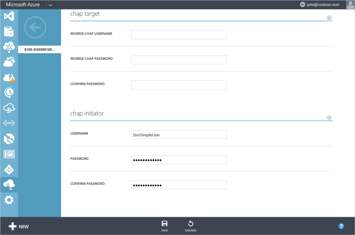

2. Ausführen eines Bildlaufs nach unten auf dieser Seite, und klicken Sie im Abschnitt **Initiator CHAP** :
                                                    
    1. Geben Sie einen Benutzernamen für Ihren CHAP Initiator.

    2. Geben Sie ein Kennwort für Ihren CHAP Initiator ein.

         > [AZURE.IMPORTANT] Der Benutzername CHAP muss weniger als 233 Zeichen enthalten. Das Kennwort CHAP muss zwischen 12 und 16 Zeichen. Mehr Benutzernamen oder Kennwort führt zu einer Authentifizierungsfehler auf dem Windows-Host.
    
    3. Bestätigen Sie das Kennwort ein.

4. Klicken Sie auf **Speichern**. Eine bestätigungsmeldung wird angezeigt. Klicken Sie auf **OK** , um die Änderungen zu speichern.

#### Unidirektionale Authentifizierung auf dem Windows-Host-Server zu konfigurieren

1. Starten Sie den iSCSI-Initiator auf dem Windows-Host-Server.

2. Klicken Sie im Fenster **iSCSI Initiatoreigenschaften** führen Sie die folgenden Schritte aus:
                                                    
    1. Klicken Sie auf der Registerkarte **Suche** .

        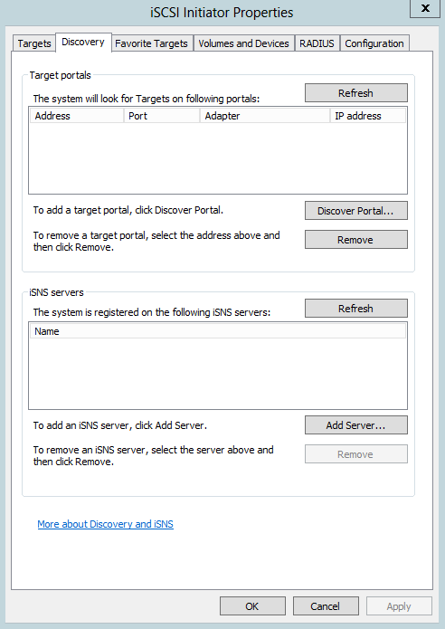

    2. Klicken Sie auf **Portal ermitteln**.

3. Klicken Sie im Dialogfeld **Ziel-Portal ermitteln** :
                                                    
    1. Geben Sie die IP-Adresse des Geräts ein.

    3. Klicken Sie auf **Erweitert**.

        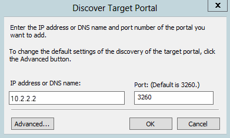

4. Klicken Sie im Dialogfeld **Erweiterte Einstellungen** :
                                                    
    1. Aktivieren Sie das Kontrollkästchen **Anmeldung CHAP aktivieren** .

    2. Geben Sie im Feld **Name** den Benutzernamen, den Sie für vom CHAP im Portal klassischen angegeben haben.

    3. Geben Sie im Feld **Ziel geheim** das Kennwort, das Sie für vom CHAP im Portal klassischen angegeben haben.

    4. Klicken Sie auf **OK**.

        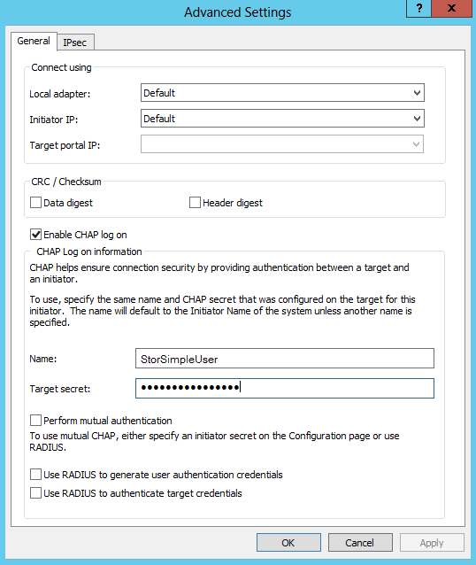

5. Auf der Registerkarte **Ziele** des Fensters **iSCSI Initiatoreigenschaften** sollte der Gerätestatus als **verbunden**angezeigt werden. Wenn Sie ein Gerät StorSimple 1200 verwenden, wird dann jedes Volume werden als ein iSCSI-Ziel bereitgestellt wie unten dargestellt. Daher müssen Schritte 3 und 4 für jedes Volume wiederholt werden soll.

    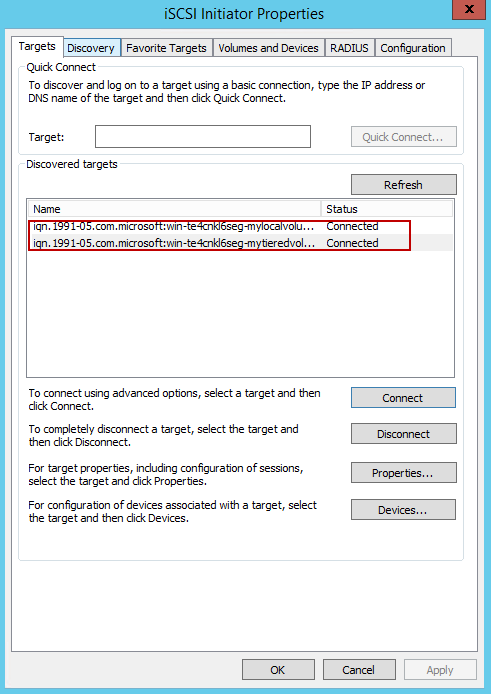

    > [AZURE.IMPORTANT] Wenn Sie den Namen der iSCSI ändern, wird der neue Namen für die neue iSCSI-Sitzungen verwendet werden. Neue Einstellungen werden nicht zum vorhandenen Sitzungen, bis Sie melden Sie sich ab und melden Sie sich erneut.

Weitere Informationen zum Konfigurieren von CHAP auf dem Windows-Hostserver wechseln Sie zu [Weitere Aspekte zu berücksichtigen](#additional-considerations).

## Bidirektionaler oder gegenseitig Authentifizierung

Das Ziel authentifiziert den Initiator bidirektionale Authentifizierung und klicken Sie dann der Initiator authentifiziert das Ziel. Dazu muss den Benutzer so konfigurieren Sie die Einstellungen für CHAP Initiator als auch die umgekehrten CHAP-Einstellungen auf dem Gerät und iSCSI-Initiatorsoftware auf dem Host. Die folgenden Schritte beschreiben die Schritte zum gemeinsamen Authentifizierung auf dem Gerät und auf dem Windows-Host konfigurieren.

#### So konfigurieren Sie Ihr Gerät für die gemeinsamen Authentifizierung

1. Klicken Sie im Azure klassischen-Portal auf der Seite **Geräte** auf die Registerkarte **Konfigurieren** .

    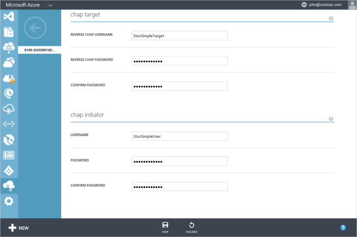

2. Ausführen eines Bildlaufs nach unten auf dieser Seite, und klicken Sie im Abschnitt **Target CHAP** :
                                                    
    1. Geben Sie einen **Benutzernamen umgekehrte CHAP** für Ihr Gerät.

    2. Ein **umgekehrte CHAP-Kennwort** für Ihr Gerät angeben.

    3. Bestätigen Sie das Kennwort ein.

3. Im Abschnitt **Initiator CHAP** :
                                                
    1. Geben Sie einen **Benutzernamen** für Ihr Gerät.

    1. Geben Sie ein **Kennwort** für Ihr Gerät.

    3. Bestätigen Sie das Kennwort ein.

4. Klicken Sie auf **Speichern**. Eine bestätigungsmeldung wird angezeigt. Klicken Sie auf **OK** , um die Änderungen zu speichern.

#### Bidirektionale Authentifizierung auf dem Windows-Host-Server zu konfigurieren

1. Starten Sie den iSCSI-Initiator auf dem Windows-Host-Server.

2. Klicken Sie auf die Registerkarte **Konfiguration** , klicken Sie im Fenster **iSCSI Initiatoreigenschaften** .

3. Klicken Sie auf **CHAP**.

4. Klicken Sie im Dialogfeld **iSCSI Initiator gemeinsamen CHAP-Schlüssel** :
                                                    
    1. Geben Sie die **Umgekehrte CHAP-Kennwort** , das Sie in der klassischen Azure-Portal konfiguriert.

    2. Klicken Sie auf **OK**.

        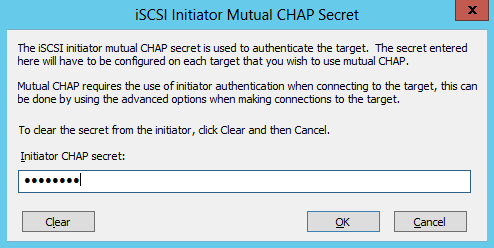

5. Klicken Sie auf der Registerkarte **Ziele** .

6. Klicken Sie auf die Schaltfläche **Verbinden** . 

7. Klicken Sie auf **Erweitert**, klicken Sie im Dialogfeld **Zu Ziel verbinden** .

8. Klicken Sie im Dialogfeld **Erweiterte Eigenschaften** :
                                                    
    1. Aktivieren Sie das Kontrollkästchen **Anmeldung CHAP aktivieren** .

    2. Geben Sie im Feld **Name** den Benutzernamen, den Sie für vom CHAP im Portal klassischen angegeben haben.

    3. Geben Sie im Feld **Ziel geheim** das Kennwort, das Sie für vom CHAP im Portal klassischen angegeben haben.

    4. Aktivieren Sie das Kontrollkästchen **gemeinsamen Authentifizierung ausführen** .

        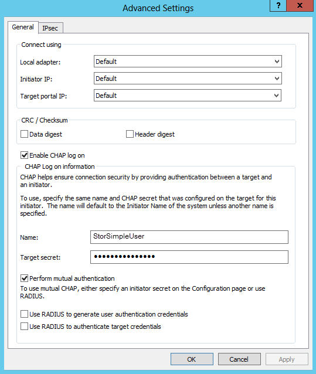

    5. Klicken Sie auf **OK** , um die CHAP-Konfiguration abzuschließen
     
Weitere Informationen zum Konfigurieren von CHAP auf dem Windows-Hostserver wechseln Sie zu [Weitere Aspekte zu berücksichtigen](#additional-considerations).

## Weitere Aspekte

Das Feature " **Schnelle verbinden** " unterstützt keine Verbindungen, die CHAP aktiviert haben. Wenn CHAP aktiviert ist, stellen Sie sicher, dass Sie die Schaltfläche **Verbinden** verwenden, die auf der Registerkarte **Ziele** für die Verbindung zu einem Ziel verfügbar ist.

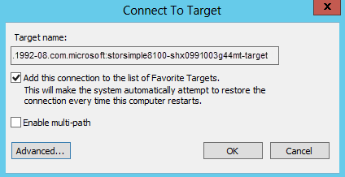

Wählen Sie im Dialogfeld **Verbindung herstellen mit Ziel** , die angezeigt werden, das Kontrollkästchen **Hinzufügen in Verbindung mit der Liste der bevorzugten Ziele** ein. Dadurch wird sichergestellt, dass jedes Mal, wenn der Computer neu gestartet wird, versucht wird, die Verbindung mit den iSCSI bevorzugten Zielen wiederherzustellen.

## Fehler bei der Konfiguration

Wenn Ihre Konfiguration CHAP falsch ist, können Sie wahrscheinlich eine **fehlgeschlagene Authentifizierung** Fehlermeldung angezeigt wird.

## Überprüfung des CHAP-Konfiguration

Sie können überprüfen, dass CHAP verwendet wird, indem Sie die folgenden Schritte durchführen.

#### So überprüfen Ihre CHAP-Konfiguration

1. Klicken Sie auf **bevorzugten Ziele**.

2. Wählen Sie das Ziel für das Authentifizierung aktiviert.

3. Klicken Sie auf **Details**.

    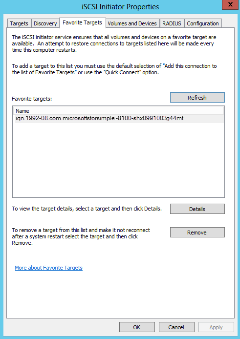

4. Beachten Sie im Dialogfeld **Bevorzugten Ziel Details** des Eintrags im Feld **Authentifizierung** aus. Wenn die Konfiguration erfolgreich war, sollte **CHAP**angezeigt werden.

    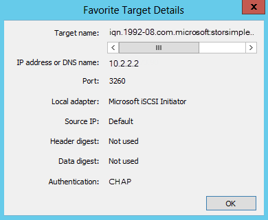

## Nächste Schritte

- Erfahren Sie mehr über die [Sicherheit StorSimple](storsimple-security.md).

- Weitere Informationen zum [Verwenden des Diensts StorSimple Manager zum Verwalten von Ihrem Geräts StorSimple](storsimple-manager-service-administration.md).
