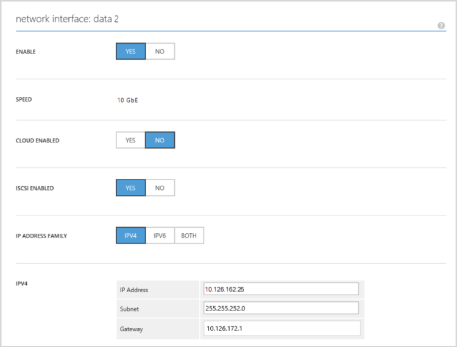
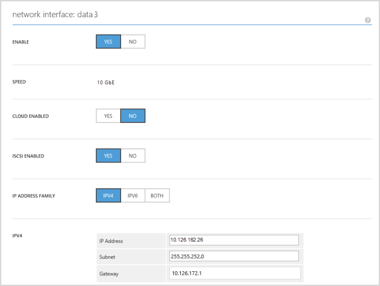
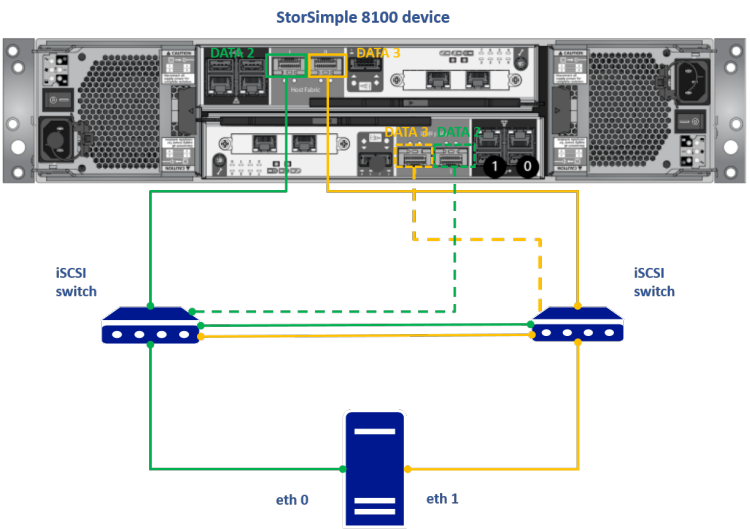

<properties
   pageTitle="Konfigurieren von MPIO auf StorSimple Linux Host | Microsoft Azure"
   description="Konfigurieren der MPIO auf StorSimple bei einer Verbindung zu einem Linux-Server ausgeführt CentOS 6.6"
   services="storsimple"
   documentationCenter="NA"
   authors="alkohli"
   manager="carmonm"
   editor="tysonn" />
<tags
   ms.service="storsimple"
   ms.devlang="na"
   ms.topic="article"
   ms.tgt_pltfrm="na"
   ms.workload="na"
   ms.date="09/21/2016"
   ms.author="alkohli" />

# Konfigurieren von MPIO auf einem StorSimple Host CentOS ausgeführt

In diesem Artikel wird erläutert, die erforderlichen Schritte zum Multipathing EA (MPIO) auf Ihrem Centos 6.6 Hostserver zu konfigurieren. Hostserver ist mit Ihrem Gerät Microsoft Azure StorSimple für hohe Verfügbarkeit über iSCSI-Initiatoren verbunden. Es wird ausführlich beschrieben die automatische Erkennung von mehreren Pfaden Geräte und bestimmte Setup nur für StorSimple Datenmengen.

Dieses Verfahren gilt für alle Modelle StorSimple 8000 Reihe Geräte zur Verfügung.

>[AZURE.NOTE] Dieses Verfahren kann nicht für ein StorSimple virtuelles Gerät verwendet werden. Weitere Informationen finden Sie unter So für Ihr Gerät virtuelle Host-Servern zu konfigurieren.

## Informationen zu multipathing

Das Feature Multipathing können Sie mehrere e/a-Pfade zwischen einem Hostserver und ein Speichergerät zu konfigurieren. Diese e/a-Pfade sind physische SAN-Verbindungen, bei die einzelne Kabel, Schalter, Netzwerk-Schnittstellen und Controller enthalten sein können. Multipathing aggregiert die e/a-Pfade ein, um ein neues Gerät zu konfigurieren, das alle Pfade zusammengefasster zugeordnet ist.

Der Zweck des Multipathing es gibt zwei:

- **Hohe Verfügbarkeit**: Es bietet einen alternativen Pfad, wenn ein Element den e/a-Pfad (z. B. Kabel, wechseln, Netzwerk-Benutzeroberfläche oder Controller) fehlschlägt.

- **Lastenausgleich**: je nach Konfiguration von Ihrem Speichergerät, können sie die Leistung verbessern, indem Sie lädt die e/a-Pfade erkennen und dynamisch Qualifikationsprofilen diese lädt.

### Zu Multipathing Komponenten

Multipathing in Linux besteht aus Kernelkomponenten und Bereich Benutzers Komponenten wie unter tabellarisch angeordnet.

- **Kernel**: die wichtigste Komponente ist das *Gerät-Mapper* , die e/a leitet und Failover für Pfade und Pfadgruppen unterstützt.

1. **Bereich Benutzers**: Hierbei handelt es sich um *mehrere Pfade-Tools* , mit denen Multipathed Geräte zu verwalten, indem Sie, dem Gerät-Mapper mehreren Pfaden Modul anweisen, was zu tun ist. Die Tools bestehen aus:

    - **Mehrere Pfade**: Listen und multipathed Geräte konfiguriert.

    - **Multipathd**: Daemon, die mehrere Pfade führt und überwacht die Pfade.

    - **· Devmap-Name**: einen Gerät aussagekräftigen Namen zu Udev für Devmaps enthält.

    - **Kpartx**: Ordnet linearen Devmaps Gerät Partitionen mehreren Pfaden Karten partitionierbare vornehmen.

    - **Multipath.conf**: Konfigurationsdatei für mehreren Pfaden Daemon, mit der die Konfigurationstabelle integrierten überschreiben.

### Informationen zu den multipath.conf Konfigurationsdatei

Konfigurationsdatei `/etc/multipath.conf` macht viele Features Multipathing konfigurierbare. Die `multipath` Befehl und der Kernel Daemon `multipathd` verwenden Sie die Informationen in dieser Datei gefunden. Die Datei wird nur während der Konfiguration von mehreren Pfaden Geräte gehört. Stellen Sie sicher, dass alle Änderungen vorgenommen werden, bevor Sie Ausführen der `multipath` Befehl. Wenn Sie die Datei später ändern, müssen Sie zum Beenden und Multipathd, damit die Änderungen wirksam werden erneut starten.

Die multipath.conf hat fünf Abschnitte:

- **Ebene Standardeinstellungen des Systems zurückzusetzen** *(Standard)*: Sie können Ebene Standardeinstellungen des Systems zurückzusetzen außer Kraft setzen.

1. **Blacklisted Geräte** *(schwarze Liste)*: Sie können angeben, dass die Liste der Geräte, die nicht vom Gerät--Mapper gesteuert werden soll.

1. **Schwarzen Ausnahmen** *(Blacklist_exceptions)*: Sie können identifizieren bestimmte Geräte als mehreren Pfaden Geräte behandelt werden soll, auch wenn in der schwarzen Liste aufgeführt.

1. **Bestimmte Speicher Controller-Einstellungen** *(Geräte)*: Sie können angeben, Konfiguration Einstellungen, die auf Geräte angewendet werden, die und Etiketteninformationen Informationen enthalten.

1. **Bestimmte des Audiogeräts** *(Multipaths)*: Verwenden Sie diesen Abschnitt vereinfacht die Konfiguration Einstellungen für einzelne LUNs.

## Konfigurieren der Multipathing auf StorSimple Linux-Server verbunden ist.

Ein StorSimple Gerät bei einer Verbindung zu einem Linux-Server kann für hohen Verfügbarkeit und Lastenausgleich konfiguriert werden. Angenommen, wenn der Linux Host zwei Schnittstellen mit dem SAN verbunden weist, und das Gerät verfügt über zwei Schnittstellen mit dem SAN verbunden werden, sodass diese Schnittstellen im selben Subnetz sind, werden klicken Sie dann es 4 Pfade verfügbar sein. Jedoch, wenn jede Schnittstelle Daten auf der Benutzeroberfläche Gerät und Host in einem anderen IP-Subnetz (und nicht geroutet) sind, klicken Sie dann nur 2-Wege stehen zur Verfügung. Sie können Multipathing um automatisch ermitteln aller verfügbaren Pfade, wählen Sie einen Algorithmus Lastenausgleich für diese Pfade, anwenden bestimmte Konfigurationen für die StorSimple nur Datenmengen, und klicken Sie dann aktivieren und überprüfen Multipathing konfigurieren.

Das folgende Verfahren beschreibt das Multipathing konfigurieren, wenn ein Gerät StorSimple mit zwei Netzwerkschnittstellen mit einem Server mit zwei Netzwerkschnittstellen verbunden ist.

## Erforderliche Komponenten

In diesem Abschnitt werden die Konfiguration Vorkenntnisse CentOS Server und Ihrem Gerät StorSimple.

### Klicken Sie auf CentOS host

1. Stellen Sie sicher, dass Ihre CentOS Host 2 Netzwerkschnittstellen aktiviert ist. Type:

    `ifconfig`

    Im folgenden Beispiel wird die Ausgabe an, wenn zwei-Schnittstellen Netzwerk (`eth0` und `eth1`) auf dem Host vorhanden sind.

        [root@centosSS ~]# ifconfig
        eth0  Link encap:Ethernet  HWaddr 00:15:5D:A2:33:41  
        inet addr:10.126.162.65  Bcast:10.126.163.255  Mask:255.255.252.0
        inet6 addr: 2001:4898:4010:3012:215:5dff:fea2:3341/64 Scope:Global
        inet6 addr: fe80::215:5dff:fea2:3341/64 Scope:Link
        UP BROADCAST RUNNING MULTICAST  MTU:1500  Metric:1
        RX packets:36536 errors:0 dropped:0 overruns:0 frame:0
        TX packets:6312 errors:0 dropped:0 overruns:0 carrier:0
        collisions:0 txqueuelen:1000
        RX bytes:13994127 (13.3 MiB)  TX bytes:645654 (630.5 KiB)

        eth1  Link encap:Ethernet  HWaddr 00:15:5D:A2:33:42  
        inet addr:10.126.162.66  Bcast:10.126.163.255  Mask:255.255.252.0
        inet6 addr: 2001:4898:4010:3012:215:5dff:fea2:3342/64 Scope:Global
        inet6 addr: fe80::215:5dff:fea2:3342/64 Scope:Link
        UP BROADCAST RUNNING MULTICAST  MTU:1500  Metric:1
        RX packets:25962 errors:0 dropped:0 overruns:0 frame:0
        TX packets:11 errors:0 dropped:0 overruns:0 carrier:0
        collisions:0 txqueuelen:1000
        RX bytes:2597350 (2.4 MiB)  TX bytes:754 (754.0 b)

        loLink encap:Local Loopback  
        inet addr:127.0.0.1  Mask:255.0.0.0
        inet6 addr: ::1/128 Scope:Host
        UP LOOPBACK RUNNING  MTU:65536  Metric:1
        RX packets:12 errors:0 dropped:0 overruns:0 frame:0
        TX packets:12 errors:0 dropped:0 overruns:0 carrier:0
        collisions:0 txqueuelen:0
        RX bytes:720 (720.0 b)  TX bytes:720 (720.0 b)

1. Installieren Sie auf dem Server CentOS *iSCSI-Initiator-Utils* ein. Führen Sie die folgenden Schritte aus, um *iSCSI-Initiator-Utils*zu installieren.

    1. Melden Sie sich als `root` in Ihrem CentOS Host.

    1. Installieren der *iSCSI-Initiator-Utils*an. Type:

        `yum install iscsi-initiator-utils`

    1. Nachdem der *iSCSI-Initiator-Utils* erfolgreich installiert wurde, starten Sie den iSCSI-Dienst. Type:

        `service iscsid start`

        Klicken Sie auf Anlässe `iscsid` möglicherweise tatsächlich nicht gestartet und die `--force` Option notwendig sein

    1. Um sicherzustellen, dass Ihre iSCSI-Initiator während des Starts aktiviert ist, verwenden Sie die `chkconfig` Befehl aus, um den Dienst zu aktivieren.

        `chkconfig iscsi on`

    1. Um zu überprüfen, die es ordnungsgemäß eingerichtet wurde, führen Sie den Befehl aus:

        `chkconfig --list | grep iscsi`

        Nachfolgend finden Sie eine Beispiel für die Ausgabe.

            iscsi   0:off   1:off   2:on3:on4:on5:on6:off
            iscsid  0:off   1:off   2:on3:on4:on5:on6:off

        Aus der obigen Beispiel können Sie sehen, dass Ihre iSCSI-Umgebung auf Ebenen ausführen, 2, 3, 4 und 5 auf Startzeit ausgeführt werden soll.

1. Installieren Sie *mehrere Geräte-Mapper-Pfade*. Type:

    `yum install device-mapper-multipath`

    Die Installation wird gestartet. Geben Sie **Y** fortsetzen, wenn Sie zur Bestätigung aufgefordert werden.

### Klicken Sie auf Gerät StorSimple

Ihr Gerät StorSimple sollten haben:

- Mindestens zwei Schnittstellen für iSCSI aktiviert. Um zu überprüfen, dass zwei Schnittstellen auf Ihrem Gerät StorSimple iSCSI aktiviert sind, gehen Sie folgendermaßen im klassischen Azure-Portal für Ihr Gerät StorSimple aus:

    1. Melden Sie sich in der klassischen Portal für Ihr Gerät StorSimple.

    1. Wählen Sie den Dienst StorSimple-Manager, klicken Sie auf **Geräte** , und wählen Sie das gewünschte StorSimple Gerät aus. Klicken Sie auf **Konfigurieren** , und vergewissern Sie sich im Netzwerk Benutzeroberflächen-Einstellungen. Nachfolgend finden Sie ein Screenshot mit zwei iSCSI aktivierten Netzwerk-Schnittstellen. Hier Daten 2 und 3 von Daten, beide 10 GbE Schnittstellen für iSCSI aktiviert sind.

        

        

        Auf der Seite **Konfigurieren**

        1. Stellen Sie sicher, dass Netzwerkschnittstellen iSCSI aktiviert sind. Legen Sie das Feld **iSCSI aktiviert** auf **Ja**.
        2. Stellen Sie sicher, dass die Netzwerk-Schnittstellen die gleiche Geschwindigkeit aufweisen, beide 1 Switch oder 10 GbE sein soll.
        3. Beachten Sie die IPv4-Adressen der Schnittstellen iSCSI aktiviert und zur späteren Verwendung auf dem Host speichern.

- Die iSCSI-Schnittstellen auf Ihrem Gerät StorSimple sollte vom Server CentOS erreichbar sein.

    Um dies zu überprüfen, müssen Sie die IP-Adressen Ihrer StorSimple iSCSI aktivierten Netzwerk-Schnittstellen auf dem Hostserver bereitstellen. Verwendete Befehle und die entsprechenden Ausgabe mit DATA2 (10.126.162.25) und DATA3 (10.126.162.26) wird unten angezeigt:

        [root@centosSS ~]# iscsiadm -m discovery -t sendtargets -p 10.126.162.25:3260
        10.126.162.25:3260,1 iqn.1991-05.com.microsoft:storsimple8100-shx0991003g44mt-target
        10.126.162.26:3260,1 iqn.1991-05.com.microsoft:storsimple8100-shx0991003g44mt-target

### Hardwarekonfiguration

Es empfiehlt sich, dass Sie die zwei iSCSI-Netzwerk-Schnittstellen separate Pfade Redundanzgründen verbinden. Die folgende Abbildung zeigt die empfohlene Hardwarekonfiguration für hohe Verfügbarkeit und den Lastenausgleich Multipathing für Ihre CentOS Server und StorSimple Gerät.

Wie in der vorherigen Abbildung dargestellt:

- Ihr Gerät StorSimple befindet sich Aktiv-Passiv-Konfiguration mit zwei Controller.

- Zwei SAN Schalter, die auf Ihrem Gerätecontroller verbunden sind.

- Zwei iSCSI-Initiatoren auf Ihrem Gerät StorSimple aktiviert sind.

- Zwei Netzwerkschnittstellen werden auf dem Host CentOS aktiviert.

Die oben angegebenen Konfiguration wird 4 separate Pfade zwischen Ihrem Gerät und dem Host führen, wenn die Schnittstellen Host und Daten geroutet werden können.

>[AZURE.IMPORTANT]
>
>- Es empfiehlt sich, dass Sie nicht Switch 1 und 10 Switch Netzwerk-Schnittstellen für das Multipathing kombinieren. Bei der Verwendung von zwei Netzwerkschnittstellen sollte sowohl die Schnittstellen den Typ identisch sein.
>- Klicken Sie auf Ihrem Gerät StorSimple DATA0, Daten1, DATA4 und DATA5 sind 1 Switch-Schnittstellen während DATA2 und DATA3 10 GbE-Netzwerk-Schnittstellen sind. |

## Konfigurationsschritte

Die Konfigurationsschritte für Multipathing umfassen die Konfiguration der verfügbaren Pfade für die automatische Erkennung, den Lastenausgleich Algorithmus verwenden, angeben Multipathing aktivieren und schließlich die Konfiguration überprüfen. Jeder dieser Schritte wird in den folgenden Abschnitten ausführlich erläutert.

### Schritt 1: Konfigurieren von Multipathing zur automatischen Erkennung

Die mehrere Pfade unterstützt Geräte können automatisch erkannt und konfiguriert werden.

1. Initialisierung `/etc/multipath.conf` Datei. Type:

     `Copy mpathconf --enable`

    Der obige Befehl erstellt eine `sample/etc/multipath.conf` Datei.

1. Starten von mehreren Pfaden Dienst. Type:

    ``Copy service multipathd start``

    Das folgende Ergebnis wird angezeigt:

    `Starting multipathd daemon:`

1. Automatische Erkennung von Multipaths zu aktivieren. Type:

    `mpathconf --find_multipaths y`

    Dies wird im Abschnitt Standardeinstellungen ändern Ihrer `multipath.conf` wie unten dargestellt:

        defaults {
        find_multipaths yes
        user_friendly_names yes
        path_grouping_policy multibus
        }

### Schritt 2: Konfigurieren von Multipathing für StorSimple Datenmengen

Standardmäßig werden alle Geräte sind in der Datei multipath.conf aufgeführten Schwarz und werden umgangen werden. Sie müssen schwarzen Ausnahmen zulässig Multipathing für Datenmengen aus StorSimple Geräte erstellen.

1. Bearbeiten der `/etc/mulitpath.conf` Datei. Type:

    `vi /etc/multipath.conf`

1. Suchen Sie im Abschnitt Blacklist_exceptions in der Datei multipath.conf aus. Ihr Gerät StorSimple muss als schwarze Ausnahme in diesem Abschnitt aufgeführt werden. Sie können entfernen Sie die Kommentarzeichen relevanten Positionen in dieser Datei zu ändern, wie unten (verwenden Sie nur bestimmte Modell des Geräts verwendeten Programms) gezeigt:

        blacklist_exceptions {
            device {
                       vendor  "MSFT"
                       product "STORSIMPLE 8100*"
            }
            device {
                       vendor  "MSFT"
                       product "STORSIMPLE 8600*"
            }
           }

### Schritt 3: Konfigurieren von Round-Robert multipathing

Diese den Lastenausgleich Algorithmus verwendet alle verfügbaren Multipaths mit dem aktiven Controller in angeglichene, Round-Robert Form.

1. Bearbeiten der `/etc/multipath.conf` Datei. Type:

    `vi /etc/multipath.conf`

1. Klicken Sie unter der `defaults` Abschnitt, legen Sie die `path_grouping_policy` zu `multibus`. Die `path_grouping_policy` gibt den standardmäßigen Pfad Gruppierung Richtlinie nicht angegebener Multipaths zuweisen. Im Abschnitt Standardeinstellungen aussieht, wie unten dargestellt.

        defaults {
                user_friendly_names yes
                path_grouping_policy multibus
        }

> [AZURE.NOTE]
> Die am häufigsten verwendeten Werte `path_grouping_policy` gehören:

> - Failover = 1 Pfad pro Priorität Gruppe
> - Multibus = alle gültige Pfade in 1 Priorität Gruppe

### Schritt 4: Aktivieren multipathing

1. Starten Sie erneut die `multipathd` Daemon. Type:

    `service multipathd restart`

1. Die Ausgabe werden, wie unten dargestellt:

        [root@centosSS ~]# service multipathd start
        Starting multipathd daemon:  [OK]

### Schritt 5: Überprüfen Sie, ob multipathing

1. Vergewissern Sie sich zuerst, dass iSCSI-Verbindung mit dem Gerät StorSimple eingerichtet ist:

    1. Entdecken Sie Ihr Gerät StorSimple. Type:

        `iscsiadm -m discovery -t sendtargets -p  <IP address of network interface on the device>:<iSCSI port on StorSimple device>`

        Die Ausgabe beim IP-Adresse für DATA0 10.126.162.25 ist und Port 3260 wird auf dem Gerät StorSimple für ausgehende iSCSI-Verkehr geöffnet ist, wie unten dargestellt:

            10.126.162.25:3260,1 iqn.1991-05.com.microsoft:storsimple8100-shx0991003g00dv-target
            10.126.162.26:3260,1 iqn.1991-05.com.microsoft:storsimple8100-shx0991003g00dv-target

        Kopieren der IQN Ihres Geräts StorSimple `iqn.1991-05.com.microsoft:storsimple8100-shx0991003g00dv-target`, aus der vorherigen Ausgabe.

    1. Verbinden Sie mit dem Gerät Ziel IQN her. Das Gerät StorSimple wird hier die iSCSI-Ziel. Type:

        `iscsiadm -m node --login -T <IQN of iSCSI target>`

        Im folgenden Beispiel wird mit einem Ziel IQN Ausgabe von `iqn.1991-05.com.microsoft:storsimple8100-shx0991003g00dv-target`. Die Ausgabe gibt an, dass Sie auf Ihrem Gerät erfolgreich mit den beiden iSCSI aktivierten Netzwerk-Schnittstellen verbunden haben.

            Logging in to [iface: eth0, target: iqn.1991-05.com.microsoft:storsimple8100-shx0991003g00dv-target, portal: 10.126.162.25,3260] (multiple)
            Logging in to [iface: eth1, target: iqn.1991-05.com.microsoft:storsimple8100-shx0991003g00dv-target, portal: 10.126.162.25,3260] (multiple)
            Logging in to [iface: eth0, target: iqn.1991-05.com.microsoft:storsimple8100-shx0991003g00dv-target, portal: 10.126.162.26,3260] (multiple)
            Logging in to [iface: eth1, target: iqn.1991-05.com.microsoft:storsimple8100-shx0991003g00dv-target, portal: 10.126.162.26,3260] (multiple)
            Login to [iface: eth0, target: iqn.1991-05.com.microsoft:storsimple8100-shx0991003g00dv-target, portal: 10.126.162.25,3260] successful.
            Login to [iface: eth1, target: iqn.1991-05.com.microsoft:storsimple8100-shx0991003g00dv-target, portal: 10.126.162.25,3260] successful.
            Login to [iface: eth0, target: iqn.1991-05.com.microsoft:storsimple8100-shx0991003g00dv-target, portal: 10.126.162.26,3260] successful.
                Login to [iface: eth1, target: iqn.1991-05.com.microsoft:storsimple8100-shx0991003g00dv-target, portal: 10.126.162.26,3260] successful.

        Wenn Sie nur eine Host-Benutzeroberfläche und zwei Pfade hier angezeigt wird, müssen Sie sowohl die Schnittstellen für iSCSI Host aktivieren. Sie können die [ausführliche Anweisungen in Linux-Dokumentation](https://access.redhat.com/documentation/Red_Hat_Enterprise_Linux/5/html/Online_Storage_Reconfiguration_Guide/iscsioffloadmain.html)folgen.

    1. Ein Volume wird auf dem Server CentOS vom Gerät StorSimple bereitgestellt. Weitere Informationen finden Sie unter [Schritt 6: Erstellen Sie einen Datenträger](storsimple-deployment-walkthrough.md#step-6-create-a-volume) über das klassische Azure-Portal auf Ihrem Gerät StorSimple.

    1. Überprüfen Sie die verfügbaren Pfade aus. Type:

        `multipath –l`

        Im folgenden Beispiel wird die Ausgabe für zwei Netzwerkschnittstellen auf einem StorSimple Gerät bei einer Verbindung zu einer einzigen Host-Schnittstelle mit zwei verfügbaren Pfade an.

            mpathb (36486fd20cc081f8dcd3fccb992d45a68) dm-3 MSFT,STORSIMPLE 8100
            size=100G features='0' hwhandler='0' wp=rw
            `-+- policy='round-robin 0' prio=0 status=active
              |- 7:0:0:1 sdc 8:32 active undef running
              `- 6:0:0:1 sdd 8:48 active undef running

        Im folgenden Beispiel wird die Ausgabe für zwei Netzwerkschnittstellen auf einem StorSimple Gerät mit zwei Host Netzwerk-Schnittstellen mit vier verfügbaren Pfade verbunden.

            mpathb (36486fd27a23feba1b096226f11420f6b) dm-2 MSFT,STORSIMPLE 8100
            size=100G features='0' hwhandler='0' wp=rw
            `-+- policy='round-robin 0' prio=0 status=active
              |- 17:0:0:0 sdb 8:16 active undef running
              |- 15:0:0:0 sdd 8:48 active undef running
              |- 14:0:0:0 sdc 8:32 active undef running
              `- 16:0:0:0 sde 8:64 active undef running

        Nachdem die Pfade konfiguriert sind, finden Sie in den bestimmten Anweisungen auf dem Host-Betriebssystem (Centos 6.6) bereitstellen und dieses Volume formatieren.

## Behandeln von Problemen mit multipathing

Dieser Abschnitt enthält einige hilfreiche Tipps, wenn Sie Probleme bei der Konfiguration Multipathing auftreten.

F. Ich sehe nicht die Änderungen in `multipath.conf` Datei auswirkt.

A Wenn Sie alle Änderungen vorgenommen haben die `multipath.conf` Datei müssen den Multipathing-Dienst neu starten. Geben Sie den folgenden Befehl ein:

    service multipathd restart

F. Ich habe zwei Netzwerkschnittstellen auf dem Gerät StorSimple und zwei Netzwerkschnittstellen auf dem Host aktiviert. Wenn ich die verfügbaren Pfaden Liste nur zwei Pfade angezeigt. Kann ich die verlorenen vier verfügbaren Pfade finden Sie unter.

A Stellen Sie sicher, dass die beiden Pfade in demselben Subnetz sind und geroutet. Wenn die Netzwerk-Schnittstellen auf verschiedenen vLANs und nicht weitergeleitet werden, wird nur zwei Pfade angezeigt. Eine Möglichkeit, dies zu überprüfen ist, um sicherzustellen, dass Sie sowohl die Host-Schnittstellen über eine Netzwerk-Oberfläche auf dem Gerät StorSimple erreichen können. Sie werden als diese Überprüfung [wenden Sie sich an Microsoft Support](storsimple-contact-microsoft-support.md) nur über eine Support-Sitzung ausgeführt werden können müssen.

F. Wenn ich verfügbaren Pfade Liste sehe ich keine Ausgabe nicht.

A In der Regel keine Pfade Multipathed angezeigt schlägt ein Problem mit der Daemon Multipathing, und es wahrscheinlich ist, dass alle Problem hier in liegt der `multipath.conf` Datei.

Es wäre auch im Wert überprüfen, ob Sie tatsächlich einige Datenträger beim verfolgen können nach dem Herstellen einer Verbindung mit dem Ziel, keine Antwort aus mehreren Pfaden-angeboten auch bedeuten kann, dass Sie keine Datenträger haben.

- Verwenden Sie den folgenden Befehl aus den SCSI-Bus erneuten aus:

    `$ rescan-scsi-bus.sh `(Bestandteil der sg3_utils-Paket)

- Geben Sie die folgenden Befehle:

    `$ dmesg | grep sd*`

- Oder

    `$ fdisk –l`

    Diese zurückgegeben werden Details der zuletzt hinzugefügten Datenträger kann.

- Um festzustellen, ob es sich um einen Datenträger StorSimple handelt, verwenden Sie die folgenden Befehle:

    `cat /sys/block/<DISK>/device/model`

    Dies gibt eine Zeichenfolge zurück, die ermitteln können, ob es sich um einen Datenträger StorSimple handelt.

Ein weniger wahrscheinlich, aber mögliche Ursache könnte auch veraltete Iscsid pid. Verwenden Sie den folgenden Befehl von der iSCSI-Sitzungen Abmelden aus:

    iscsiadm -m node --logout -p <Target_IP>

Wiederholen Sie diesen Befehl für die verbundenen Netzwerkschnittstellen am Ziel iSCSI, das Ihrem Gerät StorSimple ist. Sobald Sie deaktiviert aus allen iSCSI-Sitzungen angemeldet haben, verwenden Sie das iSCSI-Ziel IQN, die iSCSI-Sitzung wiederherzustellen. Geben Sie den folgenden Befehl ein:

    iscsiadm -m node --login -T <TARGET_IQN>

F. Ich bin mir nicht sicher, ob auf meinem Gerät weißen Liste enthalten ist.

A Um zu überprüfen, ob Ihr Gerät weißen Liste enthalten ist, verwenden Sie den folgenden Befehl aus zur Problembehandlung interaktiven:

    multipathd –k
    multipathd> show devices
    available block devices:
    ram0 devnode blacklisted, unmonitored
    ram1 devnode blacklisted, unmonitored
    ram2 devnode blacklisted, unmonitored
    ram3 devnode blacklisted, unmonitored
    ram4 devnode blacklisted, unmonitored
    ram5 devnode blacklisted, unmonitored
    ram6 devnode blacklisted, unmonitored
    ram7 devnode blacklisted, unmonitored
    ram8 devnode blacklisted, unmonitored
    ram9 devnode blacklisted, unmonitored
    ram10 devnode blacklisted, unmonitored
    ram11 devnode blacklisted, unmonitored
    ram12 devnode blacklisted, unmonitored
    ram13 devnode blacklisted, unmonitored
    ram14 devnode blacklisted, unmonitored
    ram15 devnode blacklisted, unmonitored
    loop0 devnode blacklisted, unmonitored
    loop1 devnode blacklisted, unmonitored
    loop2 devnode blacklisted, unmonitored
    loop3 devnode blacklisted, unmonitored
    loop4 devnode blacklisted, unmonitored
    loop5 devnode blacklisted, unmonitored
    loop6 devnode blacklisted, unmonitored
    loop7 devnode blacklisted, unmonitored
    sr0 devnode blacklisted, unmonitored
    sda devnode whitelisted, monitored
    dm-0 devnode blacklisted, unmonitored
    dm-1 devnode blacklisted, unmonitored
    dm-2 devnode blacklisted, unmonitored
    sdb devnode whitelisted, monitored
    sdc devnode whitelisted, monitored
    dm-3 devnode blacklisted, unmonitored

Wechseln Sie weitere Informationen [zur Problembehandlung interaktive Befehle für das Multipathing](http://www.centos.org/docs/5/html/5.1/DM_Multipath/multipath_config_confirm.html)verwenden.

## Liste der hilfreichen Befehlen

|Typ|Befehl|Beschreibung|
|---|---|---|
|**iSCSI**|`service iscsid start`|ISCSI-Dienst starten|
|&nbsp;|`service iscsid stop`|Beenden der iSCSI-Dienst|
|&nbsp;|`service iscsid restart`|ISCSI-Dienst starten|
|&nbsp;|`iscsiadm -m discovery -t sendtargets -p <TARGET_IP>`|Ermitteln der verfügbaren Ziele in der angegebenen Adresse|
|&nbsp;|`iscsiadm -m node --login -T <TARGET_IQN>`|Melden Sie sich bei der iSCSI-Ziel|
|&nbsp;|`iscsiadm -m node --logout -p <Target_IP>`|Melden Sie sich ab, aus dem iSCSI-Ziel|
|&nbsp;|`cat /etc/iscsi/initiatorname.iscsi`|ISCSI-Initiatornamen drucken|
|&nbsp;|`iscsiadm –m session –s <sessionid> -P 3`|Überprüfen Sie den Status der Datenträger, auf dem Host erkannt und iSCSI-Sitzung|
|&nbsp;|`iscsi –m session`|Zeigt alle iSCSI-Sitzungen, die zwischen dem Host und dem Gerät StorSimple hergestellt|
| | | |
|**Multipathing**|`service multipathd start`|Starten von mehreren Pfaden daemon|
|&nbsp;|`service multipathd stop`|Beenden von mehreren Pfaden daemon|
|&nbsp;|`service multipathd restart`|Starten von mehreren Pfaden daemon|
|&nbsp;|`chkconfig multipathd on`   ODER   `mpathconf –with_chkconfig y`|Aktivieren von mehreren Pfaden Daemon beim Start starten|
|&nbsp;|`multipathd –k`|Starten Sie die interaktive Konsole zur Behandlung dieses Problems|
|&nbsp;|`multipath –l`|Liste mehreren Pfaden Verbindungen und Geräte|
|&nbsp;|`mpathconf --enable`|Erstellen einer mulitpath.conf Beispieldatei in`/etc/mulitpath.conf`|
||||

## Nächste Schritte

Wie Sie MPIO auf Linux-Server konfigurieren möchten, müssen Sie möglicherweise auch in den folgenden CentoS 6.6 Dokumenten verweisen:

- [Einrichten von MPIO auf CentOS](http://www.centos.org/docs/5/html/5.1/DM_Multipath/setup_procedure.html)
- [Leitfaden für Linux-Schulung](http://linux-training.be/files/books/LinuxAdm.pdf)
