<properties 
   pageTitle="Konfigurieren von MPIO für Ihr Gerät StorSimple | Microsoft Azure"
   description="Beschreibt, wie e/a-Multipfad-für Ihr StorSimple Gerät bei einer Verbindung zu einem Host unter Windows Server 2012 R2 konfigurieren."
   services="storsimple"
   documentationCenter=""
   authors="alkohli"
   manager="carmonm"
   editor="" />
<tags 
   ms.service="storsimple"
   ms.devlang="NA"
   ms.topic="article"
   ms.tgt_pltfrm="NA"
   ms.workload="NA"
   ms.date="08/17/2016"
   ms.author="alkohli" />

# Konfigurieren Sie mehrere Pfade e/a für Ihr Gerät StorSimple

Microsoft Support für das e/a-Multipfad-Feature in Windows Server Hilfe erstellen hoch verfügbare und Fehlertoleranz SAN Konfigurationen erstellt. MPIO verwendet redundante physische Pfadkomponenten – Netzwerkadapter, Kabel und Schalter – um logische Pfade zwischen dem Server und dem Speichergerät zu erstellen. Wenn eine Komponente Fehler auftritt, verursacht einen logischen Pfad fehlschlägt, verwendet Multipathing Logik einen alternativen Pfad für e/a, sodass die Applikationen weiterhin auf ihre Daten zugreifen können. Darüber hinaus kann je nach Konfiguration, MPIO auch Leistung verbessern, indem Sie erneut die Last über alle diese Pfade. Weitere Informationen finden Sie unter [Übersicht MPIO](https://technet.microsoft.com/library/cc725907.aspx "MPIO Übersicht und Features").  

Hohe Verfügbarkeit der Lösung StorSimple sollte MPIO auf Ihrem Gerät StorSimple konfiguriert werden. MPIO auf den Hostservern unter Windows Server 2012 R2 installiert ist, können die Server dann ein Link, Netzwerk- oder bei der Benutzeroberfläche tolerieren. 

MPIO ist ein optionales Feature unter Windows Server und ist standardmäßig nicht installiert. Es sollte als ein Feature über den Server-Manager installiert werden. In diesem Thema werden die Schritte beschrieben, die Sie soll zum Installieren und verwenden das Feature MPIO auf einem Host unter Windows Server 2012 R2 folgen und zu einem StorSimple physischen Gerät verbunden.

>[AZURE.NOTE] **Dieses Verfahren gilt für nur StorSimple 8000 Serie. MPIO wird derzeit nicht auf einem StorSimple virtuelle Gerät unterstützt.**

Sie müssen führen Sie die folgenden Schritte aus, um MPIO auf Ihrem Gerät StorSimple konfigurieren:

- Schritt 1: Installieren MPIO auf dem Host von Windows Server

- Schritt 2: Konfigurieren von MPIO für StorSimple Datenmengen

- Schritt 3: Bereitstellen StorSimple Datenmengen auf dem host

- Schritt 4: Konfigurieren von MPIO für hohe Verfügbarkeit und Lastenausgleich

Die oben aufgeführten Schritte werden in den folgenden Abschnitten erläutert.

## Schritt 1: Installieren MPIO auf dem Windows Server-host

Gehen Sie folgendermaßen vor, um dieses Feature auf Ihrem Windows Server-Host zu installieren.

#### So installieren Sie MPIO auf dem host

1. Öffnen Sie Server-Manager auf Ihrem Windows Server-Host ein. Standardmäßig startet Server-Manager auf, wenn ein Mitglied der Gruppe Administratoren Protokolle an einem Computer, auf dem Windows Server 2012 R2 oder Windows Server 2012 ausgeführt wird. Wenn der Server-Manager noch nicht geöffnet ist, klicken Sie auf **starten > Server-Manager**.
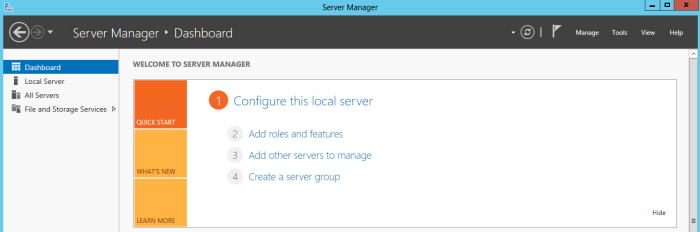
2. Klicken Sie auf **Server-Manager > Dashboards > Hinzufügen von Rollen und Features**. Hierdurch wird der Assistent zum **Hinzufügen von Rollen und Features** .
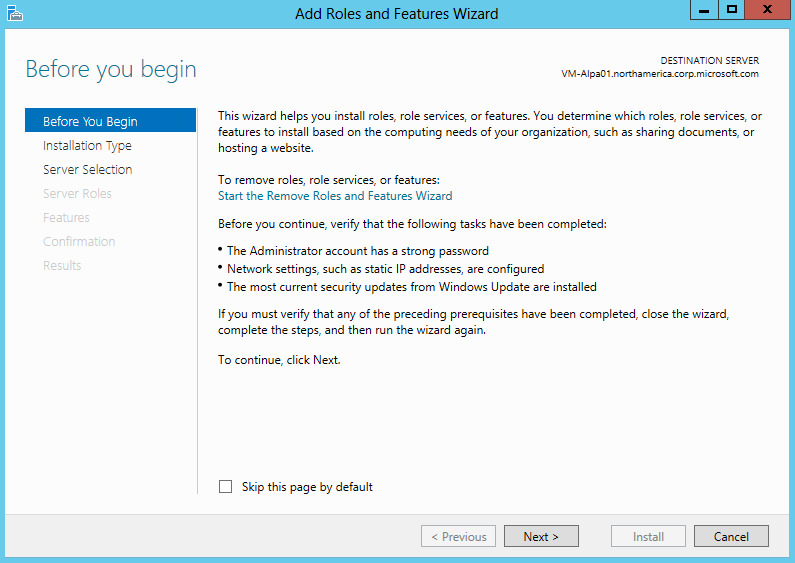
3. Im Assistenten zum **Hinzufügen von Rollen und Features** folgendermaßen Sie vor:

    - Klicken Sie auf der Seite **, bevor Sie beginnen** klicken Sie auf **Weiter**.
    - Akzeptieren Sie die Standardeinstellung der **rollenbasierte oder featurebasierten** -Installation, auf der Seite **Wählen Sie Installation aus** . Klicken Sie auf **Weiter**. 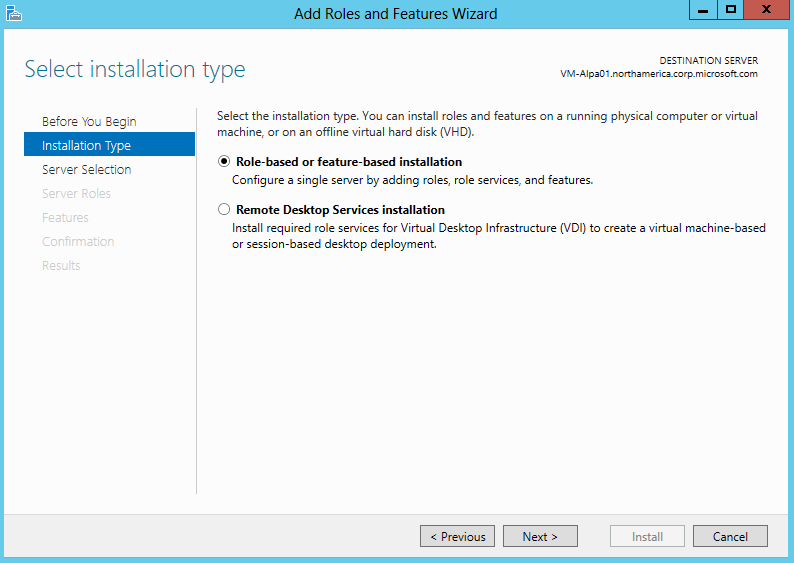
    - Wählen Sie auf der Seite **Wählen Sie Zielserver** aus, **Wählen Sie einen Server aus dem Serverpool**. Der Hostserver sollte automatisch erkannt werden. Klicken Sie auf **Weiter**.
    - Klicken Sie auf der Seite **Wählen Sie Serverrollen** auf **Weiter**.
    - Wählen Sie auf der Seite **Features auswählen** **Mehrere Pfade e/a**aus, und klicken Sie auf **Weiter**. 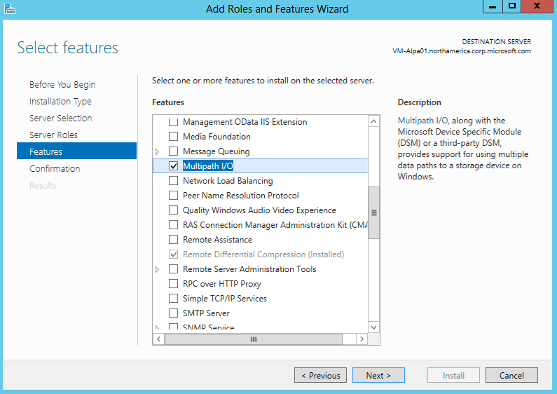
    - Klicken Sie auf der Seite **Confirm Installationsauswahl** bestätigen Sie die Auswahl und wählen Sie dann **den Zielserver neu starten, automatisch, falls erforderlich**, wie unten dargestellt. Klicken Sie auf **Installieren**. 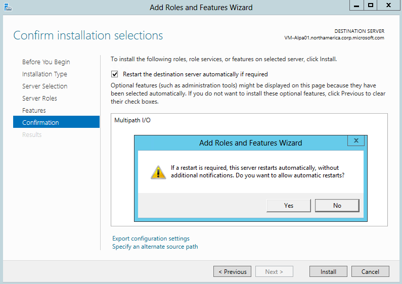
    - Sie werden benachrichtigt, wenn die Installation abgeschlossen ist. Klicken Sie auf **Schließen** , um den Assistenten zu schließen. 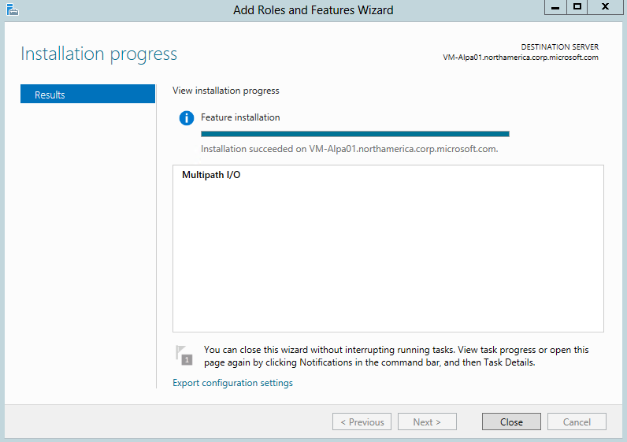

## Schritt 2: Konfigurieren von MPIO für StorSimple Datenmengen

MPIO muss konfiguriert sein, um StorSimple Datenmengen zu identifizieren. Führen Sie die folgenden Schritte aus, um konfigurieren MPIO um StorSimple Datenmengen erkannt.

#### So konfigurieren Sie MPIO für StorSimple Datenmengen

1. Öffnen Sie die **MPIO-Konfiguration**. Klicken Sie auf **Server-Manager > Dashboards > Tools > MPIO**.

2. Wählen Sie die Registerkarte **Multipfade** aus, klicken Sie im Dialogfeld **Eigenschaften von MPIO** .

3. Wählen Sie die **Unterstützung für iSCSI-Geräte hinzufügen**aus, und klicken Sie dann auf **Hinzufügen**.  
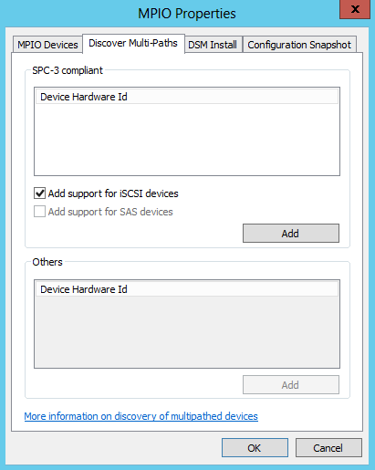

4. Starten Sie den Server, wenn Sie dazu aufgefordert werden.
5. Klicken Sie auf die Registerkarte **Geräte MPIO** , klicken Sie im Dialogfeld **Eigenschaften von MPIO** . Klicken Sie auf **Hinzufügen**.
     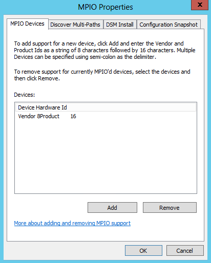
6. Geben Sie in das Dialogfeld **MPIO-Unterstützung hinzufügen** , wählen Sie unter **Gerät Hardware-ID**Ihr Gerät fortlaufende Zahl ein. Sie können Seriennummer des Geräts abrufen, indem Sie den Zugriff auf Ihre StorSimple-Manager-Dienst, und navigieren zu **Geräte > Dashboard**. Seriennummer des Geräts wird in der rechten Ecke **Schnellen Blick** Bereich des Dashboards Gerät angezeigt.
     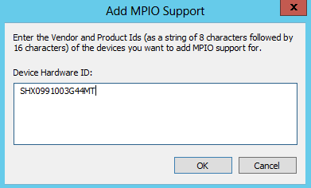
7. Starten Sie den Server, wenn Sie dazu aufgefordert werden.

## Schritt 3: Bereitstellen StorSimple Datenmengen auf dem host

Nachdem MPIO unter Windows Server konfiguriert ist, Datenträger, auf dem Gerät StorSimple erstellt können bereitgestellt werden, und klicken Sie dann nutzen können der MPIO Redundanzgründen. Führen Sie die folgenden Schritte aus, um ein Volume bereitzustellen.

#### Bereitstellen von Datenmengen auf dem host

1. Öffnen Sie das Fenster **iSCSI Initiatoreigenschaften** auf dem Host von Windows Server. Klicken Sie auf **Server-Manager > Dashboards > Tools > iSCSI Initiator**.
2. Klicken Sie im Dialogfeld **iSCSI-Initiatoreigenschaften** klicken Sie auf die Registerkarte Discovery, und klicken Sie dann auf **Ziel-Portal ermitteln**.
3. Klicken Sie im Dialogfeld **Ermitteln Target Portal** folgendermaßen Sie vor:
    
    - Geben Sie die IP-Adresse des DATA-Port des Geräts StorSimple (Geben Sie zum Beispiel Daten 0).
    - Klicken Sie auf **OK** , um das Dialogfeld **iSCSI Initiatoreigenschaften** zurückzukehren.

    >[AZURE.IMPORTANT] **Wenn Sie ein privates Netzwerk für iSCSI-Verbindungen verwenden, geben Sie die IP-Adresse des Ports Daten, die mit dem privaten Netzwerk verbunden ist.**

4. Wiederholen Sie die Schritte 2 und 3 für einen zweiten Netzwerkadapter (z. B. Daten 1) auf Ihrem Gerät. Lassen Sie beachten Sie, dass diese Schnittstellen für iSCSI aktiviert werden soll. Finden Sie weitere Informationen hierzu finden Sie unter [Netzwerk-Schnittstellen ändern](storsimple-modify-device-config.md#modify-network-interfaces).
5. Wählen Sie die Registerkarte **Ziele** in das Dialogfeld **iSCSI Initiatoreigenschaften** aus. Es sollte das StorSimple Gerät Ziel IQN unter **Erkannte Ziele**angezeigt.
 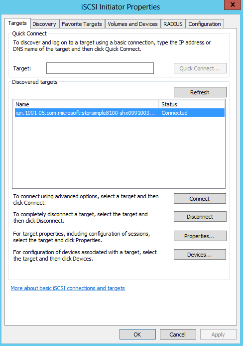
6. Klicken Sie auf **Verbinden** , um eine iSCSI-Sitzung mit Ihrem Gerät StorSimple herzustellen. Klicken Sie im Dialogfeld **Verbindung herstellen mit Ziel** wird angezeigt.

7. Wählen Sie im Dialogfeld **Verbindung herstellen mit Ziel** das Kontrollkästchen **multi-Path aktivieren** aus. Klicken Sie auf **Erweitert**.

8. Klicken Sie im Dialogfeld **Erweiterte Einstellungen** folgendermaßen Sie vor:                                       
    -    Wählen Sie in der Dropdown-Liste **Lokale Netzwerkadapter** **Microsoft iSCSI Initiator**ein.
    -    Wählen Sie in der Dropdown-Liste **Initiator IP** die IP-Adresse des Hosts ein.
    -    Wählen Sie auf die Dropdownliste IP- **Target Portal** die IP-Adresse des Geräts Benutzeroberflächen aus.
    -    Klicken Sie auf **OK** , um das Dialogfeld **iSCSI Initiatoreigenschaften** zurückzukehren.

9. Klicken Sie auf **Eigenschaften**. Klicken Sie im Dialogfeld **Eigenschaften** auf **Sitzung hinzufügen**.
10. Wählen Sie im Dialogfeld **Verbindung herstellen mit Ziel** das Kontrollkästchen **multi-Path aktivieren** aus. Klicken Sie auf **Erweitert**.
11. Klicken Sie im Dialogfeld **Erweiterte Einstellungen** :                                        
    -  Wählen Sie in der Dropdown-Liste **lokale Netzwerkadapter** Microsoft iSCSI Initiator ein.
    -  Wählen Sie in der Dropdown-Liste **Initiator IP** die IP-Adresse, den Host entspricht. In diesem Fall sind Sie zwei Netzwerkschnittstellen auf dem Gerät auf eine einzelne Netzwerkschnittstelle auf dem Host eine Verbindung herstellen. Daher ist diese Schnittstelle entspricht, die für die ersten Sitzung bereitgestellt.
    -  Wählen Sie in der Dropdown-Liste **Ziel Portal IP** die IP-Adresse für die zweite Schnittstelle auf dem Gerät aktiviert.
    -  Klicken Sie auf **OK** , um das Dialogfeld iSCSI-Initiatoreigenschaften zurückzukehren. Sie haben eine zweite Sitzung an die Zielwebsite hinzugefügt.

12. **Computer Management** durch Navigieren zum Öffnen **Server-Manager > Dashboards > Computer Management**. Klicken Sie im linken Bereich auf **Speicher > Datenträger Verwaltung**. Der Datenträger auf dem Gerät StorSimple erstellt, die für diesen Host sichtbar sind, wird als neue Datenträger unter **Datenträger Verwaltung** angezeigt.

13. Initialisierung des Datenträgers, und erstellen Sie ein neues Volume. Wählen Sie beim im Format eine Größe Zeitraums 64 KB sein.
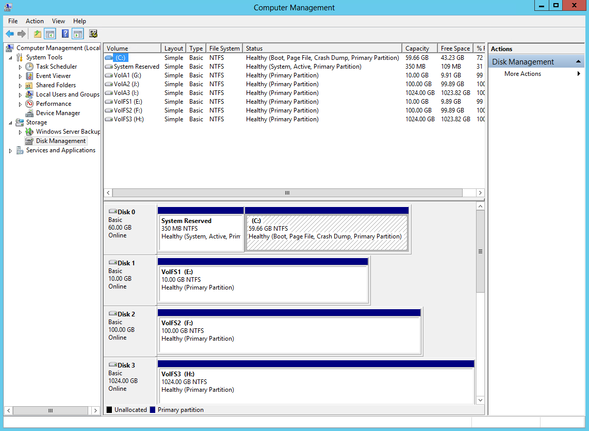
14. Klicken Sie unter **Datenträger Verwaltung**mit der rechten Maustaste in den **Datenträger** , und wählen Sie **Eigenschaften**aus.
15. Im Modell StorSimple ### **Multi-Path Eigenschaften** -Dialogfeld Feld, klicken Sie auf der Registerkarte **MPIO** .
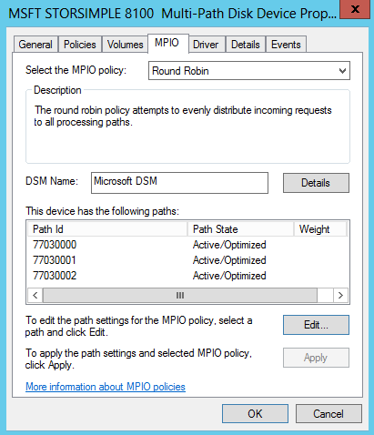

16. Im Abschnitt **DSM Name** klicken Sie auf **Details** , und stellen Sie sicher, dass die Parameter auf die standardmäßigen Parameter festgelegt werden. Die standardmäßigen Parameter sind:

    - Pfad überprüfen Periode = 30
    - Anzahl der Wiederholungsversuche = 3
    - Wechsel zu entfernen (Kuponperiode) = 20
    - Wiederholen Sie Intervall = 1
    - Überprüfen Sie den Pfad aktiviert = nicht aktiviert.

>[AZURE.NOTE] **Ändern Sie die standardmäßigen Parameter nicht.**

## Schritt 4: Konfigurieren von MPIO für hohe Verfügbarkeit und Lastenausgleich

Multi-Path hohe Verfügbarkeit und den Lastenausgleich-basierten müssen mehrere Sitzungen So deklarieren Sie die verschiedenen verfügbaren Pfade manuell hinzugefügt werden. Angenommen, wenn der Host verfügt über zwei Schnittstellen mit SAN verbunden das Gerät verfügt über zwei Schnittstellen mit SAN verbunden, und dann benötigten vier Sitzungen mit den richtigen Pfad Permutationen (nur zwei Sitzungen ist erforderlich, wenn jede Schnittstelle für Host-Schnittstelle in einem anderen IP-Subnetz ist und kann nicht weitergeleitet werden) konfiguriert.

>[AZURE.IMPORTANT] **Es empfiehlt sich, dass Sie nicht 1 Switch und 10 Switch Netzwerk-Schnittstellen kombinieren. Wenn Sie zwei Netzwerkschnittstellen verwenden, sollte beide Schnittstellen den Typ identisch sein.**

Das folgende Verfahren beschreibt das Hinzufügen Sitzungen, wenn ein Gerät StorSimple mit zwei Netzwerkschnittstellen mit einem Host mit zwei Netzwerkschnittstellen verbunden ist.

### Konfigurieren von MPIO für hohe Verfügbarkeit und Lastenausgleich

1. Führen Sie eine Ermittlung des Ziels: Klicken Sie im Dialogfeld **iSCSI-Initiatoreigenschaften** auf der Registerkarte **Suche** auf **Portal ermitteln**.
2. Geben Sie im Dialogfeld **Verbindung herstellen mit Ziel** die IP-Adresse einer der Schnittstellen Netzwerk Gerät aus.
3. Klicken Sie auf **OK** , um das Dialogfeld **iSCSI Initiatoreigenschaften** zurückzukehren.

4. Klicken Sie im Dialogfeld **iSCSI-Initiatoreigenschaften** wählen Sie die Registerkarte **Ziele** , Hervorheben Sie ermittelte Ziel, und klicken Sie dann auf **Verbinden**. Das Dialogfeld **Verbinden mit Ziel** wird angezeigt.

5. Klicken Sie im Dialogfeld **Verbindung herstellen mit Ziel** :
    
    - Lassen Sie das Ziel der standardmäßigen ausgewählten hinzufügen **diese Verbindung** zur Liste der bevorzugten Ziele festlegen. Dadurch wird das Gerät automatisch versuchen, die Verbindung zu starten, jedes Mal, wenn diese Computer neu gestartet wurde.
    - Aktivieren Sie das Kontrollkästchen **Aktivieren mit mehreren Pfad** ein.
    - Klicken Sie auf **Erweitert**.

6. Klicken Sie im Dialogfeld **Erweiterte Einstellungen** :
    - Wählen Sie in der Dropdown-Liste **Lokale Netzwerkadapter** **Microsoft iSCSI Initiator**ein.
    - Wählen Sie in der Dropdown-Liste **Initiator IP** die IP-Adresse des Hosts ein.
    - Wählen Sie in der Dropdown-Liste **Ziel Portal IP** die IP-Adresse der Datenschnittstelle auf dem Gerät aktiviert.
    - Klicken Sie auf **OK** , um das Dialogfeld iSCSI-Initiatoreigenschaften zurückzukehren.

7. Klicken Sie auf **Eigenschaften**, und klicken Sie im Dialogfeld **Eigenschaften** auf **Sitzung hinzufügen**.

8. Klicken Sie im Dialogfeld **Verbindung herstellen mit Ziel** **multi-Path aktivieren** das Kontrollkästchen, und klicken Sie dann auf **Erweitert**.

9. Klicken Sie im Dialogfeld **Erweiterte Einstellungen** :
    1. Wählen Sie in der Dropdown-Liste **lokale Netzwerkadapter** **Microsoft iSCSI Initiator**ein.
    2. Wählen Sie in der Dropdown-Liste **Initiator IP** die IP-Adresse, die zweite Schnittstelle auf dem Host entspricht.
    3. Wählen Sie in der Dropdown-Liste **Ziel Portal IP** die IP-Adresse für die zweite Schnittstelle auf dem Gerät aktiviert.
    4. Klicken Sie auf **OK** , um das Dialogfeld **iSCSI Initiatoreigenschaften** zurückzukehren. Sie haben nun eine zweite Sitzung an die Zielwebsite hinzugefügt.

10. Wiederholen Sie die Schritte 8 bis 10, um zusätzliche Sitzungen (Pfade) das Ziel hinzuzufügen. Mit zwei Schnittstellen auf dem Host und zwei auf dem Gerät können Sie insgesamt vier Sitzungen hinzufügen.

11. Nach dem Hinzufügen der gewünschten Sitzungen (Pfade), klicken Sie im Dialogfeld **iSCSI-Initiatoreigenschaften** , wählen Sie das Ziel, und klicken Sie auf **Eigenschaften**. Beachten Sie auf der Registerkarte Sitzungen im Dialogfeld **Eigenschaften** die vier Sitzung Bezeichnern, die die möglichen Pfad Permutationen entsprechen. Zum Stornieren einer Sitzung aktivieren Sie das Kontrollkästchen neben einer Sitzung Bezeichner enthält, und klicken Sie dann auf **Trennen**.

12. Wenn in Sitzungen präsentiert Geräte anzeigen möchten, wählen Sie die Registerkarte **Geräte** . Klicken Sie auf **MPIO**, um die Richtlinie MPIO für eine ausgewählte Gerät zu konfigurieren. Das Dialogfeld **Gerätedetails** wird angezeigt. Klicken Sie auf der Registerkarte **MPIO** können Sie über die entsprechenden **Lastausgleichsrichtlinie** Einstellungen auswählen. Sie können auch den Typ der Pfad **aktiv** oder **Standby** anzeigen.

## Nächste Schritte

Erfahren Sie mehr über [den Dienst StorSimple Manager zum Ändern der Konfigurations der StorSimple Gerät](storsimple-modify-device-config.md)aus.
 
