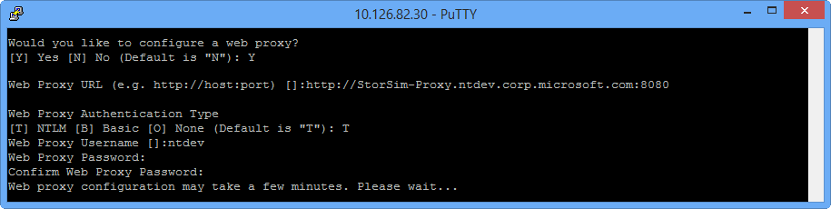
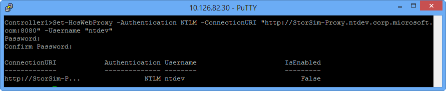
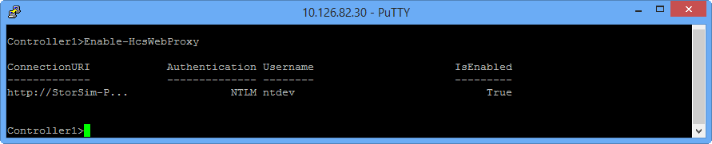
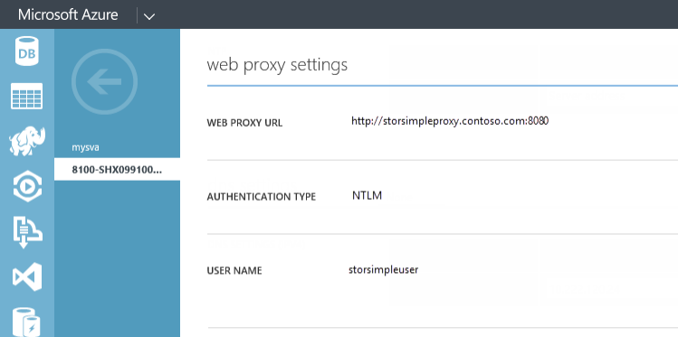

<properties 
   pageTitle="Einrichten von Webproxy für ein Gerät StorSimple | Microsoft Azure"
   description="Erfahren Sie, wie Sie mit Windows PowerShell für StorSimple Web Proxy-Einstellungen für Ihr Gerät StorSimple konfigurieren."
   services="storsimple"
   documentationCenter=""
   authors="alkohli"
   manager="carmonm"
   editor="" />
<tags 
   ms.service="storsimple"
   ms.devlang="na"
   ms.topic="article"
   ms.tgt_pltfrm="na"
   ms.workload="na"
   ms.date="08/17/2016"
   ms.author="alkohli" />

# Konfigurieren von Webproxy für Ihr Gerät StorSimple

## (Übersicht)

In diesem Lernprogramm beschrieben, wie Sie mithilfe von Windows PowerShell für StorSimple konfigurieren und Anzeigen der Web Proxy-Einstellungen für Ihr Gerät StorSimple wird. Die Web-Proxyeinstellungen werden vom Gerät StorSimple verwendet, bei der Kommunikation mit der Cloud. Ein Webproxyserver wird verwendet, zu einer anderen Sicherheitsebene, Filter Inhalte Cache zu steigern Bandbreite Anforderungen oder sogar Hilfe Analytics hinzufügen.

Webproxy ist eine optionale Konfiguration für Ihr Gerät StorSimple. Sie können Webproxy nur über Windows PowerShell für StorSimple konfigurieren. Die Konfiguration ist einen zweistufigen Prozess wie folgt aus:

1. Konfigurieren Sie Web-Proxyeinstellungen über den Setup-Assistenten oder Windows PowerShell für StorSimple Cmdlets.

2. Anschließend aktivieren Sie die konfigurierten Web-Proxyeinstellungen über Windows PowerShell für StorSimple Cmdlets.

Nach Abschluss die Web Proxy-Konfiguration, können Sie die Proxyeinstellungen konfiguriert Web in der Microsoft Azure StorSimple Manager-Dienst und in der Windows PowerShell für StorSimple anzeigen. 

Nach dem Lesen dieses Lernprogramms, werden Sie können:

- Konfigurieren von Webproxy mithilfe des Setup-Assistenten und -cmdlets
- Aktivieren der Web-Proxy mithilfe des cmdlets
- Anzeigen von Webproxyeinstellungen im klassischen Azure-Portal
- Problembehandlung von Fehlern bei der Web-Proxy-Konfiguration

## Konfigurieren von Webproxy über Windows PowerShell für StorSimple

Verwenden Sie eine der folgenden Aktionen aus, um Web-Proxyeinstellungen konfigurieren:

- Setup-Assistenten, der Sie durch die Konfigurationsschritte führt.

- Cmdlets in Windows PowerShell für StorSimple.

Diese Methoden werden in den folgenden Abschnitten erläutert.

## Konfigurieren von Webproxy über den Setup-Assistenten

Den Setup-Assistenten können Sie schrittweise durch die einzelnen Schritte für das Web Proxy-Konfiguration. Führen Sie die folgenden Schritte aus, um Webproxy auf Ihrem Gerät zu konfigurieren.

#### So konfigurieren Sie Webproxy über den Setup-Assistenten

1. Klicken Sie im Menü serielle Konsole wählen Sie Option 1, **Melden Sie sich mit Vollzugriff** aus, und geben Sie das **Gerät Administratorkennwort**. Geben Sie den folgenden Befehl aus, um eine Sitzung des Setup-Assistenten zu starten:

    `Invoke-HcsSetupWizard`

2. Ist dies das erste Mal, dass Sie den Setup-Assistenten für die Registrierung Gerät verwendet haben, müssen Sie alle erforderlichen Netzwerkeinstellungen konfigurieren, bis Sie die Web-Proxy-Konfiguration erreicht haben. Wenn Ihr Gerät bereits registriert ist, können Sie alle konfigurierten Netzwerkeinstellungen akzeptieren, bis Sie die Web-Proxy-Konfiguration erreicht haben. Im Setup-Assistenten zum Konfigurieren von Webproxyeinstellungen Geben Sie bei Aufforderung **Ja**.

3. Geben Sie für die **Web-Proxy-URL**die IP-Adresse oder den vollqualifizierten Domänennamen (FULLY) von dem Webproxyserver und die TCP-Port-Nummer, die Sie mit Ihrem Gerät bei der Kommunikation mit der Cloud verwenden möchten. Verwenden Sie das folgende Format ein:

    `http://<IP address or FQDN of the web proxy server>:<TCP port number>`

    Standardmäßig wird TCP Port-Nummer 8080 angegeben.

4. Wählen Sie den Authentifizierungstyp als **NTLM**, **grundlegende**oder **keiner**aus. Grundlegende ist die unsicherste Authentifizierung für die Konfiguration des Proxyservers. NT LAN Manager (NTLM) ist ein äußerst sicheren und komplexe Authentifizierungsprotokoll, eine drei-Wege-Nachrichtensystems (manchmal vier verwendet ist zusätzliche Integrität erforderlich) zum Authentifizieren eines Benutzers. Die Standardauthentifizierung ist NTLM. Weitere Informationen finden Sie unter [Standard-](http://hc.apache.org/httpclient-3.x/authentication.html) und [NTLM-Authentifizierung](http://hc.apache.org/httpclient-3.x/authentication.html). 

    > [AZURE.IMPORTANT] **In dem Dienst StorSimple Manager die Überwachung Gerät Diagramme funktionieren nicht, wenn grundlegende oder in der Konfiguration des Proxyservers für das Gerät NTLM-Authentifizierung aktiviert ist. Für die Überwachung Diagramme entwickelt müssen Sie sicherstellen, dass die Authentifizierung keine festgelegt ist.**

5. Wenn Sie die Authentifizierung verwenden, geben Sie eine **Web Proxy-Benutzernamen** und ein **Web-Proxy-Kennwort**. Sie müssen auch das Kennwort bestätigen.

    

Wenn Sie Ihr Gerät zum ersten Mal registrieren, fahren Sie mit der Registrierung. Wenn Ihr Gerät bereits registriert wurde, wird den Assistenten zu beenden. Die konfigurierten Einstellungen werden gespeichert.

Webproxy wird jetzt auch aktiviert sein. Sie können den [WebProxy aktivieren](#enable-web-proxy) Schritt überspringen und direkt zu [Ansicht Webproxyeinstellungen im klassischen Azure-Portal](#view-web-proxy-settings-in-the-azure-classic-portal)wechseln.

## Konfigurieren von Webproxy über Windows PowerShell für StorSimple-cmdlets

Eine alternative Methode zum Konfigurieren von Webproxyeinstellungen wird über die Windows PowerShell für StorSimple Cmdlets. Führen Sie die folgenden Schritte aus, um Webproxy zu konfigurieren.

#### So konfigurieren Sie Webproxy über cmdlets

1. Wählen Sie im Menü seriellen Konsole Option 1, **Melden Sie sich mit Vollzugriff**aus. Wenn Sie dazu aufgefordert werden, geben Sie das **Gerät Administratorkennwort**ein. Das standardmäßige Kennwort lautet `Password1`.

2. Geben Sie an der Befehlszeile ein:

    `Set-HcsWebProxy -Authentication NTLM -ConnectionURI "<http://<IP address or FQDN of web proxy server>:<TCP port number>" -Username "<Username for web proxy server>"`

    Bereitstellen Sie, und bestätigen Sie das Kennwort ein, wie unten dargestellt.

    

Der Webproxy ist nun konfiguriert und muss aktiviert sein.

## Aktivieren der Web-proxy

Webproxy ist standardmäßig deaktiviert. Nachdem Sie die Web-Proxyeinstellungen auf Ihrem Gerät StorSimple konfiguriert haben, müssen Sie das Windows PowerShell für StorSimple zu verwenden, um die Web-Proxyeinstellungen aktivieren.

> [AZURE.NOTE] **Dieser Schritt wird nicht erforderlich sein, wenn Sie den Setup-Assistenten zum Konfigurieren von Webproxy verwendet. Webproxy wird automatisch nach einer Sitzung für Setup-Assistenten standardmäßig aktiviert.**

Führen Sie die folgenden Schritte aus, in Windows PowerShell für StorSimple Webproxy auf Ihrem Gerät zu aktivieren:

#### So aktivieren Sie die Web-proxy

1. Wählen Sie im Menü seriellen Konsole Option 1, **Melden Sie sich mit Vollzugriff**aus. Wenn Sie dazu aufgefordert werden, geben Sie das **Gerät Administratorkennwort**ein. Das standardmäßige Kennwort lautet `Password1`.

2. Geben Sie an der Befehlszeile ein:

    `Enable-HcsWebProxy`

    Jetzt haben Sie die Web-Proxy-Konfiguration auf Ihrem Gerät StorSimple aktiviert.

    

## Anzeigen von Webproxyeinstellungen im klassischen Azure-Portal

Die Web-Proxyeinstellungen über die Windows PowerShell-Schnittstelle konfiguriert werden und nicht in der klassischen Portal geändert werden. Sie können, jedoch diese konfigurierten Einstellungen in der klassischen Portal anzeigen. Führen Sie die folgenden Schritte aus, um Webproxy anzuzeigen.

#### Web Proxy-Einstellungen anzeigen
1. Navigieren Sie zu **StorSimple-Manager-Dienst > Geräte**. Wählen Sie aus, und klicken Sie auf einem Gerät, und wechseln Sie dann zu **Konfigurieren**.
1. Führen Sie einen Bildlauf nach unten auf der Seite **Konfigurieren** zum Abschnitt **Web-Proxyeinstellungen** aus. Sie können die Proxyeinstellungen konfiguriert Web auf Ihrem Gerät StorSimple wie unten dargestellt anzeigen.

    
 
## Fehler bei der Web-Proxy-Konfiguration

Wenn die Web-Proxyeinstellungen falsch konfiguriert haben, werden Fehlermeldungen für den Benutzer in Windows PowerShell für StorSimple angezeigt. In der folgenden Tabelle werden einige dieser Fehlermeldungen angezeigt, deren Ursachen und empfohlenen Aktionen erläutert.

|Serielle Nein.|HRESULT-Fehler Code|Mögliche Ursache|Empfohlene Aktion|
|:---|:---|:---|:---|
|1.|0 x 80070001|Befehl aus dem passiven Controller ausgeführt wird, und es ist nicht mit dem aktiven Controller kommunizieren.|Führen Sie den Befehl auf dem aktiven Controller aus. Um den Befehl aus dem passiven Controller ausführen zu können, müssen Sie die Verbindung zwischen passiven und aktiven Controller zu beheben. Sie benötigen Microsoft Support populärer, wenn diese Konnektivität fehlerhaft ist.|
|2.|0x800710dd - der Vorgangsbezeichner ist ungültig|Proxyeinstellungen werden auf StorSimple virtuelle Gerät nicht unterstützt.|Proxyeinstellungen werden auf StorSimple virtuelle Gerät nicht unterstützt. Dies können nur auf einem StorSimple physischen Gerät konfiguriert werden.|
|3.|0 x 80070057 - Ungültiger parameter|Einer der Parameter für die Proxyeinstellungen bereitgestellt ist ungültig.|Der URI wird nicht im richtigen Format bereitgestellt. Verwenden Sie das folgende Format ein:`http://<IP address or FQDN of the web proxy server>:<TCP port number>`|
|4.|0x800706BA - RPC-Server nicht verfügbar|Die Ursache ist eine der folgenden Aktionen aus:  Cluster ist nicht nach oben.  DataPath Dienst wird nicht ausgeführt.  Der Befehl vom passiven Controller ausgeführt wird, und es ist nicht mit dem aktiven Controller kommunizieren.|Wenden Sie sich bitte an Microsoft-Support, um sicherzustellen, dass der Cluster nach oben und Datapath Dienst ausgeführt wird.  Führen Sie den Befehl aus dem aktiven Controller aus. Wenn Sie den Befehl aus dem passiven Controller ausführen möchten, müssen Sie sicherstellen, dass der passive Controller mit dem aktiven Controller kommunizieren kann. Sie benötigen Microsoft Support populärer, wenn diese Konnektivität fehlerhaft ist.|
|5.|0x800706BE - Remoteprozeduraufruf fehlgeschlagen ist|Cluster ist nach unten.|Wenden Sie sich bitte an die Microsoft-Support, um sicherzustellen, dass der Cluster aktiv ist.|
|6.|0x8007138f - Cluster-Ressource wurde nicht gefunden|Plattform Dienst Clusterressource wurde nicht gefunden. Dies kann geschehen, wenn die Installation nicht ordnungsgemäßen war.|Möglicherweise müssen Sie eine auf Ihrem Gerät zurücksetzen Factory ausführen. Möglicherweise müssen Sie eine Ressource Plattform zu erstellen. Wenden Sie sich an Microsoft Support für den nächsten Schritten fort.|
|7.|0x8007138c - Cluster-Ressource nicht online|Plattform oder Datapath Clusterressourcen sind nicht online.|Wenden Sie sich an den Microsoft-Support, um sicherzustellen, dass die Datapath und Plattform Dienstressource online sind.|

> [AZURE.NOTE] 
> 
> -  Die vorstehenden Liste der Fehlermeldungen ist nicht vollständig. 
> - Fehler im Zusammenhang mit Webproxyeinstellungen werden im klassischen Azure-Portal in Ihrem Dienst StorSimple Manager nicht angezeigt. Ist es ein Problem mit Webproxy nach Abschluss die Konfiguration, des ändert sich Gerätestatus **Offline** im Portal klassischen. |

## Nächste Schritte

- Wenn Sie beim Bereitstellen von Ihrem Gerät oder Konfigurieren von Webproxyeinstellungen Probleme, schlagen Sie in [Behandeln von der Bereitstellung der StorSimple Gerät](storsimple-troubleshoot-deployment.md).

- So verwenden Sie den Dienst StorSimple Manager finden Sie unter der StorSimple-Manager-Dienst zum Verwalten von Ihrem Geräts StorSimple zu [verwenden](storsimple-manager-service-administration.md).
