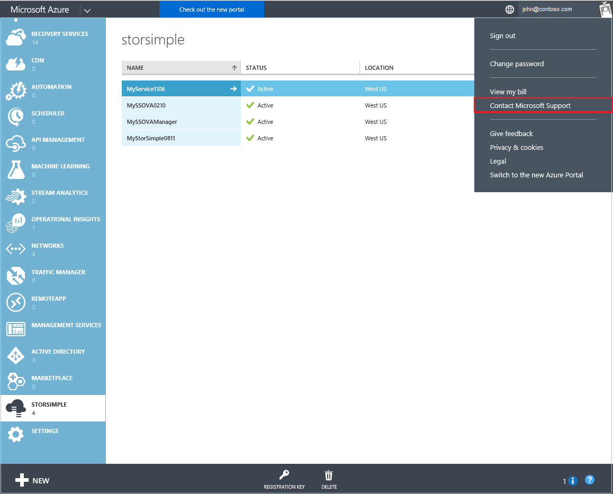
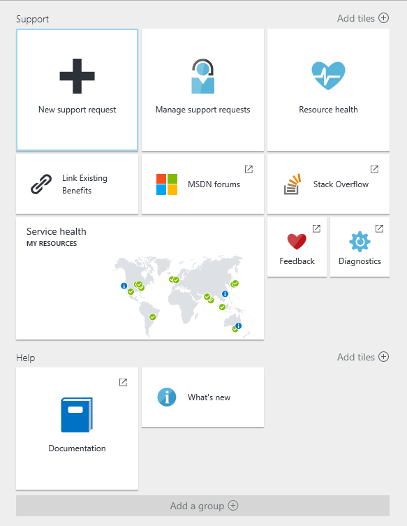
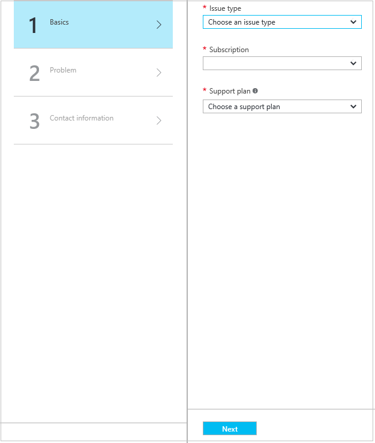
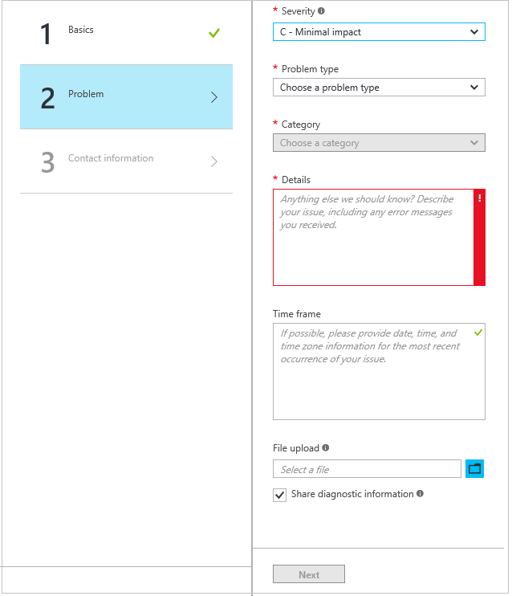
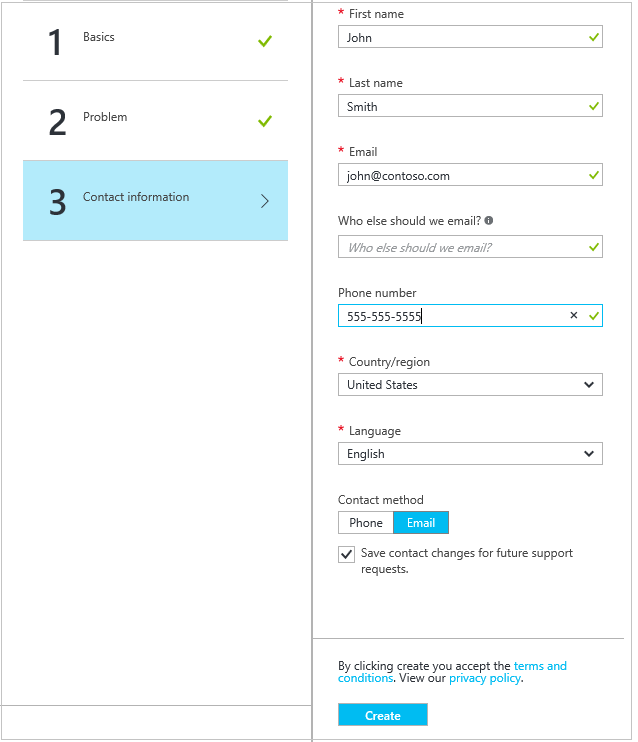

<properties 
   pageTitle="Wenden Sie sich an Microsoft Support | Microsoft Azure"
   description="Erfahren Sie, wie Sie eine Supportanfrage erstellen und diese dann Support-Sitzung auf Ihrem Gerät StorSimple."
   services="storsimple"
   documentationCenter=""
   authors="alkohli"
   manager="carmonm"
   editor="" />
<tags 
   ms.service="storsimple"
   ms.devlang="na"
   ms.topic="article"
   ms.tgt_pltfrm="na"
   ms.workload="na"
   ms.date="09/21/2016"
   ms.author="alkohli" />

# Wenden Sie sich an Microsoft Support

Wenn Sie mit Ihrem Microsoft Azure StorSimple Lösung Probleme auftreten, können Sie eine Serviceanfrage bei technischen Support erstellen. In einer Sitzung online mit Ihrer Supportmitarbeiter müssen Sie auch eine Support-Sitzung auf Ihrem Gerät StorSimple zu starten. In diesem Artikel führt Sie durch:

- So erstellen Sie eine Supportanfrage.
- Informationen zum Starten einer Sitzung Unterstützung in der Windows PowerShell-Oberfläche von Ihrem Gerät StorSimple.

Überprüfen Sie die [StorSimple 8000 Reihe Support SLAs und Informationen](https://msdn.microsoft.com/library/mt433077.aspx) , bevor Sie eine Supportanfrage erstellen.

## Erstellen Sie eine Supportanfrage

Führen Sie die folgenden Schritte aus, um eine Supportanfrage zu erstellen:

#### So erstellen eine Supportanfrage

1. Im [Azure klassischen Portal](https://manage.windowsazure.com/)in der oberen rechten Ecke klicken Sie auf Ihren Kontonamen, und klicken Sie dann auf **Microsoft-Support wenden**.

    

2. Sie werden auf der neuen Azure-Portal (portal.azure.com) weitergeleitet. Klicken Sie auf die Kachel **neu support-Anfragen** .

    

    Klicken Sie auf der rechten Seite des Bildschirms angezeigt wird Klicken Sie im Bereich **neu support-Anfragen** . 

    

3. Führen Sie folgende Schritte aus, klicken Sie im Dialogfeld **Grundlagen** :                                
    1. Wählen Sie aus der Dropdownliste **Problemtyp** **technische**ein.
    2. Wählen Sie ein **Abonnement** aus der Dropdownliste aus.
    3. Wählen Sie in der Dropdown-Liste **Dienst** **StorSimple**ein. 
    4. Wählen Sie einen **Support-Plan** aus der Dropdownliste aus. Sie benötigen einen Plan bezahlten Support an den technischen Support aktivieren.

4. Klicken Sie auf **Weiter**. Klicken Sie im Dialogfeld **Problem** wird angezeigt.

     

5. Klicken Sie im Dialogfeld **Problems** führen Sie folgende Schritte aus:

    1.  Wählen Sie eine **schwere** Ebene aus der Dropdownliste aus.
    2.  Wählen Sie einen **Problemtyp** aus der Dropdownliste aus.
    3.  Wählen Sie eine **Kategorie** aus der Dropdownliste aus. 
    4.  Beschreiben Sie Ihr Problem kurz, im Feld **Details** .
    5.  Geben Sie im Feld **Zeitrahmens** Datum, Uhrzeit und Zeitzone, die das aktuelle Vorkommen des Ihr Problem entspricht.
    6.  Klicken Sie unter **Datei hochladen**möchten klicken Sie auf das Ordnersymbol, um Ihre Support-Paket zu suchen.
    7.  Aktivieren Sie das Kontrollkästchen **Diagnoseinformationen freigeben** .

6. Klicken Sie auf **Weiter**. Das Dialogfeld **Kontaktinformationen** angezeigt wird.

     

7. Geben Sie Ihre Kontaktinformationen, und wählen Sie einen Kontakt (Telefon oder e-Mail). 

8. Aktivieren Sie das Kontrollkästchen **für zukünftige Kundendienstanfragen Kontakt Änderungen speichern** .

9. Klicken Sie auf **Erstellen**.

Nachdem Sie Ihre Anforderung gesendet haben, wird ein Supports Sie so früh wie möglich mit der Anforderung fortfahren wenden Sie sich an.

## Starten einer Sitzung Unterstützung in Windows PowerShell für StorSimple

Um die Behandlung aller Probleme, die mit dem Gerät StorSimple auftreten können, müssen Sie mit dem Microsoft-Support-Team populärer. Support von Microsoft müssen Support-Sitzung zu verwenden, um mit Ihrem Gerät anmelden. 

Führen Sie die folgenden Schritte aus, um eine Support-Sitzung zu starten:

#### Zum Starten einer Sitzung support

1. Zugreifen Sie auf das Gerät direkt mithilfe der seriellen Konsole oder anhand von Remotecomputern aus. Dazu führen Sie die Schritte [Verwenden kitten Verbindung zu der seriellen Gerät-Konsole](storsimple-deployment-walkthrough.md#use-putty-to-connect-to-the-device-serial-console)aus.

2. Drücken Sie in der Sitzung, die geöffnet wird die **EINGABETASTE** , um ein Eingabeaufforderungsfenster zu erhalten.

3. Wählen Sie im Menü seriellen Konsole Option 1, **Melden Sie sich mit Vollzugriff**aus.

4. Geben Sie dazu aufgefordert werden das folgende Kennwort ein: 

    `Password1`

5. Dazu aufgefordert werden Geben Sie den folgenden Befehl aus:

    `Enable-HcsSupportAccess`

6. Ihnen wird eine verschlüsselte Zeichenfolge angezeigt werden. Kopieren Sie diese Zeichenfolge in einem Text-Editor wie Editor.

7. Speichern Sie diese Zeichenfolge und senden Sie es in einer e-Mail-Nachricht an den Microsoft Support. 

> [AZURE.IMPORTANT] Sie können Support Zugriff deaktivieren, indem Sie ausführen `Disable-HcsSupportAccess`. Das Gerät StorSimple versucht ebenfalls deaktivieren Support Access 8 Stunden, nachdem die Sitzung initiiert wurde. Es ist eine bewährte Methode, Ihre Anmeldeinformationen ein StorSimple Gerät zu ändern, nachdem Sie eine Support-Sitzung initiieren.
