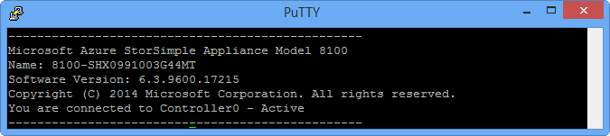

<properties 
   pageTitle="Ersetzen einen StorSimple Gerätecontroller | Microsoft Azure"
   description="Erläutert, wie Sie entfernen, und Ersetzen eine oder beide Controller Module auf Ihrem Gerät StorSimple."
   services="storsimple"
   documentationCenter=""
   authors="alkohli"
   manager="carmonm"
   editor="" />
<tags 
   ms.service="storsimple"
   ms.devlang="NA"
   ms.topic="article"
   ms.tgt_pltfrm="NA"
   ms.workload="TBD"
   ms.date="08/17/2016"
   ms.author="alkohli" />

# Ersetzen einer Controller-Modul auf Ihrem Gerät StorSimple

## (Übersicht)

In diesem Lernprogramm wird erläutert, wie entfernen und Ersetzen Sie eine oder beide Controller Module in einem StorSimple Gerät. Darüber hinaus werden die zugrunde liegende Logik für die einzelnen und zwei Controller Ersatz Szenarien erläutert.

>[AZURE.NOTE] Vor dem durchführen Controller Ersatz, empfehlen wir, dass Sie immer die Controller-Firmware auf die neueste Version zu aktualisieren.
>
>Wenn um auf Ihrem Gerät StorSimple Schaden zu verhindern, werfen Sie nicht aus dem Controller bis LED-Anzeigen als eine der folgenden angezeigt werden:
>
>- Alle Leuchten sind aus.
>- LED-3 , und  blinken, und LED 0 und LED 7 sind **auf**.

Die folgende Tabelle zeigt die unterstützten Controller Ersatz Szenarien.

|Fall|Ersatz-Szenario|Anwendbare Verfahren|
|:---|:-------------------|:-------------------|
|1|Eine Controller ausgefallen ist, des andere Controllers fehlerfrei und aktiv.|[Ein Controller Ersatz](#replace-a-single-controller), der die [Logik hinter einem Controller Ersatz](#single-controller-replacement-logic)als auch die [Ersetzung Schritte](#single-controller-replacement-steps)beschrieben.|
|2|Sowohl die Controller sind ausgefallen und ausgetauscht werden. Gehäuse, Datenträger, and.disk Einheit sind fehlerfrei.|[Zwei Controller Ersatz](#replace-both-controllers), der die [Logik hinter zwei Controller Ersatz](#dual-controller-replacement-logic)als auch die [Ersetzung Schritte](#dual-controller-replacement-steps)beschrieben. |
|3|Controller aus dem gleichen Gerät oder aus anderen Geräten werden vertauscht. Die Gehäuse, Datenträger und Laufwerk Einheiten sind fehlerfrei.|Ein Slot Konflikt-Warnmeldung wird angezeigt.|
|4|Eine Controller fehlt und der andere Controller schlägt fehl.|[Zwei Controller Ersatz](#replace-both-controllers), der die [Logik hinter zwei Controller Ersatz](#dual-controller-replacement-logic)als auch die [Ersetzung Schritte](#dual-controller-replacement-steps)beschrieben.|
|5|Einen oder beide Controller sind ausgefallen. Sie können nicht über die serielle Konsole oder Remote Windows PowerShell das Gerät zugreifen.|[Microsoft-Support wenden](storsimple-contact-microsoft-support.md) für eine manuelle Controller Verfahren für den Austausch.|
|6|Die Controller verfügen über eine andere Buildversion, die aufgrund von sein können:<ul><li>Controller haben eine andere Version.</li><li>Controller haben eine andere Firmwareversion.</li></ul>|Wenn die Controller Softwareversionen unterscheiden, wird die Logik Ersatz erkennt, und aktualisiert die Softwareversion auf dem Controller Ersatz.  Wenn die Controller Firmwareversionen unterscheiden sich und die alte Firmwareversion wird **nicht** automatisch aktualisiert, wird eine Benachrichtigung in der klassischen Azure-Portal angezeigt. Updates suchen, und die Firmware-Updates installieren.  Wenn die Controller Firmwareversionen unterscheiden und die alte Firmwareversion kann automatisch aktualisiert werden, die Controller Ersatz Logik erkennt dies und nach der Controller gestartet wird, die Firmware wird automatisch aktualisiert.|

Sie müssen eine Controller-Modul entfernen, beispielsweise wenn sie fehlgeschlagen ist. Eine oder beide der Controller Module können fehl, was in einer einzelnen Controller Ersatz oder zwei Controller Ersatz zu führen. Verfahren für den Austausch und deren Logik Probieren Sie Folgendes ein:

- [Ersetzen eines einzelnen Controllers](#replace-a-single-controller)
- [Ersetzen Sie beide Controller](#replace-both-controllers)
- [Entfernen eines Controllers](#remove-a-controller)
- [Einfügen eines Controllers](#insert-a-controller)
- [Identifizieren des aktiven Controllers auf Ihrem Gerät](#identify-the-active-controller-on-your-device)

>[AZURE.IMPORTANT] Überprüfen Sie vor dem entfernen, und Ersetzen einen Controller, die Sicherheitsinformationen in den [Austausch von StorSimple Hardware Komponenten](storsimple-hardware-component-replacement.md).

## Ersetzen eines einzelnen Controllers

Wenn eine der zwei Controller auf dem Gerät Microsoft Azure StorSimple ausgefallen, fehlerhaft ist oder fehlt, müssen Sie einen Controller zu ersetzen. 

### Ein Controller Ersatz Logik

In den einzelnen Controller Ersatz sollten Sie zuerst den fehlerhaften Controller entfernen. (Der verbleibende Controller in das Gerät ist der aktiven Controller.) Wenn Sie den Ersetzung Controller einfügen, werden folgende Aktionen ausgeführt:

1. Der Ersatz Controller wird sofort gestartet, Kommunikation mit dem Gerät StorSimple.

2. Eine Momentaufnahme der virtuellen Festplatte (virtuelle Festplatte) für den aktiven Controller wird auf dem Ersatz Controller kopiert.

3. Die Momentaufnahme wird geändert, sodass bei der Controller Ersatz von diese virtuelle Festplatte gestartet wird, es als standby Controller erkannt werden.

4. Wenn die Änderungen abgeschlossen haben, wird der Ersatz Controller als standby Controller gestartet.

5. Wenn Sie sowohl die Controller ausgeführt werden, geht der Cluster online.

### Ein Controller Ersatz Schritte

Gehen Sie folgendermaßen vor, wenn Sie einen der Controller in Ihrem Gerät Microsoft Azure StorSimple schlägt fehl. (Der andere Controller muss aktiv sind und ausgeführt werden. Wenn beide Controller fehl oder einer Fehlfunktion, fahren Sie mit [zwei Controller Ersatz Schritten.)](#dual-controller-replacement-steps)

>[AZURE.NOTE] Es kann 30 – 45 Minuten für den Controller neu starten und Wiederherstellen von vollständig aus den einzelnen Controller Verfahren für den Austausch dauern. Die Gesamtzeit für die gesamte Prozedur, ist einschließlich der Kabel anfügen etwa 2 Stunden.

#### So entfernen Sie eine einzelne Fehler beim Controller-Modul

1. Im Portal Azure klassischen wechseln Sie zu der StorSimple Manager-Dienst, klicken Sie auf die Registerkarte **Geräte** , und klicken Sie dann auf den Namen des Geräts, die Sie überwachen möchten.

2. Wechseln Sie zu **Wartung > Hardwarestatus**. Der Status von Controller 0 oder 1 Controller sollten Rot, gibt einen Fehler an.

    >[AZURE.NOTE] Der Fehler beim Controller in einem Controller Ersatz ist immer ein standby Controller.

3. Verwenden Sie Abbildung 1 und in der folgenden Tabelle, das Fehler beim Controller-Modul gesucht werden soll.  

    

    **Abbildung 1** Rückseite StorSimple Gerät

  	|Beschriftung|Beschreibung|
  	|:----|:----------|
  	|1|PCM 0|
  	|2|PCM 1|
  	|3|Controller 0|
  	|4|Controller 1|

4. Klicken Sie auf den fehlerhaften Controller entfernen Sie alle verbundenen Netzwerkkabel aus den Daten-Ports ein. Wenn Sie ein Modell 8600 verwenden, entfernen Sie die SAS-Kabel, die Verbindung mit dem Controller EBOD den Controller auch.

5. Führen Sie die Schritte in [einen Controller entfernen](#remove-a-controller) aus, um den fehlerhaften Controller entfernen aus. 

6. Installieren Sie die Ersetzung Factory im selben Feld aus dem der Fehler beim Controller entfernt wurde. Dadurch wird die einzelnen Controller Ersatz Logik ausgelöst. Weitere Informationen finden Sie unter [einem Controller Ersatz Logik](#single-controller-replacement-logic).

7. Während die einzelnen Controller Ersatz Logik im Hintergrund fortschreitet, schließen Sie das Kabel wieder. Achten Sie auf alle Kabel genauso verbinden, dass sie vor dem Ersatz verbunden wurden.

8. Aktivieren Sie nach dem Neustart des Controllers den **Controllerstatus** und der **Status Cluster** im klassischen Azure-Portal, um sicherzustellen, dass der Controller wieder in einem ordnungsgemäßen Zustand ist und im standby-Modus ist.

>[AZURE.NOTE] Wenn Sie das Gerät über die serielle Konsole überwachen, wird möglicherweise mehrere neu gestartet wurde während der Controller aus dem Verfahren für den Austausch wiederhergestellt wird angezeigt. Wenn Sie im Menü serielle Konsole angezeigt wird, wissen Sie, dass die Ersetzung abgeschlossen ist. Wenn das Menü innerhalb von zwei Stunden beginnen Controller ersetzt nicht angezeigt wird, wenden Sie sich an [Microsoft Support](storsimple-contact-microsoft-support.md).

## Ersetzen Sie beide Controller

Wenn beide Controller auf dem Gerät Microsoft Azure StorSimple nicht bestanden haben, fehlerhaft sind oder fehlen, müssen Sie beide Controller ersetzen. 

### Zwei Controller Ersatz Logik

In zwei Controller Ersatz zuerst beide Fehler beim Controller entfernen und dann Ersatz einfügen. Wenn die zwei Ersatz Controller eingefügt werden, werden folgende Aktionen ausgeführt:

1. Der Ersatz Controller in Slot 0 prüft Folgendes:
 
   1. Ist es aktuelle Versionen der Firmware und Software verwenden?

   2. Es wird ein Teil der Cluster?

   3. Wird der Peer-Controller ausgeführt, und ist es gruppierte?
                            
    Wenn keiner der folgenden Bedingungen erfüllt ist, wird der Controller für die letzte tägliche Sicherung (befindet sich in der **NonDOMstorage** auf Laufwerk S). Der Controller übernimmt die neueste Momentaufnahme der virtuellen Festplatte aus die Sicherung an.

2. Der Controller in Slot 0 verwendet die Momentaufnahme selbst zu Abbild an.

3. In der Zwischenzeit wartet der Controller in Slot 1 Controller führen Sie die Darstellung und diese dann 0 ein.

4. Nach dem Start von Controller 0 erkennt Controller 1 Clusters erstellte Controller 0, der wodurch die einzelnen Controller Ersatz Logik ausgelöst. Weitere Informationen finden Sie unter [einem Controller Ersatz Logik](#single-controller-replacement-logic).

5. Danach beide Controller ausgeführt werden und den Cluster Onlinebetrieb.

>[AZURE.IMPORTANT] Zwei Controller Ersatz nach das Gerät StorSimple konfiguriert ist, ist es wichtig, dass Sie eine manuelle Sicherung des Geräts ausführen. Tägliche Gerät Konfiguration Sicherungskopien werden nicht bis ausgelöst, nachdem 24 Stunden verstrichen sind. Arbeiten Sie mit [Microsoft Support](storsimple-contact-microsoft-support.md) eine manuelle Sicherung Ihres Geräts vornehmen.

### Zwei Controller Ersatz Schritte

Diesen Workflow ist erforderlich, wenn beide Controller in Ihrem Gerät Microsoft Azure StorSimple fehlgeschlagen sind. Dies kann in einem Datencenter vorkommen, in dem das Kühlsystem funktioniert nicht mehr, und daher sowohl die Controller nicht bestanden innerhalb einer kurzen Zeitspanne beenden. Abhängig davon, ob das Gerät StorSimple ein- oder ausgeschaltet ist, und gibt an, ob Sie eine 8600 arbeiten oder ein Modell 8100, ist eine andere Gruppe von Schritte erforderlich.

>[AZURE.IMPORTANT] 1 Stunde bei für den Controller neu starten und Wiederherstellen von vollständig aus einem Verfahren für den Austausch zwei Controller, kann es 45 Minuten dauern. Die Gesamtzeit für die gesamte Prozedur, ist einschließlich der Kabel anfügen ungefähr 2,5 Stunden.

#### So ersetzen Sie beide Controller Module

1. Wenn das Gerät deaktiviert ist, überspringen Sie diesen Schritt, und fahren Sie mit dem nächsten Schritt fort. Wenn das Gerät aktiviert ist, deaktivieren Sie das Gerät aus.
                                        
    1. Wenn Sie ein Modell 8600 verwenden, die primäre Einheit ersten deaktivieren, und klicken Sie dann auf die Anlage EBOD deaktivieren.

    2. Warten Sie, bis das Gerät vollständig beendet hat. Alle LED an der Rückseite des Geräts werden deaktiviert.

2. Entfernen Sie die Netzwerkkabel, die mit den Daten-Ports verbunden sind. Wenn Sie ein Modell 8600 verwenden, entfernen Sie auch die SAS-Kabel, die die primäre Einheit mit der Einheit EBOD verbinden.

3. Entfernen Sie beide Controller vom Gerät StorSimple. Weitere Informationen finden Sie unter [entfernen einen Controller](#remove-a-controller).

4. Fügen Sie Factory Ersatz für Controller 0 zuerst ein, und fügen Sie dann Controller 1. Weitere Informationen finden Sie unter [einem Controller einfügen](#insert-a-controller). Dadurch wird die zwei Controller Ersatz Logik ausgelöst. Weitere Informationen finden Sie unter [zwei Controller Ersatz Logik](#dual-controller-replacement-logic).

5. Während die Controller Ersatz Logik im Hintergrund fortschreitet, schließen Sie das Kabel wieder. Achten Sie auf alle Kabel genauso verbinden, dass sie vor dem Ersatz verbunden wurden. Finden Sie unter den detaillierten Anweisungen für Ihr Modell im Abschnitt Gerät Kabel von [Ihrem Gerät StorSimple 8100 installieren](storsimple-8100-hardware-installation.md) oder [Ihrem StorSimple 8600-Gerät installieren](storsimple-8600-hardware-installation.md).

6. Aktivieren Sie das Gerät StorSimple. Wenn Sie ein Modell 8600 verwenden:

    1. Stellen Sie sicher, dass die Einheit EBOD ersten aktiviert ist.

    2. Warten Sie, bis die Anlage EBOD ausgeführt wird.

    3. Aktivieren Sie die primäre Einheit.

    4. Nach der erste Controller neu gestartet wird und in einem ordnungsgemäßen Zustand ist, wird das System ausgeführt werden.

    >[AZURE.NOTE] Wenn Sie das Gerät über die serielle Konsole überwachen, wird möglicherweise mehrere neu gestartet wurde während der Controller aus dem Verfahren für den Austausch wiederhergestellt wird angezeigt. Wenn Sie im Menü serielle Konsole angezeigt wird, wissen Sie, dass die Ersetzung abgeschlossen ist. Wenn das Menü innerhalb von 2,5 Stunden ab Controller ersetzt nicht angezeigt wird, wenden Sie sich an [Microsoft Support](storsimple-contact-microsoft-support.md).

## Entfernen eines Controllers

Verwenden Sie das folgende Verfahren, um eine fehlerhafte Controller-Modul vom StorSimple Gerät zu entfernen.

>[AZURE.NOTE] Die folgenden Illustrationen sind für Controller 0. Für einen Controller 1 würde diese storniert werden.

#### So entfernen Sie eine Controller-Modul

1. Ziehen Sie das Modul Sperre zwischen dem Daumen und Zeigefinger.

2. Drücken Sie vorsichtig Daumen und Zeigefinger zusammen, um die Sperre Controller freizugeben.

    

    **Abbildung 2** Aufheben der Sperre controller

2. Verwenden Sie die Sperre als einen Ziehpunkt an den Controller aus dem Rahmen Folie.

    

    **Abbildung 3** Schieben den Controller aus dem Rahmen

## Einfügen eines Controllers

Gehen Sie folgendermaßen vor, um eine Controller Factory gelieferten-Modul installieren, nachdem Sie eine fehlerhafte Modul aus Ihrem Gerät StorSimple entfernt.

#### So installieren Sie ein Controller-Modul

1. Überprüfen Sie, wenn es auf der Benutzeroberfläche von Verbindern beschädigt ist. Installieren Sie das Modul nicht, wenn Sie einen Verbinder Stifte beschädigt oder gebogen sind.

2. Ziehen Sie das Controller-Modul in den Rahmen, während die Sperre vollständig freigegeben ist. 

    

    **Abbildung 4** Gleitende Controller in den Rahmen

3. Beginnen Sie mit dem Controller-Modul eingefügt wird schließen die Sperre Verschiebe Pushbenachrichtigungen Controller-Modul in den Rahmen aus. Die Sperre wird auf den Controller an Leitfaden populärer.

    

    **Abbildung 5** Schließen die Sperre controller

4. Sie fertig sind, wenn die Sperre an andockt. Die LED **OK** sollten jetzt auf.  

    >[AZURE.NOTE] Es kann bis zu 5 Minuten für den Controller und die LED aktivieren dauern.

5. Um zu überprüfen, dass die Ersetzung im klassischen Azure-Portal erfolgreich ist, wechseln Sie zu **Geräte** > **Wartung** > **Hardware Status**, und stellen Sie sicher, dass sowohl 0 und Controller 1 fehlerfrei sind (Status ist Grün).

## Identifizieren des aktiven Controllers auf Ihrem Gerät

Es gibt viele Situationen, beispielsweise Registrierung oder Controller Ersatz ersten Gerät, die Sie zum Auffinden des aktiven Controllers auf einem Gerät StorSimple erfordern. Der aktive Controller verarbeitet alle Datenträger Firmware und Netzwerke Vorgänge an. Sie können eine der folgenden Methoden zum Identifizieren des aktiven Controllers verwenden:

- [Mit den aktiven Controller bestimmt werden im klassischen Azure-portal](#use-the-azure-classic-portal-to-identify-the-active-controller)

- [Verwenden von Windows PowerShell für StorSimple zum Identifizieren des aktiven Controllers](#use-windows-powershell-for-storsimple-to-identify-the-active-controller)

- [Aktivieren Sie das physische Gerät zum Identifizieren des aktiven Controllers](#check-the-physical-device-to-identify-the-active-controller)

Jede der folgenden Verfahren wird als Nächstes beschrieben.

### Mit den aktiven Controller bestimmt werden im klassischen Azure-portal

Navigieren Sie im Azure klassischen-Portal zu **Geräte** > **Wartung**, und führen Sie einen Bildlauf zum Abschnitt **Controller** . Hier können Sie überprüfen, welche Controller aktiv ist.

**Abbildung 6** Mit dem aktiven Controller Azure klassischen-portal

### Verwenden von Windows PowerShell für StorSimple zum Identifizieren des aktiven Controllers

Wenn Sie über die serielle Konsole auf Ihrem Gerät zugreifen, wird eine Meldung Banner dargestellt. Die Nachricht Banner enthält grundlegende Geräteinformationen, wie das Modell, Namen, installierte Softwareversion und Status der Controller Sie gerade, den zugreifen. Die folgende Abbildung zeigt ein Beispiel für eine Nachricht Banner:

**Abbildung 7** Nachricht mit Controller 0 als aktiv Banner

Die Nachricht Banner können Sie feststellen, ob der Controller, dem Sie mit verbunden sind wird.

### Aktivieren Sie das physische Gerät zum Identifizieren des aktiven Controllers

Wenn um den aktiven Controller auf Ihrem Gerät zu identifizieren, suchen Sie die blaue LED über den Port Daten 5 auf der Rückseite der primären Einheit aus.

Wenn diese LED blinkt, der Controller aktiv ist und des andere Controllers im standby-Modus. Verwenden Sie das folgende Diagramm und die Tabelle als Hilfe an.

**Abbildung 8** Rückseite des primären Einheit mit Daten-Ports und Überwachung LED-Anzeigen

|Beschriftung|Beschreibung|
|:----|:----------|
|1 bis 6|Daten von 0 bis 5-Netzwerk-ports|
|7|Blaue LED|

## Nächste Schritte

Weitere Informationen zu den [Austausch von StorSimple Hardware Komponenten](storsimple-hardware-component-replacement.md).
