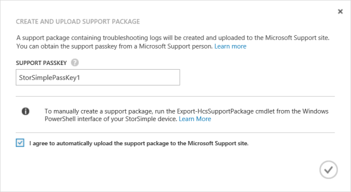
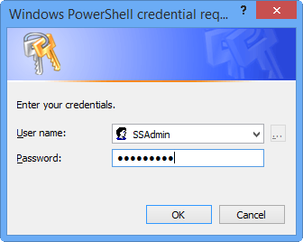
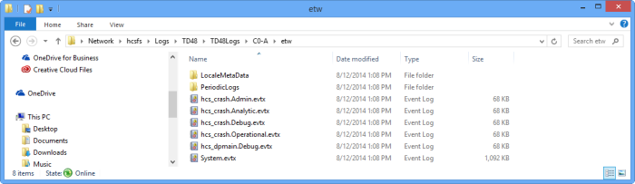
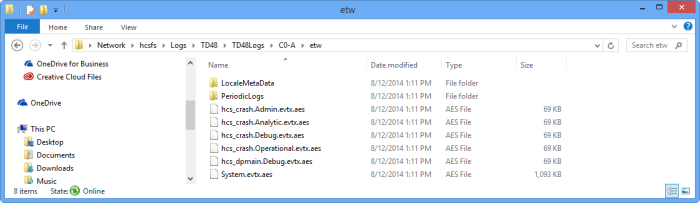

<properties
   pageTitle="Erstellen Sie ein StorSimple Support-Paket | Microsoft Azure"
   description="Informationen Sie zum Erstellen, entschlüsseln und ein Supportpaket für Ihr Gerät StorSimple bearbeiten."
   services="storsimple"
   documentationCenter=""
   authors="alkohli"
   manager="carmonm"
   editor="" />
<tags
   ms.service="storsimple"
   ms.devlang="na"
   ms.topic="article"
   ms.tgt_pltfrm="na"
   ms.workload="na"
   ms.date="08/17/2016"
   ms.author="alkohli" />

# Erstellen und Verwalten eines StorSimple Support-Pakets

## (Übersicht)

Ein StorSimple Support-Paket sind einfach zu verwenden, die alle relevanten Protokolle Microsoft Support zur Unterstützung bei der Problembehandlung Probleme Gerät StorSimple erfasst. Die Protokolle werden verschlüsselt und komprimiert.

In diesem Lernprogramm enthält eine schrittweise Anleitung zum Erstellen und Verwalten von Support-Paket.

## Erstellen Sie und Hochladen Sie einer Support-Paket im klassischen Azure-Portal

Sie können erstellen und Hochladen einer Support-Pakets auf der Microsoft-Support-Website über die Seite **zum Warten** von des Diensts in der klassischen Azure-Portal.

> [AZURE.NOTE] Der Upload erfordert ein Kennwort Support. Ihre Supports sollten dies für Sie in eine e-Mail-Nachricht bereitstellen.

Eine verschlüsselte und komprimierte Support-Paket (CAB-Datei) wird erstellt und in der Support-Website hochgeladen. Der Mitarbeiter des Supports kann dieses Paket aus der Support-Website für die Problembehandlung abrufen.

Führen Sie die folgenden Schritte im klassischen zum Erstellen eines Pakets Support-Portal an.

#### Zum Erstellen eines Support-Pakets im klassischen Azure-Portal

1. Wählen Sie die **Geräte** > **Wartung**.

2. Wählen Sie im Abschnitt **unterstützen Paket** **Erstellen und Upload Support-Paket**aus.

3. Klicken Sie im Dialogfeld **Erstellen und Upload Support-Paket** folgendermaßen Sie vor:

    

    - Geben Sie in das Textfeld **Support Kennwort** das Kennwort ein. Der Microsoft-Supportmitarbeiter sollte dieses Kennwort Sie per e-Mail senden.

    - Aktivieren Sie das Kontrollkästchen Zustimmung bereitstellen zu Support-Paket automatisch auf die Microsoft-Support-Website hochladen.

    - Klicken Sie auf das Symbol "Überprüfen" .

## Manuelles Erstellen einer Support-Paket

In einigen Fällen müssen Sie das Support-Paket über Windows PowerShell für StorSimple manuell zu erstellen. Beispiel:

- Wenn Sie vertrauliche Informationen aus Ihrem Protokolldateien vor der Freigabe von Microsoft Support entfernen müssen.

- Wenn Sie das Paket aufgrund von Verbindungsproblemen hochladen Probleme auftreten.

Sie können Ihre manuell generierten Support-Paket mit Microsoft-Support über e-Mail freigeben. Führen Sie die folgenden Schritte aus, um ein Paket Unterstützung in Windows PowerShell für StorSimple zu erstellen.

#### So erstellen Sie ein Supportpaket in Windows PowerShell für StorSimple

1. Zum Starten von Windows PowerShell-Sitzung als Administrator auf dem Remotecomputer, die Verbindung mit Ihrem Gerät StorSimple verwendet wird, geben Sie den folgenden Befehl aus:

    `Start PowerShell`

2. Verbinden Sie in der Windows PowerShell-Sitzung auf der Konsole SSAdmin von Ihrem Gerät:

    - Geben Sie an der Befehlszeile:

        `$MS = New-PSSession -ComputerName <IP address for DATA 0> -Credential SSAdmin -ConfigurationName "SSAdminConsole"`

    1. Klicken Sie im Dialogfeld, das geöffnet wird, geben Sie Ihr Administratorkennwort Gerät aus. Das standardmäßige Kennwort lautet:

        `Password1`

        

    2. Wählen Sie **OK**aus.
    1. Geben Sie an der Befehlszeile:

        `Enter-PSSession $MS`

3. Die Sitzung, die geöffnet wird, geben Sie den entsprechenden Befehl ein.

    - Geben Sie für Netzwerk-Freigaben, die ein Kennwort geschützt werden Folgendes ein:

        `Export-HcsSupportPackage –PackageTag "MySupportPackage" –Credential "Username" -Force`

        Sie werden aufgefordert, ein Kennwort, einen Pfad zu dem freigegebenen Netzwerkordner und eine Verschlüsselung Kennwort aufgefordert (da das Supportpaket verschlüsselt ist). Support-Paket wird im angegebenen Ordner erstellt.

    - Für Freigaben, die nicht kennwortgeschützt sind, müssen Sie nicht die `-Credential` Parameter. Geben Sie Folgendes ein:

        `Export-HcsSupportPackage –PackageTag "MySupportPackage" -Force`

        Das Support-Paket ist für beide Controller in der angegebenen freigegebenen Netzwerkordners erstellt. Es ist eine verschlüsselte, komprimierte Datei, die zur Behandlung dieses Problems an den Microsoft Support gesendet werden kann. Weitere Informationen finden Sie unter [Microsoft-Support wenden](storsimple-contact-microsoft-support.md).

### Export-HcsSupportPackage-Cmdlet-Parameter
Sie können die folgenden Parameter mit dem Export-HcsSupportPackage-Cmdlet verwenden.

| Parameter            | Erforderlich/Optional | Beschreibung                                                                                                                                                             |
|----------------------|-------------------|-------------------------------------------------------------------------------------------------------------------------------------------------------------------------|
| `-Path`                 | Erforderlich          | Verwenden Sie, um den Speicherort des freigegebenen Netzwerkordners bereitzustellen, in dem das Support-Paket platziert wird.                                                                 |
| `-EncryptionPassphrase` | Erforderlich          | Verwenden Sie, um ein Kennwort zum Support-Paket verschlüsseln Hilfe bereitzustellen.                                                                                                        |
| `-Credential`           | Optional          | Verwenden Sie die Access-Anmeldeinformationen für den freigegebenen Netzwerkordner angeben.                                                                                        |
| `-Force`                | Optional          | Verwenden Sie, um die Verschlüsselung Kennwort zur Bestätigungsschritt überspringen.                                                                                                                |
| `-PackageTag`           | Optional          | Verwenden Sie, um ein Verzeichnis unter *Pfad* angeben, in dem das Support-Paket platziert wird. Die Standardeinstellung ist [Gerätename]-[aktuelles Datum und Time:yyyy-MM-dd-HH-mm-ss].       |
| `-Scope`                | Optional          | Geben Sie als **Cluster** (Standard) zum Erstellen eines Pakets Support für beide Controller aus. Wenn Sie ein Paket nur für den aktuellen Controller erstellen möchten, geben Sie **Controller**. |

## Bearbeiten eines Pakets support

Nachdem Sie eine Support-Paket generiert haben, müssen Sie das Paket, um vertrauliche Informationen entfernen bearbeiten. Dies kann Lautstärke Namen, Gerät IP-Adressen und zusätzliche Namen aus den Protokolldateien einbeziehen.

> [AZURE.IMPORTANT] Sie können nur eine Support-Paket bearbeiten, die über Windows PowerShell für StorSimple generiert wurde. Sie können ein Paket erstellt wurde, im klassischen Azure-Portal mit StorSimple-Manager-Dienst nicht bearbeiten.

Support-Paket bearbeiten, bevor Sie es auf der Website Microsoft Support hochladen, zuerst das Supportpaket entschlüsseln, bearbeiten Sie die Dateien, und verschlüsseln es dann erneut. Führen Sie die folgenden Schritte aus.

#### So bearbeiten Sie ein Paket Unterstützung in Windows PowerShell für StorSimple

1. Generieren einer Support-Paket an, wie zuvor beschrieben in [ein Paket Unterstützung in Windows PowerShell für StorSimple erstellen](#to-create-a-support-package-in-windows-powershell-for-storsimple).

2. [Laden Sie das Skript](http://gallery.technet.microsoft.com/scriptcenter/Script-to-decrypt-a-a8d1ed65) , lokal auf Ihren Kunden.

3. Importieren von Windows PowerShell-Modul. Geben Sie den Pfad zu dem lokalen Ordner, in dem Sie das Skript heruntergeladen haben. Um das Modul zu importieren, geben Sie Folgendes ein:

    `Import-module <Path to the folder that contains the Windows PowerShell script>`

4. Alle Dateien sind *.aes* Dateien, die komprimiert und verschlüsselt werden. Zum Dekomprimieren und Dateien entschlüsseln, geben Sie Folgendes ein:

    `Open-HcsSupportPackage <Path to the folder that contains support package files>`

    Beachten Sie, dass die eigentliche Dateierweiterungen für alle Dateien jetzt angezeigt werden.

    

5. Wenn Sie für die Verschlüsselung Kennwort aufgefordert werden, geben Sie das Kennwort ein, das Sie beim Erstellen das Support-Paket verwendet.

        cmdlet Open-HcsSupportPackage at command pipeline position 1

        Supply values for the following parameters:EncryptionPassphrase: ****

6. Navigieren Sie zu dem Ordner, der die Protokolldateien enthält. Da die Protokolldateien jetzt dekomprimiert und entschlüsselt werden, können diese ursprünglichen Dateierweiterungen sind. Ändern Sie diese Dateien, um alle Kunden-spezifische Informationen, wie z. B. Lautstärke und Gerät IP-Adressen, zu entfernen, und speichern Sie die Dateien.

7. Schließen Sie die Dateien aus, um mit Gzip komprimieren und diese mit AES-256 verschlüsseln. Dies trifft für Geschwindigkeit und Sicherheit in das Supportpaket über ein Netzwerk übertragen. Zum Komprimieren und Verschlüsseln von Dateien, geben Sie Folgendes ein:

    `Close-HcsSupportPackage <Path to the folder that contains support package files>`

    

8. Wenn Sie dazu aufgefordert werden, geben Sie ein Kennwort Verschlüsselung für das geänderte Supportpaket aus.

        cmdlet Close-HcsSupportPackage at command pipeline position 1
        Supply values for the following parameters:EncryptionPassphrase: ****

9. Notieren Sie sich das neue Kennwort ein, damit Sie mit Microsoft-Support bei der Anforderung gemeinsam nutzen zu können.

### Beispiel: Bearbeitung von Dateien in einem Supportpaket auf eine kennwortgeschützte Freigabe

Im folgenden Beispiel wird gezeigt, wie entschlüsseln, bearbeiten und erneut verschlüsseln einer Support-Paket.

        PS C:\WINDOWS\system32> Import-module C:\Users\Default\StorSimple\SupportPackage\HCSSupportPackageTools.psm1

        PS C:\WINDOWS\system32> Open-HcsSupportPackage \\hcsfs\Logs\TD48\TD48Logs\C0-A\etw

        cmdlet Open-HcsSupportPackage at command pipeline position 1

        Supply values for the following parameters:

        EncryptionPassphrase: ****

        PS C:\WINDOWS\system32> Close-HcsSupportPackage \\hcsfs\Logs\TD48\TD48Logs\C0-A\etw

        cmdlet Close-HcsSupportPackage at command pipeline position 1

        Supply values for the following parameters:

        EncryptionPassphrase: ****

        PS C:\WINDOWS\system32>

## Nächste Schritte

- Erfahren Sie, wie Sie [Support-Paketen und Gerät Protokolle mit Ihrem Gerät Bereitstellung behandeln](storsimple-troubleshoot-deployment.md#support-packages-and-device-logs-available-for-troubleshooting).

- Erfahren Sie, wie der Dienst StorSimple Manager zum Verwalten von Ihrem Geräts StorSimple zu [verwenden](storsimple-manager-service-administration.md).
