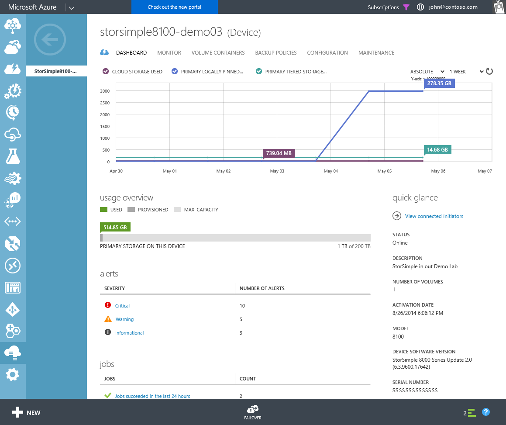

<properties
   pageTitle="Verwenden Sie das StorSimple Manager Gerät Dashboard | Microsoft Azure"
   description="Beschreibt das StorSimple Manager Service Gerät Dashboard und Verwendung zum Anzeigen von Speicher Kennzahlen und angeschlossenen Initiatoren und die fortlaufende Zahl und IQN finden."
   services="storsimple"
   documentationCenter="NA"
   authors="alkohli"
   manager="carmonm"
   editor="" />
<tags
   ms.service="storsimple"
   ms.devlang="NA"
   ms.topic="article"
   ms.tgt_pltfrm="NA"
   ms.workload="TBD"
   ms.date="09/21/2016"
   ms.author="alkohli" />

# Verwenden Sie das StorSimple Manager Gerät dashboard

## (Übersicht)

Das Manager StorSimple Gerät Dashboard bietet Ihnen einen Überblick über die Informationen für ein bestimmtes StorSimple Gerät im Gegensatz zu dem Dienst-Dashboard, das Sie alle Geräte in Ihrer Microsoft Azure StorSimple Lösung enthaltenen Informationen verleiht.

Das Dashboard enthält die folgende Informationen:

- **Diagrammbereich** – Sie können die entsprechenden Speicher Metrik in den Diagrammbereich am oberen Rand des Dashboards finden Sie unter. In diesem Diagramm können Sie die Kriterien für die primäre Gesamtspeicher (die Menge der Daten, die von Hosts auf Ihr Gerät geschrieben) und die Summe Cloud-Speicher verbraucht von Ihrem Gerät über einen Zeitraum anzeigen.

     In diesem Zusammenhang *primären Speicher* bezieht sich auf die Gesamtmenge der Daten, die vom Host geschrieben und kann vom Typ des Datenträgers unterteilt: *primären gestufte Speicher* umfasst beide lokal gespeicherten Daten und Daten in der Cloud; gestuft *primäre Speicher lokal angehefteten* enthält nur die Daten lokal gespeichert. *Cloud-Speicher*ist andererseits, ein Maß für die Gesamtmenge der Daten in der Cloud gespeichert. Dies umfasst gestufte Daten und Sicherungskopien. Beachten Sie, dass Daten in der Cloud gespeichert ist deduplizierte komprimiert, während die Primärer Speicher zeigt an, der Speichermenge, die verwendet werden, bevor die Daten deduplizierte und komprimiert ist. (Sie können diese beiden Zahlen um eine Vorstellung davon die Komprimierungsrate erhalten vergleichen.) Für beide primären und Cloud-Speicher, die angezeigten Beträge basiert auf den Verlauf Häufigkeit, die Sie konfigurieren. Beispielsweise, wenn Sie eine Häufigkeit eine Woche auswählen, wird dann das Diagramm Daten für jeden Tag in der vorherigen Woche angezeigt.

     Sie können das Diagramm wie folgt konfigurieren:

     - Um den Umfang der Cloud-Speicher über einen Zeitraum verbraucht anzuzeigen, die Option **CLOUD Speicher verwendet** . Um den Gesamtspeicher anzuzeigen, der vom Host geschrieben wurde, wählen Sie das **Primäre GESTUFT Speicher verwendet** und **Primären lokal ANGEHEFTETEN Speicher verwendet** . In der Abbildung sind beide Optionen ausgewählt. das Diagramm zeigt daher Speicher Beträge für Cloud und primären Speicher. Beachten Sie, dass alle primären Speicher vor der Installation von Update 2 verwendet durch die **Primäre GESTUFT Speicher verwendet** Linie dargestellt wird.
     - Verwenden Sie im Dropdown-Menü in der oberen rechten Ecke des Diagramms, um eine 1 Woche, 1 Monat, 3-Monat oder 1 Jahr Zeitraum anzugeben. Beachten Sie, dass das Diagramm auf oberster Ebene aktualisiert nur ein Mal pro Tag wird und daher den vorherigen Tag Summen wider.

     Weitere Informationen finden Sie unter [Verwenden der StorSimple-Manager-Dienst auf Ihrem Gerät StorSimple überwachen](storsimple-monitor-device.md).

- **Übersicht über die Verwendung** – **Übersicht über die Verwendung** im Bereich können Sie die primäre Speicherplatz verwendet, der bereitgestellte Speichermenge, und die maximale Speicherkapazität für Ihr Gerät anzeigen. Vergleichen Sie diese Zahlen zur Verwendung in der maximale Speichermenge, die verfügbar ist, können Sie auf einen Blick sehen, wenn Sie weiteren Speicherplatz zu erhalten müssen. Beachten Sie, dass dieser Übersicht wird aktualisiert alle 15 Minuten, aufgrund der unterschiedlichen Aktualisierungsintervall, möglicherweise anzeigen als die andere Zahlen angezeigte in den Diagrammbereich oben, die täglich aktualisiert wird. Weitere Informationen finden Sie unter [Verwenden der StorSimple-Manager-Dienst auf Ihrem Gerät StorSimple überwachen](storsimple-monitor-device.md).

- **Benachrichtigungen** – der Bereich **Benachrichtigungen** enthält eine Übersicht über die Benachrichtigungen für Ihr Gerät. Benachrichtigungen nach Schwere gruppiert sind, und Anzahl wird die Anzahl der Benachrichtigungen jede Ebene schwere bereitgestellt. Durch Klicken auf die Benachrichtigung schwere öffnet einen Suchbegriffs Überblick über die Registerkarte Benachrichtigungen Sie nur die Benachrichtigungen dieser schwere Ebene für dieses Gerät angezeigt.

- **Aufträge** – " **Projekte** " zeigt das Ergebnis der aktuellen Position Aktivitäten. Dies können Sie sicherstellen, dass das System wie erwartet funktioniert, oder Sie wissen lassen, dass Sie Maßnahmen treffen müssen. Weitere Informationen zu zuletzt abgeschlossenen Aufträge zu finden, klicken Sie auf **Aufträge erfolgreich verlaufen ist in den letzten 24 Stunden**.

- Im Bereich **schnelleinsicht** auf der rechten Seite des Dashboards bietet nützlichen Informationen, wie z. B. Gerätemodell, fortlaufende Zahl, Status, Beschreibung und Anzahl der Datenträger.

Sie können auch Failover konfigurieren und angeschlossenen Initiatoren aus dem Dashboard Gerät anzeigen.

Sind allgemeinen Aufgaben, die auf dieser Seite ausgeführt werden können:

- Anzeigen von verbundenen Initiatoren

- Suchen nach Seriennummer des Geräts

- Suchen Sie das Gerät Ziel IQN

## Anzeigen von verbundenen Initiatoren

Sie können die iSCSI Initiatoren anzeigen, die mit Ihrem Gerät verbunden sind, über den Link **View verbunden Initiatoren** im Bereich **schnelleinsicht** von Ihrem Gerät Dashboard bereitgestellt. Diese Seite enthält eine tabellarische Auflistung der Initiatoren, die mit Ihrem Gerät erfolgreich eine Verbindung hergestellt haben. Für jeden Initiator können Sie sehen:

- Die iSCSI qualifizierte Namen (IQN) des verbundenen Initiators.

- Der Name des Access-Steuerelement Datensatzes (ACR), die diesen verbundenen Initiator ermöglicht.

- Die IP-Adresse des verbundenen Initiators.

- Die Netzwerkschnittstellen, die der Initiator auf Ihrem Speichergerät mit verbunden ist. Dies können aus Daten 0 und 5 Daten liegen.

- Alle Datenträger, die der verbundene Initiator entsprechend der aktuellen ACR Konfiguration zugreifen dürfen.

Wenn Sie finden Sie unter unerwartete Initiatoren in dieser Liste oder die erwarteten Ergebnissen nicht angezeigt wird, überprüfen Sie Ihre Konfiguration ACR. Bis zu 512 Initiatoren kann eine Verbindung mit Ihrem Gerät.

## Suchen nach Seriennummer des Geräts

Seriennummer des Geräts benötigen Sie möglicherweise, wenn Sie auf dem Gerät (Microsoft Multipfad e/a) konfigurieren. Führen Sie die folgenden Schritte aus, um die fortlaufende Zahl Gerät zu finden.

#### Zum Suchen von Seriennummer des Geräts

1. Navigieren Sie zu **Geräte** > **Dashboard**.

2. Suchen Sie im rechten Bereich des Dashboards den **den ersten Blick** Bereich ein.

3. Führen Sie einen Bildlauf nach unten, und suchen Sie die fortlaufende Zahl.

## Suchen Sie das Gerät Ziel IQN

Möglicherweise wird das Gerät Ziel IQN beim Konfigurieren des Herausforderung Handshake Authentication Protocol (CHAP) auf Ihrem Gerät StorSimple. Führen Sie die folgenden Schritte aus, um das Gerät Ziel IQN zu finden.

### Um das Gerät Ziel IQN zu finden.

1. Navigieren Sie zu **Geräte** > **Dashboard**.

1. Suchen Sie im rechten Bereich des Dashboards den **den ersten Blick** Bereich ein.

1. Führen Sie einen Bildlauf nach unten, und suchen Sie das Ziel IQN.

## Nächste Schritte

- Weitere Informationen zu den [StorSimple Manager-Dienst Dashboard](storsimple-service-dashboard.md).
- Weitere Informationen zum [Verwenden des Diensts StorSimple Manager zum Verwalten von Ihrem Geräts StorSimple](storsimple-manager-service-administration.md).
