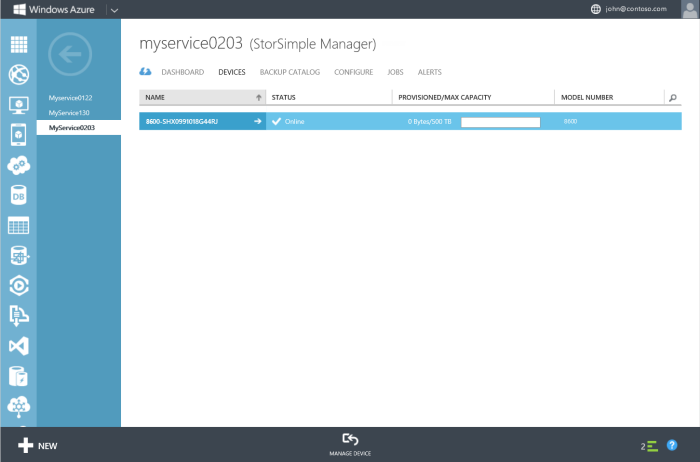

<properties 
   pageTitle="StorSimple Failover- und Disaster Wiederherstellung | Microsoft Azure"
   description="Erfahren Sie, wie über Ihr Gerät StorSimple an sich selbst, ein anderes Gerät oder ein virtuelles Gerät fehlschlägt."
   services="storsimple"
   documentationCenter=""
   authors="alkohli"
   manager="carmonm"
   editor="" />
<tags 
   ms.service="storsimple"
   ms.devlang="na"
   ms.topic="article"
   ms.tgt_pltfrm="na"
   ms.workload="na"
   ms.date="09/16/2016"
   ms.author="alkohli" />

# Failover und Disaster Wiederherstellung für Ihr Gerät StorSimple

## (Übersicht)

In diesem Lernprogramm werden die erforderlichen Schritte zum nach einem Ausfall über ein Gerät StorSimple fehl. Ein Failover können Sie Ihre Daten auf einem Quellgerät im Datencenter zu einer anderen physischen oder sogar ein virtuelles Gerät befindet sich in der gleichen oder einem anderen geographischen Standort migrieren. 

Wiederherstellung (DR) wird über das Gerät Failoverfunktion koordiniert und initiiert von der Seite **Geräte** . Diese Seite jeder andere Wert zeigt alle StorSimple Geräte mit dem Dienst StorSimple Manager verbunden ist. Für jedes Gerät werden der Anzeigename, Status, bereitgestellten und maximale Kapazität, Typ und Modell angezeigt.

Die Anleitung in diesem Lernprogramm bezieht sich auf StorSimple physischen und virtuellen Geräte über alle Softwareversionen.

## Wiederherstellung (DR) und Geräte-failover

In einem Szenario zur Wiederherstellung (DR) nach funktioniert der primären Geräts nicht mehr. In diesem Fall können Sie die Gerät an ein anderes Gerät zugeordneten sind, indem der primären Geräts als *Datenquelle* verwenden und ein anderes Gerät als *Ziel*Cloud Daten verschieben. Sie können eine oder mehrere Lautstärke Container migrieren an das Gerät auswählen. Dieses Verfahren wird als *Failover*bezeichnet. 

Während des Failovers die Lautstärke Container vom Quellgerät Besitz ändern und an das Gerät übertragen. Nachdem Sie die Lautstärke Container Besitz ändern, werden diese vom Quellgerät gelöscht. Nachdem der Löschvorgang abgeschlossen ist, kann das Gerät dann wieder fehlgeschlagen ist.

In der Regel wird nach einer DR, die aktuellste Sicherung verwendet, um die Daten an das Gerät wiederherstellen. Jedoch wenn mehrere zusätzliche Richtlinien für den gleichen Datenträger vorhanden sind, klicken Sie dann die Sicherung Richtlinie mit der größten Anzahl von Datenmengen entnommen wird und die letzte Sicherung aus dieser Richtlinie wird verwendet, um die Daten auf dem Zielgerät wiederherstellen.

Beispiel, wenn es zwei zusätzliche Richtlinien (eine Standardnummer und eine benutzerdefinierte) *DefaultPol*, *CustomPol* mit den folgenden Details gibt:

- *DefaultPol* : ein Volumen, *vol1*, ausgeführt wird, 10:30 Uhr tägliche ab.
- *CustomPol* : vier Datenmengen, *vol1*, *vol2*, *vol3*, *vol4*, ausgeführt wird, 10:00 Uhr täglich ab.

In diesem Fall wird *CustomPol* verwendet werden, während sie weitere Datenmengen hat, und wir für Absturz-Konsistenz priorisieren. Die letzte Sicherung aus dieser Richtlinie wird verwendet, um die Daten wiederherstellen.

## Aspekte Failoververarbeitung Gerät

Bei einem Ausfall können Sie über Ihr Gerät StorSimple ein Fehler auftreten:

- Zu einem physischen Gerät 
- An sich selbst
- Zu einem virtuellen Gerät

Beachten Sie für alle Geräte-Failover Folgendes:

- Die Komponenten für DR sind, dass alle Datenträger innerhalb des Containers Lautstärke offline sind und die Lautstärke Container eine zugeordnete Cloud Momentaufnahme. 
- Die verfügbaren Zielgeräte für DR sind Geräte mit genügend Speicherplatz für die ausgewählten Datenträger Container aufnehmen zu können. 
- Die Geräte, die mit dem Dienst verbunden sind, aber nicht die Kriterien der ausreichend Platz erfüllen verfügbar als Zielgeräte nicht.
- Nach einer DR kann für eine bestimmte Dauer, die Daten Access Leistung erheblich, beeinträchtigt, da das Gerät benötigen Sie Zugriff auf die Daten aus der Cloud und lokal speichern.

#### Gerät Failover über Software-Versionen

Ein StorSimple-Manager-Dienst in einer Bereitstellung möglicherweise mehrere Geräte, physische und virtuelle, alle laufenden unterschiedliche Softwareversionen. Je nach der Softwareversion, können die Lautstärke Typen auf Geräten auch abweichen. Beispielsweise Gerät fortlaufendes Update 2 oder höher würde lokal angehefteten und gestuft Datenmengen (mit wird eine Teilmenge der Archivierung gestuft). Ein Gerät vor dem Update 2 können andererseits möglicherweise gestuft haben und Archivierung Datenmengen. 

Verwenden Sie in der folgenden Tabelle, um festzustellen, ob Sie über an ein anderes Gerät, eine andere Version und das Verhalten des Typs Lautstärke während DR ausgeführt ausgeführt werden können.

| Möglicher Fehler über aus                                      | Für physische Gerät zulässig.                                                                                                                                                      | Für virtuelle Gerät zulässig.                            |
|----------------------------------------------------|----------------------------------------------------------------------------------------------------------------------------------------------------------------------------------|-------------------------------------------------------|
| Aktualisieren von 2 um 1 (Version 0.1, 0,2 und 0,3) vorab zu aktualisieren. | Nein                                                                                                                                                                               | Nein                                                    |
| Aktualisieren Sie zum Aktualisieren von 1 (1, 1.1, 1.2) 2                 | Ja   Wenn angehefteten oder Datenmengen oder eine Mischung aus zwei gestuft lokal verwenden, sind die Datenmengen immer über fehlgeschlagen, da gestuft.                  | Ja  Wenn Datenmengen mit lokal angeheftet werden, werden diese über dem gestuft fehlgeschlagen ist. |
| Aktualisieren von 2 auf Update 2 (spätere Version)                               | Ja  Wenn lokal angeheftete oder gestufte Datenmengen oder eine Mischung aus zwei verwenden zu können, sind die Datenmengen immer über Dateityp Lautstärke Anfangs fehlgeschlagen ist; gestuft als gestufte und lokal angeheftete als lokal angehefteten. | Ja  Wenn Datenmengen mit lokal angeheftet werden, werden diese über dem gestuft fehlgeschlagen ist. |

#### Teilweise Failover über Software-Versionen

Führen Sie diese Anleitung, wenn Sie beabsichtigen, führen Sie eine teilweise System durch Verwendung von einem StorSimple Quellgerät vor dem Update 1 auf ein Ziel Ausführen von Update 1 oder höher ausgeführt. 

| Teilweise Failover aus                                      | Für physische Gerät zulässig.                                                                                                                                                      | Für virtuelle Gerät zulässig.                            |
|----------------------------------------------------|----------------------------------------------------------------------------------------------------------------------------------------------------------------------------------|-------------------------------------------------------|
|Aktualisieren von 1 (Version 0.1, 0,2 und 0,3) vorab Update 1 oder höher  | Ja, finden Sie unter bewährte Methode Tipps und Tricks.                                                                                                                                                                               | Ja, finden Sie unter bewährte Methode Tipps und Tricks.                                                    |

>[AZURE.TIP] Es wurde ein Cloud Metadaten und Daten Format ändern in Update 1 oder höher. Daher empfehlen wir eine teilweise Failover von vor dem Update 1 auf Update 1 oder höhere Versionen nicht. Wenn Sie einen teilweisen Failover ausführen müssen, empfehlen wir, dass Sie zuerst Update 1 oder höher sowohl die Geräte (Quell- und Zielwebsites anwenden), und fahren Sie mit dem Failover. 

## Möglicher Fehler über an ein anderes physische Gerät

Führen Sie die folgenden Schritte aus, um Ihr Gerät an ein Gerät physisch wiederherzustellen.

1. Stellen Sie sicher, dass der Lautstärke Container, die, dem Sie über ein Fehler auftreten, möchten, Cloud Momentaufnahmen verknüpft ist.

1. Klicken Sie auf der Seite **Geräte** auf der Registerkarte **Lautstärke Container** .

1. Wählen Sie einen Volumen-Container, den Sie an ein anderes Gerät über treten möchten. Klicken Sie auf den Container Lautstärke, um die Liste der Datenträger in diesem Container anzuzeigen. Wählen Sie einen Datenträger aus, und klicken Sie auf **Offline nehmen** um die Lautstärke offline zu schalten. Wiederholen Sie diesen Vorgang für alle Datenträger im Container Lautstärke ein.

1. Wiederholen Sie die im vorherigen Schritt für die Lautstärke-Container aus, die Sie an ein anderes Gerät über treten möchten.

1. Klicken Sie auf der Seite **Geräte** auf **Failover**.

1. Im Assistenten, der nach oben, klicken Sie unter **auswählen Lautstärke Container über treten**angezeigt wird:

    1. Wählen Sie in der Liste der Lautstärke Container die Lautstärke Container aus, die, denen Sie über ein Fehler auftreten, möchten.
    **Es werden lediglich die Lautstärke Container mit zugeordneten Cloud Momentaufnahmen und offline Datenmengen angezeigt.**

    1. Klicken Sie unter **Auswählen eines Zielgeräts** für die Datenmengen in der ausgewählten Container wählen Sie ein Zielgerät aus der Dropdown-Liste der verfügbaren Geräte aus. Nur die Geräte, die die verfügbare Kapazität aufweisen, werden in der Dropdownliste angezeigt.

    1. Überprüfen Sie schließlich die Failovereinstellungen unter **Failover bestätigen**ein. Klicken Sie auf das Symbol Kontrollkästchen .

1. Ein Failover Auftrag wird erstellt, die über die Seite " **Aufträge** " überwacht werden können. Wenn der Lautstärke Container, die Sie über einen Fehler bei lokalen Laufwerke hat, wird einzelne Wiederherstellungsaufträge für jeden lokalen Datenträger (nicht für gestufte Datenmengen) im Container angezeigt werden. Diese Aufträge möglicherweise in Anspruch nehmen längere Zeit wiederherstellen. Ist zu rechnen, der Auftrag Failover einer früheren Version durchführen kann. Beachten Sie, dass diese Datenträger lokale Garantien werden erst nach der Wiederherstellung Einzelvorgänge abgeschlossen sind. Wechseln Sie zur Seite **Geräte** aus, nach dem Abschluss der.                                            

    1. Wählen Sie das Gerät, das als das Gerät für des Failovervorgangs verwendet wurde.

    1. Wechseln Sie zu der Seite **Lautstärke Container** . Alle die Lautstärke Container, zusammen mit den Datenmengen aus der alten Gerät aufgeführt werden soll.

## System durch Verwendung eines einzelnen Geräts

Führen Sie die folgenden Schritte aus, wenn Sie nur ein einzelnes Gerät haben und einen Failover ausführen müssen.

1. Momentaufnahmen Sie Cloud alle Datenträger in Ihrem Gerät.

1. Ihr Gerät auf Standardwerte für das Zurücksetzen. Anweisungen Sie die ausführliche in [ein Gerät StorSimple Factory-Standardeinstellungen zurücksetzen](storsimple-manage-device-controller.md#reset-the-device-to-factory-default-settings).

1. Konfigurieren Sie das Gerät konfigurieren und mit Ihrem Dienst StorSimple Manager erneut registrieren.

1. Klicken Sie auf der Seite **Geräte** sollte das alte Gerät als **Offline**anzeigen. Das Gerät neu registrierte sollte als **Online**anzeigen.

1. Führen Sie für das neue Gerät zuerst die minimale Konfiguration des Geräts. 
                                                
    >[AZURE.IMPORTANT] **Wenn Sie nicht zuerst die minimale Konfiguration abgeschlossen ist, tritt der DR als Ergebnis eines Fehlers in der aktuellen Implementierung. Dieses Verhalten wird in einer späteren Version behoben sein.**

1. Wählen Sie das alte Gerät (Status offline), und klicken Sie auf **Failover**. Klicken Sie im Assistenten, der angezeigt werden, über das Gerät fehl, und geben Sie das Gerät als das Gerät neu registriert. Ausführliche Anweisungen finden Sie [über an ein anderes physische Gerät fehl](#fail-over-to-another-physical-device).

1. Ein Gerät Wiederherstellungsauftrag wird erstellt, dass Sie von der Seite **Aufträge** überwachen können.

1. Nachdem der Auftrag erfolgreich abgeschlossen wurde, Zugriff auf das neue Gerät, und navigieren Sie zu der Seite **Lautstärke Container** . Die Lautstärke Container aus dem alten Gerät sollte jetzt auf das neue Gerät migriert werden.

## Möglicher Fehler über zu einem virtuellen StorSimple-Gerät

Sie müssen eine StorSimple virtuelles Gerät erstellt und konfiguriert werden, bevor Sie dieses Verfahren ausführen. Update 2 ausgeführt wird, sollten Sie verwenden ein virtuelle 8020-Gerät für die DR, die 64 TB sowie Premium Speicher verwendet. 
 
Führen Sie die folgenden Schritte aus, um das Gerät zu einem Ziel StorSimple virtuellen Gerät wiederherzustellen.

1. Stellen Sie sicher, dass der Lautstärke Container, die, dem Sie über ein Fehler auftreten, möchten, Cloud Momentaufnahmen verknüpft ist.

1. Klicken Sie auf der Seite **Geräte** auf der Registerkarte **Lautstärke Container** .

1. Wählen Sie einen Volumen-Container, den Sie an ein anderes Gerät über treten möchten. Klicken Sie auf den Container Lautstärke, um die Liste der Datenträger in diesem Container anzuzeigen. Wählen Sie einen Datenträger aus, und klicken Sie auf **Offline nehmen** um die Lautstärke offline zu schalten. Wiederholen Sie diesen Vorgang für alle Datenträger im Container Lautstärke ein.

1. Wiederholen Sie die im vorherigen Schritt für die Lautstärke-Container aus, die Sie an ein anderes Gerät über treten möchten.

1. Klicken Sie auf der Seite **Geräte** auf **Failover**.

1. Führen Sie im Assistenten, der nach oben, geöffnet, klicken Sie unter **auswählen Lautstärke Container Failover wird**folgende Schritte aus:
                                                    
    ein. Wählen Sie in der Liste der Lautstärke Container die Lautstärke Container aus, die, denen Sie über ein Fehler auftreten, möchten.

    **Es werden lediglich die Lautstärke Container mit zugeordneten Cloud Momentaufnahmen und offline Datenmengen angezeigt.**

    b. Wählen Sie unter **Auswählen eines Zielgeräts für die Datenmengen in der ausgewählten Container**das StorSimple virtuelle Gerät aus der Dropdown-Liste der verfügbaren Geräte aus. **Nur die Geräte, die über ausreichend Kapazität verfügen, werden in der Dropdownliste angezeigt.**  
    

1. Überprüfen Sie schließlich die Failovereinstellungen unter **Failover bestätigen**ein. Klicken Sie auf das Symbol Kontrollkästchen .

1. Wechseln Sie zur Seite **Geräte** aus, nach dem Abschluss der.
                                                    
    ein. Wählen Sie das virtuelle StorSimple-Gerät, das als das Gerät für des Failovervorgangs verwendet wurde.
    
    b. Wechseln Sie zu der Seite **Lautstärke Container** . Alle die Lautstärke Container, zusammen mit den Datenmengen aus dem alten Gerät sollte jetzt aufgeführt sein.

 **Video verfügbar**

Wenn Sie ein Video zur Verfügung, die veranschaulicht, wie Sie eine fehlgeschlagene über physische Gerät zu einem virtuellen Gerät in der Cloud wiederherstellen können, klicken Sie auf [hier](https://azure.microsoft.com/documentation/videos/storsimple-and-disaster-recovery/).

## Failback

Für Update 3 und höher unterstützt StorSimple auch Failback. Nachdem das Failover abgeschlossen ist, werden folgende Aktionen ausgeführt:

- Die Lautstärke Container, die über durchgeführt wurde, werden vom Quellgerät gelöscht.

- Ein Hintergrundauftrag pro Volume Container (über Fehler) wird auf dem Quellgerät initiiert. Wenn Sie Failback versuchen, während der Auftrag ausgeführt wird, erhalten Sie eine Benachrichtigung zu diesem Zweck. Sie müssen warten, bis das Projekt so starten Sie das Failback abgeschlossen ist. 

    Die Zeit für das Löschen der Lautstärke Container hängt von verschiedenen Faktoren wie Datenmenge, Alter der Daten, Anzahl der Sicherungskopien und verfügbare Netzwerk-Bandbreite für den Vorgang. Wenn Sie Test Failovers/Failbacks planen, empfehlen wir, dass Sie die Lautstärke Container mit weniger Daten (GB) testen. In den meisten Fällen können Sie das Failback starten 24 Stunden nach Abschluss des Failovers. 

## Häufig gestellte Fragen

F. **Was passiert, wenn die DR fehlschlägt oder teilweise Erfolg hat?**

A Wenn die DR fehlschlägt, empfehlen wir, dass Sie es erneut versuchen. Der zweiten Zeitangabe ungefähr, DR weiß, was alle abgeschlossen wurde und wenn der Vorgang zum ersten Mal gekommen ist. DR-Vorgang beginnt an diesem Punkt oder höher. 

F. **Kann ich ein Gerät löschen, während das Gerät Failover ausgeführt wird?**

A Sie können ein Gerät nicht löschen, während einer DR ausgeführt wird. Sie können Ihr Gerät nur nach Abschluss des DR löschen.

F.  **Beginnt Garbagecollection wann auf dem Quellgerät, damit die lokalen Daten auf Quellgerät gelöscht werden?**

A Garbagecollection wird erst nach das Gerät vollständig bereinigt wird auf dem Quellgerät aktiviert. Das Aufräumen umfasst Bereinigen von Objekten, die vom Quellgerät wie Datenmengen, zusätzliche Objekte (keine Daten), Lautstärke Container und Richtlinien über fehlgeschlagen sind.

F. **Was passiert, wenn die "löschen", die die Lautstärke Container in das Quellgerät zugeordnet fehlschlägt?**

A  Wenn die "löschen" fehlschlägt, müssen Sie das Löschen der Lautstärke Container manuell auslösen. Auf der Seite **Geräte** zur Auswahl des Quellgeräts, und klicken Sie auf **Lautstärke Container**. Wählen Sie die Lautstärke Container, die Sie nicht über und in der unteren Rand der Seite aus, klicken Sie auf **Löschen**. Nachdem Sie alle gelöscht haben die fehlgeschlagene über Volume Container auf dem Quellgerät, können Sie das Failback beginnen.

## Business Continuity Wiederherstellung (BCDR)

Eine Business Continuity (BCDR) Szenario zur Wiederherstellung nach tritt auf, wenn der gesamte Azure Datacenter funktioniert nicht mehr. Dies kann Ihre StorSimple Manager-Dienst und die zugehörigen StorSimple Geräte auswirken.

Falls StorSimple Geräte, die registriert wurden, kurz vor einem Datenverlust aufgetreten sind, möglicherweise diese Geräte StorSimple einer Factory zurücksetzen werden müssen. Nach dem aufgetretenen wird das Gerät StorSimple als offline angezeigt. Das Gerät StorSimple aus dem Portal gelöscht werden muss, und eine Fabrik zurücksetzen erledigt werden muss, gefolgt von einer frisch Registrierung.

## Nächste Schritte

- Nachdem Sie einen Failover ausgeführt haben, müssen Sie möglicherweise [Deaktivieren](storsimple-deactivate-and-delete-device.md)oder Löschen von Ihrem Gerät StorSimple.

- Finden Sie Informationen dazu, wie den StorSimple Manager-Dienst verwenden der Dienst StorSimple Manager zum Verwalten von Ihrem Geräts StorSimple zu [verwenden](storsimple-manager-service-administration.md).
 
