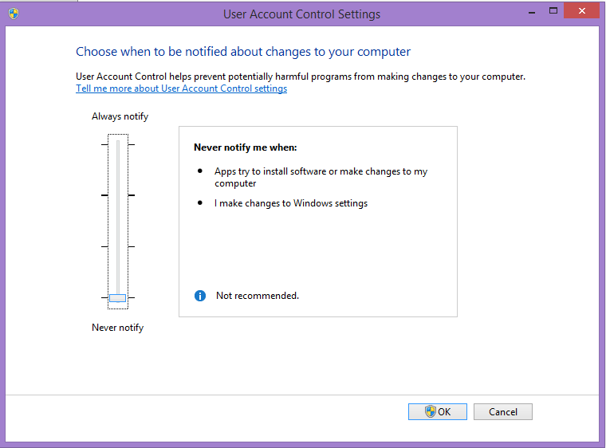
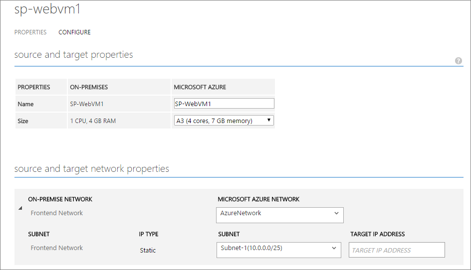
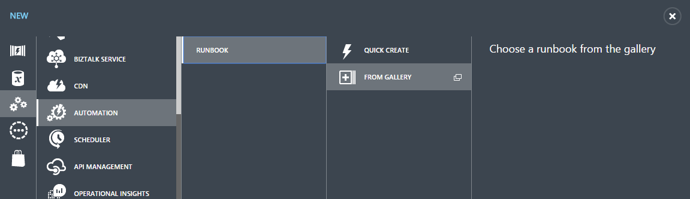
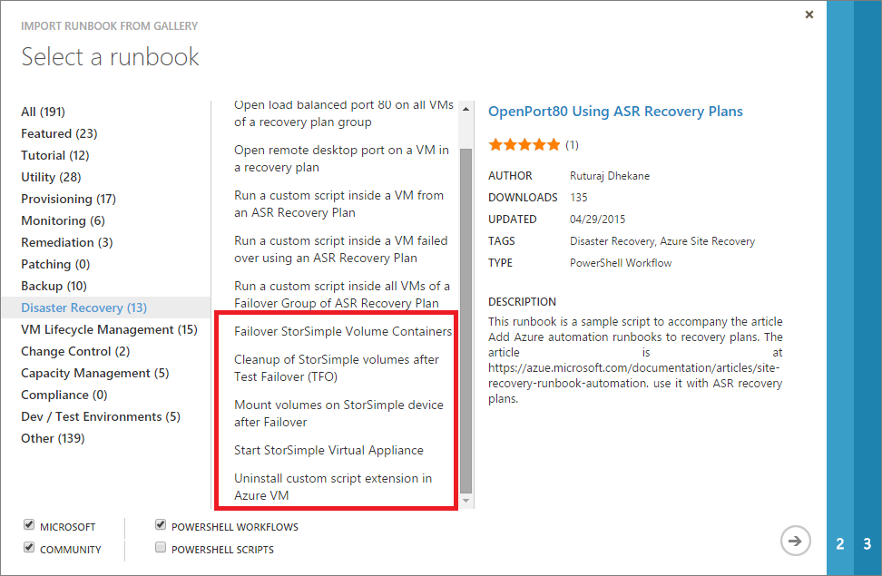
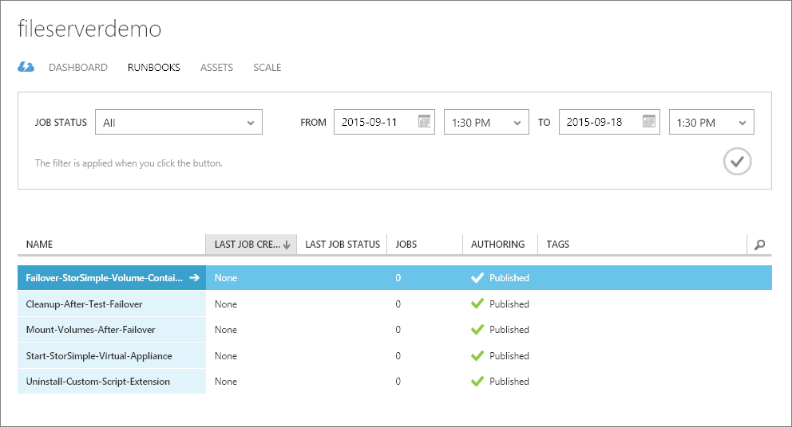
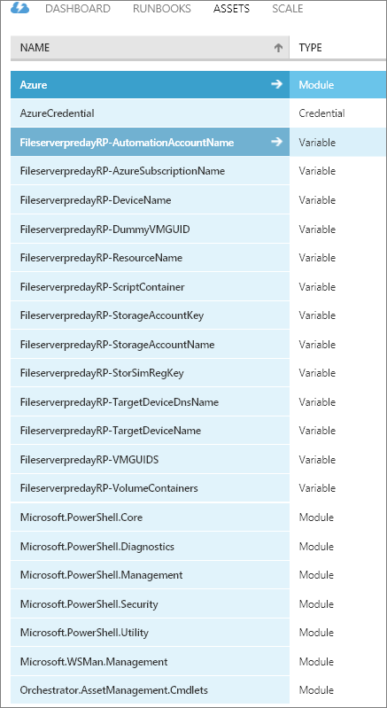
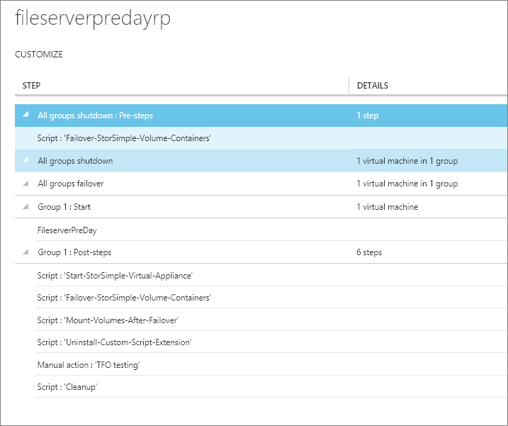
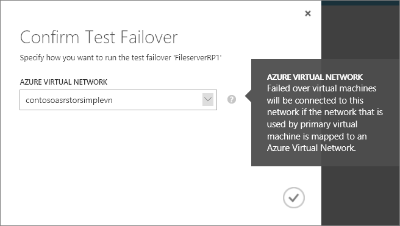
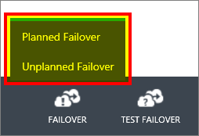
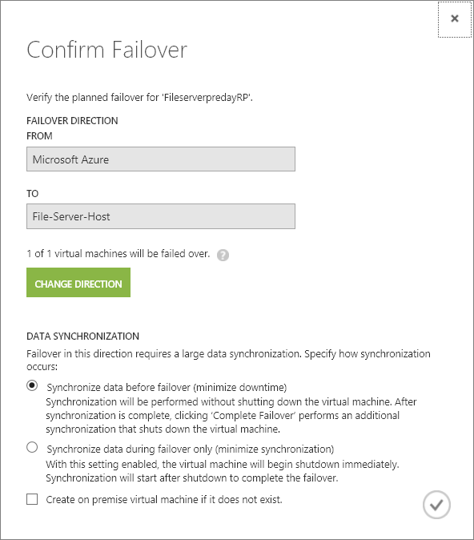

<properties 
   pageTitle="Automatisieren von DR für Dateifreigaben auf StorSimple mit Azure Website Wiederherstellung | Microsoft Azure"
   description="Beschreibt die Schritte und bewährte Methoden zum Erstellen einer Disaster Wiederherstellung Lösung für Dateifreigaben auf StorSimple Speicher."
   services="storsimple"
   documentationCenter="NA"
   authors="vidarmsft"
   manager="syadav"
   editor="" />
<tags 
   ms.service="storsimple"
   ms.devlang="NA"
   ms.topic="article"
   ms.tgt_pltfrm="NA"
   ms.workload="NA"
   ms.date="05/16/2016"
   ms.author="vidarmsft" />

# Automatisierte Wiederherstellung Lösung mit Azure Website Wiederherstellung für Dateifreigaben auf StorSimple

## (Übersicht)

Microsoft Azure StorSimple ist eine Hybriden Cloud Storage-Lösung, die die Komplexität der unstrukturierten Daten, die im Zusammenhang mit Dateifreigaben Adressen. StorSimple verwendet Cloud-Speicher als Erweiterung der lokalen Lösung und automatisch Ebenen Daten über die lokale Speicher und die Cloud-Speicher. Lokale Datenschutz, integriert und Momentaufnahmen cloud, eine Zeitressourcen.es-Infrastruktur überflüssig.

[Wiederherstellung der Azure-Website](../site-recovery/site-recovery-overview.md) ist eine Azure-basierten-Dienst, der Disaster (DR) Wiederherstellungsfunktionen bereitstellt, durch Replikation, Failover und Wiederherstellung von virtuellen Computern orchestriert. Azure Website Wiederherstellung unterstützt eine Anzahl von Replikation Technologien konsistente Replikation, schützen und nahtlos über virtuellen Computern und Applikationen privaten/öffentlichen oder gehosteten Wolken fehl.

Azure Website Wiederherstellung, virtuellen Computern Replikation und StorSimple Cloud Snapshot-Funktionen verwenden, können Sie die vollständige Datei-Server-Umgebung schützen. Einen einzelnen Klick können Sie im Falle einer Unterbrechung um online Ihre Dateifreigaben Azure in wenigen Minuten zu machen.

Dieses Dokument wird ausführlich erläutert, wie Sie erstellen eine Wiederherstellungsdatei Disaster-Lösung für Ihre Dateifreigaben StorSimple Speichermenge, und geplanten und ungeplanten ausgeführt werden und Testen des Failovers einen ein-Klick Wiederherstellungsplan verwenden können. Im Wesentlichen wird gezeigt, wie Sie den Plan für die Wiederherstellung in Ihrem Tresor Azure Website Wiederherstellung StorSimple Failovers während Notfallszenarios aktivieren ändern können. Darüber hinaus werden sie unterstützten Konfigurationen und erforderliche Komponenten. Dieses Dokument wird davon ausgegangen, dass Sie mit den Grundlagen des Azure Website Wiederherstellung und StorSimple Architekturen vertraut sind.

## Unterstützte Azure Website Wiederherstellungsoptionen-Bereitstellung

Kunden können bereitstellen Dateiserver als physischen Servern oder virtuellen Computern (virtuelle Computer) auf Hyper-V oder VMware ausgeführt, und erstellen Sie dann Dateifreigaben von Datenmengen aus StorSimple Speicher darzustellen. Azure Website Wiederherstellung können physische und virtuelle Bereitstellungen entweder einem sekundären Standort oder Azure schützen. Dieses Dokument beschreibt die Details einer DR-Lösung mit Azure wie für die Website Wiederherstellung für einen Dateiserver, die, den virtuellen Computer auf Hyper-V gehostet, und Dateifreigaben StorSimple Speichermenge. Andere Szenarien, in denen der Dateiserver virtueller Computer auf eine VMware VM oder einem physischen Computer ist, können auf ähnliche Weise implementiert werden.

## Erforderliche Komponenten

Implementierung eines ein-Klick Disaster Wiederherstellung Azure Website Wiederherstellung für Dateifreigaben auf StorSimple Speicher weist die folgenden Komponenten:

-   Lokale Windows Server 2012 R2 Datei-Server, die virtuellen Computer auf Hyper-V oder VMware oder einem physischen Computer gehostet

-   StorSimple Speicher Gerät lokalen registriert mit Azure StorSimple-manager

-   StorSimple Cloud Einheit erstellt im Azure StorSimple-Manager (Dies kann schließen unten Zustand gehalten werden)

-   Dateifreigaben auf die Datenmengen, die so konfiguriert ist, klicken Sie auf das Speichergerät StorSimple

-   [Azure Website Wiederherstellung Services Tresor](../site-recovery/site-recovery-vmm-to-vmm.md) erstellt in einem Microsoft Azure-Abonnement

Darüber hinaus ist Azure Ihrer Website Wiederherstellung, führen Sie das [Tool Azure-virtuellen Computern Readiness Bewertung](http://azure.microsoft.com/downloads/vm-readiness-assessment/) auf virtuellen Computern, um sicherzustellen, dass sie mit den Diensten von Azure-virtuellen Computern und Azure-Website Wiederherstellung kompatibel sind.

Zur Vermeidung von Problemen (welche höhere Kosten könnte), stellen Sie sicher, dass Sie Ihre StorSimple Cloud Einheit, Automatisierung Konto und Speicher erstellen Wartezeit mindestens einem Konto in derselben Region.

## DR für Dateifreigaben StorSimple aktivieren  

Jede Komponente der lokalen Umgebung muss geschützt werden, um die vollständige Replikation und Wiederherstellung aktivieren. Dieser Abschnitt wird beschrieben, wie Sie:

-   Einrichten von Active Directory und DNS-Replikation (optional)

-   Verwenden Sie zum Schutz des Dateiservers virtuellen Computer aktivieren Azure Website Wiederherstellung

-   Aktivieren des Schutzes von StorSimple Datenmengen

-   Konfigurieren des Netzwerks

### Einrichten von Active Directory und DNS-Replikation (optional)

Wenn Sie deren Computern Active Directory und DNS, damit sie auf der DR-Website zur Verfügung stehen schützen möchten, müssen Sie explizit Schutz (damit die Dateiserver nach Fail über mit Authentifizierung zugegriffen werden). Es gibt zwei empfohlene Optionen basierend auf die Komplexität der vom Kunden lokalen Umgebung.

#### Option 1

Wenn der Kunden eine kleine Anzahl von Applications enthält, ein einzelne Domänencontroller für die gesamte lokale Website und wird über die gesamte Website fehlschlägt, und es wird empfohlen, mit Azure Website Wiederherstellung Replikation den Domänencontrollercomputer auf einem sekundären Standort repliziert (Dies ist für Standort-zu-Standort und Website-Azure-anwendbar).

#### Option 2

Der Kunde verfügt über eine große Anzahl von Applications, Active Directory-Struktur ausgeführt wird und über ein paar Applikationen nacheinander fehlerhaft, und es empfiehlt sich das Einrichten einer weiteren Domänencontroller auf DR-Standort (entweder einem sekundären Standort oder in Azure).

Näheres [automatisierte DR-Lösung für Active Directory und DNS mit Azure Website Wiederherstellung](../site-recovery/site-recovery-active-directory.md) Anweisungen, wenn einen Domänencontroller auf DR-Standort zur Verfügung. Im weiteren Verlauf dieses Dokuments wird davon ausgegangen, dass ein Domänencontroller auf DR-Standort verfügbar ist.

### Verwenden Sie zum Schutz des Dateiservers virtuellen Computer aktivieren Azure Website Wiederherstellung

Dieser Schritt setzt voraus, dass Sie der lokalen Datei Server-Umgebung vorbereiten, erstellen und eines Azure Website Wiederherstellung Tresor vorbereiten und Dateischutz von den virtuellen Computer aktivieren.

#### So bereiten Sie die lokale Datei Server-Umgebung

1.  Festlegen der **Benutzerkontensteuerung** **nie**benachrichtigen. Dies ist erforderlich, damit Sie Azure Automatisierungsskripts verwenden können, die iSCSI-Ziele nach Fail um weiter Azure Website Wiederherstellung keine Verbindung herstellen.

    1.  Drücken Sie die Windows-Taste + F und Suchen nach **UAC**.

    2.  Wählen Sie die **Einstellungen der Benutzerkontensteuerung ändern**.

    3.  Ziehen Sie den Balken nach unten rechts **Nie benachrichtigen**.

    4.  Klicken Sie auf **OK** , und wählen Sie dann auf **Ja,** Wenn Sie dazu aufgefordert werden.

        

1.  Installieren des virtuellen Computer-Agents auf jedem der Dateiserver virtuellen Computern an. Dies ist erforderlich, damit Azure Automatisierungsskripts auf den fehlerhaften über virtuellen Computern ausgeführt werden kann.

    1.  Zum [herunterladen den Agent](http://aka.ms/vmagentwin) `C:\\Users\\<username>\\Downloads`.

    2.  Öffnen Sie Windows PowerShell im Modus Administrator (als Administrator ausführen), und geben Sie dann den folgenden Befehl zum Navigieren Sie zu dem Speicherort herunterladen:

        `cd C:\\Users\\<username>\\Downloads\\WindowsAzureVmAgent.2.6.1198.718.rd\_art\_stable.150415-1739.fre.msi`

        > [AZURE.NOTE] Je nach der Version möglicherweise den Dateinamen ändern.

1.  Klicken Sie auf **Weiter**.

2.  Stimmen Sie dem **Der Vereinbarung zu** , und klicken Sie dann auf **Weiter**.

3.  Klicken Sie auf **Fertig stellen**.

1.  Erstellen von Dateifreigaben mit Datenmengen aus StorSimple Speicher darzustellen. Weitere Informationen finden Sie unter [Verwenden der Verwaltungsdienst für StorSimple Datenmengen verwalten](storsimple-manage-volumes.md).

    1.  Drücken Sie auf Ihrem lokalen virtuellen Computern die Windows-Taste + F und suchen Sie nach **iSCSI**aus.

    2.  Wählen Sie **iSCSI Initiator**.

    3.  Wählen Sie die Registerkarte **Konfiguration** , und kopieren Sie den Initiatornamen.

    4.  Melden Sie sich im [Azure klassischen Portal](https://manage.windowsazure.com/).

    5.  Wählen Sie die Registerkarte **StorSimple** aus, und wählen Sie dann die StorSimple-Manager-Dienst, der das physische Gerät enthält.

    6.  Erstellen Sie Volumen-Container(s), und erstellen Sie dann die Datenträger. (Diese Datenträger für den Buchhaltungsdaten Datei auf dem Dateiserver virtuellen Computern sind). Kopieren Sie den Initiatornamen aus, und geben Sie einen geeigneten Namen für die Datensätze der Access-Steuerelement aus, bei der Erstellung der Datenmengen.

    7.  Wählen Sie die Registerkarte **Konfigurieren** und notieren Sie sich die IP-Adresse des Geräts ein.

    8.  Klicken Sie auf Ihrem lokalen virtuellen Computern schalten Sie erneut an den **iSCSI-Initiator** aus, und geben Sie die IP-Adresse im Abschnitt schnelle verbinden. Klicken Sie auf **Symbolleiste verbinden** (das Gerät sollte jetzt verbunden).

    9.  Öffnen Sie der Azure-Verwaltungsportal, und wählen Sie die Registerkarte **Datenmengen und Geräte** . Klicken Sie auf **automatisch konfigurieren**. Die Lautstärke, die Sie soeben erstellt haben, sollte angezeigt werden.

    10. Klicken Sie im Portal, wählen Sie die Registerkarte **Geräte** aus, und wählen Sie dann **Erstellen Sie ein neues virtuelles Gerät.** (Diese virtuelle Gerät wird verwendet werden, wenn eine ausgeführt wird). Diese neue virtuelle Gerät kann im offline-Status zur Vermeidung von Mehrkosten gehalten werden. Wechseln Sie zum Abschnitt **virtuellen Computern** im Portal, und beenden Sie diese, um das virtuelle Gerät offline zu schalten.

    11. Kehren Sie zu der lokalen virtuellen Computern und öffnen Sie die Datenträger Verwaltung (drücken Sie die Windows-Taste + X, und wählen Sie **Die Datenträger Verwaltung**).

    12. Beachten Sie einige zusätzliche Laufwerke (je nach Anzahl der Datenträger, die Sie erstellt haben). Mit der rechten Maustaste in der ersten Phase, wählen Sie **Die Initialisierung**aus, und wählen Sie **OK**aus. Mit der rechten Maustaste im Abschnitts **nicht zugeordnet** , wählen Sie **Neues einfaches Volume**, weisen sie einen Laufwerkbuchstaben, und beenden Sie den Assistenten.

    13. Wiederholen Sie Schritt l für alle Datenträger aus. Sie können nun alle Datenträger auf **Diesem Computer** im Windows-Explorer anzeigen.

    14. Verwenden Sie die Datei- und Storage Services Rolle zur Erstellung von Dateifreigaben auf diesen Datenträger aus.

#### Erstellen und Vorbereiten eines Tresor Azure Website Wiederherstellung

Schlagen Sie in der [Dokumentation zur Azure Website Wiederherstellung](../site-recovery/site-recovery-hyper-v-site-to-azure.md) mit Azure Website Wiederherstellung Schritte, bevor Sie den Dateiserver virtueller Computer schützen.

#### So aktivieren Sie Schutz

1.  Trennen Sie die iSCSI-Ziele aus der lokalen virtuellen Computern, die Sie über die Website Wiederherstellung Azure schützen möchten:

    1.  Drücken Sie die Windows-Taste + F, und suchen Sie nach **iSCSI**.

    2.  Wählen Sie **iSCSI-Initiator einrichten**.

    3.  Trennen Sie das Gerät StorSimple, das Sie zuvor verbunden. Alternativ können Sie den Dateiserver deaktivieren, ein paar Minuten beim Schutz aktivieren.

    > [AZURE.NOTE] Dies bewirkt die Dateifreigaben, vorübergehend nicht verfügbar

1.  [Aktivieren virtuellen Computern Schutz](../site-recovery/site-recovery-hyper-v-site-to-azure.md##step-6-enable-replication) des Dateiservers virtuellen Computer aus dem Portal Azure Website Wiederherstellung aus.

2.  Wenn die ursprüngliche Synchronisierung beginnt, können Sie das Ziel erneut wieder herstellen. Wechseln Sie zu der iSCSI-Initiator, wählen Sie das Gerät StorSimple aus, und klicken Sie auf **Verbinden**.

3.  Wenn die Synchronisierung abgeschlossen ist, und der Status der virtuellen Computer **geschützten ist**, wählen Sie den virtuellen Computer aus, wählen Sie die Registerkarte **Konfigurieren** und im Netzwerk von den virtuellen Computer entsprechend aktualisieren (Dies ist das Netzwerk, die den Fehler beim über VM(s) der verwendet werden soll). Im Netzwerk angezeigt wird, bedeutet dies, dass die Synchronisierung immer noch aufgewendet wird, klicken Sie auf.

### Aktivieren des Schutzes von StorSimple Datenmengen

Wenn Sie nicht die Option **aktivieren eine Sicherung Standard für dieses Volume** für die Datenmengen StorSimple ausgewählt haben, wechseln Sie in der StorSimple Manager-Dienst **Zusätzliche Richtlinien** , und erstellen Sie eine geeignete Sicherung Richtlinie für alle Datenträger. Es empfiehlt sich, dass Sie festlegen, wie häufig Sicherungskopien auf das Ziel der Wiederherstellung Punkt (RPO), die Sie für die Anwendung finden möchten.

### Konfigurieren des Netzwerks

Konfigurieren Sie für den Dateiserver virtueller Computer deren Einstellungen im Netzwerk in Azure Website Wiederherstellung so, dass die Netzwerke virtueller Computer nach Failover mit der richtige DR-Netzwerk verbunden sind.

Sie können den virtuellen Computer in der **Cloud VMM** oder der **Gruppe "Schutz"** so konfigurieren Sie die Netzwerkeinstellungen auswählen, wie in der folgenden Abbildung gezeigt.

## Erstellen Sie einen Wiederherstellungsplan

Sie können einen Plan für die Wiederherstellungsdatei in ASR Failover automatisieren Dateifreigaben erstellen. Wenn eine Unterbrechung auftritt, können Sie Dateifreigaben in wenigen Minuten mit nur einem Klick aufzurufen. Wenn diese Automatisierung aktivieren möchten, benötigen Sie ein Konto Azure Automatisierung.

#### Zum Erstellen des Kontos

1.  Wechseln Sie zum klassischen Azure Portal, und wechseln Sie zum Abschnitt **Automatisierung** .

1.  Erstellen Sie ein neues Automatisierung-Konto an. Halten Sie es in der gleichen Geo/Region in der der StorSimple Cloud Einheit und der Speicherkonten erstellt wurden.

2.  Klicken Sie auf **neu** &gt; **App Services** &gt; **Automatisierung** &gt; **Runbooks** &gt; **-Katalog aus** , die alle erforderlichen Runbooks in die Automatisierung-Konto importieren.

    

1.  Fügen Sie die folgenden Runbooks aus dem Bereich der **Wiederherstellung** im Katalog hinzu:

    -   Über die Lautstärke Container StorSimple fehl

    -   Bereinigen des StorSimple Datenmengen nach Test Failover (TFO)

    -   Bereitstellen von Datenmengen auf StorSimple Gerät nach failover

    -   Starten Sie StorSimple virtuelle Anwendung

    -   Deinstallieren Sie benutzerdefiniertes Skript Erweiterung Azure-virtuellen Computer

        

1.  Veröffentlichen Sie alle Skripts, indem Sie in das Konto Automatisierung des Runbooks auswählen, und wechseln zur Registerkarte **Autor** aus. Nach diesem Schritt wird die Registerkarte **Runbooks** wie folgt angezeigt:

     

1.  In der Automatisierung Konto wechseln Sie zur Registerkarte **Anlagen** , klicken Sie auf **Einstellung hinzufügen** &gt; **Anmeldeinformationen hinzufügen**, und fügen Sie Ihre Anmeldeinformationen ein Azure – benennen Sie die Anlage AzureCredential.

    Verwenden der Windows PowerShell-Anmeldeinformationen an. Dies sollte eine Anmeldeinformationen sein, die eine Organisations-ID-Benutzernamen und Ihr Kennwort ein, mit Access diese Azure-Abonnement und kombinierte Authentifizierung deaktiviert enthält. Dies ist erforderlich, um während der Failovers im Namen des Benutzers zu authentifizieren und, um die Datei Server-Datenträger auf DR-Standort anzuzeigen.

1.  In dem Konto Automatisierung wählen Sie die Registerkarte **Anlagen** aus, und klicken Sie dann auf **Einstellung hinzufügen** &gt; **Variable hinzufügen** , und fügen Sie die folgenden Variablen hinzu. Sie können diese Anlagen verschlüsseln. Diese Variablen sind Wiederherstellung spezifische planen. Wenn der Wiederherstellung planen (das Erstellen Sie im nächsten Schritt) Name ist ein TestPlan und dann Ihre Variablen sollten ein TestPlan-StorSimRegKey, ein TestPlan-AzureSubscriptionName usw..

    -   *RecoveryPlanName* **-StorSimRegKey**: der Registrierungsschlüssel für den Dienst StorSimple-Manager.

    -   *RecoveryPlanName* **-AzureSubscriptionName**: der Name des Azure-Abonnements.

    -   *RecoveryPlanName* **Ressourcenname-**: den Namen der Ressource, die das Gerät StorSimple hat StorSimple.

    -   *RecoveryPlanName* **DeviceName-**: das Gerät, das über einen Fehler beim werden muss.

    -   *RecoveryPlanName* **-TargetDeviceName**: der StorSimple Cloud Einheit auf dem sind die Container über fehlgeschlagen werden.

    -   *RecoveryPlanName* **-VolumeContainers**: eine durch Trennzeichen getrennte Textzeichenfolge Lautstärke Container vorhanden ist, klicken Sie auf das Gerät, das über; ausgeführt werden müssen beispielsweise volcon1, volcon2, volcon3.

    -   RecoveryPlanName**-TargetDeviceDnsName**: der Dienstname des Zielgeräts (diese finden Sie im Abschnitt **virtuellen Computern** : der Name des Dienstes ist identisch mit den DNS-Namen).

    -   *RecoveryPlanName* **-StorageAccountName**: den Namen des Speicher-Kontos aus, in dem das Skript (die für den Fehler beim über virtueller Computer ausgeführt hat) gespeichert werden. Dies kann auf einem beliebigen Speicherkonto sein, die einige verfügt, um das Skript vorübergehend zu speichern.

    -   *RecoveryPlanName* **-StorageAccountKey**: die Tastenkombination für die oben genannten Speicher-Konto.

    -   *RecoveryPlanName* **-ScriptContainer**: der Name des Containers, in dem das Skript in der Cloud gespeichert werden. Wenn der Container nicht vorhanden ist, wird er erstellt.

    -   *RecoveryPlanName* **-VMGUIDS**: beim Schutz eines virtuellen Computers, weist Azure Website Wiederherstellung jeder virtuellen Computer eine eindeutige ID, die die Details des über virtueller Computer bietet. Um die VMGUID zu erhalten, wählen Sie die Registerkarte **Dienste Wiederherstellung** aus, und klicken Sie dann auf **Element geschützte** &gt; **Schutzgruppen** &gt; **Maschinen** &gt; **Eigenschaften**. Wenn Sie mehrere virtuelle Computer haben, fügen Sie die GUIDs als eine durch Trennzeichen getrennte Zeichenfolge hinzu.

    -   *RecoveryPlanName* **-AutomationAccountName** – den Namen des Kontos Automatisierung in dem Sie die Runbooks und die Anlagen hinzugefügt haben.

    Beispielsweise ist der Name des Wiederherstellungsplans FileServerpredayRP, sollte dann die Registerkarte **Anlagen** wie folgt aussehen, nachdem Sie alle Anlagen hinzufügen.

    

1.  Wechseln Sie zum Abschnitt **Wiederherstellung Services** , und wählen Sie den Azure Website Wiederherstellung Tresor, den Sie zuvor erstellt haben.

2.  Wählen Sie die Registerkarte **Wiederherstellung Pläne** und erstellen Sie einen neuen Wiederherstellungsplan wie folgt:

    ein.  Geben Sie einen Namen ein, und wählen Sie die entsprechende **Gruppe "Schutz"**.

    b.  Wählen Sie die virtuellen Computern aus der Gruppe "Schutz", die Sie in der Wiederherstellungsplan aufnehmen möchten.

    c.  Nach der Wiederherstellung Plan erstellt haben, wählen Sie darauf, um die Wiederherstellung Plan Anpassung Ansicht zu öffnen.

    d.  Wählen Sie **alle Gruppen war(en)**aus, klicken Sie auf **Skript**, und wählen Sie **Hinzufügen eines primären Seite Skripts, bevor Sie alle Gruppe war(en)**.

    e.  Wählen Sie das Automatisierungs-Konto (in dem Sie die Runbooks hinzugefügt haben), und wählen Sie dann des Runbooks **Over-StorSimple-Volumen-Container fehl** .

    f.  Klicken Sie auf **Gruppe 1: Starten**, wählen Sie **virtuellen Computern**und hinzufügen die virtuellen Computern, die in den Wiederherstellungsplan geschützt werden.

    g.  Klicken Sie auf **Gruppe 1: Starten**, wählen Sie **Skript**, und fügen Sie alle folgenden Skripts in Reihenfolge als Schritte **nach Gruppe 1** hinzu.

    - Start-StorSimple-virtuelle-Anwendung Runbooks
    - Over-StorSimple-Volumen-Container Runbooks fehl
    - Bereitstellen Datenmengen nach Failover Runbooks
    - Deinstallieren Sie-benutzerdefinierte-Skript-Erweiterung Runbooks

1.  Hinzufügen eine manuelle Aktion nach dem oben genannten 4 Skripts in derselben **Gruppe 1: nach der Schritte** Abschnitt. Diese Aktion ist der Punkt, an dem Sie überprüfen können, dass alles ordnungsgemäß funktioniert. Diese Aktion muss nur als Teil des Test-Failover (also nur select **Failover testen** Kontrollkästchen) hinzugefügt werden.

2.  Fügen Sie nach der manuellen Aktion das zum Aufräumen Skript mit demselben Verfahren, das Sie für die anderen Runbooks verwendet. Speichern Sie den Plan für die Wiederherstellungsdatei ein.

    > [AZURE.NOTE] Wenn einen Failover Test ausgeführt, sollten Sie alles, was beim manuellen Aktionsschritt überprüfen, da die StorSimple Datenmengen, die auf dem Zielgerät kopiert wurde hatten nach Abschluss die manuelle Aktion als Teil der Aufräumen gelöscht werden.

    

## Ausführen eines Failovers testen

Finden Sie im [Active Directory-DR-Lösung](../site-recovery/site-recovery-active-directory.md) Companion Guide für bestimmte Aspekte, die Sie Active Directory während des Failovers testen. Das lokale Setup wird gar nicht gestört werden, wenn der Test ausgeführt wird. Die StorSimple Datenmengen, die an den lokalen virtuellen Computer angefügt wurden, werden an die StorSimple Cloud Einheit auf Azure geklont. Ein virtuellen Computers Testzwecken wird oben in Azure Vordergrund und die duplizierten Datenmengen, die den virtuellen Computer angefügt werden.

#### Zum Ausführen des Failovers testen

1.  Wählen Sie im Portal Azure klassischen Ihrer Website Wiederherstellung Tresor aus.

1.  Klicken Sie auf der Wiederherstellungsplan für den Dateiserver virtueller Computer erstellt.

2.  Klicken Sie auf **Failover testen**.

3.  Wählen Sie das virtuelle Netzwerk des Failovervorgangs Test zu starten.

    

1.  Wenn die sekundäre Umgebung eingerichtet ist, können Sie Ihre Validierungen durchführen.

2.  Nachdem die Validierungen abgeschlossen sind, klicken Sie auf **Validierungen abgeschlossen**. Failover-testumgebung ausgeführt, und der TFO-Vorgang abgeschlossen sein wird.

## Ausführen eines ungeplanten Failovers

Bei einer ungeplanten Failover wird die StorSimple Datenmengen werden konnte nicht über das virtuelle Gerät, ein Replikat virtueller Computer nach oben auf Azure geschaltet und die Datenmengen, die den virtuellen Computer angefügt werden.

#### Zum Ausführen eines ungeplanten Failovers

1.  Wählen Sie im Portal Azure klassischen Ihrer Website Wiederherstellung Tresor aus.

1.  Klicken Sie auf der Wiederherstellungsplan für Dateiserver virtueller Computer erstellt.

2.  Klicken Sie auf **Failover** aus, und wählen Sie dann **Ungeplanten Failover**.

    

1.  Wählen Sie das Zielnetzwerk, und klicken Sie dann auf das Kontrollkästchen Symbol zum Starten des Prozesses Failover ✓.

## Ausführen eines geplanten Failovers

Bei einem geplanten Failover Dateiserver die lokalen, virtuellen Computer ordnungsgemäß beendet wird, und ein Cloud, die Sicherung Momentaufnahme Datenträger auf StorSimple Gerät erstellt wird. Die StorSimple Datenmengen werden konnte nicht über das virtuelle Gerät, ein Replikat virtueller Computer ist auf Azure von geschaltet und die Datenmengen, die den virtuellen Computer zugeordnet sind.

#### Zum Ausführen eines geplanten Failovers

1.  Wählen Sie im Portal Azure klassischen Ihrer Website Wiederherstellung Tresor aus.

1.  Klicken Sie auf der Wiederherstellungsplan für den Dateiserver virtueller Computer erstellt.

2.  Klicken Sie auf **Failover** aus, und wählen Sie dann **Failover geplant**.

3.  Wählen Sie das Zielnetzwerk, und klicken Sie dann auf das Kontrollkästchen Symbol zum Starten des Prozesses Failover ✓.

## Führen Sie ein failback

Während ein Failback sind StorSimple Lautstärke Container über wieder auf das physische Gerät konnte nicht nach einer Sicherungsdatei stammt.

#### Um ein Failback durchzuführen

1.  Wählen Sie im Portal Azure klassischen Ihrer Website Wiederherstellung Tresor aus.

1.  Klicken Sie auf der Wiederherstellungsplan für den Dateiserver virtueller Computer erstellt.

2.  Klicken Sie auf **Failover** aus, und wählen Sie **Geplante Failover** oder **ungeplanten Failover**.

3.  Klicken Sie auf **Richtung ändern**.

4.  Wählen Sie die entsprechenden Daten Synchronisierung und die Optionen zum Erstellen von virtuellen Computer an.

5.  Klicken Sie auf das Kontrollkästchen Symbol zum Starten des Prozesses Failback ✓.

    

## Bewährte Methoden

### Kapazität, Planung und Readiness Bewertung

#### Hyper-V-Website

Entwerfen der Server, Speicher und Netzwerkinfrastruktur für Ihre Hyper-V Replikat-Umgebung mithilfe des [Benutzers Kapazitätsplanertools](http://www.microsoft.com/download/details.aspx?id=39057) .

#### Azure

Sie können das [Azure virtuellen Computern Readiness Analysetool](http://azure.microsoft.com/downloads/vm-readiness-assessment/) ausführen, auf virtuellen Computern, um sicherzustellen, dass sie mit Azure-virtuellen Computern und Azure Site Wiederherstellung Services kompatibel sind. Die Readiness Analysetool virtueller Computer Konfigurationen überprüft und gibt eine Warnung aus, wenn Konfigurationen mit Azure nicht kompatibel sind. Beispielsweise gibt es eine Warnung ist ein Laufwerk C: größer als 127 GB.

Planen der Kapazität mindestens zwei wichtigen Prozesse besteht aus:

-   Zuordnung lokalen Hyper-V virtuelle Computer zu Azure-virtuellen Computer Größen (z. B. A6, A7, A8 und A9).

-   Ermitteln die erforderlichen Internetbandbreite.

## Einschränkungen

- Derzeit kann nur 1 StorSimple Gerät (in einer einzigen StorSimple Cloud Einheit) über einen Fehler. Eine Dateiserver, die mehrere StorSimple Medien umfasst das Szenario wird noch nicht unterstützt.

- Wenn beim Aktivieren der Schutz für einen virtuellen Computer ein Fehler ausgegeben wird, stellen Sie sicher, dass Sie die iSCSI-Ziele getrennt haben.

- Die Lautstärke-Container, die aufgrund von zusätzliche Richtlinien, die über Volume Container dauern zusammen gruppiert wurden werden über zusammen ein Fehler auf.

- Alle Datenträger in die Lautstärke Container Ihnen gewählte tritt ein Fehler auf.

- Datenmengen, die auf mehr als 64 TB hinzufügen können nicht über fehlgeschlagen ist, da die maximale Kapazität einer einzigen StorSimple Cloud Einheit 64 TB ist.

- Wenn das geplanten/ungeplanten Failover schlägt fehl, und die virtuellen Computern in Azure erstellt werden, klicken Sie dann nicht bereinigen der virtuellen Computern. Führen Sie stattdessen ein Failback ein. Wenn Sie die virtuellen Computern löschen können nicht dann die lokalen virtuellen Computern wieder aktiviert werden.

- Nach einem Failover Wenn Sie nicht die Datenmengen zu sehen sind, wechseln Sie zu der virtuellen Computern, öffnen Sie Datenträger Verwaltung zu, lesen Sie die Datenträger und online schalten.

- In einigen Fällen möglicherweise anders als die Buchstaben lokalen Laufwerkbuchstaben in DR-Standort. In diesem Fall müssen Sie nach Abschluss des Failovers manuell das Problem zu beheben.

- Mehrstufige Authentifizierung sollte für die Azure-Anmeldeinformationen deaktiviert werden, die in dem Konto Automatisierung als Anlage eingegeben werden. Wenn diese Authentifizierung nicht deaktiviert ist, Skripts nicht gestattet ist, die automatisch ausgeführt, und der Wiederherstellungsplan schlägt fehl.

- Failover Zeitlimit: StorSimple das Skript bei das Failover der Lautstärke Container mehr Zeit als der Grenzwert Azure Website Wiederherstellung pro Skript (aktuell 120 Minuten) akzeptiert wird.

- Zusätzliche Zeitlimit: StorSimple das Skript Timeout erreicht, wenn die Sicherung der Datenträger mehr Zeit als der Grenzwert Azure Website Wiederherstellung pro Skript (aktuell 120 Minuten) dauert.
 
    > [AZURE.IMPORTANT] Führen Sie die Sicherung manuell vom Azure-Portal, und führen Sie den Wiederherstellungsplan erneut aus.

- Klonen Zeitlimit: StorSimple das Skript Timeout, wenn das Klonen von Datenmengen mehr Zeit als der Grenzwert Azure Website Wiederherstellung pro Skript (aktuell 120 Minuten) dauert.

- Anzeigedauer Synchronisierungsfehler: der StorSimple Skripts Fehler, die besagt, dass die Sicherungskopien nicht erfolgreich wurden, obwohl die Sicherung erfolgreich im Portal ist. Eine mögliche Ursache hierfür ist möglicherweise, dass die StorSimple des Geräts Zeit möglicherweise nicht synchron mit der aktuellen Uhrzeit in der Zeitzone.
 
    > [AZURE.IMPORTANT] Synchronisieren der Zeit mit der aktuellen Uhrzeit in der Zeitzone der Anwendung.

- Failover Anwendungsfehler: StorSimple das Skript möglicherweise fehl, wenn eine Einheit Failover vorhanden ist, wenn der Wiederherstellungsplan ausgeführt wird.
    
    > [AZURE.IMPORTANT] Führen Sie den Wiederherstellungsplan nach Abschluss des Failovers Einheit erneut aus.

## Zusammenfassung

Sie können mit Azure Website Wiederherstellung ein vollständigen automatisierten solchen Plans für eine Dateiserver virtueller Computer erstellen Dateifreigaben auf StorSimple Speicher Probleme. Sekunden von überall aus das Failover einleiten im Falle einer Unterbrechung und Abrufen der Anwendung laufen in wenigen Minuten.
