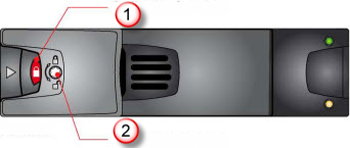
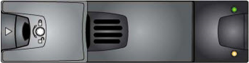
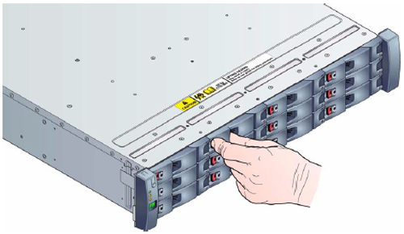
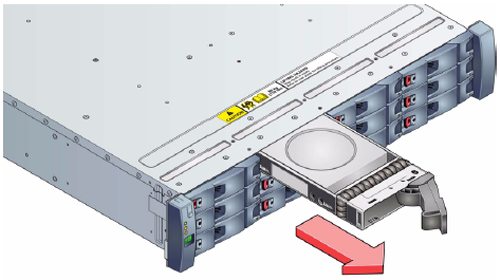
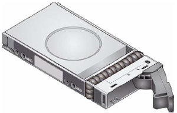
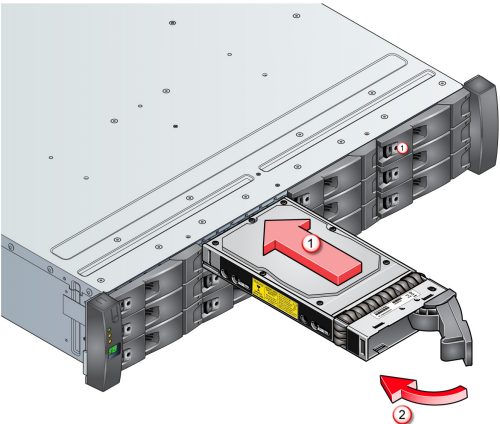

<properties 
   pageTitle="Ersetzen einer Festplattenlaufwerk auf einem Gerät StorSimple | Microsoft Azure"
   description="Erläutert, wie Sie ein Laufwerk auf einer primären StorSimple-Einheit oder eine Anlage EBOD ersetzen."
   services="storsimple"
   documentationCenter=""
   authors="alkohli"
   manager="carmonm"
   editor="" />
<tags 
   ms.service="storsimple"
   ms.devlang="NA"
   ms.topic="article"
   ms.tgt_pltfrm="NA"
   ms.workload="TBD"
   ms.date="08/17/2016"
   ms.author="alkohli" />

# Ersetzen einer Festplattenlaufwerk auf Ihrem Gerät StorSimple

## (Übersicht)

In diesem Lernprogramm wird erläutert, wie Sie entfernen und eine fehlerhafte oder Fehler beim Festplattenlaufwerk auf einem Gerät Microsoft Azure StorSimple ersetzen können. Wenn ein Laufwerk ersetzen möchten, müssen Sie:

- Zu den antitamper Sperren trennen

- Entfernen von dem Festplattenlaufwerk

- Installieren Sie das Ersatz-Festplattenlaufwerk

>[AZURE.IMPORTANT] Überprüfen Sie vor dem Entfernen und Austauschen einer Festplatte, die Sicherheitsinformationen in den [Austausch von StorSimple Hardware Komponenten](storsimple-hardware-component-replacement.md).

## Zu den antitamper Sperren trennen

Dieses Verfahren wird erläutert, wie die antitamper Sperren auf Ihrem Gerät StorSimple werden nicht nachlässt oder geöffnet wird, wenn Sie die Laufwerke ersetzen können. Die antitamper Sperren werden in der Laufwerk Carrier Ziehpunkte gemäß, und sie über eine kleine Blende im Abschnitt Sperre, der den Ziehpunkt zugegriffen werden. Laufwerke sind Sperren setzen auf die gesperrte Position Lieferumfang.

#### Um die antitamper Sperre aufheben der Sperre

1. Fügen Sie sorgfältig die Taste (ein "nicht manipulierbares" T10 Schraubendreher die Microsoft genannt) ein, in der Blende in den Ziehpunkt und in den Anschluss. 

    >[AZURE.NOTE] Wenn die Sperre antitamper aktiviert ist, wird das rote Symbol in der Blende angezeigt.

    

    **Abbildung 1** Anti-vor unbefugtem Zugriff sperren nicht nachlässt

  	|Beschriftung|Beschreibung|
  	|:----|:----------|
  	|1|Indikator für Blende|
  	|2|Antitamper Sperren|

2. Drehen Sie die Taste entgegen dem Uhrzeigersinn, bis das rote Symbol nicht in der Blende über die Taste angezeigt wird.

3. Entfernen Sie die Taste.

    

    **Abbildung 2** Nicht gesperrte Festplattenlaufwerk

4. Das Laufwerk kann jetzt entfernt werden.

Führen Sie die Schritte in umgekehrter Reihenfolge, um die Sperre populärer aus.

## Entfernen von dem Festplattenlaufwerk

Ihr Gerät StorSimple unterstützt, eine RAID-10-ähnliche Speicher Leerzeichen Konfiguration. Dies bedeutet, dass es mit einer ausgefallenen Laufwerks State Drive (SSD), normal arbeiten kann, oder Festplatte Laufwerk (Festplatte). 

>[AZURE.IMPORTANT]
>
>- Wenn das System über mehr als eine fehlerhafte Festplatte verfügt, entfernen Sie nicht mehr als eine SSD oder Festplatte aus dem System zu einem beliebigen Zeitpunkt Zeitpunkt. Auf diese Weise kann Datenverlust führen.
>
>- Stellen Sie sicher, dass Sie als Ersatz SSD ein Slot versehen, die zuvor eine SSD enthalten. Setzen Sie auf ähnliche Weise Ersatz Festplatte in ein Slot, der zuvor auf einem Festplattenlaufwerk enthalten.
>
>- Im Portal Azure klassischen Steckplätze von 0 – nummeriert sind 11. Daher, wenn im Portal zeigt, dass ein Datenträger im Slot 2, auf dem Gerät fehlgeschlagen ist, suchen Sie nach der fehlerhaften Festplatte im dritten Slot von oben links.

Laufwerke können entfernt und ersetzt, während das System arbeitet werden.

#### So entfernen Sie ein Laufwerk

1. Wechseln Sie zum Identifizieren des ausgefallenen Laufwerks im Portal Azure klassischen **Geräte** > **Wartung** > **Hardware Status**. Da Sie ein Datenträger ein Fehler auftreten, kann in der primären Einheit und/oder eine Anlage EBOD (Wenn Sie ein Modell 8600 verwenden), prüfen Sie den Status der Datenträger unter **Freigegebene Komponenten** und unter **EBOD Einheit freigegebenen Komponenten**. Eine fehlerhafte Festplatte im entweder Einheit wird mit einer roten Status angezeigt.

2. Suchen Sie nach der Laufwerke an der Vorderseite der primären Einheit oder die Anlage EBOD. 

3. Wenn der Datenträger aufgehoben wird, fahren Sie mit dem nächsten Schritt fort. Wenn der Datenträger gesperrt ist, nach dem Verfahren aus [Disengage die antitamper Sperre](#disengage-the-antitamper-lock)frei.

4. Drücken Sie die Sperre Schwarz auf das Laufwerk Carrier Modul und ziehen Sie Laufwerk Carrier heraus aus der Vorderseite der. 

    

    **Abbildung 3** Das Laufwerk Handle freigeben

5. Wenn das Laufwerk Carrier Handle vollständig erweitert wird, ziehen Sie das Laufwerk Carrier aus dem Rahmen aus. 

    
    
    **Abbildung 4** Schieben das Laufwerk aus der carrier

## Installieren Sie das Ersatz-Festplattenlaufwerk

Nachdem ein Laufwerk in Ihrem Gerät StorSimple ausgefallen ist und Sie entfernt haben, führen Sie dieses Verfahren, um es durch ein neues Laufwerk ersetzen.

#### So fügen Sie ein Laufwerk ein

1. Stellen Sie sicher, dass das Laufwerk Carrier Handle vollständig erweitert wird, wie in der folgenden Abbildung gezeigt.

    

    **Abbildung 5** Laufwerk mit erweiterten Ziehpunkt

2. Schieben Sie das Laufwerk Carrier ganz in den Rahmen aus. 

    

    **Abbildung 6**  Schieben das Laufwerk Carrier in den Rahmen

3. Schließen Sie mit der Laufwerk-Carrier eingefügt wird das Laufwerk Carrier Handle Verschiebe drücken Sie das Laufwerk Carrier in den Rahmen, bis das Laufwerk Carrier Handle in eine gesperrte Position andockt.

4. Verwenden Sie die Taste, die von Microsoft (nicht manipulierbares Torx Schraubendreher) auf den Ziehpunkt Carrier secure bereitgestellt wurde an durch Umwandlung in die Schrauben Sperren eine Vierteldrehung im Uhrzeigersinn.

5. Stellen Sie sicher, dass die Ersetzung erfolgreich war, und das Laufwerk funktionsfähig ist, indem Sie den Zugriff auf die klassische Azure-Portal, und navigieren zur **Wartung** > **Hardware Status**. Klicken Sie unter **Freigegeben** oder **EBOD Einheit freigegebene Komponenten**sollten der Laufwerkstatus Grün, gibt an, dass sie fehlerfrei ist.

    >[AZURE.NOTE] Es kann einige Stunden für den Datenträgerstatus nach der Ersetzung grünen aktivieren dauern.

## Nächste Schritte

Weitere Informationen zu den [Austausch von StorSimple Hardware Komponenten](storsimple-hardware-component-replacement.md).
