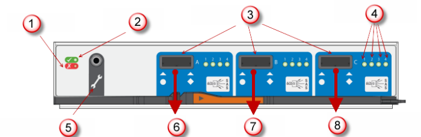
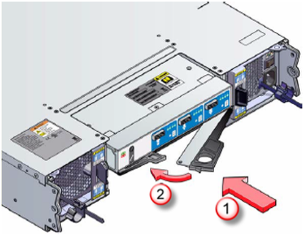
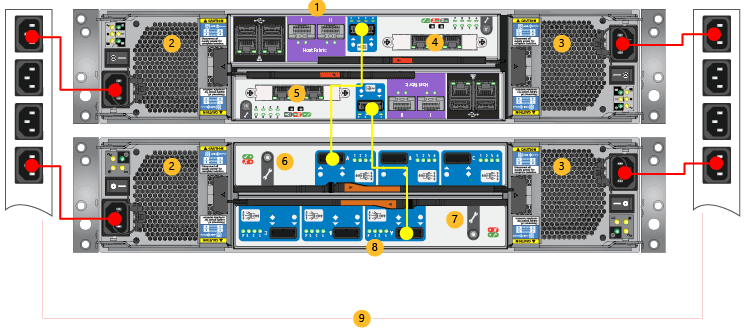

<properties 
   pageTitle="Ersetzen einen Controller StorSimple EBOD | Microsoft Azure"
   description="Erläutert, wie Sie entfernen und einen oder beide EBOD-Controller auf einem Gerät StorSimple 8600 ersetzen."
   services="storsimple"
   documentationCenter=""
   authors="alkohli"
   manager="carmonm"
   editor="" />
<tags 
   ms.service="storsimple"
   ms.devlang="NA"
   ms.topic="article"
   ms.tgt_pltfrm="NA"
   ms.workload="TBD"
   ms.date="08/17/2016"
   ms.author="alkohli" />

# Ersetzen eines EBOD Controllers auf Ihrem Gerät StorSimple

## (Übersicht)

In diesem Lernprogramm wird erläutert, wie eine fehlerhafte EBOD Controller-Modul auf Ihrem Gerät Microsoft Azure StorSimple ersetzen. Wenn eine EBOD Controller-Modul ersetzen möchten, müssen Sie:

- Entfernen Sie den fehlerhaften EBOD controller
- Installieren Sie einen neuen EBOD controller

Beachten Sie die folgenden Informationen ein, bevor Sie beginnen:

- Leere EBOD Module müssen in allen nicht verwendete Steckplätzen eingefügt werden. Die Anlage wird nicht ordnungsgemäß kühlt, wenn ein Slot geöffnet bleibt.

- Der EBOD Controller ist austauschbare und entfernt oder ersetzt werden kann. Entfernen Sie ein Fehler beim Modul nicht, bis Sie kein Ersatz haben. Wenn Sie die Ersetzung beginnen, müssen Sie innerhalb von 10 Minuten abgeschlossen haben.

>[AZURE.IMPORTANT] Stellen Sie bevor Sie versuchen, entfernen oder eine beliebige StorSimple Komponente ersetzen sicher, dass Sie die [Sicherheit Symbol Konventionen](storsimple-safety.md#safety-icon-conventions) und andere [Sicherheitsmaßnahmen](storsimple-safety.md)zu überprüfen.

## Entfernen eines EBOD Controllers

Vor dem Ersetzen des fehlerhaften EBOD Controller-Moduls in Ihrem Gerät StorSimple, stellen Sie sicher, dass das anderen EBOD Controller-Modul aktiv ist und ausgeführt wird. Das folgende Verfahren sowie die Tabelle erläutert, wie Sie das EBOD Controller-Modul zu entfernen.

#### So entfernen Sie ein Modul EBOD

1. Öffnen Sie das Azure klassische-Portal an.

2. Navigieren Sie zu **Geräte** > **Wartung** > **Hardware Status**, und stellen Sie sicher, dass der Status der LED für das aktive EBOD Controller-Modul grün ist und die LED für das fehlerhafte EBOD Controller Modul Rot ist.

3. Suchen Sie das fehlerhafte EBOD Controller-Modul an das Ende des Geräts ein.

4. Entfernen Sie die Kabel, die das EBOD Controller-Modul mit dem Controller zu verbinden, bevor Sie das Modul EBOD aus dem System.

5. Notieren Sie den genauen SAS-Anschluss des Moduls Controller EBOD, die mit dem Controller verbunden wurde. Sie müssen diese Konfiguration des Systems wiederherstellen, nachdem Sie das Modul EBOD ersetzen. 

    >[AZURE.NOTE] In der Regel werden diese Anschluss A, die als **Host in** das folgende Diagramm angezeigt wird.

    

     **Abbildung 1** Rückseite EBOD-Modul

  	|Beschriftung|Beschreibung|
  	|:----|:----------|
  	|1|Fehler-LED|
  	|2|LED-Anzeige|
  	|3|SAS-Verbinder|
  	|4|SAS LED-Anzeigen|
  	|5|Serielle Ports für nur Factory verwenden|
  	|6|Port (Host in)|
  	|7|Port B (Host ab)|
  	|8|Port C (nur Factory verwenden)|

## Installieren Sie einen neuen EBOD controller

Das folgende Verfahren sowie die Tabelle erläutert, wie eine EBOD Controller-Modul in Ihrem Gerät StorSimple zu installieren.

#### So installieren Sie einen Controller EBOD

1. Aktivieren Sie das Gerät EBOD Schäden, insbesondere der Benutzeroberfläche Verbinder. Installieren Sie den neuen EBOD Controller nicht, wenn Stifte gebogen werden.

2. Schieben Sie mit der Schlösser in der geöffneten Position das Modul in die Anlage, bis die Schlösser populärer.

    

    **Abbildung 2**  EBOD Controller-Modul installieren

3. Schließen Sie die Sperre an. Hören Sie eine klicken Sie auf als die Sperre aktiviert wird.

    

    **Abbildung 3**  Schließen die Sperre EBOD Modul

4. Schließen Sie das Kabel wieder. Verwenden Sie die genaue Konfiguration, die vor der Ersatz vorhanden ist. Finden Sie unter den folgenden Diagramm und die Tabelle Weitere Informationen dazu, wie Sie die Kabel verbinden.

    

    **Abbildung 4**. Erneutes Anschließen der Kabel

  	|Beschriftung|Beschreibung|
  	|:----|:----------|
  	|1|Primäre Einheit|
  	|2|PCM 0|
  	|3|PCM 1|
  	|4|Controller 0|
  	|5|Controller 1|
  	|6|EBOD Controller 0|
  	|7|EBOD Controller 1|
  	|8|EBOD Einheit|
  	|9|Power Verteilung Einheiten|

## Nächste Schritte

Weitere Informationen zu den [Austausch von StorSimple Hardware Komponenten](storsimple-hardware-component-replacement.md).
