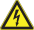
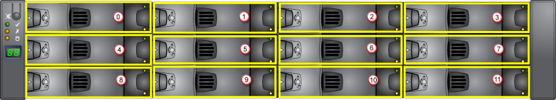
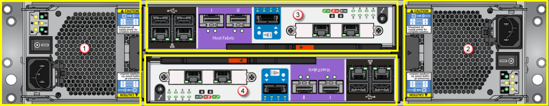
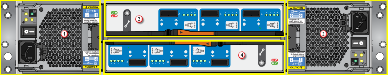

<properties 
   pageTitle="Austausch von StorSimple Hardware Komponenten | Microsoft Azure"
   description="Beschreibt, wie sicher der PCMs Akku, Controller Module, EBOD Controller, Laufwerke und Gehäuse eines Geräts StorSimple ersetzen."
   services="storsimple"
   documentationCenter=""
   authors="alkohli"
   manager="carmonm"
   editor="" />
<tags 
   ms.service="storsimple"
   ms.devlang="NA"
   ms.topic="article"
   ms.tgt_pltfrm="NA"
   ms.workload="TBD"
   ms.date="10/11/2016"
   ms.author="alkohli" />

# Austausch von StorSimple Hardware-Komponenten

## (Übersicht)

Die Lernprogramme Hardware Komponente Ersatz beschreiben die Hardware-Komponenten von Ihrem Microsoft Azure StorSimple 8000 Reihe Gerät und die erforderlichen Schritte zum Entfernen und Ersetzen Sie sie. In diesem Artikel werden die Sicherheitssymbole, enthält Zeiger, damit die ausführliche Lernprogramme und listet die austauschbare-Komponenten.

>[AZURE.IMPORTANT] Stellen Sie bevor Sie versuchen, entfernen oder eine beliebige StorSimple Komponente ersetzen sicher, dass Sie die [Sicherheit Symbol Konventionen](#safety-icon-conventions) und andere [Sicherheitsmaßnahmen](storsimple-safety.md)zu überprüfen.
 
### Sicherheit Symbol Konventionen

Die folgende Tabelle beschreibt die Sicherheitssymbole in diesen Lernprogrammen verwendet werden. Achten Sie auf diese Sicherheitssymbole beim Durcharbeiten durch die Schritte zum Entfernen und Ersetzen von Gerätekomponenten.

| Symbol | Text | Weitere Informationen |
|:---- |:---- |:-----------|
|| **GEFAHR!** | Zeigt an, gefährliche Situationen, in denen, wenn nicht vermieden, Tod oder schwere Verletzung führt. Dieses Signal Wort befindet sich auf den extremsten Situationen beschränkt.|
|| **WARNUNG!** | Zeigt an, gefährliche Situationen, in denen, wenn Sie nicht vermieden, Tod oder schwere Verletzung führen kann.|
|| **VORSICHT!** |Gibt an, die bei nicht vermieden, kleinere oder mittlere zur Verletzung führen kann gefährliche Situation.|
|| **HINWEIS:** | Zeigt Informationen als wichtig, aber nicht Risikofaktor-bezogene an.|
| | **Plan für Elektrik Elektroschock** | Gibt Hochspannung an.|
|| **Beanspruchen Stärke**| |
|| **Diagrammteile Benutzer gewartet werden können** | Sofern nicht ordnungsgemäß gelernt nicht zugegriffen Sie werden.|
||**Lesen Sie zuerst alle Anweisungen**| |
||**Tipp Risikofaktor**| |

### Vorbemerkung

Vertrautmachen Sie mit der Sicherheitsinformationen zu Ihrem Gerät und Sicherheit Symbole, die in diesem Lernprogramm verwendet. Wechseln Sie zu [Sicheres Installieren und betreiben von Ihrem Gerät StorSimple](storsimple-safety.md) vollständige Informationen aus. Achten Sie darauf, dass die [Sicherheit Vorsichtsmaßnahmen](storsimple-safety.md#handling-precautions) überprüfen, bevor Sie Ihr Gerät StorSimple behandeln. 

Bevor Sie versuchen, eine Komponente ersetzen, beachten Sie die folgenden Informationen ein.

  **Warnung!** 

- Erden Sie sich ordnungsgemäß, mithilfe einer elektrostatische Erledigung oder antistatischen Passepartout beim Module und Komponenten von Ihrem Gerät StorSimple behandeln.

- Berühren Sie keine Schaltkreise. Verwenden Sie die bereitgestellten Ziehpunkte und Führungslinien, während der Bearbeitung von Komponenten, die Schaltkreise verfügbar gemacht haben, können.

  **Hinweis:**

Wenn Sie ein Modul, **lassen Sie eine leere Laufwerk auf der Rückseite der Einheit niemals**ersetzen. Erhalten Sie eine Ersatz oder ein leeres Modul, bevor das Problem Webpart entfernen.

## Verfahren für den Austausch Hardware-Komponente

Mehrere Plug-in-Module in die primäre und/oder EBOD Anlagen besteht Ihr Gerät StorSimple 8000 der Serie aus. 8100 weist eine einzelne primäre Einheit, während der 8600 ein Gerät mit zwei Einheit mit einer primären Einheit und eine Anlage EBOD ist.

In den folgenden Tabellen werden im Hauptfenster Hardware-Komponenten auf Ihrem Gerät zusammengefasst. Klicken Sie auf den Link in der Spalte **Verfahren für den Austausch** , um zum zugeordneten Lernprogramm zu wechseln.

|Komponenten|# Präsentieren|Plug-in-Modul?|Verfahren für den Austausch
|:---------|:--------|:--------------|:---------------------|
| Gehäuse|1|Nein|[Ersetzen des Gehäuses auf Ihrem Gerät StorSimple](storsimple-chassis-replacement.md) |
|Primärer Controller|2|Ja| [Ersetzen einer Controller-Modul auf Ihrem Gerät StorSimple](storsimple-controller-replacement.md) |
|764W Power und Kühlmodule (PCMs)|2|Ja| [Ersetzen Sie einen Power und das Modul auf Ihrem Gerät StorSimple](storsimple-power-cooling-module-replacement.md) |
|Sicherungsbatterie|2|Ja| [Ersetzen Sie das Modul Stützbatterie auf Ihrem Gerät StorSimple](storsimple-battery-replacement.md) |
|Laufwerke|12|Ja| [Ersetzen einer Festplattenlaufwerk auf Ihrem Gerät StorSimple](storsimple-disk-drive-replacement.md) |

**Tabelle 1** Hardware-Komponenten in der primären Einheit

Die primäre Einheit und die Einheit EBOD unterscheiden sich in ihren e/a-Modulen. Darüber hinaus haben die PCMs anderen Stromverbrauch. Die PCMs in der primären Einheit sind 764 W, aus, während die in der Einheit EBOD 580 sind W. Die PCMs in der primären Einheit enthalten auch ein Stützbatterie Modul.

|Komponenten|# Präsentieren|Plug-in-Modul?| Verfahren für den Austausch
|:---------|:--------|:--------------|:---------------------|
|Gehäuse|1|Nein| [Ersetzen des Gehäuses auf Ihrem Gerät StorSimple](storsimple-chassis-replacement.md) |
|EBOD Controller|2|Ja| [Ersetzen eines EBOD Controllers auf Ihrem Gerät StorSimple](storsimple-ebod-controller-replacement.md) |
|580 w bei Power und Kühlmodule (PCMs)|2|Ja| [Ersetzen Sie einen Power und das Modul auf Ihrem Gerät StorSimple](storsimple-power-cooling-module-replacement.md) |
|Laufwerke|12|Ja| [Ersetzen einer Festplattenlaufwerk auf Ihrem Gerät StorSimple](storsimple-disk-drive-replacement.md) |

**Tabelle 2** Hardware-Komponenten auf die Anlage EBOD

Die Plug-in-Module auf dem Gerät werden in der folgenden Vorder- und Rückseite Diagramme hervorgehoben. Diese Diagramme können Sie um den Speicherort der verschiedenen-Plug-in Module zu ermitteln, ob ein Ersatz erforderlich ist. Vorder-Diagramm zeigt die Laufwerke und der Rückseite Diagramme EBOD Einheit und die primäre Einheit anzeigen die Plug-in-Module.

**Abbildung 1** Den Vordergrund des Geräts

|Beschriftung|Beschreibung|
|:----|:----------|
|0 - 11|Laufwerke (insgesamt 12)|

Müssen sowohl die primäre Einheit und die Einheit EBOD Laufwerk Carrier Module. Die Rahmen-Website beinhaltet zwölf 3,5" Laufwerke in einem Format 3 x 4 angeordnet.

**Abbildung 2** Rückseite der primären Einheit

|Beschriftung|Beschreibung|
|:----|:----------|
|1|PCM 0|
|2|PCM 1|
|3|Controller 0|
|4|Controller 1|

**Abbildung 3** Rückseite der Einheit EBOD

|Beschriftung|Beschreibung|
|:----|:----------|
|1|PCM 0|
|2|PCM 1|
|3|EBOD Controller 0|
|4|EBOD Controller 1|

## Ort austauschbare

Die folgende Feld austauschbare Einheiten (FRUs) sind für Ihr Gerät StorSimple verfügbar:

- Gehäuse (einschließlich der integrierten Vorgänge Systemsteuerung)

- 764 W IK PCM

- 580 W IK PCM

- Festplatte mit Laufwerk Carrier-Modul

- Controller-Modul

- EBOD Controller-Modul

- Sicherungsbatterie-Modul

- Rail-Montageset

Nehmen Sie [an den Microsoft-Support](storsimple-contact-microsoft-support.md) , um eine der folgenden Ersatzeinheiten bestellen.

## Nächste Schritte

Überprüfen Sie alle [Sicherheitsinformationen](storsimple-safety.md) , bevor Sie versuchen, eine StorSimple Hardware-Komponente zu ersetzen.
