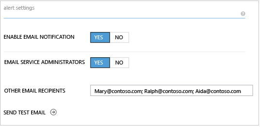

<properties 
   pageTitle="Anzeigen und Verwalten von Benachrichtigungen StorSimple | Microsoft Azure"
   description="Beschreibt StorSimple benachrichtigen Bedingungen und schwere, -Benachrichtigung konfigurieren und so den StorSimple Manager-Dienst verwenden, um Benachrichtigungen verwalten."
   services="storsimple"
   documentationCenter="NA"
   authors="SharS"
   manager="carmonm"
   editor="" />
<tags 
   ms.service="storsimple"
   ms.devlang="NA"
   ms.topic="article"
   ms.tgt_pltfrm="NA"
   ms.workload="NA"
   ms.date="10/18/2016"
   ms.author="anbacker" />

# Verwenden Sie zum Anzeigen und Verwalten von Benachrichtigungen StorSimple des StorSimple Manager-Diensts

## (Übersicht)

Die Registerkarte **Benachrichtigungen** in der StorSimple Manager-Dienst bietet eine Möglichkeit zum Überprüfen und StorSimple Gerät – Zusammenhang Benachrichtigungen in Echtzeit Abständen deaktivieren. Auf dieser Registerkarte können Sie die Integrität Probleme Ihrer StorSimple Geräte und der gesamten Microsoft Azure StorSimple Lösung zentral überwachen.

In diesem Lernprogramm werden allgemeine Bedingungen, die Benachrichtigung, Warnungsschweregrade und so konfigurieren Sie die Benachrichtigung. Darüber hinaus schließt ihn Kurzreferenz alert Tabellen, die können Sie schnell eine bestimmte Warnung suchen und entsprechend darauf zu reagieren.

## Allgemeine Bedingungen, die Benachrichtigung

Ihr Gerät StorSimple generiert Benachrichtigungen als Antwort auf eine Vielzahl von Bedingungen. Es folgen die am häufigsten verwendeten Typen von Zustand eintritt:

- **Hardwareprobleme** – diese Benachrichtigungen informieren Sie über die Integrität des Hardware. Optionale Abschnitte bieten Sie darüber informiert, wenn Firmwareupdates erforderlich sind, wenn Probleme über eine Netzwerkschnittstelle verfügt, oder es liegt ein Problem mit eines Ihrer Datenlaufwerke.

- **Probleme mit der Konnektivität** – diese Benachrichtigungen auftreten, wenn Probleme beim Datenübertragung vorhanden ist. Kommunikationsprobleme können während der Übertragung von Daten zu und aus dem Azure-Speicher-Konto oder aufgrund der Verbindung zwischen den Geräten und der StorSimple Manager-Dienst auftreten. Kommunikationsprobleme sind einige der am schwersten zu beheben, da es so viele Punkte des Fehlers gibt. Sie sollten immer zuerst stellen Sie sicher, dass Netzwerkkonnektivität und den Zugriff auf das Internet verfügbar sind, bevor Sie mit erweiterte Problembehandlung fortfahren. Hilfe bei der Problembehandlung finden Sie unter [Behandeln von Problemen mit dem Cmdlet Verbindung testen](storsimple-troubleshoot-deployment.md).

- **Leistungsprobleme** – diese Benachrichtigungen tritt auf, wenn es sich bei Ihrem System optimal, wie z. B., wenn es sich bei hoher Auslastung ist Durchführung nicht zur Verfügung.

Darüber hinaus möglicherweise Warnungen zu Sicherheit, Updates oder Auftrag Fehlern angezeigt.

## Benachrichtigen schwere Ebenen

Benachrichtigungen haben andere schwere Ebenen, je nach den Einfluss, die die Benachrichtigung Situation und die Notwendigkeit der eine Antwort auf die Benachrichtigung. Die schwere Ebenen sind:

- **Kritisch** – diese Warnung wird als Antwort auf eine Bedingung, die die erfolgreiche Leistung von Ihrem System auswirkt. Aktion ist erforderlich, um sicherzustellen, dass die StorSimple Dienst nicht unterbrochen wird.

- **Warnung** – diese Bedingung könnte kritisch, falls nicht aufgelöst werden. Ermitteln die Situation, und keine Aktion erforderlich, um das Problem zu deaktivieren.

- **Informationen** – diese Warnung enthält Informationen, die in die Überwachung und Verwaltung des Systems hilfreich sein kann.

## Konfigurieren von Benachrichtigungseinstellungen

Sie können auswählen, ob Sie per e-Mail benachrichtigen Bedingungen für jede Ihrer StorSimple Geräte benachrichtigt werden möchten. Darüber hinaus können Sie andere Empfänger Benachrichtigung identifizieren, durch Eingabe ihrer e-Mail-Adressen im Feld **andere e-Mail-Empfänger** , durch Semikolons getrennt.

>[AZURE.NOTE] Sie können bis zu 20 e-Mail-Adressen pro Gerät eingeben.

Nachdem Sie die e-Mail-Benachrichtigung für ein Gerät aktivieren, erhalten Mitglieder der Benachrichtigungsliste eine e-Mail-Nachricht, die jedes Mal eine Warnung vom Typ kritische eintritt. Die Nachrichten werden gesendet aus *storsimple-alerts-noreply@mail.windowsazure.com* und beschreiben die Bedingung benachrichtigen. Empfänger können **Abo kündigen** , um sich selbst aus der Liste der e-Mail-Benachrichtigung entfernen klicken.

#### So aktivieren Sie die e-Mail-Benachrichtigung von Benachrichtigungen für ein Gerät

1. Wechseln Sie zu **Geräte** > **Konfigurieren** für das Gerät.

2. Klicken Sie unter **Benachrichtigungseinstellungen**legen Sie Folgendes ein:

    1. Wählen Sie im Feld **senden e-Mail-Benachrichtigung** **Ja**ein.

    2. Wählen Sie für das Feld **e-Mail-Dienstadministratoren** **Ja** aus, wenn Dienstadministrator werden soll, und alle CO-Administratoren lassen Sie die Benachrichtigung.

    3. Geben Sie im Feld **andere e-Mail-Empfänger** die e-Mail-Adressen aller Empfänger, die die Benachrichtigung erhalten sollen. Geben Sie die Namen in das Format *someone@somewhere.com*. Verwenden Sie Semikolons trennen Sie die e-Mail-Adressen ein. Sie können bis zu 20 e-Mail-Adressen pro Gerät konfigurieren. 

        

3. Um eine Test-e-Mail-Benachrichtigung zu senden, klicken Sie auf das Pfeilsymbol neben **Test-e-Mail senden**. Der StorSimple Manager-Dienst werden Statusnachrichten angezeigt, wie sie die Benachrichtigung Test weiterleitet. 

4. Wenn die folgende Meldung angezeigt wird, klicken Sie auf **OK**. 

    

    >[AZURE.NOTE] Wenn die Test-Benachrichtigung gesendet werden kann, wird der StorSimple Manager-Dienst eine entsprechende Meldung angezeigt. Klicken Sie auf **OK**, warten Sie einige Minuten, und versuchen Sie, Ihre Test-Benachrichtigung erneut zu senden. 

## Anzeigen und Nachverfolgen von Benachrichtigungen

Das Manager StorSimple Dienst Dashboard bietet Ihnen einen schnellen Blick auf die Anzahl der Benachrichtigungen auf Ihren Geräten, um schwere Ebene angeordnet.

Auf der Ebene schwere öffnet die Registerkarte **Benachrichtigungen** . Die Ergebnisse enthalten nur die Benachrichtigungen, die Bestandteil einer schwere entsprechen.

Durch Klicken auf eine Benachrichtigung in der Liste bietet Ihnen weitere Details für die Benachrichtigung, das letzte Mal die Benachrichtigung gemeldet wurde, einschließlich der Anzahl von Vorkommen der Warnung klicken Sie auf das Gerät, und die empfohlene Aktion die Warnung zu beheben. Wenn es sich um eine Benachrichtigung Hardware ist, wird auch die Hardware-Komponente erkannt.

Wenn Sie die Informationen an Microsoft Support senden müssen, können Sie die Details der Warnung in eine Textdatei kopieren. Nachdem Sie gefolgt empfohlen und die Benachrichtigung Bedingung lokalen gelöst haben, sollten Sie die Benachrichtigung vom Gerät deaktivieren, indem Sie die Benachrichtigung in die Registerkarte **Benachrichtigungen** , und klicken Sie auf **Löschen**. Um eine große Anzahl Benachrichtigungen aufzuheben, wählen Sie jede Warnung aus, klicken Sie auf eine beliebige Spalte außer der Spalte **Benachrichtigung** , und klicken Sie dann auf **Löschen** , nachdem Sie alle Benachrichtigungen zu entfernende ausgewählt haben. Beachten Sie, dass einige Benachrichtigungen automatisch gelöscht werden, wenn das Problem dadurch gelöst wird oder wenn Sie die Benachrichtigung mit neuen Informationen aktualisiert.

Wenn Sie auf **Löschen**klicken, haben Sie die Möglichkeit, geben Sie Kommentare zu der Benachrichtigung und Schritte, die Sie erstellen, um das Problem zu beheben. Einige Ereignisse werden vom System deaktiviert werden, wenn ein anderes Ereignis, mit neuen Informationen ausgelöst wird. In diesem Fall wird die folgende Meldung angezeigt.

## Sortieren und Überprüfen von Benachrichtigungen

Möglicherweise erachten es effizienter zum Ausführen von Berichten auf Benachrichtigungen, damit Sie überprüfen können, und sie in Gruppen deaktivieren. Darüber hinaus kann die Registerkarte **Benachrichtigungen** bis zu 250 Benachrichtigungen anzeigen. Wenn Sie die Anzahl von Warnungen überschritten haben, werden nicht alle Benachrichtigungen in der Standardansicht angezeigt. Sie können die folgenden Felder aus, um anzupassen, welche Warnungen angezeigt werden, kombinieren:

- **Status** – Sie können entweder **aktiv** oder **nicht aktiviert** Benachrichtigungen anzeigen. Aktive Benachrichtigungen werden immer noch auf Ihrem System ausgelöst wird, während gelöschte Benachrichtigungen entweder manuell von einem Administrator deaktiviert oder programmgesteuert deaktiviert werden, da das System die Benachrichtigung Bedingung mit neuen Informationen aktualisiert wurden.

- **Schwere** – Sie können alle schwere Ebenen (kritisch, Warnung, Informationen) oder nur eine bestimmte schwere, beispielsweise nur kritische Benachrichtigungen Benachrichtigungen anzeigen.

- **Quelle** – Sie können aus allen Quellen Benachrichtigung anzeigen, oder beschränken Sie die Benachrichtigungen aus dem Dienst oder eine oder alle Geräte stammen.

- **Zeitraums** – können durch angeben **von** und **bis** Datums- und Zeitstempel, Sie Benachrichtigungen während des Zeitraums betrachten, denen Sie interessiert sind.

## Kurzübersicht für Benachrichtigungen

Den folgenden Tabellen sind einige der Microsoft Azure StorSimple Warnungen, die, sowie zusätzliche Informationen und Vorschläge sofern verfügbar auftreten können. StorSimple Gerät Benachrichtigungen fallen in eine der folgenden Kategorien:

- [Cloud Connectivity-Benachrichtigungen](#cloud-connectivity-alerts)

- [Cluster Benachrichtigungen](#cluster-alerts)

- [Disaster Wiederherstellung Benachrichtigungen](#disaster-recovery-alerts)

- [Hardware-Benachrichtigungen](#hardware-alerts)

- [Position Fehler Benachrichtigungen](#job-failure-alerts)

- [Lokal angeheftete Lautstärke Benachrichtigungen](#locally-pinned-volume-alerts)

- [Netzwerke Benachrichtigungen](#networking-alerts)

- [Leistung Benachrichtigungen](#performance-alerts)

- [Von Sicherheitshinweisen](#security-alerts)

- [Support-Paket Benachrichtigungen](#support-package-alerts)

- [Aktualisieren von Benachrichtigungen](#update-alerts)

### Cloud Connectivity-Benachrichtigungen

|Benachrichtigung text|Ereignis|Weitere Informationen / empfohlene Aktionen|
|:---|:---|:---|
|Verbindung zu <*Cloud Anmeldeinformationen Name*> kann nicht eingerichtet werden.|Kann keine Verbindung mit dem Speicherkonto herstellen.|Es sieht so aus, wie es möglicherweise ein Verbindungsproblem mit Ihrem Gerät. Führen Sie die `Test-HcsmConnection` Cmdlet aus der Windows PowerShell-Benutzeroberfläche für StorSimple auf Ihrem Gerät zu erkennen und das Problem zu beheben. Wenn die Einstellungen korrekt sind, das Problem mit den Anmeldeinformationen des Speicherkontos möglicherweise für das die Warnung ausgelöst wurde. In diesem Fall verwendet die `Test-HcsStorageAccountCredential` Cmdlet, um festzustellen, ob es liegen Probleme, die Sie auflösen können.<ul><li>Überprüfen Sie Ihre Netzwerkeinstellungen ein.</li><li>Überprüfen Sie Ihre Anmeldeinformationen ein Speicher-Konto an.</li></ul>|
|Wir haben ein Heartbeat nicht auf Ihrem Gerät für den letzten <*Anzahl*> Minuten erhalten.|Gerät herstellen nicht.|Es sieht so aus, wie es ein Verbindungsproblem mit Ihrem Gerät ist. Verwenden Sie die `Test-HcsmConnection` Cmdlet aus der Windows PowerShell-Benutzeroberfläche für StorSimple auf Ihrem Gerät zu identifizieren und beheben Sie das Problem, oder wenden Sie sich an Ihren Netzwerkadministrator.|

### StorSimple Verhalten beim Cloud-Konnektivität schlägt fehl

Was geschieht bei schlägt fehl, Cloud-Konnektivität für mein StorSimple Gerät Herstellung ausgeführt?

Wenn auf Ihrem Gerät des StorSimple Herstellung Cloud-Konnektivität schlägt fehl, kann je nach Status des Geräts, vor auftreten: 

- **Für die lokalen Daten auf Ihrem Gerät**: für einen bestimmten Zeitraum werden keine Unterbrechung und liest weiterhin bereitgestellt werden. Wie die Anzahl der ausstehenden IOs erhöht und maximal überschreitet, konnte jedoch die liest starten, fehlschlägt. 

    Abhängig von der Menge der Daten auf Ihrem Gerät werden die schreibt auch weiterhin für die ersten Stunden nach der Unterbrechung in die Cloud-Konnektivität auftreten. Die schreibt werden dann verlangsamen und schließlich fehlschlägt, wenn die Cloud-Konnektivität für mehrere Stunden unterbrochen ist beginnen. (Es ist temporären Speicherplatz auf dem Gerät für die Daten, die in der Cloud abgelegt werden. In diesem Bereich wird geleert, wenn die Daten gesendet werden. Wenn Connectivity fehlschlägt, Daten in dieser Speicherbereich werden nicht in die Cloud verschoben, und EA schlägt fehl.)   

 
- **Für die Daten in der Cloud**: die meisten Cloud Connectivity-Fehler, wird ein Fehler zurückgegeben. Sobald die Konnektivität wiederhergestellt wird, sind die IOs ohne dass der Benutzer, die Lautstärke online schalten fortgesetzt wird. Gelegentlich möglicherweise Eingriff erforderlich, um die Lautstärke online wieder vom klassischen Azure-Portal zu gelangen. 
 
- **Für Cloud Momentaufnahmen wird ausgeführt**: der Vorgang ist ein paar Mal innerhalb von 4 und 5 Stunden wiederholt und die Cloud Momentaufnahmen schlägt fehl, wenn die Verbindung nicht wiederhergestellt werden kann.

### Cluster Benachrichtigungen

|Benachrichtigung text|Ereignis|Weitere Informationen / empfohlene Aktionen|
|:---|:---|:---|
|Gerät hat <*Gerätenamen*> verwendet.|Gerät ist im Wartungsmodus.|Gerät konnte nicht über aufgrund eingeben oder Beenden des Wartungsmodus. Dies ist normal und ist keine Maßnahme erforderlich. Nachdem Sie diese Warnung bestätigt haben, entfernen Sie ihn aus der Benachrichtigungsseite.|
|Gerät hat <*Gerätenamen*> verwendet.|Gerätefirmware oder Software wurde einfach aktualisiert.|Es wurde ein Clusterfailover aufgrund einer Aktualisierung aus. Dies ist normal und ist keine Maßnahme erforderlich. Nachdem Sie diese Warnung bestätigt haben, entfernen Sie ihn aus der Benachrichtigungsseite.|
|Gerät hat <*Gerätenamen*> verwendet.|Controller wurde neu gestartet oder beendet.|Gerät fehlgeschlagen: über der aktive Controller beendet wird oder von einem Administrator neu gestartet wurde. Es ist keine Maßnahme erforderlich. Nachdem Sie diese Warnung bestätigt haben, entfernen Sie ihn aus der Benachrichtigungsseite.|
|Gerät hat <*Gerätenamen*> verwendet.|Geplantes Failover.|Stellen Sie sicher, dass dies ein geplanten Failover wurde. Nachdem Sie die entsprechende Aktion ergriffen haben, deaktivieren Sie diese Benachrichtigung über die Benachrichtigungsseite.|
|Gerät hat <*Gerätenamen*> verwendet.|Ungeplanten Failover.|StorSimple wird erstellt, um nicht geplanten Failover werden automatisch zu beheben. Wenn Sie eine große Anzahl von dieser Benachrichtigungen angezeigt wird, wenden Sie sich an den Microsoft-Support.|
|Gerät hat <*Gerätenamen*> verwendet.|Andere/Unbekannte Ursache.|Wenn Sie eine große Anzahl von dieser Benachrichtigungen angezeigt wird, wenden Sie sich an den Microsoft-Support. Nachdem das Problem gelöst wird, deaktivieren Sie diese Benachrichtigung über die Benachrichtigungsseite.|
|Ein kritischen Geräte-Dienst Berichte Status als fehlerhaft.|DataPath Dienstausfall. |Wenden Sie sich an Microsoft Support, um Unterstützung zu erhalten.|
|Virtuelle IP-Adresse für Netzwerk-Oberfläche <*Daten #*> Status Berichten, als fehlerhaft. |Andere/Unbekannte Ursache. |Manchmal temporäre Bedingungen können dazu führen, dass diese Benachrichtigungen. Wenn dies der Fall ist, wird diese Warnung automatisch nach einiger Zeit gelöscht. Wenn das Problem weiterhin besteht, wenden Sie sich an den Microsoft-Support.|
|Virtuelle IP-Adresse für Netzwerk-Oberfläche <*Daten #*> Status Berichten, als fehlerhaft.|Name der Schnittstelle: <*Daten #*> IP-Adresse <IP address> nicht online geschaltet werden, weil eine doppelte IP-Adresse im Netzwerk erkannt wurde. |Stellen Sie sicher, dass die doppelte IP-Adresse aus dem Netzwerk entfernt wird oder die Benutzeroberfläche mit einer anderen IP-Adresse neu zu konfigurieren.|

### Disaster Wiederherstellung Benachrichtigungen

|Benachrichtigung text|Ereignis|Weitere Informationen / empfohlene Aktionen|
|:---|:---|:---|
|Wiederherstellungsvorgängen konnte nicht alle Einstellungen für diesen Dienst wiederherstellen. Konfiguration von Gerätedaten ist inkonsistent für einige Geräte.|Daten Inkonsistenzen nach der Wiederherstellung erkannt.|Verschlüsselte Daten auf den Dienst ist, auf dem Gerät nicht synchronisiert. Das Gerät <*Gerätenamen*> zu autorisieren vom StorSimple-Manager für die Synchronisierung zu starten. Verwenden der Windows PowerShell-Benutzeroberfläche für StorSimple zum Ausführen der `Restore-HcsmEncryptedServiceData` auf Gerät <*Gerätenamen*> Cmdlet, Bereitstellen von altes Kennwort als Eingabe für dieses Cmdlet das Sicherheitsprofil wiederherstellen. Führen Sie dann die `Invoke-HcsmServiceDataEncryptionKeyChange` Cmdlet Schlüssel der Dienst Daten zu aktualisieren. Nachdem Sie die entsprechende Aktion ergriffen haben, deaktivieren Sie diese Benachrichtigung über die Benachrichtigungsseite.|

### Hardware-Benachrichtigungen

|Benachrichtigung text|Ereignis|Weitere Informationen / empfohlene Aktionen|
|:---|:---|:---|
|Hardware-Komponente <*Komponenten-ID*> Berichte Status als <*Status*>.||Manchmal temporäre Bedingungen können dazu führen, dass diese Benachrichtigungen. Ist dies der Fall ist, wird diese Warnung nach einiger Zeit automatisch gelöscht. Wenn das Problem weiterhin besteht, wenden Sie sich an den Microsoft-Support.|
|Passive Controller fehlerhaft.|Passive (sekundäre) Controller funktioniert nicht.|Ihr Gerät ist einsatzbereit, aber einen der Ihrer Controller ist fehlerhaft. Starten Sie die Controller aus. Wenn das Problem weiterhin besteht, wenden Sie sich an den Microsoft-Support.|

### Position Fehler Benachrichtigungen

|Benachrichtigung text|Ereignis|Weitere Informationen / empfohlene Aktionen|
|:---|:---|:---|
|Fehler bei der Sicherung von <*Quelle Lautstärke Gruppen-ID*>.|Fehler bei Sicherung|Möglicherweise verhindern Netzwerkkonnektivitätsprobleme vor den Sicherungskopie Vorgang nicht erfolgreich abgeschlossen. Wenn es keine Verbindungsprobleme sind, haben Sie möglicherweise die maximale Anzahl von Sicherungskopien erreicht. Löschen Sie alle Sicherungskopien, die nicht mehr benötigt werden, und wiederholen Sie den Vorgang. Nachdem Sie die entsprechende Aktion ergriffen haben, deaktivieren Sie diese Benachrichtigung über die Benachrichtigungsseite.|
|Fehler bei datenbeschriftungsreihe <*Quelle Sicherung Element-IDs*> <*Ziel Lautstärke fortlaufenden Zahlen*>|Fehler beim Auftrag zu klonen.|Aktualisieren Sie die Liste die Sicherungskopie um sicherzustellen, dass die Sicherung noch gültig ist. Wenn die Sicherung gültig ist, ist es möglich, dass Cloud-Verbindungsprobleme den Klonvorgang verhindern nicht erfolgreich abgeschlossen. Wenn es keine Verbindungsprobleme sind, haben Sie möglicherweise den Speichergrenzwert erreicht. Löschen Sie alle Sicherungskopien, die nicht mehr benötigt werden, und wiederholen Sie den Vorgang. Nachdem Sie die entsprechende Aktion zur Behebung des Problems ergriffen haben, deaktivieren Sie diese Benachrichtigung über die Benachrichtigungsseite.|
|Wiederherstellen des <*Quelle Sicherung Element-IDs*> fehlgeschlagen ist.|Auftrag wurde nicht wiederhergestellt werden.|Aktualisieren Sie die Liste die Sicherungskopie um sicherzustellen, dass die Sicherung noch gültig ist. Wenn die Sicherung gültig ist, ist es möglich, dass Cloud Netzwerkkonnektivitätsprobleme vor die Wiederherstellung nicht erfolgreich abgeschlossen verhindern. Wenn es keine Verbindungsprobleme sind, haben Sie möglicherweise den Speichergrenzwert erreicht. Löschen Sie alle Sicherungskopien, die nicht mehr benötigt werden, und wiederholen Sie den Vorgang. Nachdem Sie die entsprechende Aktion zur Behebung des Problems ergriffen haben, deaktivieren Sie diese Benachrichtigung über die Benachrichtigungsseite.|

### Lokal angeheftete Lautstärke Benachrichtigungen

|Benachrichtigung text|Ereignis|Weitere Informationen / empfohlene Aktionen|
|:---|:---|:---|
|Fehler beim Erstellen der lokalen Volume <*Lautstärke Name*>.| Fehler beim Auftrag zum Erstellen der Lautstärke. <*Fehler Nachricht entspricht der Fehler beim Fehlercode*>.|Möglicherweise verhindern Netzwerkkonnektivitätsprobleme vor den Erstellungsvorgang Leerzeichen nicht erfolgreich abgeschlossen. Lokal angeheftete Datenmengen sind Linienstärke nach der Bereitstellung und der Vorgang des Erstellens Leerzeichen umfasst gestufte Datenmengen in der Cloud Zwischenspeichern. Wenn es keine Verbindungsprobleme sind, haben Sie möglicherweise den lokalen Speicherplatz auf dem Gerät ausgelastet. Feststellen Sie, ob Speicherplatz auf dem Gerät vorhanden ist, bevor Sie diesen Vorgang wiederholen.|
|Fehler bei der Erweiterung des lokalen Volume <*Lautstärke Name*>.|Die Position der Lautstärke Änderung konnte wegen <*Fehler Nachricht entspricht der Fehler beim Fehlercode*>.|Möglicherweise Verbindungsprobleme Volume erläuterten Abschluss des Vorgangs erfolgreich verhindern. Lokal angeheftete Datenmengen sind Linienstärke nach der Bereitstellung und der Vorgang zum Erweitern der vorhandenen Raum umfasst Zwischenspeichern gestufte Datenmengen in der Cloud. Wenn es keine Verbindungsprobleme sind, haben Sie möglicherweise den lokalen Speicherplatz auf dem Gerät ausgelastet. Feststellen Sie, ob Speicherplatz auf dem Gerät vorhanden ist, bevor Sie diesen Vorgang wiederholen.|
|Fehler bei der Konvertierung des Datenträgers <*Lautstärke Name*>.|Volumen Konvertierungsauftrags, der den Typ der Lautstärke von lokal zu konvertieren, der Fehler beim gestuft angeheftet.|Konvertierung des Datenträgers vom Typ lokal zu angehefteten gestuft konnte nicht werden abgeschlossen. Stellen Sie sicher, dass es keine Probleme vor Connectivity verhindern, dass des Vorgangs liegen abgeschlossen werden kann. Behandeln von Verbindungsproblemen finden Sie unter [Behandeln von Problemen mit dem Test-HcsmConnection-Cmdlet](storsimple-troubleshoot-deployment.md#troubleshoot-with-the-test-hcsmconnection-cmdlet). Das ursprüngliche lokal angeheftete Volume wurde seit einiger Daten aus dem lokal angeheftete Volume weist in der Cloud verschüttet, während der Konvertierung jetzt als gestufte Volume markiert. Die resultierende gestufte Lautstärke belegten weiterhin lokale Speicherplatz auf dem Gerät für zukünftige lokale Datenträger kann nicht freigegeben werden. Beheben Sie alle Verbindungsprobleme, deaktivieren Sie die Benachrichtigung und konvertieren Sie diesen Datenträger wieder in der ursprünglichen lokal angeheftete Lautstärke Typ alle sichergestellt, die die Daten lokal wieder verfügbar gemacht werden.|
|Fehler bei der Konvertierung des Datenträgers <*Lautstärke Name*>.|Der Lautstärke Konvertierungsauftrag zum Konvertieren des Typs Lautstärke von gestuft lokal fixiert fehlgeschlagen ist.|Konvertierung des Datenträgers vom Typ gestuft lokal fixiert konnte nicht abgeschlossen werden. Stellen Sie sicher, dass es keine Probleme vor Connectivity verhindern, dass des Vorgangs liegen abgeschlossen werden kann. Behandeln von Verbindungsproblemen finden Sie unter [Behandeln von Problemen mit dem Test-HcsmConnection-Cmdlet](storsimple-troubleshoot-deployment.md#troubleshoot-with-the-test-hcsmconnection-cmdlet). Die ursprüngliche gestufte Lautstärke jetzt als Teil des Konvertierungsprozesses Daten in der Cloud, während der Linienstärke bereitgestellte Speicherplatz auf dem Gerät für diesen Datenträger kann nicht mehr für zukünftige lokale Datenträger freigegeben haben weiterhin als lokal angeheftete Volume markiert. Beheben Sie alle Verbindungsprobleme, deaktivieren Sie die Benachrichtigung und konvertieren Sie diesen Datenträger wieder auf den ursprünglichen gestufte Lautstärke um sicherzustellen, dass die lokale Linienstärke nach der Bereitstellung auf dem Gerät Speicherplatz verfügbar gemacht werden kann.|
|Lokale Speicherplatzverbrauch für lokale Momentaufnahmen der fast <*Lautstärke Gruppennamen*>|Lokale Momentaufnahmen für die Sicherungsdatei Richtlinie möglicherweise bald nicht mehr genügend Speicherplatz und zur Vermeidung von Host schreiben Fehlern ungültig gemacht werden.|Häufige lokale Momentaufnahmen entlang einer Änderung hoher Daten in die Datenmengen, die dieser Sicherung Richtliniengruppe zugeordnet werden bewirken, dass die lokale Speicherplatz auf dem Gerät schnell verbraucht werden. Löschen eines lokalen Momentaufnahmen konvertiert, die nicht mehr benötigt werden. Aktualisieren Sie außerdem Ihre lokalen Snapshot Zeitpläne für diese Sicherung Richtlinie längeres lokale Momentaufnahmen und sicherstellen, dass die Cloud Momentaufnahmen regelmäßig geöffnet werden. Wenn diese Aktionen nicht geöffnet werden, lokalen Speicherplatz für diese Momentaufnahmen möglicherweise bald vollständig verbraucht werden und wird automatisch gelöscht werden, um sicherzustellen, dass Host schreibt weiterhin erfolgreich verarbeitet werden.|
|Lokale Momentaufnahmen <*Lautstärke Gruppennamen*> haben ungültig wurde.|Die lokalen Momentaufnahmen <*Lautstärke Gruppennamen*> wurden ungültig und dann gelöscht, weil er den lokalen Speicherplatz auf dem Gerät überschreiten wurden.|Um sicherzustellen, dass dies nicht in der Zukunft wieder auftritt, überprüfen Sie die lokale Snapshot Zeitpläne für diese Richtlinie Sicherung, und löschen Sie alle lokalen Momentaufnahmen konvertiert, die nicht mehr benötigt werden. Häufige lokale Momentaufnahmen entlang einer Änderung hoher Daten in die Datenmengen, die dieser Sicherung Richtliniengruppe zugeordnet möglicherweise dazu, dass die lokale Speicherplatz auf dem Gerät schnell verbraucht werden.|
|Wiederherstellen des <*Quelle Sicherung Element-IDs*> fehlgeschlagen ist.|Fehler beim der Wiederherstellungsauftrag.|Wenn Sie lokal angeheftet haben oder eine Mischung aus lokal angeheftete und gestufte Datenmengen in dieser Sicherung Richtlinie, aktualisieren Sie die Sicherung Liste überprüfen, ob ist die Sicherung weiterhin gültig. Wenn die Sicherung gültig ist, ist es möglich, dass Cloud Netzwerkkonnektivitätsprobleme vor die Wiederherstellung nicht erfolgreich abgeschlossen verhindern. Die lokal angehefteten Datenmengen, die als Teil dieser Gruppe Momentaufnahme wiederhergestellt werden wurden verfügen nicht über alle ihre Daten auf dem Gerät heruntergeladen, und wenn Sie eine Kombination aus gestufte und lokal angeheftete Datenmengen in dieser Gruppe Momentaufnahme enthalten, diese werden nicht miteinander synchron. Um bei der Wiederherstellung erfolgreich abgeschlossen haben, nehmen Sie die Datenmengen in dieser Gruppe offline auf dem Host, und wiederholen Sie den Wiederherstellungsvorgang. Beachten Sie, dass die Lautstärke Daten, die während des Wiederherstellungsvorgangs durchgeführt wurden in irgendeiner Weise verloren.|

### Netzwerke Benachrichtigungen

|Benachrichtigung text|Ereignis|Weitere Informationen / empfohlene Aktionen|
|:---|:---|:---|
|StorSimple Dienste konnte nicht gestartet werden.|DataPath zurück |Wenn das Problem weiterhin besteht, wenden Sie sich an den Microsoft-Support.|
|Doppelte IP-Adresse für 'Data0' erkannt.| |Einen Konflikt für IP-Adresse '10.0.0.1' wurde erkannt. Der Netzwerkressource 'Data0' auf dem Gerät *<device1>* ist offline. Stellen Sie sicher, dass diese IP-Adresse nicht von einem anderen Element in diesem Netzwerk verwendet wird. Wechseln Sie zum Behandeln Netzwerkproblemen zum [Behandeln von Problemen mit das Cmdlet "Get-NetAdapter"](storsimple-troubleshoot-deployment.md#troubleshoot-with-the-get-netadapter-cmdlet). Hilfe zum Beheben dieses Problems wenden Sie sich an Ihren Netzwerkadministrator. Wenn das Problem weiterhin besteht, wenden Sie sich an den Microsoft-Support. |
|IPv4 (oder IPv6) Adresse für 'Data0' ist offline.| |Die Netzwerkressource 'Data0' mit IP-Adresse '10.0.0.1'. und Präfix-Länge "22" auf dem Gerät *<device1>* ist offline. Stellen Sie sicher, dass die Switch-Ports, mit denen diese Schnittstelle verbunden ist, funktionsfähig sind. Wechseln Sie zum Behandeln Netzwerkproblemen zum [Behandeln von Problemen mit das Cmdlet "Get-NetAdapter"](storsimple-troubleshoot-deployment.md#troubleshoot-with-the-get-netadapter-cmdlet). |
 

### Leistung Benachrichtigungen

|Benachrichtigung text|Ereignis|Weitere Informationen / empfohlene Aktionen|
|:---|:---|:---|
|Die Gerät laden überschritten <*Schwellenwert*>.|Langsamer als erwartet Reaktionszeiten.|Ihr Gerät Berichte Auslastung bei hoher Auslastung/Ausgang. Dies kann bewirken, dass Ihr Gerät nicht so gut wie gewünscht funktioniert. Überprüfen Sie die Auslastung, dass Sie an das Gerät angeschlossen haben und feststellen, ob es gibt eine konnten, die an ein anderes Gerät verschoben werden oder nicht mehr erforderlich sind. Um den aktuellen Status zu verstehen, wechseln Sie zur [Verwendung der StorSimple-Manager-Dienst auf Ihrem Gerät überwachen](storsimple-monitor-device.md)|

### Von Sicherheitshinweisen

|Benachrichtigung text|Ereignis|Weitere Informationen / empfohlene Aktionen|
|:---|:---|:---|
|Microsoft-Support-Sitzung hat begonnen.|Drittanbieter-Zugriff auf Support-Sitzung.|Bestätigen Sie, dass diese Zugriff zulässig ist. Nachdem Sie die entsprechende Aktion ergriffen haben, deaktivieren Sie diese Benachrichtigung über die Benachrichtigungsseite.|
|Kennwort für <*Element*> wird in <*angegebene Zeitspanne*> ablaufen.|Kennwortablauf ist Annäherung an.|Ändern Sie Ihr Kennwort ein, bevor diese abgelaufen ist.|
|Informationen zur Sicherheit Konfiguration für <*Element-ID*> fehlt.||Die Datenmengen, die diesem Container Lautstärke zugeordnet können Ihre StorSimple Konfiguration repliziert verwendet werden. Um sicherzustellen, dass Ihre Daten sicher gespeichert ist, wird empfohlen, dass Sie die Lautstärke Container und alle Datenträger, die Lautstärke Container zugeordnete löschen. Nachdem Sie die entsprechende Aktion ergriffen haben, deaktivieren Sie diese Benachrichtigung über die Benachrichtigungsseite.|
|<*Zahl*> Fehler bei der Anmeldung Versuche für <*Element-ID*>.|Mehrere fehlgeschlagene Anmeldung versucht.|Ihr Gerät möglicherweise Angriffen oder ein autorisierter Benutzer versucht, die Verbindung mit einem falschen Kennwort.<ul><li>Wenden Sie sich an Ihre autorisierte Benutzer aus, und stellen Sie sicher, dass diese Versuche aus einer seriösen Quelle wurden. Wenn Sie weiterhin großen Anzahl von fehlgeschlagener Login-Versuche angezeigt wird, können Sie remote-Verwaltung zu deaktivieren und den Netzwerkadministrator. Nachdem Sie die entsprechende Aktion ergriffen haben, deaktivieren Sie diese Benachrichtigung über die Benachrichtigungsseite.</li><li>Überprüfen Sie, dass Ihre Instanzen Snapshot-Manager das richtige Kennwort konfiguriert sind. Nachdem Sie die entsprechende Aktion ergriffen haben, deaktivieren Sie diese Benachrichtigung über die Benachrichtigungsseite.</li></ul>Weitere Informationen zum [Ändern eines Gerätekennworts abgelaufenen](storsimple-snapshot-manager-manage-devices.md#change-an-expired-device-password)wechseln.|
|Änderung des Verschlüsselungsschlüssels für Dienst Daten ist ein oder mehrere Fehler aufgetreten.||Fehler beim Ändern der Dienst Datenschlüssel entdeckt bei der. Nachdem Sie die Bedingungen Fehler berücksichtigt haben, führen Sie die `Invoke-HcsmServiceDataEncryptionKeyChange` Cmdlet aus der Windows PowerShell-Benutzeroberfläche für StorSimple auf Ihrem Gerät den Dienst zu aktualisieren. Wenn dieses Problem weiterhin besteht, wenden Sie sich an den Microsoft-Support. Nachdem Sie das Problem beheben, deaktivieren Sie diese Benachrichtigung über die Benachrichtigungsseite.|

### Support-Paket Benachrichtigungen

|Benachrichtigung text|Ereignis|Weitere Informationen / empfohlene Aktionen|
|:---|:---|:---|
|Fehler beim Erstellen der Support-Paket.|StorSimple konnten nicht das Paket generieren.|Wiederholen Sie diesen Vorgang an. Wenn das Problem weiterhin besteht, wenden Sie sich an den Microsoft-Support. Nachdem Sie das Problem gelöst haben, deaktivieren Sie diese Benachrichtigung über die Benachrichtigungsseite.|

### Aktualisieren von Benachrichtigungen

|Benachrichtigung text|Ereignis|Weitere Informationen / empfohlene Aktionen|
|:---|:---|:---|
|Update installiert werden.|Software/Firmwareupdate abgeschlossen.|Das Update wurde erfolgreich auf Ihrem Gerät installiert.|
|Manuelle Updates verfügbar.|Benachrichtigung über verfügbare Updates.|Verwenden der Windows PowerShell-Benutzeroberfläche für StorSimple auf Ihrem Gerät, um diese Updates zu installieren.  Weitere Informationen finden Sie auf [Ihrem Gerät StorSimple 8000-Serie aktualisieren](storsimple-update-device.md).|
|Neue Updates verfügbar sind.|Benachrichtigung über verfügbare Updates.|Sie können diese Updates von der Seite **zum Warten** oder mithilfe der Windows PowerShell-Benutzeroberfläche für StorSimple auf Ihrem Gerät installieren.  Weitere Informationen finden Sie auf [Ihrem Gerät StorSimple 8000-Serie aktualisieren](storsimple-update-device.md).|
|Fehler beim Installieren von Updates.|Updates wurden nicht erfolgreich installiert.|Ihrem System konnte nicht die Updates installieren. Sie können diese Updates von der Seite **zum Warten** oder mithilfe der Windows PowerShell-Benutzeroberfläche für StorSimple auf Ihrem Gerät installieren. Wenn das Problem weiterhin besteht, wenden Sie sich an den Microsoft-Support.  Weitere Informationen finden Sie auf [Ihrem Gerät StorSimple 8000-Serie aktualisieren](storsimple-update-device.md).|
|Kann nicht automatisch nach neuen Updates suchen.|Fehler bei der automatischen Überprüfung.|Sie können manuell nach neuen Updates von der Seite **zum Warten** überprüfen.|
|Neue WUA-Agents zur Verfügung.|Benachrichtigung über verfügbare Update.|Herunterladen der neuesten Windows Update-Agent, und installieren Sie sie aus der Windows PowerShell-Benutzeroberfläche.|
|Version der Firmware Komponente <*Komponenten-ID*> stimmt mit Hardware nicht überein.|Installieren von Firmware wurden nicht installiert werden.|Wenden Sie sich an Microsoft Support.|

## Nächste Schritte

Weitere Informationen zu [Fehlern StorSimple und Problembehandlung bei einem Betrieb Gerät](storsimple-troubleshoot-operational-device.md).

