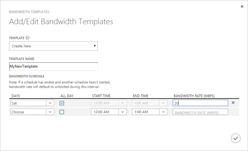

<properties
   pageTitle="Verwalten Sie Ihre StorSimple Bandbreite Vorlagen | Microsoft Azure"
   description="Beschreibt, wie zum Verwalten von StorSimple Bandbreite Vorlagen, die Sie Bandbreite steuern können."
   services="storsimple"
   documentationCenter=""
   authors="alkohli"
   manager="carmonm"
   editor="" />
<tags
   ms.service="storsimple"
   ms.devlang="na"
   ms.topic="article"
   ms.tgt_pltfrm="na"
   ms.workload="na"
   ms.date="08/16/2016"
   ms.author="alkohli" />

# Verwenden Sie den Dienst StorSimple Manager zum Verwalten von StorSimple Bandbreite Vorlagen

## (Übersicht)

Bandbreite Vorlagen können Sie Netzwerk Bandbreite Verwendung über mehrere Zeit des Tages Zeitpläne so Stufen Sie die Daten aus dem StorSimple Gerät in der Cloud zu konfigurieren.

Mit begrenzungsebene Terminpläne Bandbreite können Sie folgende Aktionen ausführen:

- Geben Sie die angepasste Bandbreite Terminpläne je nach den Arbeitsbelastung Netzwerk Verwendungen an.

- Zentrales Management und die Zeitpläne auf mehreren Geräten in eine einfache, nahtlose Weise wiederzuverwenden.

> [AZURE.NOTE] Diese Funktion steht nur für physische Geräte StorSimple und nicht für virtuelle Geräte.

Die Bandbreite Vorlagen des Diensts in einem Tabellenformat angezeigt werden und enthalten die folgende Informationen:

- **Name** – einen eindeutigen Namen, die Bandbreite Vorlage zugewiesen ist, wenn er erstellt wurde.

- **Zeitplan** – die Anzahl der Zeitpläne in einer bestimmten Bandbreite Vorlage enthalten.

- **Zur Verwendung von** – die Anzahl der Datenträger mithilfe der Bandbreite Vorlagen.

Sie verwenden die Seite StorSimple Manager **Konfigurieren** im klassischen Azure-Portal Bandbreite Vorlagen verwalten.

Sie können auch zusätzliche Informationen, damit konfigurieren Bandbreite Vorlagen finden:

- Fragen und Antworten zu Bandbreite Vorlagen
- Bewährte Methoden für die Bandbreite Vorlagen

## Fügen Sie eine Vorlage Bandbreite

Führen Sie die folgenden Schritte zum Erstellen einer neuen Vorlage für die Bandbreite ein.

#### Hinzufügen eine Vorlage Bandbreite

1. Klicken Sie auf der Seite StorSimple Manager Dienst **Konfigurieren** auf **die Bandbreite Vorlage hinzufügen/bearbeiten**.

2. Klicken Sie im Dialogfeld **Add/Edit Bandbreite Vorlage** :

   1. Wählen Sie in der Dropdown-Liste **Vorlage** **neu erstellen** , um eine neue Bandbreite Vorlage hinzuzufügen.
   2. Geben Sie einen eindeutigen Namen für die Vorlage Bandbreite an.

3. Definieren Sie einen **Zeitplan Bandbreite**an. So erstellen Sie einen Zeitplan

   1. Wählen Sie aus der Dropdownliste die Tage der Woche, denen für der Terminplan konfiguriert ist. Sie können mehrere Tage auswählen, indem Sie die Kontrollkästchen ansässig, bevor Sie die entsprechenden Tage in der Liste auswählen.
   2. Wählen Sie die Option **Alle Tag** aus, wenn Sie der Zeitplan für den gesamten Tag erzwungen wird. Wenn diese Option aktiviert ist, können Sie nicht mehr **Start-** oder **Endzeit**angeben. Der Zeitplan wird von 00:00 Uhr bis 23:59 Uhr.
   3. Wählen Sie eine **Anfangszeit**aus, aus der Dropdownliste aus. Dies ist bei der Terminplan beginnen soll.
   4. Wählen Sie aus der Dropdownliste eine **Endzeit**aus. Dies ist bei der Terminplan anhält.

         > [AZURE.NOTE] Überlappende Zeitpläne sind nicht zulässig. Wenn die Start- und Endzeiten überlappende Planung führt, werden Sie zu diesem Zweck eine Fehlermeldung angezeigt.

   5. Geben Sie die **Bandbreite Zins**an. Dies ist die Bandbreite in MB pro Sekunde (MB/s) von Ihrem Gerät StorSimple bei Vorgängen, die im Zusammenhang mit der Cloud (Uploads und Downloads) verwendet. Geben Sie eine Zahl zwischen 1 und 1.000 für dieses Feld ein.

   6. Klicken Sie auf das Symbol Kontrollkästchen . Die Vorlage, die Sie erstellt haben, wird in die Liste der Bandbreite Vorlagen auf der Seite **Konfigurieren** hinzugefügt werden.

    

4. Klicken Sie auf **Speichern** , am unteren Rand der Seite, und klicken Sie dann auf **Ja,** Wenn Sie zur Bestätigung aufgefordert werden. Dadurch wird die Konfiguration Änderungen zu speichern, die Sie vorgenommen haben.

## Bearbeiten einer Vorlage Bandbreite

Führen Sie die folgenden Schritte aus, um eine Vorlage Bandbreite zu bearbeiten.

### So bearbeiten Sie eine Vorlage Bandbreite

1. Klicken Sie auf **die Bandbreite Vorlage hinzufügen/bearbeiten**.

2. Klicken Sie im Dialogfeld **Add/Edit Bandbreite Vorlage** :

   1. Wählen Sie in der Dropdown-Liste **Vorlage** aus einer vorhandenen Bandbreite Vorlage, die Sie ändern möchten.
   2. Führen Sie die gewünschten Änderungen vor. (Sie können die vorhandenen Einstellungen ändern.)
   3. Klicken Sie auf das Symbol "Überprüfen" . Die angepasste Vorlage in der Liste der Bandbreite Vorlagen finden Sie auf der Seite konfigurieren.

3. Klicken Sie auf **Speichern** , am unteren Rand der Seite, um die Änderungen zu speichern. Klicken Sie auf **Ja,** Wenn Sie zur Bestätigung aufgefordert werden.

> [AZURE.NOTE] Sie sind nicht berechtigt, die Änderungen zu speichern, wenn Sie der bearbeitete Terminplan mit einer vorhandenen Terminplan in der Vorlage Bandbreite überlappt, den Sie ändern möchten.

## Löschen einer Vorlage für die Bandbreite

Führen Sie die folgenden Schritte aus, um eine Vorlage Bandbreite zu löschen.

#### So löschen Sie eine Vorlage Bandbreite

1. Wählen Sie in der Liste tabellarischen der Vorlagen Bandbreite des Diensts die Vorlage, die Sie löschen möchten. Extrem rechts neben der ausgewählten Vorlage wird ein Löschsymbol (**X**) angezeigt. Klicken Sie auf das **X** -Symbol, um die Vorlage zu löschen.

2. Sie werden zur Bestätigung aufgefordert werden. Klicken Sie auf **OK** , um den Vorgang fortzusetzen.

Wenn die Vorlage von einem beliebigen Datenträger verwendet wird, werden Sie nicht zulässig, ihn zu löschen. Sie sehen eine Fehlermeldung, dass die Vorlage verwendet wird. Dialogfeld mit einer Fehlermeldung wird angezeigt, Ihnen mitgeteilt, dass alle Verweise auf die Vorlage entfernt werden soll.

Sie können alle Verweise auf die Vorlage löschen, indem Sie den Zugriff auf der Seite **Volume Container** und ändern die Lautstärke Container, die diese Vorlage verwenden, damit sie eine andere Vorlage verwenden, oder verwenden Sie die Einstellung benutzerdefiniertes oder unbegrenzte Bandbreite. Wenn alle Verweise entfernt wurden, können Sie die Vorlage löschen.

## Verwenden Sie eine Standardvorlage für die Bandbreite

Eine Bandbreite Standardvorlage steht zur Verfügung und wird durch Lautstärke Container standardmäßig verwendet, um die Bandbreite Steuerelemente erzwingen, wenn Sie die Cloud zugreifen. Die Standardvorlage dient auch als Referenz bereit für Benutzer, die eigene Vorlagen erstellen. Die Details dieses Standardvorlage sind:

- **Name** – unbegrenzte Nächte und Wochenenden

- **Zeitplan** – einen einzelnen Zeitplan von Montag bis Freitag, die einen Satz Bandbreite 1 MB / zwischen 8 Uhr und 17: 00 Uhr Gerät Uhrzeit gilt. Die Bandbreite wird für den Rest der Woche auf Unbeschränkt festgelegt.

Die Standardvorlage kann bearbeitet werden. Die Verwendung dieser Vorlage (einschließlich bearbeitete Versionen) wird nachverfolgt.

## Erstellen einer Vorlage für ganztägige Bandbreite, die einem bestimmten Zeitpunkt beginnt

Gehen Sie folgendermaßen vor, um einen Zeitplan erstellen, der einem bestimmten Zeitpunkt beginnt und alle Tag ausgeführt wird. Im Beispiel des Zeitplans mit 9 Uhr morgens beginnt und bis 9 Uhr am nächsten Morgen ausgeführt wird. Es ist wichtig zu beachten, die die Start- und Endzeiten für einen angegebenen müssen beide auf den gleichen 24-Stunden-Zeitplan enthalten sein und kann nicht über mehrere Tage erstrecken. Wenn Sie müssen Bandbreite Vorlagen einrichten, die mehrere Tage erstrecken, müssen Sie mehrere Zeitpläne verwenden (wie im Beispiel gezeigt).

#### So erstellen Sie eine ganztägiges Bandbreite-Vorlage

1. Erstellen Sie einen Zeitplan, der mit 9 Uhr morgens beginnt und bis Mitternacht ausgeführt wird.

2. Fügen Sie einen weiteren Zeitplan hinzu. Konfigurieren des zweiten Zeitplans von Mitternacht bis 9 Uhr morgens ausgeführt.

3. Speichern Sie die Bandbreite Vorlage ein.

Zusammengesetzte Zeitplan nacheinander Ihrer Wahl gestartet und ausgeführt ganztägige dann.

## Fragen und Antworten zu Bandbreite Vorlagen

**Q**. Was geschieht mit Bandbreite Steuerelemente, wenn Sie zwischen der Zeitpläne sind? (Ein Zeitplan wurde eingestellt und einem anderen Platzhalter noch nicht begonnen hat.)

**A**. In diesem Fall werden keine Steuerelemente Bandbreite eingesetzt werden. Dies bedeutet, dass das Gerät unbegrenzte Bandbreite verwenden kann, wenn die Daten in der Cloud zu stufen.

**Q**. Können Sie die Bandbreite Vorlagen auf einem Gerät offline ändern?

**A**. Sie werden nicht mehr Bandbreite Vorlagen auf Datenmengen Container ändern, wenn das entsprechende Gerät offline ist.

**Q**. Können Sie bearbeiten Bandbreite Vorlage eines Containers Lautstärke zugeordnet wird, wenn die zugehörigen Datenträger offline arbeiten?

**A**. Sie können die Lautstärke Container, dessen Datenmengen offline sind, zugeordnete Bandbreite Vorlage ändern. Beachten Sie, dass wenn Datenmengen offline arbeiten, keine Daten vom Gerät in der Cloud gestuft werden sollen.

**Q**. Können Sie eine Standardvorlage löschen?

**A**. Obwohl Sie eine Standardvorlage löschen können, ist es keine gute Idee, hierzu. Die Verwendung von eine Standardvorlage, einschließlich der bearbeitete Versionen nachverfolgt wird. Die Daten Verlauf werden analysiert und im Laufe der Zeit werden verwendet, um die Standardvorlage zu verbessern.

**Q**. Wie stellen Sie fest, dass Ihre Bandbreite Vorlagen geändert werden müssen?

**A**. Eine von den Vorzeichen, dass Sie die Bandbreite Vorlagen ändern müssen wird beim Starten von im Netzwerk verlangsamt oder Unterfüllen mehrmals in einem Tag angezeigt. In diesem Fall überwachen Sie im Netzwerk Speicher und die Verwendung durch die e/a-Leistung und den Netzwerkdurchsatz Diagramme betrachten.

Identifizieren Sie die Uhrzeit und die Lautstärke Container, in denen die Netzwerkengpass erfolgt, aus der Durchsatzdaten Netzwerk. Wenn dies passiert, wenn die Daten in der Cloud gestuft wird ist (diese Informationen aus e/a-Leistung für alle Lautstärke Container für Gerät in die cloud erhalten), müssen Sie zum Ändern der Bandbreite Vorlagen Ihre Lautstärke Container zugeordnet.

Nachdem die geänderten Vorlagen verwendet werden, müssen Sie das Netzwerk erneut für signifikante Wartezeiten zu überwachen. Falls Sie noch vorhanden sind, müssen Sie Ihre Vorlagen Bandbreite erneut aufzurufen.

**Q**. Was passiert, wenn mehrere Lautstärke Container auf meinem Gerät verfügen, die Überlappung plant, aber andere Grenzwerte gelten für jede?

**A**. Angenommen, Sie ein Gerät mit 3 Lautstärke Container besitzen. Die folgenden Container vollständig zugeordnet Zeitpläne überlappen. Für jede dieser Container sind die Bandbreitengrenzwerte verwendet 5, 10 und 15/s. Wenn e/as gleichzeitig auf allen dieser Container auftreten, das Minimum der 3 Bandbreitengrenzwerte angewandt werden: in diesem Fall 5/s, da diese ausgehenden e/a-Anfragen dieselbe Warteschlange freigeben.

## Bewährte Methoden für die Bandbreite Vorlagen

Führen Sie diese bewährte Methoden für Ihr Gerät StorSimple aus:

- Konfigurieren von Bandbreite Vorlagen auf Ihrem Gerät Variable begrenzungsebene den Netzwerkdurchsatz vom Gerät zu unterschiedlichen Zeiten des Tages aktivieren. Diese Vorlagen Bandbreite bei Verwendung mit Sicherung Zeitpläne können effektiv zusätzliche Bandbreite für Cloud-Vorgänge in Zeiten nutzen.

- Berechnen der tatsächlichen Bandbreite für eine bestimmte Bereitstellung ausgehend von der Größe der Bereitstellung und Ziel der Wiederherstellung erforderliche Zeit (RTO) erforderlich ist.

## Nächste Schritte

Weitere Informationen zum [Verwenden des Diensts StorSimple Manager zum Verwalten von Ihrem Geräts StorSimple](storsimple-manager-service-administration.md).
