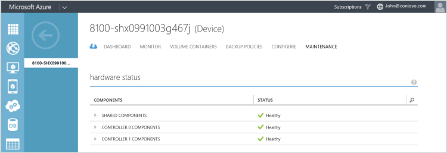
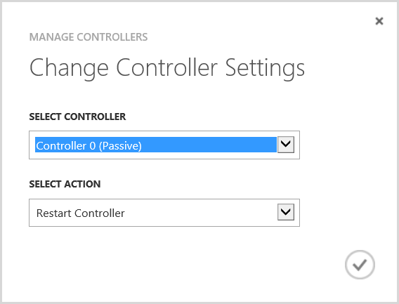

<properties
   pageTitle="Verwalten von StorSimple Gerätecontroller | Microsoft Azure"
   description="Informationen Sie zum Beenden, neu starten, fahren Sie oder Ihre StorSimple Gerätecontroller zurücksetzen."
   services="storsimple"
   documentationCenter=""
   authors="alkohli"
   manager="carmonm"
   editor="" />
<tags
   ms.service="storsimple"
   ms.devlang="na"
   ms.topic="article"
   ms.tgt_pltfrm="na"
   ms.workload="na"
   ms.date="10/11/2016"
   ms.author="alkohli" />

# Verwalten Sie Ihrer StorSimple Gerätecontroller

## (Übersicht)

In diesem Lernprogramm werden die unterschiedlichen Vorgänge, die auf Ihrem Gerät-Controller StorSimple ausgeführt werden können. Controller in Ihrem Gerät StorSimple sind redundante (Peer) Controller in Aktiv-Passiv-Konfiguration. Zu einem beliebigen Zeitpunkt nur ein Controller aktiv ist und alle Vorgänge für die Festplatte und das Netzwerk verarbeitet wird. Der andere Controller ist Hardwareverfahren. Wenn der aktive Controller fehlschlägt, wird automatisch der passive Controller aktiv.

In diesem Lernprogramm enthält eine schrittweise Anleitung zum Verwalten der Controller Device mithilfe der:

- **Controller** Abschnitt von der Seite **zum Warten** von in der StorSimple Manager-Dienst
- Windows PowerShell für StorSimple.

Es empfiehlt sich, dass Sie das Gerätecontroller über den Dienst StorSimple Manager verwalten. Wenn eine Aktion nur für StorSimple mithilfe von Windows PowerShell ausgeführt werden kann, wird das Lernprogramm eine Notiz, aus.

Nach dem Lesen dieses Lernprogramms, werden Sie können:

- Neu starten Sie, oder fahren Sie ein StorSimple Gerätecontroller
- Fahren Sie ein Gerät StorSimple
- Ihr Gerät StorSimple auf Standardwerte für das Zurücksetzen

## Starten Sie erneut, oder fahren Sie einen controller

Controller Neustart / war(en) ist nicht als Teil des normalen System Vorgangs erforderlich. War(en) Vorgänge für ein einzelnes Gerätecontroller gelten nur in Fällen, in denen eine Fehler beim Gerät Hardware-Komponente ersetzt werden muss. Ein Controller Neustart möglicherweise auch in einer Situation erforderlich werden, in der Leistung durch übermäßige arbeitsspeicherauslastung oder einer gestörten Controller beeinträchtigt wird. Sie müssen auch einen Controller neu starten, nachdem ein Ersatz erfolgreich Controller aktivieren und Testen Sie den Controller ersetzten werden soll.

Einen Neustart von einem Gerät ist nicht Unterbrechung verbundenen Initiatoren, unter der Voraussetzung, dass der passive Controller verfügbar ist. Ein passiver Controller ist nicht verfügbar oder ausgeschaltet ist deaktiviert und dann einen Neustart von des aktiven Controllers Unterbrechung der Dienst und Ausfallzeiten führen kann.

> [AZURE.IMPORTANT]

> - **Ein laufenden Controller sollte wie folgt in einem Verlust der Redundanz und einem erhöhten Ausfall bedingt nie physisch entfernt werden.**

> - Das folgende Verfahren gilt nur für das StorSimple physische Gerät. Informationen dazu, wie Sie starten, beenden und Neustarten des virtuellen Geräts finden Sie unter [Arbeiten mit dem virtuelle Gerät](storsimple-virtual-device-u2.md#work-with-the-storsimple-virtual-device).

Sie können neu starten, oder fahren Sie ein einzelnes Gerätecontroller mithilfe des Azure klassischen Portals StorSimple Manager-Dienst oder Windows PowerShell für StorSimple

Führen Sie zum Verwalten von Ihrem Gerätecontroller vom klassischen Azure-Portal die folgenden Schritte aus.

#### Neu zu starten, oder fahren Sie einen Controller klassischen-Portal

1. Navigieren Sie zu **Geräte > Wartung**.

1. Wechseln Sie zur **Hardware Status** , und stellen Sie sicher, dass der Status der Controller auf Ihrem Gerät **fehlerfrei**ist.

    

1. Vom unteren Rand der Seite **zum Warten** klicken Sie auf **Controller verwalten**.

     

    >[AZURE.NOTE] Wenn Sie **Controller verwalten**nicht angezeigt wird, müssen Sie Updates installieren. Weitere Informationen finden Sie unter [Aktualisieren von Ihrem Gerät StorSimple](storsimple-update-device.md).

1. Klicken Sie im Dialogfeld **Controller-Einstellungen ändern** folgendermaßen Sie vor:
    1. Wählen Sie in der Dropdown-Liste **Controller wählen Sie** den Controller, den Sie verwalten möchten. Die Optionen sind Controller 0 und 1 Controller. Diese Controller werden auch als aktiv oder Passiv identifiziert.

        >[AZURE.NOTE] Ein Controller kann nicht verwaltet werden, wenn es ist nicht verfügbar oder ausgeschaltet ist deaktiviert, und es in der Dropdown-Liste nicht angezeigt.

    2. Wählen Sie in der Dropdown-Liste **Aktion auswählen** **neu starten Controller** oder **fahren Sie Controller**aus.

        
    3. Klicken Sie auf das Symbol "Überprüfen" .

Dies wird starten, oder fahren Sie den Controller. Die folgende Tabelle führt die Details der was passiert in Abhängigkeit von der Auswahl an, die Sie im Dialogfeld **Ändern Controller Einstellungen** vorgenommen haben.  

|Auswahl #|Wenn Sie die verwenden...|Dies tritt.|
|---|---|---|
|1.|Starten Sie den passiven Controller neu.|Eine wird erstellt, um den Controller neu zu starten, und Sie werden benachrichtigt, nachdem Sie der Auftrag erfolgreich erstellt wurde. Dies wird den Neustart Controller einleiten. Sie können den Neustart zu überwachen, indem Sie den Zugriff auf **Dienst > Dashboards > Vorgang Protokolle anzeigen** und dann Filtern nach mit Ihrem Dienst spezifische Parameter.|
|2.|Starten Sie den aktiven Controller neu.|Die folgende Warnung wird angezeigt: "Wenn Sie den aktiven Controller neu starten, das Gerät schlägt fehl über an den passiven Controller. Möchten Sie fortfahren?"  Wenn Sie diesen Vorgang fortsetzen möchten, werden den nächsten Schritten fort, die den passiven Controller neu starten, denen identisch sein (Siehe Auswahl 1).|
|3.|Fahren Sie den passiven Controller aus.|Wird die folgende Meldung angezeigt: "nach Abschluss der war(en) werden müssen Sie die Power-Taste auf Ihrem Controller Einschalten drücken. Sind Sie sicher, dass Sie diese Controller beenden möchten?"  Wenn Sie diesen Vorgang fortsetzen möchten, werden den nächsten Schritten fort, die den passiven Controller neu starten, denen identisch sein (Siehe Auswahl 1).|
|4.|Fahren Sie dem aktiven Controller aus.|Wird die folgende Meldung angezeigt: "nach Abschluss der war(en) werden müssen Sie die Power-Taste auf Ihrem Controller Einschalten drücken. Sind Sie sicher, dass Sie diese Controller beenden möchten?"  Wenn Sie diesen Vorgang fortsetzen möchten, werden den nächsten Schritten fort, die den passiven Controller neu starten, denen identisch sein (Siehe Auswahl 1).|

#### Neu zu starten, oder fahren Sie einen Controller in Windows PowerShell für StorSimple
Führen Sie die folgenden Schritte zum Beenden oder Neustarten einen Controller auf Ihrem Gerät StorSimple vom klassischen Azure-Portal an.

1. Zugriff auf die Geräte mithilfe der seriellen Konsole oder einer Telnetsitzung von Remotecomputern aus. Verbinden Sie mit Controller 0 oder 1 Controller gemäß die Anweisungen in [Verwenden kitten Verbindung zu der seriellen Gerät-Konsole](storsimple-deployment-walkthrough.md#use-putty-to-connect-to-the-device-serial-console).

1. Wählen Sie im Menü seriellen Konsole Option 1, **Melden Sie sich mit Vollzugriff**aus.

1. Klicken Sie in der Nachricht Banner Notieren Sie den Controller Sie (Controller 0 oder 1 Controller) verbunden sind, ob das aktive oder passive Controller (standby) ist.
    - Zum Beenden eines einzelnen Controllers, dazu aufgefordert werden, geben Sie Folgendes ein:

        `Stop-HcsController`

        Dadurch wird der Controller beenden, die Sie verbunden sind. Wenn Sie den aktiven Controller beenden, schlägt es über an den passiven Controller fehl, bevor sie beendet wird.
    - Um einen Controller, dazu aufgefordert werden, neu zu starten, geben Sie Folgendes ein:

        `Restart-HcsController`

        Dadurch wird den Controller neu gestartet, dem Sie verbunden sind. Wenn Sie den aktiven Controller neu starten, wird es mit dem passiven Controller vor dem Neustart über fehl.

## Fahren Sie ein Gerät StorSimple

In diesem Abschnitt wird erläutert, wie eine laufende oder eines ausgefallenen StorSimple Geräts von einem Remotecomputer beenden. Ein Gerät ist deaktiviert, nachdem Sie die Gerätecontroller beenden. Ein Gerät war(en) abgeschlossen ist, wenn das Gerät physisch verschoben oder außer Dienst genommen wird.

> [AZURE.IMPORTANT] Bevor Sie das Gerät beenden, überprüfen Sie die Integrität des Gerätekomponenten. Navigieren Sie zu **Geräte > Wartung > Hardware Status** und stellen Sie sicher, dass der LED-Status aller Komponenten grün ist. Nur ein fehlerfrei Gerät haben einen grünen Status auf. Wenn Ihr Gerät nach unten, um beendet ist eine fehlerhafte Komponente ersetzen, wird ein Fehler beim (Rot) oder ein beeinträchtigt (gelb) Status für die entsprechenden Komponenten angezeigt wird.

#### Zum Beenden einer StorSimple Gerät

1. Gehen Sie [neu starten, oder fahren Sie einen Controller](#restart-or-shut-down-a-single-controller) vor, um zu identifizieren, und fahren Sie den passiven Controller auf Ihrem Gerät. Sie können diesen Vorgang in der klassischen Azure-Portal oder in Windows PowerShell für StorSimple ausführen.
2. Wiederholen Sie die obige Schritte zum Beenden des aktiven Controllers aus.
3. Sie müssen jetzt wieder Ebene des Geräts eigenständig. Nachdem Sie die zwei Controller vollständig ausgeschaltet werden, sollte der Status LED-Anzeigen auf die beiden Controller rot blinken. Wenn Sie das Gerät vollständig zu diesem Zeitpunkt deaktivieren müssen, spiegeln Sie die Schalter Power auf Power und Kühlmodule (PCMs) an die Position aus. Dies sollte das Gerät deaktivieren.

<!--#### To shut down a StorSimple device in Windows PowerShell for StorSimple

1. Connect to the serial console of the StorSimple device by following the steps in [Use PuTTY to connect to the device serial console](storsimple-deployment-walkthrough.md#use-putty-to-connect-to-the-serial-console).

1. In the serial console menu, verify from the banner message that the controller you are connected to is the passive controller. If you are connected to the active controller, disconnect from this controller and connect to the other controller.

1. In the serial console menu, choose option 1, **log in with full access**.

1. At the prompt, type:

    `Stop-HCSController`

    This should shut down the current controller. To verify whether the shutdown has finished, check the back of the device. The controller status LED should be solid red.

1. Repeat steps 1 through 4 to connect to the active controller and then shut it down.

1. After both the controllers are completely shut down, the status LEDs on both should be blinking red. If you need to turn off the device completely at this time, flip the power switches on both Power and Cooling Modules (PCMs) to the OFF position.-->

## Zurücksetzen Sie Gerät, um Factory-Standardeinstellungen

> [AZURE.IMPORTANT] Wenn Sie Ihr Gerät auf Factory-Standardeinstellungen zurücksetzen müssen, wenden Sie sich an den Microsoft-Support. Das folgende Verfahren sollte nur in Verbindung mit Microsoft-Support verwendet werden.

Dieses Verfahren beschreibt, wie Sie Ihrem Gerät Microsoft Azure StorSimple Factory-Standardeinstellungen, die mit Windows PowerShell für StorSimple zurücksetzen.
Zurücksetzen eines Geräts werden alle Daten und Einstellungen aus dem gesamten Cluster standardmäßig entfernt.

Führen Sie die folgenden Schritte aus, um Ihr Gerät Microsoft Azure StorSimple auf Factory Standardeinstellungen zurückzusetzen:

### Auf die Standardeinstellungen in Windows PowerShell für StorSimple das Gerät zurücksetzen

1. Zugriff auf das Gerät über seine serielle Konsole. Überprüfen Sie die Nachricht Banner, um sicherzustellen, dass Sie mit dem aktiven Controller verbunden sind.

1. Wählen Sie im Menü seriellen Konsole Option 1, **Melden Sie sich mit Vollzugriff**aus.

1. Dazu aufgefordert werden Geben Sie den folgenden Befehl aus, um den gesamten Cluster, entfernen alle Daten und Metadaten Controller Einstellungen zurückzusetzen:

    `Reset-HcsFactoryDefault`

    Wenn Sie stattdessen einen Controller zurücksetzen möchten, verwenden Sie das Cmdlet [Zurücksetzen-HcsFactoryDefault](http://technet.microsoft.com/library/dn688132.aspx) mit der `-scope` Parameter.)

    Das System wird mehrmals neu gestartet. Sie werden benachrichtigt, wenn Zurücksetzen erfolgreich abgeschlossen wurde. Je nach Systemmodell kann dies 45 bis 60 Minuten für ein Gerät 8100 und 60-90 Minuten für eine 8600 zum Abschließen dieser Vorgang dauern.

    > [AZURE.TIP]

    > - Wenn Sie Update 1.2 verwenden oder eine frühere Version der `–SkipFirmwareVersionCheck` Parameter das Kontrollkästchen Firmware Version überspringen (andernfalls wird ein Konflikt Firmwarefehler angezeigt: Factory zurücksetzen aufgrund der Firmwareversionen einen Konflikt kann nicht fortgesetzt werden. ).

    > - Die Factory zurücksetzen Prozedur fehlschlagen für StorSimple Geräte, das Update 1 oder 1.1 im Portal Government ausgeführt und kein Ersatz erfolgreich ein oder zwei Controller (mit Ersatz Controller, die mit der Software vor dem Update 1 ausgeliefert wurden) durchgeführt haben. Wenn die Factory zurücksetzen darüber, dass das Bild für das Vorhandensein eines SHA1-Datei auf dem Controller, der nicht vorhanden ist für 1 vor dem Update-Software überprüft wird. Wenn Sie, dass diese Factory Fehler zurücksetzen sehen, wenden Sie sich an den Microsoft-Support, um Sie mit den nächsten Schritten unterstützen. Dieses Problem wird nicht mit Ersatz Controller angezeigt, die von der Factory mit Update 1 oder höher Software ausgeliefert wurden.

## Fragen und Antworten zum Verwalten von Controller device

In diesem Abschnitt haben wir zusammengefasst einige häufig gestellten Fragen zum Verwalten von StorSimple Gerätecontroller.

**F.** Was passiert, wenn beide Controller auf meinem Gerät fehlerfrei und aktiviert sind auf und ich neu starten, oder fahren Sie dem aktiven Controller?

**A** Wenn Sie sowohl die Controller auf Ihrem Gerät fehlerfrei und aktiviert sind aktivieren, werden Sie zur Bestätigung aufgefordert werden. Wählen Sie auf:

- **Starten den aktiven Controller** – werden Sie benachrichtigt, dass Neustarten eines aktiven Controllers das Gerät an den passiven Controller über treten führt. Der Controller wird neu gestartet.

- **Fahren Sie einen aktiven Controller** – werden Sie benachrichtigt, dass Sie eine aktive Controller beenden Ausfallzeiten führt. Sie müssen auch auf dem Gerät den Controller Aktivieren der Power-Taste drücken.

**F.** Was geschieht der passive Controller auf meinem Gerät ist nicht verfügbar oder aktiviert deaktiviert und kann ich neu starten, oder fahren Sie dem aktiven Controller?

**A** Ist der passive Controller auf Ihrem Gerät nicht verfügbar oder ausgeschaltet ist deaktiviert, und Sie entscheiden:

- **Starten den aktiven Controller** – werden Sie benachrichtigt, dass Sie den Vorgang fortsetzen zu in eine temporäre Unterbrechung des Diensts Fehlern führt, und Sie zur Bestätigung aufgefordert werden werden.

- **Fahren Sie einen aktiven Controller** – werden Sie benachrichtigt, dass Sie den Vorgang fortsetzen Ausfallzeiten führt und müssen Sie die Power-Taste auf einen oder beide Controller So aktivieren Sie das Gerät drücken. Sie werden zur Bestätigung aufgefordert werden.

**F.** Wenn der Controller neu beginnen oder war(en) unterstützt nicht den Fortschritt?

**A** Neu gestartet oder beendet einen Controller möglicherweise tritt auf:

- Geräte-Update wird ausgeführt.

- Ein Neustart Controller wird bereits ausgeführt.

- Ein Controller war(en) wird bereits ausgeführt.

**F.** Wie können Sie ermitteln, ob ein Controller neu gestartet oder beendet wurde?

**A** Sie können den Controllerstatus, klicken Sie auf der Seite zum Warten überprüfen. Der der Controllerstatus zeigt an, ob ein Controller neu gestartet oder beendet wurde. Darüber hinaus wird die Seite Benachrichtigungen Warnung vom Typ informative enthalten, wenn der Controller neu gestartet oder beendet wurde. Die Controller starten und beenden Vorgänge sind auch in den Vorgang Protokollen aufgezeichnet. Informationen zum Vorgang Protokolle wechseln Sie zum [Anzeigen der Vorgang Protokolle](storsimple-service-dashboard.md#view-the-operations-logs).

**F.** Gibt es Einfluss auf die e/as als Ergebnis Controller Failover?

**A** Die TCP-Verbindungen zwischen Initiatoren und aktiven Controller werden als Ergebnis Controller Failover zurückgesetzt werden, jedoch werden wiederhergestellt werden, wenn der passive Controller Vorgang setzt voraus. Möglicherweise gibt es eine Pause temporär (weniger als 30 Sekunden) in e/a-Aktivität zwischen Initiatoren und dem Gerät im Verlauf dieses Vorgangs.

**F.** Wie zurückgeben ich meine Controller bedienen, nachdem es beendet und entfernt wurde?

**A** Um einen Controller Dienst zurückzukehren, müssen Sie es in den Rahmen im Feld [Ersetzen ein Controller-Modul auf Ihrem Gerät StorSimple](storsimple-controller-replacement.md)beschriebenen einfügen.

## Nächste Schritte

- Wenn Sie Probleme mit Ihrem Gerät-Controller StorSimple auftreten, die Sie nicht beheben können mithilfe der Verfahren in diesem Lernprogramm, [wenden Sie sich an Microsoft Support](storsimple-contact-microsoft-support.md)aufgeführt.

- Weitere Informationen zum Verwenden des StorSimple Manager-Diensts finden Sie unter verwenden [der StorSimple-Manager-Dienst auf Ihrem Gerät StorSimple verwalten](storsimple-manager-service-administration.md).
