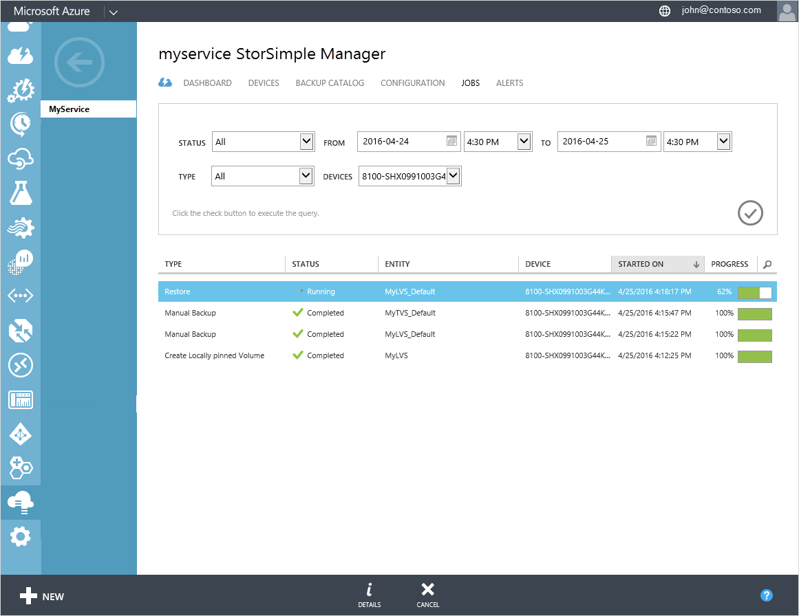
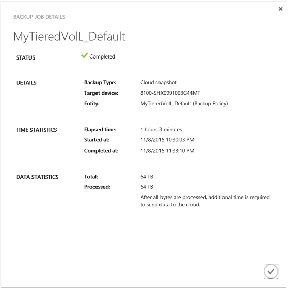

<properties 
   pageTitle="Anzeigen und Verwalten von Aufträgen StorSimple | Microsoft Azure"
   description="Beschreibt die Seite StorSimple Manager Aufträge und zur gemeinsamen Nutzung von zuletzt verwendete, aktuelle und geplante Sicherung Aufträge verfolgen."
   services="storsimple"
   documentationCenter="NA"
   authors="alkohli"
   manager="carmonm"
   editor=""/>
<tags 
   ms.service="storsimple"
   ms.devlang="NA"
   ms.topic="article"
   ms.tgt_pltfrm="NA"
   ms.workload="TBD"
   ms.date="08/17/2016"
   ms.author="alkohli" />

# Verwenden Sie den Dienst StorSimple Manager zum Anzeigen und Verwalten von Aufträgen für StorSimple (Update 2)

[AZURE.INCLUDE [storsimple-version-selector-manage-jobs](../../includes/storsimple-version-selector-manage-jobs.md)]

## (Übersicht)

Die Seite " **Aufträge** " bietet ein einzelnes zentrales Portal für die Anzeige und Verwalten von Aufträgen, die auf Geräten eingeleitet wurden mit Ihrem Dienst StorSimple Manager verbunden. Sie können geplante, laufenden, abgeschlossene, unterbrochen und fehlgeschlagene Aufträge für mehrere Geräte anzeigen. Ergebnisse werden im Tabellenformat angezeigt. 

Sie können schnell die Einzelvorgänge finden, die Sie interessiert sind, durch Filtern nach Felder wie:

- **Status** – Aufträge können fertigen, unterbrochen, fehlgeschlagene, Abbrechen oder abgeschlossen mit Fehlern ausgeführt.
- **Aus** – Aufträge basierend auf den Datums- und Zeitbereich gefiltert werden können.
- **Typ** – Art des kann Sicherung, werden manuelle Sicherung, wiederherstellen, Klonen, Geräte-Failover lokal angeheftete Volume erstellen, ändern Sie die Lautstärke, aktualisieren, unterstützen Paket oder virtuelles Gerät bereitgestellt.

- **Geräte** – Aufträge werden auf einem bestimmten Gerät bei einer Verbindung zu Ihrem Dienst initiiert.
Die gefilterten Aufträge werden dann auf der Grundlage der folgenden Attributen tabellarisch angeordnet:

    - **Typ** – Sicherung, manuelle Sicherung, wiederherstellen, Klonen, Geräte-Failover lokal angeheftete Volume erstellen, ändern Sie die Lautstärke, aktualisieren, unterstützen Paket oder virtuelles Gerät bereitgestellt.

    - **Status** – ausgeführt, fertigen, unterbrochen, fehlgeschlagene, Abbrechen oder abgeschlossen mit Fehlern.

    - **Entität** – die Einzelvorgänge können einen Datenträger, eine Sicherung Richtlinie oder einem Gerät zugeordnet werden. Ein Auftrag datenbeschriftungsreihe beträgt beispielsweise ein Volumen, zugeordnet während einer geplante Aufträge einer Sicherung Richtlinie zugeordnet ist. Ein Gerät Auftrag wird als Ergebnis einer Wiederherstellung (DR) oder einer Wiederherstellung erstellt.

    - **Gerät** – den Namen des Geräts auf dem der Auftrag gestartet wurde.

    - **Schritte auf** – die Zeit an, wenn der Auftrag gestartet wurde.

    - **Fortschritt** – Prozentsatz Abschluss eines laufenden Auftrags. Abgeschlossene Projekte sollten dies immer (100 %).

Die Liste der Aufträge werden alle 30 Sekunden aktualisiert.

Sie können auf dieser Seite die folgenden projektbezogenen Aktionen ausführen:

- Anzeigen von Details zu Position

- Abbrechen eines Auftrags

## Anzeigen von Details zu Position

Führen Sie die folgenden Schritte aus, um die Details zu einer beliebigen Position anzuzeigen.

#### Job-Details anzeigen

1. Zeigen Sie auf der Seite **Projekte** die Sie interessiert sind, durch Ausführen einer Abfrage mit entsprechenden Filter Einzelvorgänge an Sie können für abgeschlossen, ausgeführt oder abgebrochen Aufträge suchen.

2. Wählen Sie ein Projekt aus.

3. Klicken Sie am unteren Rand der Seite auf **Details**.

4. Klicken Sie im Dialogfeld **Sicherungskopie Job Details** können Sie den Status, Details, Zeitstatistik, und Daten anzeigen.
 
    

## Abbrechen eines Auftrags

Führen Sie die folgenden Schritte aus, um einen laufenden Auftrag abbrechen.

>[AZURE.NOTE] Einige Aufträge, wie z. B. einen Datenträger, um die Lautstärke Art ändern ändern oder Erweitern eines Volumen, können nicht abgebrochen werden.

### Beim Abbrechen eines Auftrags

1. Zeigen Sie auf der Seite **Projekte** die ausgeführten Aufträgen, die Sie stornieren durch Ausführen einer Abfrage mit entsprechenden filtern möchten.

1. Wählen Sie den Auftrag aus.

1. Klicken Sie am unteren Rand der Seite auf **Abbrechen**.

1. Wenn Sie zur Bestätigung aufgefordert werden, klicken Sie auf **Ja**.

Dieser Auftrag wird jetzt abgebrochen.

## Nächste Schritte

- Informationen zum [Verwalten Ihrer StorSimple Sicherung Richtlinien](storsimple-manage-backup-policies.md).

- Erfahren Sie, wie der Dienst StorSimple Manager zum Verwalten von Ihrem Geräts StorSimple zu [verwenden](storsimple-manager-service-administration.md).
