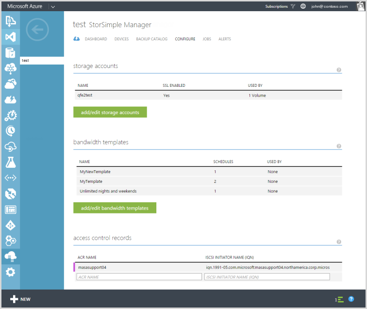
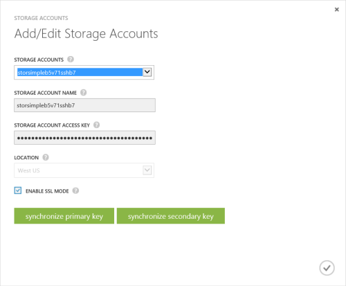
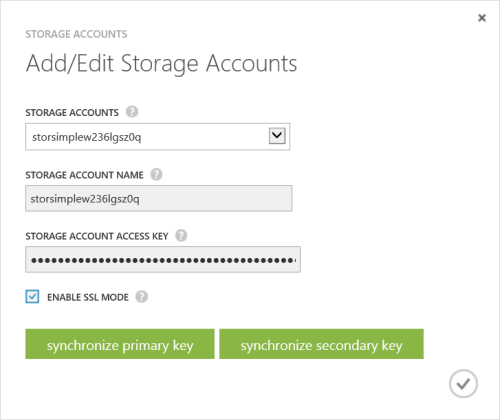

<properties 
   pageTitle="Verwalten Ihrer StorSimple Speicherkonto | Microsoft Azure"
   description="Erläutert, wie Sie mithilfe der Seite StorSimple Manager konfigurieren hinzufügen, bearbeiten, löschen oder Drehen die Sicherheitsschlüssel für ein Speicherkonto können."
   services="storsimple"
   documentationCenter="NA"
   authors="SharS"
   manager="carmonm"
   editor="" />
<tags 
   ms.service="storsimple"
   ms.devlang="NA"
   ms.topic="article"
   ms.tgt_pltfrm="NA"
   ms.workload="TBD"
   ms.date="04/29/2016"
   ms.author="v-sharos" />

# Verwenden des StorSimple Manager-Diensts zur Verwaltung Ihres Speicherkontos

## (Übersicht)

Die Seite **Konfigurieren** bietet die globale Service-Parameter, die in der StorSimple Manager-Dienst erstellt werden können. Diese Parameter können angewendet werden, um alle mit dem Dienst verbundenen Geräte und umfassen:

- Speicherkonten 
- Bandbreite Vorlagen 
- Access-Steuerelement Datensätze 

In diesem Lernprogramm wird erläutert, wie Sie mithilfe die Seite **Konfigurieren** hinzufügen, bearbeiten oder löschen Speicherkonten oder die Sicherheitsschlüssel für ein Speicherkonto drehen können.

   

Speicherkonten enthalten die Anmeldeinformationen, die das Gerät Zugriff auf Ihr Speicherkonto mit Ihren Cloud-Service-Anbieter verwendet. Für Microsoft Azure-Speicher-Konten werden diese Anmeldeinformationen wie den Namen des Kontos und die primäre Zugriffstaste. 

Klicken Sie auf der Seite **Konfigurieren** werden alle Speicherkonten, die für das Abonnement Abrechnung erstellt wurden in Tabellenform, enthält die folgende Informationen angezeigt:

- **Namen** – die eindeutigen Namen in dem Konto zugewiesen werden, wenn er erstellt wurde.
- **SSL aktiviert** –, ob die SSL aktiviert ist und Gerät-Cloud-Kommunikation über den sicheren Kanal.
- **Zur Verwendung von** – die Anzahl der Datenträger, die mit dem Speicherkonto.

Sind am häufigsten ausgeführten Aufgaben im Zusammenhang mit Speicherkonten, die auf der Seite **Konfigurieren** ausgeführt werden können:

- Hinzufügen eines Kontos Speicher 
- Bearbeiten einer Speicher-Kontos 
- Löschen eines Kontos Speicher 
- Key Drehung Speicherkonten 

## Speicher Kontotypen

Es gibt drei Arten von Speicherkonten, die mit Ihrem Gerät StorSimple verwendet werden können.

- **Automatisch generierte Speicherkonten** – wie der Name sagt, diese Art von Speicher-Konto wird automatisch generiert, wenn der Dienst zuerst erstellt wird. Wenn Sie weitere Informationen dazu, wie diese Speicherkonto erstellt wurde, finden Sie unter [Schritt 1: erstellen ein neues Dienstes](storsimple-deployment-walkthrough-u1.md#step-1-create-a-new-service) in [Bereitstellen von Ihrem lokalen StorSimple Gerät](storsimple-deployment-walkthrough.md). 
- **Speicherkonten im Dienst-Abonnement** – Hierbei handelt es sich um den Azure-Speicher-Konten, die im selben Abonnement des Diensts wie zugeordnet sind. Weitere Informationen zu wie diese Speicher Konten erstellt wurden, finden Sie unter [Informationen zu Azure Speicherkonten](../storage/storage-create-storage-account.md). 
- **Speicherkonten außerhalb der Dienst Abonnement** – Hierbei handelt es sich um den Azure-Speicher-Konten, die nicht mit dem Dienst verknüpft ist und wahrscheinlich war, bevor der Dienst erstellt wurde.

## Hinzufügen eines Kontos Speicher

Sie können Speicher-Konto hinzufügen, indem Sie einen eindeutigen Namen und die Anmeldeinformationen für den Zugriff, die mit dem Speicherkonto (mit den angegebenen Cloud Service Provider) verknüpft sind. Sie haben auch die Möglichkeit, den secure Sockets Layer (SSL)-Modus aktivieren einen Kanal für die Kommunikation zwischen Ihrem Gerät und in der Cloud zu erstellen.

Sie können mehrere Konten für einen angegebenen Cloud-Dienstanbieter erstellen. Denken Sie jedoch, nachdem ein Speicherkonto erstellt wurde, können Sie den Cloud-Service-Anbieter ändern.

Während des Speicherkontos gespeichert wird, versucht der Dienst zur Kommunikation mit Ihren Cloud-Service-Anbieter. Die Anmeldeinformationen und das Access-Material, das Sie angegeben haben, werden zu diesem Zeitpunkt authentifiziert werden. Ein Speicherkonto wird erstellt, nur, wenn die Authentifizierung erfolgreich war. Wenn die Authentifizierung fehlschlägt, wird eine entsprechende Fehlermeldung angezeigt.

Ressourcenmanager Speicherkonten Azure-Portal erstellt werden auch durch StorSimple unterstützt. Die Ressourcenmanager Speicherkonten werden nicht angezeigt in der Dropdown-Liste zur Auswahl beim Versuch, einen Container Lautstärke nur erstellten Speicherkonten in der klassischen Azure-Portal erstellen angezeigt wird. Ressourcenmanager Speicherkonten müssen, mit dem Verfahren zum Hinzufügen einer Speicher-Kontos unten beschriebenen hinzugefügt werden soll.

> [AZURE.NOTE] Die Vorgehensweise zum Hinzufügen eines Kontos Speicher unterscheidet sich je nach der StorSimple Software-Version, die Sie verwenden. Achten Sie darauf, dass Sie das richtige Verfahren für Ihre Version StorSimple folgen.

[AZURE.INCLUDE [add-a-storage-account-update1](../../includes/storsimple-configure-new-storage-account-u1.md)]

[AZURE.INCLUDE [add-a-storage-account](../../includes/storsimple-configure-new-storage-account.md)]

## Bearbeiten einer Speicher-Kontos

Sie können ein Speicherkonto bearbeiten, die von einem Container Lautstärke verwendet wird. Wenn Sie ein Speicherkonto, die aktuell verwendet wird bearbeiten, ist das einzige Feld zur Verfügung, ändert die Tastenkombination für das Speicherkonto aus. Können Sie die neue Speicher Zugriffstaste angeben und die aktualisierten Einstellungen zu speichern.

#### So bearbeiten Sie ein Speicherkonto

1. Zur Detailseite Dienst wählen Sie den Dienst, doppelklicken Sie auf den Namen, und klicken Sie dann auf **Konfigurieren**.

2. Klicken Sie auf **Speicherkonten hinzufügen/bearbeiten**.

3. Klicken Sie im Dialogfeld **Add/Edit Speicherkonten** :

  1. Wählen Sie in der Dropdown-Liste **Speicher**Kontotypen eines vorhandenen Kontos, das Sie ändern möchten. Dies kann auch die Speicherkonten umfassen, die automatisch generiert wurden, wenn der Dienst zuerst erstellt wurde.
  2. Bei Bedarf können Sie die **SSL-Modus aktivieren** Auswahl ändern.
  3. Sie können auswählen, um Ihre Speicher Konto Zugriffstasten gedreht. Weitere Informationen zum Ausführen von Key Drehung finden Sie unter [Key Drehung Speicherkonten](#key-rotation-of-storage-accounts) .
  4. Klicken Sie auf das Symbol Kontrollkästchen  um die Einstellungen zu speichern. Die Einstellungen werden auf der Seite **Konfigurieren** aktualisiert. Klicken Sie auf **Speichern** , um die aktualisierten Einstellungen zu speichern.

     
  
## Löschen eines Kontos Speicher

> [AZURE.IMPORTANT] Sie können ein Speicherkonto löschen, nur, wenn es nicht von einem Container Lautstärke verwendet wird. Wenn Sie ein Speicherkonto von einem Container Lautstärke verwendet wird, zunächst löschen Sie den Container Volume, und löschen Sie das zugehörige Speicher-Konto.

#### So löschen Sie ein Speicherkonto

1. Wählen Sie auf der Seite Dienst Startseite für StorSimple Manager den Dienst, doppelklicken Sie auf den Namen, und klicken Sie dann auf **Konfigurieren**.

2. Zeigen Sie in der Liste tabellarischen Speicher-Konten auf das Konto, das Sie löschen möchten.

3. In der extrem rechten Spalte für dieses Speicherkonto wird ein Löschsymbol (**X**) angezeigt. Klicken Sie auf das **X** -Symbol, um die Anmeldeinformationen löschen.

4. Wenn Sie zur Bestätigung aufgefordert werden, klicken Sie auf **Ja,** um den Löschvorgang fortzusetzen. Tabellarische Liste wird aktualisiert, um die Änderungen wirken sich aus.

## Key Drehung Speicherkonten

Aus Gründen der Sicherheit ist Key Drehung oft eine Vorbedingung in Data Center aus. 

> [AZURE.NOTE] Die folgenden wichtigen Drehung Informationen und die Drehung Verfahren gelten für Microsoft Azure-Speicher, nur Konten. Wenn Sie einen anderen Anbieter von Cloud-Dienst verwenden, können Sie Speicher Konto Tasten durch des Anbieters Dashboard verwalten.
 
Jedes Microsoft Azure-Abonnement kann ein oder mehrere zugehörige Speicher-Konten verfügen. Zugriff auf diese Konten wird durch die Tasten Abonnement und Access für jedes Speicherkonto gesteuert. 

Wenn Sie ein Speicherkonto erstellen, generiert Microsoft Azure zwei 512-Bit-Speicher Tastenkombinationen, die für die Authentifizierung verwendet werden, wenn das Speicherkonto zugegriffen werden kann. Mit zwei Speicher Tastenkombinationen können Sie die Tasten mit ohne Unterbrechung Ihrer Speicherdienst oder Zugriff auf diesen Dienst neu zu erstellen. Der Schlüssel, der aktuell verwendet wird, ist *der Primärschlüssel* und die Sicherung Taste wird als *sekundäre* Schlüssel bezeichnet. Einer der folgenden beiden Schlüssel muss angegeben werden, wenn Ihr Gerät Microsoft Azure StorSimple Ihr Cloud-Service-Anbieter greift auf.

## Was ist die Drehung Key?

Normalerweise verwenden Applikationen nur eine der Tasten auf Ihre Daten zugreifen. Nach einer bestimmten Zeitspanne beenden können Sie Ihre Programme schalten sich bei der Verwendung von des zweiten Schlüssels haben. Nachdem Sie Ihre Programme auf den sekundären Schlüssel gewechselt haben, können Sie den ersten Schlüssel zurückziehen und dann einen neuen Schlüssel generieren. Verwenden die zwei Tasten auf diese Weise kann Ihren Applikationen Zugriff auf die Daten ohne ausführliche alle.

Die Speicher Konto Tasten werden immer im Dienst in verschlüsselter Form gespeichert. Diese können jedoch über den Dienst StorSimple Manager zurückgesetzt werden. Der Dienst bekomme der primären und sekundären Schlüssel für alle Speicherkonten im selben Abonnement, einschließlich Konten in der Speicherdienst als auch der Standardspeicher erstellt, dass die Konten generiert, wenn der Dienst StorSimple Manager ersten wurde erstellt. Der Dienst StorSimple Manager wird immer diese Schlüssel vom klassischen Azure-Portal erhalten und dann in verschlüsselter Form zu speichern.

## Drehung workflow

Ein Microsoft Azure-Administrator kann neu zu generieren oder ändern den primären oder sekundären Schlüssel direkten Zugriff auf das Speicherkonto (über die Microsoft Azure-Speicherdienst). Der Dienst StorSimple-Manager wird diese Änderung nicht automatisch angezeigt.

Um den Dienst StorSimple Manager über die Änderung informieren, müssen Sie Zugriff auf den Dienst StorSimple Manager Zugriff auf die Speicherkonto, und synchronisieren Sie dann den primären oder sekundären Schlüssel (je nach der geändert wurde). Der Dienst dann Ruft den neuesten Schlüssel ab, die Tasten verschlüsselt und sendet den verschlüsselten Schlüssel an das Gerät.

#### Tastenkombinationen für Speicherkonten im selben Abonnement als Dienst (nur Azure) für die Synchronisierung

1. Klicken Sie auf der Seite **Dienste** auf die Registerkarte **Konfigurieren** .

2. Klicken Sie auf **Speicherkonten hinzufügen/bearbeiten**.

3. Klicken Sie im Dialogfeld folgendermaßen Sie vor:

  1. Wählen Sie das Speicherkonto, mit dem Schlüssel, den Sie synchronisieren möchten. Die Speicher Konto Schlüssel verschlüsselt sind, wenn sie angezeigt werden.
  2. In der StorSimple-Manager-Dienst müssen Sie die Taste zu aktualisieren, die zuvor in der Microsoft Azure-Speicherdienst geändert wurde. Wenn die primäre Zugriffstaste (neu generierte) geändert wurde, klicken Sie auf **Synchronisieren Primärschlüssel**. Wenn der sekundäre Schlüssel geändert wurde, klicken Sie auf **sekundären Schlüssel zu synchronisieren**.

    

#### Tastenkombinationen für Speicherkonten außerhalb der Dienst Abonnement für die Synchronisierung

1. Klicken Sie auf der Seite **Dienste** auf die Registerkarte **Konfigurieren** .

2. Klicken Sie auf **Speicherkonten hinzufügen/bearbeiten**.

3. Klicken Sie im Dialogfeld folgendermaßen Sie vor:

  1. Wählen Sie das Speicherkonto, zusammen mit der Tastenkombination, die Sie aktualisieren möchten.
  2. Sie müssen die Zugriffstaste Speicher in der StorSimple Manager-Dienst zu aktualisieren. In diesem Fall können Sie die Zugriffstaste Speicher anzeigen. Geben Sie den neuen Schlüssel im Feld y **Zugriffstaste für Speicher-Konto**an. 
  3. Die Änderungen zu speichern. Ihre Speicher Konto Zugriffstaste sollte jetzt aktualisiert werden.

## Nächste Schritte

- Erfahren Sie mehr über die [StorSimple Sicherheit](storsimple-security.md).
- Weitere Informationen zum [Verwenden des Diensts StorSimple Manager zum Verwalten von Ihrem Geräts StorSimple](storsimple-manager-service-administration.md).
