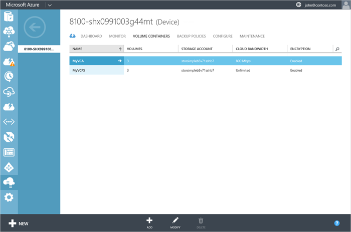

<properties 
   pageTitle="Verwalten Ihrer StorSimple Lautstärke Container | Microsoft Azure"
   description="Erläutert, wie Sie mithilfe der StorSimple Manager Service Lautstärke Container Seite hinzufügen, ändern oder Löschen eines Containers Lautstärke können."
   services="storsimple"
   documentationCenter="NA"
   authors="SharS"
   manager="carmonm"
   editor="" />
<tags 
   ms.service="storsimple"
   ms.devlang="NA"
   ms.topic="article"
   ms.tgt_pltfrm="NA"
   ms.workload="TBD"
   ms.date="05/24/2016"
   ms.author="v-sharos" />

# Mit dem StorSimple Volumen Container verwalten der StorSimple Manager-Dienst

## (Übersicht)

In diesem Lernprogramm wird erläutert, wie den StorSimple Manager-Dienst verwenden, erstellen und Verwalten von StorSimple Lautstärke Container.

Ein Containers Lautstärke in einem Microsoft Azure StorSimple Gerät enthält eine oder mehrere Datenmengen, die Speicher-Konto, Verschlüsselung und Bandbreite Verbrauch Einstellungen freigeben. Ein Gerät kann mehrere Lautstärke Container für alle ihre Datenträger besitzen. 

Volumen Container weist die folgenden Attribute:

- **Datenmengen** – die gestuften oder lokal angehefteten StorSimple Datenmengen, die innerhalb der Lautstärke Container enthalten sind. Volumen Container kann bis zu 256 StorSimple Datenmengen enthalten.

- **Verschlüsselung** – einen Schlüssel, die definiert werden, kann für jeden Volume Container. Dieser Schlüssel wird verwendet, für die Verschlüsselung der Daten, die in der Cloud auf Ihrem Gerät StorSimple gesendet wird. Ein Militärstandard AES-256-Bit-Schlüssel wird mit dem eingegebenen Schlüssel verwendet. Um Ihre Daten zu sichern, wird empfohlen, dass Sie immer die Cloud-Speicher Verschlüsselung aktivieren.

- **Speicher-Konto** – Speicherkontos, der mit der Cloud-Service-Anbieter verknüpft ist. Alle Datenträger, die in einem Container Lautstärke Freigeben dieses Speicherkonto an. Sie können ein Speicherkonto aus einer vorhandenen Liste auswählen oder ein neues Konto erstellen, wenn Sie den Lautstärke Container erstellen, und geben Sie dann die Anmeldeinformationen für den Zugriff für dieses Konto.

- **Cloud Bandbreite** – die Bandbreite, die das Gerät, wenn die Daten aus dem Gerät in der Cloud gesendet werden. Sie können ein Steuerelement Bandbreite erzwingen, indem Sie einen Wert zwischen 1 und 1000/s, wenn Sie diesen Container definieren. Wenn Sie das Gerät, um alle verfügbaren Bandbreite nutzen möchten, legen Sie dieses Feld auf unbeschränkt. Sie können auch erstellen und Anwenden einer Vorlage Bandbreite um Bandbreite basierend auf Zeitplan zugeordnet werden soll.

In folgenden Verfahren erläutert, wie die Seite StorSimple **Lautstärke Container** verwendet die folgenden allgemeinen Vorgänge ausführen:

- Hinzufügen eines Containers Lautstärke 
- Ändern eines Containers Lautstärke 
- Löschen eines Containers Lautstärke 

## Hinzufügen eines Containers Lautstärke

Führen Sie die folgenden Schritte aus, um einen Container Lautstärke hinzuzufügen.

[AZURE.INCLUDE [storsimple-add-volume-container](../../includes/storsimple-add-volume-container.md)]

## Ändern eines Containers Lautstärke

Führen Sie die folgenden Schritte aus, um einen Container Lautstärke ändern.

[AZURE.INCLUDE [storsimple-modify-volume-container](../../includes/storsimple-modify-volume-container.md)]

## Löschen eines Containers Lautstärke

Ein Containers Lautstärke weist Datenmengen darin an. Sie können nur, wenn alle darin enthaltenen Datenträger zuerst gelöscht werden gelöscht. Führen Sie die folgenden Schritte aus, um das Löschen eines Containers Lautstärke ein.

[AZURE.INCLUDE [storsimple-delete-volume-container](../../includes/storsimple-delete-volume-container.md)]

## Nächste Schritte

- Weitere Informationen zum [Verwalten von StorSimple Datenmengen](storsimple-manage-volumes.md). 
- Weitere Informationen zum [Verwenden des Diensts StorSimple Manager zum Verwalten von Ihrem Geräts StorSimple](storsimple-manager-service-administration.md).
